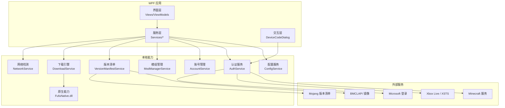
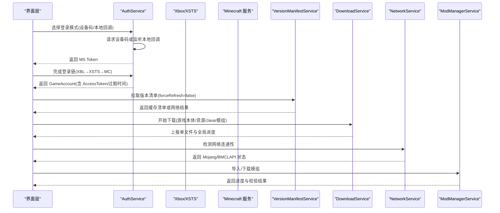
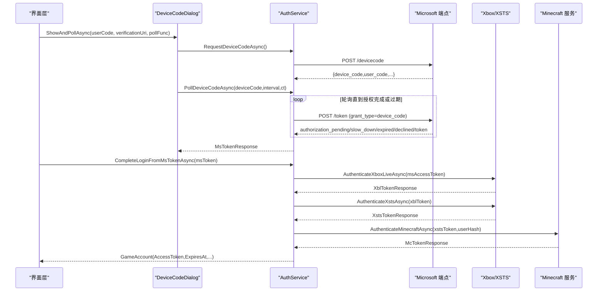
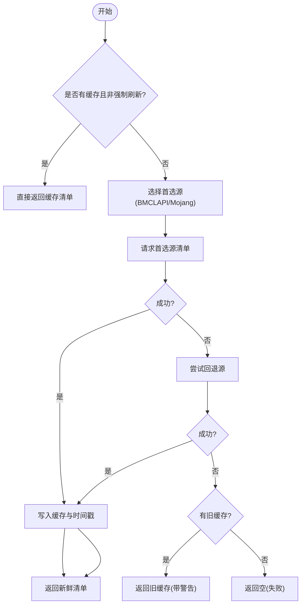
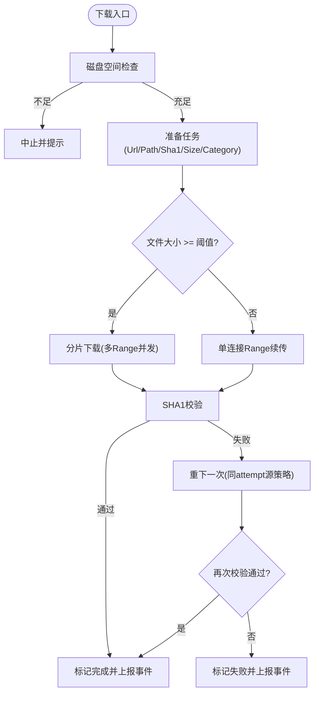
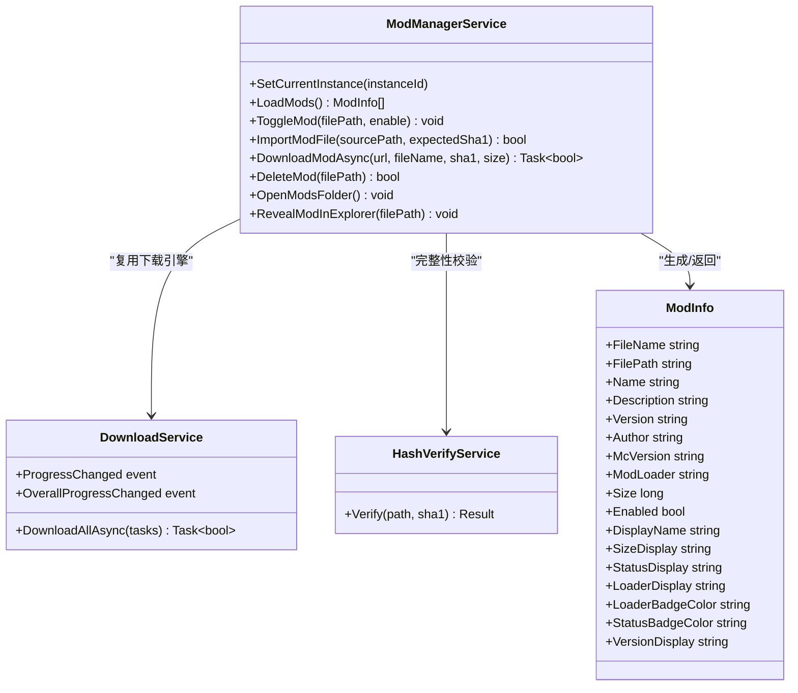
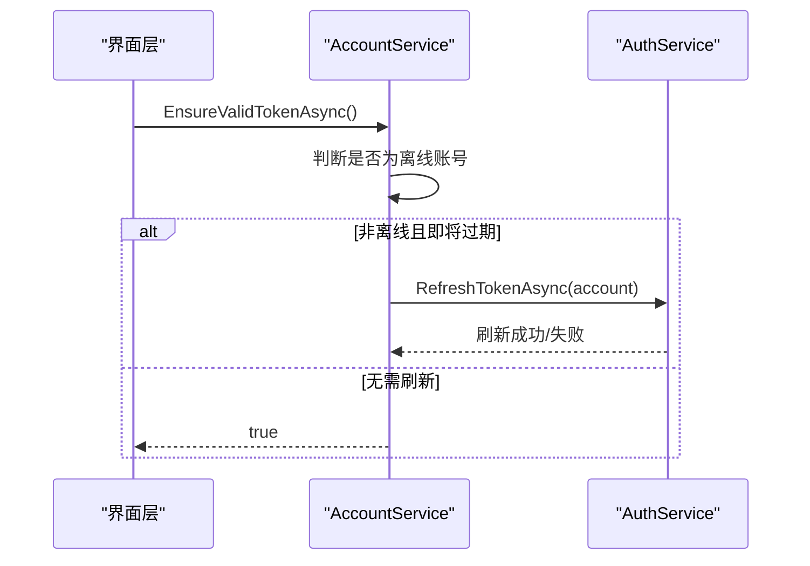
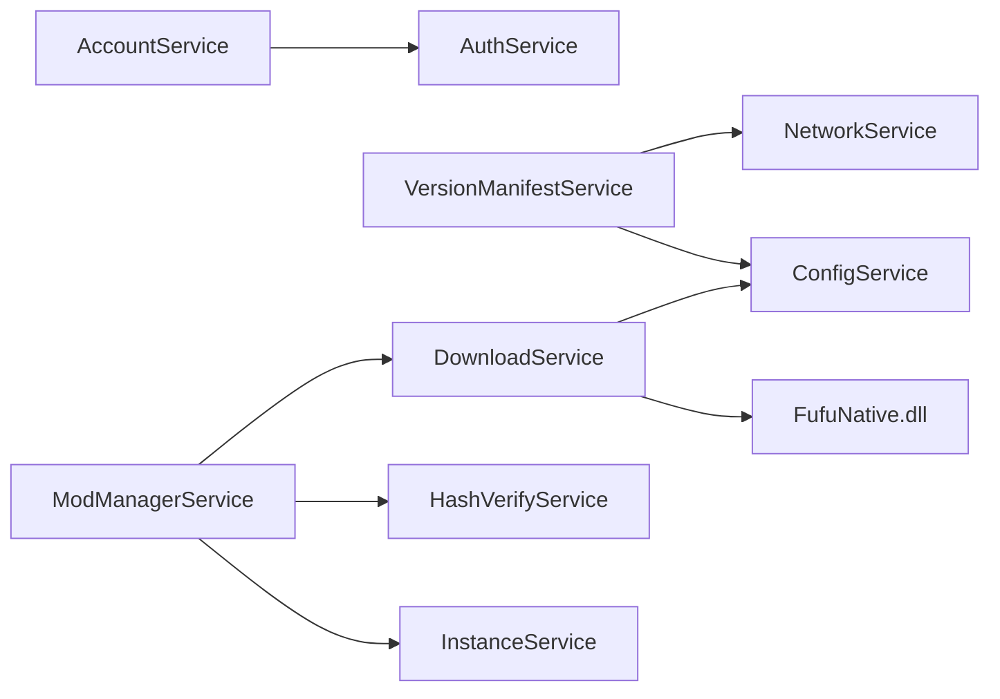

# 集成示例

<cite>
**本文引用的文件**
- [AuthService.cs](file://src/FufuLauncher/Services/AuthService.cs)
- [AccountService.cs](file://src/FufuLauncher/Services/AccountService.cs)
- [DeviceCodeDialog.cs](file://src/FufuLauncher/Interaction/DeviceCodeDialog.cs)
- [VersionManifestService.cs](file://src/FufuLauncher/Services/VersionManifestService.cs)
- [DownloadService.cs](file://src/FufuLauncher/Services/DownloadService.cs)
- [NetworkService.cs](file://src/FufuLauncher/Services/NetworkService.cs)
- [ConfigService.cs](file://src/FufuLauncher/Services/ConfigService.cs)
- [ModManagerService.cs](file://src/FufuLauncher/Services/ModManagerService.cs)
- [FufuLauncher.csproj](file://src/FufuLauncher/FufuLauncher.csproj)
- [README.md](file://README.md)
</cite>

## 目录
1. [简介](#简介)
2. [项目结构](#项目结构)
3. [核心组件](#核心组件)
4. [架构总览](#架构总览)
5. [详细组件分析](#详细组件分析)
6. [依赖关系分析](#依赖关系分析)
7. [性能考虑](#性能考虑)
8. [故障排查指南](#故障排查指南)
9. [结论](#结论)
10. [附录](#附录)

## 简介
本文件面向“可爱的芙芙”启动器的第三方服务集成，提供微软认证（设备码登录与本地回调登录）的完整流程示例；展示版本管理服务（Mojang/BMCLAPI）的清单获取与文件下载；说明模组仓库集成的 API 调用与数据解析模式；给出缓存策略、错误处理与重试逻辑；并提供测试用例与模拟数据的准备方法，以及扩展新第三方服务的最佳实践。

## 项目结构
- 语言与框架：C# WPF (.NET 8)，原生 C++ DLL 用于哈希与解压
- 关键目录：
  - src/FufuLauncher/Services：业务服务（账号、网络、下载、版本清单、模组等）
  - src/FufuLauncher/Interaction：交互弹窗（设备码登录）
  - native/FufuNative：C++ 原生库（SHA1/ZIP）
- 构建产物与运行依赖见 README

**图表来源**
- [FufuLauncher.csproj:1-49](file://src/FufuLauncher/FufuLauncher.csproj#L1-L49)
- [README.md:34-53](file://README.md#L34-L53)

**章节来源**
- [FufuLauncher.csproj:1-49](file://src/FufuLauncher/FufuLauncher.csproj#L1-L49)
- [README.md:1-87](file://README.md#L1-L87)

## 核心组件
- 认证服务（AuthService）：实现微软 OAuth 设备码与本地回调两种登录方式，完成 XBL→XSTS→MC 令牌链，支持离线账号与令牌刷新
- 账号管理（AccountService）：多账号列表、切换、删除与启动前令牌有效性校验
- 版本清单（VersionManifestService）：拉取并缓存 Mojang/BMCLAPI 版本清单，按类型筛选与搜索，URL 重写适配镜像源
- 下载引擎（DownloadService）：多线程分片断点续传、双进度、失败重试、SHA1 校验、官方/镜像源自动降级
- 网络检测（NetworkService）：探测 Mojang 与 BMCLAPI 连通性与延迟
- 模组管理（ModManagerService）：读取/导入/下载模组，解析 Fabric/Forge/Quilt 元数据，复用下载引擎
- 配置服务（ConfigService）：集中持久化用户设置（主题、下载源、Java、JVM 参数、背景等）

**章节来源**
- [AuthService.cs:1-683](file://src/FufuLauncher/Services/AuthService.cs#L1-L683)
- [AccountService.cs:1-54](file://src/FufuLauncher/Services/AccountService.cs#L1-L54)
- [VersionManifestService.cs:1-338](file://src/FufuLauncher/Services/VersionManifestService.cs#L1-L338)
- [DownloadService.cs:1-592](file://src/FufuLauncher/Services/DownloadService.cs#L1-L592)
- [NetworkService.cs:1-95](file://src/FufuLauncher/Services/NetworkService.cs#L1-L95)
- [ModManagerService.cs:1-381](file://src/FufuLauncher/Services/ModManagerService.cs#L1-L381)
- [ConfigService.cs:1-152](file://src/FufuLauncher/Services/ConfigService.cs#L1-L152)

## 架构总览
下图展示了从 UI 到各服务再到外部服务的整体调用关系，涵盖认证、版本清单、下载与模组管理等关键路径。

**图表来源**
- [AuthService.cs:158-398](file://src/FufuLauncher/Services/AuthService.cs#L158-L398)
- [VersionManifestService.cs:205-255](file://src/FufuLauncher/Services/VersionManifestService.cs#L205-L255)
- [DownloadService.cs:222-261](file://src/FufuLauncher/Services/DownloadService.cs#L222-L261)
- [NetworkService.cs:34-76](file://src/FufuLauncher/Services/NetworkService.cs#L34-L76)
- [ModManagerService.cs:252-324](file://src/FufuLauncher/Services/ModManagerService.cs#L252-L324)

## 详细组件分析

### 微软认证集成（设备码登录 + 本地回调登录）
- 设备码登录流程：
  - 请求设备码（client_id、scope），弹窗显示 user_code 与 verification_uri，自动复制剪贴板并打开浏览器
  - 后台轮询授权结果，支持取消与超时处理，成功返回 MS Token
- 本地回调登录流程：
  - 启动 HttpListener 监听 127.0.0.1:54321，构造授权 URL 并打开浏览器
  - 接收 code 与 state，交换为 MS Token
- 完整令牌链：MS access_token → XBL → XSTS → Minecraft access_token → 玩家资料
- 离线账号：仅保存昵称与确定性离线 UUID，不影响其他功能
- 令牌刷新：使用 refresh_token 重新走 XBL→XSTS→MC 链路，更新过期时间

**图表来源**
- [DeviceCodeDialog.cs:26-203](file://src/FufuLauncher/Interaction/DeviceCodeDialog.cs#L26-L203)
- [AuthService.cs:158-398](file://src/FufuLauncher/Services/AuthService.cs#L158-L398)

**章节来源**
- [AuthService.cs:158-398](file://src/FufuLauncher/Services/AuthService.cs#L158-L398)
- [AuthService.cs:420-468](file://src/FufuLauncher/Services/AuthService.cs#L420-L468)
- [AuthService.cs:475-643](file://src/FufuLauncher/Services/AuthService.cs#L475-L643)
- [DeviceCodeDialog.cs:26-203](file://src/FufuLauncher/Interaction/DeviceCodeDialog.cs#L26-L203)

### 版本管理服务（Mojang/BMCLAPI 清单与下载）
- 清单获取：
  - 优先根据配置选择首选源（BMCLAPI/Mojang），失败自动回退另一源
  - 内存缓存清单与最后更新时间，避免重复网络请求
- 版本 JSON 获取：
  - 通过 DownloadService.GetSourceUrl 同款规则重写 URL，保持与下载一致的镜像策略
- 过滤与搜索：
  - 按类型（release/snapshot/old_beta/old_alpha）过滤
  - 关键词模糊匹配 Id，支持按发布时间倒序或 Id 倒序
- 已安装判断：
  - 结合 InstanceService 判断某版本是否已安装

**图表来源**
- [VersionManifestService.cs:205-255](file://src/FufuLauncher/Services/VersionManifestService.cs#L205-L255)

**章节来源**
- [VersionManifestService.cs:172-338](file://src/FufuLauncher/Services/VersionManifestService.cs#L172-L338)

### 下载引擎（多线程分片断点续传与重试）
- 并发控制：按类别（Game/Asset/Java/Mod/Other）独立信号量互不阻塞
- 大文件分片：>=8MB 自动分片，多 Range 并发下载，预分配 .partial 文件
- 断点续传：小文件单连接 Range 续传，支持服务端不支持续传时的降级
- 失败重试：指数退避（默认 3 次），官方源失败自动降级到 BMCLAPI
- SHA1 校验：完成后校验，失败自动重下一次
- 双进度：单文件字节级进度 + 全局总进度（节流 150ms 平滑更新）

**图表来源**
- [DownloadService.cs:295-366](file://src/FufuLauncher/Services/DownloadService.cs#L295-L366)
- [DownloadService.cs:368-451](file://src/FufuLauncher/Services/DownloadService.cs#L368-L451)
- [DownloadService.cs:453-547](file://src/FufuLauncher/Services/DownloadService.cs#L453-L547)

**章节来源**
- [DownloadService.cs:1-592](file://src/FufuLauncher/Services/DownloadService.cs#L1-L592)

### 模组仓库集成（API 调用与数据解析）
- 本地模组扫描：
  - 读取 mods 目录下的 .jar/.disabled 文件，解析 fabric.mod.json/quilt.mod.json/META-INF/mods.toml 元数据
  - 生成 ModInfo（名称、描述、版本、作者、加载器、大小、启用状态）
- 导入与下载：
  - 支持拖拽 zip/jar 导入，可选 SHA1 校验
  - 复用 DownloadService 以 Category=Mod 独立队列下载，订阅进度事件
- 启用/禁用：
  - 通过重命名 .jar ↔ .disabled 实现，包含文件占用重试
- 打开文件夹与定位文件：
  - 打开实例 mods 目录或在资源管理器中选中具体文件

**图表来源**
- [ModManagerService.cs:23-72](file://src/FufuLauncher/Services/ModManagerService.cs#L23-L72)
- [ModManagerService.cs:98-131](file://src/FufuLauncher/Services/ModManagerService.cs#L98-L131)
- [ModManagerService.cs:252-324](file://src/FufuLauncher/Services/ModManagerService.cs#L252-L324)

**章节来源**
- [ModManagerService.cs:1-381](file://src/FufuLauncher/Services/ModManagerService.cs#L1-L381)

### 账号管理与令牌刷新
- 多账号管理：加载、保存、删除、当前账号切换
- 启动前校验：若当前账号为 Microsoft 且令牌即将过期，自动刷新并重走令牌链

**图表来源**
- [AccountService.cs:42-52](file://src/FufuLauncher/Services/AccountService.cs#L42-L52)
- [AuthService.cs:420-468](file://src/FufuLauncher/Services/AuthService.cs#L420-L468)

**章节来源**
- [AccountService.cs:1-54](file://src/FufuLauncher/Services/AccountService.cs#L1-L54)
- [AuthService.cs:420-468](file://src/FufuLauncher/Services/AuthService.cs#L420-L468)

### 网络连通性检测
- 检测目标：Mojang 官方源与 BMCLAPI 国内镜像源
- 返回连通状态与延迟，供 UI 展示与自动源切换参考

**章节来源**
- [NetworkService.cs:1-95](file://src/FufuLauncher/Services/NetworkService.cs#L1-L95)

### 配置服务（下载源与登录模式）
- 下载源：Mojang / BMCLAPI，影响清单与下载 URL 重写
- 登录模式：DeviceCode（默认）/ LocalCallback（备选）
- Java 与 JVM 参数、背景设置等统一持久化

**章节来源**
- [ConfigService.cs:1-152](file://src/FufuLauncher/Services/ConfigService.cs#L1-L152)

## 依赖关系分析
- 服务间耦合：
  - AccountService 依赖 AuthService
  - VersionManifestService 依赖 NetworkService 与 ConfigService
  - DownloadService 依赖 ConfigService 与 NativeInteropService（SHA1）
  - ModManagerService 依赖 InstanceService、DownloadService、HashVerifyService
- 外部依赖：
  - Microsoft 登录端点、Xbox/XSTS、Minecraft 服务
  - Mojang 版本清单与资源下载
  - BMCLAPI 镜像源

**图表来源**
- [AccountService.cs:1-54](file://src/FufuLauncher/Services/AccountService.cs#L1-L54)
- [VersionManifestService.cs:172-189](file://src/FufuLauncher/Services/VersionManifestService.cs#L172-L189)
- [DownloadService.cs:99-114](file://src/FufuLauncher/Services/DownloadService.cs#L99-L114)
- [ModManagerService.cs:84-91](file://src/FufuLauncher/Services/ModManagerService.cs#L84-L91)

**章节来源**
- [FufuLauncher.csproj:34-42](file://src/FufuLauncher/FufuLauncher.csproj#L34-L42)

## 性能考虑
- 清单缓存：VersionManifestService 内存缓存清单与时间戳，避免频繁网络请求
- 下载优化：
  - 大文件分片并发（>=8MB）
  - 断点续传减少重复下载
  - 指数退避与自动镜像源降级提升成功率
  - 全局进度节流 150ms，降低 UI 刷新压力
- 网络检测：短超时（8s）快速失败，避免卡死
- 令牌刷新：仅在必要时触发，减少额外开销

[本节为通用指导，不直接分析具体文件]

## 故障排查指南
- 登录失败：
  - 设备码过期或用户拒绝：查看 DeviceCodeDialog 与 AuthService 轮询分支
  - 未购买 Minecraft：GetMinecraftProfileAsync 返回 404 时抛出特定错误
  - 网络异常：HttpRequestException 被捕获并转换为 AuthError.Network
- 下载失败：
  - 磁盘空间不足：DownloadService.CheckDiskSpace 提前拦截
  - SHA1 校验失败：自动重下一次，仍失败则标记失败
  - 官方源超时：自动降级到 BMCLAPI
- 模组导入失败：
  - 文件占用：TryMoveFile 多次重试
  - 校验失败：删除临时文件并返回失败

**章节来源**
- [AuthService.cs:158-398](file://src/FufuLauncher/Services/AuthService.cs#L158-L398)
- [AuthService.cs:608-643](file://src/FufuLauncher/Services/AuthService.cs#L608-L643)
- [DownloadService.cs:222-261](file://src/FufuLauncher/Services/DownloadService.cs#L222-L261)
- [DownloadService.cs:264-293](file://src/FufuLauncher/Services/DownloadService.cs#L264-L293)
- [ModManagerService.cs:213-227](file://src/FufuLauncher/Services/ModManagerService.cs#L213-L227)

## 结论
本项目在第三方服务集成方面提供了完善的示例与实现：微软认证的双模式登录、版本清单的多源获取与缓存、下载引擎的高吞吐与高可靠、模组管理的灵活扩展。通过清晰的错误分类、重试与降级策略，以及模块化服务设计，开发者可快速扩展新的第三方服务集成。

[本节为总结，不直接分析具体文件]

## 附录

### 测试用例与模拟数据准备
- 单元测试建议：
  - 认证流程：模拟 Microsoft/XBL/XSTS/MC 响应（成功、404、网络异常、设备码过期）
  - 版本清单：模拟 Mojang/BMCLAPI 响应（成功、失败、回退）
  - 下载流程：模拟 Range 支持/不支持、分片下载、SHA1 校验成功/失败、重试与降级
  - 模组管理：模拟 jar 元数据解析、导入/下载、启用/禁用
- 模拟数据：
  - 使用固定 JSON 字符串模拟各端点响应
  - 使用内存流模拟文件下载与校验
  - 使用内存文件系统替代真实磁盘进行隔离测试

[本节为通用指导，不直接分析具体文件]

### 扩展新的第三方服务集成
- 步骤建议：
  - 新增 Service 类，封装 API 调用与数据解析
  - 复用 NetworkService 进行连通性检测
  - 复用 DownloadService 进行文件下载（设置合适的 Category）
  - 复用 ConfigService 存储相关配置
  - 增加错误分类与重试逻辑，遵循现有模式
  - 在 UI 层提供配置与反馈入口

[本节为通用指导，不直接分析具体文件]