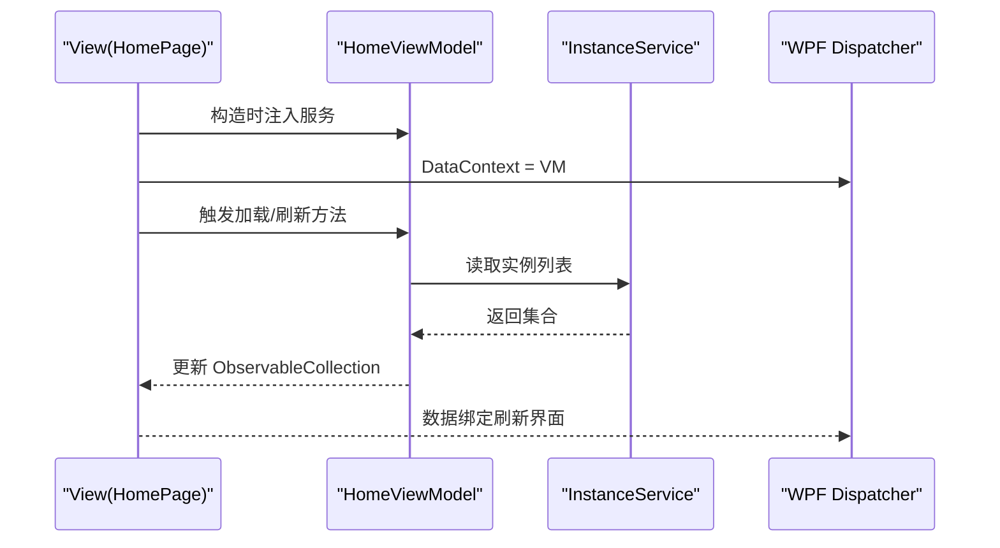
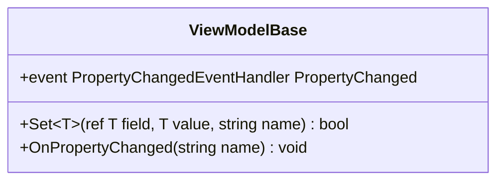
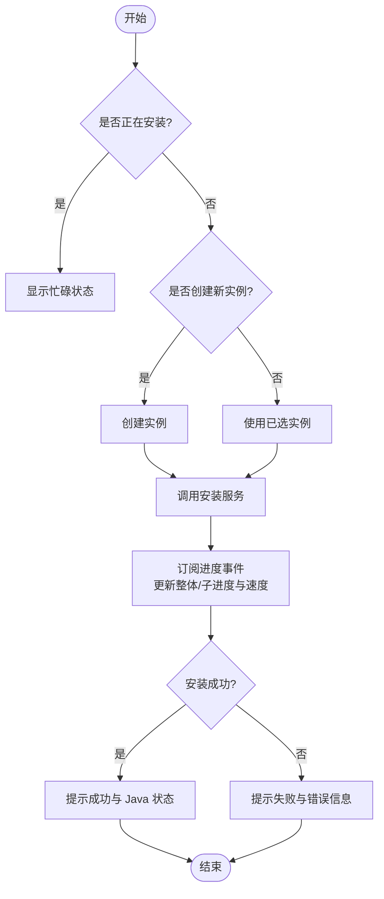
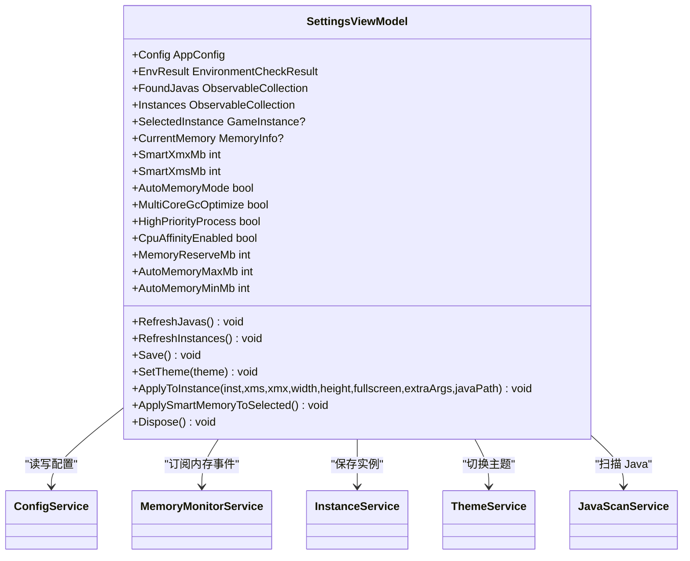
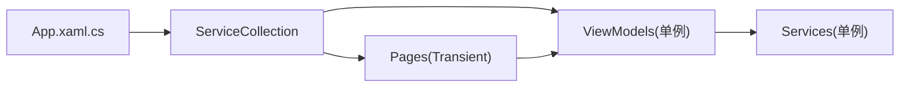

# ViewModel 实现模式

<cite>
**本文引用的文件**   
- [ViewModelBase.cs](file://src/FufuLauncher/ViewModels/ViewModelBase.cs)
- [MainViewModel.cs](file://src/FufuLauncher/ViewModels/MainViewModel.cs)
- [HomeViewModel.cs](file://src/FufuLauncher/ViewModels/HomeViewModel.cs)
- [AccountViewModel.cs](file://src/FufuLauncher/ViewModels/AccountViewModel.cs)
- [SettingsViewModel.cs](file://src/FufuLauncher/ViewModels/SettingsViewModel.cs)
- [DownloadViewModel.cs](file://src/FufuLauncher/ViewModels/DownloadViewModel.cs)
- [InstancesViewModel.cs](file://src/FufuLauncher/ViewModels/InstancesViewModel.cs)
- [ModsViewModel.cs](file://src/FufuLauncher/ViewModels/ModsViewModel.cs)
- [SavesViewModel.cs](file://src/FufuLauncher/ViewModels/SavesViewModel.cs)
- [ConfigService.cs](file://src/FufuLauncher/Services/ConfigService.cs)
- [App.xaml.cs](file://src/FufuLauncher/App.xaml.cs)
- [HomePage.xaml.cs](file://src/FufuLauncher/Views/HomePage.xaml.cs)
</cite>

## 目录
1. [简介](#简介)
2. [项目结构](#项目结构)
3. [核心组件](#核心组件)
4. [架构总览](#架构总览)
5. [详细组件分析](#详细组件分析)
6. [依赖关系分析](#依赖关系分析)
7. [性能考量](#性能考量)
8. [故障排查指南](#故障排查指南)
9. [结论](#结论)
10. [附录：数据绑定与命令最佳实践](#附录数据绑定与命令最佳实践)

## 简介
本文件面向“可爱的芙芙”启动器的 MVVM 层，系统性梳理 ViewModel 的职责、属性通知、命令处理、状态管理与异步操作模式。重点说明 ViewModelBase 基类的设计与使用，记录数据绑定的最佳实践（含 getter/setter 与性能优化），并给出完整的 ViewModel 实现示例路径，帮助读者快速掌握在 WPF 中构建可维护、高性能的 UI 逻辑层。

## 项目结构
MVVM 层位于 src/FufuLauncher/ViewModels，所有 ViewModel 均继承自统一的基类 ViewModelBase，并通过构造函数注入 Services 层的服务。视图（Views）通过 DI 容器获取 ViewModel 实例并设置 DataContext，完成数据绑定。

```mermaid
graph TB
subgraph "视图层(Views)"
HomePage["HomePage.xaml.cs"]
MainWindow["MainWindow.xaml.cs"]
end
subgraph "视图模型(ViewModels)"
MainVM["MainViewModel"]
HomeVM["HomeViewModel"]
DownloadVM["DownloadViewModel"]
InstancesVM["InstancesViewModel"]
AccountVM["AccountViewModel"]
ModsVM["ModsViewModel"]
SavesVM["SavesViewModel"]
SettingsVM["SettingsViewModel"]
Base["ViewModelBase"]
end
subgraph "服务层(Services)"
ConfigSvc["ConfigService"]
InstanceSvc["InstanceService"]
ModSvc["ModManagerService"]
DownloadSvc["DownloadService"]
VersionManifestSvc["VersionManifestService"]
GameInstallSvc["GameInstallService"]
SaveMgrSvc["SaveManagerService"]
MemoryMonitorSvc["MemoryMonitorService"]
end
HomePage --> HomeVM
MainWindow --> MainVM
HomeVM --> InstanceSvc
DownloadVM --> DownloadSvc
DownloadVM --> VersionManifestSvc
DownloadVM --> GameInstallSvc
InstancesVM --> InstanceSvc
AccountVM --> InstanceSvc
ModsVM --> ModSvc
SavesVM --> SaveMgrSvc
SettingsVM --> ConfigSvc
SettingsVM --> MemoryMonitorSvc
MainVM --> Base
HomeVM --> Base
DownloadVM --> Base
InstancesVM --> Base
AccountVM --> Base
ModsVM --> Base
SavesVM --> Base
SettingsVM --> Base
```

图表来源
- [App.xaml.cs:131-178](file://src/FufuLauncher/App.xaml.cs#L131-L178)
- [HomePage.xaml.cs:27-41](file://src/FufuLauncher/Views/HomePage.xaml.cs#L27-L41)

章节来源
- [App.xaml.cs:131-178](file://src/FufuLauncher/App.xaml.cs#L131-L178)
- [HomePage.xaml.cs:27-41](file://src/FufuLauncher/Views/HomePage.xaml.cs#L27-L41)

## 核心组件
- ViewModelBase：统一实现 INotifyPropertyChanged，提供 Set<T> 与 OnPropertyChanged 封装，简化属性变更通知。
- 各页面 ViewModel：围绕业务服务进行状态管理、数据集合暴露、用户交互与异步流程编排。
- 配置与服务：ConfigService 等负责持久化与外部交互；ViewModel 仅持有引用，不直接访问文件系统或网络。

章节来源
- [ViewModelBase.cs:7-21](file://src/FufuLauncher/ViewModels/ViewModelBase.cs#L7-L21)
- [ConfigService.cs:81-148](file://src/FufuLauncher/Services/ConfigService.cs#L81-L148)

## 架构总览
MVVM 分层清晰：View 只负责展示与事件转发，ViewModel 负责状态与交互，Service 负责领域逻辑与外部系统。DI 容器负责生命周期与依赖注入，确保松耦合与可测试性。

图表来源
- [HomePage.xaml.cs:27-41](file://src/FufuLauncher/Views/HomePage.xaml.cs#L27-L41)
- [InstancesViewModel.cs:20-32](file://src/FufuLauncher/ViewModels/InstancesViewModel.cs#L20-L32)

## 详细组件分析

### ViewModelBase 基类
- 职责：实现 INotifyPropertyChanged，提供 Set<T> 通用赋值与通知方法，减少样板代码。
- 设计要点：
  - 使用 CallerMemberName 自动推断属性名，避免硬编码字符串。
  - 值相等判断避免无意义通知，降低 UI 重绘开销。
  - OnPropertyChanged 为受保护方法，便于子类扩展。

图表来源
- [ViewModelBase.cs:7-21](file://src/FufuLauncher/ViewModels/ViewModelBase.cs#L7-L21)

章节来源
- [ViewModelBase.cs:7-21](file://src/FufuLauncher/ViewModels/ViewModelBase.cs#L7-L21)

### MainViewModel
- 职责：主窗口状态文本与应用版本信息展示。
- 特点：简单属性绑定，版本号从程序集反射读取，避免硬编码。

章节来源
- [MainViewModel.cs:8-24](file://src/FufuLauncher/ViewModels/MainViewModel.cs#L8-L24)

### HomeViewModel
- 职责：主页欢迎信息与版本信息展示。
- 特点：与 MainViewModel 类似，保持简洁的数据展示。

章节来源
- [HomeViewModel.cs:8-24](file://src/FufuLauncher/ViewModels/HomeViewModel.cs#L8-L24)

### AccountViewModel
- 职责：账号列表与当前账号选择。
- 关键点：
  - 使用 ObservableCollection 暴露账号集合，支持 UI 双向绑定。
  - CurrentAccount 通过 Set<T> 实现属性变更通知。
  - Refresh() 从 AccountService 同步数据到集合。

章节来源
- [AccountViewModel.cs:7-34](file://src/FufuLauncher/ViewModels/AccountViewModel.cs#L7-L34)

### InstancesViewModel
- 职责：游戏实例列表与选中项管理。
- 关键点：
  - Instances 集合由 InstanceService 驱动。
  - SelectedInstance 支持双向绑定，用于后续操作。

章节来源
- [InstancesViewModel.cs:7-32](file://src/FufuLauncher/ViewModels/InstancesViewModel.cs#L7-L32)

### SavesViewModel
- 职责：存档列表加载与展示。
- 关键点：Load(instanceId) 根据实例 ID 加载对应存档集合。

章节来源
- [SavesViewModel.cs:7-22](file://src/FufuLauncher/ViewModels/SavesViewModel.cs#L7-L22)

### ModsViewModel
- 职责：模组管理（搜索、过滤、启用/禁用、下载、导入）。
- 关键点：
  - SearchKeyword 变化触发 ApplyFilter() 动态过滤。
  - IsBusy、StatusText、DownloadProgress 反映后台任务状态。
  - 下载进度事件通过 Dispatcher.BeginInvoke 切回 UI 线程更新。

章节来源
- [ModsViewModel.cs:11-188](file://src/FufuLauncher/ViewModels/ModsViewModel.cs#L11-L188)

### DownloadViewModel
- 职责：版本清单加载、分类展示、下载与安装流程控制。
- 关键点：
  - 订阅 DownloadService 与 GameInstallService 的事件，更新 UI 进度与状态。
  - LoadVersionsAsync/RefreshVersionsAsync 异步拉取清单，支持缓存与错误提示。
  - DownloadAndInstallAsync 完整流程：创建实例、下载、安装、Java 自动下载提示。

图表来源
- [DownloadViewModel.cs:218-304](file://src/FufuLauncher/ViewModels/DownloadViewModel.cs#L218-L304)

章节来源
- [DownloadViewModel.cs:10-307](file://src/FufuLauncher/ViewModels/DownloadViewModel.cs#L10-L307)

### SettingsViewModel
- 职责：设置页核心逻辑，包括内存监控、JVM 参数、主题、实例应用等。
- 关键点：
  - 订阅 MemoryMonitorService.Updated 事件，定时更新 CurrentMemory。
  - SmartXmx/SmartXms 计算结果缓存，避免频繁 P/Invoke 导致性能问题。
  - AutoMemoryMode、MultiCoreGcOptimize 等开关直接映射到 ConfigService.Config。
  - ApplyToInstance/ApplySmartMemoryToSelected 将 UI 参数应用到实例并保存。
  - 实现 IDisposable，退订事件避免内存泄漏。

图表来源
- [SettingsViewModel.cs:20-251](file://src/FufuLauncher/ViewModels/SettingsViewModel.cs#L20-L251)
- [ConfigService.cs:81-148](file://src/FufuLauncher/Services/ConfigService.cs#L81-L148)

章节来源
- [SettingsViewModel.cs:20-251](file://src/FufuLauncher/ViewModels/SettingsViewModel.cs#L20-L251)
- [ConfigService.cs:81-148](file://src/FufuLauncher/Services/ConfigService.cs#L81-L148)

## 依赖关系分析
- ViewModel 与 Service 解耦：通过构造函数注入，便于单元测试与替换实现。
- DI 容器注册：App.xaml.cs 中集中注册单例 ViewModel 与 Transient 页面，确保生命周期正确。
- 事件驱动：DownloadViewModel、ModsViewModel、SettingsViewModel 通过订阅服务事件更新 UI，避免轮询。

图表来源
- [App.xaml.cs:131-178](file://src/FufuLauncher/App.xaml.cs#L131-L178)

章节来源
- [App.xaml.cs:131-178](file://src/FufuLauncher/App.xaml.cs#L131-L178)

## 性能考量
- 属性通知优化：ViewModelBase.Set<T> 仅在值变化时触发通知，减少 UI 重绘。
- 缓存计算结果：SettingsViewModel 缓存 SmartXmx/SmartXms，避免每次 getter 都执行 P/Invoke。
- 线程安全：后台事件通过 Dispatcher.BeginInvoke 切回 UI 线程，避免跨线程异常。
- 集合更新：使用 ObservableCollection 批量 Clear/Add，减少中间状态闪烁。
- 日志与 IO：App 层使用队列与定时器批量写入日志，避免高频 IO 阻塞。

章节来源
- [ViewModelBase.cs:11-17](file://src/FufuLauncher/ViewModels/ViewModelBase.cs#L11-L17)
- [SettingsViewModel.cs:45-73](file://src/FufuLauncher/ViewModels/SettingsViewModel.cs#L45-L73)
- [DownloadViewModel.cs:78-146](file://src/FufuLauncher/ViewModels/DownloadViewModel.cs#L78-L146)
- [App.xaml.cs:33-60](file://src/FufuLauncher/App.xaml.cs#L33-L60)

## 故障排查指南
- 下载失败：检查 DownloadViewModel.StatusText 与 LastError，确认网络与下载源配置。
- 内存监控空白：确认 MemoryMonitorService.Start() 已调用，且 SettingsViewModel.CurrentMemory 有值。
- 事件未更新：检查是否正确订阅服务事件，并在 UI 线程更新属性。
- 配置未保存：确认 SettingsViewModel.Save() 被调用，且 ConfigService.Save() 无异常。

章节来源
- [DownloadViewModel.cs:157-193](file://src/FufuLauncher/ViewModels/DownloadViewModel.cs#L157-L193)
- [SettingsViewModel.cs:186-194](file://src/FufuLauncher/ViewModels/SettingsViewModel.cs#L186-L194)
- [ConfigService.cs:135-146](file://src/FufuLauncher/Services/ConfigService.cs#L135-L146)

## 结论
该项目的 MVVM 实现遵循标准模式：ViewModelBase 统一属性通知，ViewModel 专注状态与交互，Service 处理领域逻辑。通过 DI 容器管理依赖，事件驱动更新 UI，结合缓存与线程切换优化性能。遵循本文档的最佳实践，可构建出高内聚、低耦合、易测试的 UI 逻辑层。

## 附录：数据绑定与命令最佳实践
- 属性定义：
  - 使用私有字段 + 公共属性，通过 Set<T> 赋值并触发通知。
  - 对于只读计算属性（如 AppVersion），直接在 getter 中计算，无需通知。
- 集合绑定：
  - 使用 ObservableCollection<T> 暴露集合，避免手动实现 INotifyCollectionChanged。
  - 批量更新集合时，先 Clear() 再 Add()，减少 UI 重绘次数。
- 命令处理：
  - 若需复杂命令逻辑，可引入 RelayCommand 或类似模式，封装 CanExecute 与 Execute。
  - 命令应调用 ViewModel 方法，避免在 View 中编写业务逻辑。
- 异步操作：
  - 使用 async/await 模式，避免阻塞 UI 线程。
  - 在后台事件中，使用 Dispatcher.BeginInvoke 切回 UI 线程更新属性。
  - 捕获异常并友好提示，避免崩溃。
- 资源管理：
  - 实现 IDisposable 接口，在 Dispose 中退订事件，防止内存泄漏。
  - 长生命周期对象（如 Singleton ViewModel）需谨慎管理事件订阅。

章节来源
- [ViewModelBase.cs:11-17](file://src/FufuLauncher/ViewModels/ViewModelBase.cs#L11-L17)
- [SettingsViewModel.cs:247-251](file://src/FufuLauncher/ViewModels/SettingsViewModel.cs#L247-L251)
- [DownloadViewModel.cs:78-146](file://src/FufuLauncher/ViewModels/DownloadViewModel.cs#L78-L146)