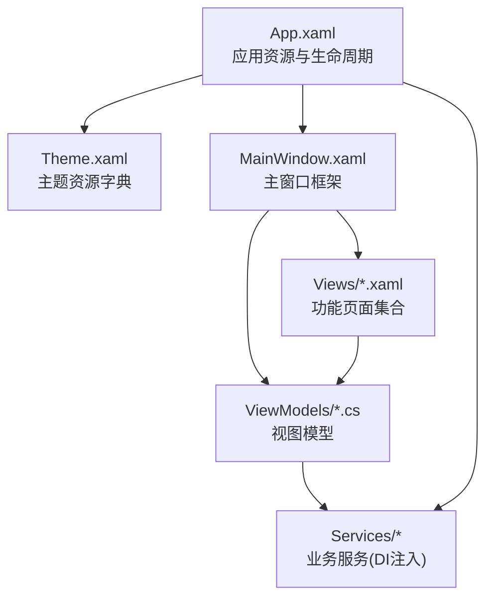
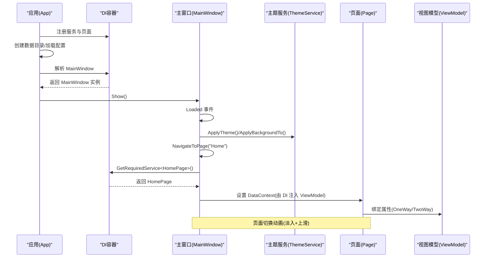
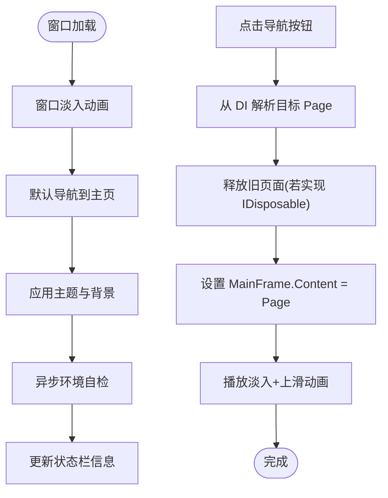
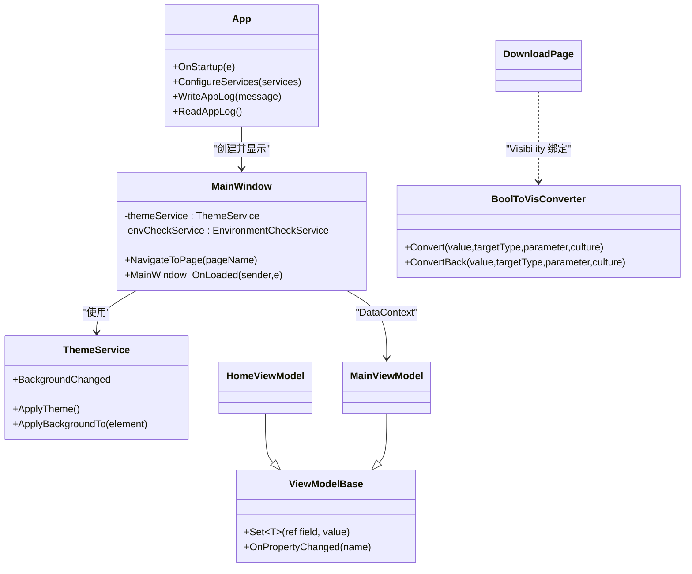

# XAML 界面设计

<cite>
**本文引用的文件**   
- [App.xaml](file://src/FufuLauncher/App.xaml)
- [App.xaml.cs](file://src/FufuLauncher/App.xaml.cs)
- [MainWindow.xaml](file://src/FufuLauncher/MainWindow.xaml)
- [MainWindow.xaml.cs](file://src/FufuLauncher/MainWindow.xaml.cs)
- [Theme.xaml](file://src/FufuLauncher/Themes/Theme.xaml)
- [HomePage.xaml](file://src/FufuLauncher/Views/HomePage.xaml)
- [SettingsPage.xaml](file://src/FufuLauncher/Views/SettingsPage.xaml)
- [DownloadPage.xaml](file://src/FufuLauncher/Views/DownloadPage.xaml)
- [InstancesPage.xaml](file://src/FufuLauncher/Views/InstancesPage.xaml)
- [AccountPage.xaml](file://src/FufuLauncher/Views/AccountPage.xaml)
- [BoolToVisConverter.cs](file://src/FufuLauncher/Converters/BoolToVisConverter.cs)
- [MainViewModel.cs](file://src/FufuLauncher/ViewModels/MainViewModel.cs)
- [HomeViewModel.cs](file://src/FufuLauncher/ViewModels/HomeViewModel.cs)
- [ViewModelBase.cs](file://src/FufuLauncher/ViewModels/ViewModelBase.cs)
</cite>

## 目录
1. [简介](#简介)
2. [项目结构](#项目结构)
3. [核心组件](#核心组件)
4. [架构总览](#架构总览)
5. [详细组件分析](#详细组件分析)
6. [依赖关系分析](#依赖关系分析)
7. [性能考量](#性能考量)
8. [故障排查指南](#故障排查指南)
9. [结论](#结论)
10. [附录](#附录)

## 简介
本文件面向“可爱的芙芙”启动器的 WPF XAML 界面设计与实现，系统性说明：
- XAML 文件结构与语法（控件定义、布局管理、样式绑定、事件处理）
- 页面布局最佳实践（响应式、资源字典与主题定制）
- 常用控件使用要点（按钮、文本框、下拉框、进度条等）
- 数据绑定实现（双向绑定、命令绑定、验证规则思路）
- 完整示例路径（通过源码引用展示如何构建用户友好的游戏启动器界面）

## 项目结构
本项目采用 MVVM + DI 的 WPF 应用结构：
- App.xaml/App.xaml.cs：应用入口、全局资源合并、DI 容器初始化、异常捕获、日志缓冲
- MainWindow.xaml/.cs：主窗口框架、自定义标题栏、导航切换、背景层与主题服务集成
- Themes/Theme.xaml：统一主题资源字典（颜色、控件样式、滚动条、列表项、弹窗容器等）
- Views/*.xaml：各功能页（主页、下载、实例、账号、设置等），以 Page 形式在 Frame 中导航
- ViewModels/*.cs：视图模型，继承 ViewModelBase 提供属性变更通知
- Converters/*.cs：值转换器（如布尔转可见性）

图表来源
- [App.xaml:1-13](file://src/FufuLauncher/App.xaml#L1-L13)
- [Theme.xaml:1-602](file://src/FufuLauncher/Themes/Theme.xaml#L1-L602)
- [MainWindow.xaml:1-139](file://src/FufuLauncher/MainWindow.xaml#L1-L139)

章节来源
- [App.xaml:1-13](file://src/FufuLauncher/App.xaml#L1-L13)
- [App.xaml.cs:75-117](file://src/FufuLauncher/App.xaml.cs#L75-L117)
- [MainWindow.xaml:1-139](file://src/FufuLauncher/MainWindow.xaml#L1-L139)

## 核心组件
- 应用资源与主题
  - 通过 Application.Resources 合并主题资源字典，确保全应用动态资源生效。
  - 主题包含深浅色板、控件样式、卡片、按钮、输入控件、滚动条、标签页、弹窗容器等。
- 主窗口与导航
  - 自定义无边框窗口，含可拖拽标题栏、最小化/最大化/关闭按钮。
  - 左侧导航 RadioButton 组，右侧 Frame 承载 Page；通过 NavigateToPage 切换并播放淡入+上滑动画。
- 页面与数据绑定
  - 各页面使用 DataBinding 将 UI 与 ViewModel 属性关联，支持 OneWay/TwoWay 绑定。
  - 使用值转换器控制可见性等显示逻辑。
- 服务与依赖注入
  - 通过 Microsoft.Extensions.DependencyInjection 注册服务与页面，按需获取实例，避免硬编码耦合。

章节来源
- [App.xaml:5-11](file://src/FufuLauncher/App.xaml#L5-L11)
- [Theme.xaml:1-602](file://src/FufuLauncher/Themes/Theme.xaml#L1-L602)
- [MainWindow.xaml:54-116](file://src/FufuLauncher/MainWindow.xaml#L54-L116)
- [MainWindow.xaml.cs:128-186](file://src/FufuLauncher/MainWindow.xaml.cs#L128-L186)
- [BoolToVisConverter.cs:9-18](file://src/FufuLauncher/Converters/BoolToVisConverter.cs#L9-L18)

## 架构总览
下图展示了从应用启动到页面渲染与交互的关键流程，以及主题与背景的加载机制。

图表来源
- [App.xaml.cs:99-117](file://src/FufuLauncher/App.xaml.cs#L99-L117)
- [MainWindow.xaml.cs:38-73](file://src/FufuLauncher/MainWindow.xaml.cs#L38-L73)
- [MainWindow.xaml.cs:128-186](file://src/FufuLauncher/MainWindow.xaml.cs#L128-L186)

## 详细组件分析

### 主题与资源字典（Theme.xaml）
- 颜色与画刷
  - 定义 Primary/Accent/Danger/Success/Warning 等语义色，并提供对应 Brush。
  - 浅色/深色两套基础色板，当前主题通过 Key 覆盖（AppBackground/AppForeground/CardBackground 等）。
- 文本与卡片
  - TitleText/SubTitleText/HintText/MonoText 统一字体与前景。
  - Card 样式提供圆角、阴影、内边距与边框。
- 按钮系列
  - PrimaryButton：主按钮，hover 缩放与透明度变化。
  - SecondaryButton：描边透明风格，hover 填充主色。
  - DangerButton：危险操作红色风格。
  - TitleBarButton/TitleBarCloseButton：标题栏按钮样式，关闭 hover 变红。
- 输入控件
  - FufuTextBox/FufuComboBox/FufuCheckBox/FufuRadioButton：统一外观与焦点态。
  - FufuSlider：自定义轨道与滑块样式。
  - FufuProgressBar：圆角指示器。
- 列表与滚动
  - VersionListItem：选中/悬停高亮。
  - FufuScrollBar/FufuScrollViewer：细窄半透明滚动条。
- 标签页与弹窗
  - FufuTabItem：选中下划线与背景高亮。
  - DialogRoot：弹窗容器圆角与阴影。

章节来源
- [Theme.xaml:12-51](file://src/FufuLauncher/Themes/Theme.xaml#L12-L51)
- [Theme.xaml:54-91](file://src/FufuLauncher/Themes/Theme.xaml#L54-L91)
- [Theme.xaml:94-177](file://src/FufuLauncher/Themes/Theme.xaml#L94-L177)
- [Theme.xaml:184-228](file://src/FufuLauncher/Themes/Theme.xaml#L184-L228)
- [Theme.xaml:231-272](file://src/FufuLauncher/Themes/Theme.xaml#L231-L272)
- [Theme.xaml:275-311](file://src/FufuLauncher/Themes/Theme.xaml#L275-L311)
- [Theme.xaml:314-323](file://src/FufuLauncher/Themes/Theme.xaml#L314-L323)
- [Theme.xaml:326-363](file://src/FufuLauncher/Themes/Theme.xaml#L326-L363)
- [Theme.xaml:366-397](file://src/FufuLauncher/Themes/Theme.xaml#L366-L397)
- [Theme.xaml:400-444](file://src/FufuLauncher/Themes/Theme.xaml#L400-L444)
- [Theme.xaml:447-462](file://src/FufuLauncher/Themes/Theme.xaml#L447-L462)
- [Theme.xaml:465-489](file://src/FufuLauncher/Themes/Theme.xaml#L465-L489)
- [Theme.xaml:492-534](file://src/FufuLauncher/Themes/Theme.xaml#L492-L534)
- [Theme.xaml:536-555](file://src/FufuLauncher/Themes/Theme.xaml#L536-L555)
- [Theme.xaml:558-586](file://src/FufuLauncher/Themes/Theme.xaml#L558-L586)
- [Theme.xaml:589-599](file://src/FufuLauncher/Themes/Theme.xaml#L589-L599)

### 主窗口与导航（MainWindow.xaml/.cs）
- 窗口外观
  - 无边框、允许透明、圆角外边框与阴影，背景层用于图片/视频。
  - 标题栏自定义，支持拖动与双击最大化。
- 导航与内容区
  - 左侧 RadioButton 导航组，右侧 Frame 承载 Page。
  - 状态栏显示状态信息与版本字符串（绑定 AppVersion）。
- 页面切换
  - 通过 NavigateToPage 从 DI 获取 Page，释放旧页面（IDisposable），并执行淡入+上滑动画。
- 背景与主题
  - 应用主题与背景，订阅 BackgroundChanged 事件，最小化时暂停背景媒体。

图表来源
- [MainWindow.xaml.cs:38-73](file://src/FufuLauncher/MainWindow.xaml.cs#L38-L73)
- [MainWindow.xaml.cs:128-186](file://src/FufuLauncher/MainWindow.xaml.cs#L128-L186)

章节来源
- [MainWindow.xaml:1-139](file://src/FufuLauncher/MainWindow.xaml#L1-L139)
- [MainWindow.xaml.cs:38-97](file://src/FufuLauncher/MainWindow.xaml.cs#L38-L97)
- [MainWindow.xaml.cs:128-186](file://src/FufuLauncher/MainWindow.xaml.cs#L128-L186)

### 主页（HomePage.xaml）
- 布局与元素
  - Hero 区域：欢迎语与版本徽章。
  - 启动卡：实例选择 ComboBox、启动按钮、状态提示、完整性检测、Java 选择。
  - 快速开始指引：分步骤说明操作流程。
- 数据绑定
  - TextBlock 绑定 WelcomeText、AppVersion。
  - ComboBox 绑定 DisplayMemberPath 与 SelectionChanged 事件。
- 事件处理
  - 启动按钮 Click、完整性检测 Click、日志查看 Click、Java 选择 Change。

章节来源
- [HomePage.xaml:1-119](file://src/FufuLauncher/Views/HomePage.xaml#L1-L119)

### 设置页（SettingsPage.xaml）
- 功能分区
  - 下载源选择（BMCLAPI/Mojang）。
  - 背景设置（无/图片/视频）、透明度滑块、视频选项（静音、速度）。
  - 游戏参数同步、Java 路径、内存监控与智能分配、JVM 多核优化、分辨率设置、JVM 内存、开发者选项、环境自检结果、本机 Java 列表。
- 数据绑定
  - 大量 TwoWay 绑定（UpdateSourceTrigger=PropertyChanged）实时回写。
  - OneWay 绑定用于只读展示（如内存占用、推荐值、预览参数）。
- 事件处理
  - 各类 Checked/ValueChanged/TextChanged/Click 事件驱动逻辑。

章节来源
- [SettingsPage.xaml:1-350](file://src/FufuLauncher/Views/SettingsPage.xaml#L1-L350)

### 下载页（DownloadPage.xaml）
- 布局与元素
  - 顶部搜索与刷新按钮，类型图例。
  - TabControl 分组（全部/正式版/快照版/远古 Beta/远古 Alpha），每个 Tab 内 ListBox 虚拟化列表。
  - 安装进度面板（总进度、子进度、速度），Visibility 通过 BoolToVisConverter 控制。
- 数据绑定
  - ItemsSource 绑定多个版本集合。
  - ItemTemplate 绑定 Id、ReleaseTimeDisplay、TypeBadgeColor、TypeDisplay。
  - 进度条与状态文本绑定。
- 事件处理
  - 双击下载、搜索文本改变、刷新清单。

章节来源
- [DownloadPage.xaml:1-424](file://src/FufuLauncher/Views/DownloadPage.xaml#L1-L424)
- [BoolToVisConverter.cs:9-18](file://src/FufuLauncher/Converters/BoolToVisConverter.cs#L9-L18)

### 实例页（InstancesPage.xaml）
- 布局与元素
  - 新建实例与导入 .minecraft 按钮。
  - 当前实例选择 ComboBox。
  - ListView 展示实例列表，右键菜单支持重命名、复制、导出、安装加载器、删除。
- 数据绑定
  - ItemsSource 绑定 Instances，SelectedItem 双向绑定 SelectedInstance。
  - GridView 列绑定 Name、VersionId、ModLoader、CreatedAt、LastPlayedAt。

章节来源
- [InstancesPage.xaml:1-55](file://src/FufuLauncher/Views/InstancesPage.xaml#L1-L55)

### 账号页（AccountPage.xaml）
- 布局与元素
  - 微软账号登录（未完成）、离线账号登录、切换本地回调登录。
  - 账号列表展示用户名、UUID、类型、添加时间，右键菜单支持设为当前账号与删除。
- 数据绑定
  - ItemsSource 绑定 Accounts，SelectedItem 绑定 CurrentAccount。

章节来源
- [AccountPage.xaml:1-47](file://src/FufuLauncher/Views/AccountPage.xaml#L1-L47)

### 值转换器（BoolToVisConverter.cs）
- 用途：将 bool 值转换为 Visibility（Visible/Collapsed），常用于条件显示。
- 使用位置：下载页的安装进度面板 Visibility 绑定。

章节来源
- [BoolToVisConverter.cs:9-18](file://src/FufuLauncher/Converters/BoolToVisConverter.cs#L9-L18)

### 视图模型与基类（ViewModelBase.cs / MainViewModel.cs / HomeViewModel.cs）
- ViewModelBase：实现 INotifyPropertyChanged，提供 Set<T> 简化属性变更通知。
- MainViewModel：StatusText、AppVersion（从程序集读取）。
- HomeViewModel：WelcomeText、AppVersion。
- 绑定方式：XAML 通过 {Binding ...} 直接绑定属性，OneWay/TwoWay 根据场景选择。

章节来源
- [ViewModelBase.cs:7-21](file://src/FufuLauncher/ViewModels/ViewModelBase.cs#L7-L21)
- [MainViewModel.cs:8-24](file://src/FufuLauncher/ViewModels/MainViewModel.cs#L8-L24)
- [HomeViewModel.cs:8-24](file://src/FufuLauncher/ViewModels/HomeViewModel.cs#L8-L24)

## 依赖关系分析
- 应用启动阶段
  - App.xaml.cs 注册所有服务与页面，构建 IServiceProvider。
  - 创建并显示 MainWindow，设置 DataContext 为 MainViewModel。
- 页面导航
  - MainWindow 通过 DI 解析具体 Page，释放旧页面，设置 Content 并播放动画。
- 主题与背景
  - ThemeService 负责主题切换与背景资源管理，MainWindow 订阅 BackgroundChanged 事件。
- 数据流
  - XAML 绑定 ViewModel 属性，ViewModel 通过 Set<T> 触发 PropertyChanged，UI 自动更新。

图表来源
- [App.xaml.cs:99-178](file://src/FufuLauncher/App.xaml.cs#L99-L178)
- [MainWindow.xaml.cs:28-36](file://src/FufuLauncher/MainWindow.xaml.cs#L28-L36)
- [MainWindow.xaml.cs:128-186](file://src/FufuLauncher/MainWindow.xaml.cs#L128-L186)
- [ViewModelBase.cs:7-21](file://src/FufuLauncher/ViewModels/ViewModelBase.cs#L7-L21)
- [BoolToVisConverter.cs:9-18](file://src/FufuLauncher/Converters/BoolToVisConverter.cs#L9-L18)

章节来源
- [App.xaml.cs:99-178](file://src/FufuLauncher/App.xaml.cs#L99-L178)
- [MainWindow.xaml.cs:128-186](file://src/FufuLauncher/MainWindow.xaml.cs#L128-L186)

## 性能考量
- 虚拟化列表
  - 下载页使用 VirtualizingStackPanel 与 Recycling 模式，提升大数据量渲染性能。
- 动画与过渡
  - 页面切换使用轻量 Storyboard 组合动画，避免复杂模板重绘。
- 资源释放
  - 页面切换时释放旧页面（IDisposable），防止事件订阅泄漏。
  - 窗口最小化暂停背景媒体，降低 CPU/GPU 占用。
- 日志写入
  - 应用日志通过 ConcurrentQueue 与 Timer 批量写入，减少频繁 IO 阻塞。

[本节为通用指导，不直接分析具体文件]

## 故障排查指南
- 未处理异常
  - App.xaml.cs 捕获 DispatcherUnhandledException、Domain UnhandledException、Task UnobservedTaskException，弹出错误提示并记录日志。
- 页面导航问题
  - 检查 IsInitialized 与 MainFrame 是否为空，避免 XAML 解析阶段提前触发导航。
- 主题与背景
  - 确认 ThemeService.ApplyTheme 与 ApplyBackgroundTo 调用顺序，BackgroundChanged 事件是否订阅。
- 数据绑定失效
  - 确认 ViewModel 继承 ViewModelBase 并使用 Set<T> 触发 PropertyChanged。
  - 检查 Binding 路径与 UpdateSourceTrigger 设置是否正确。

章节来源
- [App.xaml.cs:180-205](file://src/FufuLauncher/App.xaml.cs#L180-L205)
- [MainWindow.xaml.cs:99-126](file://src/FufuLauncher/MainWindow.xaml.cs#L99-L126)
- [ViewModelBase.cs:7-21](file://src/FufuLauncher/ViewModels/ViewModelBase.cs#L7-L21)

## 结论
“可爱的芙芙”启动器的 XAML 界面设计遵循 MVVM 与 DI 原则，通过统一的资源字典与主题系统实现一致的视觉体验。页面布局清晰、交互流畅，数据绑定简洁可靠。借助虚拟化、动画与资源释放策略，整体性能与用户体验得到保障。后续可扩展更多页面与控件样式，保持主题一致性与代码解耦。

[本节为总结，不直接分析具体文件]

## 附录

### XAML 语法与最佳实践要点
- 控件定义与命名
  - 使用 x:Name 便于代码访问，避免与 DataContext 冲突。
- 布局管理
  - Grid 行/列定义配合 DockPanel/StackPanel 灵活组织内容。
  - 使用 MinWidth/MinHeight 保证最小尺寸，ResizeMode 控制调整行为。
- 样式与主题
  - 优先使用 DynamicResource 引用主题资源，支持运行时切换。
  - 为常用控件定义统一 Style，减少重复代码。
- 数据绑定
  - OneWay：仅 UI 更新（如状态、进度）。
  - TwoWay：用户输入回写（如设置项、搜索关键词）。
  - UpdateSourceTrigger=PropertyChanged 实时回写。
- 事件处理
  - Click、Checked、ValueChanged、TextChanged 等事件驱动业务逻辑。
  - 注意在 XAML 解析阶段的事件防护（IsInitialized 检查）。
- 响应式设计
  - 使用 Auto/* 比例布局，结合 ScrollViewer 自适应内容高度。
  - 列表虚拟化提升大数据渲染性能。
- 资源字典与主题定制
  - 集中管理颜色、画刷、控件样式，便于统一修改与扩展。
  - 深浅主题通过覆盖 Key 实现即时切换。

### 常用控件使用示例（路径引用）
- 按钮
  - 主按钮：PrimaryButton（见 [Theme.xaml:94-148](file://src/FufuLauncher/Themes/Theme.xaml#L94-L148)）
  - 次按钮：SecondaryButton（见 [Theme.xaml:151-177](file://src/FufuLauncher/Themes/Theme.xaml#L151-L177)）
  - 危险按钮：DangerButton（见 [Theme.xaml:180-182](file://src/FufuLauncher/Themes/Theme.xaml#L180-L182)）
- 文本框
  - FufuTextBox（见 [Theme.xaml:275-311](file://src/FufuLauncher/Themes/Theme.xaml#L275-L311)）
- 下拉框
  - FufuComboBox（见 [Theme.xaml:314-323](file://src/FufuLauncher/Themes/Theme.xaml#L314-L323)）
- 进度条
  - FufuProgressBar（见 [Theme.xaml:447-462](file://src/FufuLauncher/Themes/Theme.xaml#L447-L462)）
- 列表项
  - VersionListItem（见 [Theme.xaml:465-489](file://src/FufuLauncher/Themes/Theme.xaml#L465-L489)）
- 滚动条与滚动容器
  - FufuScrollBar/FufuScrollViewer（见 [Theme.xaml:492-555](file://src/FufuLauncher/Themes/Theme.xaml#L492-L555)）
- 标签页
  - FufuTabItem（见 [Theme.xaml:558-586](file://src/FufuLauncher/Themes/Theme.xaml#L558-L586)）
- 弹窗容器
  - DialogRoot（见 [Theme.xaml:589-599](file://src/FufuLauncher/Themes/Theme.xaml#L589-L599)）

### 数据绑定实现方式
- 双向绑定
  - SettingsPage 中大量 TwoWay 绑定（如内存参数、开关状态）。
  - 参考路径：[SettingsPage.xaml:154-165](file://src/FufuLauncher/Views/SettingsPage.xaml#L154-L165)
- 命令绑定
  - 当前主要使用 Click 事件驱动，如需命令绑定可引入 ICommand 并在 ViewModel 中实现。
- 验证规则
  - 可在 TextBox 的 ValidationRules 中添加自定义规则，或在 Setter 中进行校验并反馈。

章节来源
- [SettingsPage.xaml:154-165](file://src/FufuLauncher/Views/SettingsPage.xaml#L154-L165)