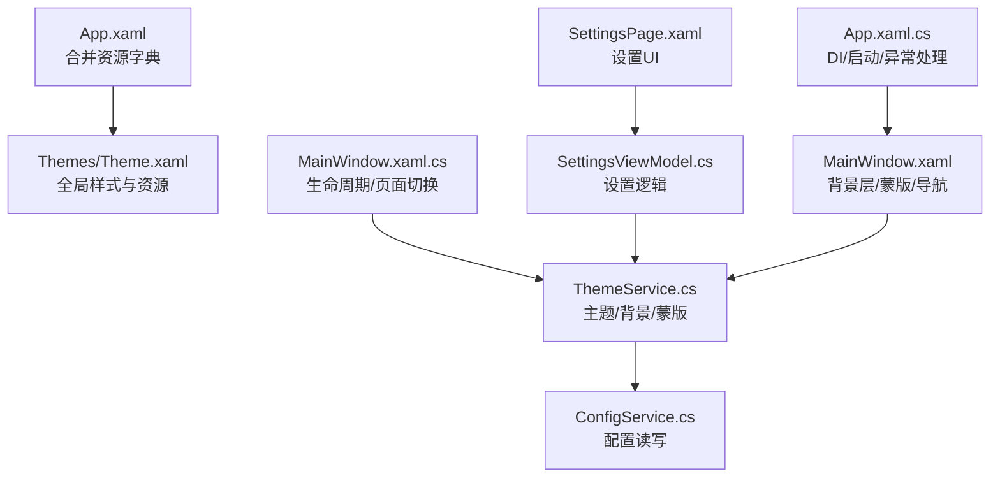
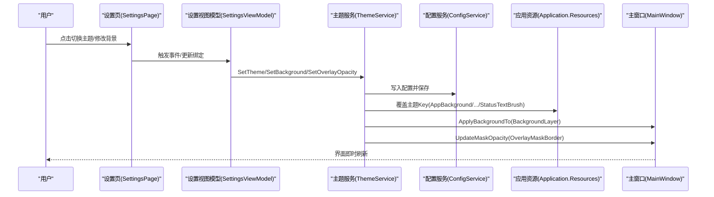
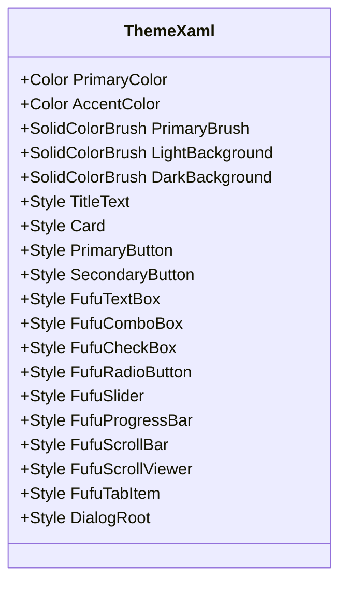
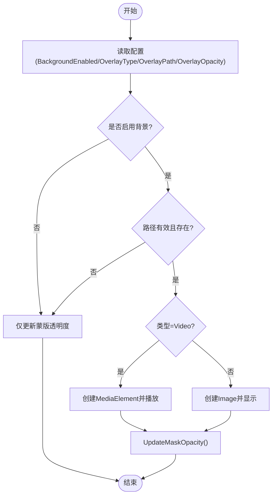
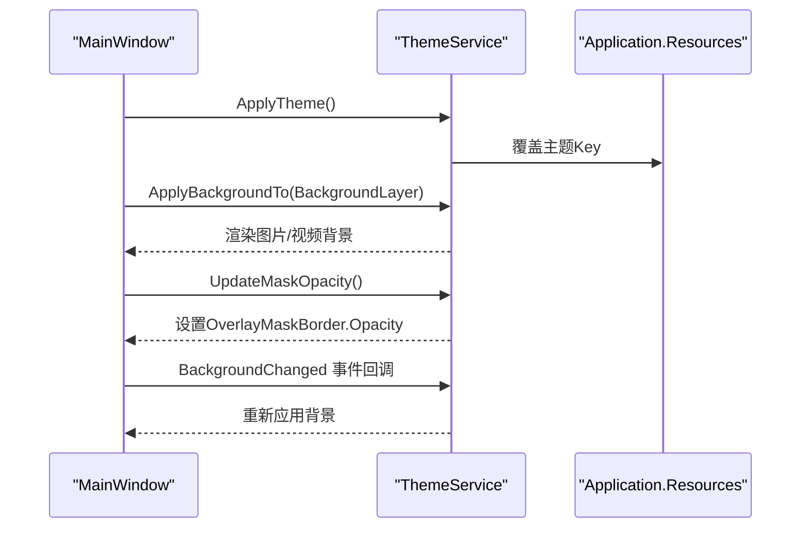
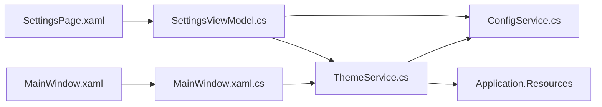
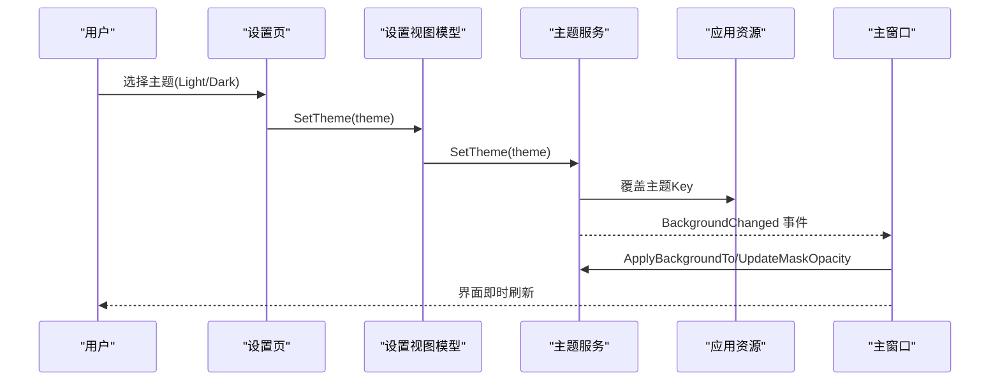

# 主题和样式定制

<cite>
**本文引用的文件**   
- [App.xaml](file://src/FufuLauncher/App.xaml)
- [App.xaml.cs](file://src/FufuLauncher/App.xaml.cs)
- [MainWindow.xaml](file://src/FufuLauncher/MainWindow.xaml)
- [MainWindow.xaml.cs](file://src/FufuLauncher/MainWindow.xaml.cs)
- [Theme.xaml](file://src/FufuLauncher/Themes/Theme.xaml)
- [ThemeService.cs](file://src/FufuLauncher/Services/ThemeService.cs)
- [ConfigService.cs](file://src/FufuLauncher/Services/ConfigService.cs)
- [SettingsViewModel.cs](file://src/FufuLauncher/ViewModels/SettingsViewModel.cs)
- [SettingsPage.xaml](file://src/FufuLauncher/Views/SettingsPage.xaml)
- [BoolToVisConverter.cs](file://src/FufuLauncher/Converters/BoolToVisConverter.cs)
</cite>

## 目录
1. [简介](#简介)
2. [项目结构](#项目结构)
3. [核心组件](#核心组件)
4. [架构总览](#架构总览)
5. [详细组件分析](#详细组件分析)
6. [依赖关系分析](#依赖关系分析)
7. [性能与优化](#性能与优化)
8. [故障排查指南](#故障排查指南)
9. [结论](#结论)
10. [附录：热切换示例与最佳实践](#附录热切换示例与最佳实践)

## 简介
本文件面向“可爱的芙芙启动器”的 WPF 主题与样式定制，系统性阐述资源字典组织、样式继承、动态切换机制、颜色方案与字体设置、控件模板自定义方法，以及 ThemeService 的主题加载、缓存与应用流程。同时覆盖响应式设计与不同屏幕尺寸的适配思路，提供完整的热主题切换示例（用户自定义主题），并给出样式调试与优化技巧。

## 项目结构
- 应用入口与资源合并
  - App.xaml 中通过 MergedDictionaries 引入 Themes/Theme.xaml，使全局资源可用。
  - App.xaml.cs 负责 DI 容器初始化、服务注册、配置加载、主窗口创建与异常捕获。
- 主题资源与样式
  - Themes/Theme.xaml 集中定义深浅双主题色板、文本样式、卡片、按钮、输入控件、滚动条、标签页、弹窗等样式，全部使用 DynamicResource 以便运行时切换。
- 主题服务与背景层
  - Services/ThemeService.cs 实现主题切换、背景图片/视频管理、蒙版透明度联动、事件通知等。
  - MainWindow.xaml 定义 BackgroundLayer 与 OverlayMaskBorder，配合 ThemeService 完成背景渲染与可读性增强。
- 配置持久化
  - Services/ConfigService.cs 管理 AppConfig，包含主题、背景类型/路径/透明度、视频静音/速度等。
- 设置界面与交互
  - Views/SettingsPage.xaml + ViewModels/SettingsViewModel.cs 暴露主题切换、背景选择、透明度调节、视频参数等 UI 绑定与命令。
- 转换器
  - Converters/BoolToVisConverter.cs 用于布尔值到可见性的转换。

**图表来源** 
- [App.xaml:1-13](file://src/FufuLauncher/App.xaml#L1-L13)
- [Theme.xaml:1-602](file://src/FufuLauncher/Themes/Theme.xaml#L1-L602)
- [App.xaml.cs:75-117](file://src/FufuLauncher/App.xaml.cs#L75-L117)
- [MainWindow.xaml:1-139](file://src/FufuLauncher/MainWindow.xaml#L1-L139)
- [MainWindow.xaml.cs:38-73](file://src/FufuLauncher/MainWindow.xaml.cs#L38-L73)
- [ThemeService.cs:15-120](file://src/FufuLauncher/Services/ThemeService.cs#L15-L120)
- [ConfigService.cs:13-79](file://src/FufuLauncher/Services/ConfigService.cs#L13-L79)
- [SettingsPage.xaml:1-350](file://src/FufuLauncher/Views/SettingsPage.xaml#L1-L350)
- [SettingsViewModel.cs:172-222](file://src/FufuLauncher/ViewModels/SettingsViewModel.cs#L172-L222)

**章节来源**
- [App.xaml:1-13](file://src/FufuLauncher/App.xaml#L1-L13)
- [App.xaml.cs:75-117](file://src/FufuLauncher/App.xaml.cs#L75-L117)
- [Theme.xaml:1-602](file://src/FufuLauncher/Themes/Theme.xaml#L1-L602)
- [MainWindow.xaml:1-139](file://src/FufuLauncher/MainWindow.xaml#L1-L139)
- [ThemeService.cs:15-120](file://src/FufuLauncher/Services/ThemeService.cs#L15-L120)
- [ConfigService.cs:13-79](file://src/FufuLauncher/Services/ConfigService.cs#L13-L79)
- [SettingsPage.xaml:1-350](file://src/FufuLauncher/Views/SettingsPage.xaml#L1-L350)
- [SettingsViewModel.cs:172-222](file://src/FufuLauncher/ViewModels/SettingsViewModel.cs#L172-L222)

## 核心组件
- 资源字典与样式系统
  - Theme.xaml 定义了浅色/深色两套色板与大量控件样式，所有关键颜色通过 DynamicResource 引用，确保主题切换即时生效。
  - 文本样式（标题、副标题、提示、等宽）统一由样式控制字号、字重与前景色。
  - 卡片、按钮（主/次/危险）、输入控件（TextBox/ComboBox/CheckBox/RadioButton/Slider/ProgressBar）、滚动条、标签页、弹窗容器均有独立样式，支持 Hover/选中状态动画与视觉反馈。
- 主题服务（ThemeService）
  - ApplyTheme(theme) 根据 Light/Dark 覆盖当前 Application.Current.Resources 中的 Key（如 AppBackground、AppForeground、CardBackground、CardBorder、InputBorder、OverlayTint、StatusTextBrush）。
  - SetTheme(theme) 写入配置并触发 BackgroundChanged 事件，供 UI 刷新。
  - 背景管理支持图片/视频双层叠加，透明蒙版随背景透明度自动调整以保证可读性。
- 配置服务（ConfigService）
  - 保存主题、下载源、Java 路径、JVM 参数、分辨率、背景开关与路径、透明度、视频静音/速度等。
  - 支持旧配置迁移至新的双层背景结构（BaseImagePath + OverlayType/Path/Opacity）。
- 主窗口与背景层
  - MainWindow.xaml 定义 BackgroundLayer（圆角裁剪）与 OverlayMaskBorder（半透明蒙版），ThemeService 直接操作这两个元素。
  - MainWindow.xaml.cs 在 Loaded 时调用 ApplyTheme 与 ApplyBackgroundTo，并在最小化/恢复时暂停/恢复视频背景。
- 设置页与视图模型
  - SettingsPage.xaml 提供主题切换、背景选择、透明度滑块、视频选项等 UI。
  - SettingsViewModel.cs 将 UI 变更映射到 ConfigService 与 ThemeService，并提供内存监控与智能分配相关属性。

**章节来源**
- [Theme.xaml:1-602](file://src/FufuLauncher/Themes/Theme.xaml#L1-L602)
- [ThemeService.cs:30-120](file://src/FufuLauncher/Services/ThemeService.cs#L30-L120)
- [ConfigService.cs:13-79](file://src/FufuLauncher/Services/ConfigService.cs#L13-L79)
- [MainWindow.xaml:22-43](file://src/FufuLauncher/MainWindow.xaml#L22-L43)
- [MainWindow.xaml.cs:38-73](file://src/FufuLauncher/MainWindow.xaml.cs#L38-L73)
- [SettingsPage.xaml:26-70](file://src/FufuLauncher/Views/SettingsPage.xaml#L26-L70)
- [SettingsViewModel.cs:220-223](file://src/FufuLauncher/ViewModels/SettingsViewModel.cs#L220-L223)

## 架构总览
WPF 主题系统基于资源字典与 DynamicResource 的动态替换机制。ThemeService 作为主题与背景的控制器，读取配置并更新 Application.Current.Resources 中的关键 Key，从而驱动全界面样式即时切换。背景层与蒙版在 MainWindow 中声明，ThemeService 直接操作这些元素以渲染图片或视频背景，并根据透明度计算蒙版强度。

**图表来源** 
- [SettingsPage.xaml:26-70](file://src/FufuLauncher/Views/SettingsPage.xaml#L26-L70)
- [SettingsViewModel.cs:220-223](file://src/FufuLauncher/ViewModels/SettingsViewModel.cs#L220-L223)
- [ThemeService.cs:30-120](file://src/FufuLauncher/Services/ThemeService.cs#L30-L120)
- [ConfigService.cs:135-147](file://src/FufuLauncher/Services/ConfigService.cs#L135-L147)
- [MainWindow.xaml:22-43](file://src/FufuLauncher/MainWindow.xaml#L22-L43)

## 详细组件分析

### 主题资源字典（Theme.xaml）
- 颜色体系
  - 主色调与强调色（Primary/Accident/Danger/Success/Warning）定义于顶部，配套 SolidColorBrush。
  - 浅/深两套基础色板（Light*/Dark*）分别定义背景、前景、卡片背景、输入边框、覆盖层等。
  - 当前主题 Key（AppBackground/AppForeground/CardBackground/CardBorder/InputBorder/OverlayTint/StatusTextBrush）默认指向深色，ThemeService 切换时覆盖为对应浅色或深色值。
- 文本样式
  - TitleText/SubTitleText/HintText/MonoText 统一字号、字重、前景色与换行策略。
- 控件样式
  - Card：半透明背景+描边+圆角+阴影。
  - PrimaryButton/SecondaryButton/DangerButton：主/次/危险按钮，含 Hover 缩放与禁用态。
  - TextBox/ComboBox/CheckBox/RadioButton/Slider/ProgressBar：统一外观与焦点/悬停状态。
  - ScrollViewer/ScrollBar：自定义滚动条样式。
  - TabItem：日志窗口双标签样式。
  - DialogRoot：弹窗容器背景与阴影。
- 样式继承
  - SecondaryButton 基于 PrimaryButton；FufuTextBox/FufuComboBox/FufuCheckBox/FufuRadioButton/FufuSlider/FufuProgressBar/FufuScrollBar/FufuScrollViewer/FufuTabItem 均提供显式样式并通过隐式样式应用到目标类型。

**图表来源** 
- [Theme.xaml:12-52](file://src/FufuLauncher/Themes/Theme.xaml#L12-L52)
- [Theme.xaml:53-120](file://src/FufuLauncher/Themes/Theme.xaml#L53-L120)
- [Theme.xaml:120-230](file://src/FufuLauncher/Themes/Theme.xaml#L120-L230)
- [Theme.xaml:274-363](file://src/FufuLauncher/Themes/Theme.xaml#L274-L363)
- [Theme.xaml:399-462](file://src/FufuLauncher/Themes/Theme.xaml#L399-L462)
- [Theme.xaml:491-555](file://src/FufuLauncher/Themes/Theme.xaml#L491-L555)
- [Theme.xaml:557-586](file://src/FufuLauncher/Themes/Theme.xaml#L557-L586)
- [Theme.xaml:588-601](file://src/FufuLauncher/Themes/Theme.xaml#L588-L601)

**章节来源**
- [Theme.xaml:12-52](file://src/FufuLauncher/Themes/Theme.xaml#L12-L52)
- [Theme.xaml:53-120](file://src/FufuLauncher/Themes/Theme.xaml#L53-L120)
- [Theme.xaml:120-230](file://src/FufuLauncher/Themes/Theme.xaml#L120-L230)
- [Theme.xaml:274-363](file://src/FufuLauncher/Themes/Theme.xaml#L274-L363)
- [Theme.xaml:399-462](file://src/FufuLauncher/Themes/Theme.xaml#L399-L462)
- [Theme.xaml:491-555](file://src/FufuLauncher/Themes/Theme.xaml#L491-L555)
- [Theme.xaml:557-586](file://src/FufuLauncher/Themes/Theme.xaml#L557-L586)
- [Theme.xaml:588-601](file://src/FufuLauncher/Themes/Theme.xaml#L588-L601)

### 主题服务（ThemeService）
- 主题切换
  - ApplyTheme(theme) 根据 theme 是否为 Dark 决定使用 Light*/Dark* 色板，覆盖 Application.Current.Resources 中的关键 Key。
  - SetTheme(theme) 校验主题名、写入配置、保存、调用 ApplyTheme 并触发 BackgroundChanged。
- 背景管理
  - SetBackground(path, type)/ClearBackground() 更新配置并调用 ApplyToMainWindow。
  - ApplyBackgroundTo(Grid) 释放旧背景，按配置选择 Image 或 Video，设置 Stretch/Opacity/SpeedRatio/Muted 等属性，循环播放视频。
  - UpdateMaskOpacity() 根据 OverlayOpacity 计算 OverlayMaskBorder 的不透明度，保证前景可读性。
  - PauseBackground()/ResumeBackground() 在窗口最小化/恢复时控制视频播放，降低资源占用。
- 兼容性与错误处理
  - 兼容旧调用名（SetOverlay/ClearOverlay）。
  - 对文件不存在、路径无效等情况进行回退与日志记录。

**图表来源** 
- [ThemeService.cs:135-200](file://src/FufuLauncher/Services/ThemeService.cs#L135-L200)
- [ThemeService.cs:205-229](file://src/FufuLauncher/Services/ThemeService.cs#L205-L229)

**章节来源**
- [ThemeService.cs:30-120](file://src/FufuLauncher/Services/ThemeService.cs#L30-L120)
- [ThemeService.cs:135-200](file://src/FufuLauncher/Services/ThemeService.cs#L135-L200)
- [ThemeService.cs:205-229](file://src/FufuLauncher/Services/ThemeService.cs#L205-L229)
- [ThemeService.cs:256-273](file://src/FufuLauncher/Services/ThemeService.cs#L256-L273)

### 主窗口与背景层（MainWindow.xaml/.cs）
- XAML 结构
  - BackgroundLayer：承载图片/视频，使用 OpacityMask 实现圆角裁剪。
  - OverlayMaskBorder：半透明蒙版，圆角裁剪与 BackgroundLayer 一致，透明度由 ThemeService 动态控制。
  - 标题栏与导航栏使用 DynamicResource 绑定主题资源。
- 生命周期与交互
  - Loaded 时执行淡入动画、默认导航、ApplyTheme、ApplyBackgroundTo、订阅 BackgroundChanged。
  - OnStateChanged 最小化时暂停视频背景，恢复时继续播放。
  - OnClosed 释放背景资源，避免句柄泄漏。

**图表来源** 
- [MainWindow.xaml:22-43](file://src/FufuLauncher/MainWindow.xaml#L22-L43)
- [MainWindow.xaml.cs:38-73](file://src/FufuLauncher/MainWindow.xaml.cs#L38-L73)
- [ThemeService.cs:118-133](file://src/FufuLauncher/Services/ThemeService.cs#L118-L133)

**章节来源**
- [MainWindow.xaml:22-43](file://src/FufuLauncher/MainWindow.xaml#L22-L43)
- [MainWindow.xaml.cs:38-73](file://src/FufuLauncher/MainWindow.xaml.cs#L38-L73)
- [MainWindow.xaml.cs:81-97](file://src/FufuLauncher/MainWindow.xaml.cs#L81-L97)

### 配置服务（ConfigService）
- 数据结构
  - AppConfig 包含主题、下载源、Java 路径/版本、JVM 参数、分辨率、全屏、背景开关与路径、透明度、视频静音/速度、实例ID、开发者密码、微软账号登录参数、Java 镜像、多核 GC 优化、CPU 亲和性、内存智能分配、视频帧率/音量等。
- 持久化
  - Load() 从 config.json 反序列化，并进行旧配置迁移（BackgroundPath/BackgroundType → BaseImagePath/OverlayType/Path/Opacity）。
  - Save() 序列化为 JSON 并写入文件。

**章节来源**
- [ConfigService.cs:13-79](file://src/FufuLauncher/Services/ConfigService.cs#L13-L79)
- [ConfigService.cs:94-133](file://src/FufuLauncher/Services/ConfigService.cs#L94-L133)
- [ConfigService.cs:135-147](file://src/FufuLauncher/Services/ConfigService.cs#L135-L147)

### 设置页与视图模型（SettingsPage.xaml + SettingsViewModel.cs）
- 设置页 UI
  - 背景设置：None/Image/Video 单选、文件选择、透明度滑块、视频静音与速度控制。
  - JVM 多核优化参数预览、内存智能分配参数、游戏分辨率、Java 路径、环境自检结果、本机 Java 列表等。
- 视图模型
  - 暴露 Config、EnvResult、FoundJavas、Instances 等集合与属性。
  - MemoryMonitor 相关属性（CurrentMemory、SmartXmxMb/SmsMb、MemorySummary 等）与一键应用智能内存到选中实例。
  - SetTheme(theme) 委托给 ThemeService 进行主题切换。

**章节来源**
- [SettingsPage.xaml:26-70](file://src/FufuLauncher/Views/SettingsPage.xaml#L26-L70)
- [SettingsViewModel.cs:172-223](file://src/FufuLauncher/ViewModels/SettingsViewModel.cs#L172-L223)
- [SettingsViewModel.cs:238-245](file://src/FufuLauncher/ViewModels/SettingsViewModel.cs#L238-L245)

### 转换器（BoolToVisConverter）
- 将 bool 转换为 Visibility（Visible/Collapsed），常用于条件显示 UI 元素。

**章节来源**
- [BoolToVisConverter.cs:9-18](file://src/FufuLauncher/Converters/BoolToVisConverter.cs#L9-L18)

## 依赖关系分析
- 组件耦合
  - ThemeService 依赖 ConfigService 读取/保存配置，直接操作 MainWindow 的 BackgroundLayer 与 OverlayMaskBorder。
  - SettingsViewModel 依赖 ThemeService 与 ConfigService，将 UI 变更同步到配置与主题。
  - MainWindow 在 Loaded 阶段调用 ThemeService 应用主题与背景，并在状态变化时控制视频播放。
- 外部依赖
  - WPF 资源系统与 DynamicResource 机制。
  - System.Windows.Media 与 MediaElement 用于视频背景。
  - Microsoft.Extensions.DependencyInjection 用于服务注入。

**图表来源** 
- [SettingsPage.xaml:26-70](file://src/FufuLauncher/Views/SettingsPage.xaml#L26-L70)
- [SettingsViewModel.cs:172-223](file://src/FufuLauncher/ViewModels/SettingsViewModel.cs#L172-L223)
- [MainWindow.xaml:22-43](file://src/FufuLauncher/MainWindow.xaml#L22-L43)
- [MainWindow.xaml.cs:38-73](file://src/FufuLauncher/MainWindow.xaml.cs#L38-L73)
- [ThemeService.cs:30-120](file://src/FufuLauncher/Services/ThemeService.cs#L30-L120)
- [ConfigService.cs:94-133](file://src/FufuLauncher/Services/ConfigService.cs#L94-L133)

**章节来源**
- [SettingsPage.xaml:26-70](file://src/FufuLauncher/Views/SettingsPage.xaml#L26-L70)
- [SettingsViewModel.cs:172-223](file://src/FufuLauncher/ViewModels/SettingsViewModel.cs#L172-L223)
- [MainWindow.xaml:22-43](file://src/FufuLauncher/MainWindow.xaml#L22-L43)
- [MainWindow.xaml.cs:38-73](file://src/FufuLauncher/MainWindow.xaml.cs#L38-L73)
- [ThemeService.cs:30-120](file://src/FufuLauncher/Services/ThemeService.cs#L30-L120)
- [ConfigService.cs:94-133](file://src/FufuLauncher/Services/ConfigService.cs#L94-L133)

## 性能与优化
- 资源与内存
  - 图片加载使用 BitmapImage 的 OnLoad 缓存，避免频繁 IO。
  - 视频背景在窗口最小化时暂停播放，恢复时继续，降低 CPU/GPU 占用。
  - 关闭窗口时释放 MediaElement 与 Image 资源，防止句柄泄漏。
- 样式与渲染
  - 使用 DynamicResource 减少重复样式定义，提升切换效率。
  - 圆角裁剪通过 OpacityMask 实现，注意复杂遮罩可能影响渲染性能，建议适度使用。
- 配置与 I/O
  - 配置保存采用异步 Timer 批量写入日志（App.WriteAppLog），避免高频同步 IO 阻塞 UI。
  - 主题切换仅覆盖必要 Key，避免全量重建资源字典。

[本节为通用指导，不直接分析具体文件]

## 故障排查指南
- 主题未生效
  - 检查 Application.Current.Resources 中关键 Key 是否被覆盖成功（AppBackground/AppForeground/CardBackground/CardBorder/InputBorder/OverlayTint/StatusTextBrush）。
  - 确认 ThemeService.ApplyTheme(theme) 是否被调用，以及 theme 值是否为 Light/Dark。
- 背景不显示
  - 检查配置文件中的 BackgroundEnabled、OverlayType、OverlayPath 是否存在且路径有效。
  - 查看 ThemeService.ApplyBackgroundTo 是否抛出异常或返回空路径。
- 视频卡顿或资源占用高
  - 确认窗口最小化时是否调用 PauseBackground，恢复时 ResumeBackground。
  - 检查视频文件是否过大或格式不支持，必要时限制帧率与音量。
- 蒙版透明度异常
  - 检查 OverlayOpacity 是否在 0~1 范围内，UpdateMaskOpacity 是否正确计算 (1.0 - OverlayOpacity) * 0.5。
- 日志与异常
  - 查看 App.WriteAppLog 输出的 app.log，定位异常堆栈与上下文。

**章节来源**
- [ThemeService.cs:118-133](file://src/FufuLauncher/Services/ThemeService.cs#L118-L133)
- [ThemeService.cs:205-229](file://src/FufuLauncher/Services/ThemeService.cs#L205-L229)
- [App.xaml.cs:38-73](file://src/FufuLauncher/App.xaml.cs#L38-L73)

## 结论
该项目的 WPF 主题系统通过资源字典与 DynamicResource 实现了轻量、高效的动态切换；ThemeService 统一管理主题与背景，结合配置服务实现持久化与迁移；MainWindow 的背景层与蒙版设计保证了良好的视觉效果与可读性。设置页提供了丰富的用户自定义能力，包括主题、背景、透明度、视频参数等。整体架构清晰、职责分离明确，便于扩展与维护。

[本节为总结，不直接分析具体文件]

## 附录：热切换示例与最佳实践

### 热主题切换流程（用户自定义主题）
- 用户在设置页选择 Light/Dark 主题。
- SettingsViewModel.SetTheme(theme) 调用 ThemeService.SetTheme(theme)。
- ThemeService 写入配置并保存，随后调用 ApplyTheme(theme) 覆盖 Application.Current.Resources 中的关键 Key。
- 触发 BackgroundChanged 事件，MainWindow 重新应用背景与蒙版透明度。
- 界面即时刷新，无需重启应用。

**图表来源** 
- [SettingsViewModel.cs:220-223](file://src/FufuLauncher/ViewModels/SettingsViewModel.cs#L220-L223)
- [ThemeService.cs:30-62](file://src/FufuLauncher/Services/ThemeService.cs#L30-L62)
- [MainWindow.xaml.cs:75-79](file://src/FufuLauncher/MainWindow.xaml.cs#L75-L79)

### 自定义主题扩展建议
- 新增主题
  - 在 Theme.xaml 中添加新的色板 Key（如 CustomBackground/CustomForeground），并在 ThemeService.ApplyTheme 中增加分支覆盖。
  - 保持 DynamicResource 引用不变，确保切换时无需修改 UI。
- 新增控件样式
  - 在 Theme.xaml 中定义新控件样式，并通过隐式样式应用到目标类型，或使用显式 Style 引用。
- 背景增强
  - 支持更多媒体格式或添加过渡动画，注意性能与兼容性。
- 响应式设计与屏幕适配
  - 使用 Viewbox、Grid 自适应布局、MinWidth/MinHeight 约束，确保在不同分辨率下良好展示。
  - 针对小屏设备，可折叠导航栏或隐藏次要信息，提升可用性。

[本节为概念性内容，不直接分析具体文件]