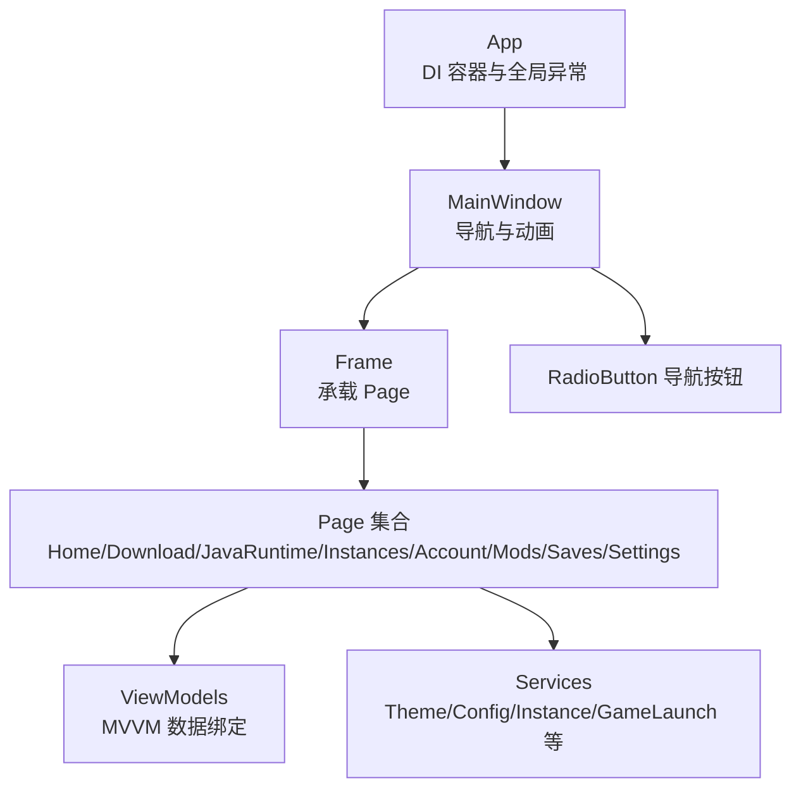
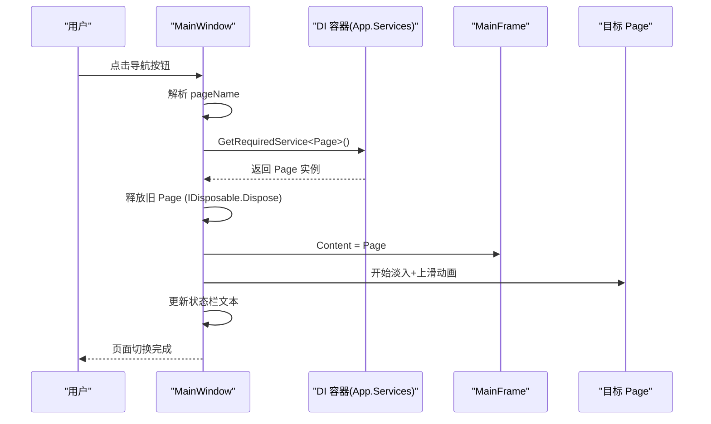
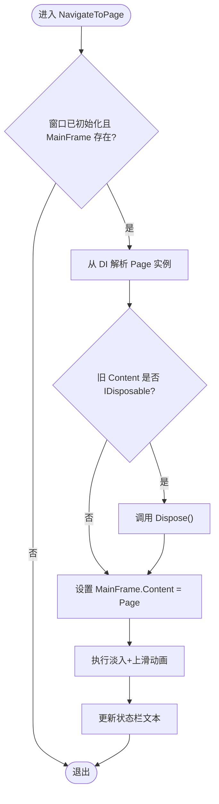
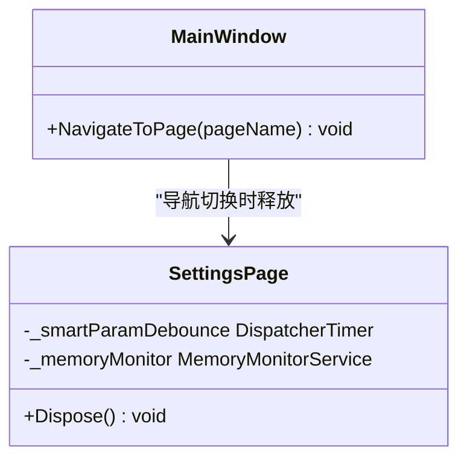
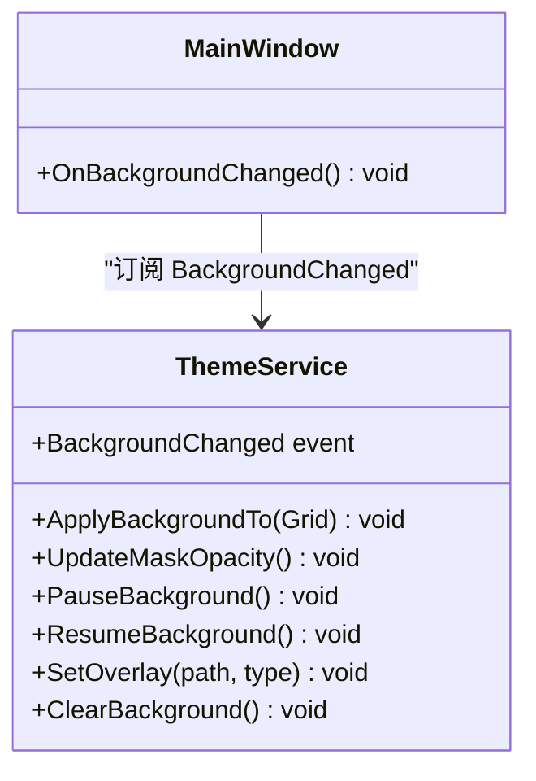
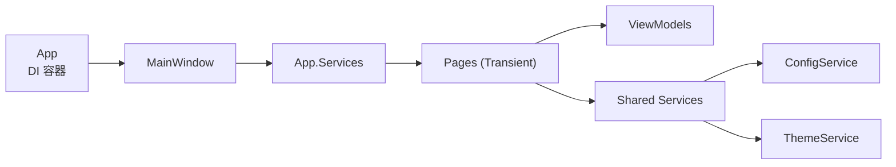

# 页面导航系统

<cite>
**本文引用的文件**   
- [App.xaml.cs](file://src/FufuLauncher/App.xaml.cs)
- [MainWindow.xaml.cs](file://src/FufuLauncher/MainWindow.xaml.cs)
- [MainWindow.xaml](file://src/FufuLauncher/MainWindow.xaml)
- [HomePage.xaml.cs](file://src/FufuLauncher/Views/HomePage.xaml.cs)
- [SettingsPage.xaml.cs](file://src/FufuLauncher/Views/SettingsPage.xaml.cs)
- [ThemeService.cs](file://src/FufuLauncher/Services/ThemeService.cs)
- [ConfigService.cs](file://src/FufuLauncher/Services/ConfigService.cs)
</cite>

## 目录
1. [简介](#简介)
2. [项目结构](#项目结构)
3. [核心组件](#核心组件)
4. [架构总览](#架构总览)
5. [详细组件分析](#详细组件分析)
6. [依赖关系分析](#依赖关系分析)
7. [性能考量](#性能考量)
8. [故障排查指南](#故障排查指南)
9. [结论](#结论)
10. [附录：扩展示例与最佳实践](#附录扩展示例与最佳实践)

## 简介
本文件为“可爱的芙芙”启动器的 WPF 页面导航系统提供完整技术文档。内容涵盖：
- Page 对象的创建、销毁与生命周期管理
- 路由配置方法（含动态注册思路与参数传递机制）
- 页面间通信方式（事件总线、依赖注入与服务共享）
- 导航动画与过渡效果实现
- 扩展示例（新增页面与复杂导航场景）
- 错误处理与异常恢复机制

该导航系统基于 WPF 的 Frame + Content 切换模式，结合 Microsoft.Extensions.DependencyInjection（DI）容器进行页面实例化与依赖注入，并通过 MainWindow 统一调度导航与动画。

## 项目结构
导航相关的关键位置与职责如下：
- App.xaml.cs：应用入口，负责 DI 容器构建、服务与页面注册、全局异常捕获、主窗口创建与显示。
- MainWindow.xaml/.xaml.cs：承载 UI 布局与导航逻辑，左侧 RadioButton 触发导航，右侧 Frame 承载当前页面；实现淡入+上滑过渡动画。
- Views/*：各功能页（如 HomePage、SettingsPage），通过构造函数注入 ViewModel 与 Service。
- Services/*：业务服务（如 ThemeService、ConfigService），被多个页面共享。

**图表来源**
- [App.xaml.cs:99-178](file://src/FufuLauncher/App.xaml.cs#L99-L178)
- [MainWindow.xaml.cs:128-186](file://src/FufuLauncher/MainWindow.xaml.cs#L128-L186)
- [MainWindow.xaml:76-116](file://src/FufuLauncher/MainWindow.xaml#L76-L116)

**章节来源**
- [App.xaml.cs:99-178](file://src/FufuLauncher/App.xaml.cs#L99-L178)
- [MainWindow.xaml.cs:128-186](file://src/FufuLauncher/MainWindow.xaml.cs#L128-L186)
- [MainWindow.xaml:76-116](file://src/FufuLauncher/MainWindow.xaml#L76-L116)

## 核心组件
- 应用层（App）
  - 构建 DI 容器并注册所有服务与页面（Transient 页面，单例服务）。
  - 全局异常捕获（UI 线程、域级、Task 未观察异常）。
  - 初始化数据目录与主题资源。
- 主窗口（MainWindow）
  - 使用 NavigateToPage(pageName) 完成页面切换。
  - 从 DI 获取页面实例，释放旧页面（IDisposable），设置 MainFrame.Content。
  - 执行淡入+轻微上滑动画，更新状态栏文本。
- 页面（Views/*）
  - 通过构造函数注入 ViewModel 与 Service。
  - 在 Loaded 中加载数据、初始化交互。
  - SettingsPage 实现 IDisposable，离开时停止定时器并暂停内存监控。
- 服务（Services/*）
  - ThemeService：主题与背景（图片/视频）应用、透明度控制、播放控制。
  - ConfigService：配置持久化（JSON）、旧配置迁移。

**章节来源**
- [App.xaml.cs:99-178](file://src/FufuLauncher/App.xaml.cs#L99-L178)
- [MainWindow.xaml.cs:128-186](file://src/FufuLauncher/MainWindow.xaml.cs#L128-L186)
- [SettingsPage.xaml.cs:46-52](file://src/FufuLauncher/Views/SettingsPage.xaml.cs#L46-L52)
- [ThemeService.cs:118-200](file://src/FufuLauncher/Services/ThemeService.cs#L118-L200)
- [ConfigService.cs:94-148](file://src/FufuLauncher/Services/ConfigService.cs#L94-L148)

## 架构总览
导航流程概览：用户点击左侧导航按钮 → MainWindow 解析 pageName → 从 DI 获取对应 Page → 释放旧 Page → 设置 MainFrame.Content → 执行过渡动画 → 更新状态栏。

**图表来源**
- [MainWindow.xaml.cs:99-186](file://src/FufuLauncher/MainWindow.xaml.cs#L99-L186)
- [App.xaml.cs:166-178](file://src/FufuLauncher/App.xaml.cs#L166-L178)

## 详细组件分析

### 主窗口导航与动画（MainWindow）
- 导航入口：NavButton_Checked 将 RadioButton 名称映射为 pageName，调用 NavigateToPage。
- 页面创建：NavigateToPage 根据 pageName 从 App.Services 获取页面实例（Transient）。
- 生命周期管理：若旧 Content 实现 IDisposable，则调用 Dispose 释放资源（避免事件订阅泄漏）。
- 动画实现：组合 DoubleAnimation（Opacity）与 TranslateTransform.YProperty（Y 从 8→0），时长 220ms，CubicEase 缓动。
- 状态反馈：StatusBarText 显示切换结果。

**图表来源**
- [MainWindow.xaml.cs:128-186](file://src/FufuLauncher/MainWindow.xaml.cs#L128-L186)

**章节来源**
- [MainWindow.xaml.cs:99-186](file://src/FufuLauncher/MainWindow.xaml.cs#L99-L186)

### 页面生命周期与资源释放（SettingsPage）
- SettingsPage 实现 IDisposable，在 Dispose 中停止防抖定时器并暂停内存监控，避免多次导航累积定时器导致卡顿或内存泄漏。
- 其他页面可通过类似模式实现资源清理（例如取消事件订阅、释放非托管资源）。

**图表来源**
- [SettingsPage.xaml.cs:46-52](file://src/FufuLauncher/Views/SettingsPage.xaml.cs#L46-L52)
- [MainWindow.xaml.cs:148-154](file://src/FufuLauncher/MainWindow.xaml.cs#L148-L154)

**章节来源**
- [SettingsPage.xaml.cs:46-52](file://src/FufuLauncher/Views/SettingsPage.xaml.cs#L46-L52)
- [MainWindow.xaml.cs:148-154](file://src/FufuLauncher/MainWindow.xaml.cs#L148-L154)

### 主题与背景服务（ThemeService）
- ApplyBackgroundTo：根据配置选择图片或视频作为背景，支持透明度、静音、速度等设置。
- UpdateMaskOpacity：根据背景透明度计算半透明蒙版不透明度，保证前景可读性。
- PauseBackground/ResumeBackground：窗口最小化/恢复时控制视频播放，降低资源占用。
- BackgroundChanged 事件：通知 UI 重新应用背景（例如设置页修改后即时生效）。

**图表来源**
- [ThemeService.cs:118-200](file://src/FufuLauncher/Services/ThemeService.cs#L118-L200)
- [MainWindow.xaml.cs:57-79](file://src/FufuLauncher/MainWindow.xaml.cs#L57-L79)

**章节来源**
- [ThemeService.cs:118-200](file://src/FufuLauncher/Services/ThemeService.cs#L118-L200)
- [MainWindow.xaml.cs:57-79](file://src/FufuLauncher/MainWindow.xaml.cs#L57-L79)

### 配置服务（ConfigService）
- Load/Save：JSON 序列化/反序列化配置，包含主题、下载源、JVM 参数、分辨率、背景设置等。
- 旧配置迁移：自动将旧背景字段迁移至双层结构（BaseImagePath/OverlayType/OverlayPath）。
- 安全保存：保存失败不抛出异常，避免崩溃。

**章节来源**
- [ConfigService.cs:94-148](file://src/FufuLauncher/Services/ConfigService.cs#L94-L148)

## 依赖关系分析
- App 负责 DI 容器构建与页面注册（Transient），确保每次导航都获得新的 Page 实例。
- MainWindow 通过 App.Services 解析页面，避免硬编码 new，提升可测试性与扩展性。
- 页面通过构造函数注入 ViewModel 与 Service，遵循 MVVM 与依赖倒置原则。
- ThemeService 与 ConfigService 作为共享服务，被多个页面复用。

**图表来源**
- [App.xaml.cs:99-178](file://src/FufuLauncher/App.xaml.cs#L99-L178)
- [MainWindow.xaml.cs:134-146](file://src/FufuLauncher/MainWindow.xaml.cs#L134-L146)

**章节来源**
- [App.xaml.cs:99-178](file://src/FufuLauncher/App.xaml.cs#L99-L178)
- [MainWindow.xaml.cs:134-146](file://src/FufuLauncher/MainWindow.xaml.cs#L134-L146)

## 性能考量
- 页面 Transient：每次导航新建页面，避免状态污染，但需注意资源释放（IDisposable）。
- 动画优化：使用 Storyboard 组合动画，避免 BeginAnimation 互相干扰；缓动函数提升流畅度。
- 背景媒体控制：窗口最小化时暂停视频播放，减少 CPU/GPU 占用。
- 日志批量写入：后台 Timer 缓冲日志，避免高频 IO 阻塞 UI 线程。
- 防抖输入：设置页智能参数输入防抖（500ms），减少频繁保存。

[本节为通用指导，无需特定文件引用]

## 故障排查指南
- 全局异常捕获：
  - UI 线程异常：DispatcherUnhandledException 弹窗提示并记录日志。
  - 域级异常：UnhandledException 弹窗致命错误。
  - Task 未观察异常：UnobservedTaskException 标记已观察，阻止进程终止。
- 导航异常：
  - 检查 IsInitialized 与 MainFrame 是否为空，避免 XAML 解析阶段触发导航。
  - 确认 DI 容器中已注册目标页面类型。
- 资源泄漏：
  - 确保页面实现 IDisposable 并在 NavigateToPage 中释放。
  - 检查事件订阅是否正确取消（如 ThemeService.BackgroundChanged）。
- 背景问题：
  - 验证配置文件路径与文件存在性。
  - 检查 UpdateMaskOpacity 与 ApplyBackgroundTo 的执行顺序。

**章节来源**
- [App.xaml.cs:180-206](file://src/FufuLauncher/App.xaml.cs#L180-L206)
- [MainWindow.xaml.cs:128-154](file://src/FufuLauncher/MainWindow.xaml.cs#L128-L154)
- [ThemeService.cs:200-274](file://src/FufuLauncher/Services/ThemeService.cs#L200-L274)

## 结论
该导航系统以 WPF Frame + Content 为基础，结合 DI 容器实现松耦合的页面管理与依赖注入。通过统一的 NavigateToPage 方法与动画实现，保证了页面切换的一致性与用户体验。服务共享与事件机制提供了灵活的页面间通信能力。未来可扩展更多页面与复杂导航场景，同时保持代码的可维护性与性能。

[本节为总结，无需特定文件引用]

## 附录：扩展示例与最佳实践

### 新增页面步骤
1. 在 Views 目录下创建新 Page（如 NewPage.xaml/.xaml.cs）。
2. 在 App.ConfigureServices 中注册为 Transient：services.AddTransient<NewPage>();
3. 在 MainWindow.NavigateToPage 的 switch 中添加映射："New" => services.GetRequiredService<NewPage>()。
4. 在 MainWindow.xaml 的左侧导航栏添加 RadioButton，并绑定 Checked 事件。
5. 如需资源释放，实现 IDisposable 并在 Dispose 中清理资源。

**章节来源**
- [App.xaml.cs:166-178](file://src/FufuLauncher/App.xaml.cs#L166-L178)
- [MainWindow.xaml.cs:134-146](file://src/FufuLauncher/MainWindow.xaml.cs#L134-L146)
- [MainWindow.xaml:86-110](file://src/FufuLauncher/MainWindow.xaml#L86-L110)

### 动态路由注册与参数传递机制
- 动态路由：可在 App.ConfigureServices 中根据配置或运行时条件注册页面，或在 NavigateToPage 中使用工厂方法动态解析。
- 参数传递：由于页面为 Transient，可在构造时传入参数（需修改 DI 注册为工厂），或通过属性/事件总线传递。
- 示例思路：定义 IPageRouter 接口，封装路由解析与参数绑定逻辑，便于单元测试与扩展。

[本节为概念性说明，无需特定文件引用]

### 页面间通信方式
- 事件总线：可引入轻量事件总线（如 SimpleEventBus）实现解耦通信。
- 依赖注入：通过共享服务（如 ConfigService、ThemeService）传递状态。
- 事件订阅：页面订阅服务事件（如 ThemeService.BackgroundChanged），在适当时机响应。

**章节来源**
- [ThemeService.cs:23-24](file://src/FufuLauncher/Services/ThemeService.cs#L23-L24)
- [MainWindow.xaml.cs:57-79](file://src/FufuLauncher/MainWindow.xaml.cs#L57-L79)

### 导航动画与过渡效果
- 淡入+上滑：使用 DoubleAnimation 与 TranslateTransform 组合，时长 220ms，CubicEase 缓动。
- 自定义动画：可替换缓动函数或增加缩放效果，提升视觉体验。
- 性能优化：避免在动画期间执行耗时操作。

**章节来源**
- [MainWindow.xaml.cs:156-183](file://src/FufuLauncher/MainWindow.xaml.cs#L156-L183)

### 错误处理与异常恢复
- 全局异常：捕获 UI、域级、Task 异常，弹窗提示并记录日志。
- 导航异常：检查初始化状态与 DI 注册，避免空引用。
- 资源释放：确保 IDisposable 正确释放，防止内存泄漏。

**章节来源**
- [App.xaml.cs:180-206](file://src/FufuLauncher/App.xaml.cs#L180-L206)
- [MainWindow.xaml.cs:128-154](file://src/FufuLauncher/MainWindow.xaml.cs#L128-L154)