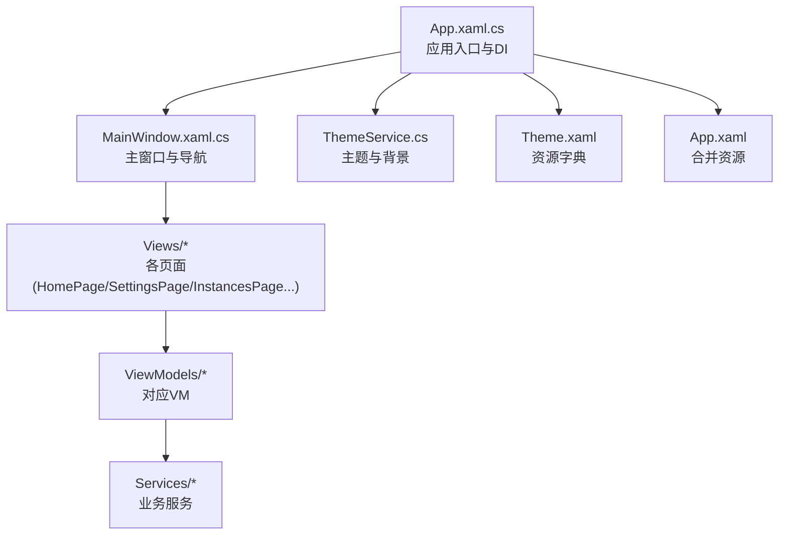
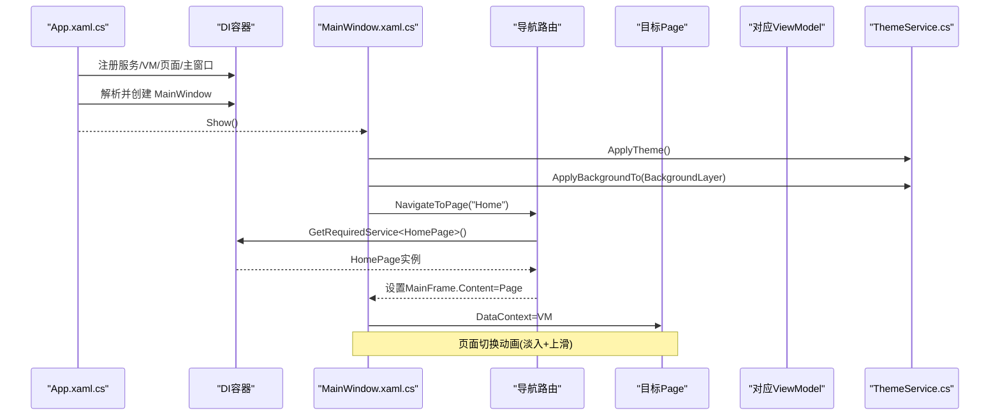
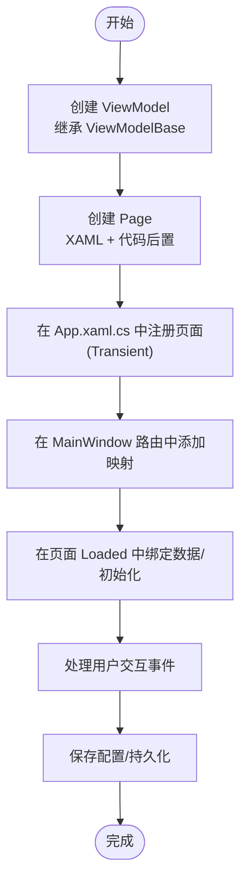
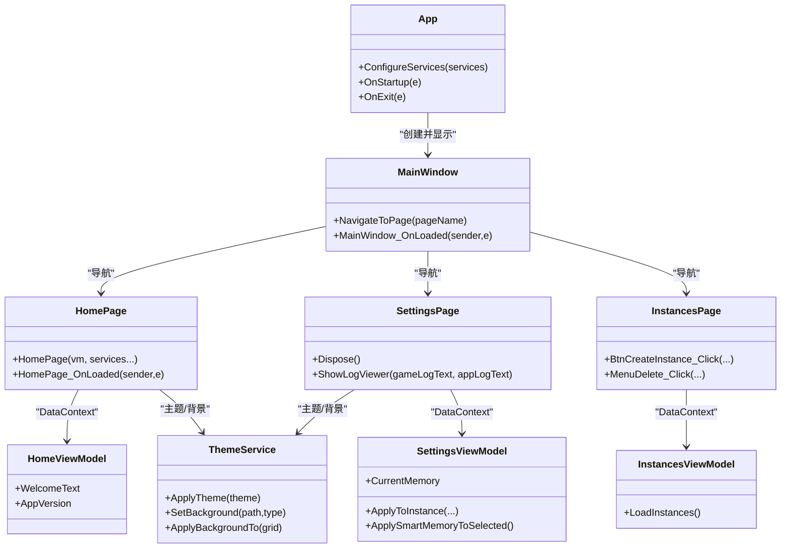

# 页面扩展开发

<cite>
**本文引用的文件**   
- [App.xaml.cs](file://src/FufuLauncher/App.xaml.cs)
- [MainWindow.xaml.cs](file://src/FufuLauncher/MainWindow.xaml.cs)
- [MainViewModel.cs](file://src/FufuLauncher/ViewModels/MainViewModel.cs)
- [ViewModelBase.cs](file://src/FufuLauncher/ViewModels/ViewModelBase.cs)
- [HomePage.xaml.cs](file://src/FufuLauncher/Views/HomePage.xaml.cs)
- [HomeViewModel.cs](file://src/FufuLauncher/ViewModels/HomeViewModel.cs)
- [SettingsPage.xaml.cs](file://src/FufuLauncher/Views/SettingsPage.xaml.cs)
- [SettingsViewModel.cs](file://src/FufuLauncher/ViewModels/SettingsViewModel.cs)
- [InstancesPage.xaml.cs](file://src/FufuLauncher/Views/InstancesPage.xaml.cs)
- [InstancesViewModel.cs](file://src/FufuLauncher/ViewModels/InstancesViewModel.cs)
- [Theme.xaml](file://src/FufuLauncher/Themes/Theme.xaml)
- [App.xaml](file://src/FufuLauncher/App.xaml)
- [ThemeService.cs](file://src/FufuLauncher/Services/ThemeService.cs)
</cite>

## 目录
1. [简介](#简介)
2. [项目结构](#项目结构)
3. [核心组件](#核心组件)
4. [架构总览](#架构总览)
5. [详细组件分析](#详细组件分析)
6. [依赖关系分析](#依赖关系分析)
7. [性能考量](#性能考量)
8. [故障排查指南](#故障排查指南)
9. [结论](#结论)
10. [附录](#附录)

## 简介
本文件面向“可爱的芙芙”启动器的 WPF 页面扩展开发，系统化说明：
- WPF 页面的创建流程（XAML 界面设计与代码后置文件）
- ViewModel 实现模式（数据绑定、命令处理、状态管理）
- 页面导航系统扩展方法（路由配置与参数传递）
- 主题与样式系统的自定义（资源字典与动态主题切换）
- 完整扩展示例（设置页、游戏管理页、工具页面）

目标是帮助开发者快速理解并安全扩展新页面，同时保持与现有 MVVM、DI、主题与背景体系的一致性。

## 项目结构
本项目采用分层组织：
- 视图层 Views：WPF Page 页面及其代码后置
- 视图模型层 ViewModels：MVVM 的 VM 类，负责数据与交互逻辑
- 服务层 Services：业务能力封装（配置、主题、实例、下载、日志等）
- 应用入口 App.xaml.cs：DI 容器注册、生命周期、异常捕获
- 主窗口 MainWindow.xaml.cs：承载导航与主题背景
- 主题资源 Themes/Theme.xaml：统一样式与颜色资源
- 应用资源 App.xaml：合并主题资源字典

**图表来源** 
- [App.xaml.cs:138-217](file://src/FufuLauncher/App.xaml.cs#L138-L217)
- [MainWindow.xaml.cs:128-186](file://src/FufuLauncher/MainWindow.xaml.cs#L128-L186)
- [ThemeService.cs:30-62](file://src/FufuLauncher/Services/ThemeService.cs#L30-L62)
- [Theme.xaml:1-12](file://src/FufuLauncher/Themes/Theme.xaml#L1-L12)
- [App.xaml:5-11](file://src/FufuLauncher/App.xaml#L5-L11)

**章节来源**
- [App.xaml.cs:138-217](file://src/FufuLauncher/App.xaml.cs#L138-L217)
- [App.xaml:5-11](file://src/FufuLauncher/App.xaml#L5-L11)

## 核心组件
- 应用入口与 DI 容器：集中注册服务、ViewModel、页面与主窗口，提供全局 IServiceProvider
- 主窗口导航：基于字符串路由映射到具体 Page，支持淡入+上滑过渡动画
- 主题与背景：通过 ThemeService 动态覆盖资源字典中的主题 Key，并控制图片/视频背景
- MVVM 基类：统一的属性变更通知机制，简化数据绑定
- 典型页面与 VM：主页、设置页、实例管理页，分别演示不同场景下的交互与状态管理

**章节来源**
- [App.xaml.cs:138-217](file://src/FufuLauncher/App.xaml.cs#L138-L217)
- [MainWindow.xaml.cs:128-186](file://src/FufuLauncher/MainWindow.xaml.cs#L128-L186)
- [ThemeService.cs:30-62](file://src/FufuLauncher/Services/ThemeService.cs#L30-L62)
- [ViewModelBase.cs:7-21](file://src/FufuLauncher/ViewModels/ViewModelBase.cs#L7-L21)

## 架构总览
下图展示了从应用启动到页面渲染、导航与主题应用的总体流程。

**图表来源** 
- [App.xaml.cs:138-217](file://src/FufuLauncher/App.xaml.cs#L138-L217)
- [MainWindow.xaml.cs:38-73](file://src/FufuLauncher/MainWindow.xaml.cs#L38-L73)
- [MainWindow.xaml.cs:128-186](file://src/FufuLauncher/MainWindow.xaml.cs#L128-L186)
- [ThemeService.cs:30-62](file://src/FufuLauncher/Services/ThemeService.cs#L30-L62)

## 详细组件分析

### 页面创建流程（XAML + 代码后置）
- XAML 定义 UI 结构与控件命名，便于在代码后置中引用
- 代码后置构造函数注入所需 Service/VM，设置 DataContext
- 页面加载事件中进行数据初始化、扫描、校验等操作
- 用户交互事件调用 Service/VM 完成业务逻辑，必要时更新 UI

示例要点（以主页为例）：
- 构造器注入 HomeViewModel 与多个 Service
- Loaded 事件中加载实例列表、Java 选项、完整性状态重置
- 选择实例后刷新 Java 下拉框与提示文本
- 完整性校验通过后启用启动按钮，失败则提示修复

**章节来源**
- [HomePage.xaml.cs:27-41](file://src/FufuLauncher/Views/HomePage.xaml.cs#L27-L41)
- [HomePage.xaml.cs:43-65](file://src/FufuLauncher/Views/HomePage.xaml.cs#L43-L65)
- [HomePage.xaml.cs:165-185](file://src/FufuLauncher/Views/HomePage.xaml.cs#L165-L185)
- [HomePage.xaml.cs:221-275](file://src/FufuLauncher/Views/HomePage.xaml.cs#L221-L275)

### ViewModel 实现模式（数据绑定、命令处理、状态管理）
- 继承 ViewModelBase，使用 Set<T> 进行属性变更通知
- 将复杂状态与计算结果暴露为只读属性，供 UI 绑定
- 通过 Service 获取数据，集合类型使用 ObservableCollection 以便 UI 自动刷新
- 对频繁更新的内存监控数据，采用缓存策略避免重复 P/Invoke

示例要点（以设置页 VM 为例）：
- CurrentMemory 属性 setter 中一次性计算 SmartXmx/SmartXms 并缓存
- AutoMemoryMinMb/AutoMemoryMaxMb/MemoryReserveMb 变化时触发智能推荐重算
- 提供 ApplyToInstance 与 ApplySmartMemoryToSelected 等方法，直接修改实例配置并持久化

**章节来源**
- [ViewModelBase.cs:7-21](file://src/FufuLauncher/ViewModels/ViewModelBase.cs#L7-L21)
- [SettingsViewModel.cs:44-92](file://src/FufuLauncher/ViewModels/SettingsViewModel.cs#L44-L92)
- [SettingsViewModel.cs:121-170](file://src/FufuLauncher/ViewModels/SettingsViewModel.cs#L121-L170)
- [SettingsViewModel.cs:224-245](file://src/FufuLauncher/ViewModels/SettingsViewModel.cs#L224-L245)

### 页面导航系统（路由配置与参数传递）
- 路由键为字符串（如 "Home"、"Settings"），在 MainWindow 中 switch 映射到具体 Page 类型
- 页面由 DI 容器按需创建，自动注入依赖
- 切换前释放旧 Page（若实现 IDisposable），避免事件订阅泄漏
- 切换动画：Opacity 淡入 + TranslateTransform 上滑

扩展新页面步骤：
- 新增 Page 与对应 ViewModel
- 在 App.xaml.cs 的 ConfigureServices 中注册 Transient 页面
- 在 MainWindow.NavigateToPage 中添加路由键映射
- 如需传参，可在页面构造函数或 Loaded 事件中读取 DI 提供的服务状态

**章节来源**
- [MainWindow.xaml.cs:128-186](file://src/FufuLauncher/MainWindow.xaml.cs#L128-L186)
- [App.xaml.cs:205-217](file://src/FufuLauncher/App.xaml.cs#L205-L217)

### 主题与样式系统（资源字典与动态主题切换）
- Theme.xaml 定义深浅双主题色板与控件样式，全部使用 DynamicResource 引用
- ThemeService.ApplyTheme 根据配置覆盖当前资源字典中的主题 Key（如 AppBackground、AppForeground）
- 背景支持图片与视频，ApplyBackgroundTo 将 MediaElement/Image 添加到指定 Grid
- 蒙版透明度随背景不透明度联动，保证前景可读性

扩展主题：
- 在 Theme.xaml 中新增/修改资源 Key，确保所有 UI 使用 DynamicResource 引用
- 通过 ThemeService.SetTheme 切换主题并持久化配置
- 背景切换通过 SetOverlay/ClearOverlay 更新配置并触发 BackgroundChanged 事件

**章节来源**
- [Theme.xaml:1-12](file://src/FufuLauncher/Themes/Theme.xaml#L1-L12)
- [ThemeService.cs:30-62](file://src/FufuLauncher/Services/ThemeService.cs#L30-L62)
- [ThemeService.cs:119-185](file://src/FufuLauncher/Services/ThemeService.cs#L119-L185)
- [App.xaml:5-11](file://src/FufuLauncher/App.xaml#L5-L11)

### 完整扩展示例

#### 设置页面（SettingsPage）
- 功能：下载源、背景设置、JVM 参数、分辨率、全屏、内存监控、开发者选项
- 关键点：
  - 智能内存参数防抖（DispatcherTimer 500ms）
  - 内存监控暂停/恢复（页面可见时才高频刷新）
  - 开发者密码解锁后开放日志查看、缓存清理、目录打开等功能
  - 一键应用智能推荐内存到选中实例

**章节来源**
- [SettingsPage.xaml.cs:23-44](file://src/FufuLauncher/Views/SettingsPage.xaml.cs#L23-L44)
- [SettingsPage.xaml.cs:295-327](file://src/FufuLauncher/Views/SettingsPage.xaml.cs#L295-L327)
- [SettingsPage.xaml.cs:353-452](file://src/FufuLauncher/Views/SettingsPage.xaml.cs#L353-L452)
- [SettingsViewModel.cs:172-194](file://src/FufuLauncher/ViewModels/SettingsViewModel.cs#L172-L194)

#### 游戏管理页面（InstancesPage）
- 功能：新建实例、导入已有 .minecraft、重命名、复制、导出备份、安装模组加载器（Forge/Fabric/Quilt）、删除
- 关键点：
  - 使用 InputDialog 收集用户输入
  - 通过 InstanceService 执行实例操作
  - 通过 ModLoaderInstallService 异步安装模组加载器

**章节来源**
- [InstancesPage.xaml.cs:27-48](file://src/FufuLauncher/Views/InstancesPage.xaml.cs#L27-L48)
- [InstancesPage.xaml.cs:98-134](file://src/FufuLauncher/Views/InstancesPage.xaml.cs#L98-L134)
- [InstancesViewModel.cs:26-31](file://src/FufuLauncher/ViewModels/InstancesViewModel.cs#L26-L31)

#### 工具页面（可扩展）
- 可复用 SettingsPage.ShowLogViewer 静态方法，构建双标签日志查看窗口
- 使用 Theme.xaml 中的 DialogRoot、FufuTabItem、MonoText 样式，保持视觉一致
- 适用于任何需要展示文本日志或调试信息的工具页面

**章节来源**
- [SettingsPage.xaml.cs:454-503](file://src/FufuLauncher/Views/SettingsPage.xaml.cs#L454-L503)
- [Theme.xaml:557-586](file://src/FufuLauncher/Themes/Theme.xaml#L557-L586)

### 概念总览
以下流程图概括了“新增页面”的标准路径，便于快速上手扩展。

[本图为概念流程，无需源码映射]

## 依赖关系分析
- App.xaml.cs 集中注册所有服务、ViewModel、页面与主窗口
- MainWindow 通过 DI 获取页面实例，避免硬编码 new
- 页面与 VM 之间通过 DataContext 建立绑定关系
- VM 依赖 Services 完成业务逻辑，避免在 UI 层直接访问文件系统或网络
- ThemeService 独立于 UI，仅通过事件与配置驱动主题与背景

**图表来源** 
- [App.xaml.cs:138-217](file://src/FufuLauncher/App.xaml.cs#L138-L217)
- [MainWindow.xaml.cs:128-186](file://src/FufuLauncher/MainWindow.xaml.cs#L128-L186)
- [HomePage.xaml.cs:27-41](file://src/FufuLauncher/Views/HomePage.xaml.cs#L27-L41)
- [HomeViewModel.cs:8-24](file://src/FufuLauncher/ViewModels/HomeViewModel.cs#L8-L24)
- [SettingsPage.xaml.cs:23-44](file://src/FufuLauncher/Views/SettingsPage.xaml.cs#L23-L44)
- [SettingsViewModel.cs:172-194](file://src/FufuLauncher/ViewModels/SettingsViewModel.cs#L172-L194)
- [InstancesPage.xaml.cs:17-23](file://src/FufuLauncher/Views/InstancesPage.xaml.cs#L17-L23)
- [InstancesViewModel.cs:20-31](file://src/FufuLauncher/ViewModels/InstancesViewModel.cs#L20-L31)
- [ThemeService.cs:30-62](file://src/FufuLauncher/Services/ThemeService.cs#L30-L62)

**章节来源**
- [App.xaml.cs:138-217](file://src/FufuLauncher/App.xaml.cs#L138-L217)
- [MainWindow.xaml.cs:128-186](file://src/FufuLauncher/MainWindow.xaml.cs#L128-L186)

## 性能考量
- 日志写入采用队列缓冲与定时器批量落盘，避免高频 IO 阻塞 UI
- 内存监控仅在设置页可见时高频刷新，离开页面时暂停，降低闲置开销
- 智能内存推荐值缓存，避免每次 INPC 触发都重复 P/Invoke
- 页面切换动画使用 Storyboard 组合，减少多次 BeginAnimation 干扰
- 背景视频最小化时暂停播放，恢复时继续，降低 CPU/GPU 占用

**章节来源**
- [App.xaml.cs:40-67](file://src/FufuLauncher/App.xaml.cs#L40-L67)
- [SettingsPage.xaml.cs:36-52](file://src/FufuLauncher/Views/SettingsPage.xaml.cs#L36-L52)
- [SettingsViewModel.cs:44-92](file://src/FufuLauncher/ViewModels/SettingsViewModel.cs#L44-L92)
- [MainWindow.xaml.cs:156-186](file://src/FufuLauncher/MainWindow.xaml.cs#L156-L186)
- [ThemeService.cs:241-257](file://src/FufuLauncher/Services/ThemeService.cs#L241-L257)

## 故障排查指南
- 未处理异常捕获：UI 线程、域级、Task 未观察异常均记录日志并弹窗提示
- 日志查看：支持打开游戏日志与应用日志双标签窗口，便于定位问题
- 环境自检失败：主窗口状态栏显示摘要信息，可在设置页查看详细信息
- 背景资源释放：窗口关闭时释放视频/图片背景，避免句柄泄漏

**章节来源**
- [App.xaml.cs:219-245](file://src/FufuLauncher/App.xaml.cs#L219-L245)
- [SettingsPage.xaml.cs:454-503](file://src/FufuLauncher/Views/SettingsPage.xaml.cs#L454-L503)
- [MainWindow.xaml.cs:91-97](file://src/FufuLauncher/MainWindow.xaml.cs#L91-L97)

## 结论
通过统一的 DI 容器、MVVM 模式、主题与背景服务，以及清晰的页面导航路由，本项目为页面扩展提供了稳定且易用的基础。开发者只需遵循既定流程（创建 VM → 创建 Page → 注册 DI → 添加路由 → 绑定数据 → 处理事件），即可快速实现新功能并保持整体一致性。

## 附录
- 新增页面检查清单：
  - 是否继承 ViewModelBase 并使用 Set<T> 通知
  - 是否在 App.xaml.cs 中注册页面为 Transient
  - 是否在 MainWindow 路由中添加映射
  - 是否在页面 Loaded 中完成数据初始化
  - 是否正确使用 ThemeService 进行主题与背景设置
  - 是否实现 IDisposable 并在切换时释放资源

[本节为通用指导，无需源码映射]