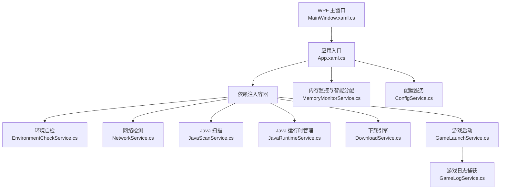
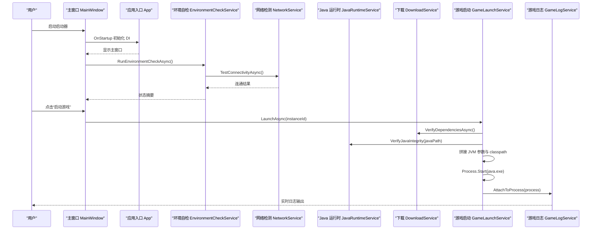
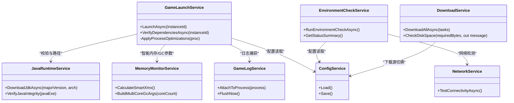

# 故障排除和常见问题

<cite>
**本文引用的文件**   
- [README.md](file://README.md)
- [App.xaml.cs](file://src/FufuLauncher/App.xaml.cs)
- [MainWindow.xaml.cs](file://src/FufuLauncher/MainWindow.xaml.cs)
- [EnvironmentCheckService.cs](file://src/FufuLauncher\Services\EnvironmentCheckService.cs)
- [NetworkService.cs](file://src/FufuLauncher\Services\NetworkService.cs)
- [GameLaunchService.cs](file://src/FufuLauncher\Services\GameLaunchService.cs)
- [JavaRuntimeService.cs](file://src/FufuLauncher\Services\JavaRuntimeService.cs)
- [JavaScanService.cs](file://src/FufuLauncher\Services\JavaScanService.cs)
- [DownloadService.cs](file://src/FufuLauncher\Services\DownloadService.cs)
- [MemoryMonitorService.cs](file://src/FufuLauncher\Services\MemoryMonitorService.cs)
- [GameLogService.cs](file://src/FufuLauncher\Services\GameLogService.cs)
- [ConfigService.cs](file://src/FufuLauncher\Services\ConfigService.cs)
- [config.json](file://Start\appmcGAME\config.json)
</cite>

## 目录
1. [简介](#简介)
2. [项目结构](#项目结构)
3. [核心组件](#核心组件)
4. [架构总览](#架构总览)
5. [详细组件分析](#详细组件分析)
6. [依赖关系分析](#依赖关系分析)
7. [性能注意事项](#性能注意事项)
8. [故障排除指南](#故障排除指南)
9. [结论](#结论)
10. [附录](#附录)

## 简介
本指南面向“可爱的芙芙”启动器用户与技术支持人员，聚焦环境诊断、常见启动失败定位、性能调优、日志分析与跨平台差异处理。文档基于仓库中的服务实现与配置约定，提供可操作的排查步骤与优化建议，并给出问题反馈与社区支持渠道的标准化流程。

## 项目结构
启动器采用 C# WPF (.NET 8) + C++ 原生 DLL 架构，核心业务以“服务”形式组织在 Services 目录中，UI 通过 MVVM 模式调用服务；数据与运行时隔离于 appmcGAME 目录，配置位于 Start\AppData\Roaming\FufuLauncher 下的 config.json。

图表来源
- [App.xaml.cs:138-217](file://src/FufuLauncher/App.xaml.cs#L138-L217)
- [MainWindow.xaml.cs:38-73](file://src/FufuLauncher/MainWindow.xaml.cs#L38-L73)
- [EnvironmentCheckService.cs:52-73](file://src/FufuLauncher\Services\EnvironmentCheckService.cs#L52-L73)
- [NetworkService.cs:34-76](file://src/FufuLauncher\Services\NetworkService.cs#L34-L76)
- [JavaScanService.cs:47-75](file://src/FufuLauncher\Services\JavaScanService.cs#L47-L75)
- [JavaRuntimeService.cs:116-158](file://src/FufuLauncher\Services\JavaRuntimeService.cs#L116-L158)
- [DownloadService.cs:222-261](file://src/FufuLauncher\Services\DownloadService.cs#L222-L261)
- [GameLaunchService.cs:104-120](file://src/FufuLauncher\Services\GameLaunchService.cs#L104-L120)
- [GameLogService.cs:54-65](file://src/FufuLauncher\Services\GameLogService.cs#L54-L65)
- [MemoryMonitorService.cs:62-88](file://src/FufuLauncher\Services\MemoryMonitorService.cs#L62-L88)
- [ConfigService.cs:94-133](file://src/FufuLauncher\Services\ConfigService.cs#L94-L133)

章节来源
- [README.md:34-53](file://README.md#L34-L53)
- [App.xaml.cs:91-114](file://src/FufuLauncher\App.xaml.cs#L91-L114)
- [config.json:1-36](file://Start\appmcGAME\config.json#L1-L36)

## 核心组件
- 应用入口与异常捕获：统一收集未处理异常，写入应用日志并弹窗提示，保障崩溃可追踪。
- 环境自检：检查 .NET 运行时、系统架构、磁盘空间、网络连通、Java 安装情况。
- 网络检测：探测 Mojang 官方源与 BMCLAPI 镜像源连通性与延迟。
- Java 扫描与管理：按需扫描本机 Java，支持多版本识别；提供完整 JDK 下载与解压、完整性校验。
- 下载引擎：多线程分片断点续传、SHA1 校验、自动重试与源降级（Mojang → BMCLAPI）。
- 游戏启动：拼接 classpath 与 JVM 参数，执行进程优先级与 CPU 亲和性优化，绑定日志捕获。
- 内存监控：读取物理内存，智能计算 Xmx/Xms，生成多核 GC 优化参数。
- 配置服务：持久化主题、下载源、JVM 参数、登录配置、Java 镜像等。

章节来源
- [App.xaml.cs:82-156](file://src/FufuLauncher\App.xaml.cs#L82-L156)
- [EnvironmentCheckService.cs:52-73](file://src/FufuLauncher\Services\EnvironmentCheckService.cs#L52-L73)
- [NetworkService.cs:34-76](file://src/FufuLauncher\Services\NetworkService.cs#L34-L76)
- [JavaScanService.cs:47-75](file://src/FufuLauncher\Services\JavaScanService.cs#L47-L75)
- [JavaRuntimeService.cs:199-277](file://src/FufuLauncher\Services\JavaRuntimeService.cs#L199-L277)
- [DownloadService.cs:222-261](file://src/FufuLauncher\Services\DownloadService.cs#L222-L261)
- [GameLaunchService.cs:104-120](file://src/FufuLauncher\Services\GameLaunchService.cs#L104-L120)
- [MemoryMonitorService.cs:175-213](file://src/FufuLauncher\Services\MemoryMonitorService.cs#L175-L213)
- [ConfigService.cs:94-133](file://src/FufuLauncher\Services\ConfigService.cs#L94-L133)

## 架构总览
启动器通过 DI 容器注册全部服务，主窗口加载时异步执行环境自检，并在启动游戏前进行依赖校验、账号令牌校验与 Java 完整性验证。游戏进程输出由 GameLogService 实时捕获并落盘，便于问题回溯。

图表来源
- [MainWindow.xaml.cs:38-73](file://src/FufuLauncher\MainWindow.xaml.cs#L38-L73)
- [App.xaml.cs:138-156](file://src/FufuLauncher\App.xaml.cs#L138-L156)
- [EnvironmentCheckService.cs:52-73](file://src/FufuLauncher\Services\EnvironmentCheckService.cs#L52-L73)
- [NetworkService.cs:34-76](file://src/FufuLauncher\Services\NetworkService.cs#L34-L76)
- [JavaRuntimeService.cs:483-510](file://src/FufuLauncher\Services\JavaRuntimeService.cs#L483-L510)
- [DownloadService.cs:222-261](file://src/FufuLauncher\Services\DownloadService.cs#L222-L261)
- [GameLaunchService.cs:104-120](file://src/FufuLauncher\Services\GameLaunchService.cs#L104-L120)
- [GameLogService.cs:54-65](file://src/FufuLauncher\Services\GameLogService.cs#L54-L65)

## 详细组件分析

### 环境自检与网络诊断
- 自检项：.NET 运行时、操作系统架构、磁盘空间、网络连通、Java 扫描。
- 网络检测：同时探测 Mojang 与 BMCLAPI，返回连通状态与延迟，用于后续下载源选择与问题定位。
- 典型错误信息：
  - “网络连接异常。无法访问 Mojang 官方源与 BMCLAPI 国内镜像源。”
  - “未发现任何 Java 安装”。

章节来源
- [EnvironmentCheckService.cs:52-73](file://src/FufuLauncher\Services\EnvironmentCheckService.cs#L52-L73)
- [EnvironmentCheckService.cs:151-174](file://src/FufuLauncher\Services\EnvironmentCheckService.cs#L151-L174)
- [EnvironmentCheckService.cs:176-213](file://src/FufuLauncher\Services\EnvironmentCheckService.cs#L176-L213)
- [NetworkService.cs:34-76](file://src/FufuLauncher\Services\NetworkService.cs#L34-L76)

### Java 运行时管理与完整性校验
- 本地路径约定：runtimes/jdk-{major}-{arch}/bin/java.exe。
- 下载与解压：优先使用原生解压，失败回退托管实现；完成后上提目录结构确保 java.exe 就位。
- 完整性校验：执行 java -version 判断是否可运行，避免损坏或权限问题导致启动即崩溃。
- 常见错误：
  - “Java 运行时文件缺失(预期:...)”
  - “Java 可执行文件存在但无法正常执行(java -version 失败)”

章节来源
- [JavaRuntimeService.cs:86-105](file://src/FufuLauncher\Services\JavaRuntimeService.cs#L86-L105)
- [JavaRuntimeService.cs:199-277](file://src/FufuLauncher\Services\JavaRuntimeService.cs#L199-L277)
- [JavaRuntimeService.cs:483-510](file://src/FufuLauncher\Services\JavaRuntimeService.cs#L483-L510)

### 下载引擎与断点续传
- 特性：多线程分片、断点续传、SHA1 校验、指数退避重试、源降级（Mojang → BMCLAPI）、全局进度节流。
- 磁盘空间校验：下载前预留 1GB 缓冲，不足则阻止下载并提示。
- 常见错误：
  - “磁盘剩余空间不足,无法开始下载”
  - “文件 SHA1 校验失败”

章节来源
- [DownloadService.cs:222-261](file://src/FufuLauncher\Services\DownloadService.cs#L222-L261)
- [DownloadService.cs:264-293](file://src/FufuLauncher\Services\DownloadService.cs#L264-L293)
- [DownloadService.cs:319-334](file://src/FufuLauncher\Services\DownloadService.cs#L319-L334)

### 游戏启动与 JVM 参数构建
- 启动前校验：实例依赖、账号令牌、Java 完整性。
- JVM 参数：Xms/Xmx、多核 GC 优化、额外参数、认证参数、全屏/分辨率。
- 进程优化：高优先级、CPU 亲和性（可选）。
- 常见错误：
  - “启动前校验发现以下问题: 客户端主程序缺失...”
  - “账号令牌已过期且无法刷新,请重新登录”
  - “无法启动 Java 进程”

章节来源
- [GameLaunchService.cs:104-120](file://src/FufuLauncher\Services\GameLaunchService.cs#L104-L120)
- [GameLaunchService.cs:129-177](file://src/FufuLauncher\Services\GameLaunchService.cs#L129-L177)
- [GameLaunchService.cs:199-267](file://src/FufuLauncher\Services\GameLaunchService.cs#L199-L267)
- [GameLaunchService.cs:318-358](file://src/FufuLauncher\Services\GameLaunchService.cs#L318-L358)

### 内存监控与智能分配
- 定时刷新：DispatcherTimer 在 UI 线程触发，降低卡顿风险。
- 智能算法：当前空闲内存减去系统预留（至少 1GB），按上下限约束并 256MB 对齐。
- 多核 GC 参数：根据物理核心数生成 ParallelGCThreads/ConcGCThreads/CICompilerCount。

章节来源
- [MemoryMonitorService.cs:62-88](file://src/FufuLauncher\Services\MemoryMonitorService.cs#L62-L88)
- [MemoryMonitorService.cs:175-213](file://src/FufuLauncher\Services\MemoryMonitorService.cs#L175-L213)

### 日志系统与错误定位
- 应用日志：app.log 批量写入，后台 Timer 周期刷新，避免高频 IO 阻塞。
- 游戏日志：game.log 独立捕获 stdout/stderr，内存缓冲限制行数，批量落盘。
- 关键位置：
  - 应用日志：{ConfigDir}\app.log
  - 游戏日志：{ConfigDir}\game.log

章节来源
- [App.xaml.cs:40-80](file://src/FufuLauncher\App.xaml.cs#L40-L80)
- [GameLogService.cs:37-52](file://src/FufuLauncher\Services\GameLogService.cs#L37-L52)
- [GameLogService.cs:139-166](file://src/FufuLauncher\Services\GameLogService.cs#L139-L166)

## 依赖关系分析
- 服务间耦合：
  - GameLaunchService 依赖 InstanceService、VersionManifestService、HashVerifyService、AccountService、GameLogService、ConfigService、JavaRuntimeService、MemoryMonitorService。
  - EnvironmentCheckService 依赖 JavaScanService、NetworkService、ConfigService。
  - DownloadService 依赖 ConfigService、NativeInteropService。
- 外部依赖：
  - .NET 8 Desktop Runtime（x64）
  - Windows 10/11 64位
  - Mojang/BMCLAPI 网络可达

图表来源
- [GameLaunchService.cs:48-65](file://src/FufuLauncher\Services\GameLaunchService.cs#L48-L65)
- [EnvironmentCheckService.cs:43-50](file://src/FufuLauncher\Services\EnvironmentCheckService.cs#L43-L50)
- [NetworkService.cs:18-29](file://src/FufuLauncher\Services\NetworkService.cs#L18-L29)
- [JavaRuntimeService.cs:76-84](file://src/FufuLauncher\Services\JavaRuntimeService.cs#L76-L84)
- [DownloadService.cs:99-114](file://src/FufuLauncher\Services\DownloadService.cs#L99-L114)
- [MemoryMonitorService.cs:56-59](file://src/FufuLauncher\Services\MemoryMonitorService.cs#L56-L59)
- [GameLogService.cs:48-52](file://src/FufuLauncher\Services\GameLogService.cs#L48-L52)
- [ConfigService.cs:94-133](file://src/FufuLauncher\Services\ConfigService.cs#L94-L133)

章节来源
- [GameLaunchService.cs:48-65](file://src/FufuLauncher\Services\GameLaunchService.cs#L48-L65)
- [EnvironmentCheckService.cs:43-50](file://src/FufuLauncher\Services\EnvironmentCheckService.cs#L43-L50)
- [DownloadService.cs:99-114](file://src/FufuLauncher\Services\DownloadService.cs#L99-L114)

## 性能注意事项
- JVM 参数调优：
  - 启用多核 GC 优化预设（ParallelGCThreads/ConcGCThreads/CICompilerCount）。
  - 合理设置 Xms/Xmx，结合智能分配策略避免过小或过大。
- 内存配置：
  - 开启 AutoMemoryMode，依据可用内存动态分配，预留系统内存。
- 网络优化：
  - 使用 BMCLAPI 镜像提升下载速度；必要时切换下载源。
- 进程优化：
  - 高优先级与 CPU 亲和性可减少调度延迟，注意权限要求。

章节来源
- [GameLaunchService.cs:215-225](file://src/FufuLauncher\Services\GameLaunchService.cs#L215-L225)
- [MemoryMonitorService.cs:203-213](file://src/FufuLauncher\Services\MemoryMonitorService.cs#L203-L213)
- [DownloadService.cs:171-191](file://src/FufuLauncher\Services\DownloadService.cs#L171-L191)

## 故障排除指南

### 环境问题诊断方法
- Java 运行时问题
  - 现象：启动失败提示“Java 运行时缺失”或“java -version 失败”。
  - 排查：
    - 确认 java.exe 路径正确且文件存在。
    - 执行完整性校验（java -version）判断是否损坏或被拦截。
    - 若为内置 runtimes 路径，前往【☕ Java 运行时】页面下载对应组件。
  - 解决：
    - 重新下载并解压至 runtimes/jdk-{major}-{arch}。
    - 关闭安全软件对 java.exe 的误拦截。
- 网络连接问题
  - 现象：环境自检提示“网络连接异常”，下载缓慢或失败。
  - 排查：
    - 查看 NetworkService 检测结果（Mojang/BMCLAPI 连通与延迟）。
    - 切换下载源至 BMCLAPI 以提升稳定性。
  - 解决：
    - 调整代理/防火墙规则，确保域名解析正常。
- 权限问题
  - 现象：无法设置进程优先级或 CPU 亲和性，或写入配置文件失败。
  - 排查：
    - 以管理员身份运行启动器。
    - 检查目标目录写权限。
  - 解决：
    - 授予管理员权限或修改目录权限。

章节来源
- [GameLaunchService.cs:129-177](file://src/FufuLauncher\Services\GameLaunchService.cs#L129-L177)
- [JavaRuntimeService.cs:483-510](file://src/FufuLauncher\Services\JavaRuntimeService.cs#L483-L510)
- [EnvironmentCheckService.cs:151-174](file://src/FufuLauncher\Services\EnvironmentCheckService.cs#L151-L174)
- [DownloadService.cs:171-191](file://src/FufuLauncher\Services\DownloadService.cs#L171-L191)

### 常见启动失败的排查步骤
- 依赖缺失
  - 现象：启动前校验提示“客户端主程序缺失”或“libraries 库目录缺失”。
  - 排查：
    - 检查 versions/{versionId}/{versionId}.jar 是否存在。
    - 检查 libraries 目录是否完整。
  - 解决：
    - 重新下载版本与库文件，确保 SHA1 校验通过。
- 端口冲突
  - 现象：微软账号登录回调失败（默认端口 54321）。
  - 排查：
    - 检查端口占用情况。
  - 解决：
    - 修改 AuthCallbackPort 或释放端口后重试。
- 配置文件错误
  - 现象：启动器无法读取配置或行为异常。
  - 排查：
    - 检查 config.json 格式与字段有效性。
  - 解决：
    - 恢复默认配置或删除后重启让启动器重建。

章节来源
- [GameLaunchService.cs:70-101](file://src/FufuLauncher\Services\GameLaunchService.cs#L70-L101)
- [ConfigService.cs:94-133](file://src/FufuLauncher\Services\ConfigService.cs#L94-L133)
- [config.json:1-36](file://Start\appmcGAME\config.json#L1-L36)

### 性能问题的诊断和优化方法
- JVM 参数调优
  - 启用 MultiCoreGcOptimize 生成多核 GC 参数。
  - 根据硬件调整 Xms/Xmx，避免过小导致频繁 GC 或过大导致 OOM。
- 内存配置
  - 开启 AutoMemoryMode，合理设置 MemoryReserveMb、AutoMemoryMinMb/MaxMb。
- 网络优化
  - 使用 BMCLAPI 镜像，必要时手动切换下载源。
- 进程优化
  - 启用 HighPriorityProcess 与 CpuAffinityEnabled，注意权限与兼容性。

章节来源
- [GameLaunchService.cs:215-225](file://src/FufuLauncher\Services\GameLaunchService.cs#L215-L225)
- [MemoryMonitorService.cs:175-213](file://src/FufuLauncher\Services\MemoryMonitorService.cs#L175-L213)
- [DownloadService.cs:171-191](file://src/FufuLauncher\Services\DownloadService.cs#L171-L191)

### 日志分析和错误定位技巧
- 日志文件位置
  - 应用日志：{ConfigDir}\app.log
  - 游戏日志：{ConfigDir}\game.log
- 关键错误信息
  - 下载失败：包含“SHA1 校验失败”、“第 N 次失败”等。
  - 启动失败：包含“启动前校验发现以下问题”、“Java 完整性校验未通过”等。
- 调试工具
  - 使用任务管理器观察 Java 进程 CPU/内存占用。
  - 通过事件查看器检查系统级权限或安全软件拦截记录。

章节来源
- [App.xaml.cs:40-80](file://src/FufuLauncher\App.xaml.cs#L40-L80)
- [GameLogService.cs:37-52](file://src/FufuLauncher\Services\GameLogService.cs#L37-L52)
- [DownloadService.cs:319-334](file://src/FufuLauncher\Services\DownloadService.cs#L319-L334)
- [GameLaunchService.cs:157-177](file://src/FufuLauncher\Services\GameLaunchService.cs#L157-L177)

### 不同操作系统和硬件环境的特殊处理方案
- 操作系统
  - 仅支持 64位 Windows 10/11；32位系统会弹出警告并阻止运行。
- 硬件
  - 低内存设备：适当降低 AutoMemoryMaxMb，避免 OOM。
  - 多核 CPU：启用多核 GC 优化与 CPU 亲和性，提升吞吐。
- 网络
  - 国内网络建议使用 BMCLAPI 镜像，减少超时与丢包。

章节来源
- [EnvironmentCheckService.cs:98-117](file://src/FufuLauncher\Services\EnvironmentCheckService.cs#L98-L117)
- [MemoryMonitorService.cs:203-213](file://src/FufuLauncher\Services\MemoryMonitorService.cs#L203-L213)
- [DownloadService.cs:171-191](file://src/FufuLauncher\Services\DownloadService.cs#L171-L191)

### 用户反馈收集和问题报告标准流程
- 收集信息
  - 复制 app.log 与 game.log 内容。
  - 记录操作步骤、期望结果与实际结果。
  - 提供系统版本、硬件配置与网络环境。
- 提交渠道
  - 通过项目 README 提供的联系方式或社区论坛提交。
  - 附上日志与复现步骤，便于快速定位。

章节来源
- [README.md:55-87](file://README.md#L55-L87)

### 社区支持资源和获取帮助的渠道
- 官方文档与源码仓库：查阅 README 与源码注释了解功能与用法。
- 社区论坛与讨论区：参与讨论，分享经验与解决方案。
- 问题跟踪：提交 Issue 并附带日志与复现步骤。

章节来源
- [README.md:55-87](file://README.md#L55-L87)

## 结论
通过系统化环境诊断、日志分析与性能调优，大多数启动失败与性能问题均可快速定位与解决。建议用户优先检查 Java 完整性、网络连通与磁盘空间，其次关注配置与依赖完整性，并结合日志信息进行精准排障。

## 附录
- 常用命令
  - PowerShell 解除 SmartScreen 拦截：Unblock-File -Path "FufuLauncher.exe"
- 关键路径
  - 应用日志：{ConfigDir}\app.log
  - 游戏日志：{ConfigDir}\game.log
  - Java 运行时：{GameDataDir}\runtimes\jdk-{major}-{arch}\bin\java.exe

章节来源
- [README.md:55-87](file://README.md#L55-L87)
- [App.xaml.cs:40-80](file://src/FufuLauncher\App.xaml.cs#L40-L80)
- [GameLogService.cs:37-52](file://src/FufuLauncher\Services\GameLogService.cs#L37-L52)
- [JavaRuntimeService.cs:86-105](file://src/FufuLauncher\Services\JavaRuntimeService.cs#L86-L105)