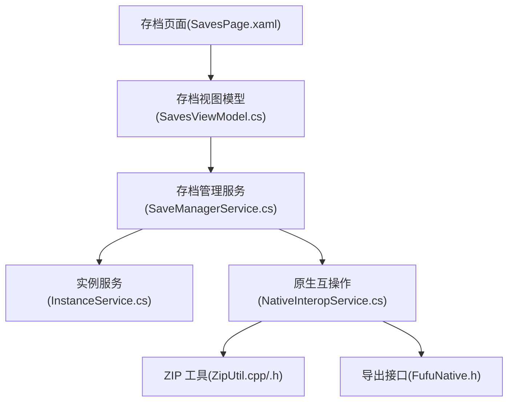
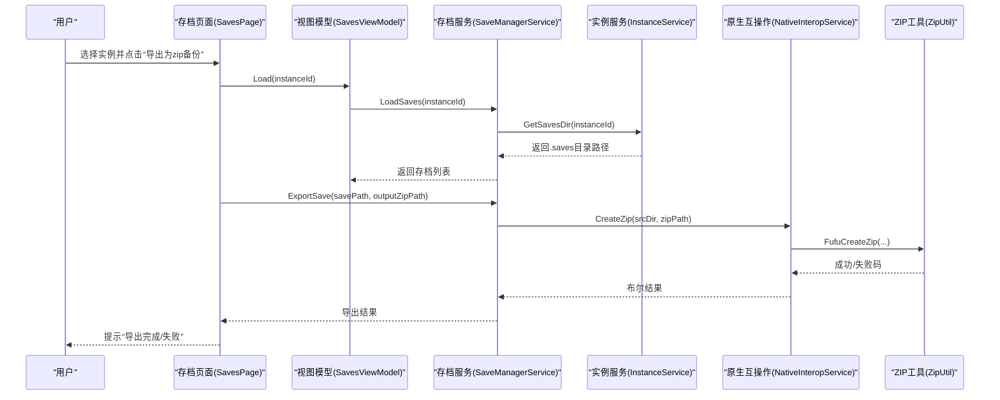
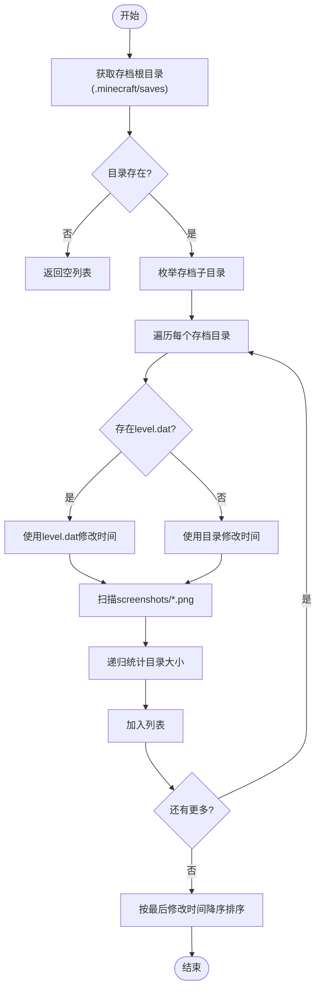
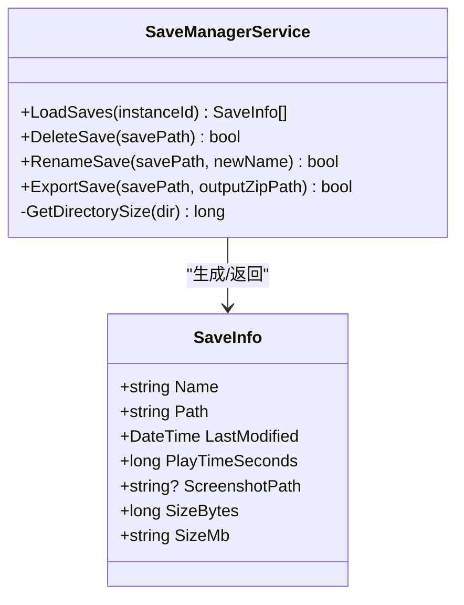
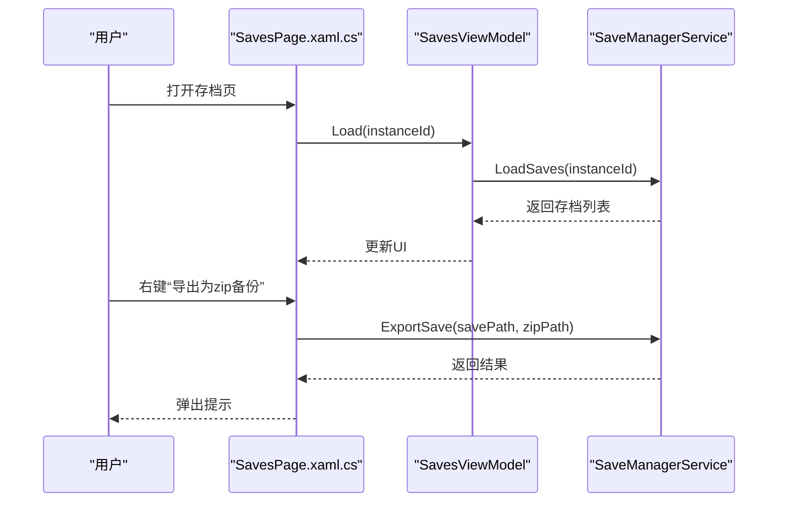
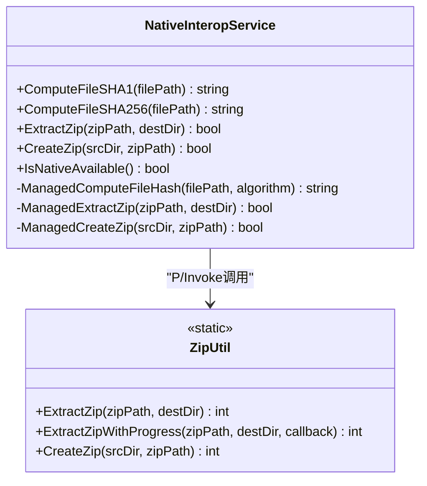

# 存档管理

<cite>
**本文引用的文件**   
- [SaveManagerService.cs](file://src/FufuLauncher/Services/SaveManagerService.cs)
- [SavesViewModel.cs](file://src/FufuLauncher/ViewModels/SavesViewModel.cs)
- [SavesPage.xaml.cs](file://src/FufuLauncher/Views/SavesPage.xaml.cs)
- [SavesPage.xaml](file://src/FufuLauncher/Views/SavesPage.xaml)
- [InstanceService.cs](file://src/FufuLauncher/Services/InstanceService.cs)
- [NativeInteropService.cs](file://src/FufuLauncher/Services/NativeInteropService.cs)
- [ZipUtil.h](file://native/FufuNative/ZipUtil.h)
- [ZipUtil.cpp](file://native/FufuNative/ZipUtil.cpp)
- [FufuNative.h](file://native/FufuNative/FufuNative.h)
</cite>

## 目录
1. [简介](#简介)
2. [项目结构](#项目结构)
3. [核心组件](#核心组件)
4. [架构总览](#架构总览)
5. [详细组件分析](#详细组件分析)
6. [依赖关系分析](#依赖关系分析)
7. [性能考量](#性能考量)
8. [故障排查指南](#故障排查指南)
9. [结论](#结论)
10. [附录](#附录)

## 简介
本文件为“可爱的芙芙启动器”的存档管理服务提供系统化文档，覆盖以下方面：
- Minecraft 游戏存档的组织结构与文件格式说明
- 存档备份功能实现（自动与手动）
- 存档恢复机制（版本兼容性与数据完整性）
- 存档同步与跨实例共享方案
- 存档压缩与增量备份技术建议
- 存档管理最佳实践（定期备份、存储优化）
- 存档损坏修复方法与数据恢复策略

## 项目结构
存档管理相关代码主要分布在 WPF 应用层与服务层，并通过原生 DLL 提供高性能 ZIP 打包/解压能力。关键路径如下：
- 服务层：存档读取、导出、删除、重命名等逻辑
- 视图模型与界面：展示存档列表、截图预览、操作入口
- 实例服务：定位每个实例的 .minecraft/saves 目录
- 原生互操作：通过 P/Invoke 调用 C++ 实现的 ZIP 工具

图表来源
- [SavesPage.xaml:1-64](file://src/FufuLauncher/Views/SavesPage.xaml#L1-L64)
- [SavesViewModel.cs:1-23](file://src/FufuLauncher/ViewModels/SavesViewModel.cs#L1-L23)
- [SaveManagerService.cs:1-119](file://src/FufuLauncher/Services/SaveManagerService.cs#L1-L119)
- [InstanceService.cs:1-253](file://src/FufuLauncher/Services/InstanceService.cs#L1-L253)
- [NativeInteropService.cs:1-214](file://src/FufuLauncher/Services/NativeInteropService.cs#L1-L214)
- [ZipUtil.h:1-29](file://native/FufuNative/ZipUtil.h#L1-L29)
- [ZipUtil.cpp:1-301](file://native/FufuNative/ZipUtil.cpp#L1-L301)
- [FufuNative.h:1-53](file://native/FufuNative/FufuNative.h#L1-L53)

章节来源
- [SaveManagerService.cs:1-119](file://src/FufuLauncher/Services/SaveManagerService.cs#L1-L119)
- [SavesViewModel.cs:1-23](file://src/FufuLauncher/ViewModels/SavesViewModel.cs#L1-L23)
- [SavesPage.xaml.cs:1-93](file://src/FufuLauncher/Views/SavesPage.xaml.cs#L1-L93)
- [SavesPage.xaml:1-64](file://src/FufuLauncher/Views/SavesPage.xaml#L1-L64)
- [InstanceService.cs:1-253](file://src/FufuLauncher/Services/InstanceService.cs#L1-L253)
- [NativeInteropService.cs:1-214](file://src/FufuLauncher/Services/NativeInteropService.cs#L1-L214)
- [ZipUtil.h:1-29](file://native/FufuNative/ZipUtil.h#L1-L29)
- [ZipUtil.cpp:1-301](file://native/FufuNative/ZipUtil.cpp#L1-L301)
- [FufuNative.h:1-53](file://native/FufuNative/FufuNative.h#L1-L53)

## 核心组件
- SaveInfo：存档信息载体，包含名称、路径、最后修改时间、游玩时长估算、截图路径、大小等
- SaveManagerService：存档加载、统计、删除、重命名、导出 zip 的核心服务
- SavesViewModel：将存档列表绑定到 UI 的视图模型
- InstanceService：多实例隔离与目录定位（含 .minecraft/saves）
- NativeInteropService：C# 与 C++ 原生的互操作封装，提供哈希计算与 ZIP 打包/解压，具备 fallback 机制

章节来源
- [SaveManagerService.cs:14-23](file://src/FufuLauncher/Services/SaveManagerService.cs#L14-L23)
- [SaveManagerService.cs:25-119](file://src/FufuLauncher/Services/SaveManagerService.cs#L25-L119)
- [SavesViewModel.cs:7-23](file://src/FufuLauncher/ViewModels/SavesViewModel.cs#L7-L23)
- [InstanceService.cs:27-49](file://src/FufuLauncher/Services/InstanceService.cs#L27-L49)
- [InstanceService.cs:140-141](file://src/FufuLauncher/Services/InstanceService.cs#L140-L141)
- [NativeInteropService.cs:20-214](file://src/FufuLauncher/Services/NativeInteropService.cs#L20-L214)

## 架构总览
存档管理采用分层设计：UI 层通过 ViewModel 调用 Service 层，Service 层通过 InstanceService 定位存档目录，并通过 NativeInteropService 调用原生 ZIP 工具完成打包/解压。

图表来源
- [SavesPage.xaml.cs:61-78](file://src/FufuLauncher/Views/SavesPage.xaml.cs#L61-L78)
- [SavesViewModel.cs:17-21](file://src/FufuLauncher/ViewModels/SavesViewModel.cs#L17-L21)
- [SaveManagerService.cs:37-74](file://src/FufuLauncher/Services/SaveManagerService.cs#L37-L74)
- [SaveManagerService.cs:113-117](file://src/FufuLauncher/Services/SaveManagerService.cs#L113-L117)
- [InstanceService.cs:140-141](file://src/FufuLauncher/Services/InstanceService.cs#L140-L141)
- [NativeInteropService.cs:104-119](file://src/FufuLauncher/Services/NativeInteropService.cs#L104-L119)
- [ZipUtil.cpp:203-301](file://native/FufuNative/ZipUtil.cpp#L203-L301)

## 详细组件分析

### 存档数据结构与读取流程
- SaveInfo 字段说明：名称、路径、最后修改时间、游玩时长（简化估算）、截图路径、大小（字节与 MB 显示）
- LoadSaves 流程：
  - 通过 InstanceService.GetSavesDir 获取存档根目录
  - 枚举子目录作为单个存档
  - 若存在 level.dat，以其修改时间作为最后游玩时间
  - 扫描 screenshots/*.png 取首张截图作为预览
  - 递归统计目录大小
  - 按最后修改时间倒序排序

图表来源
- [SaveManagerService.cs:37-74](file://src/FufuLauncher/Services/SaveManagerService.cs#L37-L74)
- [SaveManagerService.cs:76-89](file://src/FufuLauncher/Services/SaveManagerService.cs#L76-L89)

章节来源
- [SaveManagerService.cs:14-23](file://src/FufuLauncher/Services/SaveManagerService.cs#L14-L23)
- [SaveManagerService.cs:37-89](file://src/FufuLauncher/Services/SaveManagerService.cs#L37-L89)

### 存档操作：删除、重命名、导出
- 删除：直接递归删除存档目录
- 重命名：校验新名称合法性、目标不存在后移动目录
- 导出：调用原生 ZIP 工具创建压缩包

图表来源
- [SaveManagerService.cs:25-119](file://src/FufuLauncher/Services/SaveManagerService.cs#L25-L119)
- [SaveManagerService.cs:14-23](file://src/FufuLauncher/Services/SaveManagerService.cs#L14-L23)

章节来源
- [SaveManagerService.cs:91-117](file://src/FufuLauncher/Services/SaveManagerService.cs#L91-L117)

### 界面交互与数据绑定
- SavesPage.xaml 定义存档列表、上下文菜单（重命名、导出、删除）
- SavesViewModel 负责加载存档列表并绑定到 UI
- SavesPage.xaml.cs 处理用户事件，调用 SaveManagerService 执行操作

图表来源
- [SavesPage.xaml:14-30](file://src/FufuLauncher/Views/SavesPage.xaml#L14-L30)
- [SavesViewModel.cs:17-21](file://src/FufuLauncher/ViewModels/SavesViewModel.cs#L17-L21)
- [SavesPage.xaml.cs:61-78](file://src/FufuLauncher/Views/SavesPage.xaml.cs#L61-L78)
- [SaveManagerService.cs:113-117](file://src/FufuLauncher/Services/SaveManagerService.cs#L113-L117)

章节来源
- [SavesPage.xaml:1-64](file://src/FufuLauncher/Views/SavesPage.xaml#L1-L64)
- [SavesViewModel.cs:1-23](file://src/FufuLauncher/ViewModels/SavesViewModel.cs#L1-L23)
- [SavesPage.xaml.cs:1-93](file://src/FufuLauncher/Views/SavesPage.xaml.cs#L1-L93)

### 原生 ZIP 工具与互操作
- NativeInteropService 提供 ComputeFileSHA1/SHA256、ExtractZip、CreateZip 等方法
- 优先尝试调用 C++ 原生 DLL；失败时回退到纯 .NET 托管实现
- ZipUtil.cpp 基于 Windows Shell COM 实现 ZIP 解压与打包

图表来源
- [NativeInteropService.cs:20-214](file://src/FufuLauncher/Services/NativeInteropService.cs#L20-L214)
- [ZipUtil.h:9-28](file://native/FufuNative/ZipUtil.h#L9-L28)
- [ZipUtil.cpp:57-301](file://native/FufuNative/ZipUtil.cpp#L57-L301)

章节来源
- [NativeInteropService.cs:104-119](file://src/FufuLauncher/Services/NativeInteropService.cs#L104-L119)
- [ZipUtil.cpp:203-301](file://native/FufuNative/ZipUtil.cpp#L203-L301)

## 依赖关系分析
- SaveManagerService 依赖 InstanceService 获取存档目录
- SaveManagerService 依赖 NativeInteropService 进行 ZIP 打包
- NativeInteropService 依赖 C++ 原生库（可选），并提供托管 fallback
- UI 层通过 ViewModel 与 Service 解耦

图表来源
- [SavesPage.xaml.cs:1-93](file://src/FufuLauncher/Views/SavesPage.xaml.cs#L1-L93)
- [SavesViewModel.cs:1-23](file://src/FufuLauncher/ViewModels/SavesViewModel.cs#L1-L23)
- [SaveManagerService.cs:1-119](file://src/FufuLauncher/Services/SaveManagerService.cs#L1-L119)
- [InstanceService.cs:1-253](file://src/FufuLauncher/Services/InstanceService.cs#L1-L253)
- [NativeInteropService.cs:1-214](file://src/FufuLauncher/Services/NativeInteropService.cs#L1-L214)
- [ZipUtil.h:1-29](file://native/FufuNative/ZipUtil.h#L1-L29)
- [ZipUtil.cpp:1-301](file://native/FufuNative/ZipUtil.cpp#L1-L301)

章节来源
- [SaveManagerService.cs:27-35](file://src/FufuLauncher/Services/SaveManagerService.cs#L27-L35)
- [NativeInteropService.cs:20-214](file://src/FufuLauncher/Services/NativeInteropService.cs#L20-L214)

## 性能考量
- ZIP 打包/解压优先使用 C++ 原生实现，失败自动回退到托管实现，保证可用性与性能平衡
- 目录大小统计采用递归枚举，对超大存档可能耗时较长，建议在后台线程执行或限制深度
- 截图预览仅取首个 PNG，避免过多 IO
- 哈希计算支持 SHA1/SHA256，原生实现更快，fallback 保证兼容性

[本节为通用指导，不直接分析具体文件]

## 故障排查指南
- 导出失败
  - 检查输出目录是否存在且可写
  - 确认源存档目录存在且可读
  - 查看 NativeInteropService 是否检测到原生 DLL 不可用，必要时启用托管 fallback
- 重命名失败
  - 检查新名称是否包含非法字符
  - 确保目标路径不存在同名目录
- 删除失败
  - 确认存档目录未被占用（如游戏进程仍在运行）
- 截图未显示
  - 确认 screenshots 目录下存在 *.png 文件

章节来源
- [SaveManagerService.cs:91-117](file://src/FufuLauncher/Services/SaveManagerService.cs#L91-L117)
- [NativeInteropService.cs:104-119](file://src/FufuLauncher/Services/NativeInteropService.cs#L104-L119)
- [SavesPage.xaml.cs:41-58](file://src/FufuLauncher/Views/SavesPage.xaml.cs#L41-L58)

## 结论
当前存档管理模块提供了基础的存档浏览、导出、删除与重命名能力，并通过原生 ZIP 工具提升性能与稳定性。未来可在自动备份策略、增量备份、跨实例同步等方面进一步增强，以满足更复杂的存档管理与协作需求。

[本节为总结性内容，不直接分析具体文件]

## 附录

### Minecraft 存档组织结构与文件格式
- 实例目录结构（由 InstanceService 维护）：
  - instances/{InstanceId}/.minecraft/saves/{存档名}/
  - 常见文件：
    - level.dat：存档元数据（包含世界信息、游玩时长等）
    - region/：区块数据
    - data/：自定义数据
    - screenshots/：截图图片（PNG）
- 截图预览：从 screenshots 目录中查找首个 PNG 文件

章节来源
- [InstanceService.cs:140-141](file://src/FufuLauncher/Services/InstanceService.cs#L140-L141)
- [SaveManagerService.cs:52-68](file://src/FufuLauncher/Services/SaveManagerService.cs#L52-L68)

### 存档备份功能实现
- 手动备份：通过 UI 触发导出为 ZIP，调用 NativeInteropService.CreateZip
- 自动备份策略（建议）：
  - 在每次关闭游戏前触发一次全量备份
  - 定时任务按天/周生成增量备份（需记录上次备份时间戳）
  - 保留最近 N 个备份，超出则清理旧备份

章节来源
- [SavesPage.xaml.cs:61-78](file://src/FufuLauncher/Views/SavesPage.xaml.cs#L61-L78)
- [SaveManagerService.cs:113-117](file://src/FufuLauncher/Services/SaveManagerService.cs#L113-L117)
- [NativeInteropService.cs:104-119](file://src/FufuLauncher/Services/NativeInteropService.cs#L104-L119)

### 存档恢复机制
- 恢复步骤：
  - 解压 ZIP 到目标 .minecraft/saves/{存档名}/
  - 校验 level.dat 与 region 目录完整性
  - 验证哈希（SHA1/SHA256）确保数据一致性
- 版本兼容性：
  - 不同主版本的存档可能不兼容，恢复前需确认游戏版本一致
  - 可通过读取 level.dat 中的版本字段判断兼容性

章节来源
- [NativeInteropService.cs:85-101](file://src/FufuLauncher/Services/NativeInteropService.cs#L85-L101)
- [ZipUtil.cpp:57-200](file://native/FufuNative/ZipUtil.cpp#L57-L200)

### 存档同步与跨实例共享
- 共享方式：
  - 将同一存档目录软链接到多个实例的 .minecraft/saves/{存档名}/
  - 或使用网络共享路径（注意并发写入冲突）
- 注意事项：
  - 避免同时运行多个实例访问同一存档
  - 建议使用锁文件或队列控制写入顺序

[本节为概念性说明，不直接分析具体文件]

### 存档压缩与增量备份技术
- 压缩格式：ZIP（原生实现基于 Windows Shell COM）
- 增量备份建议：
  - 记录上次备份时间戳，仅复制变更文件
  - 使用文件哈希对比确定差异
  - 合并历史增量以节省空间

章节来源
- [NativeInteropService.cs:104-119](file://src/FufuLauncher/Services/NativeInteropService.cs#L104-L119)
- [ZipUtil.cpp:203-301](file://native/FufuNative/ZipUtil.cpp#L203-L301)

### 存档管理最佳实践
- 定期备份：
  - 每日自动全量备份，保留最近 7 份
  - 重大改动前手动备份
- 存储优化：
  - 清理旧截图与日志
  - 归档长期不玩的存档至冷存储
- 数据完整性：
  - 备份完成后校验哈希
  - 恢复后进行游戏内验证

[本节为通用指导，不直接分析具体文件]

### 存档损坏修复与数据恢复策略
- 修复方法：
  - 使用 level.dat 修复工具（外部工具）
  - 从 region 目录重建区块索引
- 数据恢复：
  - 从最近的备份恢复
  - 若部分文件损坏，尝试替换对应文件

[本节为通用指导，不直接分析具体文件]