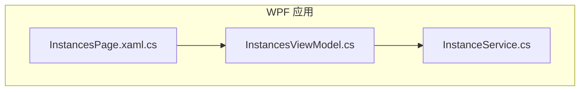
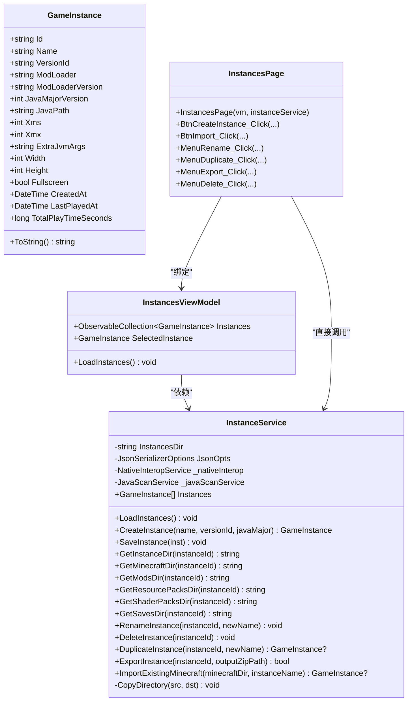
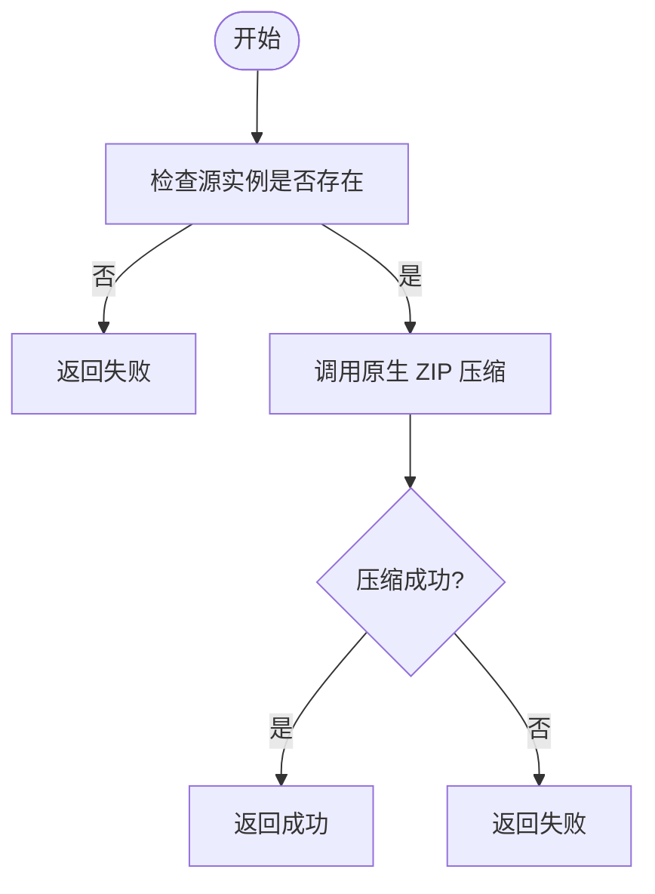
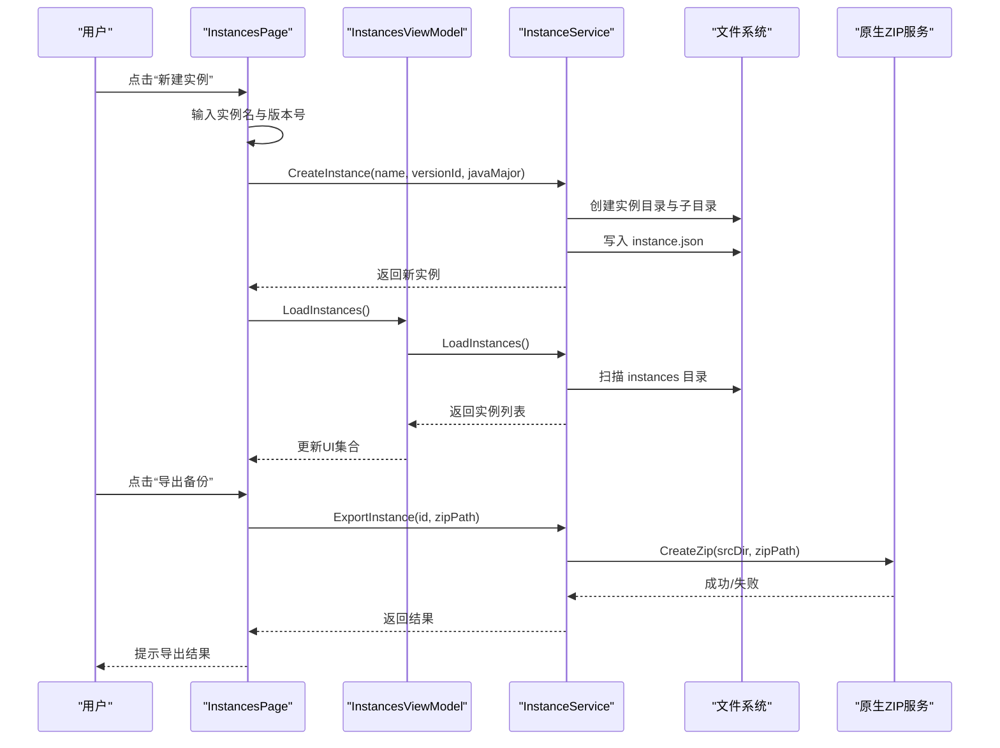
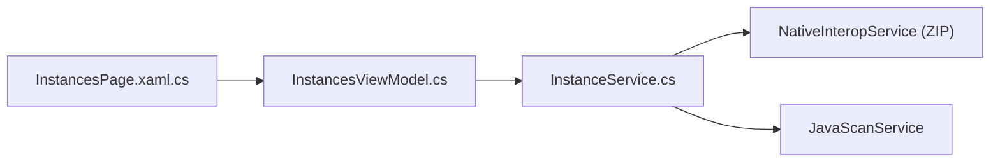
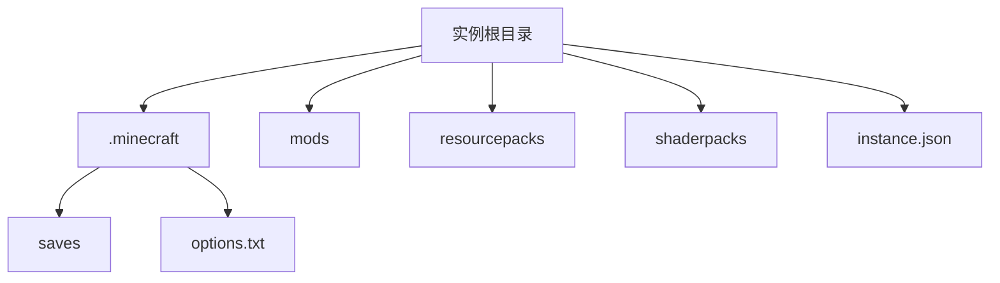

# 实例管理

<cite>
**本文引用的文件**   
- [README.md](file://README.md)
- [InstanceService.cs](file://src/FufuLauncher/Services/InstanceService.cs)
- [InstancesViewModel.cs](file://src/FufuLauncher/ViewModels/InstancesViewModel.cs)
- [InstancesPage.xaml.cs](file://src/FufuLauncher/Views/InstancesPage.xaml.cs)
</cite>

## 目录
1. [简介](#简介)
2. [项目结构](#项目结构)
3. [核心组件](#核心组件)
4. [架构总览](#架构总览)
5. [详细组件分析](#详细组件分析)
6. [依赖关系分析](#依赖关系分析)
7. [性能考虑](#性能考虑)
8. [故障排查指南](#故障排查指南)
9. [结论](#结论)
10. [附录](#附录)

## 简介
本文件为“可爱的芙芙”启动器的游戏实例管理系统提供系统化文档，重点说明多隔离实例的架构设计、数据模型、目录规范与操作流程。系统通过每个实例独立存放 mods、saves、resourcepacks、options 等目录，实现完全隔离；并提供创建、复制、删除、重命名、导出备份以及导入已有 .minecraft 目录的能力。

## 项目结构
与实例管理相关的代码主要位于 WPF 主程序项目中：
- 服务层：实例管理的业务逻辑集中在 InstanceService
- 视图模型层：InstancesViewModel 负责将服务暴露给 UI
- 视图层：InstancesPage.xaml.cs 处理用户交互并调用服务

图表来源 
- [InstancesPage.xaml.cs:1-148](file://src/FufuLauncher/Views/InstancesPage.xaml.cs#L1-L148)
- [InstancesViewModel.cs:1-33](file://src/FufuLauncher/ViewModels/InstancesViewModel.cs#L1-L33)
- [InstanceService.cs:1-253](file://src/FufuLauncher/Services/InstanceService.cs#L1-L253)

章节来源
- [README.md:1-87](file://README.md#L1-L87)

## 核心组件
- GameInstance 数据模型：描述实例元信息（名称、版本、加载器）、Java 配置（路径、主/最大内存、额外参数）与显示参数（分辨率、全屏）。
- InstanceService：封装实例生命周期操作（创建、保存、重命名、删除、复制、导出、导入），维护实例列表与目录访问方法。
- InstancesViewModel：聚合服务实例，向 UI 暴露可观察集合与选中项。
- InstancesPage：UI 事件入口，驱动创建、导入、重命名、复制、导出、删除等操作。

章节来源
- [InstanceService.cs:27-49](file://src/FufuLauncher/Services/InstanceService.cs#L27-L49)
- [InstanceService.cs:51-253](file://src/FufuLauncher/Services/InstanceService.cs#L51-L253)
- [InstancesViewModel.cs:1-33](file://src/FufuLauncher/ViewModels/InstancesViewModel.cs#L1-L33)
- [InstancesPage.xaml.cs:1-148](file://src/FufuLauncher/Views/InstancesPage.xaml.cs#L1-L148)

## 架构总览
实例管理采用分层架构：UI 层触发操作，ViewModel 层协调服务，Service 层执行业务逻辑与文件系统操作。实例数据以 JSON 持久化到 instance.json，目录结构遵循 Minecraft 约定并在实例根下隔离。

图表来源 
- [InstanceService.cs:27-253](file://src/FufuLauncher/Services/InstanceService.cs#L27-L253)
- [InstancesViewModel.cs:1-33](file://src/FufuLauncher/ViewModels/InstancesViewModel.cs#L1-L33)
- [InstancesPage.xaml.cs:1-148](file://src/FufuLauncher/Views/InstancesPage.xaml.cs#L1-L148)

## 详细组件分析

### 数据模型：GameInstance
- 字段覆盖实例标识、名称、版本、模组加载器、Java 环境、内存与 JVM 参数、显示设置与时间戳。
- ToString 用于列表控件友好显示。

章节来源
- [InstanceService.cs:27-49](file://src/FufuLauncher/Services/InstanceService.cs#L27-L49)

### 服务层：InstanceService
职责与关键点：
- 实例目录定位：基于 App.GameDataDir 下的 instances 子目录组织所有实例。
- 实例加载：扫描实例目录，读取 instance.json 构建实例列表，忽略损坏实例。
- 实例创建：生成唯一 ID，创建标准目录结构（.minecraft、mods、resourcepacks、shaderpacks），写入 instance.json。
- 保存元数据：序列化 GameInstance 到 instance.json。
- 路径辅助：提供获取 .minecraft、mods、resourcepacks、shaderpacks、saves 的路径方法。
- 重命名与删除：更新元数据或直接删除实例目录。
- 复制实例：递归复制整个实例目录，重建元数据并加入内存列表。
- 导出备份：调用原生 DLL 压缩实例目录为 zip。
- 导入现有 .minecraft：复制 .minecraft 目录，补全标准子目录，尝试识别版本号，生成实例元数据。
- 内部工具：递归复制目录。

图表来源 
- [InstanceService.cs:193-199](file://src/FufuLauncher/Services/InstanceService.cs#L193-L199)

章节来源
- [InstanceService.cs:51-253](file://src/FufuLauncher/Services/InstanceService.cs#L51-L253)

### 视图模型：InstancesViewModel
- 持有 ObservableCollection<GameInstance> 供 UI 绑定。
- LoadInstances 从服务层刷新实例列表并同步到 UI。

章节来源
- [InstancesViewModel.cs:1-33](file://src/FufuLauncher/ViewModels/InstancesViewModel.cs#L1-L33)

### 视图层：InstancesPage
- 页面加载时触发 LoadInstances。
- 新建实例：弹出输入框获取名称与版本号，调用服务创建实例并刷新列表。
- 导入 .minecraft：选择已有目录，输入实例名后导入并刷新列表。
- 重命名/复制/导出/删除：通过上下文菜单或按钮触发对应服务方法，完成后刷新列表。
- 模组加载器安装：调用 ModLoaderInstallService 安装 Forge/Fabric/Quilt（由服务层处理）。

图表来源 
- [InstancesPage.xaml.cs:27-96](file://src/FufuLauncher/Views/InstancesPage.xaml.cs#L27-L96)
- [InstanceService.cs:94-116](file://src/FufuLauncher/Services/InstanceService.cs#L94-L116)
- [InstanceService.cs:193-199](file://src/FufuLauncher/Services/InstanceService.cs#L193-L199)

章节来源
- [InstancesPage.xaml.cs:1-148](file://src/FufuLauncher/Views/InstancesPage.xaml.cs#L1-L148)

## 依赖关系分析
- InstancesPage 依赖 InstancesViewModel 与 InstanceService。
- InstancesViewModel 依赖 InstanceService 与 ConfigService（用于获取 Java 版本）。
- InstanceService 依赖 NativeInteropService（ZIP 压缩）与 JavaScanService（查找合适的 Java 路径）。
- 所有实例数据通过 JSON 持久化，目录结构严格遵循约定。

图表来源 
- [InstancesPage.xaml.cs:1-148](file://src/FufuLauncher/Views/InstancesPage.xaml.cs#L1-L148)
- [InstancesViewModel.cs:1-33](file://src/FufuLauncher/ViewModels/InstancesViewModel.cs#L1-L33)
- [InstanceService.cs:51-253](file://src/FufuLauncher/Services/InstanceService.cs#L51-L253)

章节来源
- [InstancesPage.xaml.cs:1-148](file://src/FufuLauncher/Views/InstancesPage.xaml.cs#L1-L148)
- [InstancesViewModel.cs:1-33](file://src/FufuLauncher/ViewModels/InstancesViewModel.cs#L1-L33)
- [InstanceService.cs:51-253](file://src/FufuLauncher/Services/InstanceService.cs#L51-L253)

## 性能考虑
- 实例加载：枚举实例目录并逐个读取 JSON，建议对大目录进行分页或懒加载以提升响应速度。
- 复制与导入：递归复制可能涉及大量小文件，建议在后台线程执行并显示进度。
- 导出备份：使用原生 ZIP 压缩，避免在 UI 线程阻塞；对大实例可分块压缩或增量备份。
- JSON 序列化：启用忽略空值与缩进输出，便于阅读但体积略增，可按需调整。

[本节为通用指导，不直接分析具体文件]

## 故障排查指南
- 无法加载实例：检查 instances 目录下各实例的 instance.json 是否完整且可读；损坏实例会被忽略。
- 导入失败：确认选择的 .minecraft 目录存在且包含 versions 子目录；若缺失，版本号将为空。
- 导出失败：检查目标路径是否有写入权限；确认原生 ZIP 功能可用。
- 删除误删：删除前会二次确认；如需恢复，请从备份 zip 中还原。
- Java 路径问题：确保 JavaScanService 能正确扫描到指定版本的 Java；必要时手动配置 JavaPath。

章节来源
- [InstanceService.cs:72-92](file://src/FufuLauncher/Services/InstanceService.cs#L72-L92)
- [InstanceService.cs:201-238](file://src/FufuLauncher/Services/InstanceService.cs#L201-L238)
- [InstanceService.cs:193-199](file://src/FufuLauncher/Services/InstanceService.cs#L193-L199)
- [InstancesPage.xaml.cs:136-145](file://src/FufuLauncher/Views/InstancesPage.xaml.cs#L136-L145)

## 结论
实例管理系统通过清晰的分层设计与严格的目录规范，实现了 Minecraft 多实例的完全隔离与便捷管理。用户可通过 UI 完成创建、导入、复制、重命名、导出与删除等操作；服务层保证数据一致性与可靠性。建议在生产环境中结合异步任务与错误提示提升用户体验。

[本节为总结性内容，不直接分析具体文件]

## 附录

### 实例目录结构与文件组织规范
- 根目录：{GameDataDir}\instances\{InstanceId}\
- .minecraft：游戏根目录（version jar、libraries、assets、saves、options.txt 等）
- mods：模组文件
- resourcepacks：资源包
- shaderpacks：光影包
- instance.json：实例元数据（名称、版本、Java、内存、显示等）

图表来源 
- [InstanceService.cs:5-13](file://src/FufuLauncher/Services/InstanceService.cs#L5-L13)
- [InstanceService.cs:125-141](file://src/FufuLauncher/Services/InstanceService.cs#L125-L141)

章节来源
- [InstanceService.cs:5-13](file://src/FufuLauncher/Services/InstanceService.cs#L5-L13)
- [InstanceService.cs:125-141](file://src/FufuLauncher/Services/InstanceService.cs#L125-L141)

### 最佳实践
- 命名规范：实例名简洁明确，避免特殊字符；ID 自动生成，无需手动编辑。
- 版本管理：不同 Minecraft 版本与模组加载器建议使用独立实例隔离。
- 备份策略：定期导出 zip 备份，保留历史版本以便回滚。
- 资源复用：多个实例可共享同一 Java 运行时；mods/resourcepacks 按需放置。
- 性能调优：根据硬件合理设置 Xms/Xmx，避免过大导致频繁 GC。

[本节为通用指导，不直接分析具体文件]