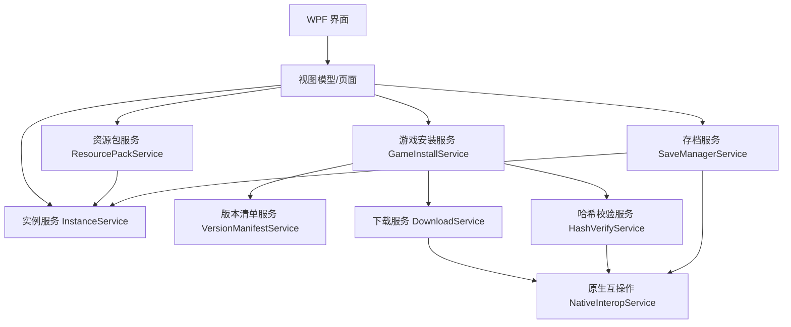
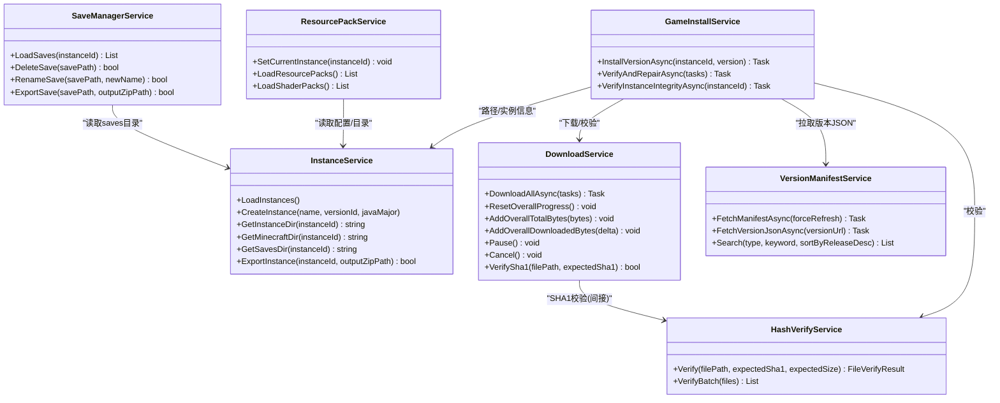
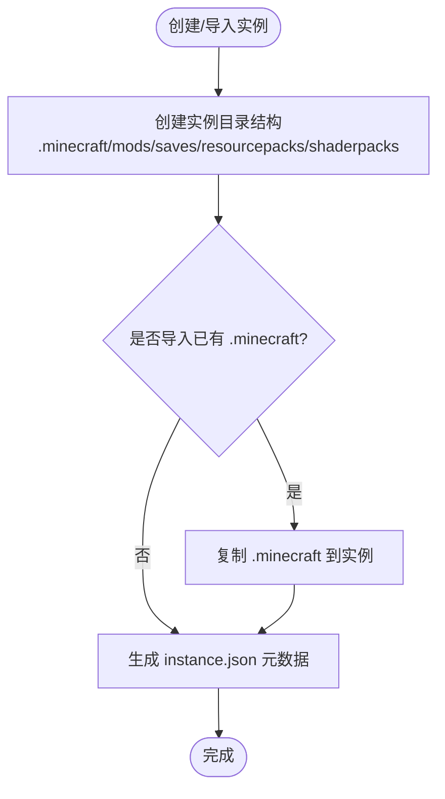
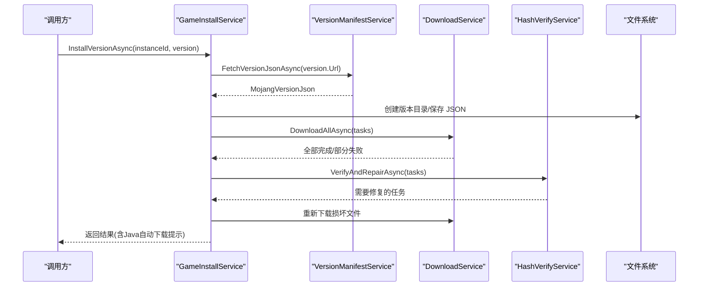
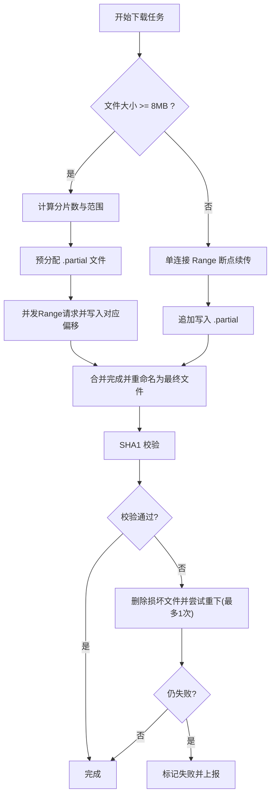
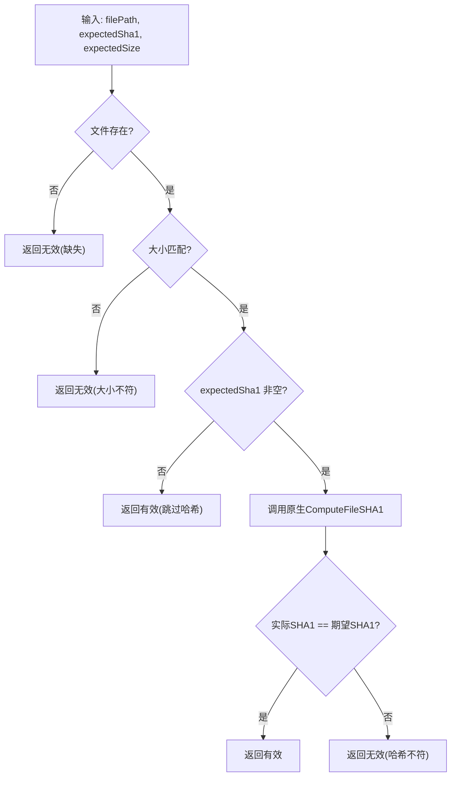
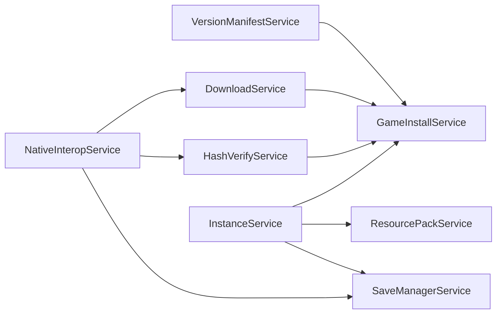

# 文件管理系统

<cite>
**本文引用的文件**   
- [README.md](file://README.md)
- [InstanceService.cs](file://src/FufuLauncher/Services/InstanceService.cs)
- [GameInstallService.cs](file://src/FufuLauncher/Services/GameInstallService.cs)
- [DownloadService.cs](file://src/FufuLauncher/Services/DownloadService.cs)
- [HashVerifyService.cs](file://src/FufuLauncher/Services/HashVerifyService.cs)
- [VersionManifestService.cs](file://src/FufuLauncher/Services/VersionManifestService.cs)
- [SaveManagerService.cs](file://src/FufuLauncher/Services/SaveManagerService.cs)
- [ResourcePackService.cs](file://src/FufuLauncher/Services/ResourcePackService.cs)
- [HashUtil.h](file://native/FufuNative/HashUtil.h)
- [ZipUtil.h](file://native/FufuNative/ZipUtil.h)
</cite>

## 目录
1. [简介](#简介)
2. [项目结构](#项目结构)
3. [核心组件](#核心组件)
4. [架构总览](#架构总览)
5. [详细组件分析](#详细组件分析)
6. [依赖关系分析](#依赖关系分析)
7. [性能考量](#性能考量)
8. [故障排查指南](#故障排查指南)
9. [结论](#结论)
10. [附录](#附录)

## 简介
本文件管理系统面向“可爱的芙芙”启动器，围绕 Minecraft 的实例与资源组织、版本安装、存档管理、资源包管理以及高性能文件 I/O 与完整性校验展开。系统采用 C# WPF（.NET 8）作为主程序，配合 C++ 原生 DLL 提供哈希计算与 ZIP 打包/解压能力，实现稳定、可恢复、跨镜像源的文件下载与校验流程，并提供多实例隔离、资源包顺序控制与存档导出等实用功能。

## 项目结构
- 应用层：C# WPF 服务模块负责业务编排与用户交互
- 网络与下载：多线程分片断点续传、双进度、自动重试与镜像源切换
- 版本清单：拉取并缓存 Mojang 版本清单，支持搜索与类型过滤
- 实例管理：每个实例独立 .minecraft、mods、saves、resourcepacks、shaderpacks、options.txt、instance.json
- 完整性校验：SHA1/大小校验，失败自动修复
- 原生工具：BCrypt 高效哈希、Shell ZIP 打包/解压

**图表来源** 
- [InstanceService.cs:1-253](file://src/FufuLauncher/Services/InstanceService.cs#L1-L253)
- [GameInstallService.cs:1-457](file://src/FufuLauncher/Services/GameInstallService.cs#L1-L457)
- [DownloadService.cs:1-592](file://src/FufuLauncher/Services/DownloadService.cs#L1-L592)
- [HashVerifyService.cs:1-85](file://src/FufuLauncher/Services/HashVerifyService.cs#L1-L85)
- [VersionManifestService.cs:1-338](file://src/FufuLauncher/Services/VersionManifestService.cs#L1-L338)
- [ResourcePackService.cs:1-147](file://src/FufuLauncher/Services/ResourcePackService.cs#L1-L147)
- [SaveManagerService.cs:1-119](file://src/FufuLauncher/Services/SaveManagerService.cs#L1-L119)

**章节来源**
- [README.md:1-87](file://README.md#L1-L87)

## 核心组件
- 实例服务（InstanceService）
  - 维护实例元数据与目录映射，支持创建、复制、删除、导入已有 .minecraft、导出 zip 备份
  - 提供 .minecraft、mods、saves、resourcepacks、shaderpacks 路径解析
- 游戏安装服务（GameInstallService）
  - 完整安装流程：拉取版本 JSON → 下载 client.jar → 下载 libraries（含 natives）→ 下载 asset index 与 assets → 校验与修复 → 可选自动下载 Java
- 下载服务（DownloadService）
  - 多线程并发、按类别独立信号量；大文件分片下载（≥8MB）；断点续传（.partial）；SHA1 校验；指数退避重试；官方/BMCLAPI 镜像源切换；全局与单任务双进度
- 哈希校验服务（HashVerifyService）
  - 基于原生 SHA1 计算与大小比对，批量校验返回需重下列表
- 版本清单服务（VersionManifestService）
  - 拉取并缓存 version_manifest_v2.json，支持按类型筛选、关键词搜索、URL 重写适配镜像源
- 资源包服务（ResourcePackService）
  - 读取 resourcepacks/shaderpacks，解析 pack.mcmeta，读取 options.txt 中的启用列表与顺序
- 存档服务（SaveManagerService）
  - 扫描 saves 目录，统计大小、截图预览、删除、重命名、导出 zip

**章节来源**
- [InstanceService.cs:1-253](file://src/FufuLauncher/Services/InstanceService.cs#L1-L253)
- [GameInstallService.cs:1-457](file://src/FufuLauncher/Services/GameInstallService.cs#L1-L457)
- [DownloadService.cs:1-592](file://src/FufuLauncher/Services/DownloadService.cs#L1-L592)
- [HashVerifyService.cs:1-85](file://src/FufuLauncher/Services/HashVerifyService.cs#L1-L85)
- [VersionManifestService.cs:1-338](file://src/FufuLauncher/Services/VersionManifestService.cs#L1-L338)
- [ResourcePackService.cs:1-147](file://src/FufuLauncher/Services/ResourcePackService.cs#L1-L147)
- [SaveManagerService.cs:1-119](file://src/FufuLauncher/Services/SaveManagerService.cs#L1-L119)

## 架构总览
系统以“服务”为中心，通过依赖注入组合各职责模块。下载与校验由原生能力加速，版本清单与下载 URL 统一受配置源控制，确保在国内外网络环境下均可用。

**图表来源** 
- [InstanceService.cs:1-253](file://src/FufuLauncher/Services/InstanceService.cs#L1-L253)
- [GameInstallService.cs:1-457](file://src/FufuLauncher/Services/GameInstallService.cs#L1-L457)
- [DownloadService.cs:1-592](file://src/FufuLauncher/Services/DownloadService.cs#L1-L592)
- [HashVerifyService.cs:1-85](file://src/FufuLauncher/Services/HashVerifyService.cs#L1-L85)
- [VersionManifestService.cs:1-338](file://src/FufuLauncher/Services/VersionManifestService.cs#L1-L338)
- [ResourcePackService.cs:1-147](file://src/FufuLauncher/Services/ResourcePackService.cs#L1-L147)
- [SaveManagerService.cs:1-119](file://src/FufuLauncher/Services/SaveManagerService.cs#L1-L119)

## 详细组件分析

### 实例管理与目录结构
- 实例根目录位于 AppDataDir/instances/{InstanceId}/
- 标准子目录：.minecraft（版本 jar、libraries、assets）、mods、saves、resourcepacks、shaderpacks、options.txt、instance.json
- 支持导入已有 .minecraft 为实例，自动识别版本号并补齐标准目录
- 导出 zip 备份使用原生 ZipUtil 实现

**图表来源** 
- [InstanceService.cs:94-116](file://src/FufuLauncher/Services/InstanceService.cs#L94-L116)
- [InstanceService.cs:202-238](file://src/FufuLauncher/Services/InstanceService.cs#L202-L238)

**章节来源**
- [InstanceService.cs:1-253](file://src/FufuLauncher/Services/InstanceService.cs#L1-L253)

### 游戏安装服务（版本下载、文件验证、安装流程）
- 步骤概览：解析版本 JSON → 构建下载任务（client.jar、libraries、natives、asset index、assets）→ 执行下载 → 校验与修复 → 可选自动下载匹配的 Java
- 资产索引先同步下载，再解析对象加入批量下载
- 库规则按操作系统过滤（仅 Windows 相关 natives）
- 快速完整性检查用于 UI 即时反馈（仅存在性检查）

**图表来源** 
- [GameInstallService.cs:83-286](file://src/FufuLauncher/Services/GameInstallService.cs#L83-L286)
- [VersionManifestService.cs:257-272](file://src/FufuLauncher/Services/VersionManifestService.cs#L257-L272)
- [DownloadService.cs:222-261](file://src/FufuLauncher/Services/DownloadService.cs#L222-L261)
- [HashVerifyService.cs:72-84](file://src/FufuLauncher/Services/HashVerifyService.cs#L72-L84)

**章节来源**
- [GameInstallService.cs:1-457](file://src/FufuLauncher/Services/GameInstallService.cs#L1-L457)

### 下载服务（异步 I/O、大文件处理、完整性校验）
- 并发策略：按类别（Game/Asset/Java/Mod/Other）独立 SemaphoreSlim 控制并发
- 大文件分片：≥8MB 自动分片，预分配 .partial 文件，多 Range 并行写入不同偏移
- 断点续传：优先从 .partial 续写；若服务端不支持断点则回退从头下载
- 进度上报：单任务字节级进度 + 全局累计进度（节流 150ms），下载完成强制触发
- 失败重试：指数退避（1s, 2s, 4s…），最大重试次数可配
- 镜像源切换：根据配置或重试阶段自动切换到 BMCLAPI 国内镜像
- 磁盘空间检查：下载前预留 1GB 缓冲，不足则弹窗提示

**图表来源** 
- [DownloadService.cs:295-366](file://src/FufuLauncher/Services/DownloadService.cs#L295-L366)
- [DownloadService.cs:368-451](file://src/FufuLauncher/Services/DownloadService.cs#L368-L451)
- [DownloadService.cs:453-547](file://src/FufuLauncher/Services/DownloadService.cs#L453-L547)
- [DownloadService.cs:583-591](file://src/FufuLauncher/Services/DownloadService.cs#L583-L591)

**章节来源**
- [DownloadService.cs:1-592](file://src/FufuLauncher/Services/DownloadService.cs#L1-L592)

### 哈希校验服务（完整性校验）
- 校验维度：文件存在性、大小匹配、SHA1 一致性
- 批量校验：返回需重下的文件列表供上层修复
- 原生实现：通过 BCrypt API 高效计算 SHA1/SHA256

**图表来源** 
- [HashVerifyService.cs:34-70](file://src/FufuLauncher/Services/HashVerifyService.cs#L34-L70)
- [HashUtil.h:1-23](file://native/FufuNative/HashUtil.h#L1-L23)

**章节来源**
- [HashVerifyService.cs:1-85](file://src/FufuLauncher/Services/HashVerifyService.cs#L1-L85)

### 版本清单服务（版本发现与 URL 重写）
- 拉取 version_manifest_v2.json，支持首选源与回退源，失败不阻塞 UI
- 提供类型过滤、关键词搜索、发布时间排序
- 版本 JSON 拉取时遵循与下载服务一致的 URL 重写规则，保证镜像源一致性

**章节来源**
- [VersionManifestService.cs:1-338](file://src/FufuLauncher/Services/VersionManifestService.cs#L1-L338)

### 资源包管理（下载、安装与冲突解决）
- 读取 resourcepacks/*.zip，解析 pack.mcmeta 获取名称、描述、pack_format
- 从 options.txt 中解析已启用的资源包列表，设置 Enabled 状态
- 光影包：扫描 shaderpacks/*.zip，提供启用接口（待完善写入逻辑）
- 顺序调整与启用/禁用接口已预留（MoveResourcePack/ToggleResourcePack/SetShaderPack）

**章节来源**
- [ResourcePackService.cs:1-147](file://src/FufuLauncher/Services/ResourcePackService.cs#L1-L147)

### 存档管理服务（备份、恢复与同步）
- 扫描 saves 目录，统计目录大小、查找最新截图、按修改时间排序
- 删除与重命名（校验非法字符与目标冲突）
- 导出 zip 备份（调用原生 ZipUtil）

**章节来源**
- [SaveManagerService.cs:1-119](file://src/FufuLauncher/Services/SaveManagerService.cs#L1-L119)

## 依赖关系分析
- 服务间耦合清晰：GameInstallService 依赖 VersionManifestService、DownloadService、HashVerifyService、InstanceService
- 下载与校验解耦：DownloadService 负责传输与校验调度，HashVerifyService 专注校验逻辑
- 原生能力集中：HashUtil（SHA1/SHA256）与 ZipUtil（ZIP 打包/解压）通过 NativeInteropService 暴露给 C# 层
- 镜像源一致性：VersionManifestService 与 DownloadService 共享 URL 重写规则，避免源不一致导致的失败

**图表来源** 
- [GameInstallService.cs:1-457](file://src/FufuLauncher/Services/GameInstallService.cs#L1-L457)
- [DownloadService.cs:1-592](file://src/FufuLauncher/Services/DownloadService.cs#L1-L592)
- [HashVerifyService.cs:1-85](file://src/FufuLauncher/Services/HashVerifyService.cs#L1-L85)
- [VersionManifestService.cs:1-338](file://src/FufuLauncher/Services/VersionManifestService.cs#L1-L338)
- [InstanceService.cs:1-253](file://src/FufuLauncher/Services/InstanceService.cs#L1-L253)
- [ResourcePackService.cs:1-147](file://src/FufuLauncher/Services/ResourcePackService.cs#L1-L147)
- [SaveManagerService.cs:1-119](file://src/FufuLauncher/Services/SaveManagerService.cs#L1-L119)

**章节来源**
- [GameInstallService.cs:1-457](file://src/FufuLauncher/Services/GameInstallService.cs#L1-L457)
- [DownloadService.cs:1-592](file://src/FufuLauncher/Services/DownloadService.cs#L1-L592)

## 性能考量
- 并发与限流：按类别独立信号量，避免资源竞争；HttpClient 连接池与超时合理配置
- 大文件优化：≥8MB 自动分片，预分配 .partial 文件，减少随机 IO；每分片独立 Range 请求
- 进度更新节流：全局进度 150ms 节流，兼顾流畅性与性能
- 断点续传：降低重复下载成本，提升中断恢复效率
- 镜像源降级：官方源失败自动切 BMCLAPI，缩短等待时间
- 磁盘空间预判：下载前预留 1GB 缓冲，避免中途失败

[本节为通用指导，无需特定文件引用]

## 故障排查指南
- 下载失败
  - 检查网络连接与下载源配置；查看日志中的“第 X 次失败”与错误消息
  - 确认磁盘剩余空间充足（含 1GB 缓冲）
  - 观察是否触发了镜像源切换（BMCLAPI）
- 校验失败
  - 关注 SHA1 校验失败的重试与删除重建流程
  - 若反复失败，检查存储介质健康与权限
- 版本清单拉取失败
  - 查看 LastError 字段；必要时清空缓存后重试
- 资源包/光影包未生效
  - 确认 options.txt 中 resourcePacks/shaderpacks 配置是否正确写入
- 存档导出失败
  - 检查目标路径权限与磁盘空间

**章节来源**
- [DownloadService.cs:340-366](file://src/FufuLauncher/Services/DownloadService.cs#L340-L366)
- [VersionManifestService.cs:205-255](file://src/FufuLauncher/Services/VersionManifestService.cs#L205-L255)
- [ResourcePackService.cs:94-113](file://src/FufuLauncher/Services/ResourcePackService.cs#L94-L113)
- [SaveManagerService.cs:113-117](file://src/FufuLauncher/Services/SaveManagerService.cs#L113-L117)

## 结论
本文件管理系统以模块化服务为核心，结合原生能力实现了高可靠、高性能的 Minecraft 文件管理方案。通过多实例隔离、镜像源切换、断点续传、分片下载与完整性校验，保障了在不同网络与存储环境下的稳定性与用户体验。后续可在资源包顺序与光影包启用写入方面进一步完善，同时持续优化进度与错误提示的用户体验。

[本节为总结性内容，无需特定文件引用]

## 附录
- 安全与权限
  - 文件写入前进行目录创建与权限检查（异常捕获与日志记录）
  - 临时文件 .partial 与最终文件分离，避免部分写入导致损坏
  - 数字签名说明：Windows SmartScreen 拦截可通过解除锁定解决（参考 README）
- 监控与恢复
  - 下载过程事件：ProgressChanged、TaskCompleted、TaskFailed、OverallProgressChanged
  - 失败自动重试与指数退避，关键节点保留中间状态以便恢复

**章节来源**
- [README.md:55-73](file://README.md#L55-L73)
- [DownloadService.cs:85-90](file://src/FufuLauncher/Services/DownloadService.cs#L85-L90)
- [DownloadService.cs:568-581](file://src/FufuLauncher/Services/DownloadService.cs#L568-L581)