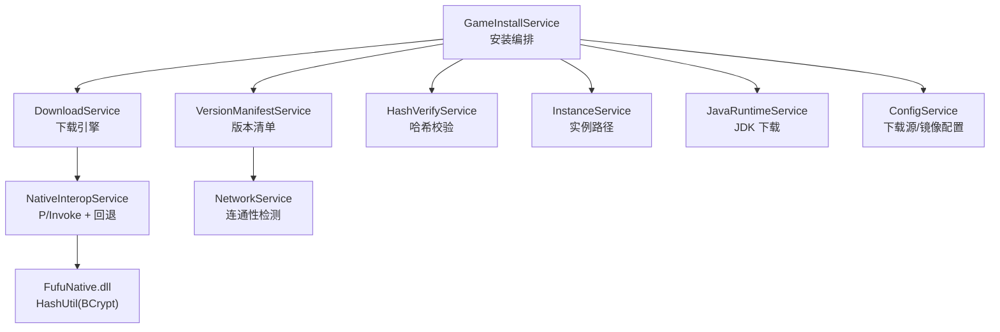
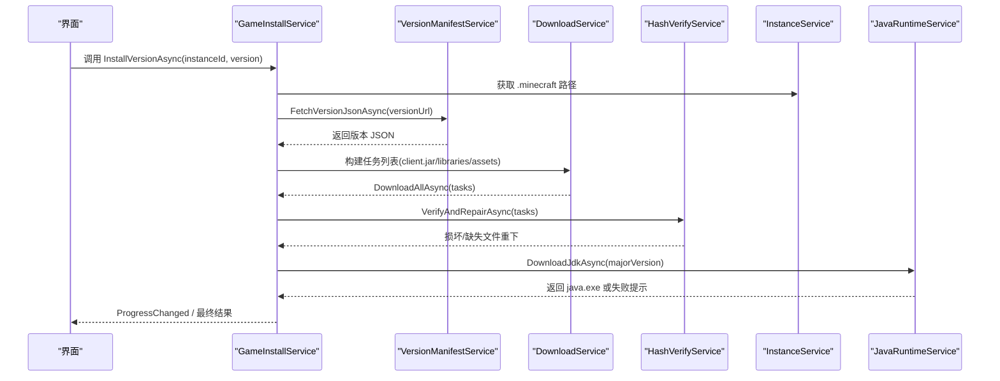
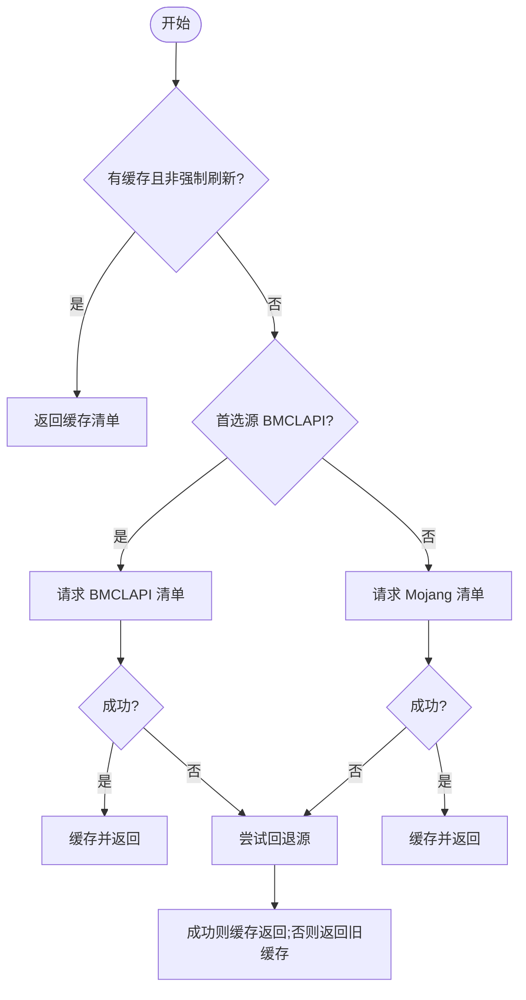
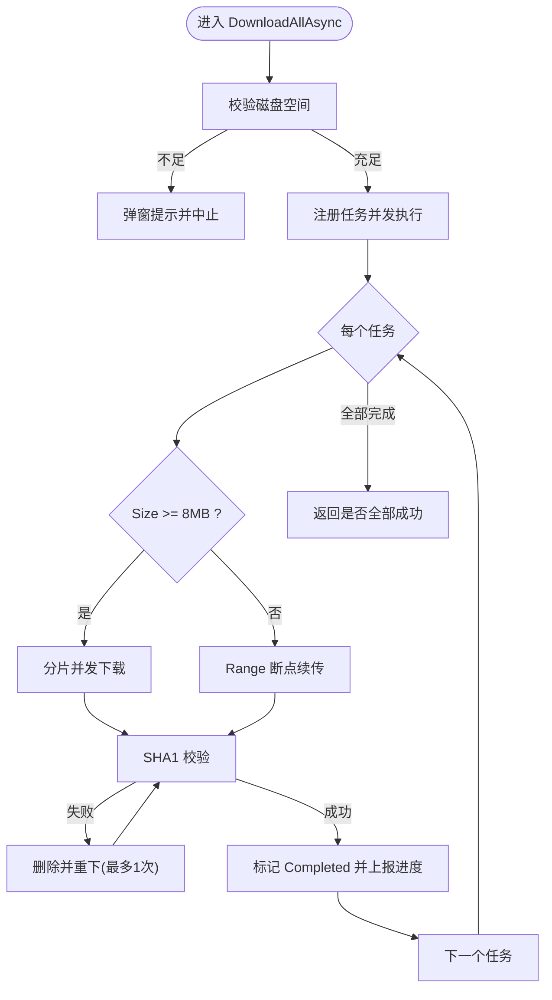
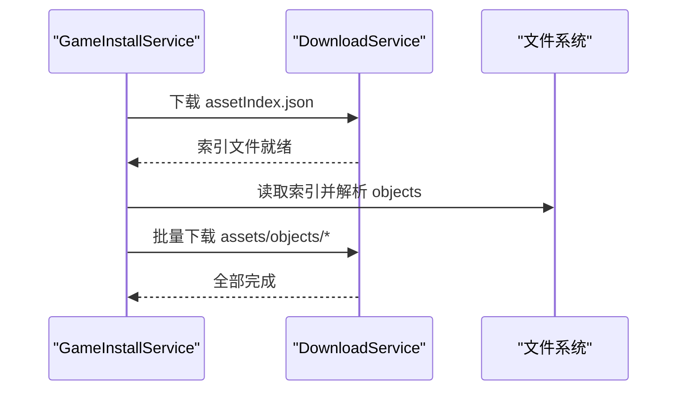
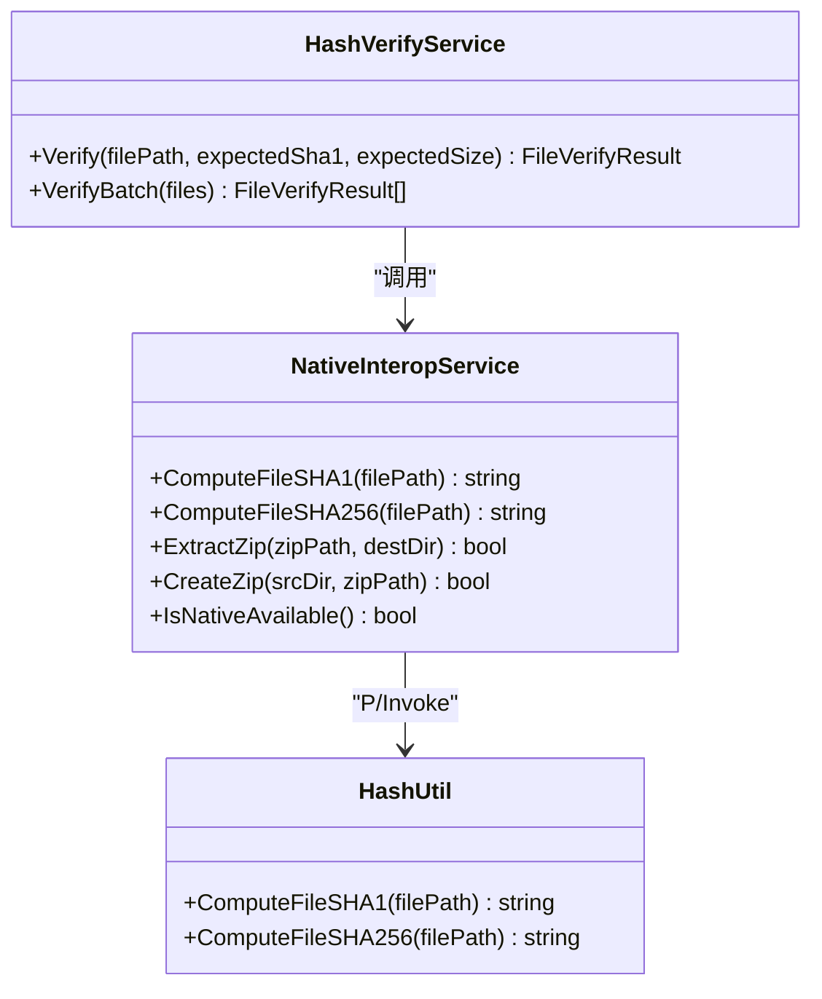
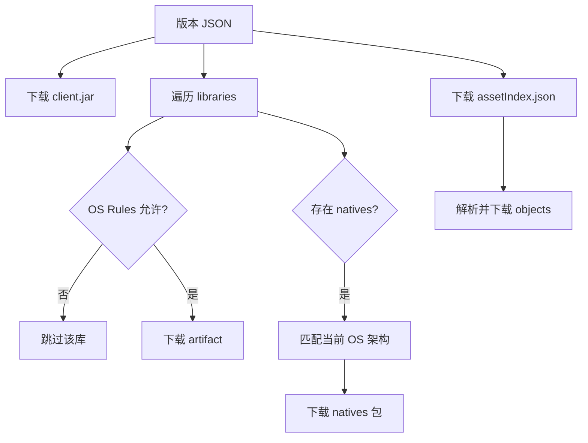
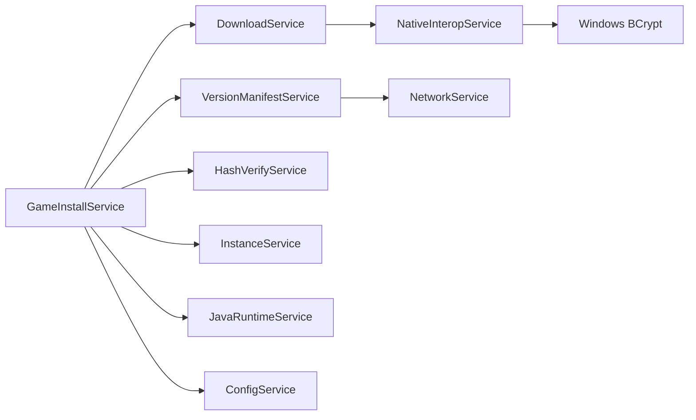

# 游戏安装

<cite>
**本文引用的文件**   
- [GameInstallService.cs](file://src/FufuLauncher/Services/GameInstallService.cs)
- [VersionManifestService.cs](file://src/FufuLauncher/Services/VersionManifestService.cs)
- [DownloadService.cs](file://src/FufuLauncher/Services/DownloadService.cs)
- [HashVerifyService.cs](file://src/FufuLauncher/Services/HashVerifyService.cs)
- [NativeInteropService.cs](file://src/FufuLauncher/Services/NativeInteropService.cs)
- [InstanceService.cs](file://src/FufuLauncher/Services/InstanceService.cs)
- [JavaRuntimeService.cs](file://src/FufuLauncher/Services/JavaRuntimeService.cs)
- [ConfigService.cs](file://src/FufuLauncher/Services/ConfigService.cs)
- [NetworkService.cs](file://src/FufuLauncher/Services/NetworkService.cs)
- [HashUtil.cpp](file://native/FufuNative/HashUtil.cpp)
- [HashUtil.h](file://native/FufuNative/HashUtil.h)
- [README.md](file://README.md)
</cite>

## 目录
1. [简介](#简介)
2. [项目结构](#项目结构)
3. [核心组件](#核心组件)
4. [架构总览](#架构总览)
5. [详细组件分析](#详细组件分析)
6. [依赖关系分析](#依赖关系分析)
7. [性能考量](#性能考量)
8. [故障排除指南](#故障排除指南)
9. [结论](#结论)
10. [附录](#附录)

## 简介
本文件为“可爱的芙芙启动器”的游戏安装服务提供系统化、可操作的技术文档。重点覆盖：
- Minecraft 版本元数据获取与下载流程（含官方与镜像源）
- JAR 文件、库文件与资源文件的下载策略
- 哈希校验与完整性检查机制
- 不同版本安装策略（官方版本与第三方版本）
- 依赖库管理与冲突处理
- 安装进度跟踪与错误处理
- 故障排除与性能优化建议

## 项目结构
安装相关能力由多个服务协作完成，核心位于 Services 目录，原生加速能力位于 native 目录。关键目录与职责如下：
- src/FufuLauncher/Services
  - GameInstallService：安装编排与流程控制
  - VersionManifestService：Mojang/BMCLAPI 版本清单拉取与缓存
  - DownloadService：多线程分片断点续传下载引擎
  - HashVerifyService：文件哈希校验与批量修复
  - NativeInteropService：C++ 原生 DLL 调用与托管回退
  - InstanceService：多实例隔离与路径管理
  - JavaRuntimeService：JDK 自动下载与安装
  - ConfigService：配置持久化（下载源、镜像等）
  - NetworkService：网络连通性检测
- native/FufuNative
  - HashUtil：基于 Windows BCrypt 的高性能 SHA1/SHA256 计算

**图表来源** 
- [GameInstallService.cs:1-120](file://src/FufuLauncher/Services/GameInstallService.cs#L1-L120)
- [VersionManifestService.cs:172-292](file://src/FufuLauncher/Services/VersionManifestService.cs#L172-L292)
- [DownloadService.cs:56-114](file://src/FufuLauncher/Services/DownloadService.cs#L56-L114)
- [HashVerifyService.cs:24-70](file://src/FufuLauncher/Services/HashVerifyService.cs#L24-L70)
- [NativeInteropService.cs:20-119](file://src/FufuLauncher/Services/NativeInteropService.cs#L20-L119)
- [InstanceService.cs:51-130](file://src/FufuLauncher/Services/InstanceService.cs#L51-L130)
- [JavaRuntimeService.cs:50-114](file://src/FufuLauncher/Services/JavaRuntimeService.cs#L50-L114)
- [ConfigService.cs:81-148](file://src/FufuLauncher/Services/ConfigService.cs#L81-L148)
- [NetworkService.cs:18-95](file://src/FufuLauncher/Services/NetworkService.cs#L18-L95)
- [HashUtil.cpp:34-114](file://native/FufuNative/HashUtil.cpp#L34-L114)

**章节来源**
- [README.md:1-87](file://README.md#L1-L87)

## 核心组件
- 安装编排：GameInstallService 负责解析版本 JSON、构建下载任务、执行下载、校验修复、自动下载 JDK 并报告进度。
- 版本清单：VersionManifestService 支持 Mojang 与 BMCLAPI 双源拉取、缓存、URL 重写与搜索过滤。
- 下载引擎：DownloadService 提供分片并发、断点续传、失败重试、全局/单文件进度、SHA1 校验与源降级。
- 哈希校验：HashVerifyService 通过 NativeInteropService 调用 C++ 实现或 .NET 回退进行 SHA1/SHA256 校验。
- 实例管理：InstanceService 维护多实例隔离的 .minecraft 目录结构与元信息。
- Java 运行时：JavaRuntimeService 支持 Adoptium 与华为云镜像，自动下载解压 JDK 并定位 java.exe。
- 配置与网络：ConfigService 管理下载源与镜像；NetworkService 检测双源连通性与延迟。

**章节来源**
- [GameInstallService.cs:50-120](file://src/FufuLauncher/Services/GameInstallService.cs#L50-L120)
- [VersionManifestService.cs:172-292](file://src/FufuLauncher/Services/VersionManifestService.cs#L172-L292)
- [DownloadService.cs:56-114](file://src/FufuLauncher/Services/DownloadService.cs#L56-L114)
- [HashVerifyService.cs:24-70](file://src/FufuLauncher/Services/HashVerifyService.cs#L24-L70)
- [InstanceService.cs:51-130](file://src/FufuLauncher/Services/InstanceService.cs#L51-L130)
- [JavaRuntimeService.cs:50-114](file://src/FufuLauncher/Services/JavaRuntimeService.cs#L50-L114)
- [ConfigService.cs:81-148](file://src/FufuLauncher/Services/ConfigService.cs#L81-L148)
- [NetworkService.cs:18-95](file://src/FufuLauncher/Services/NetworkService.cs#L18-L95)

## 架构总览
安装流程从 UI 触发开始，依次经过版本清单获取、任务构建、下载与校验、JDK 自动安装，最终返回结果与进度事件。

**图表来源** 
- [GameInstallService.cs:82-286](file://src/FufuLauncher/Services/GameInstallService.cs#L82-L286)
- [VersionManifestService.cs:257-292](file://src/FufuLauncher/Services/VersionManifestService.cs#L257-L292)
- [DownloadService.cs:222-261](file://src/FufuLauncher/Services/DownloadService.cs#L222-L261)
- [HashVerifyService.cs:72-84](file://src/FufuLauncher/Services/HashVerifyService.cs#L72-L84)
- [JavaRuntimeService.cs:199-277](file://src/FufuLauncher/Services/JavaRuntimeService.cs#L199-L277)

## 详细组件分析

### 版本元数据获取与 URL 重写
- 版本清单拉取：优先按配置选择 BMCLAPI 或 Mojang，失败自动回退另一源；支持缓存避免重复请求。
- 版本 JSON 拉取：使用统一 URL 重写规则，确保切换下载源后所有子资源均走同一镜像。
- 搜索与过滤：支持按类型（正式版/快照/旧版）与关键词搜索，支持按发布时间排序。

**图表来源** 
- [VersionManifestService.cs:205-255](file://src/FufuLauncher/Services/VersionManifestService.cs#L205-L255)
- [VersionManifestService.cs:274-292](file://src/FufuLauncher/Services/VersionManifestService.cs#L274-L292)

**章节来源**
- [VersionManifestService.cs:172-292](file://src/FufuLauncher/Services/VersionManifestService.cs#L172-L292)
- [NetworkService.cs:18-95](file://src/FufuLauncher/Services/NetworkService.cs#L18-L95)

### 下载流程与分片并发
- 任务类别：Game（本体与库）、Asset（资源）、Java（运行库）、Mod（模组），各类别独立信号量互不阻塞。
- 大文件分片：>=8MB 自动分片并发下载，提升吞吐；小文件单连接 Range 断点续传。
- 断点续传：使用 .partial 临时文件记录已下载字节，中断后可继续。
- 失败重试：指数退避默认 3 次；SHA1 校验失败自动重下一次。
- 进度上报：单文件进度与全局总进度（节流 150ms），修复“进度条不动”问题。
- 磁盘空间：下载前校验剩余空间（预留 1GB 缓冲）。

**图表来源** 
- [DownloadService.cs:222-261](file://src/FufuLauncher/Services/DownloadService.cs#L222-L261)
- [DownloadService.cs:295-366](file://src/FufuLauncher/Services/DownloadService.cs#L295-L366)
- [DownloadService.cs:368-451](file://src/FufuLauncher/Services/DownloadService.cs#L368-L451)
- [DownloadService.cs:453-547](file://src/FufuLauncher/Services/DownloadService.cs#L453-L547)
- [DownloadService.cs:583-591](file://src/FufuLauncher/Services/DownloadService.cs#L583-L591)

**章节来源**
- [DownloadService.cs:56-114](file://src/FufuLauncher/Services/DownloadService.cs#L56-L114)
- [DownloadService.cs:222-261](file://src/FufuLauncher/Services/DownloadService.cs#L222-L261)
- [DownloadService.cs:295-366](file://src/FufuLauncher/Services/DownloadService.cs#L295-L366)
- [DownloadService.cs:368-451](file://src/FufuLauncher/Services/DownloadService.cs#L368-L451)
- [DownloadService.cs:453-547](file://src/FufuLauncher/Services/DownloadService.cs#L453-L547)
- [DownloadService.cs:583-591](file://src/FufuLauncher/Services/DownloadService.cs#L583-L591)

### 资源文件处理与索引解析
- 先下载资产索引（asset index），再解析对象列表，生成 assets/objects/{hash前两位}/{完整hash} 路径。
- 资源 URL 遵循标准格式，同时受 DownloadService 的源重写规则影响。
- 快速完整性检查仅验证关键文件存在性（client.jar、libraries、asset index、objects 根目录），适合 UI 即时反馈。

**图表来源** 
- [GameInstallService.cs:185-236](file://src/FufuLauncher/Services/GameInstallService.cs#L185-L236)
- [DownloadService.cs:222-261](file://src/FufuLauncher/Services/DownloadService.cs#L222-L261)

**章节来源**
- [GameInstallService.cs:185-236](file://src/FufuLauncher/Services/GameInstallService.cs#L185-L236)

### 哈希校验与完整性检查
- 下载完成后立即进行 SHA1 校验，失败自动删除并重下一次。
- 安装后执行 VerifyAndRepairAsync：对缺失/损坏文件重新下载。
- 主页快速校验：仅检查关键文件存在性，不做 SHA1，速度快。
- 底层哈希计算：优先使用 C++ 原生实现（Windows BCrypt），失败自动回退到 .NET 托管实现。

**图表来源** 
- [HashVerifyService.cs:24-84](file://src/FufuLauncher/Services/HashVerifyService.cs#L24-L84)
- [NativeInteropService.cs:20-119](file://src/FufuLauncher/Services/NativeInteropService.cs#L20-L119)
- [HashUtil.cpp:34-114](file://native/FufuNative/HashUtil.cpp#L34-L114)
- [HashUtil.h:7-23](file://native/FufuNative/HashUtil.h#L7-L23)

**章节来源**
- [GameInstallService.cs:288-323](file://src/FufuLauncher/Services/GameInstallService.cs#L288-L323)
- [GameInstallService.cs:325-424](file://src/FufuLauncher/Services/GameInstallService.cs#L325-L424)
- [DownloadService.cs:583-591](file://src/FufuLauncher/Services/DownloadService.cs#L583-L591)
- [NativeInteropService.cs:38-73](file://src/FufuLauncher/Services/NativeInteropService.cs#L38-L73)

### 不同版本安装策略（官方与第三方）
- 官方版本：遵循 Mojang 版本 JSON 规范，下载 client.jar、libraries（artifact + natives）、assets。
- 第三方版本：通过 DownloadService.GetSourceUrl 与 VersionManifestService.RewriteUrl 将 Mojang 域名替换为 BMCLAPI 镜像域名，保证国内访问稳定。
- 库过滤：根据操作系统规则（Rules）与 Natives 分类选择适用库，避免跨平台不兼容。

**图表来源** 
- [GameInstallService.cs:125-183](file://src/FufuLauncher/Services/GameInstallService.cs#L125-L183)
- [VersionManifestService.cs:274-292](file://src/FufuLauncher/Services/VersionManifestService.cs#L274-L292)

**章节来源**
- [GameInstallService.cs:125-183](file://src/FufuLauncher/Services/GameInstallService.cs#L125-L183)
- [GameInstallService.cs:426-444](file://src/FufuLauncher/Services/GameInstallService.cs#L426-L444)
- [VersionManifestService.cs:274-292](file://src/FufuLauncher/Services/VersionManifestService.cs#L274-L292)

### 依赖库管理与冲突解决
- 库选择：依据 MojangLibrary 的 Rules 与 Natives 映射，仅下载当前系统适用的库。
- 冲突规避：通过版本号与 classifier 精确匹配，避免同名不同架构冲突。
- 本地存储：libraries 统一存放于 .minecraft/libraries，按 Maven 风格路径组织。

**章节来源**
- [GameInstallService.cs:140-183](file://src/FufuLauncher/Services/GameInstallService.cs#L140-L183)
- [GameInstallService.cs:426-444](file://src/FufuLauncher/Services/GameInstallService.cs#L426-L444)

### 安装进度跟踪与错误处理
- 进度事件：ProgressChanged 包含阶段、当前/总数、当前文件名；DownloadService 提供单文件与全局总进度。
- 错误信息：LastError 保存最后一次失败的详细信息，供 UI 展示；下载失败会记录日志与重试次数。
- 自动修复：校验失败自动删除损坏文件并重下；JDK 自动下载失败不阻塞安装，提示用户手动下载。

**章节来源**
- [GameInstallService.cs:58-68](file://src/FufuLauncher/Services/GameInstallService.cs#L58-L68)
- [GameInstallService.cs:446-456](file://src/FufuLauncher/Services/GameInstallService.cs#L446-L456)
- [DownloadService.cs:84-98](file://src/FufuLauncher/Services/DownloadService.cs#L84-L98)
- [DownloadService.cs:116-132](file://src/FufuLauncher/Services/DownloadService.cs#L116-L132)
- [DownloadService.cs:140-169](file://src/FufuLauncher/Services/DownloadService.cs#L140-L169)

### Java 运行时自动安装
- 镜像源：Adoptium（官方）与华为云（国内），支持 8~24 主版本。
- 下载与解压：下载 zip 后优先使用原生解压，失败回退托管实现；解压后上提内层目录以简化路径。
- 完整性校验：通过 java -version 输出判断是否可用。

**章节来源**
- [JavaRuntimeService.cs:199-277](file://src/FufuLauncher/Services/JavaRuntimeService.cs#L199-L277)
- [JavaRuntimeService.cs:279-335](file://src/FufuLauncher/Services/JavaRuntimeService.cs#L279-L335)
- [JavaRuntimeService.cs:350-379](file://src/FufuLauncher/Services/JavaRuntimeService.cs#L350-L379)
- [JavaRuntimeService.cs:482-510](file://src/FufuLauncher/Services/JavaRuntimeService.cs#L482-L510)

## 依赖关系分析
- 模块耦合：GameInstallService 作为编排者，依赖其他服务完成具体任务；各服务职责清晰、低耦合。
- 外部依赖：HttpClient 用于网络请求；Windows BCrypt API 用于高性能哈希计算；文件系统用于持久化。
- 潜在循环依赖：未发现循环引用；服务间通过构造函数注入，便于测试与替换。

**图表来源** 
- [GameInstallService.cs:50-80](file://src/FufuLauncher/Services/GameInstallService.cs#L50-L80)
- [DownloadService.cs:56-114](file://src/FufuLauncher/Services/DownloadService.cs#L56-L114)
- [NativeInteropService.cs:20-119](file://src/FufuLauncher/Services/NativeInteropService.cs#L20-L119)
- [VersionManifestService.cs:172-189](file://src/FufuLauncher/Services/VersionManifestService.cs#L172-L189)
- [NetworkService.cs:18-33](file://src/FufuLauncher/Services/NetworkService.cs#L18-L33)
- [ConfigService.cs:81-148](file://src/FufuLauncher/Services/ConfigService.cs#L81-L148)

**章节来源**
- [GameInstallService.cs:50-80](file://src/FufuLauncher/Services/GameInstallService.cs#L50-L80)
- [DownloadService.cs:56-114](file://src/FufuLauncher/Services/DownloadService.cs#L56-L114)
- [NativeInteropService.cs:20-119](file://src/FufuLauncher/Services/NativeInteropService.cs#L20-L119)
- [VersionManifestService.cs:172-189](file://src/FufuLauncher/Services/VersionManifestService.cs#L172-L189)
- [NetworkService.cs:18-33](file://src/FufuLauncher/Services/NetworkService.cs#L18-L33)
- [ConfigService.cs:81-148](file://src/FufuLauncher/Services/ConfigService.cs#L81-L148)

## 性能考量
- 下载并发：按类别设置独立信号量（Game 8、Asset 16、Java 4、Mod 4），避免相互阻塞。
- 分片阈值：8MB 以上启用分片，提高大文件吞吐；分片数动态计算，最大 4。
- 进度节流：全局进度 150ms 节流，减少 UI 刷新开销，同时保证最终触发。
- 哈希计算：优先使用 C++ 原生实现（BCrypt），失败自动回退托管实现，兼顾性能与兼容性。
- 磁盘空间：下载前预留 1GB 缓冲，降低写入失败风险。

[本节为通用指导，无需特定文件来源]

## 故障排除指南
- 网络不可用：
  - 现象：版本清单拉取失败，LastError 显示首选/回退源均失败。
  - 处理：检查网络；在设置页切换下载源（BMCLAPI/Mojang）；使用 NetworkService 检测连通性。
- 下载失败：
  - 现象：部分任务 Failed，日志记录重试次数与错误信息。
  - 处理：检查磁盘空间；确认防火墙/代理；等待网络恢复后重试。
- 哈希校验失败：
  - 现象：SHA1 不一致，自动删除并重下一次。
  - 处理：若持续失败，检查存储介质健康；更换下载源。
- Java 自动下载失败：
  - 现象：JavaAutoDownloadHint 非空，提示前往「Java 运行库」页面手动下载。
  - 处理：切换 Java 镜像源（Official/Huaweicloud）；确认目标版本在当前镜像可用。
- 资源缺失：
  - 现象：VerifyInstanceIntegrityAsync 报告缺失文件。
  - 处理：重新执行安装流程；确保 assets/objects 目录存在。

**章节来源**
- [VersionManifestService.cs:205-255](file://src/FufuLauncher/Services/VersionManifestService.cs#L205-L255)
- [DownloadService.cs:295-366](file://src/FufuLauncher/Services/DownloadService.cs#L295-L366)
- [DownloadService.cs:583-591](file://src/FufuLauncher/Services/DownloadService.cs#L583-L591)
- [GameInstallService.cs:288-323](file://src/FufuLauncher/Services/GameInstallService.cs#L288-L323)
- [GameInstallService.cs:325-424](file://src/FufuLauncher/Services/GameInstallService.cs#L325-L424)
- [JavaRuntimeService.cs:199-277](file://src/FufuLauncher/Services/JavaRuntimeService.cs#L199-L277)

## 结论
本安装服务通过模块化设计与高性能实现，提供了稳定、可恢复、可观测的 Minecraft 版本安装体验。其核心优势包括：
- 双源支持与自动回退，保障国内网络可用性
- 分片并发与断点续传，提升下载效率与鲁棒性
- 严格的哈希校验与自动修复，确保文件完整性
- 多实例隔离与 Java 运行时自动管理，简化用户操作
- 完善的进度与错误反馈，提升用户体验

[本节为总结，无需特定文件来源]

## 附录
- 目录结构参考 README 中的架构图说明。
- 如需扩展第三方版本支持，可在 VersionManifestService 中增加 URL 重写规则，并在 GameInstallService 中适配新的字段结构。

**章节来源**
- [README.md:34-53](file://README.md#L34-L53)