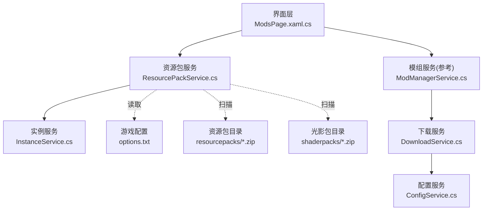
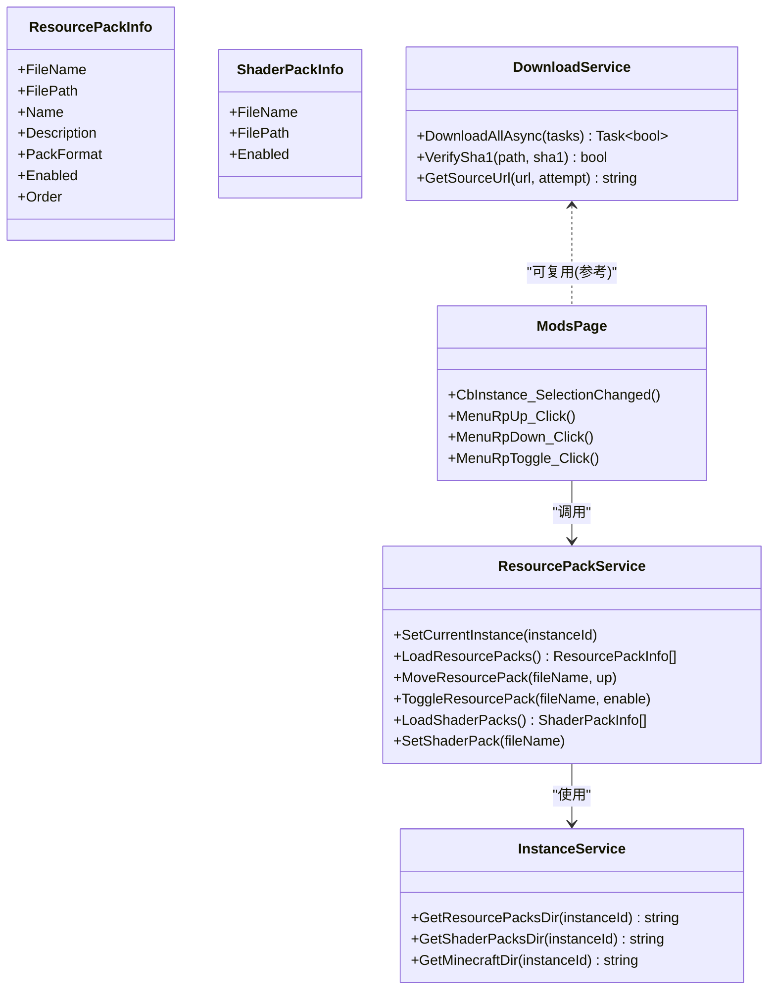
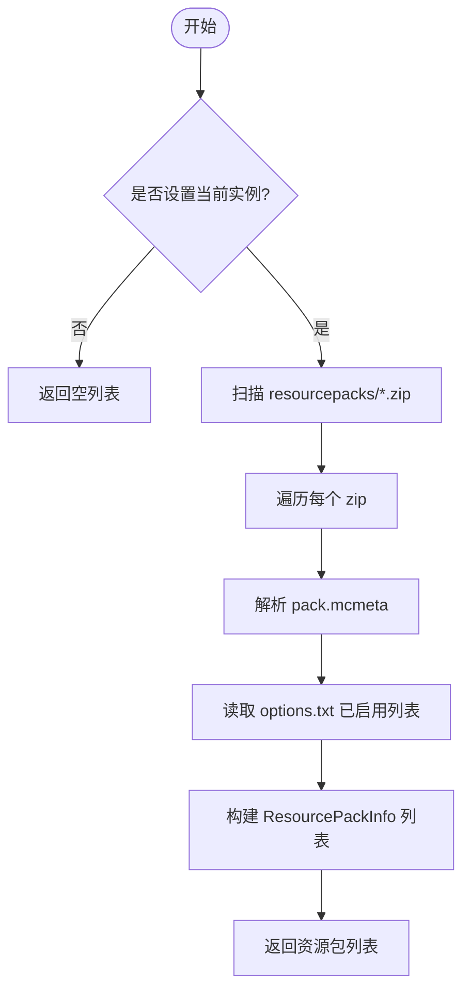
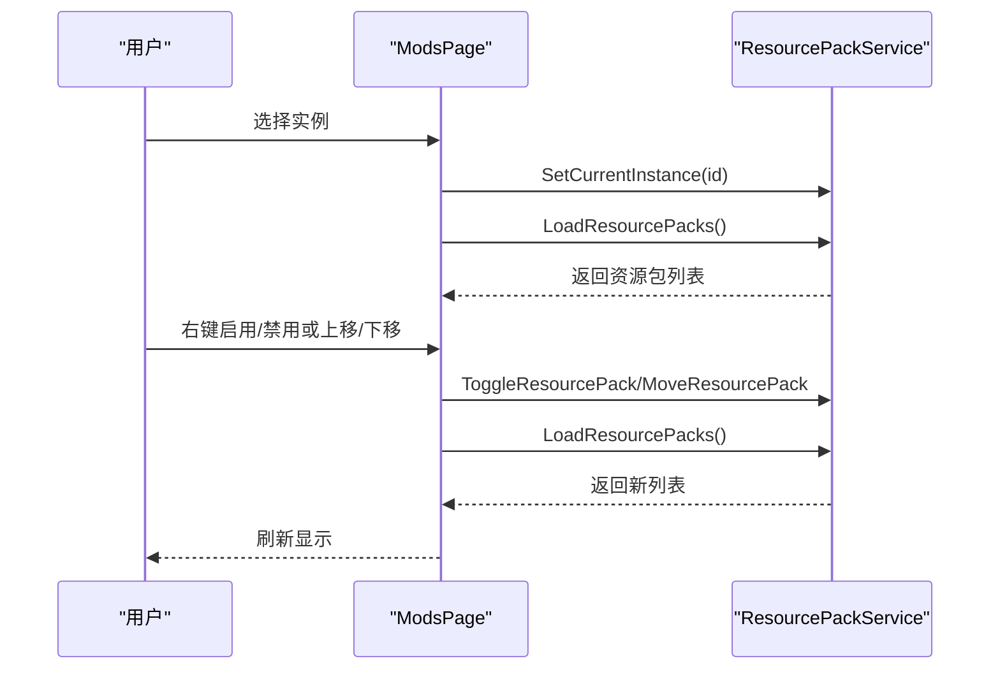
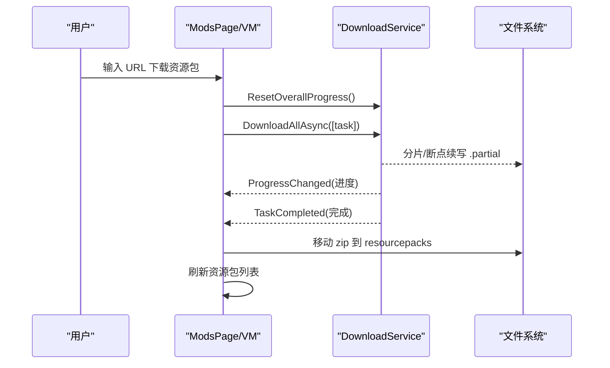
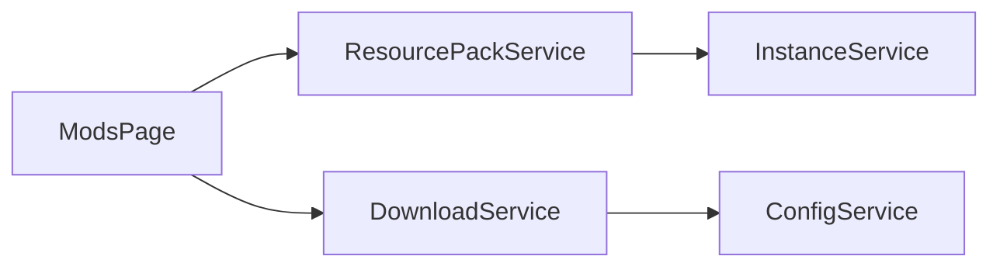

# 资源包管理

<cite>
**本文引用的文件**   
- [ResourcePackService.cs](file://src/FufuLauncher/Services/ResourcePackService.cs)
- [InstanceService.cs](file://src/FufuLauncher/Services/InstanceService.cs)
- [ModsPage.xaml.cs](file://src/FufuLauncher/Views/ModsPage.xaml.cs)
- [DownloadService.cs](file://src/FufuLauncher/Services/DownloadService.cs)
- [ModManagerService.cs](file://src/FufuLauncher/Services/ModManagerService.cs)
- [ConfigService.cs](file://src/FufuLauncher/Services/ConfigService.cs)
</cite>

## 目录
1. [简介](#简介)
2. [项目结构](#项目结构)
3. [核心组件](#核心组件)
4. [架构总览](#架构总览)
5. [详细组件分析](#详细组件分析)
6. [依赖关系分析](#依赖关系分析)
7. [性能考量](#性能考量)
8. [故障排查指南](#故障排查指南)
9. [结论](#结论)
10. [附录](#附录)

## 简介
本文件为“可爱的芙芙启动器”的资源包管理服务提供完整技术文档，覆盖 Minecraft 资源包与光影包的规范、加载机制、下载安装卸载流程、冲突检测与解决策略（优先级与兼容性）、启用/禁用与实时切换、缓存与更新检测、用户界面交互设计、性能优化建议以及常见问题诊断。

## 项目结构
资源包管理相关代码主要位于 Services 层与 Views 层：
- Services.ResourcePackService：资源包与光影包的扫描、元数据解析、启用状态读取、顺序调整与切换接口（部分实现待完善）。
- Services.InstanceService：实例隔离的目录结构定义与路径访问（resourcepacks、shaderpacks、options.txt 等）。
- Views.ModsPage：UI 页面，负责展示资源包列表、触发启用/禁用与排序操作。
- Services.DownloadService：通用多线程下载引擎（断点续传、分片、SHA1 校验、源降级），可复用至资源包下载场景。
- Services.ModManagerService：模组管理示例，体现导入/下载/校验/启停模式，可作为资源包下载的参考实现。
- Services.ConfigService：全局配置（如下载源 BMCLAPI/Mojang）影响下载行为。

图表来源
- [ModsPage.xaml.cs](file://src/FufuLauncher/Views/ModsPage.xaml.cs)
- [ResourcePackService.cs](file://src/FufuLauncher/Services/ResourcePackService.cs)
- [InstanceService.cs](file://src/FufuLauncher/Services/InstanceService.cs)
- [DownloadService.cs](file://src/FufuLauncher/Services/DownloadService.cs)
- [ConfigService.cs](file://src/FufuLauncher/Services/ConfigService.cs)

章节来源
- [ResourcePackService.cs:1-147](file://src/FufuLauncher/Services/ResourcePackService.cs#L1-L147)
- [InstanceService.cs:1-253](file://src/FufuLauncher/Services/InstanceService.cs#L1-L253)
- [ModsPage.xaml.cs:1-300](file://src/FufuLauncher/Views/ModsPage.xaml.cs#L1-L300)

## 核心组件
- ResourcePackInfo / ShaderPackInfo：资源包与光影包的数据模型，包含文件名、路径、名称、描述、PackFormat、启用状态、顺序等。
- ResourcePackService：封装资源包与光影包的发现、元数据解析、启用状态读取、顺序调整与切换接口。
- InstanceService：提供实例级目录路径（resourcepacks、shaderpacks、.minecraft/options.txt）。
- DownloadService：通用下载引擎，支持断点续传、分片并发、SHA1 校验、源自动降级（BMCLAPI/Mojang）。
- ModManagerService：模组管理的参考实现，体现导入、下载、校验、启停、打开文件夹等操作模式。

章节来源
- [ResourcePackService.cs:15-31](file://src/FufuLauncher/Services/ResourcePackService.cs#L15-L31)
- [ResourcePackService.cs:33-147](file://src/FufuLauncher/Services/ResourcePackService.cs#L33-L147)
- [InstanceService.cs:125-138](file://src/FufuLauncher/Services/InstanceService.cs#L125-L138)
- [DownloadService.cs:28-114](file://src/FufuLauncher/Services/DownloadService.cs#L28-L114)
- [ModManagerService.cs:23-72](file://src/FufuLauncher/Services/ModManagerService.cs#L23-L72)

## 架构总览
资源包管理采用“服务层 + 视图层”的分层架构：
- 视图层（ModsPage）负责用户交互与数据绑定，调用服务层方法完成操作。
- 服务层（ResourcePackService）负责资源包/光影包的扫描、元数据解析、启用状态读写（通过 options.txt）。
- 基础设施（InstanceService）提供实例隔离的路径访问；下载能力由 DownloadService 提供；配置由 ConfigService 控制。

图表来源
- [ResourcePackService.cs:15-147](file://src/FufuLauncher/Services/ResourcePackService.cs#L15-L147)
- [InstanceService.cs:125-138](file://src/FufuLauncher/Services/InstanceService.cs#L125-L138)
- [ModsPage.xaml.cs:180-213](file://src/FufuLauncher/Views/ModsPage.xaml.cs#L180-L213)
- [DownloadService.cs:222-366](file://src/FufuLauncher/Services/DownloadService.cs#L222-L366)

## 详细组件分析

### 资源包服务（ResourcePackService）
- 功能要点
  - 扫描 resourcepacks 目录下的 .zip 文件，解析 pack.mcmeta 获取 PackFormat 与 description。
  - 从 .minecraft/options.txt 中解析已启用的资源包列表（正则匹配 resourcePacks 行）。
  - 提供 MoveResourcePack（上移/下移）与 ToggleResourcePack（启用/禁用）接口（当前为占位实现，需完善写入逻辑）。
  - 扫描 shaderpacks 目录并返回光影包列表，提供 SetShaderPack 接口（占位实现）。
- 数据结构
  - ResourcePackInfo：包含 FileName、FilePath、Name、Description、PackFormat、Enabled、Order。
  - ShaderPackInfo：包含 FileName、FilePath、Enabled。
- 关键流程
  - LoadResourcePacks：枚举 zip → 解析元数据 → 读取启用状态 → 组装列表。
  - ReadEnabledResourcePacks：读取 options.txt 中的 resourcePacks 行，提取 file/包名.zip。
  - ParseResourcePackMeta：解压 zip 读取 pack.mcmeta，解析 pack 字段。

图表来源
- [ResourcePackService.cs:45-92](file://src/FufuLauncher/Services/ResourcePackService.cs#L45-L92)
- [ResourcePackService.cs:94-113](file://src/FufuLauncher/Services/ResourcePackService.cs#L94-L113)

章节来源
- [ResourcePackService.cs:45-147](file://src/FufuLauncher/Services/ResourcePackService.cs#L45-L147)

### 实例服务（InstanceService）
- 职责
  - 维护实例目录结构：instances/{InstanceId}/.{minecraft}, mods, saves, resourcepacks, shaderpacks, options.txt。
  - 提供路径访问方法：GetInstanceDir、GetMinecraftDir、GetResourcePacksDir、GetShaderPacksDir。
- 关键点
  - 创建实例时自动建立 resourcepacks 与 shaderpacks 目录。
  - 导入已有 .minecraft 时补齐标准子目录。

章节来源
- [InstanceService.cs:101-138](file://src/FufuLauncher/Services/InstanceService.cs#L101-L138)
- [InstanceService.cs:202-216](file://src/FufuLauncher/Services/InstanceService.cs#L202-L216)

### 界面交互（ModsPage.xaml.cs）
- 功能要点
  - 选择实例后刷新资源包与光影包列表。
  - 右键菜单支持资源包上移/下移、启用/禁用切换，并即时刷新列表。
- 交互流程
  - CbInstance_SelectionChanged：设置当前实例 → 刷新 VM → 加载资源包/光影包。
  - MenuRpUp/Down/Toggle：调用 ResourcePackService 对应方法 → 重新加载列表。

图表来源
- [ModsPage.xaml.cs:38-50](file://src/FufuLauncher/Views/ModsPage.xaml.cs#L38-L50)
- [ModsPage.xaml.cs:194-213](file://src/FufuLauncher/Views/ModsPage.xaml.cs#L194-L213)
- [ResourcePackService.cs:116-123](file://src/FufuLauncher/Services/ResourcePackService.cs#L116-L123)

章节来源
- [ModsPage.xaml.cs:38-50](file://src/FufuLauncher/Views/ModsPage.xaml.cs#L38-L50)
- [ModsPage.xaml.cs:194-213](file://src/FufuLauncher/Views/ModsPage.xaml.cs#L194-L213)

### 下载与安装（参考模组流程）
虽然资源包下载在现有代码中未直接实现，但可复用 DownloadService 与 ModManagerService 的模式：
- 下载流程：准备目标路径 → 构造 DownloadTaskItem（Category=Other 或新增 ResourcePack）→ 调用 DownloadAllAsync → SHA1 校验 → 移动到 resourcepacks 目录。
- 安装流程：将下载的 zip 复制到 resourcepacks 目录，随后刷新列表并可选地启用。
- 卸载流程：删除 resourcepacks 中的 zip，并从 options.txt 移除启用项。

图表来源
- [DownloadService.cs:222-366](file://src/FufuLauncher/Services/DownloadService.cs#L222-L366)
- [ModManagerService.cs:253-324](file://src/FufuLauncher/Services/ModManagerService.cs#L253-L324)

章节来源
- [DownloadService.cs:222-366](file://src/FufuLauncher/Services/DownloadService.cs#L222-L366)
- [ModManagerService.cs:253-324](file://src/FufuLauncher/Services/ModManagerService.cs#L253-L324)

### 冲突检测与解决策略
- 优先级管理
  - 资源包顺序决定覆盖优先级：列表中越靠前优先级越高（options.txt 中 resourcePacks 数组顺序）。
  - MoveResourcePack 应修改 options.txt 中 resourcePacks 数组的顺序以反映上移/下移。
- 兼容性检查
  - 读取 pack.mcmeta 的 pack_format，若与当前 Minecraft 版本不兼容，应在 UI 中标记警告或禁止启用。
  - 建议在 LoadResourcePacks 中增加 PackFormat 与目标版本映射校验。
- 冲突提示
  - 当多个资源包包含相同资源路径时，高优先级包生效；可在 UI 中列出潜在冲突（基于 pack.mcmeta 的 assets 清单，若未来扩展）。

章节来源
- [ResourcePackService.cs:75-92](file://src/FufuLauncher/Services/ResourcePackService.cs#L75-L92)
- [ResourcePackService.cs:94-113](file://src/FufuLauncher/Services/ResourcePackService.cs#L94-L113)

### 启用/禁用与实时切换
- 启用/禁用
  - ToggleResourcePack 需要更新 options.txt 中的 resourcePacks 数组（添加/移除 file/包名.zip）。
  - 切换后应立即刷新 UI 列表以反映 Enabled 状态。
- 实时切换
  - 由于 Minecraft 启动时读取 options.txt，切换需在下次启动前生效；可在 UI 中提示“重启游戏后生效”。

章节来源
- [ResourcePackService.cs:123](file://src/FufuLauncher/Services/ResourcePackService.cs#L123)
- [ModsPage.xaml.cs:206-213](file://src/FufuLauncher/Views/ModsPage.xaml.cs#L206-L213)

### 缓存系统与更新检测
- 现状
  - 资源包扫描直接从磁盘读取，无额外缓存层。
  - 下载过程使用 .partial 临时文件与 SHA1 校验，具备断点续传与完整性保障。
- 建议
  - 引入轻量缓存：对 pack.mcmeta 解析结果进行内存缓存（按 FilePath 键），减少重复解压开销。
  - 更新检测：对比本地 zip 的哈希与远程包元数据的哈希，差异则提示更新。

章节来源
- [DownloadService.cs:369-451](file://src/FufuLauncher/Services/DownloadService.cs#L369-L451)
- [DownloadService.cs:584-590](file://src/FufuLauncher/Services/DownloadService.cs#L584-L590)

### 用户界面设计与交互流程
- 资源包列表展示：显示名称、描述、PackFormat、启用状态、顺序。
- 操作入口：右键菜单提供上移/下移、启用/禁用；工具栏提供导入/下载。
- 反馈机制：操作后即时刷新列表；下载过程中显示进度与速度。

章节来源
- [ModsPage.xaml.cs:38-50](file://src/FufuLauncher/Views/ModsPage.xaml.cs#L38-L50)
- [ModsPage.xaml.cs:194-213](file://src/FufuLauncher/Views/ModsPage.xaml.cs#L194-L213)

### 性能影响与优化建议
- 扫描性能
  - 大量 zip 文件时，解析 pack.mcmeta 可能成为瓶颈；建议异步扫描与增量更新。
- 下载性能
  - 大文件分片并发（>=8MB）显著提升吞吐；小文件单连接避免过多连接开销。
- I/O 优化
  - 使用缓冲流与异步 I/O；避免频繁文件重命名与复制。
- UI 响应
  - 长耗时操作（下载、解析）应在后台线程执行，并通过事件回调更新 UI。

章节来源
- [DownloadService.cs:454-547](file://src/FufuLauncher/Services/DownloadService.cs#L454-L547)
- [DownloadService.cs:369-451](file://src/FufuLauncher/Services/DownloadService.cs#L369-L451)

## 依赖关系分析
- ResourcePackService 依赖 InstanceService 获取目录路径。
- ModsPage 依赖 ResourcePackService 进行资源包操作。
- DownloadService 依赖 ConfigService 获取下载源配置。
- ModManagerService 作为参考，展示下载/校验/启停模式。

图表来源
- [ModsPage.xaml.cs:18-26](file://src/FufuLauncher/Views/ModsPage.xaml.cs#L18-L26)
- [ResourcePackService.cs:33-41](file://src/FufuLauncher/Services/ResourcePackService.cs#L33-L41)
- [DownloadService.cs:99-114](file://src/FufuLauncher/Services/DownloadService.cs#L99-L114)

章节来源
- [ModsPage.xaml.cs:18-26](file://src/FufuLauncher/Views/ModsPage.xaml.cs#L18-L26)
- [ResourcePackService.cs:33-41](file://src/FufuLauncher/Services/ResourcePackService.cs#L33-L41)
- [DownloadService.cs:99-114](file://src/FufuLauncher/Services/DownloadService.cs#L99-L114)

## 性能考量
- 扫描与解析：对 pack.mcmeta 的解析应避免阻塞 UI；可考虑缓存与懒加载。
- 下载并发：根据网络与磁盘状况调整分片数与并发度。
- 内存占用：大文件分片下载时使用流式处理，避免一次性加载到内存。
- 日志与监控：记录下载失败与重试次数，便于问题定位。

[本节为通用指导，无需特定文件引用]

## 故障排查指南
- 资源包未显示
  - 检查 resourcepacks 目录是否存在 .zip 文件。
  - 确认 pack.mcmeta 格式正确且包含 pack 字段。
- 启用无效
  - 检查 options.txt 中 resourcePacks 行是否正确更新。
  - 确保文件名与 options.txt 中一致（含 file/ 前缀）。
- 下载失败
  - 查看 DownloadService 的失败日志与重试次数。
  - 检查网络与下载源配置（BMCLAPI/Mojang）。
- 校验失败
  - 确认 SHA1 值正确；必要时删除 .partial 与目标文件后重试。

章节来源
- [DownloadService.cs:305-366](file://src/FufuLauncher/Services/DownloadService.cs#L305-L366)
- [ResourcePackService.cs:75-92](file://src/FufuLauncher/Services/ResourcePackService.cs#L75-L92)
- [ResourcePackService.cs:94-113](file://src/FufuLauncher/Services/ResourcePackService.cs#L94-L113)

## 结论
资源包管理服务已具备基础能力：扫描、元数据解析、启用状态读取与 UI 交互。下一步重点在于完善 options.txt 写入逻辑（启用/禁用与顺序调整）、实现资源包下载与安装流程、增强冲突检测与兼容性校验，并引入缓存与更新检测以提升用户体验与性能。

[本节为总结性内容，无需特定文件引用]

## 附录
- Minecraft 资源包规范要点
  - pack.mcmeta 必须包含 pack 对象，至少包含 pack_format 与 description。
  - 资源包目录结构遵循 Minecraft 官方规范（assets、texts、sounds 等）。
- 光影包规范
  - shaderpacks 目录下的 .zip 文件即为光影包，启用方式由游戏内部处理。

[本节为概念性说明，无需特定文件引用]