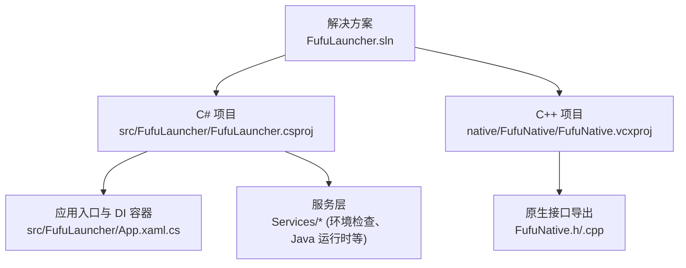
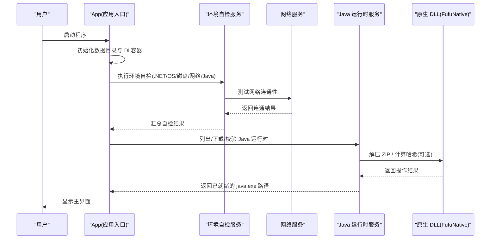
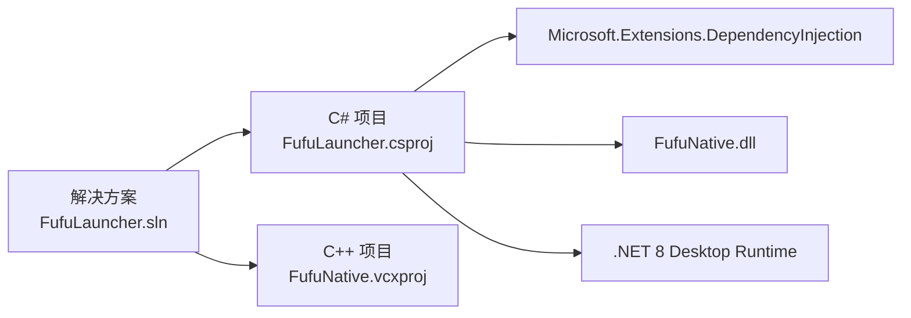

# 开发环境搭建

<cite>
**本文引用的文件**   
- [README.md](file://README.md)
- [FufuLauncher.sln](file://FufuLauncher.sln)
- [FufuLauncher.csproj](file://src/FufuLauncher/FufuLauncher.csproj)
- [FufuNative.vcxproj](file://native/FufuNative/FufuNative.vcxproj)
- [bootstrap.csproj](file://bootstrap/bootstrap.csproj)
- [proc.csproj](file://tools/proc/proc.csproj)
- [App.xaml.cs](file://src/FufuLauncher/App.xaml.cs)
- [EnvironmentCheckService.cs](file://src/FufuLauncher/Services/EnvironmentCheckService.cs)
- [JavaRuntimeService.cs](file://src/FufuLauncher/Services/JavaRuntimeService.cs)
- [config.json](file://Start/appmcGAME/config.json)
</cite>

## 目录
1. [简介](#简介)
2. [项目结构](#项目结构)
3. [核心组件](#核心组件)
4. [架构总览](#架构总览)
5. [详细组件分析](#详细组件分析)
6. [依赖关系分析](#依赖关系分析)
7. [性能注意事项](#性能注意事项)
8. [故障排查指南](#故障排查指南)
9. [结论](#结论)
10. [附录](#附录)

## 简介
本文件为“可爱的芙芙”启动器的开发环境搭建指南，面向首次在本仓库进行开发的工程师。内容覆盖：
- Visual Studio 2022 安装与必要工作负载选择（.NET 桌面开发、C++ 桌面开发）
- .NET 8 SDK 安装要求与版本兼容性
- C++ 开发环境配置（MSBuild 工具集 v143、Windows SDK 10.0）
- 项目依赖恢复与管理（NuGet、解决方案构建流程）
- 环境变量与路径设置说明
- 常见环境问题排查与解决方案
- 推荐开发工具与插件建议

## 项目结构
该解决方案包含两个主要工程：
- C# WPF 主程序（.NET 8, WinExe）
- C++ 原生 DLL（哈希计算、ZIP 解压等高性能能力）

图表来源
- [FufuLauncher.sln:1-51](file://FufuLauncher.sln#L1-L51)
- [FufuLauncher.csproj:1-49](file://src/FufuLauncher/FufuLauncher.csproj#L1-L49)
- [FufuNative.vcxproj:1-160](file://native/FufuNative/FufuNative.vcxproj#L1-L160)
- [App.xaml.cs:1-246](file://src/FufuLauncher/App.xaml.cs#L1-L246)

章节来源
- [README.md:11-53](file://README.md#L11-L53)
- [FufuLauncher.sln:1-51](file://FufuLauncher.sln#L1-L51)

## 核心组件
- 解决方案与目标平台
  - 解决方案定义了两个项目：C# WPF 与 C++ 原生 DLL，支持 Debug/Release 与 x86/x64 平台组合
  - C# 项目目标框架 net8.0-windows，输出类型为 WinExe，启用 WPF
- C++ 原生库
  - 使用 MSBuild 与 v143 工具集，Windows SDK 10.0，语言标准 C++20
  - 提供哈希与 ZIP 解压接口供 C# 通过 P/Invoke 调用
- 应用启动与依赖注入
  - App.xaml.cs 中初始化数据目录、DI 容器、全局异常捕获、日志缓冲写入
- 运行期自检与环境检测
  - EnvironmentCheckService 负责 .NET 运行时、系统架构、磁盘空间、网络连通、Java 扫描等
- Java 运行时管理
  - JavaRuntimeService 支持从官方源或国内镜像下载并安装完整 JDK，自动解压与校验

章节来源
- [FufuLauncher.csproj:1-49](file://src/FufuLauncher/FufuLauncher.csproj#L1-L49)
- [FufuNative.vcxproj:1-160](file://native/FufuNative/FufuNative.vcxproj#L1-L160)
- [App.xaml.cs:1-246](file://src/FufuLauncher/App.xaml.cs#L1-L246)
- [EnvironmentCheckService.cs:1-215](file://src/FufuLauncher/Services/EnvironmentCheckService.cs#L1-L215)
- [JavaRuntimeService.cs:1-527](file://src/FufuLauncher/Services/JavaRuntimeService.cs#L1-L527)

## 架构总览
下图展示了启动器在运行时的关键交互：应用入口初始化、环境自检、Java 运行时管理与原生库调用。

图表来源
- [App.xaml.cs:1-246](file://src/FufuLauncher/App.xaml.cs#L1-L246)
- [EnvironmentCheckService.cs:1-215](file://src/FufuLauncher/Services/EnvironmentCheckService.cs#L1-L215)
- [JavaRuntimeService.cs:1-527](file://src/FufuLauncher/Services/JavaRuntimeService.cs#L1-L527)
- [FufuNative.h:1-53](file://native/FufuNative/FufuNative.h#L1-L53)

## 详细组件分析

### Visual Studio 2022 安装与工作负载
- 必须安装的工作负载
  - .NET 桌面开发：包含 .NET 8 SDK、WPF 工具链
  - 使用 C++ 的桌面开发：包含 v143 生成工具、Windows 10 SDK
- 最低版本要求
  - VS2022 版本需满足解决方案最低要求（见解决方案文件中的最小版本）
- 构建配置
  - 推荐使用 Release | x64 进行发布构建

章节来源
- [README.md:11-32](file://README.md#L11-L32)
- [FufuLauncher.sln:1-51](file://FufuLauncher.sln#L1-L51)

### .NET 8 SDK 安装与兼容性
- 目标框架
  - C# 项目使用 net8.0-windows，需要 .NET 8 SDK 与 Desktop Runtime
- 运行时要求
  - 目标机器需安装 .NET 8 Desktop Runtime (x64)，否则启动时会提示安装
- 兼容性
  - 项目启用 Nullable 与 ImplicitUsings，建议使用最新稳定版 SDK

章节来源
- [FufuLauncher.csproj:1-49](file://src/FufuLauncher/FufuLauncher.csproj#L1-L49)
- [README.md:77-82](file://README.md#L77-L82)

### C++ 开发环境与 MSBuild 工具
- 工具集与 SDK
  - PlatformToolset: v143
  - WindowsTargetPlatformVersion: 10.0
- 语言标准
  - C++20
- 输出类型
  - DynamicLibrary（DLL），用于被 C# 通过 P/Invoke 调用

章节来源
- [FufuNative.vcxproj:1-160](file://native/FufuNative/FufuNative.vcxproj#L1-L160)

### 项目依赖恢复与 NuGet 包管理
- 依赖项
  - C# 项目引用 Microsoft.Extensions.DependencyInjection 8.0.1
- 恢复方式
  - 在 VS 中打开解决方案后，可通过“还原 NuGet 包”或自动恢复机制获取依赖
- 构建产物
  - C# 输出 exe；C++ 输出 dll，并按平台与配置复制到输出目录

章节来源
- [FufuLauncher.csproj:1-49](file://src/FufuLauncher/FufuLauncher.csproj#L1-L49)
- [FufuLauncher.sln:1-51](file://FufuLauncher.sln#L1-L51)

### 环境变量与路径设置
- 数据目录
  - GameDataDir：{exe 目录}\appmcGAME（存放实例、runtimes、账号、存档、版本、模组、库、资源、缓存）
  - ConfigDir：{exe 目录}\appmcGAME\Start\AppData\Roaming\FufuLauncher（存放 config.json、日志、缓存）
- 配置文件
  - config.json 位于 ConfigDir，包含主题、下载源、Java 路径、内存参数、认证模式、Java 下载镜像等
- 日志
  - app.log 位于 ConfigDir，由后台定时器批量写入

章节来源
- [App.xaml.cs:1-246](file://src/FufuLauncher/App.xaml.cs#L1-L246)
- [config.json:1-36](file://Start/appmcGAME/config.json#L1-L36)

### 启动器引导与辅助工具
- bootstrap 与 proc 工具
  - 均为 .NET 8 控制台应用，用于一次性引导与进程相关功能
  - 不打包到发布产物中

章节来源
- [bootstrap.csproj:1-18](file://bootstrap/bootstrap.csproj#L1-L18)
- [proc.csproj:1-16](file://tools/proc/proc.csproj#L1-L16)

## 依赖关系分析
- 解决方案级依赖
  - C# 项目依赖 C++ 原生 DLL（按平台与配置复制）
  - 所有服务通过 DI 容器注册与解析
- 运行时依赖
  - .NET 8 Desktop Runtime (x64)
  - 可选：本机已安装的 Java 8/17/21 等，或由启动器下载完整 JDK

图表来源
- [FufuLauncher.sln:1-51](file://FufuLauncher.sln#L1-L51)
- [FufuLauncher.csproj:1-49](file://src/FufuLauncher/FufuLauncher.csproj#L1-L49)
- [FufuNative.vcxproj:1-160](file://native/FufuNative/FufuNative.vcxproj#L1-L160)

章节来源
- [FufuLauncher.sln:1-51](file://FufuLauncher.sln#L1-L51)
- [FufuLauncher.csproj:1-49](file://src/FufuLauncher/FufuLauncher.csproj#L1-L49)

## 性能注意事项
- 日志写入采用队列与定时器批量落盘，避免高频 IO 阻塞 UI 线程
- Java 解压优先使用原生实现（更快），失败时回退到托管实现
- 网络请求设置合理超时，避免长时间无反馈

章节来源
- [App.xaml.cs:1-246](file://src/FufuLauncher/App.xaml.cs#L1-L246)
- [JavaRuntimeService.cs:1-527](file://src/FufuLauncher/Services/JavaRuntimeService.cs#L1-L527)

## 故障排查指南
- 智能应用控制拦截
  - 未签名的 exe 可能被 SmartScreen 拦截，需在属性中“解除锁定”或使用 PowerShell 命令解锁
- 缺少 .NET 8 Desktop Runtime
  - 启动器会提示安装，请根据提示下载并安装 x64 版本
- 32 位系统不支持
  - 检测到 32 位系统会弹窗提示升级至 64 位 Windows
- 磁盘空间不足
  - 环境自检会检查可用空间，建议至少 5GB
- 网络不通
  - 无法访问 Mojang 官方源与 BMCLAPI 镜像源时需检查网络
- 未发现 Java
  - 可在“Java 运行时”页面下载或手动安装 Java 8/17/21

章节来源
- [README.md:55-82](file://README.md#L55-L82)
- [EnvironmentCheckService.cs:1-215](file://src/FufuLauncher/Services/EnvironmentCheckService.cs#L1-L215)

## 结论
按照本指南完成 VS2022 工作负载安装、.NET 8 SDK 与 C++ 工具链配置后，即可顺利构建与调试“可爱的芙芙”启动器。建议在开发过程中关注环境自检与 Java 运行时管理模块，确保本地开发与发布环境一致。

## 附录
- 构建步骤（参考 README）
  - 打开解决方案，选择 Release|x64，重新生成解决方案
  - 输出 exe 路径：src\FufuLauncher\bin\Release\net8.0-windows\FufuLauncher.exe
- 推荐插件与工具
  - Visual Studio 内置的 C# 与 C++ 开发工具已足够
  - 可启用代码分析与格式化规则以提升一致性
  - 对于 Git 协作，建议使用 VS 内置的 Git 集成或 GitHub Desktop