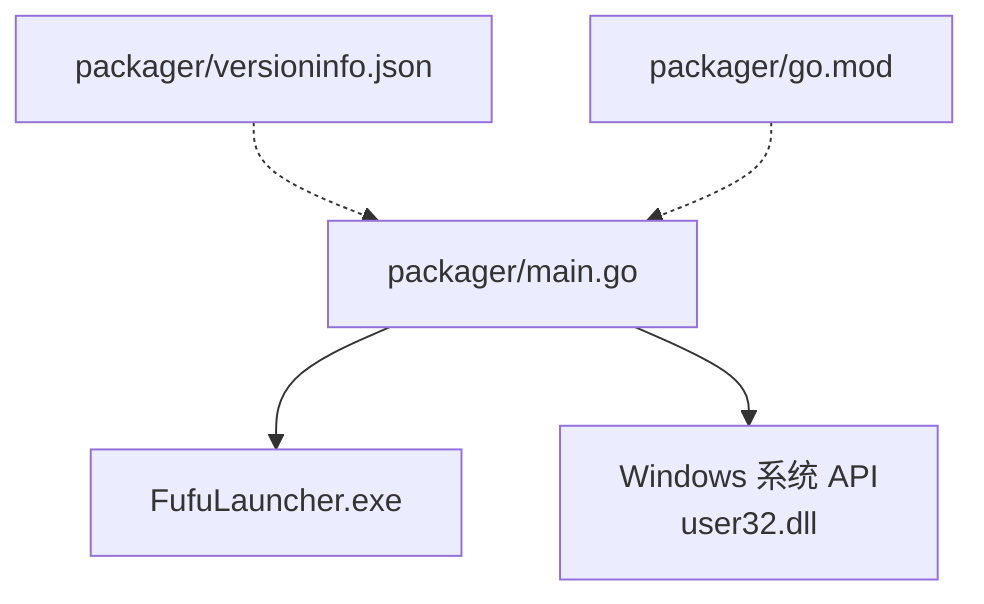
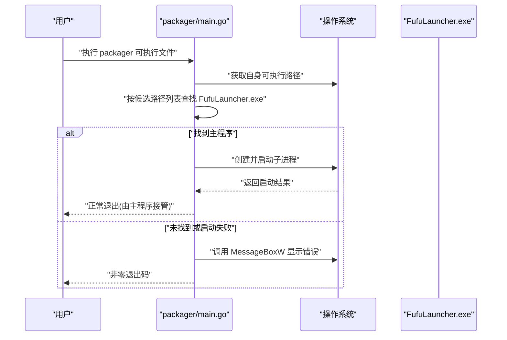
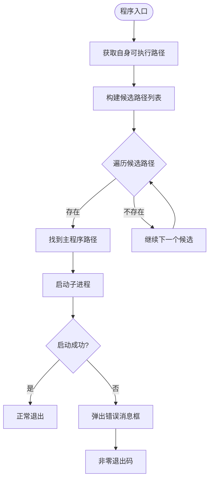
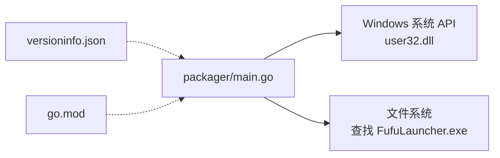

# 打包工具

<cite>
**本文引用的文件**   
- [packager/main.go](file://packager/main.go)
- [packager/versioninfo.json](file://packager/versioninfo.json)
- [packager/go.mod](file://packager/go.mod)
- [src/FufuLauncher/FufuLauncher.csproj](file://src/FufuLauncher/FufuLauncher.csproj)
- [src/FufuLauncher/Properties/PublishProfiles/FufuRelease.pubxml](file://src/FufuLauncher/Properties/PublishProfiles/FufuRelease.pubxml)
- [README.md](file://README.md)
</cite>

## 目录
1. [简介](#简介)
2. [项目结构](#项目结构)
3. [核心组件](#核心组件)
4. [架构总览](#架构总览)
5. [详细组件分析](#详细组件分析)
6. [依赖关系分析](#依赖关系分析)
7. [性能考虑](#性能考虑)
8. [故障排查指南](#故障排查指南)
9. [结论](#结论)
10. [附录](#附录)

## 简介
本文件为“可爱的芙芙启动器”的基于 Go 的打包工具（位于 packager 目录）提供完整、可操作的文档。内容涵盖：
- 打包工具的功能与使用方法
- 命令行参数与配置文件选项说明
- versioninfo.json 资源文件的结构与自定义方法
- 应用程序数字签名的配置与证书管理建议
- 多语言资源的打包与分发策略
- 发布流程自动化配置建议
- 打包工具的扩展与定制方法
- 常见打包问题的排查与解决方案
- 不同部署场景的打包配置示例

注意：当前仓库中的 packager 模块主要实现一个轻量级入口程序，用于定位并启动主程序 FufuLauncher.exe；versioninfo.json 定义了 Windows 版本资源元信息。关于更复杂的打包、签名、多语言资源合并等能力，可在现有基础上进行扩展。

## 项目结构
packager 目录包含三个关键文件：
- main.go：Go 入口程序，负责查找并启动主程序
- versioninfo.json：Windows 版本信息与字符串资源定义
- go.mod：Go 模块声明与版本约束

图表来源
- [packager/main.go:1-77](file://packager/main.go#L1-L77)
- [packager/versioninfo.json:1-44](file://packager/versioninfo.json#L1-L44)
- [packager/go.mod:1-4](file://packager/go.mod#L1-L4)

章节来源
- [packager/main.go:1-77](file://packager/main.go#L1-L77)
- [packager/versioninfo.json:1-44](file://packager/versioninfo.json#L1-L44)
- [packager/go.mod:1-4](file://packager/go.mod#L1-L4)

## 核心组件
- 入口程序（main.go）
  - 功能：根据预设路径规则查找 FufuLauncher.exe，若找到则通过进程方式启动；未找到或启动失败时弹出消息框提示错误信息。
  - 行为要点：
    - 搜索候选路径包括同目录、子目录以及上级目录的多个 bin 输出位置
    - 使用 Windows user32.MessageBoxW 弹窗提示
    - 退出码区分“未找到主程序”和“启动失败”两种错误
- 版本信息（versioninfo.json）
  - 功能：定义 FixedFileInfo、StringFileInfo、VarFileInfo 等字段，用于生成或描述 Windows 版本资源
  - 关键字段：版本号、公司名称、产品名、版权、原始文件名、语言标识等
- 模块定义（go.mod）
  - 功能：声明模块名与 Go 版本要求

章节来源
- [packager/main.go:1-77](file://packager/main.go#L1-L77)
- [packager/versioninfo.json:1-44](file://packager/versioninfo.json#L1-L44)
- [packager/go.mod:1-4](file://packager/go.mod#L1-L4)

## 架构总览
packager 作为最小化入口，职责单一：定位并启动主程序。其运行流程如下：

图表来源
- [packager/main.go:25-76](file://packager/main.go#L25-L76)

章节来源
- [packager/main.go:25-76](file://packager/main.go#L25-L76)

## 详细组件分析

### 入口程序（main.go）
- 设计模式与实现要点
  - 路径探测：采用候选路径数组，依次尝试绝对路径存在性判断
  - 错误处理：对“未找到主程序”和“启动失败”分别给出明确的用户提示与退出码
  - 平台交互：通过 syscall 调用 user32.dll 的 MessageBoxW 弹窗
- 复杂度与性能
  - 时间复杂度：O(n)，n 为候选路径数量（固定且较小）
  - 空间复杂度：O(1)，仅保存少量路径与状态
- 可扩展点
  - 增加更多候选路径或动态配置
  - 支持命令行参数控制目标路径、日志级别、调试开关
  - 集成签名校验、完整性检查、自动更新检测

图表来源
- [packager/main.go:25-76](file://packager/main.go#L25-L76)

章节来源
- [packager/main.go:25-76](file://packager/main.go#L25-L76)

### 版本信息（versioninfo.json）
- 结构说明
  - FixedFileInfo：文件版本、产品版本、标志位、操作系统类型、文件类型与子类
  - StringFileInfo：注释、公司名、文件描述、内部名称、版权、原始文件名、产品名称、产品版本等
  - VarFileInfo：Translation 中 LangID 与 CharsetID 指定语言与字符集
  - IconPath / ManifestPath：图标与清单路径占位（当前为空）
- 自定义方法
  - 修改版本号与产品信息以匹配发布版本
  - 设置正确的语言标识（例如 zh-CN 对应 0804）
  - 在后续扩展中，可将该 JSON 解析并注入到生成的可执行文件中

章节来源
- [packager/versioninfo.json:1-44](file://packager/versioninfo.json#L1-L44)

### 模块定义（go.mod）
- 模块名：fufu-packager
- Go 版本：1.21
- 用途：确保构建环境一致性与依赖管理

章节来源
- [packager/go.mod:1-4](file://packager/go.mod#L1-L4)

## 依赖关系分析
- 外部依赖
  - Windows 系统库：user32.dll（MessageBoxW）
  - 运行时：Go 标准库（os/exec、syscall、path/filepath 等）
- 耦合与内聚
  - 入口程序与主程序解耦，仅通过文件系统路径与进程启动建立弱耦合
  - 版本信息为静态配置，不直接参与运行时逻辑（当前）
- 潜在风险
  - 路径硬编码可能导致在不同构建/发布布局下无法定位主程序
  - 未对主程序完整性与签名进行校验

图表来源
- [packager/main.go:1-77](file://packager/main.go#L1-L77)
- [packager/versioninfo.json:1-44](file://packager/versioninfo.json#L1-L44)
- [packager/go.mod:1-4](file://packager/go.mod#L1-L4)

章节来源
- [packager/main.go:1-77](file://packager/main.go#L1-L77)

## 性能考虑
- 路径查找开销极低，适合频繁启动场景
- 避免在主程序中引入重型初始化逻辑，保持入口程序轻量化
- 如需扩展为完整打包器，建议：
  - 使用并发批量扫描目录
  - 缓存已验证的路径与资源哈希
  - 减少 I/O 次数与重复计算

## 故障排查指南
- 常见问题与解决
  - 未找到主程序
    - 现象：启动 packager 后弹出“未找到主程序”的消息框
    - 排查：确认 FufuLauncher.exe 是否存在于候选路径之一
    - 解决：将主程序放置到同一目录或上级目录的 src/FufuLauncher/bin 下
  - 启动失败
    - 现象：弹出“启动主程序失败”的消息框
    - 排查：检查目标机器是否安装 .NET 8 Desktop Runtime x64
    - 解决：安装所需运行时或调整 SelfContained 发布配置
  - SmartScreen 拦截
    - 现象：Windows 智能应用控制拦截运行
    - 原因：exe 未经数字签名
    - 解决：参考 README 中的解除锁定步骤或对 exe 进行数字签名
- 相关参考
  - 运行时依赖与解除锁定说明见 README

章节来源
- [packager/main.go:50-76](file://packager/main.go#L50-L76)
- [README.md:55-73](file://README.md#L55-L73)

## 结论
当前 packager 模块提供了一个简洁可靠的入口程序，能够自动定位并启动主程序，并在异常情况下向用户提供清晰的提示信息。配合 versioninfo.json 的版本资源定义，可为后续扩展（如资源注入、签名、多语言打包）奠定基础。建议在 CI/CD 中集成发布脚本，统一构建、打包、签名与分发流程，提升交付质量与效率。

## 附录

### 命令行参数与配置文件选项
- 当前实现未暴露命令行参数
- 可通过扩展 main.go 添加参数解析（如 --target-dir、--log-level、--debug）
- 配置文件建议：
  - 新增 config.json 存放候选路径、日志级别、调试开关等
  - 读取顺序：默认值 → 配置文件 → 命令行参数

章节来源
- [packager/main.go:1-77](file://packager/main.go#L1-L77)

### versioninfo.json 资源文件结构与自定义方法
- 字段说明
  - FixedFileInfo：文件/产品版本、标志位、操作系统类型、文件类型与子类
  - StringFileInfo：公司与产品信息、版权、原始文件名、语言等
  - VarFileInfo：语言与字符集标识
  - IconPath / ManifestPath：图标与清单路径（当前为空）
- 自定义步骤
  - 更新版本号与产品信息以匹配发布版本
  - 设置正确的语言标识（如 zh-CN）
  - 在扩展阶段解析该 JSON 并写入生成的可执行文件属性

章节来源
- [packager/versioninfo.json:1-44](file://packager/versioninfo.json#L1-L44)

### 应用程序数字签名的配置与证书管理
- 现状
  - 本项目不包含数字签名代码，运行时可能被 SmartScreen 拦截
- 建议方案
  - 使用 Windows 代码签名证书（EV 更佳）对 FufuLauncher.exe 与 packager 产物签名
  - 在 CI/CD 中使用 signtool 或第三方服务进行签名
  - 证书存储与管理建议使用受控的密钥管理服务（KMS/HSM）
- 参考
  - README 中提供了解除 SmartScreen 拦截的方法

章节来源
- [README.md:55-73](file://README.md#L55-L73)

### 多语言资源的打包与分发策略
- 现状
  - 主程序发布配置中设置了卫星资源语言（SatelliteResourceLanguages），限制输出语言目录
- 建议策略
  - 使用 .resx 或本地化资源文件，按语言组织资源
  - 发布时按需包含特定语言包，减小安装包体积
  - 运行时根据系统语言或用户选择加载对应资源
- 参考
  - 发布配置文件中的 SatelliteResourceLanguages 设置

章节来源
- [src/FufuLauncher/Properties/PublishProfiles/FufuRelease.pubxml:1-37](file://src/FufuLauncher/Properties/PublishProfiles/FufuRelease.pubxml#L1-L37)

### 发布流程的自动化配置
- 当前发布配置
  - 使用 dotnet publish 命令，指定 FufuRelease 发布配置
  - 输出单 EXE，框架依赖模式，目标平台 win-x64
- 建议自动化步骤
  - 构建：dotnet build
  - 测试：dotnet test
  - 发布：dotnet publish 指定 FufuRelease
  - 签名：signtool 对产物签名
  - 打包：压缩为安装包或 ZIP
  - 分发：上传至制品库或发布站点
- 参考
  - FufuRelease.pubxml 中的发布属性与输出目录

章节来源
- [src/FufuLauncher/Properties/PublishProfiles/FufuRelease.pubxml:1-37](file://src/FufuLauncher/Properties/PublishProfiles/FufuRelease.pubxml#L1-L37)

### 打包工具的扩展与定制方法
- 扩展方向
  - 增加命令行参数解析（flag 库）
  - 读取配置文件（JSON/YAML）
  - 集成资源打包（ZIP/TAR）、签名、校验、更新检查
  - 生成安装程序（Inno Setup/NSIS）
- 实施建议
  - 保持入口程序轻量，将复杂逻辑下沉到独立模块
  - 使用结构化日志记录关键步骤与错误
  - 提供单元测试覆盖路径查找、配置解析、错误分支

章节来源
- [packager/main.go:1-77](file://packager/main.go#L1-L77)

### 不同部署场景的打包配置示例
- 开发环境
  - 输出 Debug/Release 双配置，便于快速迭代
  - 保留更多日志与调试信息
- 生产环境
  - 使用 Release 配置，启用优化
  - 仅包含必要语言包，减小体积
  - 对产物进行签名与完整性校验
- 离线环境
  - 使用 SelfContained 发布，包含运行时
  - 预置 Java 运行时与依赖库
- 参考
  - FufuLauncher.csproj 与 FufuRelease.pubxml 中的 TargetFramework、RuntimeIdentifier、SelfContained、PublishSingleFile 等属性

章节来源
- [src/FufuLauncher/FufuLauncher.csproj:1-49](file://src/FufuLauncher/FufuLauncher.csproj#L1-L49)
- [src/FufuLauncher/Properties/PublishProfiles/FufuRelease.pubxml:1-37](file://src/FufuLauncher/Properties/PublishProfiles/FufuRelease.pubxml#L1-L37)