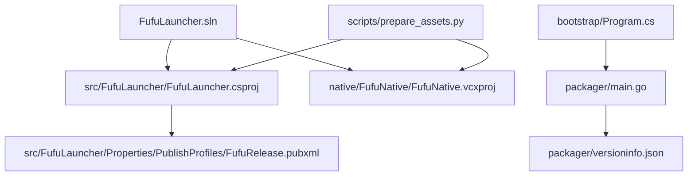
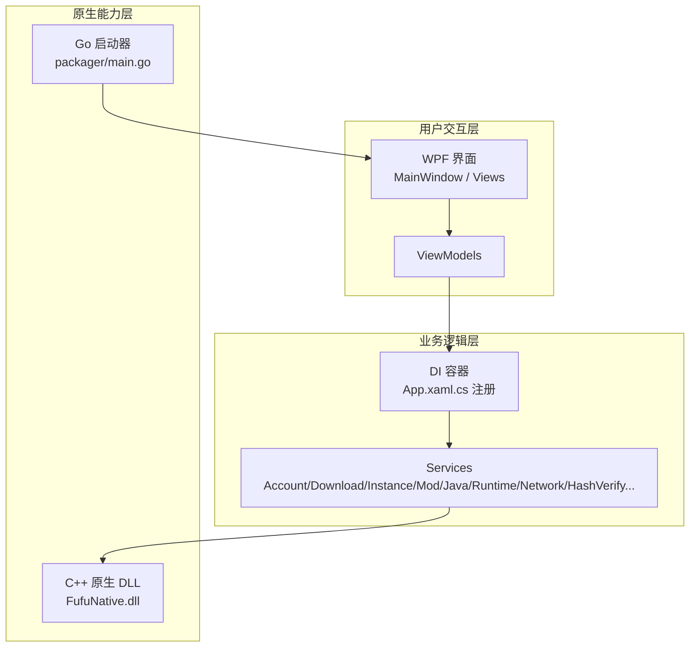
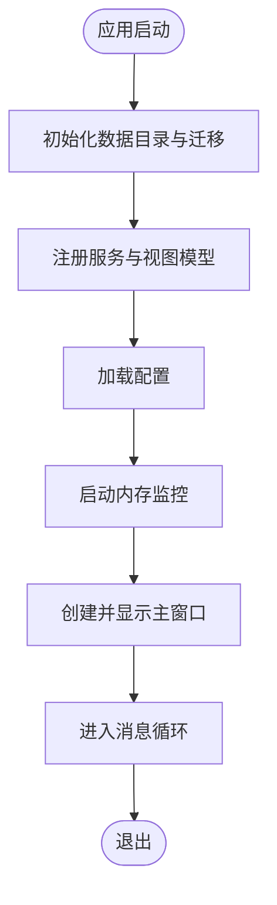
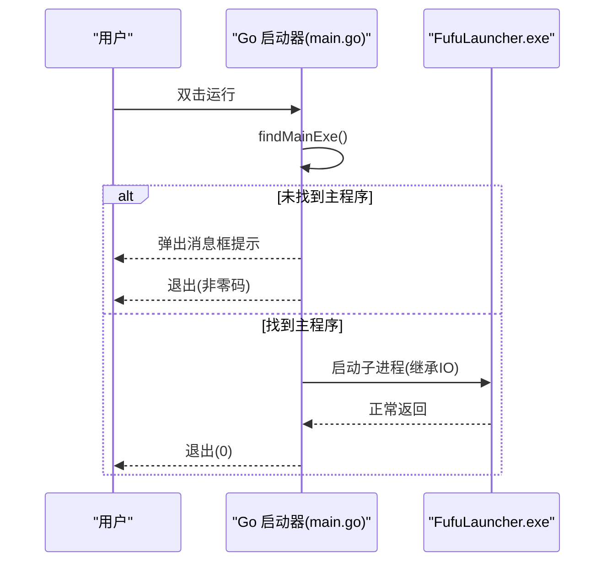
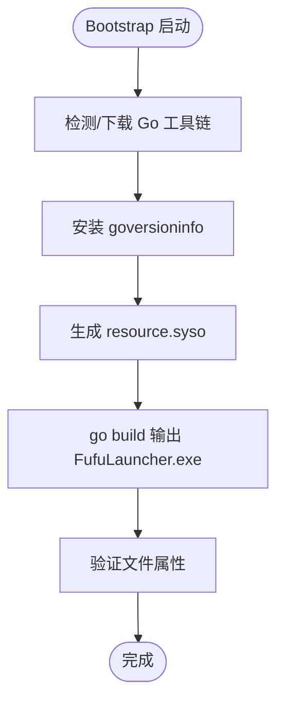
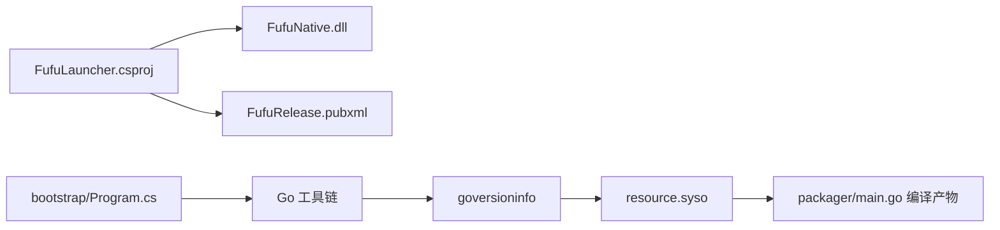

# 构建和部署

<cite>
**本文引用的文件**   
- [README.md](file://README.md)
- [FufuLauncher.sln](file://FufuLauncher.sln)
- [FufuLauncher.csproj](file://src/FufuLauncher/FufuLauncher.csproj)
- [FufuRelease.pubxml](file://src/FufuLauncher/Properties/PublishProfiles/FufuRelease.pubxml)
- [App.xaml.cs](file://src/FufuLauncher/App.xaml.cs)
- [FufuNative.vcxproj](file://native/FufuNative/FufuNative.vcxproj)
- [main.go](file://packager/main.go)
- [go.mod](file://packager/go.mod)
- [versioninfo.json](file://packager/versioninfo.json)
- [Program.cs](file://bootstrap/Program.cs)
- [prepare_assets.py](file://scripts/prepare_assets.py)
</cite>

## 目录
1. [简介](#简介)
2. [项目结构](#项目结构)
3. [核心组件](#核心组件)
4. [架构总览](#架构总览)
5. [详细组件分析](#详细组件分析)
6. [依赖关系分析](#依赖关系分析)
7. [性能与优化建议](#性能与优化建议)
8. [故障排查指南](#故障排查指南)
9. [结论](#结论)
10. [附录：发布与部署最佳实践](#附录发布与部署最佳实践)

## 简介
本文件为“可爱的芙芙”启动器的构建与部署文档，覆盖开发环境搭建、编译打包流程、Go 打包工具使用、数字签名与持续集成要点，以及不同部署场景的最佳实践。目标是帮助开发者快速完成本地构建与自动化发布，并确保产物在目标机器上稳定运行。

## 项目结构
- 解决方案与工程
  - FufuLauncher.sln：VS2022 解决方案，包含 C# WPF 主程序与 C++ 原生 DLL 两个项目。
  - src/FufuLauncher/FufuLauncher.csproj：.NET 8 WPF 应用，输出 WinExe，平台 x64，运行时标识 win-x64。
  - native/FufuNative/FufuNative.vcxproj：C++ 动态库（哈希、ZIP 解压等）。
- 发布配置
  - src/FufuLauncher/Properties/PublishProfiles/FufuRelease.pubxml：框架依赖单 EXE 发布配置，输出到 Start 目录。
- Go 打包器
  - packager/main.go：Go 启动器，查找并启动 FufuLauncher.exe。
  - packager/go.mod：Go 模块定义。
  - packager/versioninfo.json：Windows 版本资源元信息。
- Bootstrap 引导程序
  - bootstrap/Program.cs：自动安装/检测 Go 工具链、生成 resource.syso、编译 Go 启动器。
- 辅助脚本
  - scripts/prepare_assets.py：资源预处理（校验 native DLL、清理缓存、生成占位背景等）。

图表来源 
- [FufuLauncher.sln:1-51](file://FufuLauncher.sln#L1-L51)
- [FufuLauncher.csproj:1-49](file://src/FufuLauncher/FufuLauncher.csproj#L1-L49)
- [FufuNative.vcxproj:1-160](file://native/FufuNative/FufuNative.vcxproj#L1-L160)
- [FufuRelease.pubxml:1-37](file://src/FufuLauncher/Properties/PublishProfiles/FufuRelease.pubxml#L1-L37)
- [Program.cs:1-425](file://bootstrap/Program.cs#L1-L425)
- [main.go:1-77](file://packager/main.go#L1-L77)
- [versioninfo.json:1-44](file://packager/versioninfo.json#L1-L44)
- [prepare_assets.py:1-175](file://scripts/prepare_assets.py#L1-L175)

章节来源
- [README.md:11-33](file://README.md#L11-L33)
- [FufuLauncher.sln:10-43](file://FufuLauncher.sln#L10-L43)
- [FufuLauncher.csproj:1-49](file://src/FufuLauncher/FufuLauncher.csproj#L1-L49)

## 核心组件
- C# WPF 主程序
  - App.xaml.cs：应用入口，DI 容器初始化、服务注册、异常捕获、日志缓冲写入、数据目录初始化与迁移。
  - FufuLauncher.csproj：目标框架 net8.0-windows，平台 x64，RuntimeIdentifier win-x64，SelfContained false，嵌入 app.manifest，设置程序集元信息。
- C++ 原生库
  - FufuNative.vcxproj：DynamicLibrary，v143 工具集，x64/Win32 多平台，启用预编译头与 C++20。
- Go 启动器
  - main.go：按候选路径查找 FufuLauncher.exe，失败弹出消息框；成功则启动子进程并继承标准输入输出。
  - versioninfo.json：嵌入版权、公司、产品名、描述等信息。
- Bootstrap 引导程序
  - Program.cs：检测/下载便携 Go，安装 goversioninfo，生成 resource.syso，执行 go build 输出“开始\FufuLauncher.exe”，并验证文件属性。
- 资源预处理脚本
  - prepare_assets.py：校验 native DLL、清理缓存、生成默认背景占位图、校验项目结构。

章节来源
- [App.xaml.cs:1-246](file://src/FufuLauncher/App.xaml.cs#L1-L246)
- [FufuLauncher.csproj:1-49](file://src/FufuLauncher/FufuLauncher.csproj#L1-L49)
- [FufuNative.vcxproj:1-160](file://native/FufuNative/FufuNative.vcxproj#L1-L160)
- [main.go:1-77](file://packager/main.go#L1-L77)
- [versioninfo.json:1-44](file://packager/versioninfo.json#L1-L44)
- [Program.cs:1-425](file://bootstrap/Program.cs#L1-L425)
- [prepare_assets.py:1-175](file://scripts/prepare_assets.py#L1-L175)

## 架构总览
整体由三层构成：
- 用户交互层：WPF 界面与服务视图模型。
- 业务逻辑层：各类 Service（账号、下载、实例、模组、Java 运行时、网络、哈希校验等）。
- 原生能力层：C++ DLL 提供哈希与 ZIP 操作；Go 启动器作为入口包装主程序。

图表来源 
- [App.xaml.cs:138-217](file://src/FufuLauncher/App.xaml.cs#L138-L217)
- [main.go:25-76](file://packager/main.go#L25-L76)
- [FufuNative.vcxproj:1-160](file://native/FufuNative/FufuNative.vcxproj#L1-L160)

## 详细组件分析

### C# WPF 主程序（App 与项目配置）
- 应用生命周期
  - OnStartup：创建双数据目录（游戏数据与启动器配置），旧配置/日志迁移，DI 容器初始化与服务注册，加载配置，启动内存监控，显示主窗口。
  - OnExit：释放资源、停止定时器、刷新日志缓冲。
- 异常处理
  - 全局捕获 UI、域、Task 未观察异常，记录日志并弹窗提示。
- 项目配置要点
  - TargetFramework=net8.0-windows，PlatformTarget=x64，RuntimeIdentifier=win-x64，SelfContained=false。
  - 将 C++ DLL 复制到输出目录并按平台/配置动态查找。
  - 设置程序集元信息与语言中性文化 zh-CN。

图表来源 
- [App.xaml.cs:82-156](file://src/FufuLauncher/App.xaml.cs#L82-L156)
- [FufuLauncher.csproj:1-49](file://src/FufuLauncher/FufuLauncher.csproj#L1-L49)

章节来源
- [App.xaml.cs:1-246](file://src/FufuLauncher/App.xaml.cs#L1-L246)
- [FufuLauncher.csproj:1-49](file://src/FufuLauncher/FufuLauncher.csproj#L1-L49)

### C++ 原生库（FufuNative）
- 构建配置
  - DynamicLibrary，v143 工具集，支持 Debug/Release 与 Win32/x64。
  - 启用预编译头 pch.h/.cpp，C++20 标准。
- 用途
  - 提供哈希计算与 ZIP 解压等高性能原生能力，供 C# 通过 P/Invoke 调用。

章节来源
- [FufuNative.vcxproj:1-160](file://native/FufuNative/FufuNative.vcxproj#L1-L160)

### Go 启动器（packager）
- 功能
  - 按候选路径定位 FufuLauncher.exe，找不到时弹出友好提示；找到后以子进程方式启动并透传 IO。
- 版本信息
  - 通过 versioninfo.json 生成 resource.syso，嵌入 Windows 文件属性。
- 扩展机制
  - 可在 findMainExe 中增加候选路径或策略；可通过修改 messageBox 文案与错误码提升可观测性。

图表来源 
- [main.go:25-76](file://packager/main.go#L25-L76)
- [versioninfo.json:1-44](file://packager/versioninfo.json#L1-L44)

章节来源
- [main.go:1-77](file://packager/main.go#L1-L77)
- [go.mod:1-4](file://packager/go.mod#L1-L4)
- [versioninfo.json:1-44](file://packager/versioninfo.json#L1-L44)

### Bootstrap 引导程序（自动化工具链）
- 职责
  - 检测/下载便携 Go 工具链，安装 goversioninfo，生成 resource.syso，执行 go build 输出“开始\FufuLauncher.exe”，并验证文件属性。
  - 提供 --kill <exeName> 模式用于结束占用 exe 的进程。
- 关键流程
  - 解析可用 Go（优先便携 .tools\go，其次系统 PATH，最后下载国内镜像）。
  - 设置 GOPROXY、GOENV 等环境变量，确保离线/代理环境下可重复构建。
  - 下载失败时回退多个镜像源，保证鲁棒性。

图表来源 
- [Program.cs:64-186](file://bootstrap/Program.cs#L64-L186)

章节来源
- [Program.cs:1-425](file://bootstrap/Program.cs#L1-L425)

### 发布配置（FufuRelease.pubxml）
- 目标
  - 框架依赖模式下输出单 EXE，不嵌入原生库，仅保留中文卫星资源，输出到 Start 目录，保护用户数据目录。
- 关键选项
  - SelfContained=false，PublishSingleFile=true，IncludeNativeLibrariesForSelfExtract=false，EnableCompressionInSingleFile=false，SatelliteResourceLanguages=zh-CN，DeleteExistingFiles=false。
- 命令
  - dotnet publish ... /p:PublishProfile=FufuRelease

章节来源
- [FufuRelease.pubxml:1-37](file://src/FufuLauncher/Properties/PublishProfiles/FufuRelease.pubxml#L1-L37)

### 资源预处理脚本（prepare_assets.py）
- 功能
  - 校验 native DLL 是否已编译、清理缓存、生成默认背景占位图、校验项目结构完整性。
- 用法
  - check/clean/bg/all 四种模式，便于 CI 或本地快速自检。

章节来源
- [prepare_assets.py:1-175](file://scripts/prepare_assets.py#L1-L175)

## 依赖关系分析
- 解决方案级依赖
  - 解决方案包含 C# 与 C++ 两个项目，C# 项目通过 ItemGroup 引用 C++ DLL 并复制到输出目录。
- 运行时依赖
  - 目标机器需安装 .NET 8 Desktop Runtime (x64)。
- 工具链依赖
  - Go 工具链（bootstrap 自动管理）、goversioninfo（自动生成 resource.syso）。

图表来源 
- [FufuLauncher.csproj:34-42](file://src/FufuLauncher/FufuLauncher.csproj#L34-L42)
- [FufuRelease.pubxml:18-36](file://src/FufuLauncher/Properties/PublishProfiles/FufuRelease.pubxml#L18-L36)
- [Program.cs:95-147](file://bootstrap/Program.cs#L95-L147)

章节来源
- [FufuLauncher.sln:10-43](file://FufuLauncher.sln#L10-L43)
- [FufuLauncher.csproj:1-49](file://src/FufuLauncher/FufuLauncher.csproj#L1-L49)
- [Program.cs:95-147](file://bootstrap/Program.cs#L95-L147)

## 性能与优化建议
- 构建优化
  - 使用 Release|x64 配置，启用 WholeProgramOptimization（C++）与 IntrinsicFunctions。
  - 禁用单文件压缩（EnableCompressionInSingleFile=false）以减少解压开销。
  - 仅保留 zh-CN 卫星资源，减少包体与加载时间。
- 运行时优化
  - 日志批量写入（ConcurrentQueue + Timer）降低高频 IO 阻塞。
  - 内存监控定时刷新，避免 UI 卡顿。
- 网络与依赖
  - 使用 GOPROXY 与多镜像源加速 Go 工具链与模块下载。
  - 目标机仅需 .NET 8 Desktop Runtime，避免冗余依赖。

[本节为通用指导，不直接分析具体文件]

## 故障排查指南
- 智能应用控制拦截
  - 现象：exe 被 SmartScreen 拦截。
  - 处理：PowerShell 管理员执行 Unblock-File，或在文件属性中勾选“解除锁定”。
- 未找到主程序
  - 现象：Go 启动器弹出“未找到主程序 FufuLauncher.exe”。
  - 处理：确保 FufuLauncher.exe 与 Go 启动器在同一目录或上级目录的 src/FufuLauncher/bin 下。
- 进程占用导致发布失败
  - 处理：使用 bootstrap 的 --kill 模式终止占用进程后再发布。
- 网络问题
  - 现象：下载 Go 工具链失败。
  - 处理：检查代理与环境变量，或使用 bootstrap 内置的多镜像回退机制。

章节来源
- [README.md:55-73](file://README.md#L55-L73)
- [main.go:25-76](file://packager/main.go#L25-L76)
- [Program.cs:23-62](file://bootstrap/Program.cs#L23-L62)

## 结论
本项目采用 C# WPF + C++ 原生 DLL + Go 启动器的混合架构，配合 .NET 8 与 VS2022 工作负载，形成完整的开发与发布闭环。通过 FufuRelease 发布配置与 bootstrap 自动化工具，可实现跨环境的稳定构建与一键打包。遵循本文档的环境与流程说明，可有效提升构建效率与交付质量。

[本节为总结性内容，不直接分析具体文件]

## 附录：发布与部署最佳实践
- 开发环境搭建
  - 安装 Visual Studio 2022（17.8+），勾选“.NET 桌面开发”与“使用 C++ 的桌面开发”（v143 工具集、Windows 10 SDK）。
  - 安装 .NET 8 Desktop Runtime（x64）。
- 本地构建步骤
  - 打开 FufuLauncher.sln，选择 Release|x64，重新生成解决方案。
  - 输出位置：src\FufuLauncher\bin\Release\net8.0-windows\FufuLauncher.exe。
- 发布流程
  - 在项目根目录执行：dotnet publish src\FufuLauncher/FufuLauncher.csproj /p:PublishProfile=FufuRelease
  - 产物位于 Start 目录，白名单包括 FufuLauncher.exe、*.py 脚本与 appmcGAME/ 数据文件夹。
- 基于 Go 的打包器
  - 运行 bootstrap 引导程序，自动完成 Go 工具链检测/安装、goversioninfo 安装、resource.syso 生成与 go build。
  - 输出“开始\FufuLauncher.exe”，并验证文件属性。
- 数字签名与证书
  - 当前构建不包含数字签名代码；如需签名，可在 CI 阶段引入 signtool 并使用企业证书对 Go 启动器与主程序进行签名。
- 持续集成与自动化部署
  - 建议在 CI 中安装 VS2022 工作负载与 .NET 8 SDK，执行 prepare_assets.py 校验，然后 dotnet publish 与 bootstrap 构建 Go 启动器。
  - 将产物上传至制品库，并生成发布清单与校验哈希。
- 部署场景建议
  - 便携版：Start 目录内自包含脚本与数据，适合个人分发。
  - 安装器：结合第三方安装器封装 Start 目录，静默安装到用户指定路径。
  - 企业部署：通过组策略或软件分发平台推送，统一配置 DownloadSource 与 Java 运行时路径。

章节来源
- [README.md:11-33](file://README.md#L11-L33)
- [FufuRelease.pubxml:1-37](file://src/FufuLauncher/Properties/PublishProfiles/FufuRelease.pubxml#L1-L37)
- [Program.cs:95-186](file://bootstrap/Program.cs#L95-L186)
- [prepare_assets.py:143-170](file://scripts/prepare_assets.py#L143-L170)