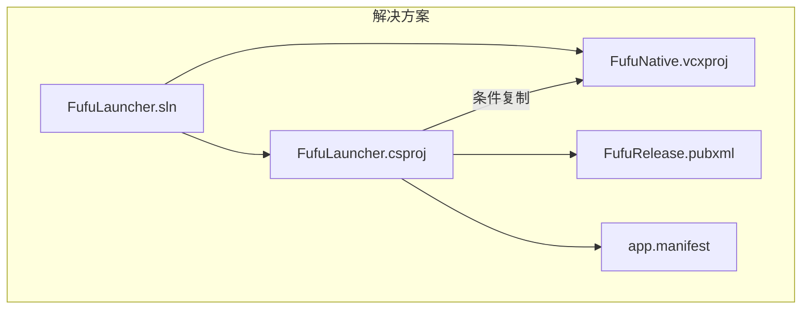
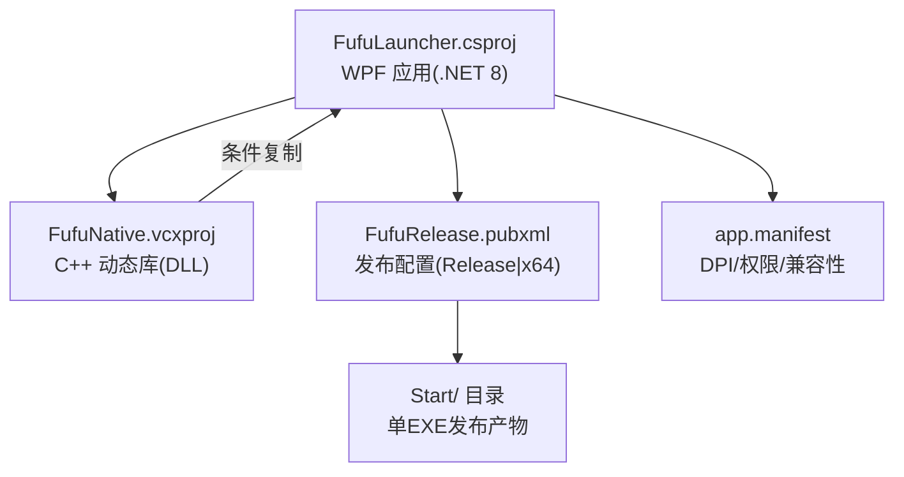
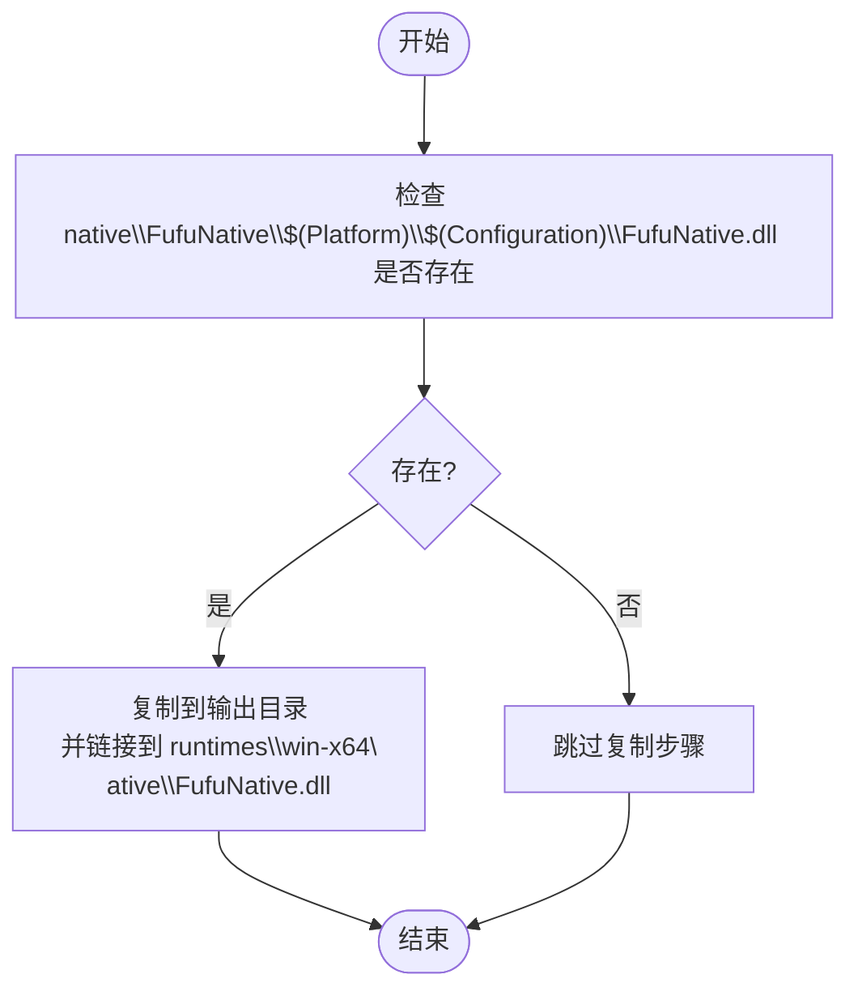
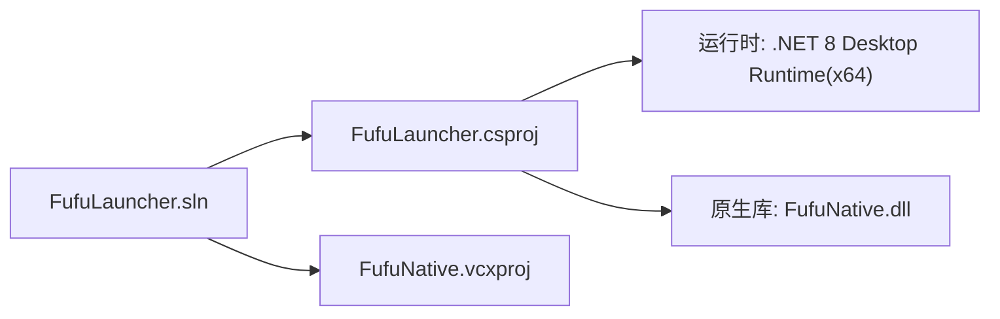

# 构建配置

<cite>
**本文引用的文件**   
- [FufuLauncher.csproj](file://src/FufuLauncher/FufuLauncher.csproj)
- [FufuRelease.pubxml](file://src/FufuLauncher/Properties/PublishProfiles/FufuRelease.pubxml)
- [FufuNative.vcxproj](file://native/FufuNative/FufuNative.vcxproj)
- [FufuLauncher.sln](file://FufuLauncher.sln)
- [app.manifest](file://src/FufuLauncher/app.manifest)
- [README.md](file://README.md)
</cite>

## 目录
1. [简介](#简介)
2. [项目结构](#项目结构)
3. [核心组件](#核心组件)
4. [架构总览](#架构总览)
5. [详细组件分析](#详细组件分析)
6. [依赖关系分析](#依赖关系分析)
7. [性能与优化建议](#性能与优化建议)
8. [故障排查指南](#故障排查指南)
9. [结论](#结论)
10. [附录](#附录)

## 简介
本文件面向“可爱的芙芙启动器”的构建与发布，聚焦于 C# WPF 项目 FufuLauncher.csproj 的构建配置、多平台构建策略、程序集元数据、C++ 原生 DLL 集成、NuGet 依赖管理以及自定义发布配置。文档同时给出可视化图示与最佳实践，帮助读者快速掌握从源码到可执行文件的完整构建流程。

## 项目结构
- 解决方案包含两个主要工程：
  - C# WPF 主程序：src/FufuLauncher/FufuLauncher.csproj
  - C++ 原生库：native/FufuNative/FufuNative.vcxproj
- 解决方案级定义了多种配置与平台组合（Debug/Release × Any CPU/x64/x86），并通过 MSBuild 属性将 C++ DLL 按当前配置与平台复制到输出目录。
- 发布使用独立发布配置文件 FufuRelease.pubxml，实现“框架依赖 + 单 EXE”的极简部署形态。

图表来源 
- [FufuLauncher.sln:1-51](file://FufuLauncher.sln#L1-L51)
- [FufuLauncher.csproj:1-49](file://src/FufuLauncher/FufuLauncher.csproj#L1-L49)
- [FufuNative.vcxproj:1-160](file://native/FufuNative/FufuNative.vcxproj#L1-L160)
- [FufuRelease.pubxml:1-37](file://src/FufuLauncher/Properties/PublishProfiles/FufuRelease.pubxml#L1-L37)
- [app.manifest:1-26](file://src/FufuLauncher/app.manifest#L1-L26)

章节来源
- [FufuLauncher.sln:1-51](file://FufuLauncher.sln#L1-L51)
- [FufuLauncher.csproj:1-49](file://src/FufuLauncher/FufuLauncher.csproj#L1-L49)
- [FufuNative.vcxproj:1-160](file://native/FufuNative/FufuNative.vcxproj#L1-L160)
- [FufuRelease.pubxml:1-37](file://src/FufuLauncher/Properties/PublishProfiles/FufuRelease.pubxml#L1-L37)
- [app.manifest:1-26](file://src/FufuLauncher/app.manifest#L1-L26)

## 核心组件
本节围绕 FufuLauncher.csproj 的关键构建选项进行说明，包括目标框架、平台配置、输出类型、语言特性、程序集元数据、C++ DLL 集成与 NuGet 依赖等。

- 输出类型与目标框架
  - 输出类型为 Windows 可执行程序（WinExe）。
  - 目标框架为 net8.0-windows，启用 WPF 支持。
- 平台与运行时标识
  - 声明支持 AnyCPU 与 x64 平台，默认目标平台为 x64。
  - 运行时标识指定 win-x64，确保生成针对 Windows x64 的应用。
  - SelfContained=false，表示依赖目标机已安装 .NET 8 Desktop Runtime。
- 语言与编译选项
  - 启用 Nullable 与 ImplicitUsings，提升代码安全与简洁性。
  - 语言版本 latest，跟随最新 C# 特性。
- 程序集信息与元数据
  - 设置 RootNamespace、AssemblyName、ApplicationManifest。
  - 统一设置 Version、AssemblyVersion、FileVersion、InformationalVersion。
  - 填写 Title、Company、Product、Copyright、Description、Authors、NeutralLanguage。
- C++ 原生 DLL 集成
  - 通过 ItemGroup 中的 None Include 引入 native\FufuNative\$(Platform)\$(Configuration)\FufuNative.dll。
  - 使用 Condition 判断文件存在后复制到输出目录，并链接到 runtimes\win-x64\native\FufuNative.dll 路径，便于运行时定位。
- 依赖项与 NuGet
  - 通过 PackageReference 引用 Microsoft.Extensions.DependencyInjection 8.0.1，用于依赖注入容器。

章节来源
- [FufuLauncher.csproj:1-49](file://src/FufuLauncher/FufuLauncher.csproj#L1-L49)

## 架构总览
下图展示了解决方案中 C# 与 C++ 工程的协作关系，以及发布配置如何影响最终产物。

图表来源 
- [FufuLauncher.csproj:1-49](file://src/FufuLauncher/FufuLauncher.csproj#L1-L49)
- [FufuNative.vcxproj:1-160](file://native/FufuNative/FufuNative.vcxproj#L1-L160)
- [FufuRelease.pubxml:1-37](file://src/FufuLauncher/Properties/PublishProfiles/FufuRelease.pubxml#L1-L37)
- [app.manifest:1-26](file://src/FufuLauncher/app.manifest#L1-L26)

## 详细组件分析

### FufuLauncher.csproj 构建配置详解
- 目标框架与 WPF
  - TargetFramework=net8.0-windows，UseWPF=true，表明这是一个基于 .NET 8 的 WPF 桌面应用。
- 平台与运行时
  - Platforms 声明 AnyCPU 与 x64；PlatformTarget 固定为 x64；RuntimeIdentifier 指定 win-x64。
  - SelfContained=false，意味着运行时需要系统已安装 .NET 8 Desktop Runtime (x64)。
- 程序集元数据
  - 统一设置版本号与描述信息，便于在资源管理器查看与诊断问题。
- C++ DLL 集成规则
  - 使用 $(Platform) 与 $(Configuration) 变量动态定位 native DLL 路径。
  - 通过 CopyToOutputDirectory=PreserveNewest 保证输出目录始终包含最新 DLL。
  - Link 到 runtimes\win-x64\native\FufuNative.dll，符合 .NET 运行时原生库查找约定。
- 依赖项
  - 仅引用 Microsoft.Extensions.DependencyInjection 以提供 DI 能力。

章节来源
- [FufuLauncher.csproj:1-49](file://src/FufuLauncher/FufuLauncher.csproj#L1-L49)

### 多平台构建与 x64 特殊处理
- 解决方案层定义 Debug/Release × Any CPU/x64/x86 的组合，但 C# 项目默认 PlatformTarget=x64，且 RuntimeIdentifier=win-x64，因此默认构建始终产出 x64 可执行文件。
- C++ 工程支持 Win32 与 x64 两种平台，VS 解决方案中将 C# 的 x64 配置映射到 C++ 的 x64 输出，确保 DLL 与 EXE 架构一致。
- 若需构建 x86 版本，需要：
  - 修改 FufuLauncher.csproj 的 PlatformTarget 与 RuntimeIdentifier 为 x86 对应值。
  - 确保 C++ 工程已生成 x86 版本的 DLL 并被正确复制到输出目录。

章节来源
- [FufuLauncher.sln:10-43](file://FufuLauncher.sln#L10-L43)
- [FufuLauncher.csproj:9-12](file://src/FufuLauncher/FufuLauncher.csproj#L9-L12)
- [FufuNative.vcxproj:4-20](file://native/FufuNative/FufuNative.vcxproj#L4-L20)

### 程序集信息与元数据配置
- 版本字段
  - Version、AssemblyVersion、FileVersion、InformationalVersion 统一设置为相同值，便于追踪发行版本。
- 描述与版权
  - Title、Company、Product、Copyright、Description、Authors、NeutralLanguage 均被设置，其中 NeutralLanguage=zh-CN。
- 清单文件
  - ApplicationManifest=app.manifest，启用 DPI 感知、权限与兼容性声明。

章节来源
- [FufuLauncher.csproj:15-32](file://src/FufuLauncher/FufuLauncher.csproj#L15-L32)
- [app.manifest:1-26](file://src/FufuLauncher/app.manifest#L1-L26)

### C++ 原生 DLL 集成与条件编译
- 条件复制规则
  - 使用 Exists(...) 条件判断 native DLL 是否存在，避免构建失败。
  - CopyToOutputDirectory=PreserveNewest 确保输出目录保持最新。
  - Link 到 runtimes\win-x64\native\FufuNative.dll，遵循 .NET 原生库加载约定。
- C++ 工程配置
  - 输出类型为 DynamicLibrary，工具集 v143，标准 C++20，预编译头 pch.h。
  - Debug/Release 分别启用调试符号或优化选项。

图表来源 
- [FufuLauncher.csproj:34-42](file://src/FufuLauncher/FufuLauncher.csproj#L34-L42)
- [FufuNative.vcxproj:29-54](file://native/FufuNative/FufuNative.vcxproj#L29-L54)

章节来源
- [FufuLauncher.csproj:34-42](file://src/FufuLauncher/FufuLauncher.csproj#L34-L42)
- [FufuNative.vcxproj:73-140](file://native/FufuNative/FufuNative.vcxproj#L73-L140)

### 依赖项管理与 NuGet 包配置
- 通过 PackageReference 引用 Microsoft.Extensions.DependencyInjection 8.0.1，用于服务注册与解析。
- 该包为轻量级 DI 容器，适合 WPF 应用的模块化与服务化设计。

章节来源
- [FufuLauncher.csproj:44-46](file://src/FufuLauncher/FufuLauncher.csproj#L44-L46)

### 自定义发布配置（FufuRelease.pubxml）
- 发布目标
  - Configuration=Release，Platform=x64，TargetFramework=net8.0-windows，RuntimeIdentifier=win-x64。
- 单文件与压缩
  - PublishSingleFile=true，EnableCompressionInSingleFile=false，SelfContained=false。
  - IncludeNativeLibrariesForSelfExtract=false，避免在单文件中嵌入原生库，减少体积与复杂性。
- 资源与语言
  - SatelliteResourceLanguages=zh-CN，仅打包中文资源，减小输出体积。
- 输出目录与保留策略
  - PublishDir 指向项目根 Start/ 目录。
  - DeleteExistingFiles=false，保护 appmcGAME/ 用户数据不被误删。

章节来源
- [FufuRelease.pubxml:18-36](file://src/FufuLauncher/Properties/PublishProfiles/FufuRelease.pubxml#L18-L36)

## 依赖关系分析
- 解决方案依赖
  - FufuLauncher.sln 同时引用 C# 与 C++ 工程，并在 GlobalSection(ProjectConfigurationPlatforms) 中建立平台映射。
- 运行时依赖
  - 目标机器需安装 .NET 8 Desktop Runtime (x64)，否则无法运行。
- 原生库依赖
  - 运行时通过 runtimes\win-x64\native 路径加载 FufuNative.dll。

图表来源 
- [FufuLauncher.sln:19-43](file://FufuLauncher.sln#L19-L43)
- [FufuLauncher.csproj:11-12](file://src/FufuLauncher/FufuLauncher.csproj#L11-L12)

章节来源
- [FufuLauncher.sln:19-43](file://FufuLauncher.sln#L19-L43)
- [README.md:77-82](file://README.md#L77-L82)

## 性能与优化建议
- 构建优化
  - 使用 Release 配置并开启 C++ 的全程序优化（WholeProgramOptimization）与函数级链接（FunctionLevelLinking）。
  - 启用预编译头（pch.h）以减少编译时间。
- 运行时优化
  - 单文件发布时禁用压缩（EnableCompressionInSingleFile=false）以降低解压开销。
  - 仅打包必要语言资源（SatelliteResourceLanguages=zh-CN）减少内存占用。
- 原生库优化
  - 确保 C++ 工程在 Release 模式下启用优化选项，并生成最小化的 DLL。
- 日志与 IO
  - 应用内采用队列与定时器批量写入日志，降低频繁 IO 对性能的干扰。

章节来源
- [FufuNative.vcxproj:88-106](file://native/FufuNative/FufuNative.vcxproj#L88-L106)
- [FufuRelease.pubxml:25-30](file://src/FufuLauncher/Properties/PublishProfiles/FufuRelease.pubxml#L25-L30)

## 故障排查指南
- 智能应用控制拦截
  - 未签名的 EXE 可能被 SmartScreen 拦截，可通过 PowerShell Unblock-File 或文件属性解除锁定。
- 运行时缺失
  - 若目标机未安装 .NET 8 Desktop Runtime (x64)，应用将无法启动，需在环境自检模块提示后安装。
- 原生库缺失
  - 若 FufuNative.dll 未复制到输出目录或路径不正确，运行时将找不到原生库，需检查条件复制规则与路径。

章节来源
- [README.md:55-73](file://README.md#L55-L73)
- [README.md:77-82](file://README.md#L77-L82)
- [FufuLauncher.csproj:34-42](file://src/FufuLauncher/FufuLauncher.csproj#L34-L42)

## 结论
通过对 FufuLauncher.csproj、FufuRelease.pubxml 与 FufuNative.vcxproj 的系统分析，我们明确了该启动器的构建目标、平台策略、程序集元数据、原生库集成与发布配置。遵循本文档的配置与最佳实践，可以稳定地构建出高性能、易部署的启动器产品。

## 附录
- 常用命令
  - 构建解决方案：在 VS2022 中选择 Release | x64，重新生成解决方案。
  - 发布单 EXE：dotnet publish src/FufuLauncher/FufuLauncher.csproj /p:PublishProfile=FufuRelease
- 参考文档
  - README.md 提供了编译环境与基本使用说明。

章节来源
- [README.md:27-32](file://README.md#L27-L32)
- [FufuRelease.pubxml:6-10](file://src/FufuLauncher/Properties/PublishProfiles/FufuRelease.pubxml#L6-L10)