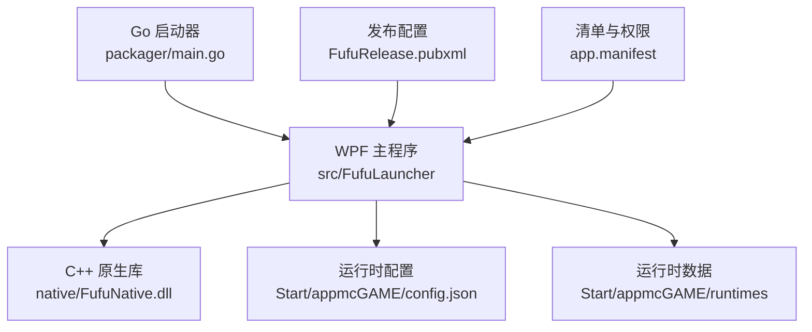
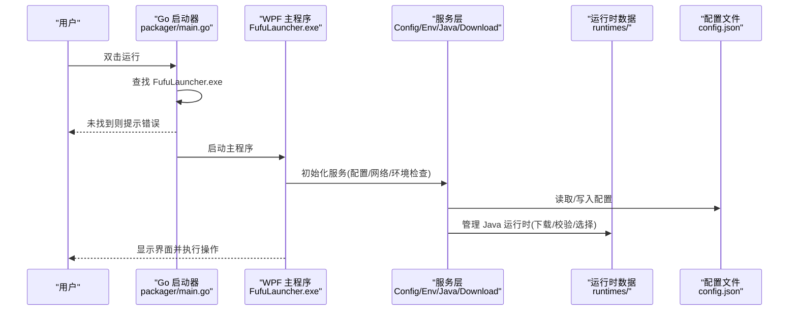
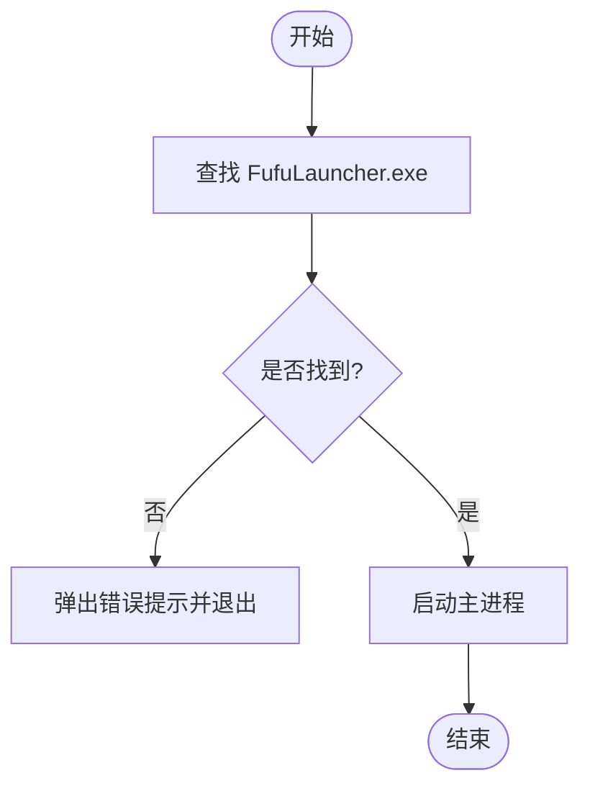
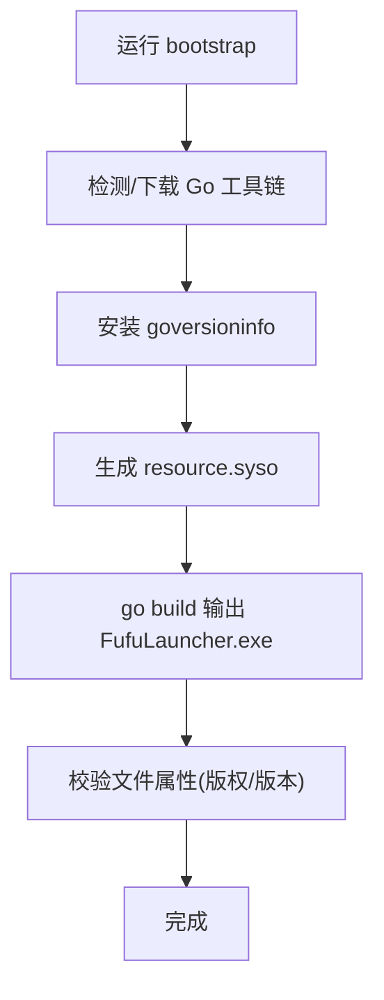
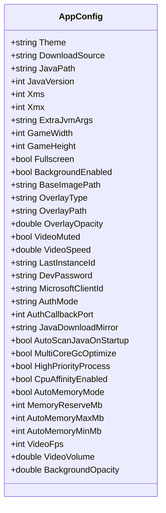
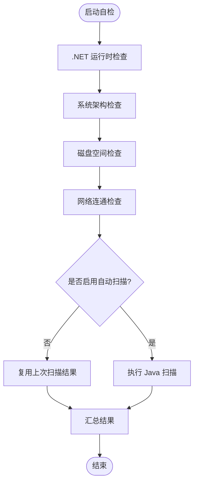
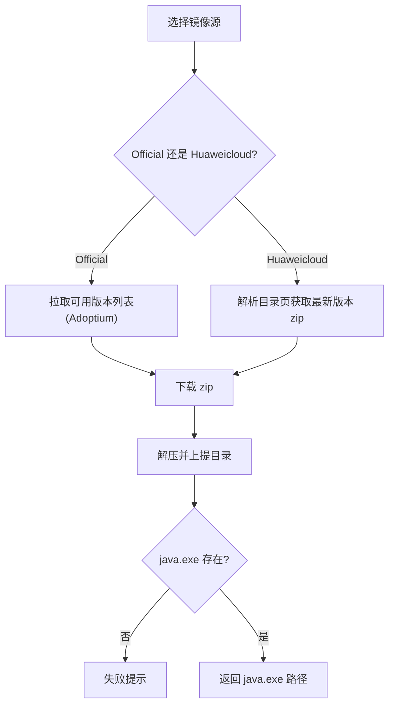
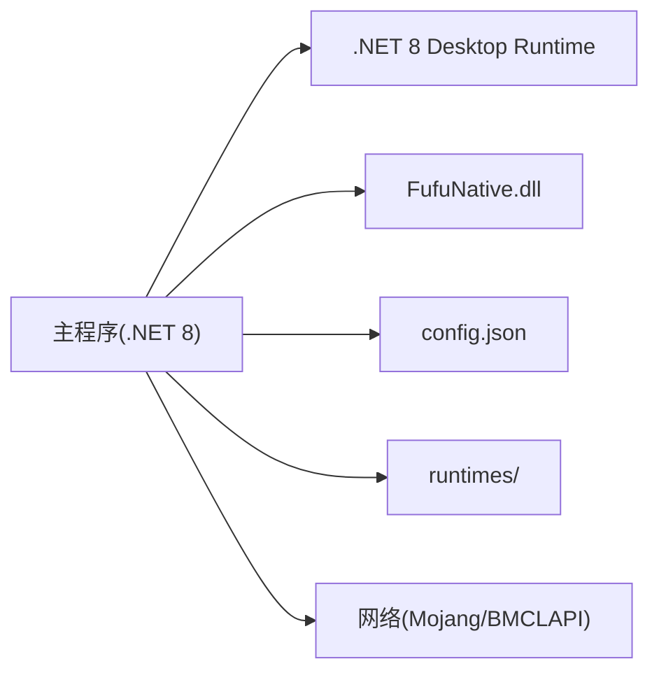

# 部署策略

<cite>
**本文引用的文件**   
- [README.md](file://README.md)
- [FufuLauncher.csproj](file://src/FufuLauncher/FufuLauncher.csproj)
- [app.manifest](file://src/FufuLauncher/app.manifest)
- [config.json](file://Start/appmcGAME/config.json)
- [main.go](file://packager/main.go)
- [Program.cs](file://bootstrap/Program.cs)
- [FufuRelease.pubxml](file://src/FufuLauncher/Properties/PublishProfiles/FufuRelease.pubxml)
- [versioninfo.json](file://packager/versioninfo.json)
- [ConfigService.cs](file://src/FufuLauncher/Services/ConfigService.cs)
- [EnvironmentCheckService.cs](file://src/FufuLauncher/Services/EnvironmentCheckService.cs)
- [JavaRuntimeService.cs](file://src/FufuLauncher/Services/JavaRuntimeService.cs)
</cite>

## 目录
1. [简介](#简介)
2. [项目结构](#项目结构)
3. [核心组件](#核心组件)
4. [架构总览](#架构总览)
5. [详细组件分析](#详细组件分析)
6. [依赖关系分析](#依赖关系分析)
7. [性能与资源考量](#性能与资源考量)
8. [故障排除指南](#故障排除指南)
9. [结论](#结论)
10. [附录：持续集成与自动化部署](#附录持续集成与自动化部署)

## 简介
本文件为“可爱的芙芙”Minecraft Java版启动器的全面部署策略文档，覆盖便携版、安装器与企业部署三种模式；说明运行时配置文件的作用与自定义项；阐述依赖自包含与本地部署模式；给出应用程序清单与权限配置要点；提供持续集成与自动化部署建议（GitHub Actions/Azure DevOps）；总结不同环境的最佳实践，以及部署后的验证与监控方法，并附常见问题的排障指引。

## 项目结构
- 解决方案与主程序
  - C# WPF 应用位于 src/FufuLauncher，目标框架 net8.0-windows，平台 x64，默认非自包含发布。
  - 原生 DLL 由 native/FufuNative 编译产出，按平台/配置复制到输出目录的 runtimes/win-x64/native 下。
- 打包与引导
  - packager/main.go 作为 Go 入口，查找并启动 FufuLauncher.exe。
  - bootstrap/Program.cs 负责在构建时自动准备 Go 工具链、生成版本信息并编译出可执行的 Go 启动器。
- 发布配置
  - src/FufuLauncher/Properties/PublishProfiles/FufuRelease.pubxml 定义单文件发布、仅保留中文语言包、输出到 Start 目录等规则。
- 运行时数据与配置
  - Start/appmcGAME/config.json 保存用户设置（主题、下载源、Java 路径、JVM 参数、分辨率、背景、认证等）。
  - Start/appmcGAME/runtimes 存放下载的完整 JDK。
- 清单与权限
  - src/FufuLauncher/app.manifest 声明运行级别、兼容性、DPI 感知等。

**图表来源** 
- [main.go:25-48](file://packager/main.go#L25-L48)
- [FufuLauncher.csproj:1-49](file://src/FufuLauncher/FufuLauncher.csproj#L1-L49)
- [FufuRelease.pubxml:1-37](file://src/FufuLauncher/Properties/PublishProfiles/FufuRelease.pubxml#L1-L37)
- [app.manifest:1-26](file://src/FufuLauncher/app.manifest#L1-L26)

**章节来源**
- [README.md:1-87](file://README.md#L1-L87)
- [FufuLauncher.csproj:1-49](file://src/FufuLauncher/FufuLauncher.csproj#L1-L49)
- [FufuRelease.pubxml:1-37](file://src/FufuLauncher/Properties/PublishProfiles/FufuRelease.pubxml#L1-L37)

## 核心组件
- 启动器入口（Go）
  - 负责定位并启动 FufuLauncher.exe，失败时弹出友好提示。
- 主程序（WPF/.NET 8）
  - 业务服务层包括配置、网络、下载、环境自检、Java 运行时管理、游戏安装与启动、日志、哈希校验等。
- 原生库（C++）
  - 提供 ZIP 解压与哈希计算能力，提升性能与稳定性。
- 发布与打包
  - 通过 .pubxml 实现单文件发布与精简产物；bootstrap 自动完成 Go 工具链准备与资源嵌入。

**章节来源**
- [main.go:25-77](file://packager/main.go#L25-L77)
- [FufuLauncher.csproj:1-49](file://src/FufuLauncher/FufuLauncher.csproj#L1-L49)
- [Program.cs:1-186](file://bootstrap/Program.cs#L1-L186)

## 架构总览
下图展示从 Go 启动器到 WPF 主程序及关键服务的调用关系，以及运行时配置与数据的交互。

**图表来源** 
- [main.go:25-77](file://packager/main.go#L25-L77)
- [ConfigService.cs:1-148](file://src/FufuLauncher/Services/ConfigService.cs#L1-L148)
- [EnvironmentCheckService.cs:1-215](file://src/FufuLauncher/Services/EnvironmentCheckService.cs#L1-L215)
- [JavaRuntimeService.cs:1-527](file://src/FufuLauncher/Services/JavaRuntimeService.cs#L1-L527)

## 详细组件分析

### 启动器入口（Go）
- 功能
  - 根据相对路径候选列表定位 FufuLauncher.exe，找不到则弹窗提示。
  - 使用系统 API 弹出消息框，避免依赖额外 UI 库。
- 部署影响
  - 要求 FufuLauncher.exe 与 Go 启动器在同一目录或指定子目录结构中。
  - 适合便携版分发，无需安装即可运行。

**图表来源** 
- [main.go:25-77](file://packager/main.go#L25-L77)

**章节来源**
- [main.go:25-77](file://packager/main.go#L25-L77)

### 发布与打包（.NET 单文件 + 资源嵌入）
- 发布配置要点
  - 单文件发布，不包含原生库（SelfContained=false），仅输出 exe。
  - 仅保留 zh-CN 语言包，减少体积。
  - 输出目录为 Start，保护 appmcGAME 用户数据不被删除。
- 版本信息与版权
  - bootstrap 通过 goversioninfo 生成 resource.syso，将 versioninfo.json 中的元信息嵌入 Go 启动器。
  - 构建完成后校验嵌入信息是否正确。

**图表来源** 
- [Program.cs:64-186](file://bootstrap/Program.cs#L64-L186)
- [versioninfo.json:1-44](file://packager/versioninfo.json#L1-L44)
- [FufuRelease.pubxml:1-37](file://src/FufuLauncher/Properties/PublishProfiles/FufuRelease.pubxml#L1-L37)

**章节来源**
- [FufuRelease.pubxml:1-37](file://src/FufuLauncher/Properties/PublishProfiles/FufuRelease.pubxml#L1-L37)
- [Program.cs:1-186](file://bootstrap/Program.cs#L1-L186)
- [versioninfo.json:1-44](file://packager/versioninfo.json#L1-L44)

### 运行时配置（config.json）
- 作用
  - 持久化用户设置，包括主题、下载源、Java 路径与版本、JVM 参数、分辨率、全屏、背景与视频设置、认证方式与端口、内存分配策略等。
- 关键项说明
  - DownloadSource：下载源（如 Mojang/BMCLAPI）。
  - JavaPath/JavaVersion：指定 Java 路径或版本。
  - Xms/Xmx/ExtraJvmArgs：JVM 内存与参数。
  - AuthMode/AuthCallbackPort：微软账号登录模式与回调端口。
  - JavaDownloadMirror：Java 下载镜像（Official/Huaweicloud）。
  - AutoScanJavaOnStartup：开机是否自动扫描 Java。
  - MultiCoreGcOptimize/HighPriorityProcess/CpuAffinityEnabled：JVM 多核优化与进程优先级。
  - AutoMemoryMode/MemoryReserveMb/AutoMemoryMaxMb/AutoMemoryMinMb：智能内存分配。
  - VideoFps/VideoVolume/BackgroundOpacity：视频背景增强相关。
- 迁移与兼容
  - ConfigService 支持旧背景配置的迁移与二次迁移，确保向后兼容。

**图表来源** 
- [ConfigService.cs:13-79](file://src/FufuLauncher/Services/ConfigService.cs#L13-L79)

**章节来源**
- [config.json:1-36](file://Start/appmcGAME/config.json#L1-L36)
- [ConfigService.cs:1-148](file://src/FufuLauncher/Services/ConfigService.cs#L1-L148)

### 环境自检（EnvironmentCheckService）
- 检测内容
  - .NET 运行时加载状态、操作系统架构、磁盘空间、网络连通性、Java 扫描结果。
- 行为
  - 若 32 位系统直接提示不支持；磁盘不足或网络异常弹窗提示；未发现 Java 时引导用户下载或手动扫描。
  - 受 AutoScanJavaOnStartup 控制是否自动扫描。

**图表来源** 
- [EnvironmentCheckService.cs:52-90](file://src/FufuLauncher/Services/EnvironmentCheckService.cs#L52-L90)
- [EnvironmentCheckService.cs:176-213](file://src/FufuLauncher/Services/EnvironmentCheckService.cs#L176-L213)

**章节来源**
- [EnvironmentCheckService.cs:1-215](file://src/FufuLauncher/Services/EnvironmentCheckService.cs#L1-L215)

### Java 运行时管理（JavaRuntimeService）
- 功能
  - 列出已安装的完整 JDK，支持从 Adoptium 官方源或华为云镜像下载任意主版本的 JDK。
  - 下载后解压并上提目录结构，确保 java.exe 就位；提供完整性校验。
- 镜像与版本
  - Official：Adoptium API，动态拉取可用版本列表。
  - Huaweicloud：OpenJDK 官方版本，解析目录页获取最新 zip。
- 部署意义
  - 支持企业环境预置 JDK 或按需下载；便于离线与内网部署。

**图表来源** 
- [JavaRuntimeService.cs:116-158](file://src/FufuLauncher/Services/JavaRuntimeService.cs#L116-L158)
- [JavaRuntimeService.cs:199-277](file://src/FufuLauncher/Services/JavaRuntimeService.cs#L199-L277)
- [JavaRuntimeService.cs:280-335](file://src/FufuLauncher/Services/JavaRuntimeService.cs#L280-L335)

**章节来源**
- [JavaRuntimeService.cs:1-527](file://src/FufuLauncher/Services/JavaRuntimeService.cs#L1-L527)

### 清单与权限（app.manifest）
- 运行级别
  - asInvoker：不请求管理员权限，降低权限风险。
- 兼容性
  - 声明支持 Windows 10/11。
- DPI 感知
  - PerMonitorV2，适配高分屏。

**章节来源**
- [app.manifest:1-26](file://src/FufuLauncher/app.manifest#L1-L26)

## 依赖关系分析
- 运行时依赖
  - .NET 8 Desktop Runtime (x64) 为目标机器必需；未安装时环境自检会提示下载地址。
- 原生依赖
  - FufuNative.dll 需随主程序输出目录一起分发，按 win-x64 平台路径查找。
- 下载与网络
  - 依赖 Mojang 官方源与 BMCLAPI 国内镜像；网络不通时会提示。
- 版本与资源
  - Go 启动器嵌入版本与版权信息；发布配置控制语言包与产物大小。

**图表来源** 
- [README.md:77-83](file://README.md#L77-L83)
- [FufuLauncher.csproj:34-42](file://src/FufuLauncher/FufuLauncher.csproj#L34-L42)
- [EnvironmentCheckService.cs:151-174](file://src/FufuLauncher/Services/EnvironmentCheckService.cs#L151-L174)

**章节来源**
- [README.md:77-83](file://README.md#L77-L83)
- [FufuLauncher.csproj:34-42](file://src/FufuLauncher/FufuLauncher.csproj#L34-L42)

## 性能与资源考量
- 单文件发布
  - 减少分发复杂度，但需注意原生库不在单文件内，需单独放置。
- 语言包裁剪
  - 仅保留 zh-CN，显著减小体积。
- 压缩开关
  - 禁用单文件压缩以提升启动速度（权衡体积）。
- 原生解压
  - 优先使用 C++ 原生解压，失败回退托管实现，提高大文件处理性能。
- JVM 优化
  - 可选多核 GC 优化、高优先级与 CPU 亲和性，改善游戏启动与运行体验。

[本节为通用指导，不直接分析具体文件]

## 故障排除指南
- 智能应用控制拦截
  - 现象：exe 被 SmartScreen 拦截。
  - 解决：PowerShell 执行 Unblock-File 或在文件属性中解除锁定。
- 未找到主程序
  - 现象：Go 启动器提示未找到 FufuLauncher.exe。
  - 解决：确保主程序与启动器在同一目录或指定子目录结构中。
- 未安装 .NET 运行时
  - 现象：环境自检提示缺失运行时。
  - 解决：安装 .NET 8 Desktop Runtime (x64)。
- 网络异常
  - 现象：无法访问 Mojang 与 BMCLAPI。
  - 解决：检查代理与防火墙设置，确认网络连通。
- 未发现 Java
  - 现象：启动器提示未发现 Java。
  - 解决：在 Java 运行时页面下载或手动安装 Java 8/17/21。
- 磁盘空间不足
  - 现象：自检提示剩余空间不足。
  - 解决：清理磁盘，确保至少 5GB 可用。

**章节来源**
- [README.md:55-74](file://README.md#L55-L74)
- [main.go:59-77](file://packager/main.go#L59-L77)
- [EnvironmentCheckService.cs:91-174](file://src/FufuLauncher/Services/EnvironmentCheckService.cs#L91-L174)

## 结论
本部署策略围绕“便携版、安装器与企业部署”三大模式展开，结合单文件发布、Go 启动器与 WPF 主程序的协作，提供了完整的运行时配置、依赖管理与环境自检方案。通过清晰的清单与权限配置、严格的发布规则与 CI/CD 建议，可在不同环境中稳定交付与运维。部署后应进行基础验证与监控，确保用户体验与系统稳定性。

[本节为总结，不直接分析具体文件]

## 附录：持续集成与自动化部署
- GitHub Actions
  - 步骤建议：
    - 安装 .NET 8 SDK 与 Visual Studio 工作负载（C++ 桌面开发）。
    - 构建 C++ 原生库（FufuNative.vcxproj）。
    - 运行 bootstrap 以准备 Go 工具链、生成 resource.syso 并编译 Go 启动器。
    - 执行 dotnet publish 使用 FufuRelease.pubxml 输出 Start 目录。
    - 打包 Start 目录（含 FufuLauncher.exe、脚本与 appmcGAME 数据）。
    - 上传制品（zip 或 msix/msi，如需企业分发）。
- Azure DevOps
  - 任务建议：
    - 使用 VSBuild 构建解决方案（Release|x64）。
    - 使用 DotNetCoreCLI@2 执行发布（指定 pubxml）。
    - 使用命令行任务运行 bootstrap 与 go build。
    - 使用 PublishBuildArtifacts@1 上传产物。
- 环境变量与代理
  - 设置 GOPROXY、HTTP_PROXY/HTTPS_PROXY 以适配企业网络。
  - 缓存 .tools/go 与 gocache 加速构建。
- 质量门禁
  - 校验生成的 Go 启动器文件属性（版权/版本）。
  - 校验输出目录白名单（仅允许 exe、脚本与数据目录）。

[本节为概念性指导，不直接分析具体文件]