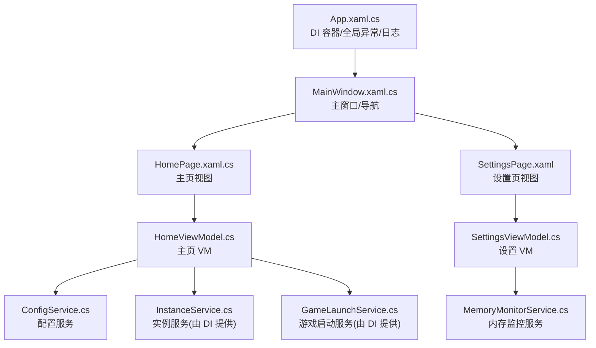
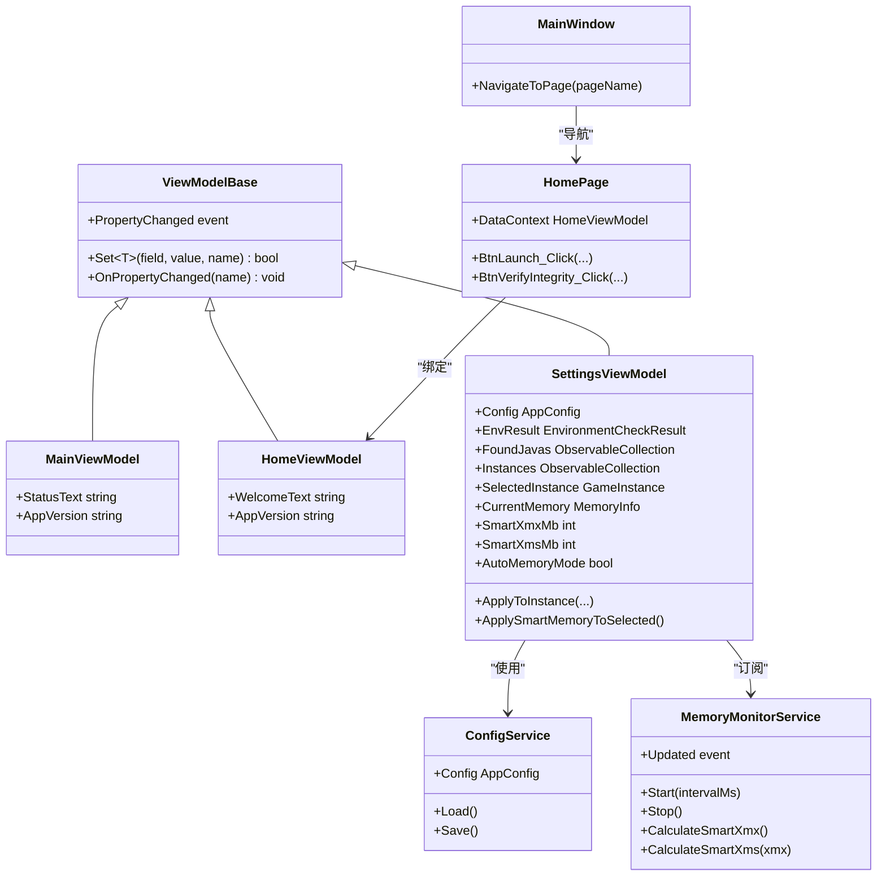
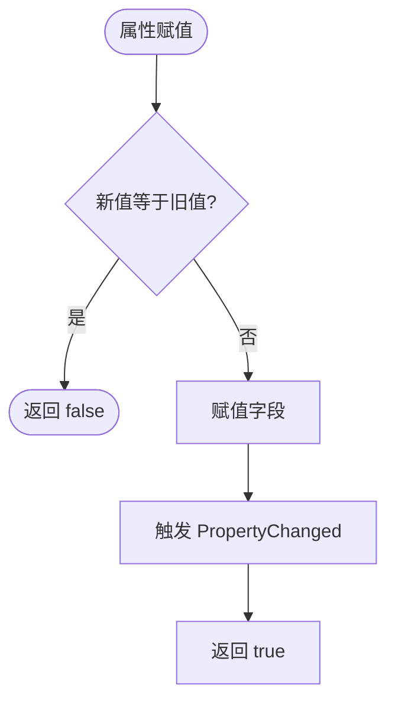
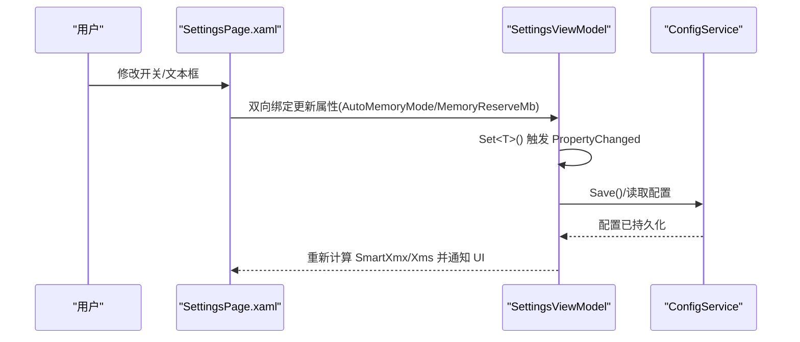
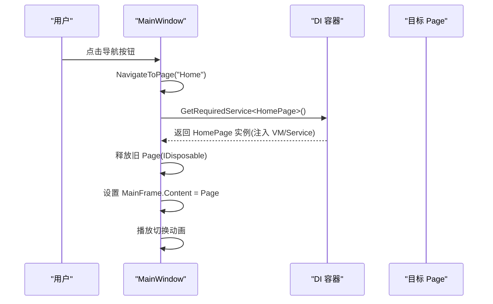
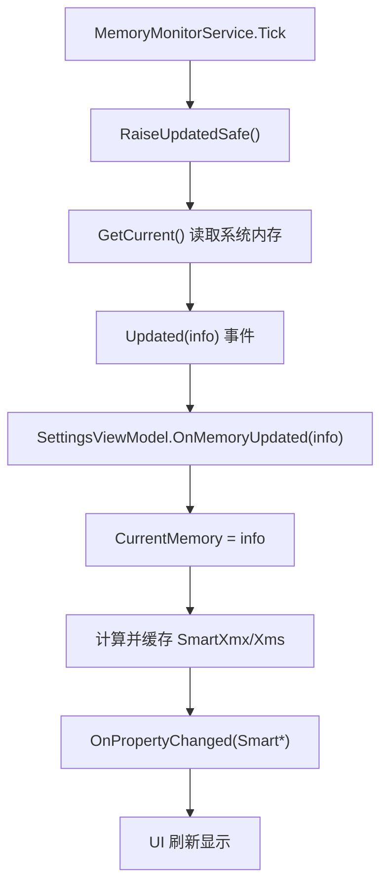
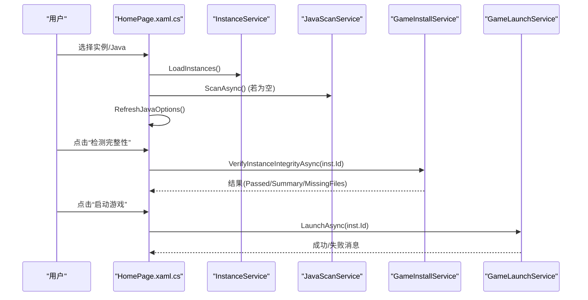
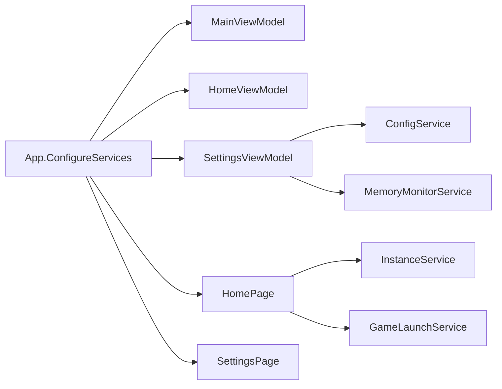

# MVVM 模式实现

<cite>
**本文引用的文件**
- [App.xaml.cs](file://src/FufuLauncher/App.xaml.cs)
- [MainWindow.xaml.cs](file://src/FufuLauncher/MainWindow.xaml.cs)
- [ViewModelBase.cs](file://src/FufuLauncher/ViewModels/ViewModelBase.cs)
- [MainViewModel.cs](file://src/FufuLauncher/ViewModels/MainViewModel.cs)
- [HomeViewModel.cs](file://src/FufuLauncher/ViewModels/HomeViewModel.cs)
- [SettingsViewModel.cs](file://src/FufuLauncher/ViewModels/SettingsViewModel.cs)
- [HomePage.xaml.cs](file://src/FufuLauncher/Views/HomePage.xaml.cs)
- [HomePage.xaml](file://src/FufuLauncher/Views/HomePage.xaml)
- [SettingsPage.xaml](file://src/FufuLauncher/Views/SettingsPage.xaml)
- [BoolToVisConverter.cs](file://src/FufuLauncher/Converters/BoolToVisConverter.cs)
- [ConfigService.cs](file://src/FufuLauncher/Services/ConfigService.cs)
- [MemoryMonitorService.cs](file://src/FufuLauncher/Services/MemoryMonitorService.cs)
</cite>

## 目录
1. [简介](#简介)
2. [项目结构](#项目结构)
3. [核心组件](#核心组件)
4. [架构总览](#架构总览)
5. [详细组件分析](#详细组件分析)
6. [依赖关系分析](#依赖关系分析)
7. [性能考量](#性能考量)
8. [故障排查指南](#故障排查指南)
9. [结论](#结论)
10. [附录](#附录)

## 简介
本文件面向“可爱的芙芙启动器”的 MVVM 模式实现，系统性阐述 View、ViewModel、Model（服务）的职责分离与数据绑定机制。重点包括：
- ViewModelBase 基类的设计：属性变更通知、命令模式扩展点、异步操作处理建议
- WPF 数据绑定：双向绑定、转换器、验证机制
- 页面导航系统与 MVVM 的集成方式
- 错误处理与异常传播在 MVVM 中的落地方案
- 新增 ViewModel 与 View 的实践示例与最佳实践

## 项目结构
- 视图层（View）：WPF Page/Window，负责 UI 展示与用户交互事件
- 视图模型层（ViewModel）：承载状态与行为，通过 INotifyPropertyChanged 驱动 UI 更新
- 服务层（Model/Service）：业务逻辑、I/O、系统调用等，通过 DI 注入到 ViewModel/View
- 应用入口与容器：App.xaml.cs 注册 DI 服务，MainWindow.xaml.cs 管理页面导航与生命周期

图表来源
- [App.xaml.cs:138-217](file://src/FufuLauncher/App.xaml.cs#L138-L217)
- [MainWindow.xaml.cs:128-186](file://src/FufuLauncher/MainWindow.xaml.cs#L128-L186)
- [HomePage.xaml.cs:27-41](file://src/FufuLauncher/Views/HomePage.xaml.cs#L27-L41)
- [SettingsPage.xaml:137-186](file://src/FufuLauncher/Views/SettingsPage.xaml#L137-L186)
- [HomeViewModel.cs:1-25](file://src/FufuLauncher/ViewModels/HomeViewModel.cs#L1-L25)
- [SettingsViewModel.cs:172-194](file://src/FufuLauncher/ViewModels/SettingsViewModel.cs#L172-L194)
- [ConfigService.cs:81-148](file://src/FufuLauncher/Services/ConfigService.cs#L81-L148)
- [MemoryMonitorService.cs:56-88](file://src/FufuLauncher/Services/MemoryMonitorService.cs#L56-L88)

章节来源
- [App.xaml.cs:138-217](file://src/FufuLauncher/App.xaml.cs#L138-L217)
- [MainWindow.xaml.cs:128-186](file://src/FufuLauncher/MainWindow.xaml.cs#L128-L186)

## 核心组件
- ViewModelBase：统一实现 INotifyPropertyChanged，提供 Set<T>() 简化属性赋值与变更通知
- MainViewModel / HomeViewModel：轻量状态展示（如版本、欢迎语），演示属性绑定
- SettingsViewModel：复杂状态与计算（内存监控、智能分配、JVM 参数预览），订阅服务事件并缓存结果
- HomePage.xaml.cs：页面级交互（实例选择、Java 选择、完整性校验、启动门控）
- MainWindow.xaml.cs：基于字符串路由的页面导航，结合 DI 创建页面实例
- Converters：BoolToVisConverter 用于布尔值与可见性的转换
- Services：ConfigService（配置持久化）、MemoryMonitorService（系统内存监控与智能分配）

章节来源
- [ViewModelBase.cs:1-22](file://src/FufuLauncher/ViewModels/ViewModelBase.cs#L1-L22)
- [MainViewModel.cs:1-25](file://src/FufuLauncher/ViewModels/MainViewModel.cs#L1-L25)
- [HomeViewModel.cs:1-25](file://src/FufuLauncher/ViewModels/HomeViewModel.cs#L1-L25)
- [SettingsViewModel.cs:1-252](file://src/FufuLauncher/ViewModels/SettingsViewModel.cs#L1-L252)
- [HomePage.xaml.cs:1-314](file://src/FufuLauncher/Views/HomePage.xaml.cs#L1-L314)
- [MainWindow.xaml.cs:1-245](file://src/FufuLauncher/MainWindow.xaml.cs#L1-L245)
- [BoolToVisConverter.cs:1-19](file://src/FufuLauncher/Converters/BoolToVisConverter.cs#L1-L19)
- [ConfigService.cs:1-148](file://src/FufuLauncher/Services/ConfigService.cs#L1-L148)
- [MemoryMonitorService.cs:1-227](file://src/FufuLauncher/Services/MemoryMonitorService.cs#L1-L227)

## 架构总览
MVVM 分层清晰：
- View：仅持有 UI 元素与事件处理器，必要时通过代码隐藏协调 UI 细节（如动画、资源释放）
- ViewModel：暴露可绑定的属性与方法，封装 UI 状态与业务编排；通过服务完成 I/O 与系统调用
- Model/Service：纯业务与基础设施能力，无 UI 依赖，通过 DI 注入

图表来源
- [ViewModelBase.cs:1-22](file://src/FufuLauncher/ViewModels/ViewModelBase.cs#L1-L22)
- [MainViewModel.cs:1-25](file://src/FufuLauncher/ViewModels/MainViewModel.cs#L1-L25)
- [HomeViewModel.cs:1-25](file://src/FufuLauncher/ViewModels/HomeViewModel.cs#L1-L25)
- [SettingsViewModel.cs:1-252](file://src/FufuLauncher/ViewModels/SettingsViewModel.cs#L1-L252)
- [HomePage.xaml.cs:1-314](file://src/FufuLauncher/Views/HomePage.xaml.cs#L1-L314)
- [MainWindow.xaml.cs:1-245](file://src/FufuLauncher/MainWindow.xaml.cs#L1-L245)
- [ConfigService.cs:1-148](file://src/FufuLauncher/Services/ConfigService.cs#L1-L148)
- [MemoryMonitorService.cs:1-227](file://src/FufuLauncher/Services/MemoryMonitorService.cs#L1-L227)

## 详细组件分析

### ViewModelBase 基类设计
- 职责：统一实现 INotifyPropertyChanged，提供 Set<T>() 方法减少样板代码
- 属性变更通知：Set<T>() 内部比较新旧值，不等则赋值并触发 PropertyChanged
- 可扩展性：可在派生类中封装命令（Command）与异步操作（AsyncCommand）以复用
- 线程安全：UI 线程更新属性；跨线程场景应在 UI 线程触发 OnPropertyChanged

图表来源
- [ViewModelBase.cs:11-20](file://src/FufuLauncher/ViewModels/ViewModelBase.cs#L11-L20)

章节来源
- [ViewModelBase.cs:1-22](file://src/FufuLauncher/ViewModels/ViewModelBase.cs#L1-L22)

### 数据绑定与转换器
- 双向绑定：例如设置页的 IsChecked="{Binding AutoMemoryMode}"、TextBox Text="{Binding ... UpdateSourceTrigger=PropertyChanged}"
- 单向绑定：如进度条 Value="{Binding MemoryLoadPercent, Mode=OneWay}"
- 转换器：BoolToVisConverter 将布尔值转换为 Visibility，便于显示/隐藏控件
- 验证机制：可通过 IDataErrorInfo 或 ValidationRules 在 TextBox/ComboBox 上实现输入校验（本项目未直接体现，但可在 XAML 中扩展）

图表来源
- [SettingsPage.xaml:137-186](file://src/FufuLauncher/Views/SettingsPage.xaml#L137-L186)
- [SettingsViewModel.cs:100-170](file://src/FufuLauncher/ViewModels/SettingsViewModel.cs#L100-L170)
- [ConfigService.cs:135-148](file://src/FufuLauncher/Services/ConfigService.cs#L135-L148)
- [BoolToVisConverter.cs:1-19](file://src/FufuLauncher/Converters/BoolToVisConverter.cs#L1-L19)

章节来源
- [BoolToVisConverter.cs:1-19](file://src/FufuLauncher/Converters/BoolToVisConverter.cs#L1-L19)
- [SettingsPage.xaml:137-186](file://src/FufuLauncher/Views/SettingsPage.xaml#L137-L186)
- [SettingsViewModel.cs:100-170](file://src/FufuLauncher/ViewModels/SettingsViewModel.cs#L100-L170)
- [ConfigService.cs:135-148](file://src/FufuLauncher/Services/ConfigService.cs#L135-L148)

### 页面导航与 MVVM 集成
- 导航策略：MainWindow 根据字符串路由从 DI 容器解析对应 Page 实例，自动注入其依赖（ViewModel/Service）
- 生命周期：每次导航创建新的 Page（Transient），切换前释放旧 Page（IDisposable）避免内存泄漏
- 动画过渡：淡入+轻微上滑，提升用户体验

图表来源
- [MainWindow.xaml.cs:128-186](file://src/FufuLauncher/MainWindow.xaml.cs#L128-L186)
- [App.xaml.cs:205-217](file://src/FufuLauncher/App.xaml.cs#L205-L217)

章节来源
- [MainWindow.xaml.cs:128-186](file://src/FufuLauncher/MainWindow.xaml.cs#L128-L186)
- [App.xaml.cs:205-217](file://src/FufuLauncher/App.xaml.cs#L205-L217)

### 设置页 VM 与内存监控
- 订阅 MemoryMonitorService.Updated（UI 线程触发），更新 CurrentMemory 并缓存 SmartXmx/Xms
- 多核 GC 优化参数预览：根据 CPU 核心数生成 JVM 参数
- 一键应用智能推荐内存到选中实例

图表来源
- [MemoryMonitorService.cs:62-88](file://src/FufuLauncher/Services/MemoryMonitorService.cs#L62-L88)
- [MemoryMonitorService.cs:130-141](file://src/FufuLauncher/Services/MemoryMonitorService.cs#L130-L141)
- [MemoryMonitorService.cs:144-155](file://src/FufuLauncher/Services/MemoryMonitorService.cs#L144-L155)
- [SettingsViewModel.cs:196-200](file://src/FufuLauncher/ViewModels/SettingsViewModel.cs#L196-L200)
- [SettingsViewModel.cs:45-73](file://src/FufuLauncher/ViewModels/SettingsViewModel.cs#L45-L73)

章节来源
- [MemoryMonitorService.cs:62-88](file://src/FufuLauncher/Services/MemoryMonitorService.cs#L62-L88)
- [MemoryMonitorService.cs:130-155](file://src/FufuLauncher/Services/MemoryMonitorService.cs#L130-L155)
- [SettingsViewModel.cs:45-73](file://src/FufuLauncher/ViewModels/SettingsViewModel.cs#L45-L73)
- [SettingsViewModel.cs:196-200](file://src/FufuLauncher/ViewModels/SettingsViewModel.cs#L196-L200)

### 主页视图与启动流程
- 实例选择与 Java 选项动态构建（实例隔离 Java vs 本机扫描 Java）
- 完整性校验作为启动门控：未通过禁止启动
- 启动流程：检查运行状态 → 完整性校验 → 调用 GameLaunchService.LaunchAsync

图表来源
- [HomePage.xaml.cs:43-65](file://src/FufuLauncher/Views/HomePage.xaml.cs#L43-L65)
- [HomePage.xaml.cs:68-150](file://src/FufuLauncher/Views/HomePage.xaml.cs#L68-L150)
- [HomePage.xaml.cs:229-275](file://src/FufuLauncher/Views/HomePage.xaml.cs#L229-L275)
- [HomePage.xaml.cs:277-303](file://src/FufuLauncher/Views/HomePage.xaml.cs#L277-L303)

章节来源
- [HomePage.xaml.cs:43-65](file://src/FufuLauncher/Views/HomePage.xaml.cs#L43-L65)
- [HomePage.xaml.cs:68-150](file://src/FufuLauncher/Views/HomePage.xaml.cs#L68-L150)
- [HomePage.xaml.cs:229-275](file://src/FufuLauncher/Views/HomePage.xaml.cs#L229-L275)
- [HomePage.xaml.cs:277-303](file://src/FufuLauncher/Views/HomePage.xaml.cs#L277-L303)

### 新增 ViewModel 与 View 的实现步骤
- 新建 ViewModel：继承 ViewModelBase，定义可绑定属性（使用 Set<T>()），必要时实现 IDisposable 并在析构/Dispose 中退订事件
- 在 App.xaml.cs 的 ConfigureServices 中注册 ViewModel（单例）与对应的 Page（瞬态）
- 新建 Page：在构造函数中注入 ViewModel 与服务，设置 DataContext = vm
- 在 XAML 中使用 Binding 连接属性，必要时添加 Converter 与 ValidationRules
- 如需导航：在 MainWindow.NavigateToPage 中添加路由映射

章节来源
- [App.xaml.cs:170-217](file://src/FufuLauncher/App.xaml.cs#L170-L217)
- [MainWindow.xaml.cs:128-186](file://src/FufuLauncher/MainWindow.xaml.cs#L128-L186)
- [HomePage.xaml.cs:27-41](file://src/FufuLauncher/Views/HomePage.xaml.cs#L27-L41)

## 依赖关系分析
- DI 容器集中注册所有服务与 ViewModel/Page，确保松耦合与易测试
- ViewModel 通过构造函数注入服务，避免静态依赖
- Page 作为 Transient 对象，按需创建与释放，降低内存占用

图表来源
- [App.xaml.cs:170-217](file://src/FufuLauncher/App.xaml.cs#L170-L217)
- [SettingsViewModel.cs:172-194](file://src/FufuLauncher/ViewModels/SettingsViewModel.cs#L172-L194)
- [HomePage.xaml.cs:27-41](file://src/FufuLauncher/Views/HomePage.xaml.cs#L27-L41)

章节来源
- [App.xaml.cs:170-217](file://src/FufuLauncher/App.xaml.cs#L170-L217)

## 性能考量
- 内存监控定时器：使用 DispatcherTimer（Background 优先级），间隔 3000ms，避免频繁 P/Invoke 与 UI 卡顿
- 属性缓存：SettingsViewModel 缓存 SmartXmx/Xms，避免每次 INPC 触发重复计算
- 日志写入：后台队列批量写入，降低 IO 阻塞
- 页面切换动画：短时长缓动，保证流畅体验

章节来源
- [MemoryMonitorService.cs:62-88](file://src/FufuLauncher/Services/MemoryMonitorService.cs#L62-L88)
- [SettingsViewModel.cs:45-73](file://src/FufuLauncher/ViewModels/SettingsViewModel.cs#L45-L73)
- [App.xaml.cs:40-67](file://src/FufuLauncher/App.xaml.cs#L40-L67)
- [MainWindow.xaml.cs:156-186](file://src/FufuLauncher/MainWindow.xaml.cs#L156-L186)

## 故障排查指南
- 全局异常捕获：DispatcherUnhandledException、AppDomain.UnhandledException、TaskScheduler.UnobservedTaskException
- 日志查看：App.ReadAppLog() 与 GameLogService.FlushNow() 确保最新日志落地
- 常见问题定位：
  - 页面空白：检查 DI 是否正确注册 ViewModel/Page
  - 绑定不更新：确认属性是否通过 Set<T>() 赋值并触发 PropertyChanged
  - 内存监控无刷新：确认 MemoryMonitorService.Start() 已调用且 Updated 事件已订阅

章节来源
- [App.xaml.cs:219-245](file://src/FufuLauncher/App.xaml.cs#L219-L245)
- [App.xaml.cs:40-80](file://src/FufuLauncher/App.xaml.cs#L40-L80)
- [HomePage.xaml.cs:307-313](file://src/FufuLauncher/Views/HomePage.xaml.cs#L307-L313)

## 结论
该启动器采用清晰的 MVVM 分层与 DI 注入，实现了高内聚低耦合的架构。ViewModelBase 简化了属性变更通知，服务层封装了业务与系统调用，View 专注 UI 与交互。通过转换器、双向绑定与验证机制，提升了用户体验与可维护性。建议在新增功能时遵循现有模式，保持职责边界清晰与性能优化意识。

## 附录
- 命令模式扩展建议：在 ViewModelBase 中引入 ICommand 接口与 AsyncCommand 封装，统一处理异步与异常
- 验证机制建议：为关键输入（如路径、数值范围）添加 ValidationRules，并在 UI 中反馈错误信息
- 主题与背景：ThemeService 统一管理样式与背景资源，支持运行时切换与资源释放