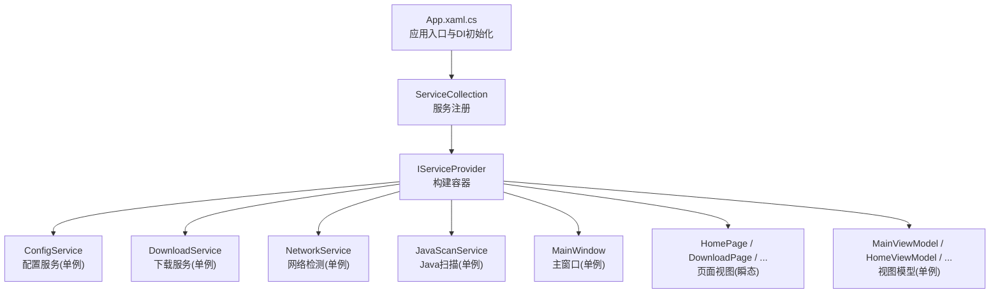
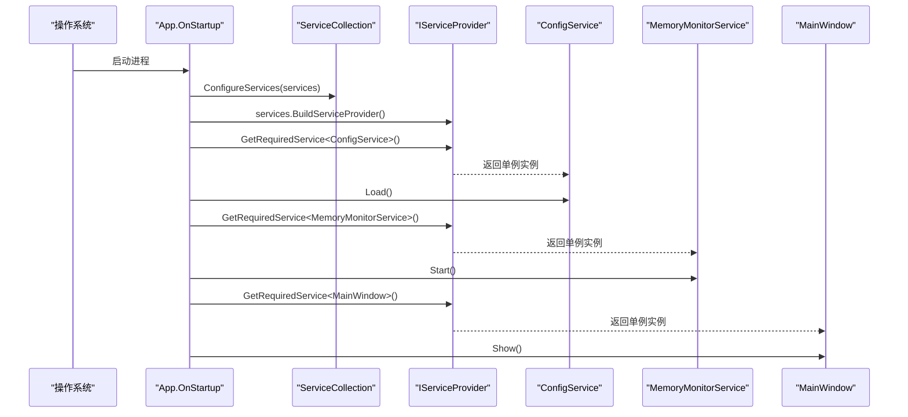
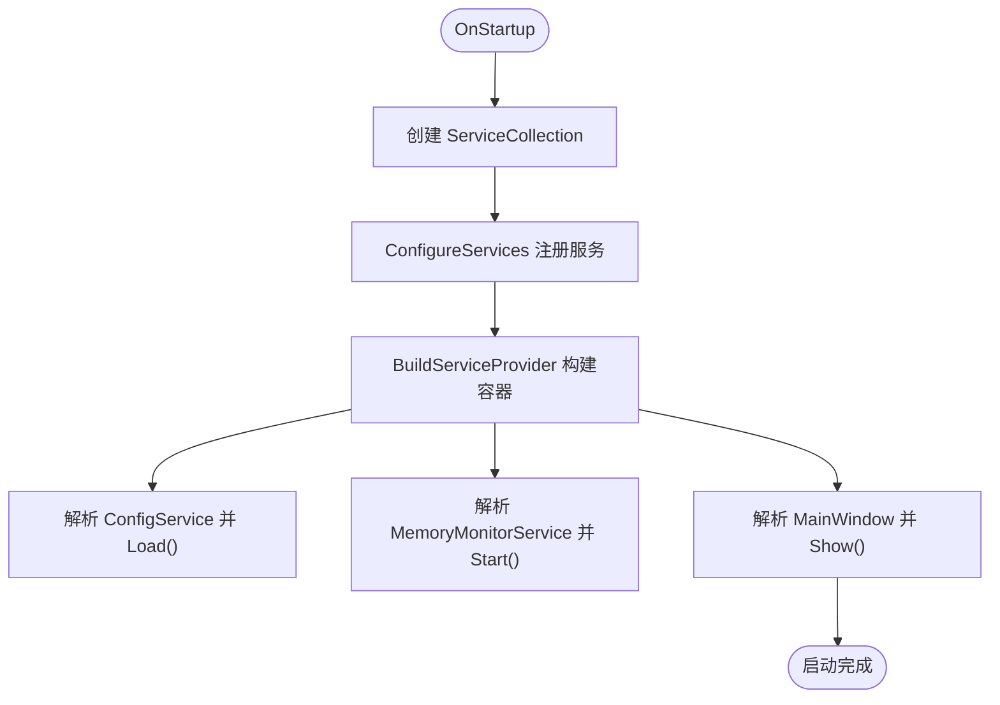
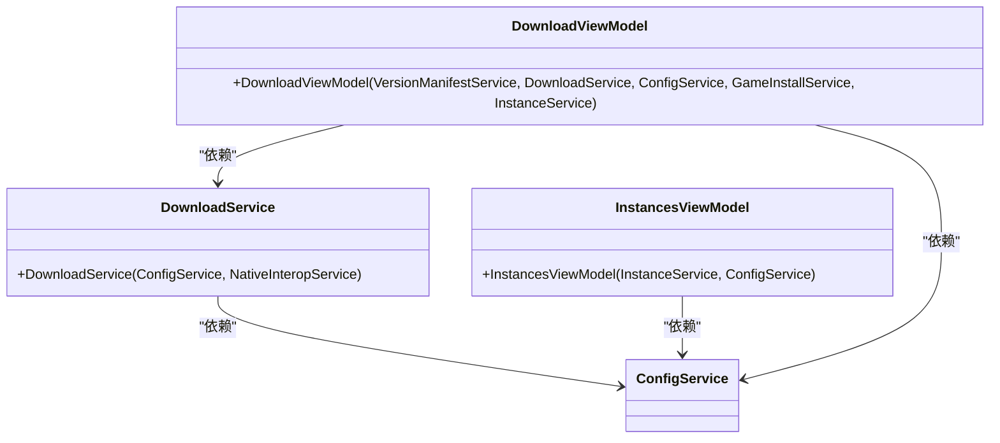
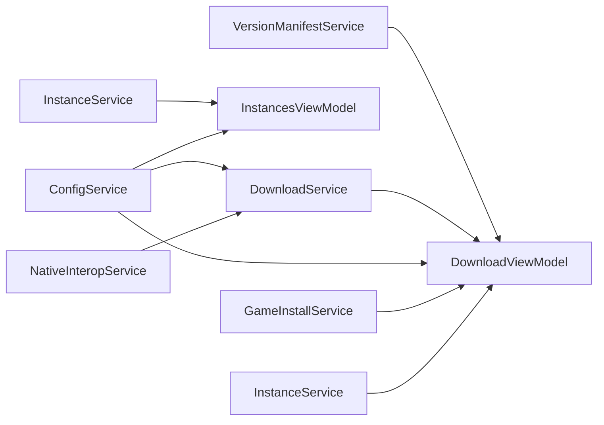

# 依赖注入容器

<cite>
**本文引用的文件**   
- [App.xaml.cs](file://src/FufuLauncher/App.xaml.cs)
- [FufuLauncher.csproj](file://src/FufuLauncher/FufuLauncher.csproj)
- [ConfigService.cs](file://src/FufuLauncher/Services/ConfigService.cs)
- [NetworkService.cs](file://src/FufuLauncher/Services/NetworkService.cs)
- [DownloadService.cs](file://src/FufuLauncher/Services/DownloadService.cs)
- [JavaScanService.cs](file://src/FufuLauncher/Services/JavaScanService.cs)
- [InstancesViewModel.cs](file://src/FufuLauncher/ViewModels/InstancesViewModel.cs)
- [DownloadViewModel.cs](file://src/FufuLauncher/ViewModels/DownloadViewModel.cs)
</cite>

## 目录
1. [简介](#简介)
2. [项目结构](#项目结构)
3. [核心组件](#核心组件)
4. [架构总览](#架构总览)
5. [详细组件分析](#详细组件分析)
6. [依赖关系分析](#依赖关系分析)
7. [性能与生命周期考量](#性能与生命周期考量)
8. [故障排查指南](#故障排查指南)
9. [结论](#结论)
10. [附录：最佳实践与示例路径](#附录最佳实践与示例路径)

## 简介
本文件面向“可爱的芙芙启动器”的依赖注入（DI）容器，围绕 Microsoft.Extensions.DependencyInjection 的使用、服务注册策略、生命周期管理、依赖解析流程、构造函数注入与运行时获取实例、扩展与自定义服务开发、以及应用启动时的 DI 初始化流程进行系统化说明。文档以仓库实际代码为依据，提供可追溯的文件来源与图示，帮助读者快速理解并正确使用 DI 容器。

## 项目结构
- 应用入口位于 WPF 应用的 App.xaml.cs，负责创建 ServiceCollection、注册全部服务、构建 IServiceProvider，并在 OnStartup 中按序完成配置加载、服务启动与主窗口显示。
- 所有业务服务集中在 Services 目录，视图模型在 ViewModels 目录，页面在 Views 目录。
- 通过 csproj 引用 Microsoft.Extensions.DependencyInjection 包，启用 DI 能力。

**图表来源** 
- [App.xaml.cs:138-217](file://src/FufuLauncher/App.xaml.cs#L138-L217)
- [FufuLauncher.csproj:44-46](file://src/FufuLauncher/FufuLauncher.csproj#L44-L46)

**章节来源**
- [App.xaml.cs:138-217](file://src/FufuLauncher/App.xaml.cs#L138-L217)
- [FufuLauncher.csproj:44-46](file://src/FufuLauncher/FufuLauncher.csproj#L44-L46)

## 核心组件
- 容器与入口
  - ServiceCollection：集中注册所有服务与视图模型、页面。
  - BuildServiceProvider：构建只读容器，供全局静态 Services 属性使用。
- 关键服务
  - ConfigService：配置读取与持久化，单例。
  - NetworkService：网络连通性检测，单例。
  - DownloadService：多线程分片断点续传下载，单例。
  - JavaScanService：本机 Java 环境扫描，单例。
- 视图与视图模型
  - MainWindow：主窗口，单例。
  - 页面视图：HomePage、DownloadPage 等，瞬态。
  - 视图模型：MainViewModel、HomeViewModel、InstancesViewModel、DownloadViewModel 等，单例。

**章节来源**
- [App.xaml.cs:138-217](file://src/FufuLauncher/App.xaml.cs#L138-L217)
- [ConfigService.cs:81-147](file://src/FufuLauncher/Services/ConfigService.cs#L81-L147)
- [NetworkService.cs:18-94](file://src/FufuLauncher/Services/NetworkService.cs#L18-L94)
- [DownloadService.cs:56-114](file://src/FufuLauncher/Services/DownloadService.cs#L56-L114)
- [JavaScanService.cs:36-75](file://src/FufuLauncher/Services/JavaScanService.cs#L36-L75)

## 架构总览
下图展示了 DI 容器在应用启动时的初始化流程，以及服务之间的依赖关系与解析过程。

**图表来源** 
- [App.xaml.cs:138-156](file://src/FufuLauncher/App.xaml.cs#L138-L156)

**章节来源**
- [App.xaml.cs:138-156](file://src/FufuLauncher/App.xaml.cs#L138-L156)

## 详细组件分析

### 容器初始化与服务注册
- 在 App.OnStartup 中创建 ServiceCollection，调用 ConfigureServices 完成全部服务注册，然后 BuildServiceProvider 生成容器。
- 服务注册策略
  - AddSingleton：适用于无状态或共享资源的服务，如配置、网络、下载、扫描等。
  - AddTransient：适用于轻量、短生命周期的 UI 页面，每次导航新建实例。
  - 视图模型统一为单例，便于跨页面共享状态。
- 容器构建后，通过静态 Services 暴露 IServiceProvider，供后续按需解析。

**图表来源** 
- [App.xaml.cs:138-217](file://src/FufuLauncher/App.xaml.cs#L138-L217)

**章节来源**
- [App.xaml.cs:138-217](file://src/FufuLauncher/App.xaml.cs#L138-L217)

### 服务依赖与解析流程
- 构造函数注入：服务通过构造函数声明依赖，容器自动解析并注入。
- 典型示例
  - DownloadService 依赖 ConfigService 与 NativeInteropService。
  - InstancesViewModel 依赖 InstanceService 与 ConfigService。
  - DownloadViewModel 依赖 VersionManifestService、DownloadService、ConfigService、GameInstallService、InstanceService。
- 解析顺序：容器根据依赖图递归解析，确保依赖链完整；若缺少注册将抛出异常。

**图表来源** 
- [DownloadService.cs:99-114](file://src/FufuLauncher/Services/DownloadService.cs#L99-L114)
- [InstancesViewModel.cs:20-24](file://src/FufuLauncher/ViewModels/InstancesViewModel.cs#L20-L24)
- [DownloadViewModel.cs:66-76](file://src/FufuLauncher/ViewModels/DownloadViewModel.cs#L66-L76)

**章节来源**
- [DownloadService.cs:99-114](file://src/FufuLauncher/Services/DownloadService.cs#L99-L114)
- [InstancesViewModel.cs:20-24](file://src/FufuLauncher/ViewModels/InstancesViewModel.cs#L20-L24)
- [DownloadViewModel.cs:66-76](file://src/FufuLauncher/ViewModels/DownloadViewModel.cs#L66-L76)

### 生命周期管理与选择原则
- 单例（AddSingleton）
  - 适用场景：配置、网络、下载、扫描、内存监控、主窗口、视图模型等需要全局共享或昂贵初始化的对象。
  - 优点：减少重复创建开销，保证状态一致性。
  - 注意：避免持有非线程安全的瞬时状态；必要时自行同步。
- 瞬态（AddTransient）
  - 适用场景：UI 页面（HomePage、DownloadPage 等），每次导航新建，避免跨页面状态污染。
  - 优点：隔离性强，易于测试。
  - 注意：频繁创建可能带来 GC 压力，但页面通常轻量。
- 作用域（AddScoped）
  - 当前代码未使用；如需请求级上下文（例如 HTTP 请求、事务），可在 Web 场景中引入。WPF 桌面应用中一般不需要。

**章节来源**
- [App.xaml.cs:170-217](file://src/FufuLauncher/App.xaml.cs#L170-L217)

### 运行时获取服务实例
- 全局静态 Services：在 App.Services 中保存 IServiceProvider，用于在应用任意位置解析服务。
- 常用方式
  - GetRequiredService<T>()：强类型解析，缺失时抛异常。
  - GetService<T>()：弱类型解析，缺失时返回 null。
- 示例路径
  - 在 OnStartup 中解析 ConfigService、MemoryMonitorService、MainWindow。

**章节来源**
- [App.xaml.cs:144-156](file://src/FufuLauncher/App.xaml.cs#L144-L156)

### 服务扩展与自定义服务开发指南
- 新增服务步骤
  1. 在 Services 目录创建新类，实现所需接口或功能。
  2. 在 ConfigureServices 中使用 AddSingleton/AddTransient 注册。
  3. 在需要的地方通过构造函数注入或 Services.GetRequiredService<T>() 获取。
- 注意事项
  - 明确生命周期：无状态且共享用单例；UI 页面用瞬态。
  - 避免循环依赖：重构设计或使用工厂/延迟解析。
  - 资源释放：实现 IDisposable 并在退出时释放（如定时器、句柄）。

**章节来源**
- [App.xaml.cs:170-217](file://src/FufuLauncher/App.xaml.cs#L170-L217)

### 具体代码示例（路径引用）
- 注册服务
  - [App.xaml.cs:170-217](file://src/FufuLauncher/App.xaml.cs#L170-L217)
- 构造函数注入
  - [DownloadService.cs:99-114](file://src/FufuLauncher/Services/DownloadService.cs#L99-L114)
  - [InstancesViewModel.cs:20-24](file://src/FufuLauncher/ViewModels/InstancesViewModel.cs#L20-L24)
  - [DownloadViewModel.cs:66-76](file://src/FufuLauncher/ViewModels/DownloadViewModel.cs#L66-L76)
- 运行时解析
  - [App.xaml.cs:144-156](file://src/FufuLauncher/App.xaml.cs#L144-L156)

## 依赖关系分析
- 服务间依赖
  - DownloadService 依赖 ConfigService、NativeInteropService。
  - DownloadViewModel 依赖多个服务，体现复杂业务流程的组合。
  - InstancesViewModel 依赖 InstanceService、ConfigService。
- 耦合与内聚
  - 服务职责清晰，内聚度高；通过构造函数注入降低耦合。
- 外部依赖
  - Microsoft.Extensions.DependencyInjection 提供容器能力。
  - 系统 API（文件系统、网络、注册表）由服务封装。

**图表来源** 
- [DownloadService.cs:99-114](file://src/FufuLauncher/Services/DownloadService.cs#L99-L114)
- [InstancesViewModel.cs:20-24](file://src/FufuLauncher/ViewModels/InstancesViewModel.cs#L20-L24)
- [DownloadViewModel.cs:66-76](file://src/FufuLauncher/ViewModels/DownloadViewModel.cs#L66-L76)

**章节来源**
- [DownloadService.cs:99-114](file://src/FufuLauncher/Services/DownloadService.cs#L99-L114)
- [InstancesViewModel.cs:20-24](file://src/FufuLauncher/ViewModels/InstancesViewModel.cs#L20-L24)
- [DownloadViewModel.cs:66-76](file://src/FufuLauncher/ViewModels/DownloadViewModel.cs#L66-L76)

## 性能与生命周期考量
- 单例服务
  - 适合重初始化成本高的服务（如 HttpClient、扫描器、下载器）。
  - 注意并发安全：下载器内部已使用信号量与锁控制并发。
- 瞬态页面
  - 轻量 UI 页面按需创建，避免内存泄漏与状态污染。
- 事件与回调
  - 下载服务通过事件上报进度，UI 层订阅更新，避免轮询开销。
- 资源释放
  - 应用退出时停止定时器、释放背景资源，确保干净退出。

[本节为通用指导，不直接分析具体文件]

## 故障排查指南
- 常见问题
  - 解析失败：检查服务是否注册、依赖是否完整。
  - 循环依赖：重构设计，避免 A 依赖 B、B 依赖 A。
  - 生命周期误用：页面不应单例，避免跨页面状态污染。
- 定位方法
  - 查看 App.Services 是否正确构建。
  - 在 ConfigureServices 中逐步注释注册项，定位问题服务。
  - 使用日志输出（App.WriteAppLog）记录关键路径。

**章节来源**
- [App.xaml.cs:138-217](file://src/FufuLauncher/App.xaml.cs#L138-L217)

## 结论
本项目的 DI 容器基于 Microsoft.Extensions.DependencyInjection，采用清晰的单例与瞬态策略，配合构造函数注入与运行时解析，实现了高内聚、低耦合的服务架构。通过统一的注册与构建流程，确保了启动期配置加载、服务启动与 UI 创建的有序执行。遵循本文的生命周期选择原则与扩展指南，可高效地添加与维护服务，提升系统的可测试性与可维护性。

[本节为总结，不直接分析具体文件]

## 附录：最佳实践与示例路径
- 注册服务
  - [App.xaml.cs:170-217](file://src/FufuLauncher/App.xaml.cs#L170-L217)
- 构造函数注入
  - [DownloadService.cs:99-114](file://src/FufuLauncher/Services/DownloadService.cs#L99-L114)
  - [InstancesViewModel.cs:20-24](file://src/FufuLauncher/ViewModels/InstancesViewModel.cs#L20-L24)
  - [DownloadViewModel.cs:66-76](file://src/FufuLauncher/ViewModels/DownloadViewModel.cs#L66-L76)
- 运行时解析
  - [App.xaml.cs:144-156](file://src/FufuLauncher/App.xaml.cs#L144-L156)
- 包引用
  - [FufuLauncher.csproj:44-46](file://src/FufuLauncher/FufuLauncher.csproj#L44-L46)