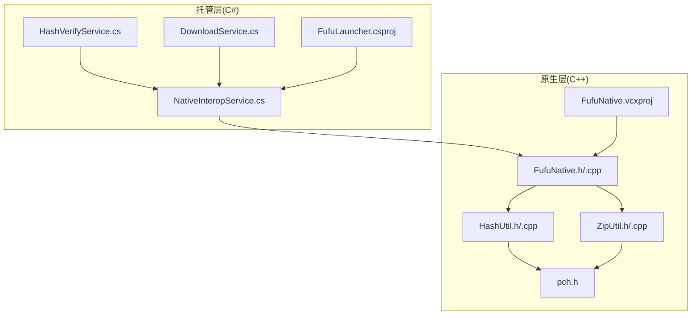
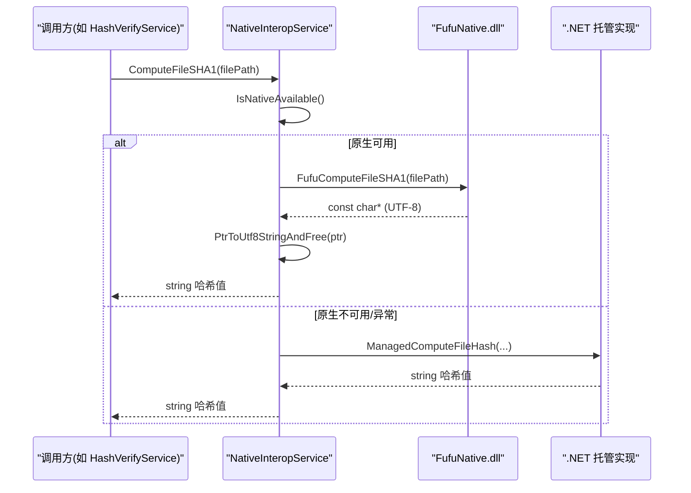
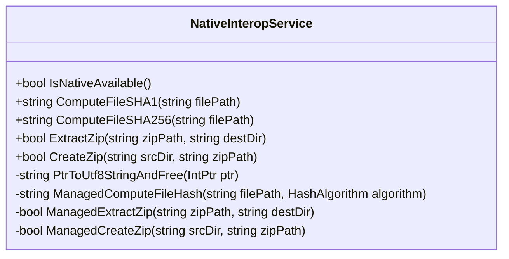
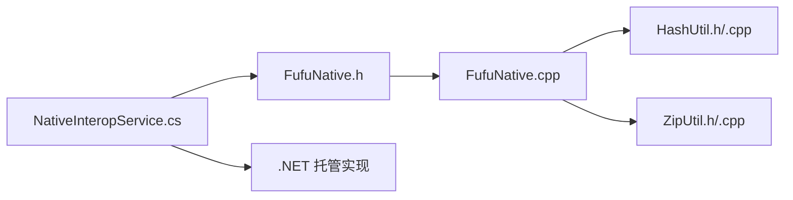

# 原生组件集成

<cite>
**本文引用的文件**   
- [FufuNative.h](file://native/FufuNative/FufuNative.h)
- [FufuNative.cpp](file://native/FufuNative/FufuNative.cpp)
- [HashUtil.h](file://native/FufuNative/HashUtil.h)
- [HashUtil.cpp](file://native/FufuNative/HashUtil.cpp)
- [ZipUtil.h](file://native/FufuNative/ZipUtil.h)
- [ZipUtil.cpp](file://native/FufuNative/ZipUtil.cpp)
- [pch.h](file://native/FufuNative/pch.h)
- [FufuNative.vcxproj](file://native/FufuNative/FufuNative.vcxproj)
- [NativeInteropService.cs](file://src/FufuLauncher/Services/NativeInteropService.cs)
- [FufuLauncher.csproj](file://src/FufuLauncher/FufuLauncher.csproj)
- [HashVerifyService.cs](file://src/FufuLauncher/Services/HashVerifyService.cs)
- [DownloadService.cs](file://src/FufuLauncher/Services/DownloadService.cs)
</cite>

## 目录
1. [简介](#简介)
2. [项目结构](#项目结构)
3. [核心组件](#核心组件)
4. [架构总览](#架构总览)
5. [详细组件分析](#详细组件分析)
6. [依赖关系分析](#依赖关系分析)
7. [性能考量](#性能考量)
8. [故障排查指南](#故障排查指南)
9. [结论](#结论)
10. [附录：API 使用示例与最佳实践](#附录api-使用示例与最佳实践)

## 简介
本文件面向“可爱的芙芙启动器”的原生组件集成，系统性说明 C# 与 C++ 的互操作机制、P/Invoke 接口设计与实现、FufuNative 模块（文件哈希计算、ZIP 解压/打包）的功能与边界、内存管理策略、跨平台兼容性与编译配置、性能优化技巧与调试方法，并给出在 C# 中调用原生函数的具体使用示例与错误处理/异常转换机制。

## 项目结构
- 原生层（C++ DLL）
  - FufuNative.h/.cpp：导出 P/Invoke 接口，封装 HashUtil 与 ZipUtil
  - HashUtil.h/.cpp：基于 Windows BCrypt API 的高性能 SHA1/SHA256 文件哈希
  - ZipUtil.h/.cpp：基于 Windows Shell COM 的 ZIP 解压与打包
  - pch.h：预编译头，统一包含常用 Windows SDK 头
  - FufuNative.vcxproj：VS 工程，定义 Debug/Release、x64/Win32、C++20、预编译头等
- 托管层（C#）
  - NativeInteropService.cs：P/Invoke 声明、自动回退到纯 .NET 实现、内存释放桥接
  - FufuLauncher.csproj：目标框架 net8.0-windows、PlatformTarget x64、RuntimeIdentifier win-x64、复制原生 DLL 到输出目录
  - 服务层（如 HashVerifyService.cs、DownloadService.cs）通过依赖注入使用 NativeInteropService

图表来源
- [FufuLauncher.csproj:1-49](file://src/FufuLauncher/FufuLauncher.csproj#L1-L49)
- [FufuNative.vcxproj:1-160](file://native/FufuNative/FufuNative.vcxproj#L1-L160)
- [NativeInteropService.cs:1-214](file://src/FufuLauncher/Services/NativeInteropService.cs#L1-L214)
- [FufuNative.h:1-53](file://native/FufuNative/FufuNative.h#L1-L53)
- [HashUtil.h:1-23](file://native/FufuNative/HashUtil.h#L1-L23)
- [ZipUtil.h:1-29](file://native/FufuNative/ZipUtil.h#L1-L29)

章节来源
- [FufuLauncher.csproj:1-49](file://src/FufuLauncher/FufuLauncher.csproj#L1-L49)
- [FufuNative.vcxproj:1-160](file://native/FufuNative/FufuNative.vcxproj#L1-L160)

## 核心组件
- FufuNative 导出接口
  - 文件哈希：FufuComputeFileSHA1、FufuComputeFileSHA256
  - 字符串释放：FufuFreeString
  - ZIP 操作：FufuExtractZip、FufuExtractZipWithProgress、FufuCreateZip
  - 版本查询：FufuGetVersion
- 托管封装 NativeInteropService
  - P/Invoke 声明与调用约定（cdecl）、UTF-8 字符串编解码
  - 原生可用性探测与缓存
  - 失败时自动回退到纯 .NET 实现（SHA1/SHA256、ZIP 解压/打包）
  - 统一的托管/非托管内存桥接（PtrToUtf8StringAndFree）
- 工具类
  - HashUtil：BCrypt 流式分块哈希，避免大文件内存峰值
  - ZipUtil：Shell COM 解压/打包，支持进度回调（异步完成回调）

章节来源
- [FufuNative.h:19-48](file://native/FufuNative/FufuNative.h#L19-L48)
- [FufuNative.cpp:30-75](file://native/FufuNative/FufuNative.cpp#L30-L75)
- [HashUtil.h:9-22](file://native/FufuNative/HashUtil.h#L9-L22)
- [ZipUtil.h:11-21](file://native/FufuNative/ZipUtil.h#L11-L21)
- [NativeInteropService.cs:27-157](file://src/FufuLauncher/Services/NativeInteropService.cs#L27-L157)

## 架构总览
C# 通过 P/Invoke 调用 FufuNative.dll 中的 C++ 函数；若 DLL 不可用或调用失败，则自动降级为托管实现，保证功能等价与运行鲁棒性。

图表来源
- [NativeInteropService.cs:38-73](file://src/FufuLauncher/Services/NativeInteropService.cs#L38-L73)
- [FufuNative.h:22-25](file://native/FufuNative/FufuNative.h#L22-L25)
- [FufuNative.cpp:30-44](file://native/FufuNative/FufuNative.cpp#L30-L44)

## 详细组件分析

### P/Invoke 接口设计与实现
- 调用约定与编码
  - CallingConvention.Cdecl：C# 侧显式指定
  - UTF-8 字符串：C# 使用 [MarshalAs(UnmanagedType.LPUTF8Str)]，C++ 返回由 AllocCString 分配的 const char*，需调用 FufuFreeString 释放
- 导出函数清单
  - 哈希：FufuComputeFileSHA1、FufuComputeFileSHA256
  - 释放：FufuFreeString
  - ZIP：FufuExtractZip、FufuExtractZipWithProgress、FufuCreateZip
  - 版本：FufuGetVersion

章节来源
- [FufuNative.h:19-48](file://native/FufuNative/FufuNative.h#L19-L48)
- [FufuNative.cpp:21-75](file://native/FufuNative/FufuNative.cpp#L21-L75)

### 文件哈希计算（HashUtil）
- 算法与实现
  - 使用 Windows BCrypt API 打开算法提供者、创建哈希对象、分块读取（1MB 缓冲）流式计算，最后 FinishHash 得到结果
  - ToHexLower 将字节数组转为小写十六进制字符串
- 复杂度与内存
  - 时间复杂度 O(N)，N 为文件大小
  - 空间复杂度 O(1)（固定缓冲区），避免大文件一次性加载
- 错误处理
  - 文件句柄获取失败、算法初始化失败、读文件失败等路径均返回空串

章节来源
- [HashUtil.h:9-22](file://native/FufuNative/HashUtil.h#L9-L22)
- [HashUtil.cpp:34-113](file://native/FufuNative/HashUtil.cpp#L34-L113)

### ZIP 解压与打包（ZipUtil）
- 解压流程
  - 使用 Shell.Application COM 接口 NameSpace/CopyHere 进行解压
  - 确保目标目录存在，规范化路径，设置静默标志位
  - 提供 ExtractZipWithProgress 回调（当前为一次“完成”回调）
- 打包流程
  - 先写入最小合法 ZIP 头（EOCD），再通过 Shell CopyHere 将源目录内容复制到 ZIP
- 错误码
  - 解压/打包过程中对关键步骤返回不同错误码（如无法创建目录、COM 初始化失败、NameSpace 失败、CopyHere 失败等）

章节来源
- [ZipUtil.h:11-21](file://native/FufuNative/ZipUtil.h#L11-L21)
- [ZipUtil.cpp:57-200](file://native/FufuNative/ZipUtil.cpp#L57-L200)
- [ZipUtil.cpp:203-300](file://native/FufuNative/ZipUtil.cpp#L203-L300)

### 托管封装与回退策略（NativeInteropService）
- P/Invoke 声明
  - 使用 DllImport 声明 FufuComputeFileSHA1/SHA256、FufuExtractZip、FufuCreateZip、FufuFreeString
  - 参数采用 LPUTF8Str 编解码，返回值 IntPtr 指向 UTF-8 字符串
- 原生可用性探测
  - IsNativeAvailable 首次调用尝试执行一个轻量函数，成功则缓存可用状态
- 异常捕获与回退
  - 捕获 DllNotFoundException、EntryPointNotFoundException、BadImageFormatException 后标记不可用并回退到托管实现
- 内存管理
  - PtrToUtf8StringAndFree 负责从 IntPtr 拷贝 UTF-8 字节并调用 FufuFreeString 释放
- 托管实现
  - ManagedComputeFileHash：使用 System.Security.Cryptography 计算哈希
  - ManagedExtractZip/CreateZip：使用 System.IO.Compression.ZipFile

图表来源
- [NativeInteropService.cs:20-214](file://src/FufuLauncher/Services/NativeInteropService.cs#L20-L214)

章节来源
- [NativeInteropService.cs:27-157](file://src/FufuLauncher/Services/NativeInteropService.cs#L27-L157)
- [NativeInteropService.cs:159-212](file://src/FufuLauncher/Services/NativeInteropService.cs#L159-L212)

### 跨平台兼容性与编译配置
- 目标平台
  - C# 项目 TargetFramework=net8.0-windows，PlatformTarget=x64，RuntimeIdentifier=win-x64
  - C++ 项目支持 Win32/x64、Debug/Release，语言标准 C++20，启用预编译头
- 原生 DLL 部署
  - csproj 中将 native\FufuNative\$(Platform)\$(Configuration)\FufuNative.dll 复制到输出目录 runtimes\win-x64\native\
- 兼容性策略
  - 若缺失 DLL 或架构不匹配（BadImageFormatException），自动回退到托管实现，保证在无原生库环境下仍可运行

章节来源
- [FufuLauncher.csproj:1-49](file://src/FufuLauncher/FufuLauncher.csproj#L1-L49)
- [FufuNative.vcxproj:1-160](file://native/FufuNative/FufuNative.vcxproj#L1-L160)

## 依赖关系分析
- 组件耦合
  - FufuNative.cpp 依赖 HashUtil、ZipUtil
  - NativeInteropService 依赖 FufuNative.dll 的导出函数，同时内嵌托管实现作为回退
- 外部依赖
  - 原生层依赖 Windows SDK（BCrypt、Shell COM）
  - 托管层依赖 .NET 基础库（System.IO.Compression、System.Security.Cryptography）

图表来源
- [FufuNative.h:1-53](file://native/FufuNative/FufuNative.h#L1-L53)
- [FufuNative.cpp:1-78](file://native/FufuNative/FufuNative.cpp#L1-L78)
- [NativeInteropService.cs:1-214](file://src/FufuLauncher/Services/NativeInteropService.cs#L1-L214)

章节来源
- [FufuNative.h:1-53](file://native/FufuNative/FufuNative.h#L1-L53)
- [FufuNative.cpp:1-78](file://native/FufuNative/FufuNative.cpp#L1-L78)
- [NativeInteropService.cs:1-214](file://src/FufuLauncher/Services/NativeInteropService.cs#L1-L214)

## 性能考量
- 哈希计算
  - 原生 BCrypt 流式分块（1MB）降低内存占用，提升大文件吞吐
  - 托管实现使用 .NET 内置哈希，性能略逊但可接受
- ZIP 操作
  - 原生 Shell COM 解压/打包无需第三方库，适合快速集成；注意异步特性导致进度回调仅一次完成通知
  - 托管 ZipFile.ExtractToDirectory/CreateFromDirectory 作为可靠回退
- 探测与缓存
  - IsNativeAvailable 首次探测后缓存结果，避免重复开销
- I/O 与线程
  - 下载服务已做并发控制与节流，建议保持 IO 与 UI 分离，避免阻塞主线程

[本节为通用指导，不直接分析具体文件]

## 故障排查指南
- 常见问题
  - 找不到 DLL（DllNotFoundException）：检查 FufuNative.dll 是否位于 runtimes\win-x64\native\ 且与进程架构一致
  - 入口点未找到（EntryPointNotFoundException）：确认导出的函数名与签名一致
  - 架构不匹配（BadImageFormatException）：确保 C# 与 C++ 同为 x64
- 诊断步骤
  - 使用 IsNativeAvailable 判断原生可用性
  - 查看 NativeInteropService 中异常捕获分支，确认是否触发回退
  - 检查 ZIP 解压/打包的错误码（ZipUtil 内部返回码）
- 日志与调试
  - 建议在调用前后记录输入参数与返回值
  - 对于 ZIP 回调，可在回调中记录文件名与进度信息

章节来源
- [NativeInteropService.cs:48-73](file://src/FufuLauncher/Services/NativeInteropService.cs#L48-L73)
- [NativeInteropService.cs:95-118](file://src/FufuLauncher/Services/NativeInteropService.cs#L95-L118)
- [ZipUtil.cpp:57-200](file://native/FufuNative/ZipUtil.cpp#L57-L200)

## 结论
本项目通过 C++ 原生 DLL 提供高性能的文件哈希与 ZIP 操作，并在 C# 层以 P/Invoke 封装与自动回退策略保障鲁棒性。原生层利用 Windows 系统能力（BCrypt、Shell COM）实现高效处理，托管层提供等价实现以确保无原生环境下的可用性。整体设计清晰、扩展性强，便于后续增加更多高性能原生能力。

[本节为总结，不直接分析具体文件]

## 附录：API 使用示例与最佳实践

### 在 C# 中使用 NativeInteropService
- 依赖注入注册
  - App.xaml.cs 中单例注册 NativeInteropService
- 典型用法
  - 哈希校验：HashVerifyService 调用 ComputeFileSHA1 进行文件完整性校验
  - 下载与解压：DownloadService 在需要时使用 ExtractZip/CreateZip

章节来源
- [App.xaml.cs:190](file://src/FufuLauncher/App.xaml.cs#L190)
- [HashVerifyService.cs:34-70](file://src/FufuLauncher/Services/HashVerifyService.cs#L34-L70)
- [DownloadService.cs:99-114](file://src/FufuLauncher/Services/DownloadService.cs#L99-L114)

### 调用约定与内存管理要点
- 调用约定
  - 所有 P/Invoke 使用 CallingConvention.Cdecl
- 字符串编码
  - 入参使用 LPUTF8Str，出参为 UTF-8 const char*，必须调用 FufuFreeString 释放
- 异常处理
  - 捕获 DllNotFoundException/EntryPointNotFoundException/BadImageFormatException 后切换托管实现

章节来源
- [FufuNative.h:4-6](file://native/FufuNative/FufuNative.h#L4-L6)
- [FufuNative.cpp:21-50](file://native/FufuNative/FufuNative.cpp#L21-L50)
- [NativeInteropService.cs:28-35](file://src/FufuLauncher/Services/NativeInteropService.cs#L28-L35)
- [NativeInteropService.cs:124-140](file://src/FufuLauncher/Services/NativeInteropService.cs#L124-L140)

### 错误码与返回值约定
- 哈希函数
  - 成功返回 UTF-8 十六进制字符串指针，失败返回 nullptr
- ZIP 函数
  - 成功返回 0，失败返回非 0 错误码（详见 ZipUtil 内部逻辑）

章节来源
- [FufuNative.h:22-45](file://native/FufuNative/FufuNative.h#L22-L45)
- [FufuNative.cpp:52-71](file://native/FufuNative/FufuNative.cpp#L52-L71)
- [ZipUtil.cpp:57-200](file://native/FufuNative/ZipUtil.cpp#L57-L200)

### 构建与部署清单
- 原生 DLL
  - 使用 VS2022 构建 native\FufuNative\FufuNative.vcxproj，生成 FufuNative.dll
- 托管项目
  - 确保 FufuLauncher.csproj 正确复制 DLL 到 runtimes\win-x64\native\
  - 目标框架与平台保持一致（net8.0-windows、x64）

章节来源
- [FufuNative.vcxproj:1-160](file://native/FufuNative/FufuNative.vcxproj#L1-L160)
- [FufuLauncher.csproj:34-42](file://src/FufuLauncher/FufuLauncher.csproj#L34-L42)