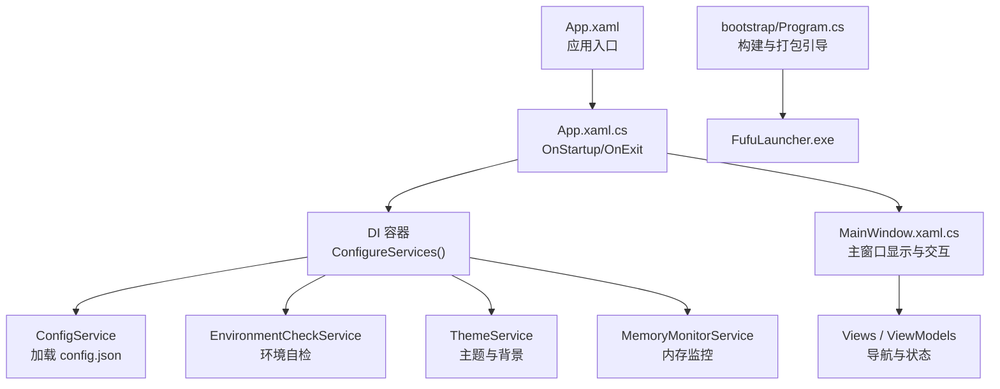
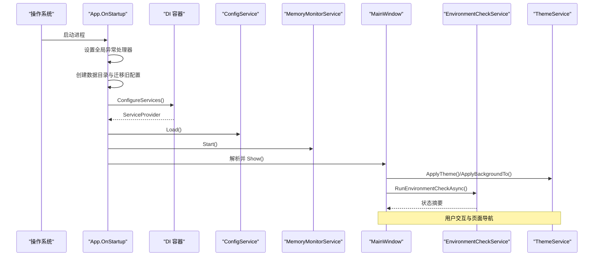
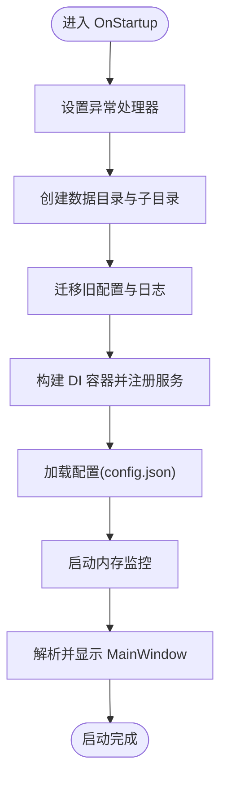
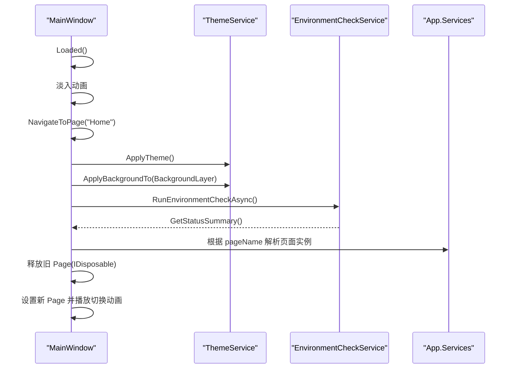
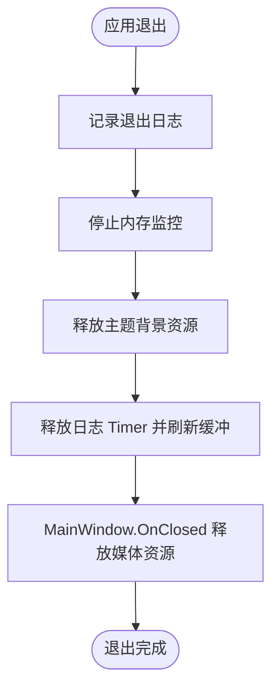
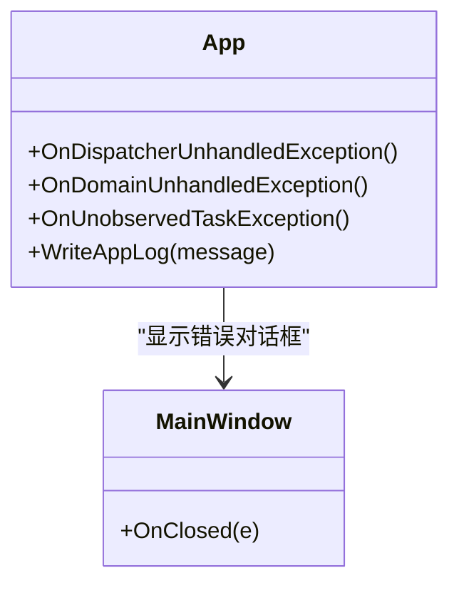
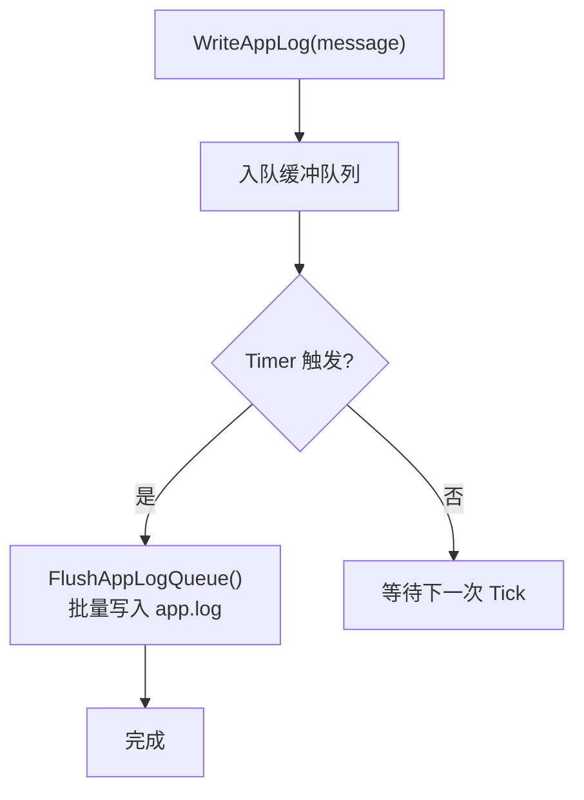
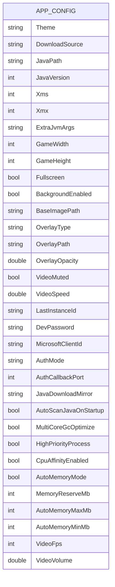
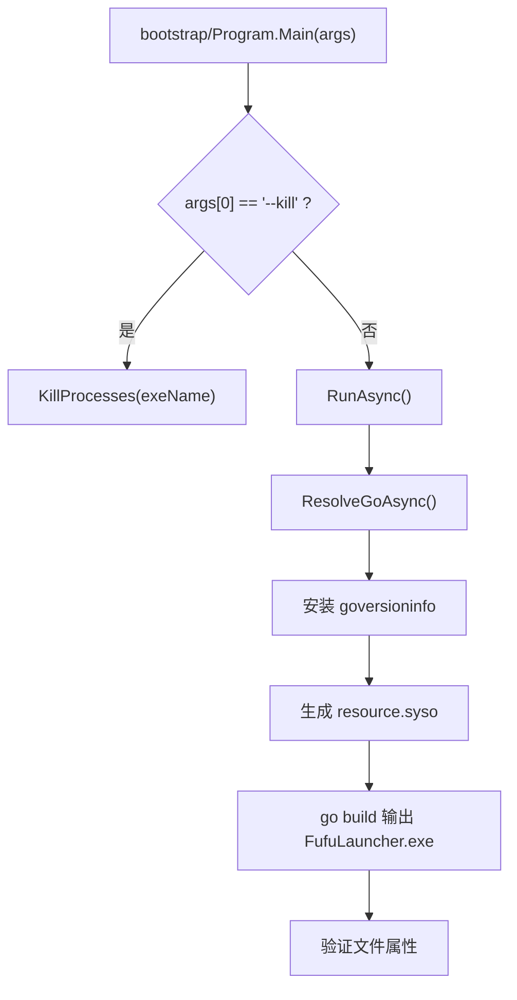
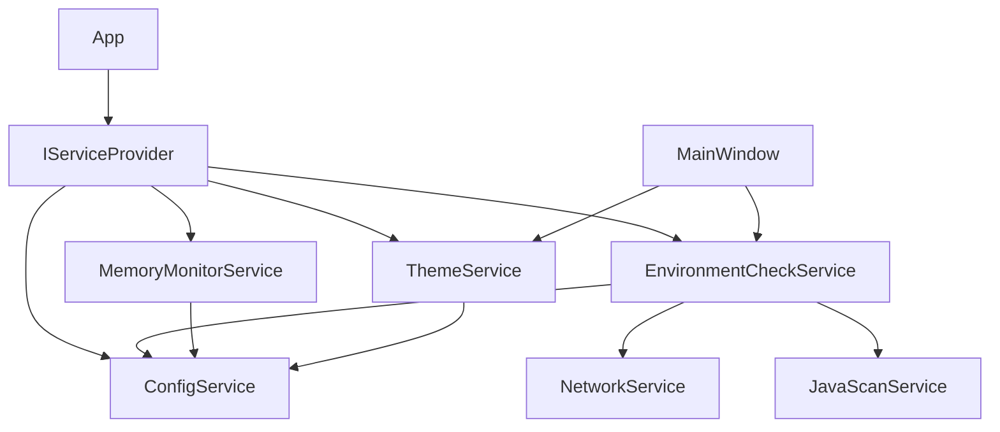

# 应用程序生命周期

<cite>
**本文引用的文件**   
- [App.xaml.cs](file://src/FufuLauncher/App.xaml.cs)
- [App.xaml](file://src/FufuLauncher/App.xaml)
- [MainWindow.xaml.cs](file://src/FufuLauncher/MainWindow.xaml.cs)
- [ConfigService.cs](file://src/FufuLauncher/Services/ConfigService.cs)
- [EnvironmentCheckService.cs](file://src/FufuLauncher/Services/EnvironmentCheckService.cs)
- [MemoryMonitorService.cs](file://src/FufuLauncher/Services/MemoryMonitorService.cs)
- [ThemeService.cs](file://src/FufuLauncher/Services/ThemeService.cs)
- [NetworkService.cs](file://src/FufuLauncher/Services/NetworkService.cs)
- [MainViewModel.cs](file://src/FufuLauncher/ViewModels/MainViewModel.cs)
- [config.json](file://Start/appmcGAME/config.json)
- [Program.cs](file://bootstrap/Program.cs)
- [README.md](file://README.md)
</cite>

## 目录
1. [简介](#简介)
2. [项目结构](#项目结构)
3. [核心组件](#核心组件)
4. [架构总览](#架构总览)
5. [详细组件分析](#详细组件分析)
6. [依赖关系分析](#依赖关系分析)
7. [性能考量](#性能考量)
8. [故障排查指南](#故障排查指南)
9. [结论](#结论)
10. [附录](#附录)

## 简介
本文件为“可爱的芙芙”启动器的应用程序生命周期文档，覆盖从进程启动到主窗口显示、环境自检、DI 容器初始化与服务注册、日志系统、全局异常处理、关闭与资源清理、状态管理与持久化、以及启动参数与环境变量的使用说明。目标是帮助开发者与维护者快速理解并可靠地扩展该启动器。

## 项目结构
- WPF 应用入口位于 src/FufuLauncher，包含 App（应用生命周期）、MainWindow（主窗口）、Views（页面）、ViewModels（视图模型）与 Services（业务服务）。
- 配置与数据目录在运行时动态创建：
  - 游戏数据目录：{exe 目录}\appmcGAME
  - 启动器配置目录：{exe 目录}\appmcGAME\Start\AppData\Roaming\FufuLauncher
- 构建与打包由 bootstrap 引导程序负责，用于生成可执行文件及嵌入版本信息。

**图表来源** 
- [App.xaml.cs:82-156](file://src/FufuLauncher/App.xaml.cs#L82-L156)
- [App.xaml:1-13](file://src/FufuLauncher/App.xaml#L1-L13)
- [MainWindow.xaml.cs:38-73](file://src/FufuLauncher/MainWindow.xaml.cs#L38-L73)
- [Program.cs:64-186](file://bootstrap/Program.cs#L64-L186)

**章节来源**
- [App.xaml.cs:82-156](file://src/FufuLauncher/App.xaml.cs#L82-L156)
- [App.xaml:1-13](file://src/FufuLauncher/App.xaml#L1-L13)
- [README.md:27-33](file://README.md#L27-L33)

## 核心组件
- 应用入口与生命周期管理：App.xaml.cs
  - 定义双数据目录、日志缓冲与批量写入、全局异常捕获、DI 容器构建、服务注册、主窗口创建与显示、退出时资源释放。
- 主窗口与 UI 流程：MainWindow.xaml.cs
  - 窗口淡入动画、默认导航至主页、主题与背景应用、环境自检异步执行、页面切换与资源释放。
- 配置与持久化：ConfigService.cs
  - 读取/保存 config.json，支持旧配置迁移与双层背景结构兼容。
- 环境自检：EnvironmentCheckService.cs
  - .NET 运行时、操作系统架构、磁盘空间、网络连通、Java 扫描（受配置控制）。
- 内存监控与智能分配：MemoryMonitorService.cs
  - 定时刷新内存快照、智能计算 Xmx/Xms、多核 GC 优化参数。
- 主题与背景：ThemeService.cs
  - 主题切换、图片/视频背景应用、透明度与蒙版同步、资源释放与暂停/恢复。
- 网络检测：NetworkService.cs
  - 探测 Mojang 官方源与 BMCLAPI 镜像源的连通性与延迟。
- 主视图模型：MainViewModel.cs
  - 提供版本号等只读属性，供 UI 绑定展示。

**章节来源**
- [App.xaml.cs:170-217](file://src/FufuLauncher/App.xaml.cs#L170-L217)
- [MainWindow.xaml.cs:38-73](file://src/FufuLauncher/MainWindow.xaml.cs#L38-L73)
- [ConfigService.cs:94-148](file://src/FufuLauncher/Services/ConfigService.cs#L94-L148)
- [EnvironmentCheckService.cs:52-73](file://src/FufuLauncher/Services/EnvironmentCheckService.cs#L52-L73)
- [MemoryMonitorService.cs:61-88](file://src/FufuLauncher/Services/MemoryMonitorService.cs#L61-L88)
- [ThemeService.cs:30-52](file://src/FufuLauncher/Services/ThemeService.cs#L30-L52)
- [NetworkService.cs:34-76](file://src/FufuLauncher/Services/NetworkService.cs#L34-L76)
- [MainViewModel.cs:14-21](file://src/FufuLauncher/ViewModels/MainViewModel.cs#L14-L21)

## 架构总览
启动器采用 WPF + MVVM + DI 的架构模式。App 在 OnStartup 中完成目录准备、配置加载、服务注册与主窗口创建；MainWindow 在 Loaded 事件中触发环境自检与主题应用；各 Service 通过 DI 注入到 ViewModel 或 View 中使用。

**图表来源** 
- [App.xaml.cs:82-156](file://src/FufuLauncher/App.xaml.cs#L82-L156)
- [MainWindow.xaml.cs:38-73](file://src/FufuLauncher/MainWindow.xaml.cs#L38-L73)

## 详细组件分析

### 应用启动流程（OnStartup）
- 设置全局异常处理器（UI 线程、域级、Task 未观察异常）。
- 初始化双数据目录（GameDataDir、ConfigDir），创建子目录结构，执行旧配置与日志迁移。
- 构建 DI 容器并注册全部服务（单例/瞬态），加载配置。
- 启动内存监控定时器。
- 手动解析 MainWindow（需要 DI 注入），Show 显示主窗口。

**图表来源** 
- [App.xaml.cs:82-156](file://src/FufuLauncher/App.xaml.cs#L82-L156)

**章节来源**
- [App.xaml.cs:82-156](file://src/FufuLauncher/App.xaml.cs#L82-L156)

### 主窗口创建与显示（MainWindow）
- Loaded 事件触发：
  - 淡入动画提升用户体验。
  - 默认导航到 Home 页面。
  - 应用主题与背景（图片/视频），订阅 BackgroundChanged 事件。
  - 异步执行环境自检，更新状态栏摘要。
- 页面切换：
  - 通过 DI 获取页面实例，释放旧 Page 的 IDisposable 资源，避免内存泄漏。
  - 切换动画：淡入 + 轻微上滑。
- 标题栏交互：最小化、最大化、关闭（Close 后由应用退出统一释放资源）。

**图表来源** 
- [MainWindow.xaml.cs:38-73](file://src/FufuLauncher/MainWindow.xaml.cs#L38-L73)
- [MainWindow.xaml.cs:128-186](file://src/FufuLauncher/MainWindow.xaml.cs#L128-L186)

**章节来源**
- [MainWindow.xaml.cs:38-73](file://src/FufuLauncher/MainWindow.xaml.cs#L38-L73)
- [MainWindow.xaml.cs:128-186](file://src/FufuLauncher/MainWindow.xaml.cs#L128-L186)

### 关闭流程与资源清理（OnExit/OnClosed）
- App.OnExit：
  - 记录退出日志。
  - 停止内存监控定时器。
  - 释放当前背景资源（视频/图片句柄）。
  - 释放日志 Timer 并强制刷新日志缓冲。
- MainWindow.OnClosed：
  - 取消背景变更事件订阅。
  - 释放当前背景资源，防止 MediaElement 持有文件句柄导致内存泄漏。

**图表来源** 
- [App.xaml.cs:158-168](file://src/FufuLauncher/App.xaml.cs#L158-L168)
- [MainWindow.xaml.cs:91-97](file://src/FufuLauncher/MainWindow.xaml.cs#L91-L97)

**章节来源**
- [App.xaml.cs:158-168](file://src/FufuLauncher/App.xaml.cs#L158-L168)
- [MainWindow.xaml.cs:91-97](file://src/FufuLauncher/MainWindow.xaml.cs#L91-L97)

### 全局异常处理策略与错误恢复
- UI 线程异常：DispatcherUnhandledException 捕获并弹窗提示，标记已处理阻止崩溃。
- 域级异常：UnhandledException 捕获致命异常并弹窗。
- Task 未观察异常：UnobservedTaskException 捕获后台任务异常，标记已观察避免进程终止。
- 所有异常均写入应用日志（app.log），便于问题定位。

**图表来源** 
- [App.xaml.cs:219-245](file://src/FufuLauncher/App.xaml.cs#L219-L245)

**章节来源**
- [App.xaml.cs:219-245](file://src/FufuLauncher/App.xaml.cs#L219-L245)

### 日志系统的初始化与配置
- 日志写入：
  - 使用 ConcurrentQueue 缓冲日志行，Timer 每 200ms 批量写入 app.log，避免高频 IO 阻塞调用线程。
  - ReadAppLog 在读取前强制刷新缓冲，确保最新日志可见。
- 日志位置：ConfigDir/app.log。
- 异常路径：所有关键异常与状态变化均写入日志，便于诊断。

**图表来源** 
- [App.xaml.cs:41-67](file://src/FufuLauncher/App.xaml.cs#L41-L67)

**章节来源**
- [App.xaml.cs:41-67](file://src/FufuLauncher/App.xaml.cs#L41-L67)

### 应用程序状态管理与持久化策略
- 配置模型 AppConfig：
  - 主题、下载源、Java 路径与版本、JVM 参数、分辨率、全屏、背景设置、最后实例 ID、开发密码、微软账号登录配置、Java 下载镜像、开机自动扫描开关、多核 GC 优化、高优先级进程、CPU 亲和性、智能内存分配、视频背景帧率与音量等。
- 持久化：
  - ConfigService.Load() 读取 config.json，进行旧配置迁移（双层背景结构兼容）。
  - ConfigService.Save() 序列化并写回 config.json，失败不抛出异常避免崩溃。
- 运行期状态：
  - MemoryMonitorService 提供内存快照与智能分配算法。
  - EnvironmentCheckService 汇总环境检查结果，供 UI 展示。

**图表来源** 
- [ConfigService.cs:13-79](file://src/FufuLauncher/Services/ConfigService.cs#L13-L79)
- [config.json:1-36](file://Start/appmcGAME/config.json#L1-L36)

**章节来源**
- [ConfigService.cs:94-148](file://src/FufuLauncher/Services/ConfigService.cs#L94-L148)
- [config.json:1-36](file://Start/appmcGAME/config.json#L1-L36)

### 启动参数与环境变量使用说明
- 构建与打包引导程序（bootstrap/Program.cs）：
  - 支持 --kill <exeName> 参数，用于结束占用 exe 的进程。
  - 环境变量：GOROOT、GOPATH、GOCACHE、GO111MODULE、GOPROXY、GOSUMDB、GOENV。
  - 代理相关环境变量：HTTP_PROXY、HTTPS_PROXY、http_proxy、https_proxy、NO_PROXY、no_proxy、ALL_PROXY、all_proxy。
- 运行时依赖：
  - 目标机器需安装 .NET 8 Desktop Runtime (x64)。
  - 若未安装，启动器环境自检模块会弹窗提示下载地址。

**图表来源** 
- [Program.cs:16-40](file://bootstrap/Program.cs#L16-L40)
- [Program.cs:64-186](file://bootstrap/Program.cs#L64-L186)

**章节来源**
- [Program.cs:16-40](file://bootstrap/Program.cs#L16-L40)
- [Program.cs:92-108](file://bootstrap/Program.cs#L92-L108)
- [README.md:77-83](file://README.md#L77-L83)

## 依赖关系分析
- App 依赖 DI 容器与各项服务（ConfigService、EnvironmentCheckService、ThemeService、MemoryMonitorService 等）。
- MainWindow 依赖 ThemeService、EnvironmentCheckService，并通过 App.Services 解析页面实例。
- EnvironmentCheckService 依赖 NetworkService、JavaScanService、ConfigService。
- MemoryMonitorService 依赖 ConfigService，提供内存快照与智能分配。
- ThemeService 依赖 ConfigService，管理主题与背景资源。

**图表来源** 
- [App.xaml.cs:170-217](file://src/FufuLauncher/App.xaml.cs#L170-L217)
- [MainWindow.xaml.cs:28-36](file://src/FufuLauncher/MainWindow.xaml.cs#L28-L36)
- [EnvironmentCheckService.cs:43-50](file://src/FufuLauncher/Services/EnvironmentCheckService.cs#L43-L50)
- [MemoryMonitorService.cs:56-59](file://src/FufuLauncher/Services/MemoryMonitorService.cs#L56-L59)
- [ThemeService.cs:25-28](file://src/FufuLauncher/Services/ThemeService.cs#L25-L28)

**章节来源**
- [App.xaml.cs:170-217](file://src/FufuLauncher/App.xaml.cs#L170-L217)
- [MainWindow.xaml.cs:28-36](file://src/FufuLauncher/MainWindow.xaml.cs#L28-L36)
- [EnvironmentCheckService.cs:43-50](file://src/FufuLauncher/Services/EnvironmentCheckService.cs#L43-L50)
- [MemoryMonitorService.cs:56-59](file://src/FufuLauncher/Services/MemoryMonitorService.cs#L56-L59)
- [ThemeService.cs:25-28](file://src/FufuLauncher/Services/ThemeService.cs#L25-L28)

## 性能考量
- 日志写入采用队列缓冲与定时批量落盘，降低 IO 对 UI 线程的影响。
- 内存监控使用 DispatcherTimer（Background 优先级），避免抢占输入事件；间隔 3000ms，减少 P/Invoke 开销。
- 主题背景在窗口最小化时暂停视频播放，降低 CPU/GPU 占用；恢复时继续播放。
- 页面切换释放旧 Page 的 IDisposable 资源，避免事件订阅导致的内存泄漏。

[本节为通用指导，无需特定文件引用]

## 故障排查指南
- 启动失败：
  - 检查 .NET 8 Desktop Runtime 是否安装（README 说明）。
  - 查看 app.log 中的异常信息与启动日志。
- 环境自检失败：
  - 网络不通：检查代理与防火墙，确认 Mojang/BMCLAPI 可达。
  - 未发现 Java：在 Java 运行时页面手动扫描或安装 Java 8/17/21。
  - 磁盘空间不足：清理磁盘或移动数据目录所在分区。
- 主题与背景异常：
  - 检查 OverlayPath 是否存在且类型正确；必要时清空背景重新应用。
- 内存监控无刷新：
  - 确认 MemoryMonitorService.Start() 已调用；检查 UI Dispatcher 可用性。

**章节来源**
- [EnvironmentCheckService.cs:151-174](file://src/FufuLauncher/Services/EnvironmentCheckService.cs#L151-L174)
- [ThemeService.cs:229-239](file://src/FufuLauncher/Services/ThemeService.cs#L229-L239)
- [MemoryMonitorService.cs:61-88](file://src/FufuLauncher/Services/MemoryMonitorService.cs#L61-L88)
- [README.md:77-83](file://README.md#L77-L83)

## 结论
本启动器以清晰的 WPF + MVVM + DI 架构组织生命周期，App 负责环境与资源初始化，MainWindow 负责 UI 流程与交互，各 Service 通过 DI 解耦协作。完善的日志、异常处理与资源释放机制保障了稳定性与可维护性。建议在生产环境中启用必要的监控与诊断能力，并根据用户需求调整环境自检与内存分配策略。

[本节为总结性内容，无需特定文件引用]

## 附录
- 配置文件字段说明（节选）：
  - Theme：Light/Dark
  - DownloadSource：Mojang/BMCLAPI
  - JavaPath、JavaVersion：Java 路径与版本
  - Xms、Xmx、ExtraJvmArgs：JVM 堆与参数
  - GameWidth、GameHeight、Fullscreen：游戏分辨率与全屏
  - BackgroundEnabled、OverlayType、OverlayPath、OverlayOpacity：背景开关、类型、路径与透明度
  - VideoMuted、VideoSpeed：视频静音与速度
  - LastInstanceId、DevPassword：最后实例与开发密码
  - MicrosoftClientId、AuthMode、AuthCallbackPort：微软账号登录配置
  - JavaDownloadMirror、AutoScanJavaOnStartup：Java 下载镜像与开机自动扫描
  - MultiCoreGcOptimize、HighPriorityProcess、CpuAffinityEnabled：JVM 多核优化与进程优先级
  - AutoMemoryMode、MemoryReserveMb、AutoMemoryMaxMb、AutoMemoryMinMb：智能内存分配
  - VideoFps、VideoVolume：视频背景帧率与音量

**章节来源**
- [ConfigService.cs:13-79](file://src/FufuLauncher/Services/ConfigService.cs#L13-L79)
- [config.json:1-36](file://Start/appmcGAME/config.json#L1-L36)