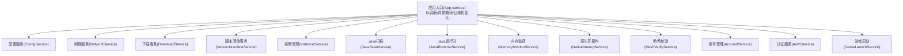
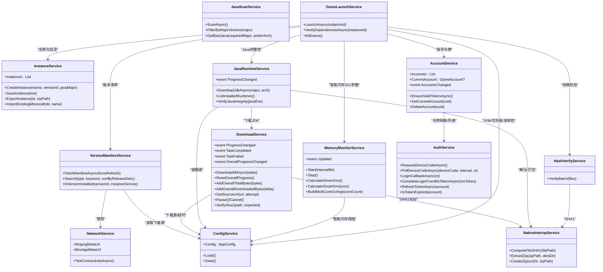
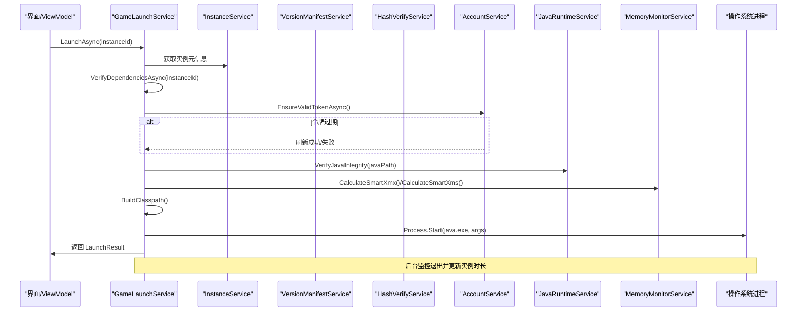
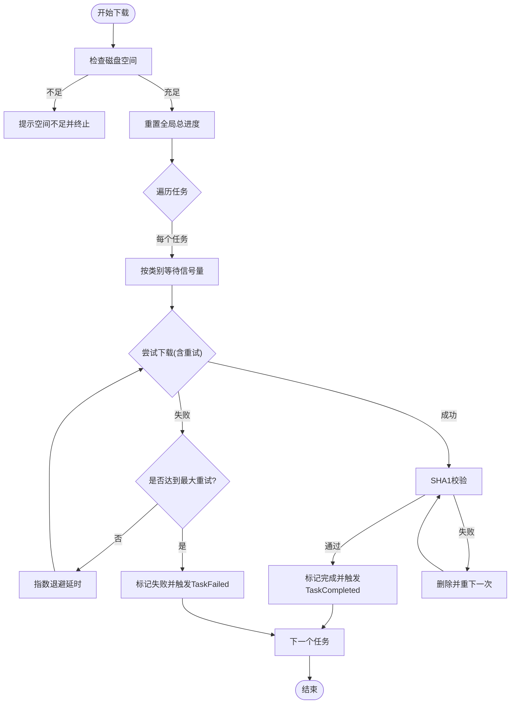
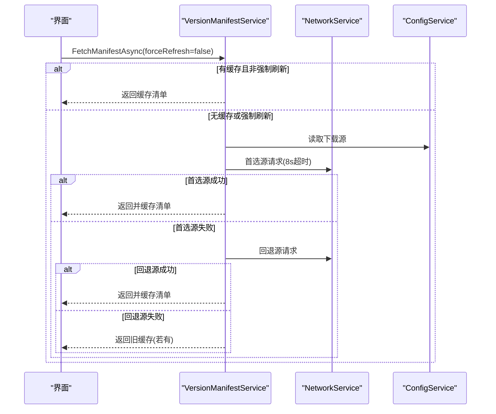
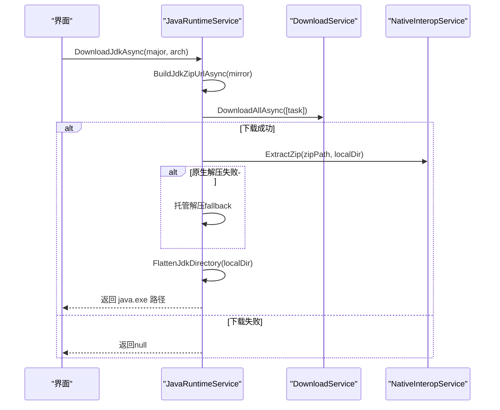
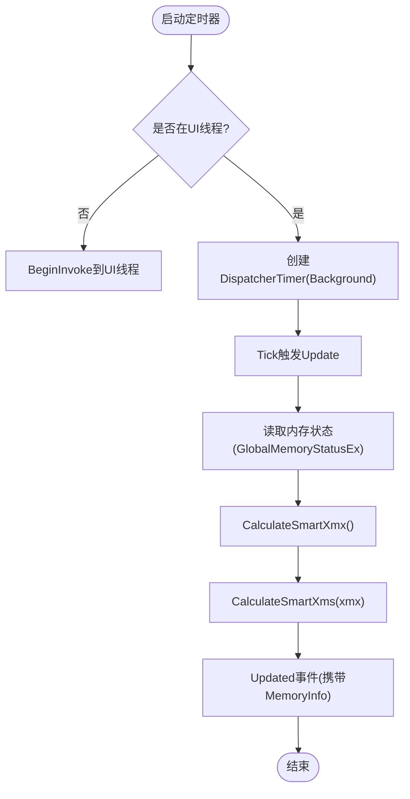
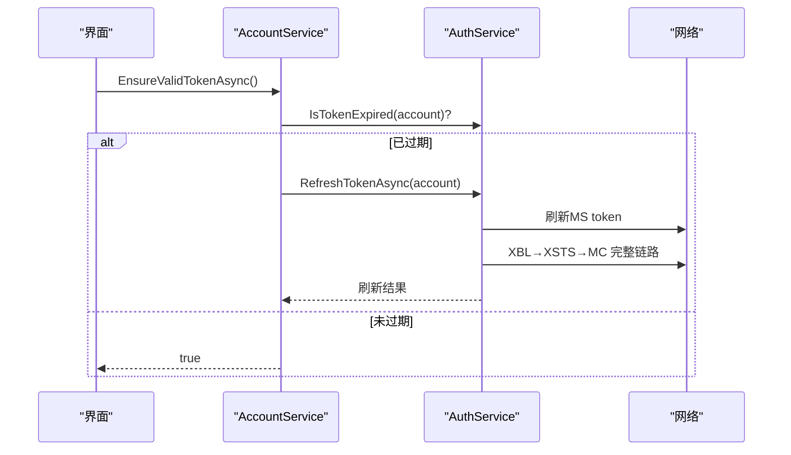
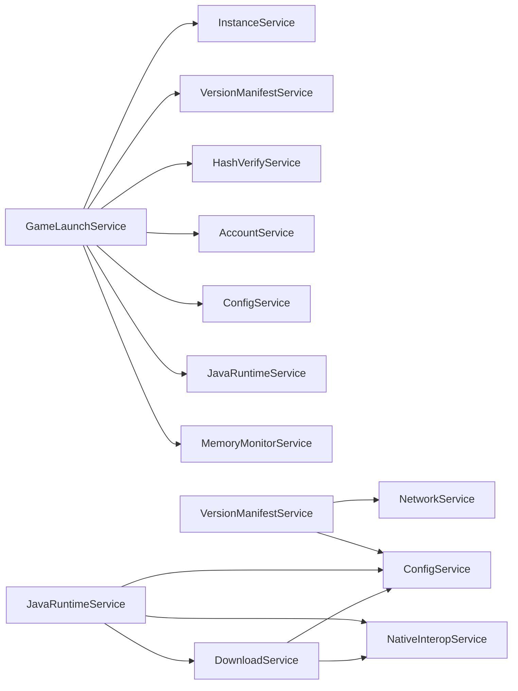

# 服务导向架构

<cite>
**本文引用的文件**   
- [App.xaml.cs](file://src/FufuLauncher/App.xaml.cs)
- [GameLaunchService.cs](file://src/FufuLauncher/Services/GameLaunchService.cs)
- [DownloadService.cs](file://src/FufuLauncher/Services/DownloadService.cs)
- [ConfigService.cs](file://src/FufuLauncher/Services/ConfigService.cs)
- [AccountService.cs](file://src/FufuLauncher/Services/AccountService.cs)
- [AuthService.cs](file://src/FufuLauncher/Services/AuthService.cs)
- [InstanceService.cs](file://src/FufuLauncher/Services/InstanceService.cs)
- [JavaRuntimeService.cs](file://src/FufuLauncher/Services/JavaRuntimeService.cs)
- [MemoryMonitorService.cs](file://src/FufuLauncher/Services/MemoryMonitorService.cs)
- [NativeInteropService.cs](file://src/FufuLauncher/Services/NativeInteropService.cs)
- [VersionManifestService.cs](file://src/FufuLauncher/Services/VersionManifestService.cs)
- [HashVerifyService.cs](file://src/FufuLauncher/Services/HashVerifyService.cs)
- [JavaScanService.cs](file://src/FufuLauncher/Services/JavaScanService.cs)
- [NetworkService.cs](file://src/FufuLauncher/Services/NetworkService.cs)
</cite>

## 目录
1. [简介](#简介)
2. [项目结构](#项目结构)
3. [核心组件](#核心组件)
4. [架构总览](#架构总览)
5. [详细组件分析](#详细组件分析)
6. [依赖关系分析](#依赖关系分析)
7. [性能考量](#性能考量)
8. [故障排查指南](#故障排查指南)
9. [结论](#结论)
10. [附录：新服务开发指南与最佳实践](#附录新服务开发指南与最佳实践)

## 简介
本文件面向“可爱的芙芙启动器”的服务导向架构（SOA）设计，聚焦以下目标：
- 明确各业务服务的职责边界与设计原则
- 说明服务间通信机制与交互模式（含事件驱动）
- 描述服务生命周期管理与资源清理策略
- 解释依赖关系与循环依赖处理方案
- 阐述错误处理与降级机制
- 提供新服务开发的指导原则与最佳实践
- 对关键服务类进行代码级剖析（如 GameLaunchService、DownloadService 等）

## 项目结构
启动器采用 WPF + .NET + DI（Microsoft.Extensions.DependencyInjection）架构。应用入口负责初始化双数据目录、注册全部服务、启动内存监控并创建主窗口。所有业务逻辑以“服务”形式组织在 Services 目录下，通过构造函数注入实现松耦合。

图表来源
- [App.xaml.cs:138-217](file://src/FufuLauncher/App.xaml.cs#L138-L217)

章节来源
- [App.xaml.cs:82-156](file://src/FufuLauncher/App.xaml.cs#L82-L156)
- [App.xaml.cs:170-217](file://src/FufuLauncher/App.xaml.cs#L170-L217)

## 核心组件
- 配置服务（ConfigService）：集中管理用户设置与持久化，包含主题、下载源、Java路径、JVM参数、分辨率、背景、登录模式、Java镜像、GC优化、智能内存分配等。
- 网络服务（NetworkService）：检测官方与镜像源连通性与延迟，为其他服务提供网络可用性判断。
- 版本清单服务（VersionManifestService）：拉取并缓存 Mojang 版本清单，支持多源切换与回退。
- 下载服务（DownloadService）：多线程分片断点续传、SHA1校验、失败重试、全局进度与单任务进度、类别隔离并发控制。
- 实例管理（InstanceService）：多实例隔离（mods/saves/resourcepacks等），实例元信息读写、导入导出。
- Java扫描（JavaScanService）：按需扫描本机 Java（环境变量、Program Files、注册表、PATH），解析版本信息。
- Java运行时（JavaRuntimeService）：按主版本下载完整 JDK（Adoptium/华为云镜像），解压安装与完整性校验。
- 内存监控（MemoryMonitorService）：定时刷新系统内存状态，智能计算 Xmx/Xms，生成多核 GC 优化参数。
- 原生互操作（NativeInteropService）：P/Invoke C++ DLL 加速 SHA1/ZIP，失败自动回退托管实现。
- 哈希校验（HashVerifyService）：批量校验 jar/libraries 的 SHA1/大小，标记需重下文件。
- 账号管理（AccountService）：当前账号切换、删除、令牌有效性检查与自动刷新。
- 认证服务（AuthService）：微软设备码/本地回调登录，完整令牌链（MS→XBL→XSTS→MC），离线账号支持。
- 游戏启动（GameLaunchService）：拼接 classpath/JVM参数、进程优先级/亲和性、绑定日志、退出监控与统计。

章节来源
- [ConfigService.cs:13-79](file://src/FufuLauncher/Services/ConfigService.cs#L13-L79)
- [NetworkService.cs:18-95](file://src/FufuLauncher/Services/NetworkService.cs#L18-L95)
- [VersionManifestService.cs:172-338](file://src/FufuLauncher/Services/VersionManifestService.cs#L172-L338)
- [DownloadService.cs:56-114](file://src/FufuLauncher/Services/DownloadService.cs#L56-L114)
- [InstanceService.cs:51-92](file://src/FufuLauncher/Services/InstanceService.cs#L51-L92)
- [JavaScanService.cs:36-75](file://src/FufuLauncher/Services/JavaScanService.cs#L36-L75)
- [JavaRuntimeService.cs:50-84](file://src/FufuLauncher/Services/JavaRuntimeService.cs#L50-L84)
- [MemoryMonitorService.cs:26-59](file://src/FufuLauncher/Services/MemoryMonitorService.cs#L26-L59)
- [NativeInteropService.cs:20-55](file://src/FufuLauncher/Services/NativeInteropService.cs#L20-L55)
- [HashVerifyService.cs:24-85](file://src/FufuLauncher/Services/HashVerifyService.cs#L24-L85)
- [AccountService.cs:12-54](file://src/FufuLauncher/Services/AccountService.cs#L12-L54)
- [AuthService.cs:76-121](file://src/FufuLauncher/Services/AuthService.cs#L76-L121)
- [GameLaunchService.cs:35-65](file://src/FufuLauncher/Services/GameLaunchService.cs#L35-L65)

## 架构总览
启动器采用“服务层+视图模型+视图”的分层结构。服务之间通过构造函数注入依赖，避免静态耦合；跨服务通信主要采用：
- 直接方法调用（同步/异步）
- 事件驱动（ProgressChanged、TaskCompleted、OverallProgressChanged、Updated 等）
- 共享配置（ConfigService.Config）
- 共享数据（InstanceService.Instances、AccountService.Accounts）

图表来源
- [App.xaml.cs:170-217](file://src/FufuLauncher/App.xaml.cs#L170-L217)
- [VersionManifestService.cs:172-338](file://src/FufuLauncher/Services/VersionManifestService.cs#L172-L338)
- [DownloadService.cs:56-114](file://src/FufuLauncher/Services/DownloadService.cs#L56-L114)
- [JavaRuntimeService.cs:50-84](file://src/FufuLauncher/Services/JavaRuntimeService.cs#L50-L84)
- [MemoryMonitorService.cs:26-59](file://src/FufuLauncher/Services/MemoryMonitorService.cs#L26-L59)
- [HashVerifyService.cs:24-85](file://src/FufuLauncher/Services/HashVerifyService.cs#L24-L85)
- [AccountService.cs:12-54](file://src/FufuLauncher/Services/AccountService.cs#L12-L54)
- [AuthService.cs:76-121](file://src/FufuLauncher/Services/AuthService.cs#L76-L121)
- [GameLaunchService.cs:35-65](file://src/FufuLauncher/Services/GameLaunchService.cs#L35-L65)

## 详细组件分析

### GameLaunchService（游戏启动服务）
职责：
- 启动前依赖校验（client.jar、libraries、assets）
- 账号令牌有效性检查与自动刷新
- Java 完整性二次校验（java -version）
- 智能内存分配（覆盖实例 Xmx/Xms）
- 构建 classpath 与 JVM 参数（含多核 GC 优化、额外参数）
- 启动 Java 进程、设置优先级与 CPU 亲和性
- 绑定日志输出、监控进程退出并累计游玩时间

图表来源
- [GameLaunchService.cs:104-316](file://src/FufuLauncher/Services/GameLaunchService.cs#L104-L316)

章节来源
- [GameLaunchService.cs:69-101](file://src/FufuLauncher/Services/GameLaunchService.cs#L69-L101)
- [GameLaunchService.cs:104-316](file://src/FufuLauncher/Services/GameLaunchService.cs#L104-L316)
- [GameLaunchService.cs:318-358](file://src/FufuLauncher/Services/GameLaunchService.cs#L318-L358)
- [GameLaunchService.cs:360-376](file://src/FufuLauncher/Services/GameLaunchService.cs#L360-L376)

### DownloadService（下载服务）
职责：
- 多线程并发下载，按类别独立信号量互不阻塞
- 大文件分片下载（>=8MB）、小文件 Range 断点续传
- 全局总进度与单任务进度事件
- 失败指数退避重试、SHA1 校验失败自动重下
- 官方源/BMCLAPI 镜像切换与 DNS 容错
- 磁盘空间预检

图表来源
- [DownloadService.cs:222-261](file://src/FufuLauncher/Services/DownloadService.cs#L222-L261)
- [DownloadService.cs:295-366](file://src/FufuLauncher/Services/DownloadService.cs#L295-L366)
- [DownloadService.cs:368-451](file://src/FufuLauncher/Services/DownloadService.cs#L368-L451)
- [DownloadService.cs:453-547](file://src/FufuLauncher/Services/DownloadService.cs#L453-L547)

章节来源
- [DownloadService.cs:56-114](file://src/FufuLauncher/Services/DownloadService.cs#L56-L114)
- [DownloadService.cs:222-261](file://src/FufuLauncher/Services/DownloadService.cs#L222-L261)
- [DownloadService.cs:295-366](file://src/FufuLauncher/Services/DownloadService.cs#L295-L366)
- [DownloadService.cs:368-451](file://src/FufuLauncher/Services/DownloadService.cs#L368-L451)
- [DownloadService.cs:453-547](file://src/FufuLauncher/Services/DownloadService.cs#L453-L547)

### VersionManifestService（版本清单服务）
职责：
- 拉取并缓存 Mojang 版本清单，支持 BMCLAPI/Mojang 双源切换与回退
- 版本搜索与过滤（正式版/快照/历史版本）
- 判断版本号是否已安装于任一实例

图表来源
- [VersionManifestService.cs:205-255](file://src/FufuLauncher/Services/VersionManifestService.cs#L205-L255)

章节来源
- [VersionManifestService.cs:172-338](file://src/FufuLauncher/Services/VersionManifestService.cs#L172-L338)

### JavaRuntimeService（Java运行时服务）
职责：
- 根据镜像源（Adoptium/华为云）拉取可用 JDK 版本列表
- 下载并解压完整 JDK，自动上提目录结构
- 列出已安装运行时，探测主版本/架构/厂商
- 校验 Java 完整性（java -version）

图表来源
- [JavaRuntimeService.cs:199-277](file://src/FufuLauncher/Services/JavaRuntimeService.cs#L199-L277)
- [JavaRuntimeService.cs:279-335](file://src/FufuLauncher/Services/JavaRuntimeService.cs#L279-L335)
- [JavaRuntimeService.cs:351-379](file://src/FufuLauncher/Services/JavaRuntimeService.cs#L351-L379)

章节来源
- [JavaRuntimeService.cs:50-84](file://src/FufuLauncher/Services/JavaRuntimeService.cs#L50-L84)
- [JavaRuntimeService.cs:199-277](file://src/FufuLauncher/Services/JavaRuntimeService.cs#L199-L277)
- [JavaRuntimeService.cs:381-429](file://src/FufuLauncher/Services/JavaRuntimeService.cs#L381-L429)
- [JavaRuntimeService.cs:482-510](file://src/FufuLauncher/Services/JavaRuntimeService.cs#L482-L510)

### MemoryMonitorService（内存监控服务）
职责：
- 定时刷新系统内存状态（DispatcherTimer/线程池定时器）
- 智能计算 Xmx/Xms（预留系统内存、上下限约束、256MB对齐）
- 生成多核 GC 优化参数（ParallelGCThreads/ConcGCThreads/CICompilerCount）

图表来源
- [MemoryMonitorService.cs:62-88](file://src/FufuLauncher/Services/MemoryMonitorService.cs#L62-L88)
- [MemoryMonitorService.cs:175-201](file://src/FufuLauncher/Services/MemoryMonitorService.cs#L175-L201)

章节来源
- [MemoryMonitorService.cs:26-59](file://src/FufuLauncher/Services/MemoryMonitorService.cs#L26-L59)
- [MemoryMonitorService.cs:175-201](file://src/FufuLauncher/Services/MemoryMonitorService.cs#L175-L201)
- [MemoryMonitorService.cs:203-213](file://src/FufuLauncher/Services/MemoryMonitorService.cs#L203-L213)

### AccountService & AuthService（账号与认证服务）
职责：
- 账户列表加载、切换、删除
- 微软设备码/本地回调登录流程
- 完整令牌链（MS→XBL→XSTS→MC）与资料查询
- Token 过期自动刷新（refresh_token）
- 离线账号登录（确定性 UUID）

图表来源
- [AccountService.cs:42-52](file://src/FufuLauncher/Services/AccountService.cs#L42-L52)
- [AuthService.cs:420-468](file://src/FufuLauncher/Services/AuthService.cs#L420-L468)

章节来源
- [AccountService.cs:12-54](file://src/FufuLauncher/Services/AccountService.cs#L12-L54)
- [AuthService.cs:76-121](file://src/FufuLauncher/Services/AuthService.cs#L76-L121)
- [AuthService.cs:158-265](file://src/FufuLauncher/Services/AuthService.cs#L158-L265)
- [AuthService.cs:267-338](file://src/FufuLauncher/Services/AuthService.cs#L267-L338)
- [AuthService.cs:340-398](file://src/FufuLauncher/Services/AuthService.cs#L340-L398)
- [AuthService.cs:420-468](file://src/FufuLauncher/Services/AuthService.cs#L420-L468)

### InstanceService（实例管理服务）
职责：
- 多实例隔离（mods/saves/resourcepacks/shaderpacks/options）
- 实例创建/复制/删除/导出备份/导入已有 .minecraft
- 路径工具方法（.minecraft/mods/resourcepacks/saves）

章节来源
- [InstanceService.cs:51-92](file://src/FufuLauncher/Services/InstanceService.cs#L51-L92)
- [InstanceService.cs:94-116](file://src/FufuLauncher/Services/InstanceService.cs#L94-L116)
- [InstanceService.cs:162-191](file://src/FufuLauncher/Services/InstanceService.cs#L162-L191)
- [InstanceService.cs:202-238](file://src/FufuLauncher/Services/InstanceService.cs#L202-L238)

### NativeInteropService（原生互操作服务）
职责：
- P/Invoke 调用 FufuNative.dll 加速 SHA1/ZIP 操作
- 失败自动回退托管实现（功能等价）
- 首次探测缓存可用性，避免重复开销

章节来源
- [NativeInteropService.cs:20-55](file://src/FufuLauncher/Services/NativeInteropService.cs#L20-L55)
- [NativeInteropService.cs:84-119](file://src/FufuLauncher/Services/NativeInteropService.cs#L84-L119)
- [NativeInteropService.cs:142-157](file://src/FufuLauncher/Services/NativeInteropService.cs#L142-L157)

### HashVerifyService（哈希校验服务）
职责：
- 单个/批量校验文件存在性、大小、SHA1
- 返回需重新下载的文件列表

章节来源
- [HashVerifyService.cs:24-85](file://src/FufuLauncher/Services/HashVerifyService.cs#L24-L85)

### JavaScanService（Java扫描服务）
职责：
- 按需扫描 JAVA_HOME、Program Files、注册表、PATH
- 解析 java -version 输出，识别主版本/架构/厂商
- 筛选最优 Java（优先匹配主版本与架构）

章节来源
- [JavaScanService.cs:36-75](file://src/FufuLauncher/Services/JavaScanService.cs#L36-L75)
- [JavaScanService.cs:170-217](file://src/FufuLauncher/Services/JavaScanService.cs#L170-L217)
- [JavaScanService.cs:268-291](file://src/FufuLauncher/Services/JavaScanService.cs#L268-L291)

### NetworkService（网络服务）
职责：
- 检测 Mojang 官方源与 BMCLAPI 国内镜像连通性与延迟
- 统一 User-Agent，避免被限流

章节来源
- [NetworkService.cs:18-95](file://src/FufuLauncher/Services/NetworkService.cs#L18-L95)

## 依赖关系分析
- 低耦合：所有服务通过构造函数注入，避免静态引用，便于测试与替换实现
- 事件解耦：下载进度、内存监控、账号变更等通过事件通知，降低调用方耦合
- 配置共享：ConfigService 作为唯一配置源，保证一致性
- 循环依赖规避：
  - 通过 DI 容器构造顺序与按需解析避免循环
  - 将易形成环的依赖拆分为接口或事件（例如 UI 订阅事件而非服务互相调用）
  - 若确需双向依赖，使用 Lazy<T> 或延迟解析

图表来源
- [App.xaml.cs:170-217](file://src/FufuLauncher/App.xaml.cs#L170-L217)

章节来源
- [App.xaml.cs:170-217](file://src/FufuLauncher/App.xaml.cs#L170-L217)

## 性能考量
- 下载服务：
  - 类别隔离信号量（Game/Asset/Java/Mod/Other）避免相互阻塞
  - 大文件分片并发下载提升吞吐
  - 每请求首字节超时保护连接卡死
  - 全局进度节流（150ms）减少 UI 刷新压力
- 内存监控：
  - DispatcherTimer Background 优先级，避免抢占输入
  - 间隔 3000ms 降低 P/Invoke 频率
- 日志写入：
  - 队列缓冲 + 200ms Timer 批量落盘，避免频繁 IO
- 原生加速：
  - SHA1/ZIP 优先使用 C++ DLL，失败回退托管实现

章节来源
- [DownloadService.cs:68-73](file://src/FufuLauncher/Services/DownloadService.cs#L68-L73)
- [DownloadService.cs:140-169](file://src/FufuLauncher/Services/DownloadService.cs#L140-L169)
- [MemoryMonitorService.cs:80-88](file://src/FufuLauncher/Services/MemoryMonitorService.cs#L80-L88)
- [App.xaml.cs:40-67](file://src/FufuLauncher/App.xaml.cs#L40-L67)
- [NativeInteropService.cs:20-55](file://src/FufuLauncher/Services/NativeInteropService.cs#L20-L55)

## 故障排查指南
- 登录失败：
  - 查看设备码轮询错误类型（网络/取消/过期/交换失败）
  - 检查 Microsoft 客户端 ID 与回调端口配置
  - 确认网络连通性（官方源/BMCLAPI）
- 下载失败：
  - 检查磁盘空间预检与剩余空间
  - 观察指数退避重试次数与最终错误消息
  - 确认 SHA1 校验失败后的重下逻辑
- 启动失败：
  - 验证 Java 完整性（java -version）
  - 检查实例依赖缺失（client.jar、libraries）
  - 查看进程优先级/亲和性设置是否成功（需要管理员权限）
- 内存监控异常：
  - 确认 Dispatcher 可用性与定时器状态
  - 检查内存预留与上下限配置

章节来源
- [AuthService.cs:158-265](file://src/FufuLauncher/Services/AuthService.cs#L158-L265)
- [DownloadService.cs:222-261](file://src/FufuLauncher/Services/DownloadService.cs#L222-L261)
- [GameLaunchService.cs:104-316](file://src/FufuLauncher/Services/GameLaunchService.cs#L104-L316)
- [MemoryMonitorService.cs:62-88](file://src/FufuLauncher/Services/MemoryMonitorService.cs#L62-L88)

## 结论
该启动器通过清晰的服务分层与事件驱动通信，实现了高内聚、低耦合的可维护架构。关键能力包括：
- 稳定的下载引擎（断点续传、分片并发、SHA1校验、镜像切换）
- 健壮的账号认证（微软设备码/本地回调、完整令牌链、自动刷新）
- 灵活的实例管理（隔离、导入导出、路径工具）
- 高性能的原生加速与托管回退
- 智能内存分配与多核 GC 优化
- 完善的异常捕获与日志记录

## 附录：新服务开发指南与最佳实践
- 职责单一：每个服务只负责一个业务域（如下载、认证、实例管理）
- 依赖注入：通过构造函数注入依赖，避免静态耦合
- 事件驱动：对外暴露事件（ProgressChanged、Updated、TaskCompleted 等），由 UI 或其他服务订阅
- 配置集中：所有可配置项集中在 ConfigService，避免散落各处
- 错误处理：区分可恢复与不可恢复错误，提供降级与重试策略
- 资源清理：在服务停止时释放定时器、HTTP 客户端、文件句柄等资源
- 性能优化：合理使用并发、缓存、节流与原生加速
- 可测试性：服务无副作用（尽量纯函数/可模拟依赖），便于单元测试

章节来源
- [App.xaml.cs:170-217](file://src/FufuLauncher/App.xaml.cs#L170-L217)
- [DownloadService.cs:84-98](file://src/FufuLauncher/Services/DownloadService.cs#L84-L98)
- [MemoryMonitorService.cs:54-59](file://src/FufuLauncher/Services/MemoryMonitorService.cs#L54-L59)
- [ConfigService.cs:94-146](file://src/FufuLauncher/Services/ConfigService.cs#L94-L146)