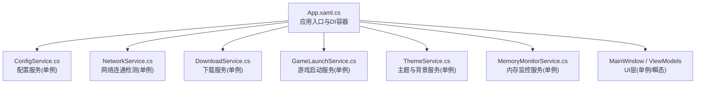
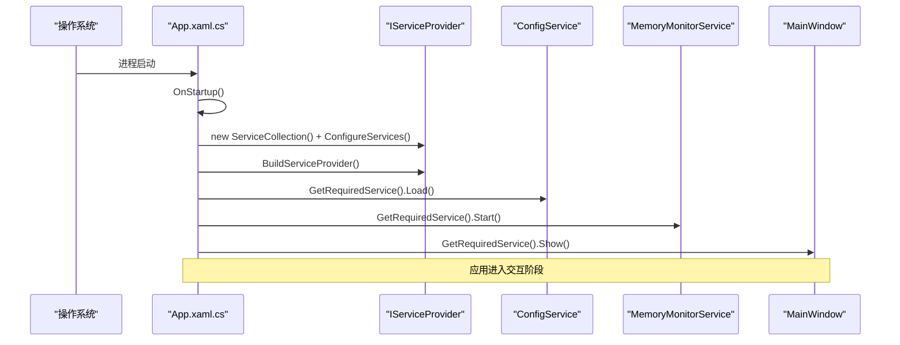
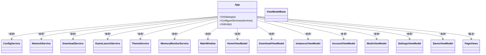
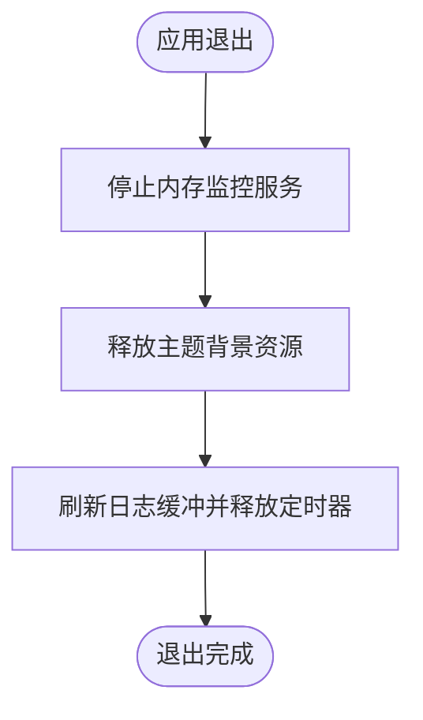
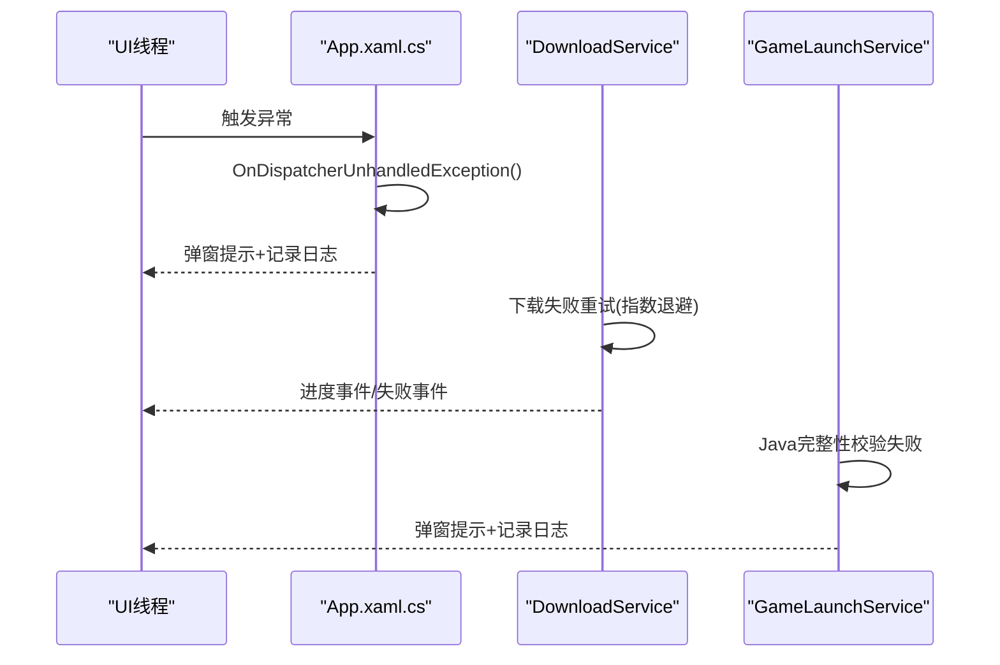
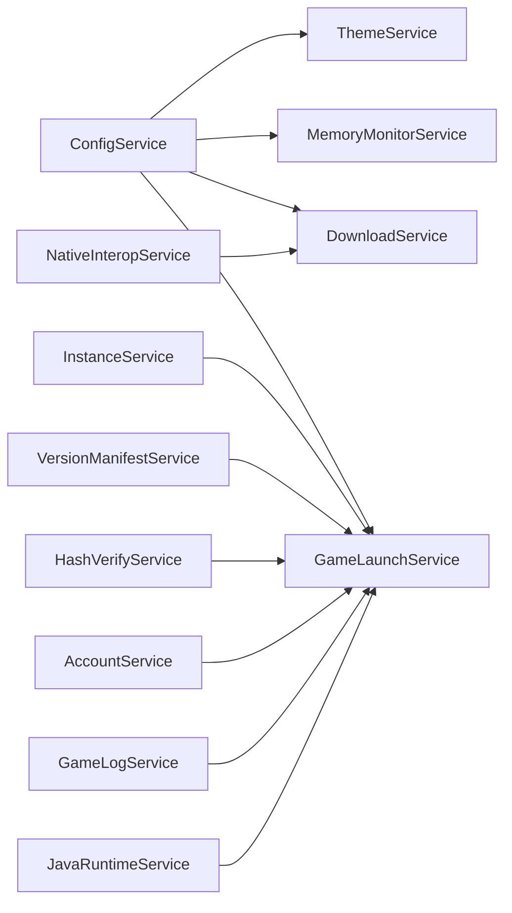

# 服务生命周期管理

<cite>
**本文引用的文件**   
- [App.xaml.cs](file://src/FufuLauncher/App.xaml.cs)
- [ConfigService.cs](file://src/FufuLauncher/Services/ConfigService.cs)
- [MemoryMonitorService.cs](file://src/FufuLauncher/Services/MemoryMonitorService.cs)
- [ThemeService.cs](file://src/FufuLauncher/Services/ThemeService.cs)
- [NetworkService.cs](file://src/FufuLauncher/Services/NetworkService.cs)
- [DownloadService.cs](file://src/FufuLauncher/Services/DownloadService.cs)
- [GameLaunchService.cs](file://src/FufuLauncher/Services/GameLaunchService.cs)
</cite>

## 目录
1. [简介](#简介)
2. [项目结构](#项目结构)
3. [核心组件](#核心组件)
4. [架构总览](#架构总览)
5. [详细组件分析](#详细组件分析)
6. [依赖关系分析](#依赖关系分析)
7. [性能考量](#性能考量)
8. [故障排查指南](#故障排查指南)
9. [结论](#结论)
10. [附录：新服务注册最佳实践](#附录新服务注册最佳实践)

## 简介
本文件面向“可爱的芙芙启动器”的服务生命周期管理，聚焦于依赖注入容器的配置、服务注册与解析、初始化顺序、生命周期钩子与资源清理、循环依赖处理、异常处理与恢复机制，以及新增服务的指导原则与最佳实践。文档基于实际源码进行梳理，确保读者既能快速上手，也能深入理解内部实现。

## 项目结构
- 应用入口与 DI 容器构建位于 App.xaml.cs，负责创建 ServiceCollection、注册全部服务、构建 IServiceProvider，并在启动与退出阶段执行必要的初始化与清理。
- 服务集中在 src/FufuLauncher/Services 目录下，按职责划分（配置、网络、下载、游戏启动、主题、内存监控等）。
- 视图模型与页面通过 DI 按需解析，页面采用瞬态模式，视图模型采用单例模式。

图表来源 
- [App.xaml.cs:131-178](file://src/FufuLauncher/App.xaml.cs#L131-L178)

章节来源
- [App.xaml.cs:75-117](file://src/FufuLauncher/App.xaml.cs#L75-L117)
- [App.xaml.cs:131-178](file://src/FufuLauncher/App.xaml.cs#L131-L178)

## 核心组件
- 依赖注入容器：使用 Microsoft.Extensions.DependencyInjection 的 ServiceCollection，在 OnStartup 中构建并持有全局 IServiceProvider。
- 服务注册策略：
  - 单例（AddSingleton）：适用于无状态或共享状态的服务，如配置、网络、下载、游戏启动、主题、内存监控等。
  - 瞬态（AddTransient）：适用于 UI 页面，每次导航新建实例，避免跨页面状态污染。
- 初始化顺序：
  - 先构建容器，再加载配置（ConfigService.Load），随后启动需要定时刷新的服务（如 MemoryMonitorService.Start）。
  - 主窗口由 DI 解析并显示，确保其依赖已就绪。
- 生命周期钩子与清理：
  - OnExit 中停止定时器、释放主题背景资源、刷新日志缓冲。
  - 各服务内部提供 Stop/Pause/Resume/Release 等方法用于细粒度资源管理。

章节来源
- [App.xaml.cs:99-117](file://src/FufuLauncher/App.xaml.cs#L99-L117)
- [App.xaml.cs:119-129](file://src/FufuLauncher/App.xaml.cs#L119-L129)
- [App.xaml.cs:131-178](file://src/FufuLauncher/App.xaml.cs#L131-L178)
- [MemoryMonitorService.cs:61-128](file://src/FufuLauncher/Services/MemoryMonitorService.cs#L61-L128)
- [ThemeService.cs:229-258](file://src/FufuLauncher/Services/ThemeService.cs#L229-L258)

## 架构总览
下图展示从应用启动到服务解析的关键流程，包括容器构建、配置加载、服务启动与主窗口显示。

图表来源 
- [App.xaml.cs:99-117](file://src/FufuLauncher/App.xaml.cs#L99-L117)

章节来源
- [App.xaml.cs:99-117](file://src/FufuLauncher/App.xaml.cs#L99-L117)

## 详细组件分析

### 依赖注入容器与服务注册
- 容器构建：在 OnStartup 中创建 ServiceCollection，调用 ConfigureServices 完成全部服务注册，然后 BuildServiceProvider 生成全局 IServiceProvider。
- 服务注册策略：
  - 单例：所有业务服务（配置、网络、下载、版本清单、实例、模组安装、哈希校验、账号、认证、模组管理、资源包、主题、游戏启动、游戏日志、存档管理、原生互操作、游戏安装、Java 运行时、内存监控）均注册为单例。
  - 视图模型：MainViewModel、HomeViewModel、DownloadViewModel、InstancesViewModel、AccountViewModel、ModsViewModel、SettingsViewModel、SavesViewModel 均为单例。
  - 页面视图：HomePage、DownloadPage、JavaRuntimePage、InstancesPage、AccountPage、ModsPage、SavesPage、SettingsPage 均为瞬态。
- 主窗口：MainWindow 作为单例由 DI 创建，确保依赖注入可用。

图表来源 
- [App.xaml.cs:131-178](file://src/FufuLauncher/App.xaml.cs#L131-L178)

章节来源
- [App.xaml.cs:131-178](file://src/FufuLauncher/App.xaml.cs#L131-L178)

### 服务初始化顺序与依赖解析
- 初始化顺序：
  1) 构建 DI 容器；2) 获取 ConfigService 并 Load；3) 启动 MemoryMonitorService；4) 解析并显示 MainWindow。
- 依赖解析：
  - 所有服务通过构造函数注入，由 DI 自动解析依赖链。
  - 页面视图为瞬态，每次导航时重新解析依赖，避免跨页面状态共享。
- 注意事项：
  - 若某服务依赖其他服务，应在 ConfigureServices 中确保被依赖服务先注册（尽管 DI 不要求显式顺序，但逻辑上应保证依赖可用）。
  - 对于需要外部资源的初始化（如文件系统、网络），建议在服务内部延迟初始化或在首次使用时触发。

章节来源
- [App.xaml.cs:99-117](file://src/FufuLauncher/App.xaml.cs#L99-L117)

### 生命周期钩子与资源清理
- 应用级清理：
  - OnExit 中停止 MemoryMonitorService 定时器、释放 ThemeService 的背景资源、释放日志定时器并刷新缓冲。
- 服务级清理：
  - MemoryMonitorService：Stop/Pause/Resume 控制定时器与事件订阅。
  - ThemeService：ReleaseCurrentBackground 释放视频/图片资源，PauseBackground/ResumeBackground 控制播放。
  - DownloadService：Cancel/Pause 取消任务，VerifySha1 校验完整性。
  - GameLaunchService：KillGame 终止游戏进程，后台监控退出并更新统计。

图表来源 
- [App.xaml.cs:119-129](file://src/FufuLauncher/App.xaml.cs#L119-L129)
- [MemoryMonitorService.cs:91-128](file://src/FufuLauncher/Services/MemoryMonitorService.cs#L91-L128)
- [ThemeService.cs:229-258](file://src/FufuLauncher/Services/ThemeService.cs#L229-L258)

章节来源
- [App.xaml.cs:119-129](file://src/FufuLauncher/App.xaml.cs#L119-L129)
- [MemoryMonitorService.cs:91-128](file://src/FufuLauncher/Services/MemoryMonitorService.cs#L91-L128)
- [ThemeService.cs:229-258](file://src/FufuLauncher/Services/ThemeService.cs#L229-L258)

### 循环依赖处理
- 当前代码未发现直接循环依赖。若未来引入循环依赖，建议：
  - 重构为接口抽象，使用工厂或延迟解析（Lazy<T>）打破循环。
  - 将共享状态下沉到独立服务，避免双向引用。
  - 在 ConfigureServices 中明确依赖边界，必要时拆分服务职责。

[本节为概念性说明，不涉及具体文件]

### 异常处理与错误恢复
- 全局异常捕获：
  - DispatcherUnhandledException：捕获 UI 线程未处理异常，记录日志并弹窗提示。
  - UnhandledException：捕获域内致命异常，记录日志并弹窗。
  - UnobservedTaskException：捕获后台 Task 未观察异常，标记已观察防止进程终止。
- 服务级异常：
  - DownloadService：失败重试（指数退避）、SHA1 校验失败重下、磁盘空间不足提示。
  - GameLaunchService：Java 完整性校验失败提示、进程优先级/亲和性设置失败忽略。
  - ThemeService/MemoryMonitorService：异常写入应用日志，避免阻塞主流程。

图表来源 
- [App.xaml.cs:180-206](file://src/FufuLauncher/App.xaml.cs#L180-L206)
- [DownloadService.cs:305-366](file://src/FufuLauncher/Services/DownloadService.cs#L305-L366)
- [GameLaunchService.cs:157-177](file://src/FufuLauncher/Services/GameLaunchService.cs#L157-L177)

章节来源
- [App.xaml.cs:180-206](file://src/FufuLauncher/App.xaml.cs#L180-L206)
- [DownloadService.cs:305-366](file://src/FufuLauncher/Services/DownloadService.cs#L305-L366)
- [GameLaunchService.cs:157-177](file://src/FufuLauncher/Services/GameLaunchService.cs#L157-L177)

## 依赖关系分析
- 服务间依赖：
  - GameLaunchService 依赖 InstanceService、VersionManifestService、HashVerifyService、AccountService、GameLogService、ConfigService、JavaRuntimeService、MemoryMonitorService。
  - DownloadService 依赖 ConfigService、NativeInteropService。
  - ThemeService/MemoryMonitorService 依赖 ConfigService。
- 耦合度与内聚性：
  - 服务职责清晰，依赖通过构造函数注入，便于测试与替换。
  - 页面与视图模型解耦，通过 DI 解析，避免硬编码依赖。

图表来源 
- [GameLaunchService.cs:48-65](file://src/FufuLauncher/Services/GameLaunchService.cs#L48-L65)
- [DownloadService.cs:99-114](file://src/FufuLauncher/Services/DownloadService.cs#L99-L114)
- [ThemeService.cs:25-28](file://src/FufuLauncher/Services/ThemeService.cs#L25-L28)
- [MemoryMonitorService.cs:56-59](file://src/FufuLauncher/Services/MemoryMonitorService.cs#L56-L59)

章节来源
- [GameLaunchService.cs:48-65](file://src/FufuLauncher/Services/GameLaunchService.cs#L48-L65)
- [DownloadService.cs:99-114](file://src/FufuLauncher/Services/DownloadService.cs#L99-L114)
- [ThemeService.cs:25-28](file://src/FufuLauncher/Services/ThemeService.cs#L25-L28)
- [MemoryMonitorService.cs:56-59](file://src/FufuLauncher/Services/MemoryMonitorService.cs#L56-L59)

## 性能考量
- 下载服务：
  - 多线程分片下载（>=8MB 自动分片），类别独立信号量控制并发。
  - 断点续传（.partial 临时文件）、SHA1 校验、指数退避重试。
  - 全局进度节流（150ms）提升 UI 流畅度。
- 内存监控：
  - DispatcherTimer 在 UI 线程触发，避免 Invoke 队列堆积。
  - 间隔 3000ms，降低 P/Invoke 频率。
- 日志写入：
  - 异步批量写入（ConcurrentQueue + Timer），减少 IO 阻塞。

章节来源
- [DownloadService.cs:222-261](file://src/FufuLauncher/Services/DownloadService.cs#L222-L261)
- [DownloadService.cs:369-451](file://src/FufuLauncher/Services/DownloadService.cs#L369-L451)
- [DownloadService.cs:454-547](file://src/FufuLauncher/Services/DownloadService.cs#L454-L547)
- [MemoryMonitorService.cs:61-128](file://src/FufuLauncher/Services/MemoryMonitorService.cs#L61-L128)
- [App.xaml.cs:33-73](file://src/FufuLauncher/App.xaml.cs#L33-L73)

## 故障排查指南
- 常见问题定位：
  - 查看应用日志（app.log）：App.ReadAppLog 强制刷新后读取。
  - 检查网络连通性：NetworkService.TestConnectivityAsync 返回双源状态与延迟。
  - 下载失败：查看 DownloadService 的任务状态与错误信息，确认 SHA1 校验与重试次数。
  - 游戏启动失败：检查 Java 路径与完整性，查看 GameLaunchService 的错误消息。
- 恢复策略：
  - 下载失败：自动重试（指数退避），失败后提示用户检查网络或磁盘空间。
  - Java 完整性失败：提示用户重新下载对应版本的 Java 运行时。
  - 主题背景异常：释放资源后重新应用，避免 UI 卡死。

章节来源
- [App.xaml.cs:62-73](file://src/FufuLauncher/App.xaml.cs#L62-L73)
- [NetworkService.cs:34-76](file://src/FufuLauncher/Services/NetworkService.cs#L34-L76)
- [DownloadService.cs:305-366](file://src/FufuLauncher/Services/DownloadService.cs#L305-L366)
- [GameLaunchService.cs:157-177](file://src/FufuLauncher/Services/GameLaunchService.cs#L157-L177)
- [ThemeService.cs:229-258](file://src/FufuLauncher/Services/ThemeService.cs#L229-L258)

## 结论
本启动器通过标准的依赖注入容器管理服务生命周期，采用单例与瞬态策略平衡资源共享与隔离。服务初始化顺序清晰，生命周期钩子完善，异常处理健壮。下载与内存监控等服务在性能与用户体验方面做了充分优化。遵循本文档的最佳实践，可安全扩展新服务并保持系统稳定。

[本节为总结性内容，不涉及具体文件]

## 附录：新服务注册最佳实践
- 注册策略选择：
  - 无状态或共享状态服务：使用 AddSingleton。
  - UI 页面或短期任务：使用 AddTransient。
- 依赖注入：
  - 通过构造函数注入依赖，避免静态字段。
  - 若存在循环依赖，使用 Lazy<T> 或重构为接口抽象。
- 生命周期管理：
  - 提供服务启动/停止方法（如 Start/Stop），在 App.OnStartup/OnExit 中调用。
  - 释放外部资源（文件句柄、网络连接、定时器）在 Stop/Dispose 中统一处理。
- 异常处理：
  - 服务内部捕获并记录异常，避免传播到 UI 层。
  - 关键路径提供降级策略（如网络失败回退镜像源）。
- 性能优化：
  - 避免频繁同步 IO，使用异步与批处理。
  - 合理设置超时与重试策略，避免雪崩效应。

[本节为通用指导，不涉及具体文件]