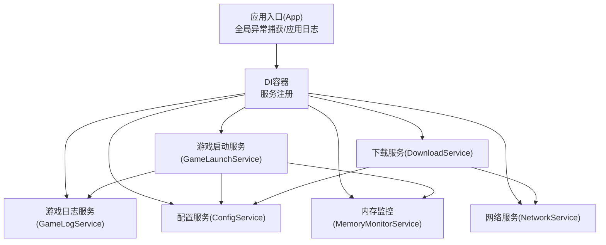
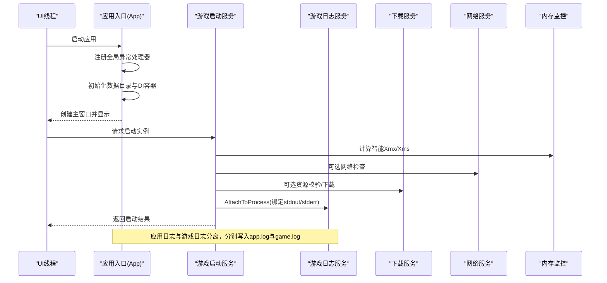
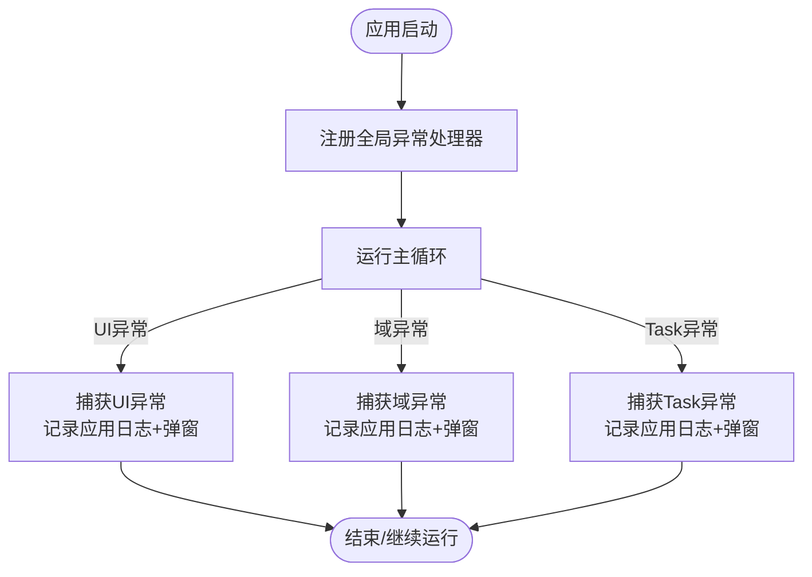
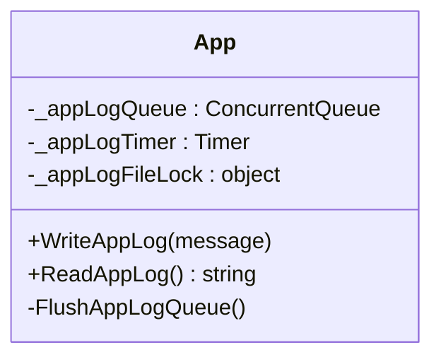
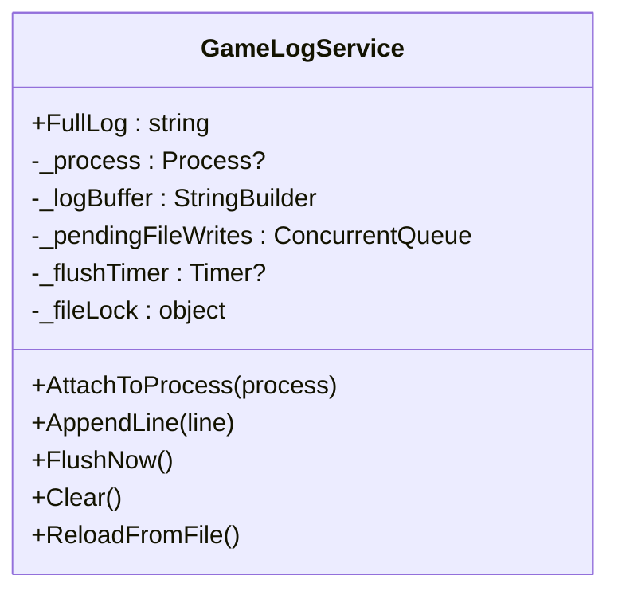
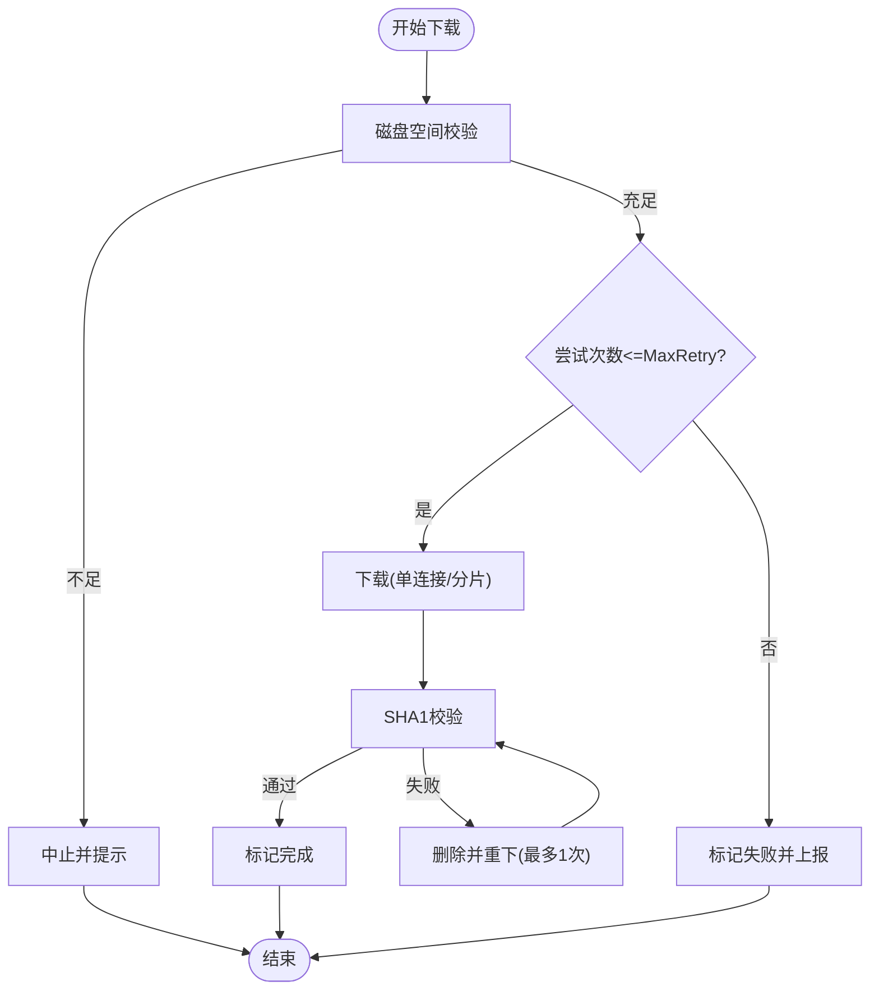
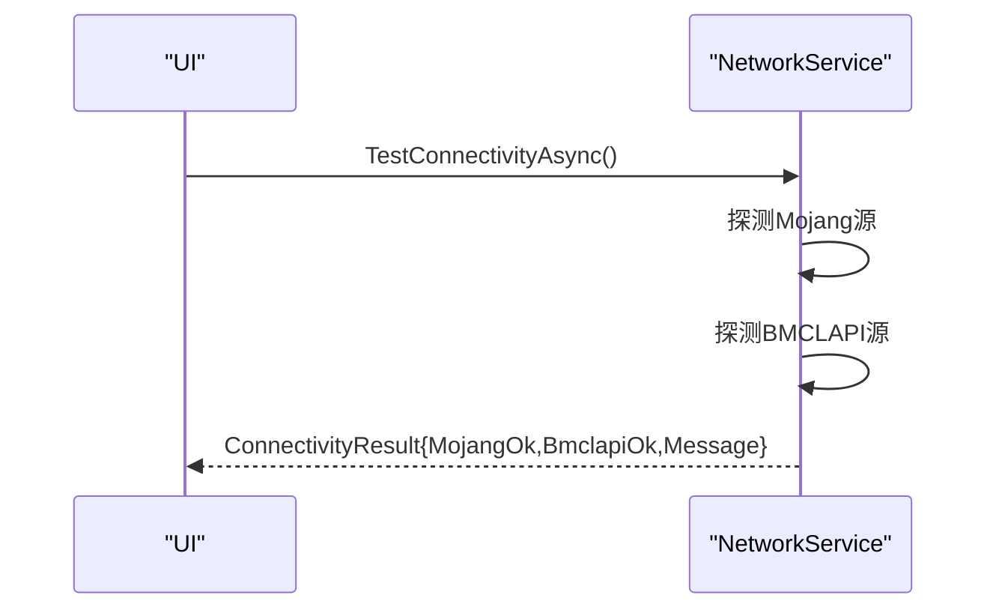
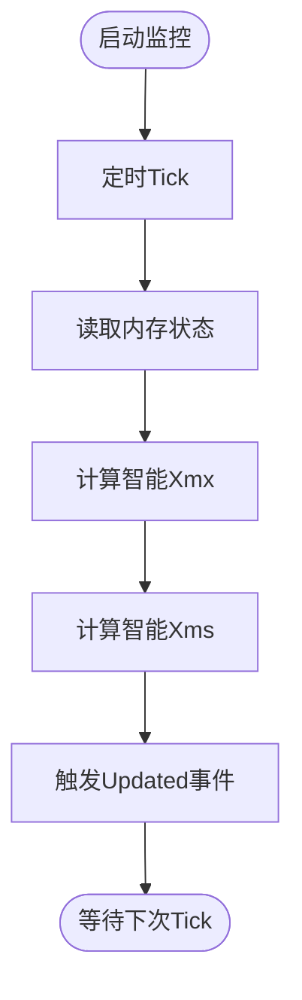
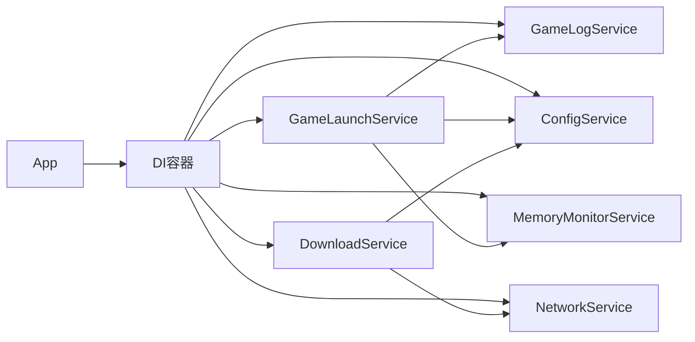

# 服务错误处理与日志

<cite>
**本文引用的文件**   
- [App.xaml.cs](file://src/FufuLauncher/App.xaml.cs)
- [MainWindow.xaml.cs](file://src/FufuLauncher/MainWindow.xaml.cs)
- [GameLogService.cs](file://src/FufuLauncher/Services/GameLogService.cs)
- [GameLaunchService.cs](file://src/FufuLauncher/Services/GameLaunchService.cs)
- [DownloadService.cs](file://src/FufuLauncher/Services/DownloadService.cs)
- [NetworkService.cs](file://src/FufuLauncher/Services/NetworkService.cs)
- [ConfigService.cs](file://src/FufuLauncher/Services/ConfigService.cs)
- [MemoryMonitorService.cs](file://src/FufuLauncher/Services/MemoryMonitorService.cs)
</cite>

## 目录
1. [简介](#简介)
2. [项目结构](#项目结构)
3. [核心组件](#核心组件)
4. [架构总览](#架构总览)
5. [详细组件分析](#详细组件分析)
6. [依赖关系分析](#依赖关系分析)
7. [性能考量](#性能考量)
8. [故障排查指南](#故障排查指南)
9. [结论](#结论)
10. [附录](#附录)

## 简介
本文件面向“可爱的芙芙启动器”的错误处理与日志系统，系统性说明全局异常捕获机制、错误分类策略、分级日志（应用日志与应用内游戏日志分离）、错误恢复与重试策略、异步写入与批量优化、异常信息收集与分析工具，以及错误诊断与问题排查的最佳实践。文档以代码级实现为依据，配合图示帮助读者快速理解整体设计与关键流程。

## 项目结构
- 应用入口与全局异常捕获：在应用启动时注册 UI、域、Task 三个层面的未处理异常处理器，统一记录到应用日志并提示用户。
- 应用日志：基于内存队列 + 定时器批量落盘，避免高频 IO 阻塞调用线程；提供读取接口供界面展示。
- 游戏日志：独立于应用日志，实时捕获 Java 进程 stdout/stderr，采用内存缓冲 + 定时批量写文件，支持强制刷新与从文件重载。
- 下载服务：内置失败自动重试（指数退避）、SHA1 校验失败重下、断点续传、分片并发下载等健壮性能力。
- 网络检测：对官方源与镜像源进行连通性与延迟测试，辅助定位网络问题。
- 配置服务：集中管理用户设置，包括下载源、Java 路径、JVM 参数、内存智能分配等。
- 内存监控：定时采集系统内存状态，提供智能 Xmx/Xms 计算与多核 GC 参数生成。

**图表来源** 
- [App.xaml.cs:75-117](file://src/FufuLauncher/App.xaml.cs#L75-L117)
- [GameLaunchService.cs:104-177](file://src/FufuLauncher/Services/GameLaunchService.cs#L104-L177)
- [GameLogService.cs:22-52](file://src/FufuLauncher/Services/GameLogService.cs#L22-L52)
- [DownloadService.cs:56-114](file://src/FufuLauncher/Services/DownloadService.cs#L56-L114)
- [NetworkService.cs:18-33](file://src/FufuLauncher/Services/NetworkService.cs#L18-L33)
- [ConfigService.cs:81-114](file://src/FufuLauncher/Services/ConfigService.cs#L81-L114)
- [MemoryMonitorService.cs:56-88](file://src/FufuLauncher/Services/MemoryMonitorService.cs#L56-L88)

**章节来源**
- [App.xaml.cs:75-117](file://src/FufuLauncher/App.xaml.cs#L75-L117)
- [ConfigService.cs:81-114](file://src/FufuLauncher/Services/ConfigService.cs#L81-L114)

## 核心组件
- 全局异常捕获与统一日志入口
  - UI 层未处理异常：DispatcherUnhandledException
  - 域层未处理异常：AppDomain.CurrentDomain.UnhandledException
  - Task 未观察异常：TaskScheduler.UnobservedTaskException
  - 统一通过应用日志队列入队，后台定时器批量落盘
- 应用日志子系统
  - 内存队列缓冲 + 200ms 定时器批量写入 app.log
  - 提供 ReadAppLog 强制刷新后读取全文
- 游戏日志子系统
  - 绑定 Java 进程 stdout/stderr，内存缓冲限制行数，200ms 批量写入 game.log
  - 支持 FlushNow 强制刷新、ReloadFromFile 跨页面恢复显示
- 下载服务健壮性
  - 指数退避重试、SHA1 校验失败重下、断点续传、分片并发下载
  - 全局进度节流上报，修复进度不跑动问题
- 网络连通检测
  - 同时探测官方源与 BMCLAPI 镜像源，返回可用性与延迟
- 内存监控与智能分配
  - 定时采集内存，计算智能 Xmx/Xms，生成多核 GC 参数

**章节来源**
- [App.xaml.cs:33-73](file://src/FufuLauncher/App.xaml.cs#L33-L73)
- [App.xaml.cs:180-205](file://src/FufuLauncher/App.xaml.cs#L180-L205)
- [GameLogService.cs:22-52](file://src/FufuLauncher/Services/GameLogService.cs#L22-L52)
- [GameLogService.cs:99-166](file://src/FufuLauncher/Services/GameLogService.cs#L99-L166)
- [DownloadService.cs:295-366](file://src/FufuLauncher/Services/DownloadService.cs#L295-L366)
- [NetworkService.cs:34-76](file://src/FufuLauncher/Services/NetworkService.cs#L34-L76)
- [MemoryMonitorService.cs:175-213](file://src/FufuLauncher/Services/MemoryMonitorService.cs#L175-L213)

## 架构总览
下图展示了错误处理与日志系统在启动器中的位置与交互关系：应用入口负责全局异常捕获与统一日志；游戏启动服务负责拉起 Java 进程并绑定游戏日志；下载服务在网络异常时执行重试与降级；内存监控为 JVM 参数提供依据。

**图表来源** 
- [App.xaml.cs:75-117](file://src/FufuLauncher/App.xaml.cs#L75-L117)
- [GameLaunchService.cs:104-177](file://src/FufuLauncher/Services/GameLaunchService.cs#L104-L177)
- [GameLogService.cs:54-65](file://src/FufuLauncher/Services/GameLogService.cs#L54-L65)
- [DownloadService.cs:222-261](file://src/FufuLauncher/Services/DownloadService.cs#L222-L261)
- [NetworkService.cs:34-76](file://src/FufuLauncher/Services/NetworkService.cs#L34-L76)
- [MemoryMonitorService.cs:175-213](file://src/FufuLauncher/Services/MemoryMonitorService.cs#L175-L213)

## 详细组件分析

### 全局异常捕获与统一日志
- 三类未处理异常均被捕获：
  - UI 线程异常：DispatcherUnhandledException
  - 域异常：AppDomain.CurrentDomain.UnhandledException
  - Task 未观察异常：TaskScheduler.UnobservedTaskException
- 所有异常信息统一写入应用日志队列，由后台定时器批量落盘；UI 层弹出提示框，确保用户可见。
- 退出时最后一次刷新日志缓冲，保证关键信息落地。

**图表来源** 
- [App.xaml.cs:180-205](file://src/FufuLauncher/App.xaml.cs#L180-L205)
- [App.xaml.cs:33-73](file://src/FufuLauncher/App.xaml.cs#L33-L73)

**章节来源**
- [App.xaml.cs:180-205](file://src/FufuLauncher/App.xaml.cs#L180-L205)
- [App.xaml.cs:33-73](file://src/FufuLauncher/App.xaml.cs#L33-L73)

### 应用日志子系统（app.log）
- 设计要点：
  - 使用 ConcurrentQueue 缓冲日志行，Timer 每 200ms 批量写入 app.log
  - 读取前强制刷新队列，确保最新内容可被界面读取
  - 写入失败静默忽略，避免影响主流程
- 复杂度与性能：
  - 入队 O(1)，批量写入减少 IO 次数，降低锁竞争
  - 单文件写入加锁，保证顺序一致性

**图表来源** 
- [App.xaml.cs:33-73](file://src/FufuLauncher/App.xaml.cs#L33-L73)

**章节来源**
- [App.xaml.cs:33-73](file://src/FufuLauncher/App.xaml.cs#L33-L73)

### 游戏日志子系统（game.log）
- 设计要点：
  - 绑定 Java 进程 OutputDataReceived/ErrorDataReceived，实时捕获输出
  - 内存缓冲限制最大行数（超出丢弃最早行），避免内存膨胀
  - 200ms 定时器批量写入 game.log，支持 FlushNow 强制刷新
  - 提供 ReloadFromFile 用于跨页面切换时恢复显示
- 错误处理：
  - 取消旧进程事件订阅失败时记录应用日志
  - 批量写入失败记录应用日志，不影响主流程

**图表来源** 
- [GameLogService.cs:22-52](file://src/FufuLauncher/Services/GameLogService.cs#L22-L52)
- [GameLogService.cs:99-166](file://src/FufuLauncher/Services/GameLogService.cs#L99-L166)

**章节来源**
- [GameLogService.cs:54-81](file://src/FufuLauncher/Services/GameLogService.cs#L54-L81)
- [GameLogService.cs:99-166](file://src/FufuLauncher/Services/GameLogService.cs#L99-L166)
- [GameLogService.cs:184-208](file://src/FufuLauncher/Services/GameLogService.cs#L184-L208)

### 下载服务错误恢复与重试策略
- 重试与降级：
  - 指数退避重试（默认 3 次），失败记录应用日志
  - SHA1 校验失败自动删除并重下一次（沿用当前 attempt 的源降级策略）
  - 官方源失败后自动切换到 BMCLAPI 国内镜像
- 断点续传与分片：
  - 小文件单连接 Range 续传，大文件多 Range 分片并发
  - .partial 临时文件保存进度，中断后可继续
- 进度上报：
  - 单文件进度与全局总进度分开上报，节流更新，修复进度不跑动问题

**图表来源** 
- [DownloadService.cs:295-366](file://src/FufuLauncher/Services/DownloadService.cs#L295-L366)
- [DownloadService.cs:369-451](file://src/FufuLauncher/Services/DownloadService.cs#L369-L451)
- [DownloadService.cs:454-547](file://src/FufuLauncher/Services/DownloadService.cs#L454-L547)

**章节来源**
- [DownloadService.cs:295-366](file://src/FufuLauncher/Services/DownloadService.cs#L295-L366)
- [DownloadService.cs:369-451](file://src/FufuLauncher/Services/DownloadService.cs#L369-L451)
- [DownloadService.cs:454-547](file://src/FufuLauncher/Services/DownloadService.cs#L454-L547)

### 网络连通检测
- 同时探测 Mojang 官方源与 BMCLAPI 镜像源，返回连通性与延迟
- 用于环境自检与下载源选择提示

**图表来源** 
- [NetworkService.cs:34-76](file://src/FufuLauncher/Services/NetworkService.cs#L34-L76)

**章节来源**
- [NetworkService.cs:34-76](file://src/FufuLauncher/Services/NetworkService.cs#L34-L76)

### 内存监控与智能分配
- 定时采集系统内存状态，提供 Updated 事件
- 智能算法：
  - Xmx = max(min, min(max, (可用内存 - 预留) 对齐 256MB))
  - Xms = Xmx/4 向下对齐 256MB，最小 512MB
  - 多核 GC 参数根据物理核心数生成
- 优先级与频率：
  - DispatcherTimer Background 优先级，间隔 3000ms，避免 UI 卡顿

**图表来源** 
- [MemoryMonitorService.cs:175-213](file://src/FufuLauncher/Services/MemoryMonitorService.cs#L175-L213)
- [MemoryMonitorService.cs:144-155](file://src/FufuLauncher/Services/MemoryMonitorService.cs#L144-L155)

**章节来源**
- [MemoryMonitorService.cs:144-155](file://src/FufuLauncher/Services/MemoryMonitorService.cs#L144-L155)
- [MemoryMonitorService.cs:175-213](file://src/FufuLauncher/Services/MemoryMonitorService.cs#L175-L213)

## 依赖关系分析
- 应用入口依赖 DI 容器注册全部服务，并在启动时加载配置、启动内存监控、创建主窗口。
- 游戏启动服务依赖实例服务、版本清单、哈希校验、账号服务、游戏日志、配置、Java 运行时、内存监控。
- 下载服务依赖配置与原生互操作（SHA1 计算）。
- 网络服务独立，提供连通性检测结果。
- 内存监控依赖配置（智能分配阈值）与系统 API。

**图表来源** 
- [App.xaml.cs:131-178](file://src/FufuLauncher/App.xaml.cs#L131-L178)
- [GameLaunchService.cs:35-65](file://src/FufuLauncher/Services/GameLaunchService.cs#L35-L65)
- [DownloadService.cs:56-114](file://src/FufuLauncher/Services/DownloadService.cs#L56-L114)
- [NetworkService.cs:18-33](file://src/FufuLauncher/Services/NetworkService.cs#L18-L33)
- [ConfigService.cs:81-114](file://src/FufuLauncher/Services/ConfigService.cs#L81-L114)
- [MemoryMonitorService.cs:56-88](file://src/FufuLauncher/Services/MemoryMonitorService.cs#L56-L88)

**章节来源**
- [App.xaml.cs:131-178](file://src/FufuLauncher/App.xaml.cs#L131-L178)
- [GameLaunchService.cs:35-65](file://src/FufuLauncher/Services/GameLaunchService.cs#L35-L65)

## 性能考量
- 应用日志与游戏日志均采用“内存缓冲 + 定时器批量写入”，显著降低频繁 IO 带来的性能损耗。
- 下载服务针对大文件启用分片并发下载，提升吞吐；单连接模式保障小文件稳定性。
- 内存监控使用 UI 线程定时器，避免跨线程 Invoke 导致的队列堆积与卡顿。
- 全局异常处理中，日志写入失败被忽略，确保主流程不受影响。

[本节为通用指导，无需特定文件引用]

## 故障排查指南
- 常见问题定位步骤
  - 查看应用日志 app.log：获取全局异常、下载失败、Java 完整性校验等信息
  - 查看游戏日志 game.log：定位 Java 进程启动参数、崩溃堆栈、网络错误
  - 使用网络连通检测确认官方源与镜像源可用性
  - 检查磁盘空间是否充足，必要时清理缓存或迁移数据目录
- 错误分类与处理建议
  - 网络类错误：优先切换镜像源，检查 DNS 与代理设置
  - 文件完整性错误：重新下载并校验 SHA1，必要时清理 .partial 临时文件
  - Java 运行时错误：验证 java -version 可执行，检查权限与安全软件拦截
  - 内存不足：启用智能内存分配，调整 AutoMemoryMin/Max 与系统预留
- 最佳实践
  - 在 UI 层捕获并提示用户，同时在应用日志中记录完整上下文
  - 对耗时操作使用异步与超时控制，避免阻塞 UI
  - 对关键路径（下载、启动）增加前置校验与兜底逻辑
  - 定期归档日志，避免磁盘占用过高

**章节来源**
- [App.xaml.cs:180-205](file://src/FufuLauncher/App.xaml.cs#L180-L205)
- [GameLogService.cs:99-166](file://src/FufuLauncher/Services/GameLogService.cs#L99-L166)
- [DownloadService.cs:295-366](file://src/FufuLauncher/Services/DownloadService.cs#L295-L366)
- [NetworkService.cs:34-76](file://src/FufuLauncher/Services/NetworkService.cs#L34-L76)

## 结论
本启动器的错误处理与日志系统以“统一入口、分层隔离、异步批量、健壮重试”为核心原则，实现了高可用的用户体验与可观测性。通过应用日志与游戏日志分离、下载服务的多重容错、网络连通检测与内存智能分配，有效提升了稳定性与可维护性。建议在生产环境中结合日志归档与监控告警，进一步完善问题定位与自愈能力。

[本节为总结性内容，无需特定文件引用]

## 附录
- 日志文件位置
  - 应用日志：app.log（位于应用数据目录）
  - 游戏日志：game.log（位于应用数据目录）
- 相关配置项
  - 下载源：Mojang / BMCLAPI
  - Java 路径与版本
  - JVM 参数（Xms/Xmx、额外参数）
  - 智能内存分配开关与阈值
  - 多核 GC 优化与进程优先级、CPU 亲和性

[本节为补充信息，无需特定文件引用]