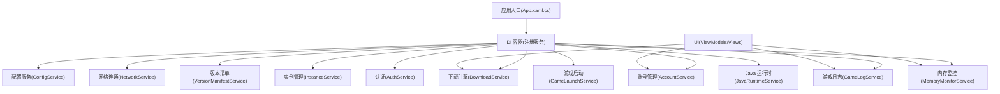
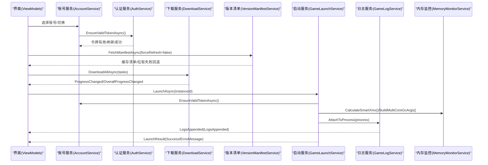
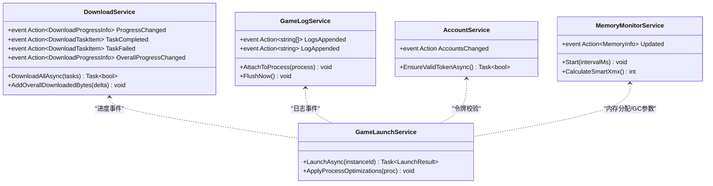
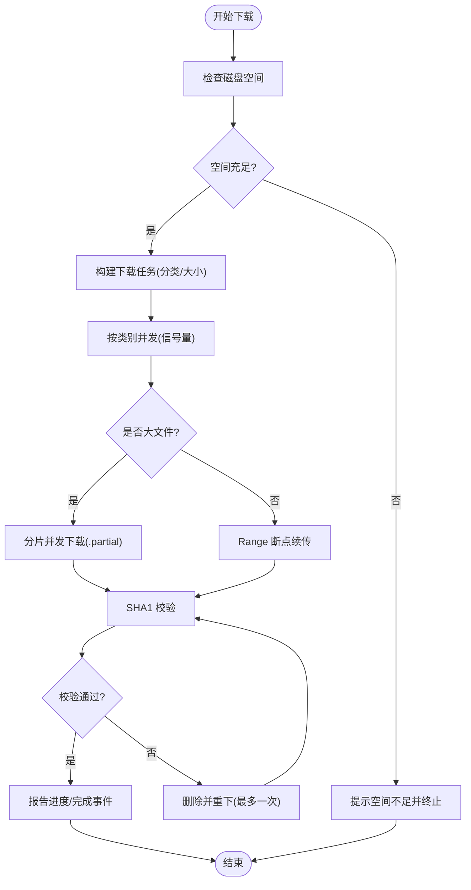
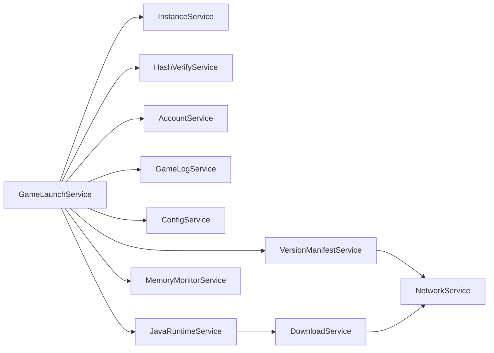
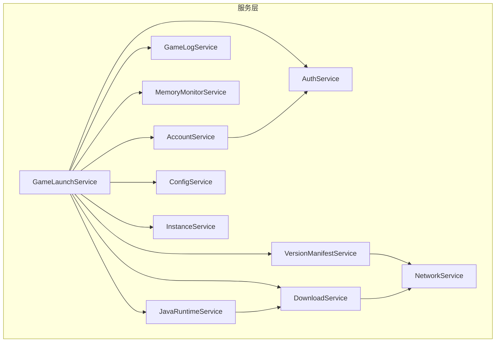

# 服务间通信机制

<cite>
**本文引用的文件**   
- [App.xaml.cs](file://src/FufuLauncher/App.xaml.cs)
- [AccountService.cs](file://src/FufuLauncher/Services/AccountService.cs)
- [AuthService.cs](file://src/FufuLauncher/Services/AuthService.cs)
- [GameLaunchService.cs](file://src/FufuLauncher/Services/GameLaunchService.cs)
- [NetworkService.cs](file://src/FufuLauncher/Services/NetworkService.cs)
- [ConfigService.cs](file://src/FufuLauncher/Services/ConfigService.cs)
- [GameLogService.cs](file://src/FufuLauncher/Services/GameLogService.cs)
- [MemoryMonitorService.cs](file://src/FufuLauncher/Services/MemoryMonitorService.cs)
- [InstanceService.cs](file://src/FufuLauncher/Services/InstanceService.cs)
- [DownloadService.cs](file://src/FufuLauncher/Services/DownloadService.cs)
- [VersionManifestService.cs](file://src/FufuLauncher/Services/VersionManifestService.cs)
- [JavaRuntimeService.cs](file://src/FufuLauncher/Services/JavaRuntimeService.cs)
- [MainViewModel.cs](file://src/FufuLauncher/ViewModels/MainViewModel.cs)
- [ViewModelBase.cs](file://src/FufuLauncher/ViewModels/ViewModelBase.cs)
</cite>

## 目录
1. [简介](#简介)
2. [项目结构](#项目结构)
3. [核心组件](#核心组件)
4. [架构总览](#架构总览)
5. [详细组件分析](#详细组件分析)
6. [依赖关系分析](#依赖关系分析)
7. [性能考量](#性能考量)
8. [故障排除指南](#故障排除指南)
9. [结论](#结论)
10. [附录](#附录)

## 简介
本文件面向“可爱的芙芙启动器”的服务间通信机制，聚焦事件驱动模式、异步消息与回调、状态同步与数据共享策略、服务依赖与调用链、通信协议设计与版本兼容，以及性能优化与故障排除。该启动器采用 .NET WPF + DI（Microsoft.Extensions.DependencyInjection）架构，服务通过依赖注入装配，服务间通信以事件（Action/Func）、回调委托、HTTP 网络请求与进程 I/O 为主，辅以内存缓冲与定时器批量处理，确保 UI 流畅与高吞吐。

## 项目结构
- 应用入口与 DI 容器：App.xaml.cs 负责初始化数据目录、注册全部服务、创建主窗口并捕获全局异常。
- 业务服务层：Services 目录下包含账号、认证、下载、实例、日志、内存监控、网络连通性、版本清单、Java 运行时等。
- 视图模型与页面：ViewModels 与 Views 实现 MVVM，通过 INotifyPropertyChanged 与事件更新 UI。
- 原生交互：NativeInteropService 提供哈希计算、ZIP 解压等高性能操作。

图表来源 
- [App.xaml.cs:131-178](file://src/FufuLauncher/App.xaml.cs#L131-L178)
- [ConfigService.cs:81-148](file://src/FufuLauncher/Services/ConfigService.cs#L81-L148)
- [NetworkService.cs:18-95](file://src/FufuLauncher/Services/NetworkService.cs#L18-L95)
- [DownloadService.cs:56-114](file://src/FufuLauncher/Services/DownloadService.cs#L56-L114)
- [VersionManifestService.cs:172-189](file://src/FufuLauncher/Services/VersionManifestService.cs#L172-L189)
- [InstanceService.cs:51-70](file://src/FufuLauncher/Services/InstanceService.cs#L51-L70)
- [AccountService.cs:12-26](file://src/FufuLauncher/Services/AccountService.cs#L12-L26)
- [AuthService.cs:76-121](file://src/FufuLauncher/Services/AuthService.cs#L76-L121)
- [GameLaunchService.cs:35-65](file://src/FufuLauncher/Services/GameLaunchService.cs#L35-L65)
- [GameLogService.cs:22-52](file://src/FufuLauncher/Services/GameLogService.cs#L22-L52)
- [MemoryMonitorService.cs:26-59](file://src/FufuLauncher/Services/MemoryMonitorService.cs#L26-L59)
- [JavaRuntimeService.cs:50-84](file://src/FufuLauncher/Services/JavaRuntimeService.cs#L50-L84)

章节来源
- [App.xaml.cs:75-178](file://src/FufuLauncher/App.xaml.cs#L75-L178)

## 核心组件
- 事件总线与回调
  - 下载进度与任务完成：DownloadService 暴露 ProgressChanged、TaskCompleted、TaskFailed、OverallProgressChanged 事件，供 UI 订阅。
  - 游戏日志追加：GameLogService 暴露 LogsAppended（批量）与 LogAppended（单行），由 GameLaunchService 在进程输出时触发。
  - 账号变更通知：AccountService 暴露 AccountsChanged，用于 UI 刷新账号列表或当前账号。
  - 内存监控刷新：MemoryMonitorService 暴露 Updated，定时推送系统内存快照。
- 异步消息传递
  - 所有耗时操作使用 async/await，结合 CancellationToken 支持取消；下载、认证、网络探测均具备超时与重试。
- 状态同步与数据共享
  - 配置中心：ConfigService 集中管理用户设置，各服务读取配置决定行为（如下载源、登录模式、JVM 参数）。
  - 实例元数据：InstanceService 维护实例列表与路径，被 GameLaunchService、HashVerifyService 等消费。
  - 账号令牌：AuthService 持久化账号与令牌，AccountService 负责切换与过期校验。
- 服务依赖与调用链
  - GameLaunchService 依赖多个服务完成启动前校验、参数拼接、进程监控。
  - DownloadService 与 VersionManifestService、JavaRuntimeService 协作完成资源与运行库的获取。
- 通信协议与版本兼容
  - HTTP JSON 协议：Mojang 版本清单、XBL/XSTS/MC 令牌交换、Adoptium API、BMCLAPI 镜像映射。
  - 版本兼容：根据 Java 主版本推断 Mojang Runtime 组件名；下载源切换保持 URL 重写规则一致。

章节来源
- [DownloadService.cs:85-90](file://src/FufuLauncher/Services/DownloadService.cs#L85-L90)
- [GameLogService.cs:41-44](file://src/FufuLauncher/Services/GameLogService.cs#L41-L44)
- [AccountService.cs:20-21](file://src/FufuLauncher/Services/AccountService.cs#L20-L21)
- [MemoryMonitorService.cs:54-55](file://src/FufuLauncher/Services/MemoryMonitorService.cs#L54-L55)
- [ConfigService.cs:13-79](file://src/FufuLauncher/Services/ConfigService.cs#L13-L79)
- [InstanceService.cs:27-49](file://src/FufuLauncher/Services/InstanceService.cs#L27-L49)
- [AuthService.cs:29-63](file://src/FufuLauncher/Services/AuthService.cs#L29-L63)
- [VersionManifestService.cs:172-189](file://src/FufuLauncher/Services/VersionManifestService.cs#L172-L189)
- [JavaRuntimeService.cs:25-48](file://src/FufuLauncher/Services/JavaRuntimeService.cs#L25-L48)

## 架构总览
启动器的服务间通信以“事件 + 回调 + HTTP + 进程 I/O”为核心，配合 DI 容器解耦。关键流程包括：
- 登录链路：设备码或本地回调 → MS Token → XBL → XSTS → MC Token → 玩家资料 → 账号持久化。
- 下载链路：版本清单解析 → 构建下载任务 → 分片/断点续传 → SHA1 校验 → 进度事件上报。
- 启动链路：依赖校验 → 账号令牌校验 → Java 完整性校验 → JVM 参数拼接 → 进程启动与监控。

图表来源 
- [AccountService.cs:42-52](file://src/FufuLauncher/Services/AccountService.cs#L42-L52)
- [AuthService.cs:159-265](file://src/FufuLauncher/Services/AuthService.cs#L159-L265)
- [VersionManifestService.cs:205-255](file://src/FufuLauncher/Services/VersionManifestService.cs#L205-L255)
- [DownloadService.cs:222-261](file://src/FufuLauncher/Services/DownloadService.cs#L222-L261)
- [GameLaunchService.cs:104-176](file://src/FufuLauncher/Services/GameLaunchService.cs#L104-L176)
- [GameLogService.cs:54-65](file://src/FufuLauncher/Services/GameLogService.cs#L54-L65)
- [MemoryMonitorService.cs:175-213](file://src/FufuLauncher/Services/MemoryMonitorService.cs#L175-L213)

## 详细组件分析

### 事件驱动与服务间通信模式
- 事件定义与发布
  - DownloadService：ProgressChanged、TaskCompleted、TaskFailed、OverallProgressChanged。
  - GameLogService：LogsAppended（批量）、LogAppended（单行）。
  - AccountService：AccountsChanged。
  - MemoryMonitorService：Updated。
- 订阅与回调
  - UI 订阅事件进行实时更新（进度条、日志滚动、内存可视化）。
  - 服务内部通过事件解耦，避免直接耦合调用。
- 异步与取消
  - 所有长耗时操作使用 async/await，支持 CancellationToken 取消。
  - 下载与认证具备超时保护与指数退避重试。

图表来源 
- [DownloadService.cs:85-90](file://src/FufuLauncher/Services/DownloadService.cs#L85-L90)
- [GameLogService.cs:41-44](file://src/FufuLauncher/Services/GameLogService.cs#L41-L44)
- [AccountService.cs:20-21](file://src/FufuLauncher/Services/AccountService.cs#L20-L21)
- [MemoryMonitorService.cs:54-55](file://src/FufuLauncher/Services/MemoryMonitorService.cs#L54-L55)
- [GameLaunchService.cs:104-176](file://src/FufuLauncher/Services/GameLaunchService.cs#L104-L176)

章节来源
- [DownloadService.cs:85-90](file://src/FufuLauncher/Services/DownloadService.cs#L85-L90)
- [GameLogService.cs:41-44](file://src/FufuLauncher/Services/GameLogService.cs#L41-L44)
- [AccountService.cs:20-21](file://src/FufuLauncher/Services/AccountService.cs#L20-L21)
- [MemoryMonitorService.cs:54-55](file://src/FufuLauncher/Services/MemoryMonitorService.cs#L54-L55)

### 异步消息传递与回调机制
- 下载任务
  - DownloadService.DownloadAllAsync 并发执行任务，按类别独立信号量控制并发。
  - 大文件自动分片，小文件 Range 断点续传；SHA1 校验失败自动重下。
  - 进度事件节流（150ms）保证 UI 平滑，最终强制触发完成态。
- 认证流程
  - AuthService 支持设备码与本地回调两种模式，轮询授权结果，失败区分错误类型。
  - 完整令牌链：MS → XBL → XSTS → MC，失败记录日志并抛出明确异常。
- 日志捕获
  - GameLogService 绑定进程 stdout/stderr，内存缓冲限制行数，定时器批量写盘。
  - 批量事件减少 UI 刷新压力，兼容旧单行事件。

图表来源 
- [DownloadService.cs:222-261](file://src/FufuLauncher/Services/DownloadService.cs#L222-L261)
- [DownloadService.cs:369-451](file://src/FufuLauncher/Services/DownloadService.cs#L369-L451)
- [DownloadService.cs:454-547](file://src/FufuLauncher/Services/DownloadService.cs#L454-L547)
- [DownloadService.cs:584-590](file://src/FufuLauncher/Services/DownloadService.cs#L584-L590)

章节来源
- [DownloadService.cs:222-261](file://src/FufuLauncher/Services/DownloadService.cs#L222-L261)
- [DownloadService.cs:369-451](file://src/FufuLauncher/Services/DownloadService.cs#L369-L451)
- [DownloadService.cs:454-547](file://src/FufuLauncher/Services/DownloadService.cs#L454-L547)
- [DownloadService.cs:584-590](file://src/FufuLauncher/Services/DownloadService.cs#L584-L590)

### 服务状态同步与数据共享策略
- 配置中心（ConfigService）
  - 统一加载/保存用户设置，迁移旧字段，为各服务提供一致的配置项（下载源、登录模式、JVM 参数、内存智能分配等）。
- 实例元数据（InstanceService）
  - 维护实例列表与路径，支持创建、复制、导入、导出；被启动、验证、模组管理等消费。
- 账号与令牌（AuthService/AccountService）
  - 账号持久化到 accounts 目录，令牌过期自动刷新；AccountService 暴露当前账号与变更事件。
- 内存监控（MemoryMonitorService）
  - 定时推送内存快照，提供智能 Xmx/Xms 计算与多核 GC 参数生成。

章节来源
- [ConfigService.cs:94-146](file://src/FufuLauncher/Services/ConfigService.cs#L94-L146)
- [InstanceService.cs:72-116](file://src/FufuLauncher/Services/InstanceService.cs#L72-L116)
- [AuthService.cs:123-155](file://src/FufuLauncher/Services/AuthService.cs#L123-L155)
- [AccountService.cs:28-39](file://src/FufuLauncher/Services/AccountService.cs#L28-L39)
- [MemoryMonitorService.cs:144-155](file://src/FufuLauncher/Services/MemoryMonitorService.cs#L144-L155)

### 服务间依赖关系与调用链
- GameLaunchService 调用链
  - 依赖 InstanceService（实例路径）、VersionManifestService（版本信息）、HashVerifyService（哈希校验）、AccountService（令牌）、GameLogService（日志）、ConfigService（配置）、JavaRuntimeService（Java 路径与完整性）、MemoryMonitorService（内存与 GC 参数）。
- DownloadService 与 VersionManifestService
  - 版本清单解析后构建下载任务，URL 重写遵循同一规则（BMCLAPI 镜像优先）。
- JavaRuntimeService 与 DownloadService
  - JDK 下载与解压，依赖 DownloadService 完成分片下载与校验。

图表来源 
- [GameLaunchService.cs:35-65](file://src/FufuLauncher/Services/GameLaunchService.cs#L35-L65)
- [VersionManifestService.cs:172-189](file://src/FufuLauncher/Services/VersionManifestService.cs#L172-L189)
- [JavaRuntimeService.cs:68-84](file://src/FufuLauncher/Services/JavaRuntimeService.cs#L68-L84)
- [DownloadService.cs:56-114](file://src/FufuLauncher/Services/DownloadService.cs#L56-L114)
- [NetworkService.cs:18-33](file://src/FufuLauncher/Services/NetworkService.cs#L18-L33)

章节来源
- [GameLaunchService.cs:35-65](file://src/FufuLauncher/Services/GameLaunchService.cs#L35-L65)
- [VersionManifestService.cs:172-189](file://src/FufuLauncher/Services/VersionManifestService.cs#L172-L189)
- [JavaRuntimeService.cs:68-84](file://src/FufuLauncher/Services/JavaRuntimeService.cs#L68-L84)
- [DownloadService.cs:56-114](file://src/FufuLauncher/Services/DownloadService.cs#L56-L114)
- [NetworkService.cs:18-33](file://src/FufuLauncher/Services/NetworkService.cs#L18-L33)

### 通信协议设计与版本兼容性
- HTTP JSON 协议
  - Mojang 版本清单（version_manifest_v2.json）与版本详情（arguments/libraries/downloads）。
  - Microsoft OAuth 设备码/授权码流程，XBL/XSTS/MC 令牌交换。
  - Adoptium API 可用版本与二进制下载。
- 镜像源与 URL 重写
  - DownloadService.GetSourceUrl 与 VersionManifestService.RewriteUrl 保持一致的 BMCLAPI 映射规则。
- 版本兼容
  - Java 主版本到 Mojang Runtime 组件映射（jre-legacy/java-runtime-gamma/java-runtime-delta）。
  - 离线账号 UUID 生成遵循 Minecraft 规范（OfflinePlayer:昵称 MD5 v3）。

章节来源
- [VersionManifestService.cs:16-97](file://src/FufuLauncher/Services/VersionManifestService.cs#L16-L97)
- [AuthService.cs:78-85](file://src/FufuLauncher/Services/AuthService.cs#L78-L85)
- [JavaRuntimeService.cs:382-429](file://src/FufuLauncher/Services/JavaRuntimeService.cs#L382-L429)
- [GameLaunchService.cs:387-399](file://src/FufuLauncher/Services/GameLaunchService.cs#L387-L399)
- [AuthService.cs:477-486](file://src/FufuLauncher/Services/AuthService.cs#L477-L486)

## 依赖关系分析
- 松耦合设计
  - 通过 DI 容器注册服务，按需注入，避免静态耦合。
  - 事件驱动降低模块间直接调用，提升可测试性与扩展性。
- 外部依赖
  - HttpClient 统一设置 User-Agent 与超时，避免被限流或拒绝。
  - 文件系统与进程 I/O 使用缓冲与锁保护，防止竞态与损坏。
- 潜在循环依赖
  - 当前服务间无循环引用；如需新增跨服务通知，建议引入轻量事件总线或领域事件。

图表来源 
- [App.xaml.cs:131-178](file://src/FufuLauncher/App.xaml.cs#L131-L178)
- [GameLaunchService.cs:35-65](file://src/FufuLauncher/Services/GameLaunchService.cs#L35-L65)
- [VersionManifestService.cs:172-189](file://src/FufuLauncher/Services/VersionManifestService.cs#L172-L189)
- [JavaRuntimeService.cs:68-84](file://src/FufuLauncher/Services/JavaRuntimeService.cs#L68-L84)
- [DownloadService.cs:56-114](file://src/FufuLauncher/Services/DownloadService.cs#L56-L114)
- [NetworkService.cs:18-33](file://src/FufuLauncher/Services/NetworkService.cs#L18-L33)
- [AccountService.cs:12-26](file://src/FufuLauncher/Services/AccountService.cs#L12-L26)
- [AuthService.cs:76-121](file://src/FufuLauncher/Services/AuthService.cs#L76-L121)
- [ConfigService.cs:81-148](file://src/FufuLauncher/Services/ConfigService.cs#L81-L148)
- [InstanceService.cs:51-70](file://src/FufuLauncher/Services/InstanceService.cs#L51-L70)

章节来源
- [App.xaml.cs:131-178](file://src/FufuLauncher/App.xaml.cs#L131-L178)

## 性能考量
- 事件与 UI 刷新
  - 下载进度节流（150ms）与批量日志事件（200ms）减少 UI 线程压力。
  - 内存监控使用 DispatcherTimer（Background 优先级），避免抢占输入事件。
- IO 与缓冲
  - 应用日志与游戏日志均采用队列+定时器批量写入，避免频繁文件句柄开关。
  - 下载使用 64KB 缓冲与异步读写，提升吞吐。
- 并发与限流
  - 下载按类别独立信号量控制并发，避免互相阻塞。
  - 网络请求设置合理超时与连接限制，快速失败与回退。
- 内存与 CPU
  - 智能内存分配与多核 GC 参数优化，降低卡顿与碎片。
  - 进程优先级与 CPU 亲和性可选增强。

[本节为通用指导，不直接分析具体文件]

## 故障排除指南
- 登录失败
  - 设备码过期/用户取消/令牌交换失败：查看 App.WriteAppLog 中的“[登录]”日志，确认网络与账号购买状态。
  - 本地回调端口占用：检查 54321 端口，或切换到设备码模式。
- 下载失败
  - 磁盘空间不足：DownloadService.CheckDiskSpace 提示；检查剩余空间。
  - SHA1 校验失败：自动重下一次；若仍失败，检查存储介质与权限。
  - 网络超时/限流：启用 BMCLAPI 镜像，观察 LastError 与重试次数。
- 启动失败
  - Java 完整性校验失败：java -version 不可执行，重新安装对应版本。
  - 令牌过期且无法刷新：重新登录或检查 refresh_token 有效性。
  - 进程优先级/亲和性设置失败：不影响启动，查看日志中的警告。
- 日志查看
  - 应用日志：app.log（App.ReadAppLog）
  - 游戏日志：game.log（GameLogService.LogFilePath），打开前调用 FlushNow 确保最新。

章节来源
- [AuthService.cs:159-265](file://src/FufuLauncher/Services/AuthService.cs#L159-L265)
- [AuthService.cs:270-338](file://src/FufuLauncher/Services/AuthService.cs#L270-L338)
- [DownloadService.cs:264-293](file://src/FufuLauncher/Services/DownloadService.cs#L264-L293)
- [DownloadService.cs:584-590](file://src/FufuLauncher/Services/DownloadService.cs#L584-L590)
- [GameLaunchService.cs:157-176](file://src/FufuLauncher/Services/GameLaunchService.cs#L157-L176)
- [GameLogService.cs:169-172](file://src/FufuLauncher/Services/GameLogService.cs#L169-L172)
- [App.xaml.cs:39-73](file://src/FufuLauncher/App.xaml.cs#L39-L73)

## 结论
“可爱的芙芙启动器”的服务间通信以事件驱动为核心，结合异步回调、HTTP 协议与进程 I/O，实现了高内聚、低耦合的模块化架构。通过 DI 容器统一管理依赖，服务间通过事件与配置共享状态，保证了可扩展性与可维护性。在下载、认证、启动等关键路径中，采用了合理的超时、重试、缓冲与并发控制策略，提升了鲁棒性与用户体验。未来可在需要跨域通知的场景引入轻量事件总线，进一步增强解耦能力。

[本节为总结，不直接分析具体文件]

## 附录
- MVVM 基类：ViewModelBase 提供属性变更通知，便于 UI 绑定。
- 主视图模型：MainViewModel 展示应用版本与状态文本。

章节来源
- [ViewModelBase.cs:7-21](file://src/FufuLauncher/ViewModels/ViewModelBase.cs#L7-L21)
- [MainViewModel.cs:8-24](file://src/FufuLauncher/ViewModels/MainViewModel.cs#L8-L24)