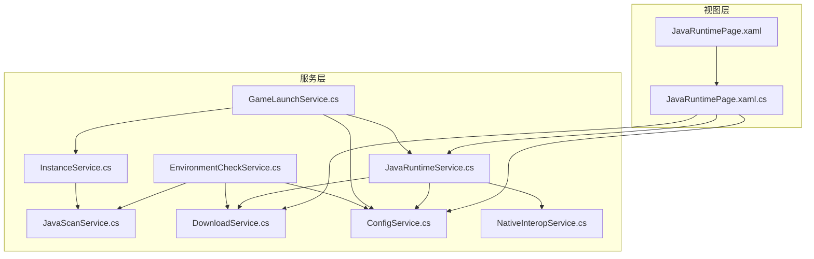
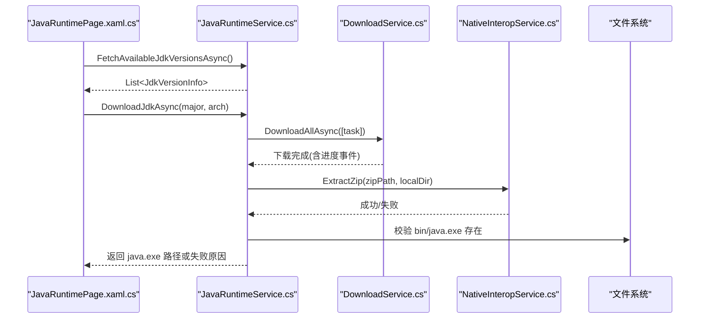
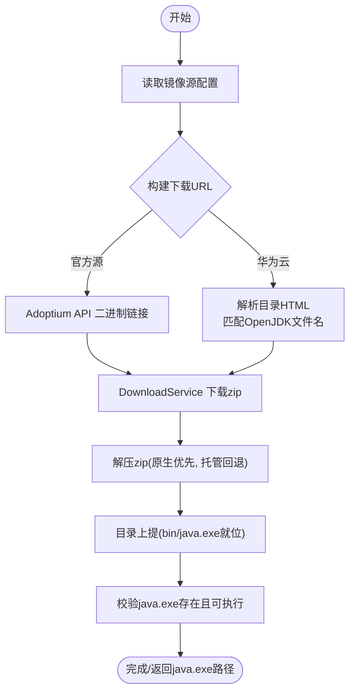
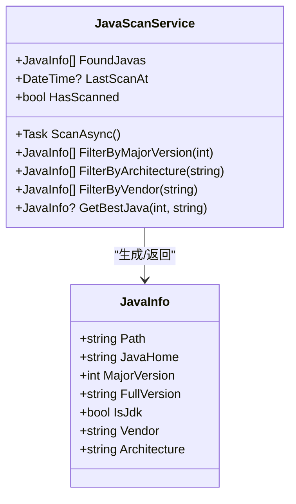
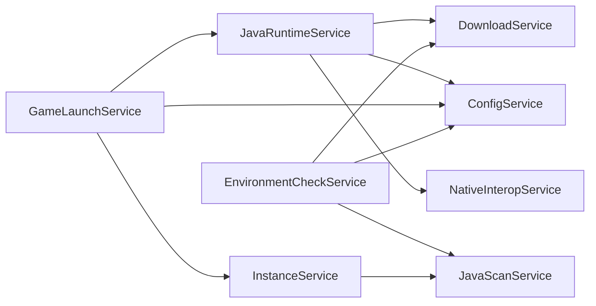

# Java 运行时服务

<cite>
**本文引用的文件**   
- [JavaRuntimeService.cs](file://src/FufuLauncher/Services/JavaRuntimeService.cs)
- [JavaScanService.cs](file://src/FufuLauncher/Services/JavaScanService.cs)
- [DownloadService.cs](file://src/FufuLauncher/Services/DownloadService.cs)
- [ConfigService.cs](file://src/FufuLauncher/Services/ConfigService.cs)
- [NativeInteropService.cs](file://src/FufuLauncher/Services/NativeInteropService.cs)
- [GameLaunchService.cs](file://src/FufuLauncher/Services/GameLaunchService.cs)
- [EnvironmentCheckService.cs](file://src/FufuLauncher/Services/EnvironmentCheckService.cs)
- [InstanceService.cs](file://src/FufuLauncher/Services/InstanceService.cs)
- [JavaRuntimePage.xaml.cs](file://src/FufuLauncher/Views/JavaRuntimePage.xaml.cs)
- [JavaRuntimePage.xaml](file://src/FufuLauncher/Views/JavaRuntimePage.xaml)
</cite>

## 目录
1. [简介](#简介)
2. [项目结构](#项目结构)
3. [核心组件](#核心组件)
4. [架构总览](#架构总览)
5. [详细组件分析](#详细组件分析)
6. [依赖关系分析](#依赖关系分析)
7. [性能考量](#性能考量)
8. [故障排查指南](#故障排查指南)
9. [结论](#结论)
10. [附录：API 参考与使用示例](#附录api-参考与使用示例)

## 简介
本文件为“Java 运行时服务”的完整技术文档，覆盖以下目标：
- JDK 版本检测、自动下载与安装流程
- 不同 Java 版本的兼容性判断、Mojang 运行时组件映射与版本选择策略
- Java 完整性校验机制、文件验证与执行测试
- Java 扫描服务功能：已安装 Java 检测、路径验证与版本信息获取
- 运行时环境配置、环境变量设置与系统集成
- 完整的 API 参考与使用示例
- 常见 Java 环境问题诊断与解决方案

## 项目结构
Java 运行时相关代码主要位于 Services 层与 Views 层：
- Services 层提供运行时管理、扫描、下载、原生能力封装、启动集成等能力
- Views 层提供用户界面交互（镜像源切换、JDK 下载、进度展示）

图表来源
- [JavaRuntimePage.xaml.cs:1-269](file://src/FufuLauncher/Views/JavaRuntimePage.xaml.cs#L1-L269)
- [JavaRuntimeService.cs:1-527](file://src/FufuLauncher/Services/JavaRuntimeService.cs#L1-L527)
- [JavaScanService.cs:1-293](file://src/FufuLauncher/Services/JavaScanService.cs#L1-L293)
- [DownloadService.cs:1-592](file://src/FufuLauncher/Services/DownloadService.cs#L1-L592)
- [ConfigService.cs:1-152](file://src/FufuLauncher/Services/ConfigService.cs#L1-L152)
- [NativeInteropService.cs:1-214](file://src/FufuLauncher/Services/NativeInteropService.cs#L1-L214)
- [GameLaunchService.cs:1-401](file://src/FufuLauncher/Services/GameLaunchService.cs#L1-L401)
- [EnvironmentCheckService.cs:1-215](file://src/FufuLauncher/Services/EnvironmentCheckService.cs#L1-L215)
- [InstanceService.cs:1-253](file://src/FufuLauncher/Services/InstanceService.cs#L1-L253)

章节来源
- [JavaRuntimePage.xaml.cs:1-269](file://src/FufuLauncher/Views/JavaRuntimePage.xaml.cs#L1-L269)
- [JavaRuntimeService.cs:1-527](file://src/FufuLauncher/Services/JavaRuntimeService.cs#L1-L527)
- [JavaScanService.cs:1-293](file://src/FufuLauncher/Services/JavaScanService.cs#L1-L293)
- [DownloadService.cs:1-592](file://src/FufuLauncher/Services/DownloadService.cs#L1-L592)
- [ConfigService.cs:1-152](file://src/FufuLauncher/Services/ConfigService.cs#L1-L152)
- [NativeInteropService.cs:1-214](file://src/FufuLauncher/Services/NativeInteropService.cs#L1-L214)
- [GameLaunchService.cs:1-401](file://src/FufuLauncher/Services/GameLaunchService.cs#L1-L401)
- [EnvironmentCheckService.cs:1-215](file://src/FufuLauncher/Services/EnvironmentCheckService.cs#L1-L215)
- [InstanceService.cs:1-253](file://src/FufuLauncher/Services/InstanceService.cs#L1-L253)

## 核心组件
- JavaRuntimeService：负责本地 runtimes 目录下的完整 JDK 生命周期（发现、下载、解压、校验、列出）
- JavaScanService：本机 Java 按需扫描（JAVA_HOME、Program Files、注册表、PATH），解析 java -version 输出，提供筛选与最优匹配
- DownloadService：多线程分片断点续传下载、SHA1 校验、全局/单文件双进度、失败重试与指数退避
- NativeInteropService：C++ 原生 DLL 加速（哈希计算、ZIP 解压/打包），缺失时回退到托管实现
- ConfigService：配置持久化（含 Java 下载镜像、是否开机自动扫描、JVM 参数等）
- GameLaunchService：游戏启动前依赖校验、Java 完整性二次校验、进程参数拼接与优化（优先级、CPU 亲和性、GC 多核优化）
- EnvironmentCheckService：启动环境自检（.NET 运行时、系统架构、磁盘空间、网络连通、Java 扫描）
- InstanceService：实例元数据管理与创建（包含 JavaMajorVersion、JavaPath 等）

章节来源
- [JavaRuntimeService.cs:1-527](file://src/FufuLauncher/Services/JavaRuntimeService.cs#L1-L527)
- [JavaScanService.cs:1-293](file://src/FufuLauncher/Services/JavaScanService.cs#L1-L293)
- [DownloadService.cs:1-592](file://src/FufuLauncher/Services/DownloadService.cs#L1-L592)
- [NativeInteropService.cs:1-214](file://src/FufuLauncher/Services/NativeInteropService.cs#L1-L214)
- [ConfigService.cs:1-152](file://src/FufuLauncher/Services/ConfigService.cs#L1-L152)
- [GameLaunchService.cs:1-401](file://src/FufuLauncher/Services/GameLaunchService.cs#L1-L401)
- [EnvironmentCheckService.cs:1-215](file://src/FufuLauncher/Services/EnvironmentCheckService.cs#L1-L215)
- [InstanceService.cs:1-253](file://src/FufuLauncher/Services/InstanceService.cs#L1-L253)

## 架构总览
下图展示了从 UI 到服务层的调用链与数据流，包括下载、解压、校验与运行。

图表来源
- [JavaRuntimePage.xaml.cs:158-217](file://src/FufuLauncher/Views/JavaRuntimePage.xaml.cs#L158-L217)
- [JavaRuntimeService.cs:199-277](file://src/FufuLauncher/Services/JavaRuntimeService.cs#L199-L277)
- [DownloadService.cs:222-261](file://src/FufuLauncher/Services/DownloadService.cs#L222-L261)
- [NativeInteropService.cs:85-101](file://src/FufuLauncher/Services/NativeInteropService.cs#L85-L101)

## 详细组件分析

### JavaRuntimeService：JDK 版本检测、下载与安装
- 版本列表获取
  - 官方源通过 Adoptium API 拉取可用主版本集合；国内镜像源基于硬编码支持集（如 8/11/17/21）
  - 对每个已知主版本生成显示名与 LTS 标记，并标注当前镜像是否支持
- 下载与解压
  - 根据镜像源构建 zip 下载 URL（Adoptium 直接重定向 GitHub Release；华为云动态解析目录页选取最新版本）
  - 使用 DownloadService 进行分片/断点续传下载，完成后优先调用原生 ZIP 解压，失败回退托管实现
  - 解压后执行目录上提（将内层 jdk-x.x.x 子目录内容移动到根目录），确保 bin/java.exe 在预期位置
- 完整性校验
  - VerifyJavaIntegrity：检查 java.exe 存在且可执行（java -version 输出包含 version）
- 已安装运行时列举
  - 遍历 runtimes 目录，尝试通过 java -version 探测主版本、架构与厂商；失败则从目录名推断

图表来源
- [JavaRuntimeService.cs:116-158](file://src/FufuLauncher/Services/JavaRuntimeService.cs#L116-L158)
- [JavaRuntimeService.cs:280-335](file://src/FufuLauncher/Services/JavaRuntimeService.cs#L280-L335)
- [JavaRuntimeService.cs:351-379](file://src/FufuLauncher/Services/JavaRuntimeService.cs#L351-L379)
- [JavaRuntimeService.cs:483-510](file://src/FufuLauncher/Services/JavaRuntimeService.cs#L483-L510)

章节来源
- [JavaRuntimeService.cs:1-527](file://src/FufuLauncher/Services/JavaRuntimeService.cs#L1-L527)

### JavaScanService：本机 Java 扫描与版本识别
- 扫描策略（按需触发）
  - JAVA_HOME、Program Files / Program Files (x86)、LocalAppData 目录递归搜索（限制深度）
  - 注册表 HKLM\SOFTWARE\JavaSoft 及 Eclipse Adoptium/Microsoft JDK 键值
  - PATH 环境变量中的 java.exe
- 版本解析
  - 调用 java -version，兼容旧版 1.8.x 格式与新版 9+ 格式
  - 提取主版本、完整版本、架构(x86/x64)、厂商(Oracle/Microsoft/Temurin/Zulu/Corretto/GraalVM)
- 筛选与最优匹配
  - FilterByMajorVersion、FilterByArchitecture、FilterByVendor
  - GetBestJava(requiredMajor, preferArch)：优先匹配指定大版本与架构，否则忽略架构再匹配

图表来源
- [JavaScanService.cs:25-34](file://src/FufuLauncher/Services/JavaScanService.cs#L25-L34)
- [JavaScanService.cs:47-75](file://src/FufuLauncher/Services/JavaScanService.cs#L47-L75)
- [JavaScanService.cs:269-291](file://src/FufuLauncher/Services/JavaScanService.cs#L269-L291)

章节来源
- [JavaScanService.cs:1-293](file://src/FufuLauncher/Services/JavaScanService.cs#L1-L293)

### DownloadService：下载引擎与完整性校验
- 特性
  - 多线程并发下载，按任务类别独立队列互不阻塞
  - 大文件分片下载（>=8MB 自动分片）、断点续传（.partial 临时文件）
  - 双进度：单文件字节级进度 + 全局总进度（节流更新）
  - 失败自动重试（指数退避），下载完成后 SHA1 校验（失败自动重下一次）
  - 官方源/BMCLAPI 镜像源切换与 DNS 容错
- 与 Java 运行时集成
  - Java 运行时下载任务分类为 Java，使用独立信号量控制并发
  - 支持 IsSharded=true 强制分片下载（JDK zip 通常较大）

章节来源
- [DownloadService.cs:1-592](file://src/FufuLauncher/Services/DownloadService.cs#L1-L592)

### NativeInteropService：原生能力封装与回退
- 功能
  - 文件哈希（SHA1/SHA256）
  - ZIP 解压/打包
- 策略
  - 优先调用 C++ 原生 DLL（FufuNative.dll），失败或不可用时回退到托管实现
  - 首次调用探测可用性并缓存结果，避免重复开销

章节来源
- [NativeInteropService.cs:1-214](file://src/FufuLauncher/Services/NativeInteropService.cs#L1-L214)

### ConfigService：配置项与环境变量
- 关键配置
  - JavaDownloadMirror：下载镜像源（Official/Huaweicloud）
  - AutoScanJavaOnStartup：是否开机自动全盘扫描 Java（默认 false，改为按需校验）
  - JVM 参数：Xms/Xmx、ExtraJvmArgs、多核 GC 优化、高优先级、CPU 亲和性等
- 持久化
  - 读写 config.json，支持字段迁移与兼容旧配置

章节来源
- [ConfigService.cs:1-152](file://src/FufuLauncher/Services/ConfigService.cs#L1-L152)

### GameLaunchService：启动前校验与 Mojang 运行时映射
- 启动前校验
  - 依赖文件校验（client.jar、libraries）
  - Java 完整性二次校验（java -version 可执行）
- Mojang 运行时组件映射
  - InferComponentByMajorVersion：根据 Java 主版本推断 Mojang runtime component（jre-legacy、java-runtime-alpha/gamma/delta）
- 进程优化
  - 智能内存分配（AutoMemoryMode）
  - 多核 GC 优化参数注入
  - 进程优先级与 CPU 亲和性设置

章节来源
- [GameLaunchService.cs:104-177](file://src/FufuLauncher/Services/GameLaunchService.cs#L104-L177)
- [GameLaunchService.cs:386-399](file://src/FufuLauncher/Services/GameLaunchService.cs#L386-L399)

### EnvironmentCheckService：启动环境自检
- 检测项
  - .NET 运行时、操作系统架构、磁盘空间、网络连通、Java 扫描
- Java 扫描策略
  - 受 AutoScanJavaOnStartup 控制，默认禁用自动扫描，复用上次扫描结果或提示手动扫描

章节来源
- [EnvironmentCheckService.cs:52-215](file://src/FufuLauncher/Services/EnvironmentCheckService.cs#L52-L215)

### InstanceService：实例与 Java 绑定
- 实例创建时自动选择最优 Java（基于 JavaScanService.GetBestJava）
- 保存实例元数据（JavaMajorVersion、JavaPath、Xms/Xmx 等）

章节来源
- [InstanceService.cs:94-116](file://src/FufuLauncher/Services/InstanceService.cs#L94-L116)

### JavaRuntimePage：UI 交互与下载进度可视化
- 功能
  - 镜像源切换（官方/华为云）
  - 已安装运行时卡片化展示
  - 完整 JDK 下载（任意主版本 + x64/x86）
  - 下载进度可视化（总进度 + 单文件进度 + 速度）
- 事件绑定
  - 订阅 DownloadService 的全局与单文件进度事件
  - 订阅 JavaRuntimeService 的阶段进度事件

章节来源
- [JavaRuntimePage.xaml.cs:1-269](file://src/FufuLauncher/Views/JavaRuntimePage.xaml.cs#L1-L269)
- [JavaRuntimePage.xaml:1-132](file://src/FufuLauncher/Views/JavaRuntimePage.xaml#L1-L132)

## 依赖关系分析
- JavaRuntimeService 依赖 DownloadService、ConfigService、NativeInteropService
- JavaScanService 独立于下载模块，仅依赖系统 API 与注册表
- GameLaunchService 依赖 JavaRuntimeService（完整性校验）、ConfigService（JVM 参数）、InstanceService（实例元数据）
- EnvironmentCheckService 依赖 JavaScanService、NetworkService、ConfigService

图表来源
- [JavaRuntimeService.cs:68-84](file://src/FufuLauncher/Services/JavaRuntimeService.cs#L68-L84)
- [GameLaunchService.cs:48-65](file://src/FufuLauncher/Services/GameLaunchService.cs#L48-L65)
- [EnvironmentCheckService.cs:43-50](file://src/FufuLauncher/Services/EnvironmentCheckService.cs#L43-L50)
- [InstanceService.cs:66-70](file://src/FufuLauncher/Services/InstanceService.cs#L66-L70)

章节来源
- [JavaRuntimeService.cs:1-527](file://src/FufuLauncher/Services/JavaRuntimeService.cs#L1-L527)
- [GameLaunchService.cs:1-401](file://src/FufuLauncher/Services/GameLaunchService.cs#L1-L401)
- [EnvironmentCheckService.cs:1-215](file://src/FufuLauncher/Services/EnvironmentCheckService.cs#L1-L215)
- [InstanceService.cs:1-253](file://src/FufuLauncher/Services/InstanceService.cs#L1-L253)

## 性能考量
- 下载性能
  - 大文件分片并发下载（阈值 8MB，默认 4 分片）
  - 断点续传减少重复下载
  - 每类别独立信号量避免互相阻塞
- 解压性能
  - 优先原生 ZIP 解压，失败回退托管实现
- 进度更新
  - 全局总进度节流（150ms）提升视觉流畅度
- 进程优化
  - 可选高优先级与 CPU 亲和性，减少调度延迟

[本节为通用性能建议，不直接分析具体文件]

## 故障排查指南
- 下载失败
  - 检查镜像源支持情况（官方源可能较慢，华为云仅支持部分 LTS）
  - 查看 DownloadService 日志（失败次数、指数退避）
  - 确认磁盘空间充足（CheckDiskSpace）
- 解压失败
  - 原生 DLL 缺失时自动回退托管实现，若仍失败检查 zip 完整性
- Java 完整性校验失败
  - java -version 无法执行，可能是文件损坏或被安全软件拦截
  - 建议重新下载对应版本或使用其他镜像源
- 扫描不到 Java
  - 检查 JAVA_HOME、PATH、注册表键值
  - 手动触发 JavaScanService.ScanAsync()
- 启动失败
  - 确认实例绑定的 JavaPath 指向有效 java.exe
  - 查看 GameLaunchService 的依赖校验与完整性校验结果

章节来源
- [DownloadService.cs:264-293](file://src/FufuLauncher/Services/DownloadService.cs#L264-L293)
- [JavaRuntimeService.cs:483-510](file://src/FufuLauncher/Services/JavaRuntimeService.cs#L483-L510)
- [EnvironmentCheckService.cs:176-215](file://src/FufuLauncher/Services/EnvironmentCheckService.cs#L176-L215)
- [GameLaunchService.cs:129-177](file://src/FufuLauncher/Services/GameLaunchService.cs#L129-L177)

## 结论
Java 运行时服务通过分层设计实现了可靠的 JDK 下载、安装、校验与系统集成。结合本机扫描与 UI 交互，用户可灵活选择镜像源与版本，并在启动前获得充分的完整性保障。整体方案兼顾性能与稳定性，适用于多实例隔离与复杂环境部署。

[本节为总结性内容，不直接分析具体文件]

## 附录：API 参考与使用示例

### JavaRuntimeService API
- 方法
  - FetchAvailableJdkVersionsAsync(): 获取可下载的完整 JDK 版本列表
  - DownloadJdkAsync(majorVersion, arch): 下载并安装指定主版本与架构的 JDK
  - ListInstalledRuntimes(): 列出本地已安装的完整 JDK 运行时
  - VerifyJavaIntegrity(javaExe): 校验 java.exe 完整性（存在且可执行）
  - GetCurrentMirrorLabel(): 获取当前镜像源显示名
- 事件
  - ProgressChanged: 阶段进度回调（下载、解压、校验等）

章节来源
- [JavaRuntimeService.cs:116-158](file://src/FufuLauncher/Services/JavaRuntimeService.cs#L116-L158)
- [JavaRuntimeService.cs:199-277](file://src/FufuLauncher/Services/JavaRuntimeService.cs#L199-L277)
- [JavaRuntimeService.cs:382-429](file://src/FufuLauncher/Services/JavaRuntimeService.cs#L382-L429)
- [JavaRuntimeService.cs:483-510](file://src/FufuLauncher/Services/JavaRuntimeService.cs#L483-L510)

### JavaScanService API
- 方法
  - ScanAsync(): 触发本机 Java 扫描
  - FilterByMajorVersion(major): 按主版本筛选
  - FilterByArchitecture(arch): 按架构筛选
  - FilterByVendor(vendor): 按厂商筛选
  - GetBestJava(requiredMajor, preferArch): 获取最优 Java
- 属性
  - FoundJavas: 扫描到的 Java 列表
  - LastScanAt: 最后一次扫描时间
  - HasScanned: 是否已扫描过

章节来源
- [JavaScanService.cs:47-75](file://src/FufuLauncher/Services/JavaScanService.cs#L47-L75)
- [JavaScanService.cs:269-291](file://src/FufuLauncher/Services/JavaScanService.cs#L269-L291)

### DownloadService API
- 方法
  - DownloadAllAsync(tasks): 批量下载，返回全部是否成功
  - ResetOverallProgress(): 重置全局总进度
  - AddOverallTotalBytes(bytes)/AddOverallDownloadedBytes(deltaBytes): 累加总进度
  - VerifySha1(filePath, expectedSha1): 校验文件 SHA1
  - Pause()/Cancel(): 暂停/取消下载
- 事件
  - ProgressChanged: 单文件进度
  - OverallProgressChanged: 全局总进度
  - TaskCompleted/TaskFailed: 任务完成/失败

章节来源
- [DownloadService.cs:222-261](file://src/FufuLauncher/Services/DownloadService.cs#L222-L261)
- [DownloadService.cs:117-132](file://src/FufuLauncher/Services/DownloadService.cs#L117-L132)
- [DownloadService.cs:135-169](file://src/FufuLauncher/Services/DownloadService.cs#L135-L169)
- [DownloadService.cs:584-590](file://src/FufuLauncher/Services/DownloadService.cs#L584-L590)

### GameLaunchService API
- 方法
  - LaunchAsync(instanceId): 启动游戏（含依赖校验与 Java 完整性校验）
  - VerifyDependenciesAsync(instanceId): 校验依赖文件
  - KillGame(): 终止游戏进程
- 静态方法
  - InferComponentByMajorVersion(majorVersion): 推断 Mojang 运行时组件名

章节来源
- [GameLaunchService.cs:104-177](file://src/FufuLauncher/Services/GameLaunchService.cs#L104-L177)
- [GameLaunchService.cs:386-399](file://src/FufuLauncher/Services/GameLaunchService.cs#L386-L399)

### 使用示例（概念性）
- 下载指定版本 JDK
  - 调用 JavaRuntimeService.FetchAvailableJdkVersionsAsync() 获取版本列表
  - 选择目标版本与架构，调用 DownloadJdkAsync()
  - 订阅 ProgressChanged 与 DownloadService 的进度事件以更新 UI
- 扫描本机 Java
  - 调用 JavaScanService.ScanAsync()
  - 使用 FilterByMajorVersion/GetBestJava 选择合适版本
- 启动游戏
  - 调用 GameLaunchService.LaunchAsync(instanceId)
  - 处理 LaunchResult.Success/ErrorMessage

[本节为概念性示例，不直接分析具体文件]