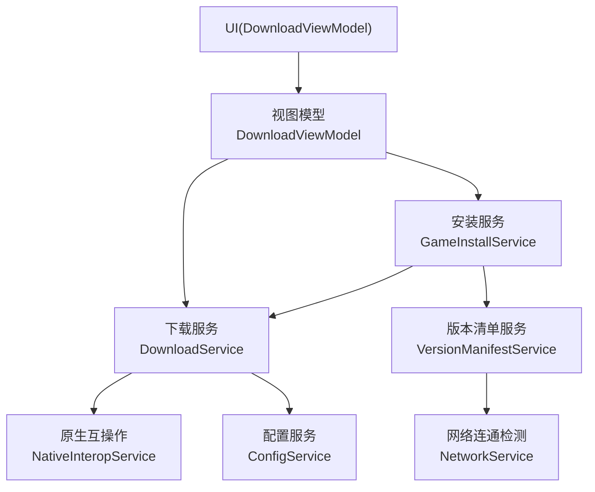
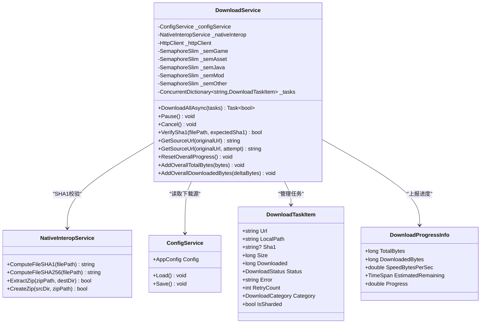
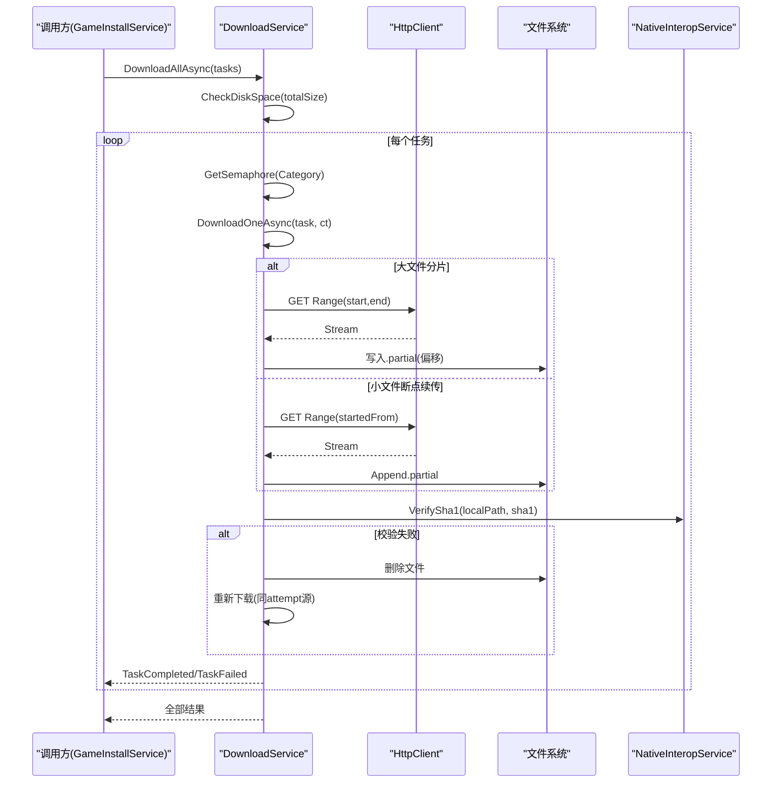
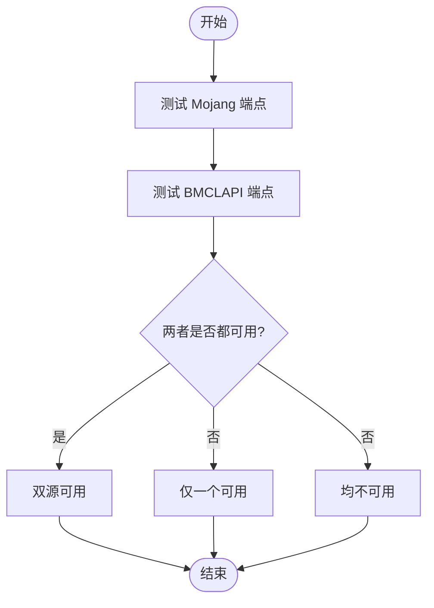
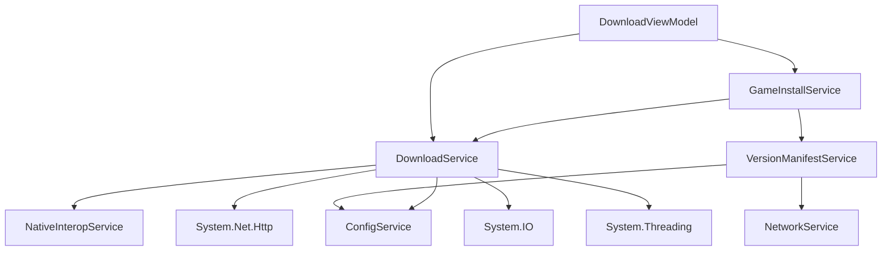
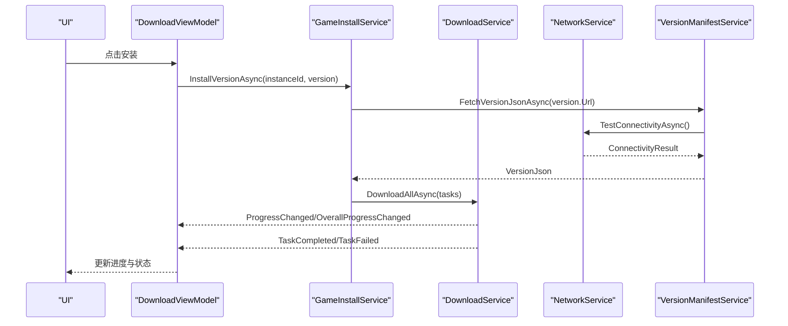

# 下载服务

<cite>
**本文引用的文件**   
- [DownloadService.cs](file://src/FufuLauncher/Services/DownloadService.cs)
- [NetworkService.cs](file://src/FufuLauncher/Services/NetworkService.cs)
- [ConfigService.cs](file://src/FufuLauncher/Services/ConfigService.cs)
- [NativeInteropService.cs](file://src/FufuLauncher/Services/NativeInteropService.cs)
- [GameInstallService.cs](file://src/FufuLauncher/Services/GameInstallService.cs)
- [VersionManifestService.cs](file://src/FufuLauncher/Services/VersionManifestService.cs)
- [DownloadViewModel.cs](file://src/FufuLauncher/ViewModels/DownloadViewModel.cs)
- [README.md](file://README.md)
</cite>

## 目录
1. [简介](#简介)
2. [项目结构](#项目结构)
3. [核心组件](#核心组件)
4. [架构总览](#架构总览)
5. [详细组件分析](#详细组件分析)
6. [依赖关系分析](#依赖关系分析)
7. [性能与内存优化](#性能与内存优化)
8. [API 接口文档](#api-接口文档)
9. [与 NetworkService 的协作与数据流](#与-networkservice-的协作与数据流)
10. [故障排除指南](#故障排除指南)
11. [结论](#结论)

## 简介
本技术文档围绕 DownloadService（多线程分片断点续传下载引擎）展开，系统阐述其架构设计、任务管理、进度监控、错误重试、镜像源切换机制、HTTP 客户端配置、连接池与超时控制、并发策略、性能优化、内存管理与资源释放最佳实践。同时给出完整的 API 说明以及与 NetworkService 的协作关系和数据流转过程，并附故障排除指南。

## 项目结构
- 下载引擎位于 Services 层，提供统一的下载能力；UI 通过 ViewModels 订阅事件展示进度与状态；安装流程由 GameInstallService 编排，调用 DownloadService 完成批量下载。
- 网络连通性检测由 NetworkService 负责，版本清单由 VersionManifestService 拉取，配置由 ConfigService 管理，哈希校验由 NativeInteropService 提供高性能实现。

**图表来源** 
- [DownloadService.cs:1-120](file://src/FufuLauncher/Services/DownloadService.cs#L1-L120)
- [DownloadViewModel.cs:1-150](file://src/FufuLauncher/ViewModels/DownloadViewModel.cs#L1-L150)
- [GameInstallService.cs:1-120](file://src/FufuLauncher/Services/GameInstallService.cs#L1-L120)
- [VersionManifestService.cs:170-200](file://src/FufuLauncher/Services/VersionManifestService.cs#L170-L200)
- [NetworkService.cs:1-40](file://src/FufuLauncher/Services/NetworkService.cs#L1-L40)

**章节来源**
- [README.md:1-53](file://README.md#L1-L53)

## 核心组件
- DownloadService：多线程分片断点续传下载引擎，支持按类别并发隔离、自动重试、SHA1 校验、镜像源切换、全局与单文件双进度。
- NetworkService：Mojang/BMCLAPI 连通性检测，返回延迟与可用性。
- ConfigService：应用配置持久化，包含下载源选择等。
- NativeInteropService：C++ 原生 DLL 加速 SHA1/ZIP，失败回退托管实现。
- GameInstallService：游戏版本安装编排，调用 DownloadService 批量下载并修复损坏文件。
- VersionManifestService：拉取版本清单，分类展示。
- DownloadViewModel：UI 绑定下载进度、状态提示与用户交互。

**章节来源**
- [DownloadService.cs:28-114](file://src/FufuLauncher/Services/DownloadService.cs#L28-L114)
- [NetworkService.cs:18-33](file://src/FufuLauncher/Services/NetworkService.cs#L18-L33)
- [ConfigService.cs:13-49](file://src/FufuLauncher/Services/ConfigService.cs#L13-L49)
- [NativeInteropService.cs:20-55](file://src/FufuLauncher/Services/NativeInteropService.cs#L20-L55)
- [GameInstallService.cs:50-120](file://src/FufuLauncher/Services/GameInstallService.cs#L50-L120)
- [VersionManifestService.cs:172-200](file://src/FufuLauncher/Services/VersionManifestService.cs#L172-L200)
- [DownloadViewModel.cs:66-146](file://src/FufuLauncher/ViewModels/DownloadViewModel.cs#L66-L146)

## 架构总览
DownloadService 作为下载核心，采用以下关键设计：
- 并发控制：按任务类别使用独立 SemaphoreSlim，避免相互阻塞。
- 大文件分片：>=8MB 自动分片并行下载，小文件单连接 Range 断点续传。
- 断点续传：.partial 临时文件 + 已下载字节数记录，中断后继续。
- 错误重试：指数退避，默认 3 次；SHA1 校验失败自动重下一次。
- 镜像源切换：官方源失败时降级到 BMCLAPI 国内镜像。
- 进度上报：单文件字节级进度与全局总进度（节流合并），供 UI 显示。
- HTTP 客户端：统一 HttpClient，设置最大连接数、超时与 User-Agent。

**图表来源** 
- [DownloadService.cs:28-114](file://src/FufuLauncher/Services/DownloadService.cs#L28-L114)
- [NativeInteropService.cs:38-73](file://src/FufuLauncher/Services/NativeInteropService.cs#L38-L73)
- [ConfigService.cs:88-151](file://src/FufuLauncher/Services/ConfigService.cs#L88-L151)

## 详细组件分析

### DownloadService 下载引擎
- 任务生命周期：Pending → Downloading → Verifying → Completed/Failed/Cancelled
- 分片策略：根据文件大小与 ShardThreshold/ShardCount 计算分片范围，预分配 .partial 文件，各分片写入不重叠偏移。
- 断点续传：优先从 .partial 恢复位置；若服务端不支持断点续传（返回 200），则从头开始。
- 重试机制：指数退避（1s, 2s, 4s...），超过 MaxRetry 标记失败；SHA1 失败最多重下一次。
- 镜像源切换：attempt=0 使用配置源；attempt>0 且配置为 Mojang 时强制切换到 BMCLAPI。
- 进度上报：单文件进度与全局总进度（节流 150ms，下载完成强制触发）。

**图表来源** 
- [DownloadService.cs:222-366](file://src/FufuLauncher/Services/DownloadService.cs#L222-L366)
- [DownloadService.cs:368-451](file://src/FufuLauncher/Services/DownloadService.cs#L368-L451)
- [DownloadService.cs:454-547](file://src/FufuLauncher/Services/DownloadService.cs#L454-L547)
- [NativeInteropService.cs:38-55](file://src/FufuLauncher/Services/NativeInteropService.cs#L38-L55)

**章节来源**
- [DownloadService.cs:28-114](file://src/FufuLauncher/Services/DownloadService.cs#L28-L114)
- [DownloadService.cs:222-366](file://src/FufuLauncher/Services/DownloadService.cs#L222-L366)
- [DownloadService.cs:368-451](file://src/FufuLauncher/Services/DownloadService.cs#L368-L451)
- [DownloadService.cs:454-547](file://src/FufuLauncher/Services/DownloadService.cs#L454-L547)
- [DownloadService.cs:568-591](file://src/FufuLauncher/Services/DownloadService.cs#L568-L591)

### NetworkService 网络连通检测
- 检测目标：Mojang 官方源与 BMCLAPI 国内镜像源。
- 返回结果：连通状态与延迟，便于 UI 提示与决策。

**图表来源** 
- [NetworkService.cs:34-76](file://src/FufuLauncher/Services/NetworkService.cs#L34-L76)

**章节来源**
- [NetworkService.cs:18-76](file://src/FufuLauncher/Services/NetworkService.cs#L18-L76)

### ConfigService 配置管理
- 下载源配置：DownloadSource 字段决定默认源（BMCLAPI/Mojang）。
- 其他配置：主题、Java 路径、JVM 参数、分辨率、背景等。

**章节来源**
- [ConfigService.cs:13-49](file://src/FufuLauncher/Services/ConfigService.cs#L13-L49)
- [ConfigService.cs:88-151](file://src/FufuLauncher/Services/ConfigService.cs#L88-L151)

### NativeInteropService 原生加速
- 优先调用 C++ 原生 DLL 进行 SHA1/SHA256 计算与 ZIP 解压/打包。
- 若 DLL 缺失或调用失败，自动回退到纯 .NET 托管实现，保证功能等价。

**章节来源**
- [NativeInteropService.cs:20-73](file://src/FufuLauncher/Services/NativeInteropService.cs#L20-L73)
- [NativeInteropService.cs:84-119](file://src/FufuLauncher/Services/NativeInteropService.cs#L84-L119)
- [NativeInteropService.cs:162-212](file://src/FufuLauncher/Services/NativeInteropService.cs#L162-L212)

### GameInstallService 安装编排
- 完整安装流程：解析版本 JSON → 下载 client.jar → 下载 libraries → 下载资产索引与对象 → 校验修复 → 自动下载 Java 运行时。
- 调用 DownloadService.DownloadAllAsync 执行批量下载，并在完成后进行完整性校验与修复。

**章节来源**
- [GameInstallService.cs:83-286](file://src/FufuLauncher/Services/GameInstallService.cs#L83-L286)
- [GameInstallService.cs:289-323](file://src/FufuLauncher/Services/GameInstallService.cs#L289-L323)

### DownloadViewModel UI 绑定
- 订阅 DownloadService 的单文件进度、全局总进度、任务完成/失败事件，更新 UI 显示。
- 协调安装流程，提示用户创建实例与下载结果。

**章节来源**
- [DownloadViewModel.cs:66-146](file://src/FufuLauncher/ViewModels/DownloadViewModel.cs#L66-L146)
- [DownloadViewModel.cs:218-304](file://src/FufuLauncher/ViewModels/DownloadViewModel.cs#L218-L304)

## 依赖关系分析
- DownloadService 依赖 ConfigService（下载源）、NativeInteropService（SHA1）、System.Net.Http（HTTP 请求）、System.IO（文件操作）、System.Threading（并发控制）。
- GameInstallService 依赖 DownloadService、VersionManifestService、HashVerifyService、InstanceService、JavaRuntimeService。
- VersionManifestService 依赖 NetworkService 与 ConfigService。
- DownloadViewModel 依赖上述服务并通过事件驱动更新 UI。

**图表来源** 
- [DownloadService.cs:17-25](file://src/FufuLauncher/Services/DownloadService.cs#L17-L25)
- [GameInstallService.cs:50-80](file://src/FufuLauncher/Services/GameInstallService.cs#L50-L80)
- [VersionManifestService.cs:172-189](file://src/FufuLauncher/Services/VersionManifestService.cs#L172-L189)
- [DownloadViewModel.cs:1-15](file://src/FufuLauncher/ViewModels/DownloadViewModel.cs#L1-L15)

**章节来源**
- [DownloadService.cs:17-25](file://src/FufuLauncher/Services/DownloadService.cs#L17-L25)
- [GameInstallService.cs:50-80](file://src/FufuLauncher/Services/GameInstallService.cs#L50-L80)
- [VersionManifestService.cs:172-189](file://src/FufuLauncher/Services/VersionManifestService.cs#L172-L189)
- [DownloadViewModel.cs:1-15](file://src/FufuLauncher/ViewModels/DownloadViewModel.cs#L1-L15)

## 性能与内存优化
- 并发控制：按类别独立信号量限制并发，避免跨类别阻塞。
- 分片下载：大文件多 Range 并行，减少单连接瓶颈，提升吞吐。
- I/O 缓冲：64KB 缓冲区异步读写，降低 GC 压力。
- 进度节流：全局总进度 150ms 节流，避免 UI 频繁刷新。
- 连接池：MaxConnectionsPerServer=64，合理复用连接。
- 超时控制：HttpClient 总超时 5 分钟，每请求首字节 30 秒保护。
- 内存管理：及时释放流与文件句柄，避免泄漏；.partial 文件在完成后重命名。
- 磁盘空间检查：下载前预留 1GB 缓冲，防止中途失败。

[本节为通用指导，无需具体文件引用]

## API 接口文档

### DownloadService 主要方法
- DownloadAllAsync(List<DownloadTaskItem> tasks) → Task<bool>
  - 描述：批量下载任务，返回是否全部成功。
  - 参数：tasks 列表，每项包含 URL、本地路径、SHA1、大小、类别等。
  - 返回值：true 表示全部成功，false 表示存在失败。
  - 异常：可能抛出 OperationCanceledException（取消）。

- Pause() → void
  - 描述：暂停所有正在下载的任务（通过取消令牌与状态标记）。

- Cancel() → void
  - 描述：取消所有任务，标记为 Cancelled。

- VerifySha1(string filePath, string? expectedSha1) → bool
  - 描述：校验文件 SHA1，失败返回 false。
  - 参数：filePath 文件路径，expectedSha1 期望值。
  - 返回值：校验结果。

- GetSourceUrl(string originalUrl) → string
  - 描述：根据配置获取下载源 URL（BMCLAPI/Mojang）。

- GetSourceUrl(string originalUrl, int attempt) → string
  - 描述：带重试次数获取 URL，attempt>0 且配置为 Mojang 时强制切换到 BMCLAPI。

- ResetOverallProgress() → void
  - 描述：重置全局总进度统计。

- AddOverallTotalBytes(long bytes) → void
  - 描述：累加全局总字节数。

- AddOverallDownloadedBytes(long deltaBytes) → void
  - 描述：累加全局已下载字节数并触发进度事件（节流）。

- CheckDiskSpace(long requiredBytes, out string message) → bool
  - 描述：检查磁盘剩余空间是否足够（含 1GB 缓冲）。

### DownloadTaskItem 属性
- Url: string — 下载源地址
- LocalPath: string — 本地保存路径
- Sha1: string? — 期望 SHA1
- Size: long — 文件大小
- Downloaded: long — 已下载字节数
- Status: DownloadStatus — 任务状态
- Error: string — 错误信息
- RetryCount: int — 重试次数
- Category: DownloadCategory — 任务类别
- IsSharded: bool — 是否分片下载

### DownloadProgressInfo 属性
- TotalBytes: long — 总字节数
- DownloadedBytes: long — 已下载字节数
- SpeedBytesPerSec: double — 速度（字节/秒）
- EstimatedRemaining: TimeSpan — 预计剩余时间
- Progress: double — 进度百分比

### 事件
- ProgressChanged(DownloadProgressInfo) — 单文件进度
- OverallProgressChanged(DownloadProgressInfo) — 全局总进度
- TaskCompleted(DownloadTaskItem) — 任务完成
- TaskFailed(DownloadTaskItem) — 任务失败

**章节来源**
- [DownloadService.cs:222-366](file://src/FufuLauncher/Services/DownloadService.cs#L222-L366)
- [DownloadService.cs:368-451](file://src/FufuLauncher/Services/DownloadService.cs#L368-L451)
- [DownloadService.cs:454-547](file://src/FufuLauncher/Services/DownloadService.cs#L454-L547)
- [DownloadService.cs:568-591](file://src/FufuLauncher/Services/DownloadService.cs#L568-L591)
- [DownloadService.cs:28-54](file://src/FufuLauncher/Services/DownloadService.cs#L28-L54)

## 与 NetworkService 的协作与数据流
- NetworkService 提供连通性检测结果，VersionManifestService 基于此拉取版本清单。
- DownloadService 在下载过程中根据配置与重试次数动态切换镜像源，确保稳定性。
- 数据流：UI → DownloadViewModel → GameInstallService → DownloadService → NetworkService（间接）→ 下载源。

**图表来源** 
- [DownloadViewModel.cs:218-304](file://src/FufuLauncher/ViewModels/DownloadViewModel.cs#L218-L304)
- [GameInstallService.cs:83-286](file://src/FufuLauncher/Services/GameInstallService.cs#L83-L286)
- [VersionManifestService.cs:172-200](file://src/FufuLauncher/Services/VersionManifestService.cs#L172-L200)
- [NetworkService.cs:34-76](file://src/FufuLauncher/Services/NetworkService.cs#L34-L76)

**章节来源**
- [DownloadViewModel.cs:218-304](file://src/FufuLauncher/ViewModels/DownloadViewModel.cs#L218-L304)
- [GameInstallService.cs:83-286](file://src/FufuLauncher/Services/GameInstallService.cs#L83-L286)
- [VersionManifestService.cs:172-200](file://src/FufuLauncher/Services/VersionManifestService.cs#L172-L200)
- [NetworkService.cs:34-76](file://src/FufuLauncher/Services/NetworkService.cs#L34-L76)

## 故障排除指南
- 下载失败
  - 检查网络连接与防火墙设置。
  - 尝试切换下载源（BMCLAPI/Mojang）。
  - 查看日志中的错误信息与重试次数。
- 进度条不更新
  - 确认全局总进度是否正确累加（AddOverallDownloadedBytes）。
  - 检查节流逻辑是否过于保守（当前 150ms）。
- 磁盘空间不足
  - 运行前检查磁盘空间（CheckDiskSpace），预留 1GB 缓冲。
- SHA1 校验失败
  - 自动重下一次；若仍失败，检查存储介质与网络稳定性。
- 连接超时
  - 调整 HttpClient 超时设置与每请求首字节超时。
- 原生 DLL 缺失
  - NativeInteropService 会自动回退到托管实现，不影响功能。

**章节来源**
- [DownloadService.cs:264-293](file://src/FufuLauncher/Services/DownloadService.cs#L264-L293)
- [DownloadService.cs:319-334](file://src/FufuLauncher/Services/DownloadService.cs#L319-L334)
- [NativeInteropService.cs:40-55](file://src/FufuLauncher/Services/NativeInteropService.cs#L40-L55)

## 结论
DownloadService 提供了稳定高效的下载引擎，具备多线程分片、断点续传、错误重试、镜像源切换与双进度监控等特性。通过与 NetworkService、ConfigService、NativeInteropService 等模块协作，实现了完整的下载与安装流程。建议在生产环境中根据网络状况与硬件配置调优并发与超时参数，并结合日志与监控持续优化用户体验。