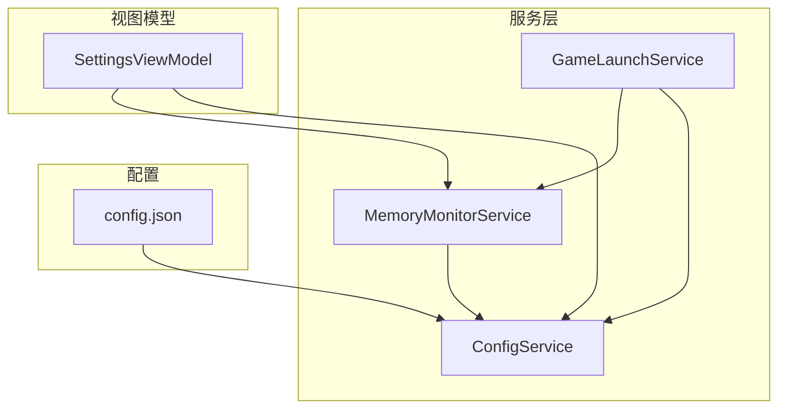
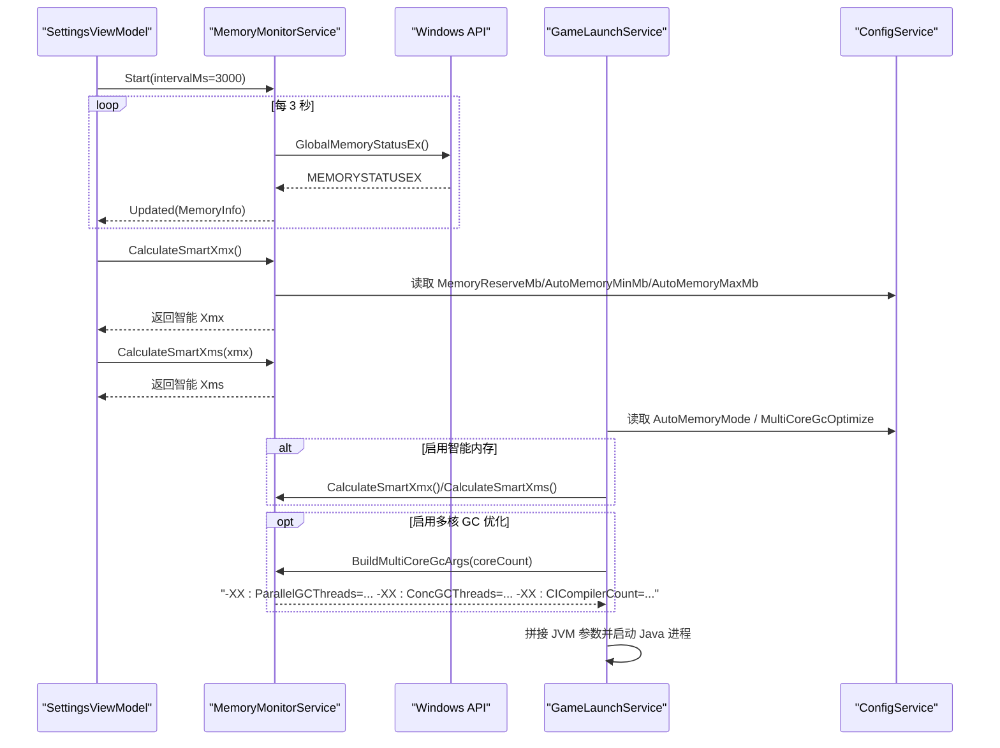
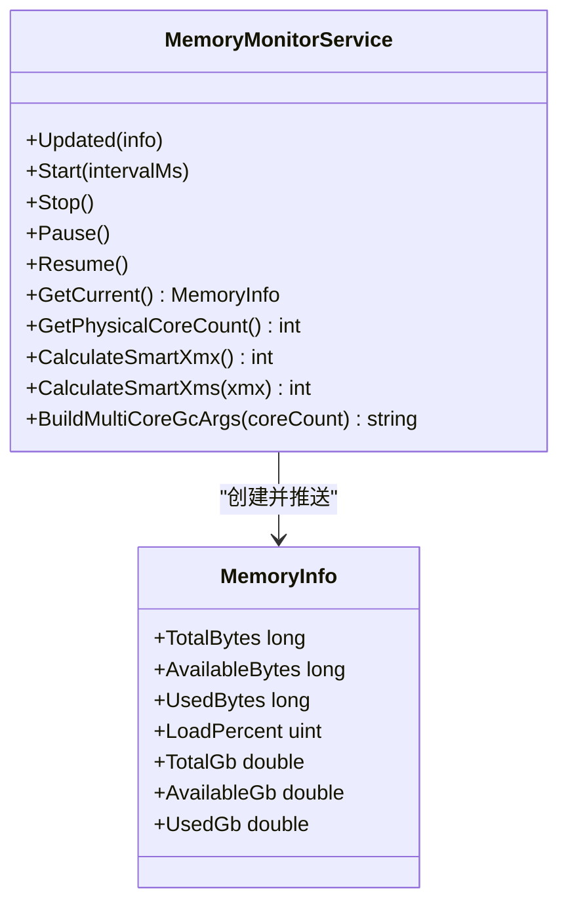
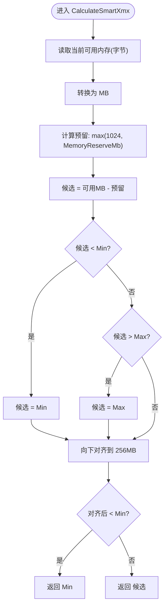
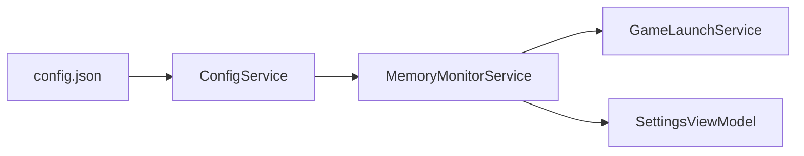

# 内存监控服务

<cite>
**本文引用的文件**   
- [MemoryMonitorService.cs](file://src/FufuLauncher/Services/MemoryMonitorService.cs)
- [ConfigService.cs](file://src/FufuLauncher/Services/ConfigService.cs)
- [GameLaunchService.cs](file://src/FufuLauncher/Services/GameLaunchService.cs)
- [SettingsViewModel.cs](file://src/FufuLauncher/ViewModels/SettingsViewModel.cs)
- [config.json](file://Start/appmcGAME/config.json)
</cite>

## 目录
1. [简介](#简介)
2. [项目结构](#项目结构)
3. [核心组件](#核心组件)
4. [架构总览](#架构总览)
5. [详细组件分析](#详细组件分析)
6. [依赖关系分析](#依赖关系分析)
7. [性能考量](#性能考量)
8. [故障排查指南](#故障排查指南)
9. [结论](#结论)
10. [附录：API 接口与使用示例](#附录api-接口与使用示例)

## 简介
本文件为 MemoryMonitorService 的完整技术文档，聚焦智能内存分配算法、系统资源监控与 JVM 参数优化。内容涵盖：
- CalculateSmartXmx 与 CalculateSmartXms 的计算逻辑与动态调整策略
- 多核 GC 优化参数的生成机制（ParallelGCThreads、ConcGCThreads、CICompilerCount）
- 系统性能监控指标、CPU 核心数检测与硬件信息获取
- 内存使用趋势分析与性能调优建议
- 最佳实践与完整的 API 接口说明及使用示例

## 项目结构
MemoryMonitorService 位于 Services 层，负责读取系统内存状态、定时刷新事件、计算智能 JVM 内存参数，并输出 CPU 核心数与多核 GC 优化参数。它与配置服务、启动服务以及 UI ViewModel 协作，形成“监控—计算—应用”的闭环。

图表来源
- [MemoryMonitorService.cs:1-227](file://src/FufuLauncher/Services/MemoryMonitorService.cs#L1-L227)
- [ConfigService.cs:40-152](file://src/FufuLauncher/Services/ConfigService.cs#L40-L152)
- [GameLaunchService.cs:180-225](file://src/FufuLauncher/Services/GameLaunchService.cs#L180-L225)
- [SettingsViewModel.cs:50-200](file://src/FufuLauncher/ViewModels/SettingsViewModel.cs#L50-L200)
- [config.json:1-34](file://Start/appmcGAME/config.json#L1-L34)

章节来源
- [MemoryMonitorService.cs:1-227](file://src/FufuLauncher/Services/MemoryMonitorService.cs#L1-L227)
- [ConfigService.cs:40-152](file://src/FufuLauncher/Services/ConfigService.cs#L40-L152)
- [GameLaunchService.cs:180-225](file://src/FufuLauncher/Services/GameLaunchService.cs#L180-L225)
- [SettingsViewModel.cs:50-200](file://src/FufuLauncher/ViewModels/SettingsViewModel.cs#L50-L200)
- [config.json:1-34](file://Start/appmcGAME/config.json#L1-L34)

## 核心组件
- MemoryMonitorService：系统内存监控、智能 Xmx/Xms 计算、多核 GC 参数生成、CPU 核心数检测、定时刷新事件。
- ConfigService：提供内存智能分配开关与阈值、多核 GC 优化开关等配置项。
- GameLaunchService：在启动游戏时根据配置决定是否启用智能内存分配与多核 GC 优化参数。
- SettingsViewModel：订阅内存监控事件，缓存智能推荐值，供 UI 展示与一键应用到实例。

章节来源
- [MemoryMonitorService.cs:26-214](file://src/FufuLauncher/Services/MemoryMonitorService.cs#L26-L214)
- [ConfigService.cs:52-68](file://src/FufuLauncher/Services/ConfigService.cs#L52-L68)
- [GameLaunchService.cs:180-225](file://src/FufuLauncher/Services/GameLaunchService.cs#L180-L225)
- [SettingsViewModel.cs:50-200](file://src/FufuLauncher/ViewModels/SettingsViewModel.cs#L50-L200)

## 架构总览
MemoryMonitorService 通过 Windows API 读取物理内存总量与可用内存，结合配置中的预留与上下限阈值，动态计算 Xmx；Xms 按 Xmx 的比例对齐到 256MB 粒度。同时，基于 CPU 核心数生成多核 GC 优化参数，由 GameLaunchService 在进程启动时注入 JVM 参数。UI 通过 SettingsViewModel 订阅 Updated 事件，实时展示内存快照与智能推荐值。

图表来源
- [MemoryMonitorService.cs:62-141](file://src/FufuLauncher/Services/MemoryMonitorService.cs#L62-L141)
- [MemoryMonitorService.cs:175-213](file://src/FufuLauncher/Services/MemoryMonitorService.cs#L175-L213)
- [GameLaunchService.cs:180-225](file://src/FufuLauncher/Services/GameLaunchService.cs#L180-L225)
- [ConfigService.cs:52-68](file://src/FufuLauncher/Services/ConfigService.cs#L52-L68)
- [SettingsViewModel.cs:186-200](file://src/FufuLauncher/ViewModels/SettingsViewModel.cs#L186-L200)

## 详细组件分析

### MemoryMonitorService 类
职责与特性：
- 使用 Windows API GlobalMemoryStatusEx 读取物理内存总量、已用、可用与负载百分比。
- 提供 DispatcherTimer 定时刷新（默认 3000ms），在 UI 线程触发 Updated 事件，避免跨线程 Invoke 队列堆积。
- 智能内存分配：
  - CalculateSmartXmx：当前可用内存减去系统预留（至少 1GB），再受最小/最大阈值限制，最后向下取整到 256MB 对齐。
  - CalculateSmartXms：取 Xmx 的 1/4，向下 256MB 对齐，最小 512MB，且不超过 Xmx。
- 多核 GC 优化参数：
  - ParallelGCThreads ≈ 物理核心的 5/8，至少 1
  - ConcGCThreads ≈ Parallel 的 1/4，至少 1
  - CICompilerCount ≈ 核心的 1/4，至少 2
- CPU 核心数检测：Environment.ProcessorCount，失败回退到 4。

图表来源
- [MemoryMonitorService.cs:26-214](file://src/FufuLauncher/Services/MemoryMonitorService.cs#L26-L214)
- [MemoryMonitorService.cs:216-227](file://src/FufuLauncher/Services/MemoryMonitorService.cs#L216-L227)

章节来源
- [MemoryMonitorService.cs:26-214](file://src/FufuLauncher/Services/MemoryMonitorService.cs#L26-L214)
- [MemoryMonitorService.cs:216-227](file://src/FufuLauncher/Services/MemoryMonitorService.cs#L216-L227)

### 智能内存分配算法（CalculateSmartXmx / CalculateSmartXms）
算法要点：
- 输入：当前可用内存（字节）、配置项 MemoryReserveMb、AutoMemoryMinMb、AutoMemoryMaxMb。
- 步骤：
  1) 将可用内存换算为 MB。
  2) 候选值 = 可用 MB - 预留 MB（至少 1024）。
  3) 若候选 < 最小值，则设为最小值；若 > 最大值，则设为最大值。
  4) 向下取整到 256MB 对齐，再次确保不低于最小值。
  5) 返回最终 Xmx（MB）。
- Xms 计算：
  1) xms = xmx / 4
  2) 向下 256MB 对齐
  3) 最小 512MB，且不超过 xmx

图表来源
- [MemoryMonitorService.cs:175-191](file://src/FufuLauncher/Services/MemoryMonitorService.cs#L175-L191)
- [ConfigService.cs:60-68](file://src/FufuLauncher/Services/ConfigService.cs#L60-L68)

章节来源
- [MemoryMonitorService.cs:175-201](file://src/FufuLauncher/Services/MemoryMonitorService.cs#L175-L201)
- [ConfigService.cs:60-68](file://src/FufuLauncher/Services/ConfigService.cs#L60-L68)

### 多核 GC 优化参数生成（BuildMultiCoreGcArgs）
规则：
- ParallelGCThreads = ceil(核心数 × 5/8)，至少 1
- ConcGCThreads = floor(ParallelGCThreads / 4)，至少 1
- CICompilerCount = max(2, floor(核心数 / 4))
- 返回字符串形式，包含三个 -XX 参数，便于直接拆分添加到 JVM 参数列表

章节来源
- [MemoryMonitorService.cs:203-213](file://src/FufuLauncher/Services/MemoryMonitorService.cs#L203-L213)

### 系统资源监控与 CPU 核心数检测
- 内存监控：通过 GlobalMemoryStatusEx 获取 ullTotalPhys、ullAvailPhys、dwMemoryLoad，封装为 MemoryInfo。
- CPU 核心数：Environment.ProcessorCount，异常时回退到 4。
- 定时刷新：DispatcherTimer 以 Background 优先级运行，间隔 3000ms，Tick 在 UI 线程触发，避免阻塞与跨线程切换开销。

章节来源
- [MemoryMonitorService.cs:28-44](file://src/FufuLauncher/Services/MemoryMonitorService.cs#L28-L44)
- [MemoryMonitorService.cs:144-169](file://src/FufuLauncher/Services/MemoryMonitorService.cs#L144-L169)
- [MemoryMonitorService.cs:62-88](file://src/FufuLauncher/Services/MemoryMonitorService.cs#L62-L88)

### 与 GameLaunchService 的集成
- 当 AutoMemoryMode 为 true 时，优先采用智能分配的 Xmx/Xms（需满足 >= 512MB 的条件）。
- 当 MultiCoreGcOptimize 为 true 时，调用 BuildMultiCoreGcArgs 生成参数并逐个添加到 JVM 参数列表。
- 额外支持进程优先级与 CPU 亲和性设置（非内存监控范畴，但影响整体性能）。

章节来源
- [GameLaunchService.cs:180-225](file://src/FufuLauncher/Services/GameLaunchService.cs#L180-L225)

### 与 SettingsViewModel 的集成
- 订阅 Updated 事件，每次收到 MemoryInfo 后更新 CurrentMemory，并在 setter 中缓存 SmartXmx/SartXms，减少 P/Invoke 风暴。
- 暴露 CpuCoreCount 与 GcArgsPreview，用于 UI 预览与展示。
- 提供 ApplySmartMemoryToSelected，一键将智能推荐值应用到当前实例。

章节来源
- [SettingsViewModel.cs:50-200](file://src/FufuLauncher/ViewModels/SettingsViewModel.cs#L50-L200)
- [SettingsViewModel.cs:160-170](file://src/FufuLauncher/ViewModels/SettingsViewModel.cs#L160-L170)
- [SettingsViewModel.cs:238-245](file://src/FufuLauncher/ViewModels/SettingsViewModel.cs#L238-L245)

## 依赖关系分析
- MemoryMonitorService 依赖 ConfigService 读取内存智能分配相关阈值。
- GameLaunchService 依赖 MemoryMonitorService 进行智能内存计算与多核 GC 参数生成。
- SettingsViewModel 依赖 MemoryMonitorService 的事件与计算方法，用于 UI 展示与一键应用。
- config.json 持久化配置项，包括 AutoMemoryMode、MemoryReserveMb、AutoMemoryMinMb、AutoMemoryMaxMb、MultiCoreGcOptimize 等。

图表来源
- [ConfigService.cs:52-68](file://src/FufuLauncher/Services/ConfigService.cs#L52-L68)
- [MemoryMonitorService.cs:175-213](file://src/FufuLauncher/Services/MemoryMonitorService.cs#L175-L213)
- [GameLaunchService.cs:180-225](file://src/FufuLauncher/Services/GameLaunchService.cs#L180-L225)
- [SettingsViewModel.cs:50-200](file://src/FufuLauncher/ViewModels/SettingsViewModel.cs#L50-L200)
- [config.json:26-32](file://Start/appmcGAME/config.json#L26-L32)

章节来源
- [ConfigService.cs:52-68](file://src/FufuLauncher/Services/ConfigService.cs#L52-L68)
- [MemoryMonitorService.cs:175-213](file://src/FufuLauncher/Services/MemoryMonitorService.cs#L175-L213)
- [GameLaunchService.cs:180-225](file://src/FufuLauncher/Services/GameLaunchService.cs#L180-L225)
- [SettingsViewModel.cs:50-200](file://src/FufuLauncher/ViewModels/SettingsViewModel.cs#L50-L200)
- [config.json:26-32](file://Start/appmcGAME/config.json#L26-L32)

## 性能考量
- 定时器频率：默认 3000ms，降低 P/Invoke 与 UI 刷新压力；可根据场景调整为更短或更长。
- 内存对齐：256MB 对齐减少 GC 碎片，提升堆分配效率。
- 多核 GC 线程：ParallelGCThreads 与 ConcGCThreads 按比例设置，避免过多线程导致上下文切换开销。
- 事件驱动：Updated 事件仅在 UI 线程触发，避免跨线程调度成本。
- 缓存策略：SettingsViewModel 缓存 SmartXmx/SartXms，避免频繁计算。

[本节为通用指导，不直接分析具体文件]

## 故障排查指南
- 读取内存失败：
  - 现象：Updated 未触发或抛出异常。
  - 处理：RaiseUpdatedSafe 捕获异常并写入日志，检查系统权限与 API 可用性。
- CPU 核心数读取失败：
  - 现象：GetPhysicalCoreCount 返回 4。
  - 处理：记录异常日志，确认 Environment.ProcessorCount 是否可访问。
- 智能内存过小：
  - 现象：Xmx 低于 512MB 被忽略。
  - 处理：检查 AutoMemoryMinMb 与 MemoryReserveMb，适当降低预留或提高下限。
- 多核 GC 参数无效：
  - 现象：JVM 启动参数未生效。
  - 处理：确认 MultiCoreGcOptimize 为 true，检查生成的参数字符串是否正确拆分添加。

章节来源
- [MemoryMonitorService.cs:130-141](file://src/FufuLauncher/Services/MemoryMonitorService.cs#L130-L141)
- [MemoryMonitorService.cs:158-169](file://src/FufuLauncher/Services/MemoryMonitorService.cs#L158-L169)
- [GameLaunchService.cs:215-225](file://src/FufuLauncher/Services/GameLaunchService.cs#L215-L225)

## 结论
MemoryMonitorService 提供了稳定可靠的系统内存监控与智能 JVM 内存分配能力，结合多核 GC 优化参数，显著提升 Minecraft 启动与运行时的稳定性与性能。通过合理的配置与 UI 集成，用户可直观地查看内存状态并一键应用推荐值，达到“开箱即用”的调优体验。

[本节为总结，不直接分析具体文件]

## 附录：API 接口与使用示例

### API 概览
- GetCurrent(): 返回当前内存快照 MemoryInfo（总内存、可用内存、已用内存、负载百分比）。
- CalculateSmartXmx(): 返回智能推荐的 Xmx（MB）。
- CalculateSmartXms(int xmx): 返回智能推荐的 Xms（MB）。
- GetPhysicalCoreCount(): 返回 CPU 物理核心数。
- BuildMultiCoreGcArgs(int coreCount): 返回多核 GC 优化参数字符串。
- Start(intervalMs=3000): 启动定时刷新。
- Stop(): 停止定时刷新。
- Pause()/Resume(): 暂停/恢复定时器。
- Updated event: 定时推送 MemoryInfo。

章节来源
- [MemoryMonitorService.cs:62-141](file://src/FufuLauncher/Services/MemoryMonitorService.cs#L62-L141)
- [MemoryMonitorService.cs:175-213](file://src/FufuLauncher/Services/MemoryMonitorService.cs#L175-L213)
- [MemoryMonitorService.cs:158-169](file://src/FufuLauncher/Services/MemoryMonitorService.cs#L158-L169)

### 使用示例（概念流程）
- 初始化与订阅：
  - 创建 MemoryMonitorService 实例，传入 ConfigService。
  - 订阅 Updated 事件，在回调中更新 UI 绑定属性。
  - 调用 Start(3000) 启动定时刷新。
- 计算智能内存：
  - 调用 CalculateSmartXmx() 得到 Xmx。
  - 调用 CalculateSmartXms(xmx) 得到 Xms。
- 启动游戏：
  - 在 GameLaunchService 中根据 AutoMemoryMode 决定是否使用智能内存。
  - 若启用 MultiCoreGcOptimize，则调用 BuildMultiCoreGcArgs 并添加到 JVM 参数。
- 配置项（config.json）：
  - AutoMemoryMode: 是否启用智能内存分配
  - MemoryReserveMb: 系统预留内存（MB）
  - AutoMemoryMinMb/AutoMemoryMaxMb: 智能分配上下限
  - MultiCoreGcOptimize: 是否启用多核 GC 优化

章节来源
- [SettingsViewModel.cs:186-200](file://src/FufuLauncher/ViewModels/SettingsViewModel.cs#L186-L200)
- [GameLaunchService.cs:180-225](file://src/FufuLauncher/Services/GameLaunchService.cs#L180-L225)
- [config.json:26-32](file://Start/appmcGAME/config.json#L26-L32)