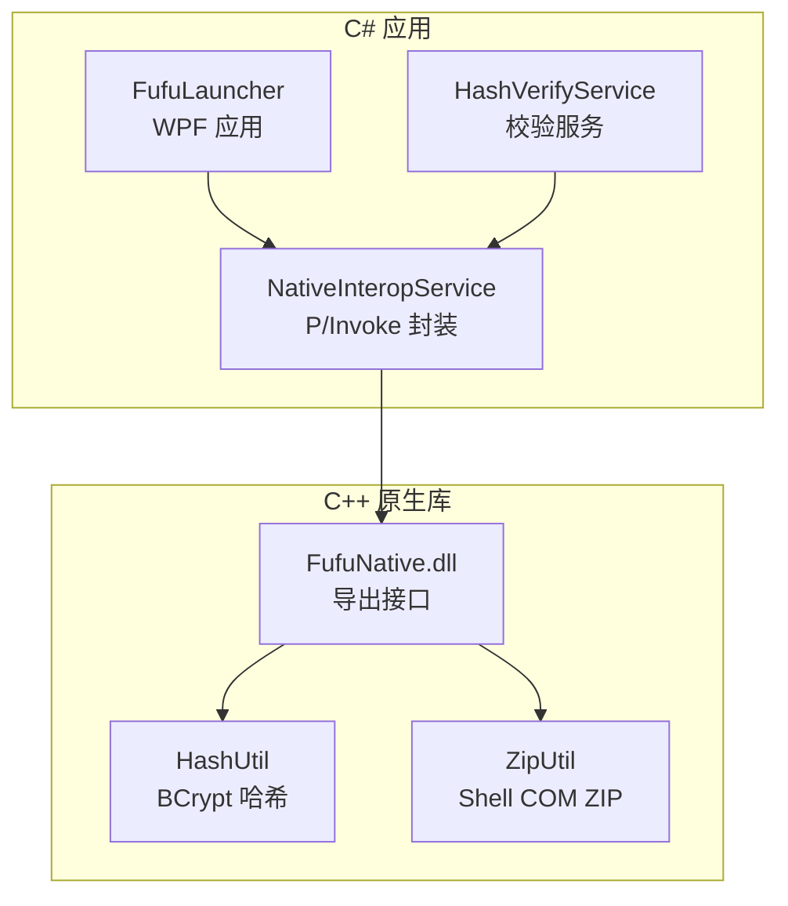
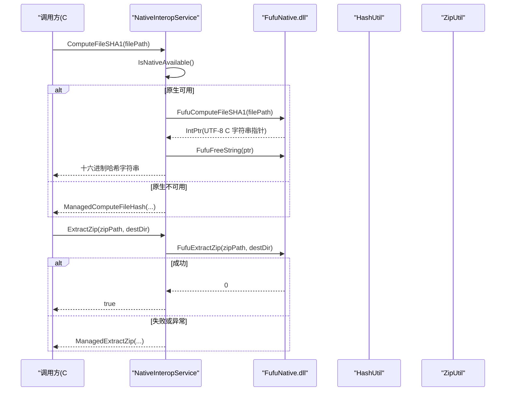
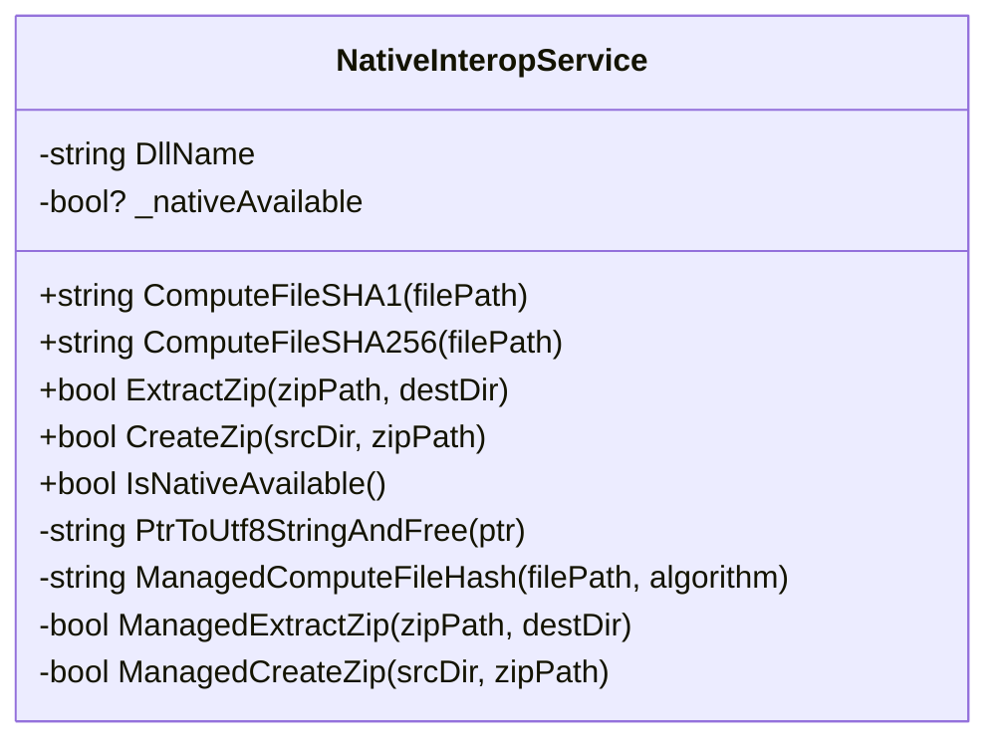
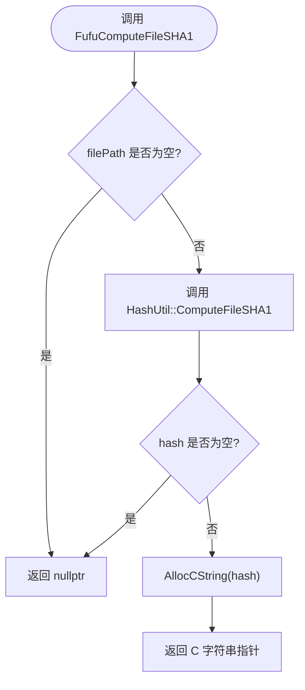
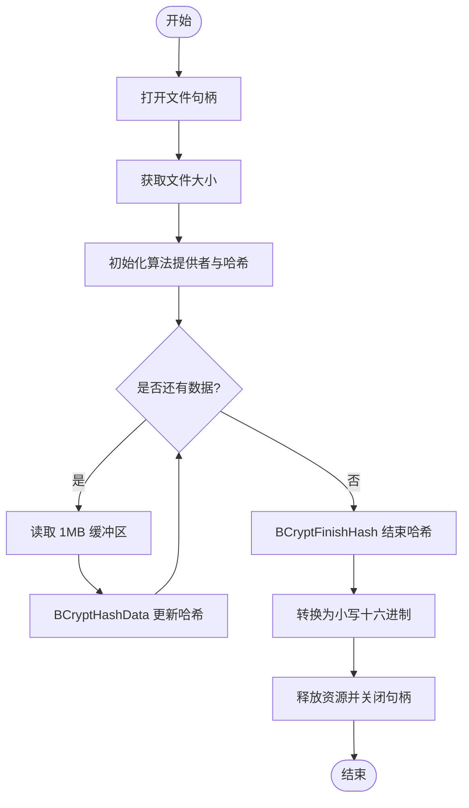
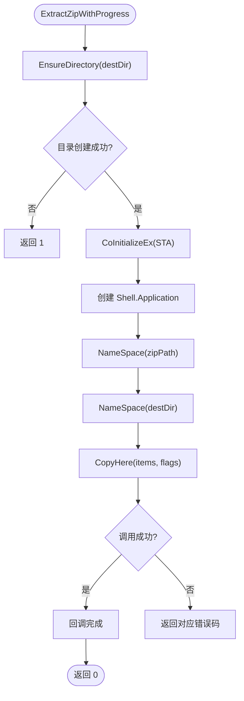
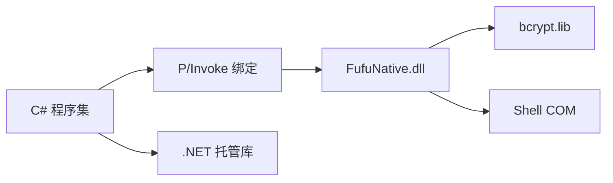

# 原生互操作服务

<cite>
**本文引用的文件**   
- [NativeInteropService.cs](file://src/FufuLauncher/Services/NativeInteropService.cs)
- [FufuNative.h](file://native/FufuNative/FufuNative.h)
- [FufuNative.cpp](file://native/FufuNative/FufuNative.cpp)
- [HashUtil.h](file://native/FufuNative/HashUtil.h)
- [HashUtil.cpp](file://native/FufuNative/HashUtil.cpp)
- [ZipUtil.h](file://native/FufuNative/ZipUtil.h)
- [ZipUtil.cpp](file://native/FufuNative/ZipUtil.cpp)
- [pch.h](file://native/FufuNative/pch.h)
- [FufuLauncher.csproj](file://src/FufuLauncher/FufuLauncher.csproj)
- [HashVerifyService.cs](file://src/FufuLauncher/Services/HashVerifyService.cs)
</cite>

## 目录
1. [简介](#简介)
2. [项目结构](#项目结构)
3. [核心组件](#核心组件)
4. [架构总览](#架构总览)
5. [详细组件分析](#详细组件分析)
6. [依赖关系分析](#依赖关系分析)
7. [性能考量](#性能考量)
8. [故障排除指南](#故障排除指南)
9. [结论](#结论)
10. [附录：API 参考与最佳实践](#附录api-参考与最佳实践)

## 简介
本文件为 NativeInteropService 的完整技术文档，聚焦 C# 与 C++ 互操作（P/Invoke）的设计与实现。内容涵盖：
- P/Invoke 接口设计、调用约定与内存管理策略
- FufuNative DLL 加载机制、依赖管理与版本兼容性
- 高性能 native 实现：文件哈希计算、ZIP 解压与打包
- 数据类型映射、字符串处理与数组传递的最佳实践
- 异常处理、错误码映射与调试技巧
- 原生库打包、部署与分发策略
- 完整的 API 参考与性能优化建议
- 常见互操作问题与排障方法

## 项目结构
- C# 侧通过 NativeInteropService 暴露统一接口，内部优先尝试调用 native DLL；若不可用则回退到托管实现，保证功能等价与可用性。
- C++ 侧提供 FufuNative.dll，导出哈希与 ZIP 相关函数，使用 Windows BCrypt 与 Shell COM 实现高性能与零第三方依赖。
- MSBuild 将 native DLL 复制到输出目录的运行时路径，便于按平台自动定位。

图表来源
- [FufuLauncher.csproj:34-42](file://src/FufuLauncher/FufuLauncher.csproj#L34-L42)
- [FufuNative.h:19-48](file://native/FufuNative/FufuNative.h#L19-L48)
- [HashUtil.h:7-22](file://native/FufuNative/HashUtil.h#L7-L22)
- [ZipUtil.h:9-28](file://native/FufuNative/ZipUtil.h#L9-L28)

章节来源
- [FufuLauncher.csproj:34-42](file://src/FufuLauncher/FufuLauncher.csproj#L34-L42)
- [FufuNative.h:19-48](file://native/FufuNative/FufuNative.h#L19-L48)

## 核心组件
- NativeInteropService：统一的 C# 入口，封装 P/Invoke 并实现“原生优先 + 托管回退”策略。
- FufuNative.dll：C++ 导出的高性能实现，包含哈希与 ZIP 能力。
- HashUtil：基于 Windows BCrypt 的文件哈希工具。
- ZipUtil：基于 Windows Shell COM 的 ZIP 解压与打包工具。
- HashVerifyService：业务层使用 NativeInteropService 进行文件完整性校验。

章节来源
- [NativeInteropService.cs:20-214](file://src/FufuLauncher/Services/NativeInteropService.cs#L20-L214)
- [FufuNative.h:19-48](file://native/FufuNative/FufuNative.h#L19-L48)
- [HashUtil.h:7-22](file://native/FufuNative/HashUtil.h#L7-L22)
- [ZipUtil.h:9-28](file://native/FufuNative/ZipUtil.h#L9-L28)
- [HashVerifyService.cs:24-85](file://src/FufuLauncher/Services/HashVerifyService.cs#L24-L85)

## 架构总览
下图展示从 C# 调用到 native 实现的完整流程，以及失败时的回退路径。

图表来源
- [NativeInteropService.cs:38-73](file://src/FufuLauncher/Services/NativeInteropService.cs#L38-L73)
- [NativeInteropService.cs:85-119](file://src/FufuLauncher/Services/NativeInteropService.cs#L85-L119)
- [FufuNative.cpp:30-50](file://native/FufuNative/FufuNative.cpp#L30-L50)
- [FufuNative.cpp:52-71](file://native/FufuNative/FufuNative.cpp#L52-L71)

## 详细组件分析

### NativeInteropService（C# 侧）
- 职责
  - 定义 P/Invoke 签名，统一调用约定与字符编码。
  - 首次探测 native 可用性并缓存结果，避免重复开销。
  - 对每个 API 提供“原生优先 + 托管回退”的实现。
- 关键设计
  - 调用约定：cdecl，字符串采用 UTF-8（LPUTF8Str）。
  - 内存管理：C++ 分配字符串，C# 通过 FufuFreeString 释放。
  - 异常处理：捕获 DllNotFoundException、EntryPointNotFoundException、BadImageFormatException，标记不可用并回退。
  - 托管回退：使用 System.Security.Cryptography 与 System.IO.Compression 实现等价功能。
- 重要方法
  - ComputeFileSHA1 / ComputeFileSHA256：返回小写十六进制字符串，失败返回空串。
  - ExtractZip / CreateZip：返回布尔值表示成功与否。
  - IsNativeAvailable：探测并缓存 native 可用性。
  - PtrToUtf8StringAndFree：安全读取 UTF-8 C 字符串并释放内存。

图表来源
- [NativeInteropService.cs:20-214](file://src/FufuLauncher/Services/NativeInteropService.cs#L20-L214)

章节来源
- [NativeInteropService.cs:20-214](file://src/FufuLauncher/Services/NativeInteropService.cs#L20-L214)

### FufuNative.dll（C++ 导出接口）
- 职责
  - 暴露哈希与 ZIP 相关函数供 C# 调用。
  - 负责 UTF-8 字符串分配与释放。
  - 协调 HashUtil 与 ZipUtil 完成具体工作。
- 调用约定与编码
  - 调用约定：cdecl。
  - 字符串编码：UTF-8（C# 侧 LPUTF8Str）。
- 导出函数
  - FufuComputeFileSHA1 / FufuComputeFileSHA256：返回 UTF-8 C 字符串指针，失败返回 nullptr。
  - FufuFreeString：释放由 DLL 分配的字符串内存。
  - FufuExtractZip / FufuExtractZipWithProgress：解压 ZIP，返回 0 成功，非 0 失败码。
  - FufuCreateZip：创建 ZIP 备份包，返回 0 成功。
  - FufuGetVersion：返回版本号字符串。

图表来源
- [FufuNative.cpp:30-36](file://native/FufuNative/FufuNative.cpp#L30-L36)
- [FufuNative.h:19-28](file://native/FufuNative/FufuNative.h#L19-L28)

章节来源
- [FufuNative.h:19-48](file://native/FufuNative/FufuNative.h#L19-L48)
- [FufuNative.cpp:10-78](file://native/FufuNative/FufuNative.cpp#L10-L78)

### HashUtil（哈希计算）
- 职责
  - 使用 Windows BCrypt API 高效计算 SHA1/SHA256。
  - 分块读取大文件，避免一次性载入内存。
- 算法要点
  - 打开文件句柄，获取文件大小。
  - 初始化算法提供者与哈希对象。
  - 循环读取 1MB 缓冲区，流式更新哈希。
  - 结束哈希并转换为小写十六进制字符串。
- 复杂度
  - 时间复杂度 O(N)，N 为文件大小。
  - 空间复杂度 O(1)（固定缓冲区大小）。

图表来源
- [HashUtil.cpp:34-105](file://native/FufuNative/HashUtil.cpp#L34-L105)

章节来源
- [HashUtil.h:7-22](file://native/FufuNative/HashUtil.h#L7-L22)
- [HashUtil.cpp:1-114](file://native/FufuNative/HashUtil.cpp#L1-L114)

### ZipUtil（ZIP 解压与打包）
- 职责
  - 解压 ZIP 到目标目录（支持进度回调）。
  - 创建 ZIP 备份包（写入最小合法 ZIP 头后通过 Shell 复制）。
- 实现要点
  - 使用 CoInitializeEx 初始化 COM（STA），必要时 Uninitialize。
  - 通过 Shell.Application NameSpace 与 CopyHere 完成解压/打包。
  - 确保目标目录存在，规范化路径分隔符。
- 错误码
  - 解压：1（无法创建目标目录）、2（创建 Shell 失败）、3（NameSpace 失败）、4-9（后续步骤失败）。
  - 打包：10（写入空 ZIP 头失败）、11（写入失败）、2-6（COM/Shell 调用失败）。

图表来源
- [ZipUtil.cpp:57-200](file://native/FufuNative/ZipUtil.cpp#L57-L200)
- [ZipUtil.cpp:203-301](file://native/FufuNative/ZipUtil.cpp#L203-L301)

章节来源
- [ZipUtil.h:9-28](file://native/FufuNative/ZipUtil.h#L9-L28)
- [ZipUtil.cpp:1-301](file://native/FufuNative/ZipUtil.cpp#L1-L301)

### 业务集成示例（HashVerifyService）
- 使用 NativeInteropService.ComputeFileSHA1 进行文件完整性校验。
- 批量校验时收集需要重新下载的文件列表。

章节来源
- [HashVerifyService.cs:24-85](file://src/FufuLauncher/Services/HashVerifyService.cs#L24-L85)

## 依赖关系分析
- C# 依赖
  - NativeInteropService 依赖 FufuNative.dll（可选）。
  - 托管回退依赖 System.Security.Cryptography 与 System.IO.Compression。
- C++ 依赖
  - HashUtil 依赖 bcrypt.lib（Windows BCrypt API）。
  - ZipUtil 依赖 Shell COM（无需第三方库）。
- 构建与发布
  - csproj 将 native DLL 复制到 runtimes\win-x64\native 下，按平台自动查找。

图表来源
- [FufuLauncher.csproj:34-42](file://src/FufuLauncher/FufuLauncher.csproj#L34-L42)
- [HashUtil.cpp:6-10](file://native/FufuNative/HashUtil.cpp#L6-L10)
- [ZipUtil.cpp:7-11](file://native/FufuNative/ZipUtil.cpp#L7-L11)

章节来源
- [FufuLauncher.csproj:34-42](file://src/FufuLauncher/FufuLauncher.csproj#L34-L42)

## 性能考量
- 哈希计算
  - 原生实现使用 BCrypt 与 1MB 分块读取，适合大文件，内存占用低。
  - 托管回退使用 .NET 内置哈希，性能略逊但可接受。
- ZIP 操作
  - 原生实现直接调用系统 Shell，避免引入第三方库，减少依赖与体积。
  - 解压为异步操作，回调仅用于通知完成；如需细粒度进度需扩展回调。
- 探测与缓存
  - IsNativeAvailable 首次探测并缓存，避免重复异常与开销。
- I/O 与线程
  - 建议在 UI 线程外执行耗时操作（如大量文件哈希与解压），避免界面卡顿。

[本节为通用指导，不直接分析具体文件]

## 故障排除指南
- 常见问题
  - 找不到 DLL：检查运行环境是否存在 FufuNative.dll，且平台匹配（x64）。
  - 入口点缺失：确认 DLL 版本与 C# 声明一致。
  - 图像格式错误：确认编译平台与目标架构一致（x64）。
  - 解压失败：检查目标目录权限与路径有效性。
- 错误码映射（解压/打包）
  - 解压：1（目录创建失败）、2（Shell 创建失败）、3（NameSpace 失败）、4-9（后续步骤失败）。
  - 打包：10（写入空 ZIP 头失败）、11（写入失败）、2-6（COM/Shell 调用失败）。
- 调试技巧
  - 在 C++ 侧添加日志输出（如 OutputDebugString）以定位问题。
  - 使用 Visual Studio 附加到进程调试 C# 与 C++ 混合代码。
  - 验证 UTF-8 路径转换是否正确（尤其是中文路径）。
- 回退行为
  - 当原生调用抛出特定异常时，自动切换到托管实现，确保功能可用。

章节来源
- [NativeInteropService.cs:48-73](file://src/FufuLauncher/Services/NativeInteropService.cs#L48-L73)
- [NativeInteropService.cs:95-119](file://src/FufuLauncher/Services/NativeInteropService.cs#L95-L119)
- [ZipUtil.cpp:57-200](file://native/FufuNative/ZipUtil.cpp#L57-L200)
- [ZipUtil.cpp:203-301](file://native/FufuNative/ZipUtil.cpp#L203-L301)

## 结论
NativeInteropService 提供了稳定、高性能且具备强韧性的 C# 与 C++ 互操作方案。通过“原生优先 + 托管回退”的策略，既充分利用了 native 的性能优势，又保证了在无 DLL 环境下的可用性。结合清晰的错误码与完善的调试手段，开发者可以快速定位与解决问题。

[本节为总结性内容，不直接分析具体文件]

## 附录：API 参考与最佳实践

### P/Invoke 接口参考
- 哈希
  - ComputeFileSHA1(filePath): string
  - ComputeFileSHA256(filePath): string
- ZIP
  - ExtractZip(zipPath, destDir): bool
  - CreateZip(srcDir, zipPath): bool
- 辅助
  - IsNativeAvailable(): bool

章节来源
- [NativeInteropService.cs:38-119](file://src/FufuLauncher/Services/NativeInteropService.cs#L38-L119)

### 数据类型与字符串处理
- 字符串编码：UTF-8（C# 侧 LPUTF8Str，C++ 侧 const char*）。
- 内存管理：C++ 分配字符串，C# 必须调用 FufuFreeString 释放。
- 返回值约定：哈希函数返回指针或 nullptr；ZIP 函数返回 0 成功，非 0 失败码。

章节来源
- [FufuNative.h:19-48](file://native/FufuNative/FufuNative.h#L19-L48)
- [NativeInteropService.cs:123-140](file://src/FufuLauncher/Services/NativeInteropService.cs#L123-L140)

### 调用约定与异常处理
- 调用约定：cdecl。
- 异常类型：DllNotFoundException、EntryPointNotFoundException、BadImageFormatException。
- 回退策略：捕获异常后标记 native 不可用，并使用托管实现。

章节来源
- [NativeInteropService.cs:48-73](file://src/FufuLauncher/Services/NativeInteropService.cs#L48-L73)
- [NativeInteropService.cs:95-119](file://src/FufuLauncher/Services/NativeInteropService.cs#L95-L119)

### 打包、部署与分发
- 构建产物：FufuNative.dll（x64 Release/Debug）。
- 部署位置：runtimes\win-x64\native\FufuNative.dll（由 csproj 自动复制）。
- 版本兼容：确保 C# 与 C++ 接口一致；可通过 FufuGetVersion 获取 DLL 版本信息。

章节来源
- [FufuLauncher.csproj:34-42](file://src/FufuLauncher/FufuLauncher.csproj#L34-L42)
- [FufuNative.cpp:73-75](file://native/FufuNative/FufuNative.cpp#L73-L75)

### 性能优化建议
- 批量任务并行化：使用 Task 并行处理多个文件的哈希与解压。
- 避免频繁探测：IsNativeAvailable 已缓存结果，无需重复调用。
- 合理缓冲：哈希计算已使用 1MB 缓冲，可根据磁盘特性调整。
- 压缩级别：托管 CreateZip 使用 Optimal 压缩级别，平衡速度与体积。

[本节为通用指导，不直接分析具体文件]