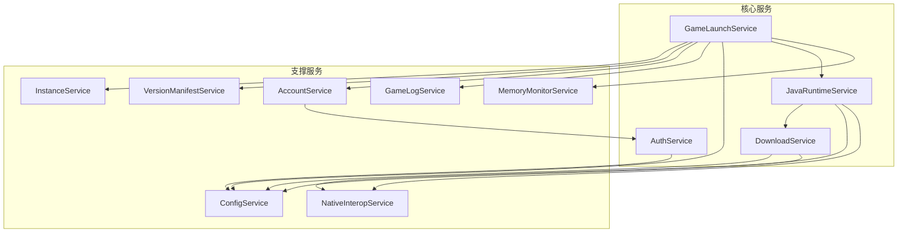
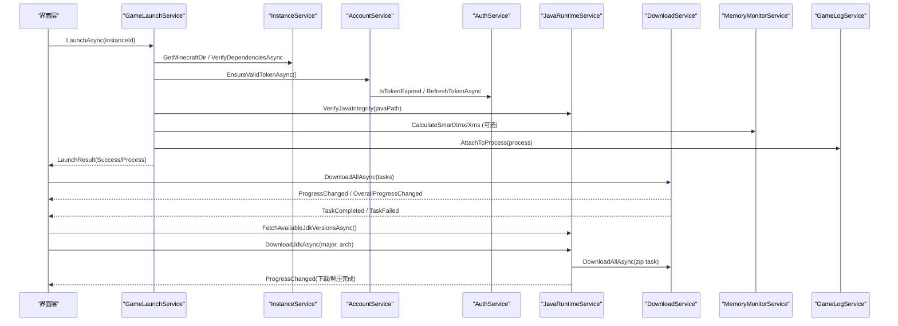
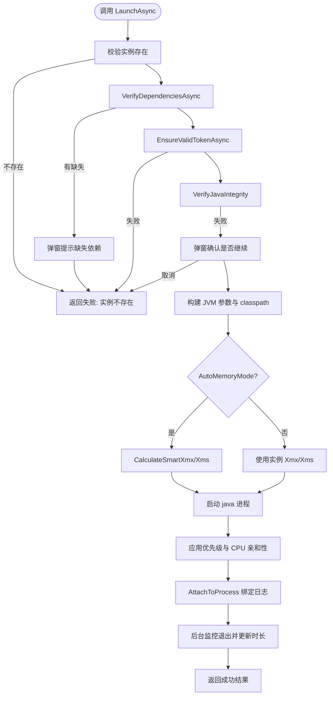
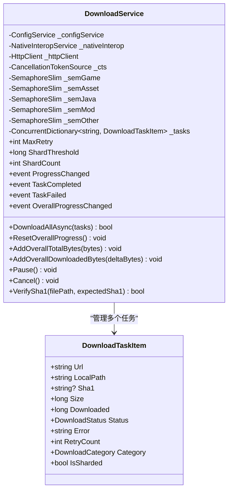
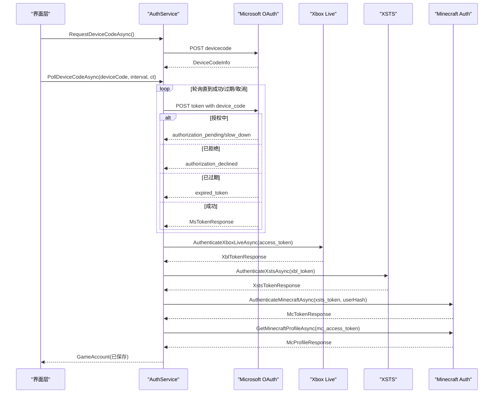
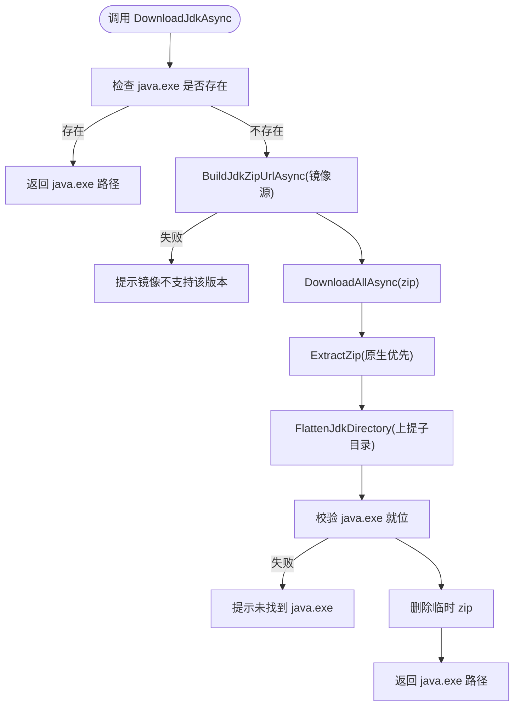
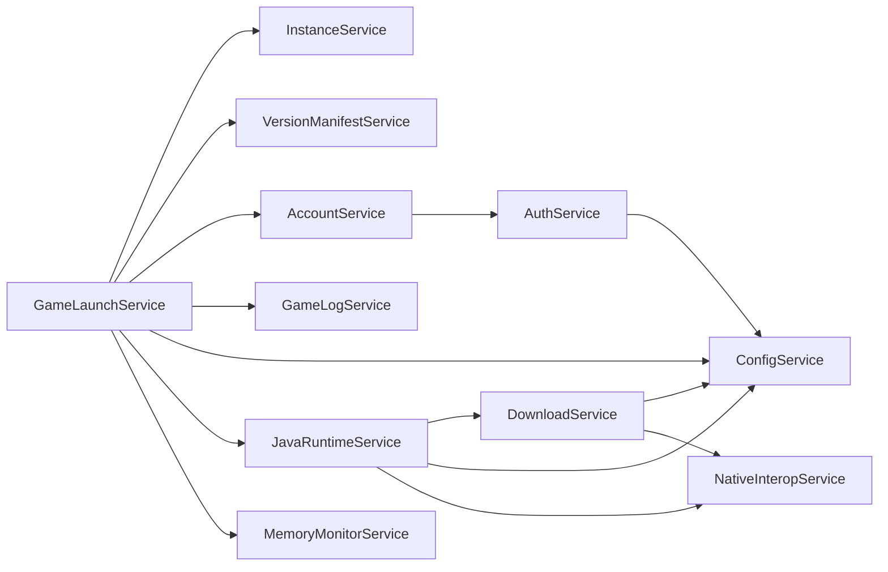

# 核心业务服务

<cite>
**本文引用的文件**   
- [GameLaunchService.cs](file://src/FufuLauncher/Services/GameLaunchService.cs)
- [DownloadService.cs](file://src/FufuLauncher/Services/DownloadService.cs)
- [AuthService.cs](file://src/FufuLauncher/Services/AuthService.cs)
- [JavaRuntimeService.cs](file://src/FufuLauncher/Services/JavaRuntimeService.cs)
- [ConfigService.cs](file://src/FufuLauncher/Services/ConfigService.cs)
- [MemoryMonitorService.cs](file://src/FufuLauncher/Services/MemoryMonitorService.cs)
- [NativeInteropService.cs](file://src/FufuLauncher/Services/NativeInteropService.cs)
- [InstanceService.cs](file://src/FufuLauncher/Services/InstanceService.cs)
- [AccountService.cs](file://src/FufuLauncher/Services/AccountService.cs)
- [GameLogService.cs](file://src/FufuLauncher/Services/GameLogService.cs)
- [VersionManifestService.cs](file://src/FufuLauncher/Services/VersionManifestService.cs)
</cite>

## 目录
1. [简介](#简介)
2. [项目结构](#项目结构)
3. [核心组件](#核心组件)
4. [架构总览](#架构总览)
5. [详细组件分析](#详细组件分析)
6. [依赖关系分析](#依赖关系分析)
7. [性能考量](#性能考量)
8. [故障排查指南](#故障排查指南)
9. [结论](#结论)
10. [附录：使用示例与集成指南](#附录使用示例与集成指南)

## 简介
本文件面向“可爱的芙芙启动器”的核心业务服务，重点围绕以下四个服务进行深度解析：
- GameLaunchService（游戏启动服务）
- DownloadService（下载服务）
- AuthService（账号登录服务）
- JavaRuntimeService（Java 运行时管理服务）

文档将阐述各服务的职责边界、接口设计、数据流转与通信机制、错误处理与降级策略、性能优化与资源管理最佳实践，并提供具体使用示例和集成指南。

## 项目结构
核心服务均位于 src/FufuLauncher/Services 目录下，采用按功能划分的模块化组织方式。关键依赖包括配置、实例管理、网络、原生互操作、内存监控等通用服务。

图表来源
- [GameLaunchService.cs:35-65](file://src/FufuLauncher/Services/GameLaunchService.cs#L35-L65)
- [DownloadService.cs:56-114](file://src/FufuLauncher/Services/DownloadService.cs#L56-L114)
- [AuthService.cs:76-121](file://src/FufuLauncher/Services/AuthService.cs#L76-L121)
- [JavaRuntimeService.cs:50-84](file://src/FufuLauncher/Services/JavaRuntimeService.cs#L50-L84)
- [ConfigService.cs:81-147](file://src/FufuLauncher/Services/ConfigService.cs#L81-L147)
- [InstanceService.cs:51-70](file://src/FufuLauncher/Services/InstanceService.cs#L51-L70)
- [AccountService.cs:12-26](file://src/FufuLauncher/Services/AccountService.cs#L12-L26)
- [GameLogService.cs:22-52](file://src/FufuLauncher/Services/GameLogService.cs#L22-L52)
- [VersionManifestService.cs:172-189](file://src/FufuLauncher/Services/VersionManifestService.cs#L172-L189)
- [MemoryMonitorService.cs:26-59](file://src/FufuLauncher/Services/MemoryMonitorService.cs#L26-L59)
- [NativeInteropService.cs:20-25](file://src/FufuLauncher/Services/NativeInteropService.cs#L20-L25)

章节来源
- [GameLaunchService.cs:1-401](file://src/FufuLauncher/Services/GameLaunchService.cs#L1-L401)
- [DownloadService.cs:1-592](file://src/FufuLauncher/Services/DownloadService.cs#L1-L592)
- [AuthService.cs:1-683](file://src/FufuLauncher/Services/AuthService.cs#L1-L683)
- [JavaRuntimeService.cs:1-527](file://src/FufuLauncher/Services/JavaRuntimeService.cs#L1-L527)
- [ConfigService.cs:1-148](file://src/FufuLauncher/Services/ConfigService.cs#L1-L148)
- [MemoryMonitorService.cs:1-227](file://src/FufuLauncher/Services/MemoryMonitorService.cs#L1-L227)
- [NativeInteropService.cs:1-214](file://src/FufuLauncher/Services/NativeInteropService.cs#L1-L214)
- [InstanceService.cs:1-253](file://src/FufuLauncher/Services/InstanceService.cs#L1-L253)
- [AccountService.cs:1-54](file://src/FufuLauncher/Services/AccountService.cs#L1-L54)
- [GameLogService.cs:1-223](file://src/FufuLauncher/Services/GameLogService.cs#L1-L223)
- [VersionManifestService.cs:1-338](file://src/FufuLauncher/Services/VersionManifestService.cs#L1-L338)

## 核心组件
本节对四大核心服务的职责边界与接口设计进行概述：
- GameLaunchService：负责实例依赖校验、账号令牌有效性检查、JVM 参数拼接、进程优先级与 CPU 亲和性设置、进程生命周期监控与日志绑定。
- DownloadService：提供多线程分片断点续传下载、类别隔离并发控制、双进度（单任务+全局）、失败重试与 SHA1 校验、官方源/BMCLAPI 镜像切换与 DNS 容错。
- AuthService：实现微软设备码/本地回调两种登录模式，完整令牌链（MS→XBL→XSTS→MC），离线账号支持，令牌自动刷新与持久化。
- JavaRuntimeService：提供多版本 JDK 的可用列表查询、下载与解压安装、路径探测与完整性校验、镜像源选择与 UI 提示。

章节来源
- [GameLaunchService.cs:35-65](file://src/FufuLauncher/Services/GameLaunchService.cs#L35-L65)
- [DownloadService.cs:56-114](file://src/FufuLauncher/Services/DownloadService.cs#L56-L114)
- [AuthService.cs:76-121](file://src/FufuLauncher/Services/AuthService.cs#L76-L121)
- [JavaRuntimeService.cs:50-84](file://src/FufuLauncher/Services/JavaRuntimeService.cs#L50-L84)

## 架构总览
下图展示了核心服务之间的交互关系与数据流向，涵盖启动流程、下载流程与认证流程的关键路径。

图表来源
- [GameLaunchService.cs:104-316](file://src/FufuLauncher/Services/GameLaunchService.cs#L104-L316)
- [DownloadService.cs:222-261](file://src/FufuLauncher/Services/DownloadService.cs#L222-L261)
- [AuthService.cs:343-398](file://src/FufuLauncher/Services/AuthService.cs#L343-L398)
- [JavaRuntimeService.cs:199-277](file://src/FufuLauncher/Services/JavaRuntimeService.cs#L199-L277)
- [MemoryMonitorService.cs:175-213](file://src/FufuLauncher/Services/MemoryMonitorService.cs#L175-L213)
- [GameLogService.cs:54-65](file://src/FufuLauncher/Services/GameLogService.cs#L54-L65)

## 详细组件分析

### GameLaunchService（游戏启动服务）
- 职责边界
  - 实例依赖校验（client.jar、libraries、assets）
  - 账号令牌有效性检查与自动刷新
  - JVM 参数拼接（内存、GC 多核优化、额外参数、认证参数）
  - 进程优先级与 CPU 亲和性设置
  - 进程生命周期监控与日志绑定
- 关键接口
  - VerifyDependenciesAsync(instanceId): 返回缺失依赖清单
  - LaunchAsync(instanceId): 返回 LaunchResult（Success/ErrorMessage/Process）
  - KillGame(): 终止当前游戏进程
- 数据流与通信
  - 通过 InstanceService 获取实例元信息与路径
  - 通过 AccountService 确保令牌有效
  - 通过 MemoryMonitorService 智能分配内存
  - 通过 JavaRuntimeService 校验 Java 可执行完整性
  - 通过 GameLogService 捕获并输出游戏日志
- 错误处理与降级
  - 依赖缺失弹窗提示并中止启动
  - Java 完整性校验失败时给出明确原因与用户确认
  - 进程优先级/CPU 亲和性设置失败不阻塞启动
  - 异常统一封装为 LaunchResult 返回
- 性能优化与资源管理
  - ArgumentList 自动转义避免参数注入问题
  - 后台监控退出释放进程引用，避免泄漏
  - 智能内存分配降低低配机器崩溃风险

图表来源
- [GameLaunchService.cs:104-316](file://src/FufuLauncher/Services/GameLaunchService.cs#L104-L316)
- [MemoryMonitorService.cs:175-213](file://src/FufuLauncher/Services/MemoryMonitorService.cs#L175-L213)
- [GameLogService.cs:54-65](file://src/FufuLauncher/Services/GameLogService.cs#L54-L65)

章节来源
- [GameLaunchService.cs:67-101](file://src/FufuLauncher/Services/GameLaunchService.cs#L67-L101)
- [GameLaunchService.cs:104-316](file://src/FufuLauncher/Services/GameLaunchService.cs#L104-L316)
- [GameLaunchService.cs:318-358](file://src/FufuLauncher/Services/GameLaunchService.cs#L318-L358)
- [GameLaunchService.cs:360-376](file://src/FufuLauncher/Services/GameLaunchService.cs#L360-L376)
- [GameLaunchService.cs:378-400](file://src/FufuLauncher/Services/GameLaunchService.cs#L378-L400)

### DownloadService（下载服务）
- 职责边界
  - 多线程分片断点续传下载（>=8MB 自动分片）
  - 类别独立并发控制（Game/Asset/Java/Mod/Other）
  - 双进度事件（单任务字节级 + 全局累计）
  - 失败指数退避重试与 SHA1 校验
  - 官方源/BMCLAPI 镜像切换与连接超时控制
- 关键接口
  - DownloadAllAsync(tasks): 批量下载，返回全部成功与否
  - ResetOverallProgress()/AddOverallTotalBytes()/AddOverallDownloadedBytes(): 全局进度统计
  - Pause()/Cancel(): 暂停/取消所有任务
  - VerifySha1(filePath, expectedSha1): 校验文件完整性
- 数据流与通信
  - 通过 ConfigService 获取下载源与超时配置
  - 通过 NativeInteropService 计算 SHA1（原生优先，托管回退）
  - 通过 HttpClient 发起请求，支持 Range 断点续传
- 错误处理与降级
  - 磁盘空间不足弹窗提示并中止
  - 服务端不支持断点续传（200 vs 206）自动从头下载
  - 指数退避重试，最终失败触发 TaskFailed 事件
  - 强制 BMCLAPI 镜像作为国内降级保护
- 性能优化与资源管理
  - 每类别独立 SemaphoreSlim 控制并发
  - 大文件分片并发写入 .partial，减少锁竞争
  - 节流整体进度报告（150ms）提升 UI 流畅度

图表来源
- [DownloadService.cs:28-45](file://src/FufuLauncher/Services/DownloadService.cs#L28-L45)
- [DownloadService.cs:56-114](file://src/FufuLauncher/Services/DownloadService.cs#L56-L114)

章节来源
- [DownloadService.cs:222-261](file://src/FufuLauncher/Services/DownloadService.cs#L222-L261)
- [DownloadService.cs:295-366](file://src/FufuLauncher/Services/DownloadService.cs#L295-L366)
- [DownloadService.cs:368-451](file://src/FufuLauncher/Services/DownloadService.cs#L368-L451)
- [DownloadService.cs:453-547](file://src/FufuLauncher/Services/DownloadService.cs#L453-L547)
- [DownloadService.cs:568-591](file://src/FufuLauncher/Services/DownloadService.cs#L568-L591)

### AuthService（账号登录服务）
- 职责边界
  - 微软设备码与本地回调两种登录模式
  - 完整令牌链：MS access_token → XBL → XSTS → Minecraft access_token → 玩家资料
  - 离线账号支持（确定性 UUID）
  - 令牌自动刷新与持久化存储
- 关键接口
  - RequestDeviceCodeAsync(): 请求设备码
  - PollDeviceCodeAsync(deviceCode, interval, ct): 轮询授权结果
  - LoginCallbackAsync(ct): 本地回调登录
  - CompleteLoginFromMsTokenAsync(msToken): 完成令牌链并保存账号
  - LoginOffline(nickname): 离线账号登录
  - RefreshTokenAsync(account): 使用 refresh_token 刷新令牌
  - IsTokenExpired(account): 判断令牌是否即将过期
- 数据流与通信
  - 通过 HttpClient 访问 Microsoft/Xbox/Minecraft 端点
  - 通过 ConfigService 获取 ClientId、AuthMode、端口等配置
  - 通过文件系统持久化账号 JSON
- 错误处理与降级
  - 区分网络异常、未购买 MC、用户取消、设备码过期、令牌交换失败
  - 404 表示未购买 MC，抛出特定异常类型供 UI 提示
  - 本地回调端口占用或浏览器打开失败给出明确提示
- 性能优化与资源管理
  - 统一 HttpClient 设置 User-Agent/Accept，避免被限流
  - 响应体截断日志，避免长 JSON 污染日志

图表来源
- [AuthService.cs:159-192](file://src/FufuLauncher/Services/AuthService.cs#L159-L192)
- [AuthService.cs:198-265](file://src/FufuLauncher/Services/AuthService.cs#L198-L265)
- [AuthService.cs:343-398](file://src/FufuLauncher/Services/AuthService.cs#L343-L398)
- [AuthService.cs:421-468](file://src/FufuLauncher/Services/AuthService.cs#L421-L468)
- [AuthService.cs:609-643](file://src/FufuLauncher/Services/AuthService.cs#L609-L643)

章节来源
- [AuthService.cs:76-121](file://src/FufuLauncher/Services/AuthService.cs#L76-L121)
- [AuthService.cs:159-192](file://src/FufuLauncher/Services/AuthService.cs#L159-L192)
- [AuthService.cs:198-265](file://src/FufuLauncher/Services/AuthService.cs#L198-L265)
- [AuthService.cs:343-398](file://src/FufuLauncher/Services/AuthService.cs#L343-L398)
- [AuthService.cs:421-468](file://src/FufuLauncher/Services/AuthService.cs#L421-L468)
- [AuthService.cs:609-643](file://src/FufuLauncher/Services/AuthService.cs#L609-L643)

### JavaRuntimeService（Java 运行时管理服务）
- 职责边界
  - 拉取可用 JDK 版本列表（Adoptium API/华为云镜像）
  - 下载并解压完整 JDK 到 runtimes/jdk-{major}-{arch}/
  - 列出已安装运行时，探测主版本与架构
  - 校验 Java 可执行完整性（java -version）
- 关键接口
  - FetchAvailableJdkVersionsAsync(): 返回 JdkVersionInfo 列表
  - DownloadJdkAsync(majorVersion, arch): 下载并解压，返回 java.exe 路径
  - ListInstalledRuntimes(): 列出本地已安装运行时
  - VerifyJavaIntegrity(javaExe): 校验可执行完整性
- 数据流与通信
  - 通过 DownloadService 下载 zip 包（支持分片）
  - 通过 NativeInteropService 解压（原生优先，托管回退）
  - 通过 ConfigService 选择镜像源
- 错误处理与降级
  - 镜像源不支持某版本时给出提示
  - 解压失败回退到托管实现
  - 目录上提失败不影响主流程（兼容内层目录）
- 性能优化与资源管理
  - 优先原生解压，失败再走托管
  - 动态解析华为云目录页获取最新版本号
  - 清理临时 zip 文件，避免磁盘浪费

图表来源
- [JavaRuntimeService.cs:199-277](file://src/FufuLauncher/Services/JavaRuntimeService.cs#L199-L277)
- [JavaRuntimeService.cs:279-335](file://src/FufuLauncher/Services/JavaRuntimeService.cs#L279-L335)
- [JavaRuntimeService.cs:351-379](file://src/FufuLauncher/Services/JavaRuntimeService.cs#L351-L379)
- [JavaRuntimeService.cs:482-510](file://src/FufuLauncher/Services/JavaRuntimeService.cs#L482-L510)

章节来源
- [JavaRuntimeService.cs:116-158](file://src/FufuLauncher/Services/JavaRuntimeService.cs#L116-L158)
- [JavaRuntimeService.cs:199-277](file://src/FufuLauncher/Services/JavaRuntimeService.cs#L199-L277)
- [JavaRuntimeService.cs:382-429](file://src/FufuLauncher/Services/JavaRuntimeService.cs#L382-L429)
- [JavaRuntimeService.cs:482-510](file://src/FufuLauncher/Services/JavaRuntimeService.cs#L482-L510)

## 依赖关系分析
- 耦合与内聚
  - GameLaunchService 高内聚于启动流程，依赖多个支撑服务但职责清晰
  - DownloadService 独立于业务逻辑，专注于下载能力，通过事件暴露状态
  - AuthService 专注认证链路，对外暴露统一的账号模型
  - JavaRuntimeService 聚焦 JDK 生命周期管理，与 DownloadService 解耦良好
- 直接/间接依赖
  - GameLaunchService → InstanceService/VersionManifestService/AccountService/GameLogService/ConfigService/JavaRuntimeService/MemoryMonitorService
  - DownloadService → ConfigService/NativeInteropService
  - AuthService → ConfigService
  - JavaRuntimeService → DownloadService/ConfigService/NativeInteropService
- 外部依赖与集成点
  - Microsoft/Xbox/Minecraft 认证端点
  - Adoptium API/华为云镜像
  - Mojang 版本清单与资源下载
- 接口契约与实现细节
  - 所有网络请求统一设置 User-Agent，避免被限流
  - 下载与哈希计算优先原生实现，失败自动回退托管
  - 配置项集中管理，支持迁移与默认值

图表来源
- [GameLaunchService.cs:35-65](file://src/FufuLauncher/Services/GameLaunchService.cs#L35-L65)
- [DownloadService.cs:56-114](file://src/FufuLauncher/Services/DownloadService.cs#L56-L114)
- [AuthService.cs:76-121](file://src/FufuLauncher/Services/AuthService.cs#L76-L121)
- [JavaRuntimeService.cs:50-84](file://src/FufuLauncher/Services/JavaRuntimeService.cs#L50-L84)

章节来源
- [GameLaunchService.cs:35-65](file://src/FufuLauncher/Services/GameLaunchService.cs#L35-L65)
- [DownloadService.cs:56-114](file://src/FufuLauncher/Services/DownloadService.cs#L56-L114)
- [AuthService.cs:76-121](file://src/FufuLauncher/Services/AuthService.cs#L76-L121)
- [JavaRuntimeService.cs:50-84](file://src/FufuLauncher/Services/JavaRuntimeService.cs#L50-L84)

## 性能考量
- 下载服务
  - 分片阈值 8MB，默认 4 分片，提升大文件吞吐
  - 每类别独立信号量，避免跨类阻塞
  - 整体进度节流 150ms，减少 UI 刷新开销
- 启动服务
  - 智能内存分配按空闲内存计算，向下对齐 256MB，减少 GC 碎片
  - 多核 GC 优化参数根据物理核心数动态生成
  - 进程优先级与 CPU 亲和性设置失败不阻塞启动
- 日志服务
  - 200ms 批量写文件，避免逐行 IO 开销
  - 内存缓冲限制 5000 行，防止长时间运行内存膨胀
- 内存监控
  - DispatcherTimer Background 优先级，避免抢占 UI 线程
  - 定时刷新间隔 3000ms，平衡实时性与性能

[本节为通用指导，无需特定文件来源]

## 故障排查指南
- 启动失败
  - 依赖缺失：查看 VerifyDependenciesAsync 返回的缺失清单
  - 令牌过期：检查 AccountService.EnsureValidTokenAsync 与 AuthService.RefreshTokenAsync
  - Java 完整性失败：确认 java -version 可执行，必要时重新下载 JDK
  - 进程优先级/CPU 亲和性失败：查看应用日志中的失败原因
- 下载失败
  - 磁盘空间不足：CheckDiskSpace 返回提示信息
  - 服务端不支持断点续传：自动从头下载
  - SHA1 校验失败：自动重下一次，仍失败则检查网络与镜像源
  - 官方源超时：自动降级到 BMCLAPI 镜像
- 登录失败
  - 设备码过期：重新请求设备码
  - 未购买 MC：抛出 NotOwnedMinecraft 异常，提示购买
  - 本地回调端口占用：更换端口或切换到设备码模式
- 日志问题
  - 游戏日志未刷新：调用 FlushNow 强制刷新
  - 日志文件过大：检查 MaxBufferLines 裁剪逻辑

章节来源
- [GameLaunchService.cs:104-316](file://src/FufuLauncher/Services/GameLaunchService.cs#L104-L316)
- [DownloadService.cs:222-261](file://src/FufuLauncher/Services/DownloadService.cs#L222-L261)
- [AuthService.cs:609-643](file://src/FufuLauncher/Services/AuthService.cs#L609-L643)
- [GameLogService.cs:168-172](file://src/FufuLauncher/Services/GameLogService.cs#L168-L172)

## 结论
四大核心服务在“可爱的芙芙启动器”中各司其职、协同工作：
- GameLaunchService 负责启动编排与系统优化
- DownloadService 提供高性能、可靠的下载能力
- AuthService 实现完整的认证链路与令牌管理
- JavaRuntimeService 管理多版本 JDK 的下载与校验

通过清晰的职责边界、健壮的异常处理与完善的性能优化，这些服务共同保障了启动器的稳定性与用户体验。

[本节为总结，无需特定文件来源]

## 附录：使用示例与集成指南
- 启动游戏
  - 调用 GameLaunchService.LaunchAsync(instanceId)，处理 LaunchResult.Success/ErrorMessage
  - 监听 GameLogService.LogsAppended 以显示实时日志
- 下载资源
  - 构造 DownloadTaskItem 列表，调用 DownloadService.DownloadAllAsync
  - 订阅 ProgressChanged/OverallProgressChanged 更新 UI
  - 处理 TaskCompleted/TaskFailed 事件
- 登录账号
  - 设备码模式：RequestDeviceCodeAsync → PollDeviceCodeAsync → CompleteLoginFromMsTokenAsync
  - 本地回调模式：LoginCallbackAsync → ExchangeCodeForMsTokenAsync
  - 离线模式：LoginOffline(nickname)
- 管理 Java 运行时
  - FetchAvailableJdkVersionsAsync 展示可选版本
  - DownloadJdkAsync(major, arch) 下载并解压
  - ListInstalledRuntimes 列出已安装版本
  - VerifyJavaIntegrity(javaExe) 校验可执行

章节来源
- [GameLaunchService.cs:104-316](file://src/FufuLauncher/Services/GameLaunchService.cs#L104-L316)
- [DownloadService.cs:222-261](file://src/FufuLauncher/Services/DownloadService.cs#L222-L261)
- [AuthService.cs:159-192](file://src/FufuLauncher/Services/AuthService.cs#L159-L192)
- [JavaRuntimeService.cs:199-277](file://src/FufuLauncher/Services/JavaRuntimeService.cs#L199-L277)