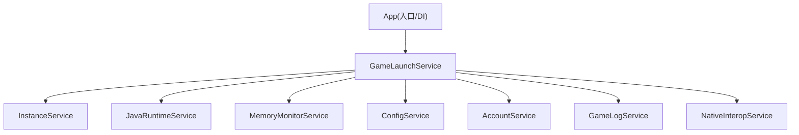
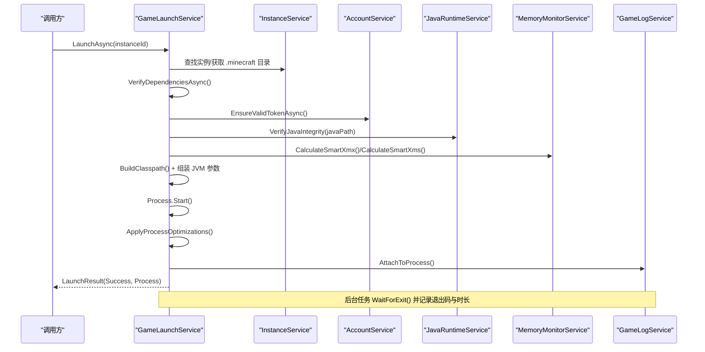
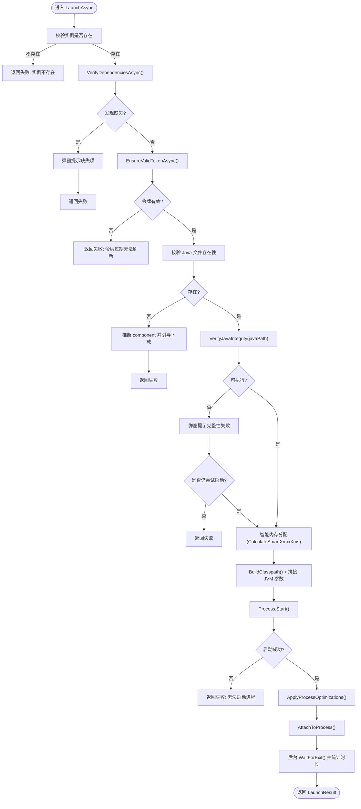
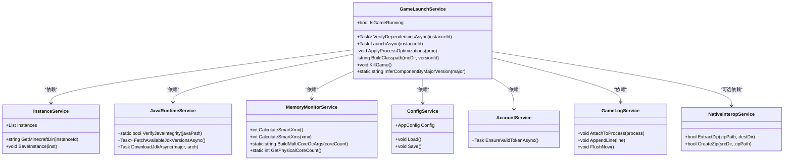

# 游戏启动服务

<cite>
**本文引用的文件**   
- [GameLaunchService.cs](file://src/FufuLauncher/Services/GameLaunchService.cs)
- [JavaRuntimeService.cs](file://src/FufuLauncher/Services/JavaRuntimeService.cs)
- [MemoryMonitorService.cs](file://src/FufuLauncher/Services/MemoryMonitorService.cs)
- [ConfigService.cs](file://src/FufuLauncher/Services/ConfigService.cs)
- [InstanceService.cs](file://src/FufuLauncher/Services/InstanceService.cs)
- [GameLogService.cs](file://src/FufuLauncher/Services/GameLogService.cs)
- [AccountService.cs](file://src/FufuLauncher/Services/AccountService.cs)
- [NativeInteropService.cs](file://src/FufuLauncher/Services/NativeInteropService.cs)
- [App.xaml.cs](file://src/FufuLauncher/App.xaml.cs)
</cite>

## 目录
1. [简介](#简介)
2. [项目结构](#项目结构)
3. [核心组件](#核心组件)
4. [架构总览](#架构总览)
5. [详细组件分析](#详细组件分析)
6. [依赖关系分析](#依赖关系分析)
7. [性能考量](#性能考量)
8. [故障排查指南](#故障排查指南)
9. [结论](#结论)
10. [附录：使用示例与集成指南](#附录使用示例与集成指南)

## 简介
本技术文档围绕 GameLaunchService（游戏启动服务）展开，系统性阐述其职责、启动流程、依赖校验、Java 运行时验证、JVM 参数装配、进程管理与优化、错误处理策略、用户交互提示以及资源清理机制。重点解析 LaunchAsync 方法的完整执行路径，从实例验证到游戏进程启动的每一步，并说明智能内存分配、多核 GC 优化、进程优先级与 CPU 亲和性设置等关键特性。

## 项目结构
GameLaunchService 位于 Services 层，作为“启动器”的核心编排者，协调多个子服务完成环境检查、依赖校验、Java 运行、JVM 参数装配、进程启动与监控。相关服务包括：
- InstanceService：实例元数据与目录管理
- JavaRuntimeService：Java 运行时完整性校验与下载管理
- MemoryMonitorService：系统内存监控与智能内存分配、多核 GC 参数生成
- ConfigService：全局配置（是否启用多核 GC、高优先级、CPU 亲和性、自动内存模式等）
- AccountService：账号令牌有效性校验
- GameLogService：游戏进程日志捕获与持久化
- NativeInteropService：原生加速（ZIP 解压、哈希计算），失败时回退托管实现
- App：应用入口与 DI 容器初始化、统一日志写入

图表来源
- [GameLaunchService.cs:35-65](file://src/FufuLauncher/Services/GameLaunchService.cs#L35-L65)
- [App.xaml.cs:131-154](file://src/FufuLauncher/App.xaml.cs#L131-L154)

章节来源
- [App.xaml.cs:75-117](file://src/FufuLauncher/App.xaml.cs#L75-L117)
- [GameLaunchService.cs:35-65](file://src/FufuLauncher/Services/GameLaunchService.cs#L35-L65)

## 核心组件
- GameLaunchService：负责启动前校验、JVM 参数拼装、进程启动、优化设置、退出监控与资源释放。
- JavaRuntimeService：提供 Java 可执行文件完整性校验、版本探测、本地 JDK 安装与下载。
- MemoryMonitorService：读取物理内存、计算智能 Xmx/Xms、生成多核 GC 参数。
- ConfigService：集中管理 JVM 优化开关、内存智能分配阈值、镜像源等配置。
- InstanceService：维护实例信息、Minecraft 目录定位、版本与 Java 路径。
- AccountService：确保登录令牌有效，必要时刷新。
- GameLogService：实时捕获 stdout/stderr，批量落盘，避免频繁 IO。
- NativeInteropService：优先调用 C++ DLL 加速 ZIP 解压与哈希，失败回退托管实现。

章节来源
- [GameLaunchService.cs:35-65](file://src/FufuLauncher/Services/GameLaunchService.cs#L35-L65)
- [JavaRuntimeService.cs:50-84](file://src/FufuLauncher/Services/JavaRuntimeService.cs#L50-L84)
- [MemoryMonitorService.cs:26-59](file://src/FufuLauncher/Services/MemoryMonitorService.cs#L26-L59)
- [ConfigService.cs:88-99](file://src/FufuLauncher/Services/ConfigService.cs#L88-L99)
- [InstanceService.cs:51-70](file://src/FufuLauncher/Services/InstanceService.cs#L51-L70)
- [AccountService.cs:12-26](file://src/FufuLauncher/Services/AccountService.cs#L12-L26)
- [GameLogService.cs:22-52](file://src/FufuLauncher/Services/GameLogService.cs#L22-L52)
- [NativeInteropService.cs:20-25](file://src/FufuLauncher/Services/NativeInteropService.cs#L20-L25)

## 架构总览
GameLaunchService 通过依赖注入获取各服务实例，在 LaunchAsync 中按顺序执行：
1) 实例存在性校验
2) 依赖文件校验（client.jar、libraries 目录）
3) 账号令牌有效性校验
4) Java 可执行文件存在性与完整性校验（java -version）
5) 智能内存分配（可选覆盖实例 Xmx/Xms）
6) 构建 classpath 与 JVM 参数（含多核 GC 优化）
7) 启动 java 进程，应用进程优先级与 CPU 亲和性
8) 绑定日志捕获，后台监控退出并更新统计

图表来源
- [GameLaunchService.cs:104-316](file://src/FufuLauncher/Services/GameLaunchService.cs#L104-L316)
- [JavaRuntimeService.cs:482-510](file://src/FufuLauncher/Services/JavaRuntimeService.cs#L482-L510)
- [MemoryMonitorService.cs:175-213](file://src/FufuLauncher/Services/MemoryMonitorService.cs#L175-L213)
- [GameLogService.cs:54-66](file://src/FufuLauncher/Services/GameLogService.cs#L54-L66)

## 详细组件分析

### GameLaunchService：启动主流程与优化
- 依赖校验
  - 校验 client.jar 是否存在
  - 校验 libraries 目录是否存在
  - 生产建议：读取 version.json 中的 libraries 列表并逐一校验 SHA1（当前骨架返回空列表表示通过）
- 账号令牌校验
  - 若令牌过期则尝试刷新；失败则提示重新登录
- Java 运行时校验
  - 文件存在性判断：缺失时根据 MajorVersion 推断 Mojang runtime component 名，引导用户前往【Java 运行时】页面下载
  - 完整性二次校验：执行 java -version，失败则弹窗提示可能损坏或被安全软件拦截
- 智能内存分配
  - 当 AutoMemoryMode 开启且智能值大于等于下限（默认 512MB）时，覆盖实例 Xmx/Xms
  - Xms 取 Xmx 的 1/4，向下对齐到 256MB，最小 512MB
- JVM 参数装配
  - 基础参数：-Xms/-Xmx、-Djava.library.path、-cp
  - 多核 GC 优化：ParallelGCThreads/ConcGCThreads/CICompilerCount（由 MemoryMonitorService.BuildMultiCoreGcArgs 生成）
  - 额外参数：支持 ExtraJvmArgs 逐空格拆分添加
  - 主类与游戏参数：net.minecraft.client.main.Main，用户名、版本、目录、资源索引、UUID、访问令牌、用户类型、全屏或宽高
- 进程启动与优化
  - 创建 ProcessStartInfo，重定向输出，隐藏窗口
  - 应用进程优先级（AboveNormal，禁止 Realtime）
  - 设置 CPU 亲和性掩码（保留 1 个核心给系统，其余给游戏）
- 日志与退出监控
  - 绑定 GameLogService 捕获 stdout/stderr
  - 后台任务等待退出，累计游玩时长并保存实例
  - 释放进程引用，避免再次启动竞态

图表来源
- [GameLaunchService.cs:104-316](file://src/FufuLauncher/Services/GameLaunchService.cs#L104-L316)
- [MemoryMonitorService.cs:175-213](file://src/FufuLauncher/Services/MemoryMonitorService.cs#L175-L213)

章节来源
- [GameLaunchService.cs:69-101](file://src/FufuLauncher/Services/GameLaunchService.cs#L69-L101)
- [GameLaunchService.cs:104-316](file://src/FufuLauncher/Services/GameLaunchService.cs#L104-L316)
- [GameLaunchService.cs:318-358](file://src/FufuLauncher/Services/GameLaunchService.cs#L318-L358)
- [GameLaunchService.cs:360-376](file://src/FufuLauncher/Services/GameLaunchService.cs#L360-L376)

### JavaRuntimeService：运行时完整性与下载
- 完整性校验
  - 执行 java -version，输出包含 “version” 视为通过
  - 失败时记录日志并返回 false
- 版本探测
  - 通过 java -version 解析主版本、架构、厂商
- 本地 JDK 管理
  - 列出 runtimes 目录下已安装的 JDK，状态为“已就绪/不完整”
  - 下载 JDK zip（官方 Adoptium 或华为云镜像），解压后上提目录结构，删除临时 zip
- 镜像源选择
  - Official：Adoptium API，动态拉取可用版本列表
  - Huaweicloud：OpenJDK 官方版本，解析目录页匹配最新版本号

章节来源
- [JavaRuntimeService.cs:482-510](file://src/FufuLauncher/Services/JavaRuntimeService.cs#L482-L510)
- [JavaRuntimeService.cs:381-429](file://src/FufuLauncher/Services/JavaRuntimeService.cs#L381-L429)
- [JavaRuntimeService.cs:199-277](file://src/FufuLauncher/Services/JavaRuntimeService.cs#L199-L277)
- [JavaRuntimeService.cs:279-335](file://src/FufuLauncher/Services/JavaRuntimeService.cs#L279-L335)

### MemoryMonitorService：智能内存与多核 GC
- 内存监控
  - 通过 GlobalMemoryStatusEx 读取物理内存总量、可用、已用、负载百分比
  - DispatcherTimer 定时触发 Updated 事件（UI 线程），降低频率至 3s，避免卡顿
- 智能内存分配
  - 计算候选 Xmx = 可用内存 - 预留（至少 1GB），受上下限约束，向下 256MB 对齐
  - Xms = Xmx / 4，向下 256MB 对齐，最小 512MB
- 多核 GC 参数
  - ParallelGCThreads ≈ 5/8 核心数
  - ConcGCThreads ≈ Parallel 的 1/4
  - CICompilerCount ≈ 核心数 / 4，至少 2

章节来源
- [MemoryMonitorService.cs:144-155](file://src/FufuLauncher/Services/MemoryMonitorService.cs#L144-L155)
- [MemoryMonitorService.cs:175-213](file://src/FufuLauncher/Services/MemoryMonitorService.cs#L175-L213)

### ConfigService：配置项与迁移
- 关键配置
  - MultiCoreGcOptimize：是否启用多核 GC 优化
  - HighPriorityProcess：是否设置进程高优先级
  - CpuAffinityEnabled：是否启用 CPU 亲和性
  - AutoMemoryMode：是否启用智能内存分配
  - MemoryReserveMb/AutoMemoryMinMb/AutoMemoryMaxMb：智能分配阈值
  - JavaDownloadMirror：下载镜像源
- 配置加载与旧字段迁移
  - 兼容旧 Overlay/BaseImage 字段迁移到 BackgroundType/BackgroundPath/Opacity

章节来源
- [ConfigService.cs:13-86](file://src/FufuLauncher/Services/ConfigService.cs#L13-L86)
- [ConfigService.cs:101-137](file://src/FufuLauncher/Services/ConfigService.cs#L101-L137)

### InstanceService：实例与目录管理
- 实例元数据
  - Id、Name、VersionId、JavaMajorVersion、JavaPath、Xms/Xmx、ExtraJvmArgs、分辨率、全屏
- 目录结构
  - {InstanceId}/.minecraft（版本 jar、libraries、assets）
  - mods、resourcepacks、shaderpacks、options.txt、instance.json
- 常用操作
  - 创建、复制、删除、导出 zip、导入已有 .minecraft

章节来源
- [InstanceService.cs:27-49](file://src/FufuLauncher/Services/InstanceService.cs#L27-L49)
- [InstanceService.cs:118-138](file://src/FufuLauncher/Services/InstanceService.cs#L118-L138)

### GameLogService：日志捕获与批写
- 实时捕获
  - 订阅 Process.OutputDataReceived/ErrorDataReceived
  - 内存缓冲限制最大行数（5000），超出裁剪最早行
- 批写文件
  - 200ms 定时器合并写入，减少 IO 开销
  - FlushNow 强制刷新，供日志查看器打开时读取最新内容

章节来源
- [GameLogService.cs:54-66](file://src/FufuLauncher/Services/GameLogService.cs#L54-L66)
- [GameLogService.cs:99-120](file://src/FufuLauncher/Services/GameLogService.cs#L99-L120)
- [GameLogService.cs:139-166](file://src/FufuLauncher/Services/GameLogService.cs#L139-L166)

### AccountService：令牌有效性校验
- 启动前校验
  - 离线账号直接通过
  - 在线账号检测过期并尝试刷新

章节来源
- [AccountService.cs:42-52](file://src/FufuLauncher/Services/AccountService.cs#L42-L52)

### NativeInteropService：原生加速与回退
- 功能
  - 文件哈希（SHA1/SHA256）、ZIP 解压/打包
- 策略
  - 优先调用 FufuNative.dll，失败自动回退到托管实现
  - 首次探测缓存可用性，避免重复 P/Invoke 开销

章节来源
- [NativeInteropService.cs:20-25](file://src/FufuLauncher/Services/NativeInteropService.cs#L20-L25)
- [NativeInteropService.cs:84-101](file://src/FufuLauncher/Services/NativeInteropService.cs#L84-L101)

## 依赖关系分析
- GameLaunchService 强依赖以下服务：
  - InstanceService：实例与目录
  - JavaRuntimeService：Java 完整性校验
  - MemoryMonitorService：智能内存与 GC 参数
  - ConfigService：全局开关与阈值
  - AccountService：令牌有效性
  - GameLogService：日志捕获
  - NativeInteropService：可选加速（ZIP/哈希）
- App 通过 DI 容器注册所有服务，保证生命周期与依赖注入

图表来源
- [GameLaunchService.cs:35-65](file://src/FufuLauncher/Services/GameLaunchService.cs#L35-L65)
- [InstanceService.cs:51-70](file://src/FufuLauncher/Services/InstanceService.cs#L51-L70)
- [JavaRuntimeService.cs:50-84](file://src/FufuLauncher/Services/JavaRuntimeService.cs#L50-L84)
- [MemoryMonitorService.cs:26-59](file://src/FufuLauncher/Services/MemoryMonitorService.cs#L26-L59)
- [ConfigService.cs:88-99](file://src/FufuLauncher/Services/ConfigService.cs#L88-L99)
- [AccountService.cs:12-26](file://src/FufuLauncher/Services/AccountService.cs#L12-L26)
- [GameLogService.cs:22-52](file://src/FufuLauncher/Services/GameLogService.cs#L22-L52)
- [NativeInteropService.cs:20-25](file://src/FufuLauncher/Services/NativeInteropService.cs#L20-L25)

章节来源
- [App.xaml.cs:131-154](file://src/FufuLauncher/App.xaml.cs#L131-L154)

## 性能考量
- 日志批写：GameLogService 使用 200ms 定时器批量写入，避免高频 IO 阻塞
- 内存监控降频：MemoryMonitorService 使用 3s 间隔与 Background 优先级，降低 UI 卡顿风险
- 原生加速：NativeInteropService 优先调用 C++ DLL 进行 ZIP 解压与哈希，失败回退托管实现
- 进程优化：
  - 高优先级：AboveNormal（非 Realtime，防止抢占系统资源）
  - CPU 亲和性：绑定前 N 个物理核心，减少跨 CCD/NUMA 调度延迟
- JVM 参数优化：
  - 多核 GC 预设：ParallelGCThreads/ConcGCThreads/CICompilerCount
  - 智能内存分配：按可用内存动态计算 Xmx/Xms，256MB 对齐减少碎片

[本节为通用性能讨论，不直接分析具体文件]

## 故障排查指南
- 启动前校验失败
  - 现象：弹窗提示缺失 client.jar 或 libraries 目录
  - 处理：补全依赖文件或修复版本包
- 账号令牌过期
  - 现象：LaunchAsync 返回失败，提示重新登录
  - 处理：重新登录以刷新令牌
- Java 运行时缺失或损坏
  - 现象：Java 文件不存在或 java -version 失败
  - 处理：前往【Java 运行时】页面下载对应组件；若被安全软件拦截，放行后重试
- 进程启动失败
  - 现象：无法启动 Java 进程
  - 处理：检查 Java 路径、权限、环境变量
- 日志无输出或卡顿
  - 现象：日志未刷新或界面卡顿
  - 处理：确认 GameLogService 已 AttachToProcess；检查 FlushNow 调用；观察内存监控定时器是否暂停

章节来源
- [GameLaunchService.cs:104-177](file://src/FufuLauncher/Services/GameLaunchService.cs#L104-L177)
- [GameLogService.cs:54-66](file://src/FufuLauncher/Services/GameLogService.cs#L54-L66)
- [MemoryMonitorService.cs:108-122](file://src/FufuLauncher/Services/MemoryMonitorService.cs#L108-L122)

## 结论
GameLaunchService 作为启动器的核心编排者，将依赖校验、Java 运行时验证、JVM 参数装配、进程优化与日志监控整合为一条稳定可靠的启动流水线。通过智能内存分配、多核 GC 优化、进程优先级与 CPU 亲和性设置，显著提升游戏启动成功率与运行性能。完善的错误处理与用户交互提示，使问题定位与解决更加直观高效。

[本节为总结性内容，不直接分析具体文件]

## 附录：使用示例与集成指南
- 基本调用
  - 从 DI 容器获取 GameLaunchService 实例
  - 调用 LaunchAsync(instanceId)，返回 LaunchResult
  - 检查 Success 与 ErrorMessage，若成功则获取 Process 用于后续控制
- 返回值处理
  - LaunchResult.Success：布尔值，指示启动是否成功
  - LaunchResult.ErrorMessage：失败原因描述
  - LaunchResult.Process：启动的 Java 进程对象（可用于 KillGame）
- 典型流程
  - 启动前：确保实例存在、依赖齐全、令牌有效、Java 可执行
  - 启动时：装配 JVM 参数、应用进程优化、绑定日志
  - 启动后：后台监控退出、累计时长、释放资源

章节来源
- [GameLaunchService.cs:104-316](file://src/FufuLauncher/Services/GameLaunchService.cs#L104-L316)
- [GameLaunchService.cs:378-384](file://src/FufuLauncher/Services/GameLaunchService.cs#L378-L384)