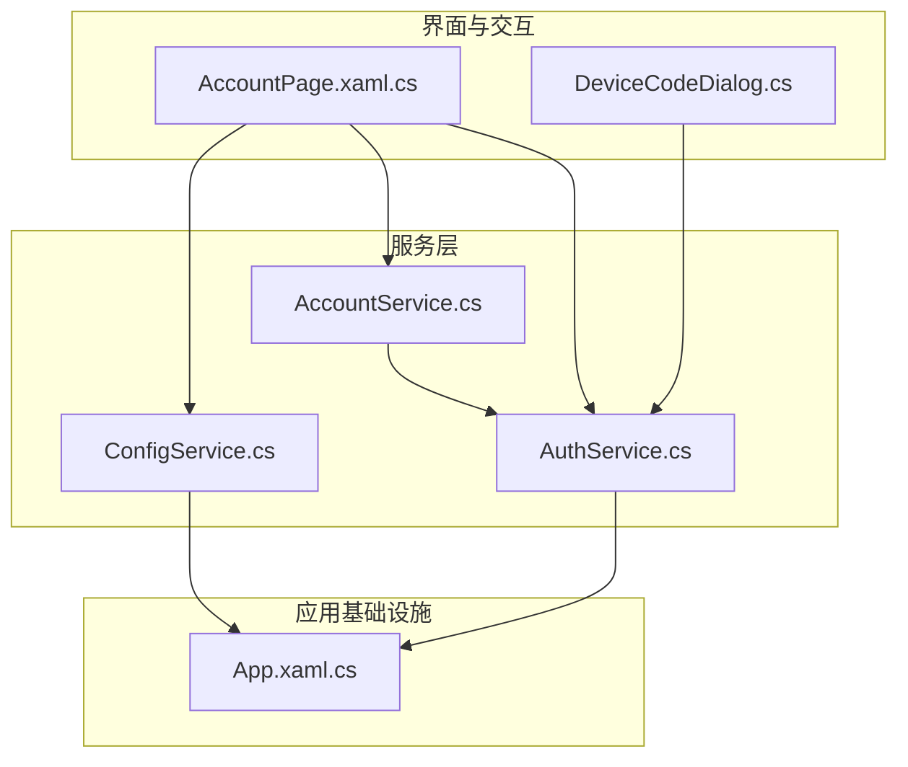
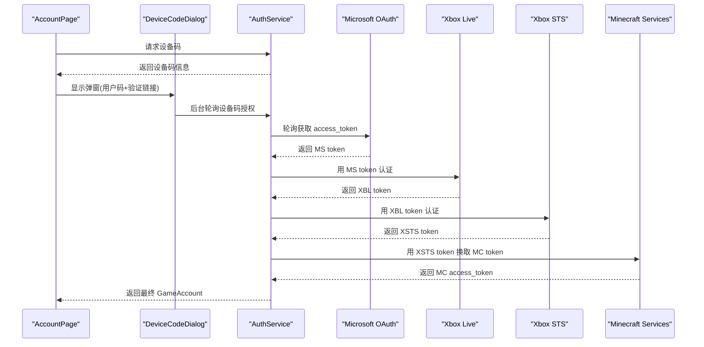
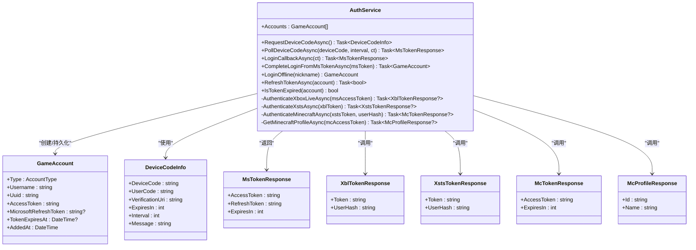
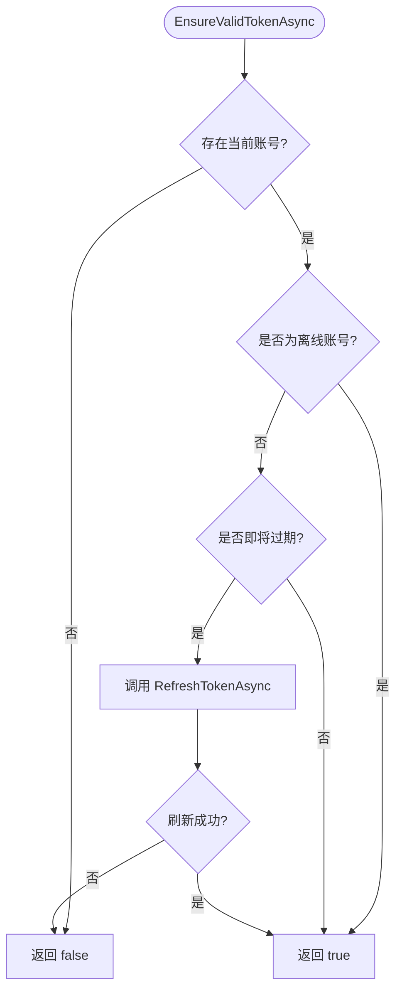
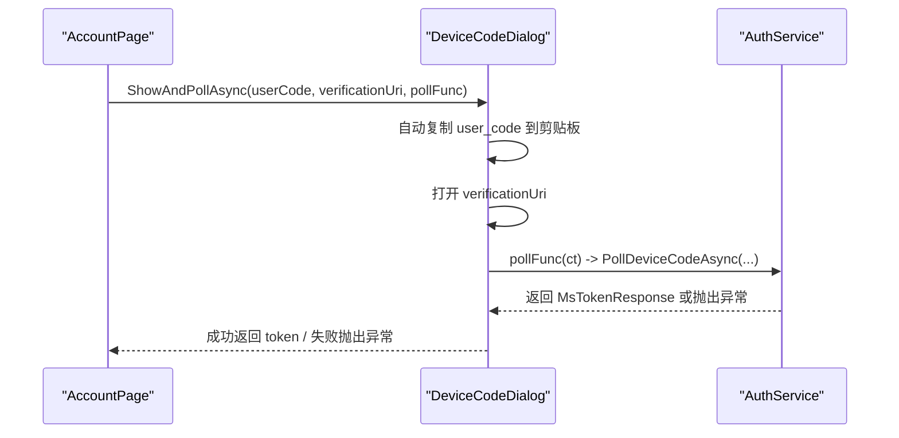
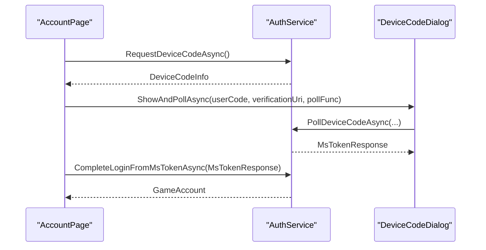
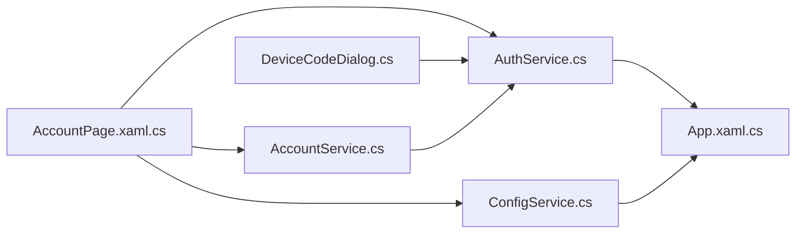

# 认证服务

<cite>
**本文引用的文件**   
- [AuthService.cs](file://src/FufuLauncher/Services/AuthService.cs)
- [AccountService.cs](file://src/FufuLauncher/Services/AccountService.cs)
- [DeviceCodeDialog.cs](file://src/FufuLauncher/Interaction/DeviceCodeDialog.cs)
- [AccountPage.xaml.cs](file://src/FufuLauncher/Views/AccountPage.xaml.cs)
- [ConfigService.cs](file://src/FufuLauncher/Services/ConfigService.cs)
- [App.xaml.cs](file://src/FufuLauncher/App.xaml.cs)
</cite>

## 目录
1. [简介](#简介)
2. [项目结构](#项目结构)
3. [核心组件](#核心组件)
4. [架构总览](#架构总览)
5. [详细组件分析](#详细组件分析)
6. [依赖关系分析](#依赖关系分析)
7. [性能与可用性](#性能与可用性)
8. [故障排除指南](#故障排除指南)
9. [结论](#结论)
10. [附录：安全最佳实践](#附录安全最佳实践)

## 简介
本文件为 AuthService 的完整技术文档，聚焦微软账号登录流程、OAuth 2.0 设备码授权模式与本地回调备选模式、Token 全链路管理与刷新机制、离线账号支持、账户信息管理与会话保持策略。同时给出与 AccountService 的协作关系、数据同步机制、完整的时序图与状态转换图，以及常见问题的排查方法与安全建议。

## 项目结构
认证相关代码主要分布在以下模块：
- 服务层：AuthService（认证与令牌链）、AccountService（当前账号与自动刷新）
- 交互层：DeviceCodeDialog（设备码弹窗与轮询 UI）
- 视图层：AccountPage（登录入口、错误提示、离线登录）
- 配置层：ConfigService（AuthMode、回调端口等）
- 应用层：App（DI 容器、日志、数据目录初始化）

图表来源
- [AccountPage.xaml.cs:1-143](file://src/FufuLauncher/Views/AccountPage.xaml.cs#L1-L143)
- [DeviceCodeDialog.cs:1-204](file://src/FufuLauncher/Interaction/DeviceCodeDialog.cs#L1-L204)
- [AuthService.cs:1-683](file://src/FufuLauncher/Services/AuthService.cs#L1-L683)
- [AccountService.cs:1-54](file://src/FufuLauncher/Services/AccountService.cs#L1-L54)
- [ConfigService.cs:1-152](file://src/FufuLauncher/Services/ConfigService.cs#L1-L152)
- [App.xaml.cs:1-207](file://src/FufuLauncher/App.xaml.cs#L1-L207)

章节来源
- [App.xaml.cs:75-117](file://src/FufuLauncher/App.xaml.cs#L75-L117)
- [ConfigService.cs:41-44](file://src/FufuLauncher/Services/ConfigService.cs#L41-L44)

## 核心组件
- AuthService：实现微软 OAuth 设备码与本地回调两种登录模式；完成 MS→XBL→XSTS→MC 的完整令牌链；持久化 GameAccount；提供 Token 刷新与过期检测；处理离线账号。
- AccountService：维护当前账号、删除账号、在启动游戏前校验并自动刷新令牌。
- DeviceCodeDialog：设备码登录弹窗，自动复制验证码、一键打开浏览器、后台轮询授权结果。
- AccountPage：登录入口页面，按配置选择设备码或本地回调登录，展示错误类型提示，支持离线账号创建与切换。
- ConfigService：保存 AuthMode、回调端口等认证相关配置。
- App：统一日志写入、数据目录初始化、DI 容器注册。

章节来源
- [AuthService.cs:76-121](file://src/FufuLauncher/Services/AuthService.cs#L76-L121)
- [AccountService.cs:12-26](file://src/FufuLauncher/Services/AccountService.cs#L12-L26)
- [DeviceCodeDialog.cs:20-44](file://src/FufuLauncher/Interaction/DeviceCodeDialog.cs#L20-L44)
- [AccountPage.xaml.cs:17-27](file://src/FufuLauncher/Views/AccountPage.xaml.cs#L17-L27)
- [ConfigService.cs:41-44](file://src/FufuLauncher/Services/ConfigService.cs#L41-L44)
- [App.xaml.cs:131-178](file://src/FufuLauncher/App.xaml.cs#L131-L178)

## 架构总览
认证系统采用“界面-服务-外部协议”的分层设计：
- 界面层负责用户交互与错误提示
- 服务层封装 OAuth 2.0 与 XBL/XSTS/MC 令牌交换逻辑
- 外部协议包括 Microsoft OAuth、Xbox Live、Xbox STS、Minecraft 服务端

图表来源
- [AccountPage.xaml.cs:57-72](file://src/FufuLauncher/Views/AccountPage.xaml.cs#L57-L72)
- [DeviceCodeDialog.cs:26-62](file://src/FufuLauncher/Interaction/DeviceCodeDialog.cs#L26-L62)
- [AuthService.cs:159-192](file://src/FufuLauncher/Services/AuthService.cs#L159-L192)
- [AuthService.cs:198-265](file://src/FufuLauncher/Services/AuthService.cs#L198-L265)
- [AuthService.cs:343-398](file://src/FufuLauncher/Services/AuthService.cs#L343-L398)

## 详细组件分析

### AuthService：认证与令牌管理
- 支持的登录模式
  - 设备码授权（默认优先）：通过 Microsoft OAuth device_code 流程，弹窗展示 user_code，自动复制到剪贴板，一键打开验证链接，后台轮询授权结果。
  - 本地回调（备选）：使用 HttpListener 监听 127.0.0.1:54321，重定向到授权页后换取授权码再换 token。
- 完整令牌链
  - MS access_token → XBL authenticate → XSTS authorize → Minecraft login_with_xbox → 玩家资料查询
- 持久化与会话
  - 将 GameAccount 以 JSON 文件保存在 appmcGAME/accounts 目录下，文件名基于 Uuid
  - 保存 MicrosoftRefreshToken、AccessToken、TokenExpiresAt
- Token 刷新与过期
  - IsTokenExpired 判断是否临近过期（提前 5 分钟）
  - RefreshTokenAsync 使用 refresh_token 重新走完整令牌链，更新内存与磁盘
- 离线账号
  - LoginOffline 生成确定性离线 UUID（遵循 Minecraft 离线规则），仅保存昵称与 UUID
- 错误分类
  - AuthError 枚举区分网络异常、未购买 Minecraft、用户取消、设备码过期、令牌交换失败等

图表来源
- [AuthService.cs:50-74](file://src/FufuLauncher/Services/AuthService.cs#L50-L74)
- [AuthService.cs:646-682](file://src/FufuLauncher/Services/AuthService.cs#L646-L682)

章节来源
- [AuthService.cs:76-121](file://src/FufuLauncher/Services/AuthService.cs#L76-L121)
- [AuthService.cs:159-192](file://src/FufuLauncher/Services/AuthService.cs#L159-L192)
- [AuthService.cs:198-265](file://src/FufuLauncher/Services/AuthService.cs#L198-L265)
- [AuthService.cs:270-338](file://src/FufuLauncher/Services/AuthService.cs#L270-L338)
- [AuthService.cs:343-398](file://src/FufuLauncher/Services/AuthService.cs#L343-L398)
- [AuthService.cs:403-416](file://src/FufuLauncher/Services/AuthService.cs#L403-L416)
- [AuthService.cs:421-468](file://src/FufuLauncher/Services/AuthService.cs#L421-L468)
- [AuthService.cs:470-474](file://src/FufuLauncher/Services/AuthService.cs#L470-L474)
- [AuthService.cs:504-606](file://src/FufuLauncher/Services/AuthService.cs#L504-L606)
- [AuthService.cs:609-643](file://src/FufuLauncher/Services/AuthService.cs#L609-L643)

### AccountService：账户管理与自动刷新
- 职责
  - 暴露 Accounts 列表与 CurrentAccount
  - 设置当前账号、删除账号
  - EnsureValidTokenAsync 在启动游戏前检查并自动刷新令牌
- 与 AuthService 协作
  - 直接委托 AuthService 进行令牌刷新与过期判断

图表来源
- [AccountService.cs:42-52](file://src/FufuLauncher/Services/AccountService.cs#L42-L52)

章节来源
- [AccountService.cs:12-26](file://src/FufuLauncher/Services/AccountService.cs#L12-L26)
- [AccountService.cs:28-39](file://src/FufuLauncher/Services/AccountService.cs#L28-L39)
- [AccountService.cs:42-52](file://src/FufuLauncher/Services/AccountService.cs#L42-L52)

### DeviceCodeDialog：设备码登录弹窗
- 功能
  - 大字号显示 user_code，自动复制到剪贴板
  - 一键打开 verification_uri
  - 后台轮询授权结果，成功关闭弹窗并返回 token
  - 支持用户取消（关闭窗口或点击取消按钮）
- 与 AuthService 协作
  - 接收 pollFunc（即 PollDeviceCodeAsync）并在后台执行

图表来源
- [DeviceCodeDialog.cs:26-62](file://src/FufuLauncher/Interaction/DeviceCodeDialog.cs#L26-L62)
- [AuthService.cs:198-265](file://src/FufuLauncher/Services/AuthService.cs#L198-L265)

章节来源
- [DeviceCodeDialog.cs:20-44](file://src/FufuLauncher/Interaction/DeviceCodeDialog.cs#L20-L44)
- [DeviceCodeDialog.cs:127-170](file://src/FufuLauncher/Interaction/DeviceCodeDialog.cs#L127-L170)
- [DeviceCodeDialog.cs:172-202](file://src/FufuLauncher/Interaction/DeviceCodeDialog.cs#L172-L202)

### AccountPage：登录入口与错误处理
- 登录模式切换
  - 根据 ConfigService.Config.AuthMode 决定使用设备码或本地回调
- 设备码登录流程
  - RequestDeviceCodeAsync → DeviceCodeDialog.ShowAndPollAsync → CompleteLoginFromMsTokenAsync
- 本地回调登录流程
  - LoginCallbackAsync → CompleteLoginFromMsTokenAsync
- 错误提示
  - 根据 AuthError 枚举显示不同标题与图标

图表来源
- [AccountPage.xaml.cs:57-72](file://src/FufuLauncher/Views/AccountPage.xaml.cs#L57-L72)
- [AuthService.cs:159-192](file://src/FufuLauncher/Services/AuthService.cs#L159-L192)
- [AuthService.cs:343-398](file://src/FufuLauncher/Services/AuthService.cs#L343-L398)

章节来源
- [AccountPage.xaml.cs:29-45](file://src/FufuLauncher/Views/AccountPage.xaml.cs#L29-L45)
- [AccountPage.xaml.cs:75-103](file://src/FufuLauncher/Views/AccountPage.xaml.cs#L75-L103)
- [AccountPage.xaml.cs:105-114](file://src/FufuLauncher/Views/AccountPage.xaml.cs#L105-L114)

### 配置与存储
- 配置项
  - AuthMode：DeviceCode（默认）或 LocalCallback
  - AuthCallbackPort：本地回调端口（默认 54321）
- 数据存储
  - 账号文件位于 App.AppDataDir/accounts，文件名基于 Uuid.json
  - 包含 AccessToken、MicrosoftRefreshToken、TokenExpiresAt 等字段
- 应用数据目录
  - App.AppDataDir 指向程序同级 appmcGAME 目录，确保不写入 C 盘用户目录

章节来源
- [ConfigService.cs:41-44](file://src/FufuLauncher/Services/ConfigService.cs#L41-L44)
- [AuthService.cs:107-145](file://src/FufuLauncher/Services/AuthService.cs#L107-L145)
- [App.xaml.cs:84-97](file://src/FufuLauncher/App.xaml.cs#L84-L97)

## 依赖关系分析
- AccountPage 依赖 AuthService、AccountService、ConfigService
- DeviceCodeDialog 依赖 AuthService（通过回调函数）
- AccountService 依赖 AuthService
- AuthService 依赖 ConfigService（读取配置）、App（日志写入）
- App 负责 DI 容器注册所有服务

图表来源
- [AccountPage.xaml.cs:17-27](file://src/FufuLauncher/Views/AccountPage.xaml.cs#L17-L27)
- [DeviceCodeDialog.cs:16-17](file://src/FufuLauncher/Interaction/DeviceCodeDialog.cs#L16-L17)
- [AccountService.cs:14-26](file://src/FufuLauncher/Services/AccountService.cs#L14-L26)
- [AuthService.cs:106-121](file://src/FufuLauncher/Services/AuthService.cs#L106-L121)
- [App.xaml.cs:131-178](file://src/FufuLauncher/App.xaml.cs#L131-L178)

章节来源
- [App.xaml.cs:131-178](file://src/FufuLauncher/App.xaml.cs#L131-L178)

## 性能与可用性
- 网络超时与重试
  - HttpClient 设置 30 秒超时，设备码轮询对网络异常进行延迟重试
- 日志缓冲
  - 应用日志通过 ConcurrentQueue 与 Timer 批量写入，避免频繁 IO 阻塞
- 令牌刷新
  - 提前 5 分钟检测过期，减少运行时中断
- 资源释放
  - HttpListener 在回调登录后及时停止，避免端口占用

章节来源
- [AuthService.cs:94-100](file://src/FufuLauncher/Services/AuthService.cs#L94-L100)
- [AuthService.cs:252-258](file://src/FufuLauncher/Services/AuthService.cs#L252-L258)
- [App.xaml.cs:33-60](file://src/FufuLauncher/App.xaml.cs#L33-L60)
- [AuthService.cs:329-338](file://src/FufuLauncher/Services/AuthService.cs#L329-L338)

## 故障排除指南
- 网络异常
  - 现象：设备码轮询或令牌交换失败
  - 处理：检查网络连接与代理设置，查看应用日志中的网络异常记录
- 设备码过期
  - 现象：轮询返回 expired_token
  - 处理：重新发起设备码请求，缩短等待时间
- 用户取消
  - 现象：弹窗关闭或点击取消
  - 处理：提示用户重新尝试登录
- 未购买 Minecraft
  - 现象：查询玩家资料返回 404
  - 处理：引导用户前往微软商店或官网购买
- 本地回调端口占用
  - 现象：HttpListener 启动失败
  - 处理：更换端口或关闭占用进程，或在设置中切换为设备码模式
- 令牌刷新失败
  - 现象：RefreshTokenAsync 返回 false
  - 处理：检查 refresh_token 有效性，必要时重新登录

章节来源
- [AccountPage.xaml.cs:75-103](file://src/FufuLauncher/Views/AccountPage.xaml.cs#L75-L103)
- [AuthService.cs:184-191](file://src/FufuLauncher/Services/AuthService.cs#L184-L191)
- [AuthService.cs:233-240](file://src/FufuLauncher/Services/AuthService.cs#L233-L240)
- [AuthService.cs:617-622](file://src/FufuLauncher/Services/AuthService.cs#L617-L622)
- [AuthService.cs:278-282](file://src/FufuLauncher/Services/AuthService.cs#L278-L282)
- [AuthService.cs:441-447](file://src/FufuLauncher/Services/AuthService.cs#L441-L447)

## 结论
AuthService 实现了完整的微软账号认证与令牌管理，支持设备码与本地回调两种模式，具备完善的错误分类与恢复机制。AccountService 提供了便捷的当前账号管理与自动刷新能力。整体架构清晰、职责分离，便于扩展与维护。

## 附录：安全最佳实践
- 最小权限原则
  - 仅请求必要的 scope（XboxLive.signin offline_access）
- 安全存储
  - 敏感令牌存储在 appmcGAME/accounts/*.json，建议限制文件访问权限
- 传输安全
  - 所有 API 调用均使用 HTTPS
- 会话管理
  - 合理设置 TokenExpiresAt，避免长时间持有过期令牌
- 错误处理
  - 区分网络异常与业务错误，避免泄露敏感信息
- 用户控制
  - 提供明确的取消与退出路径，尊重用户选择

[本节为通用安全建议，不直接引用具体文件]