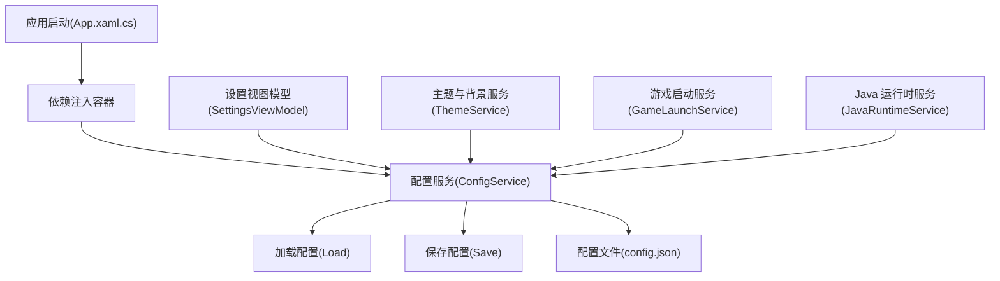
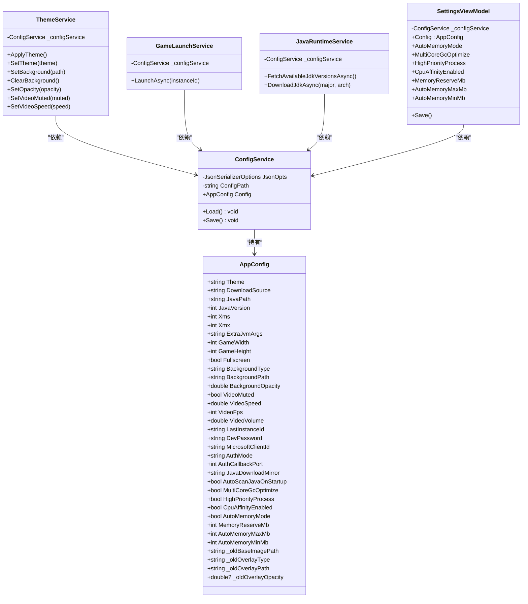
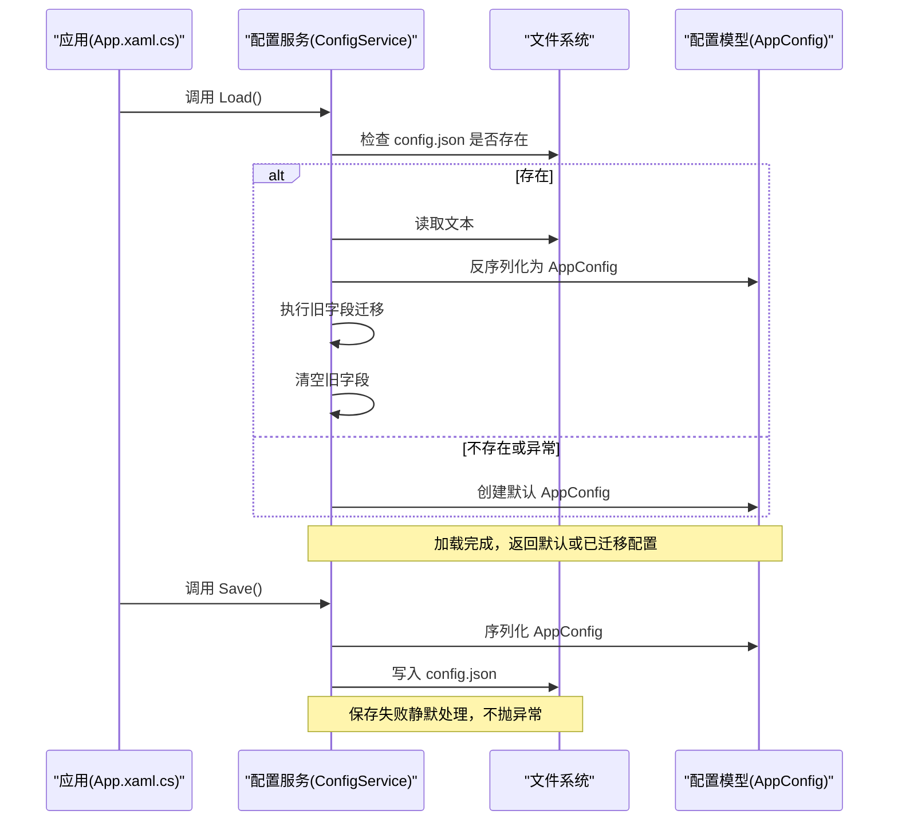
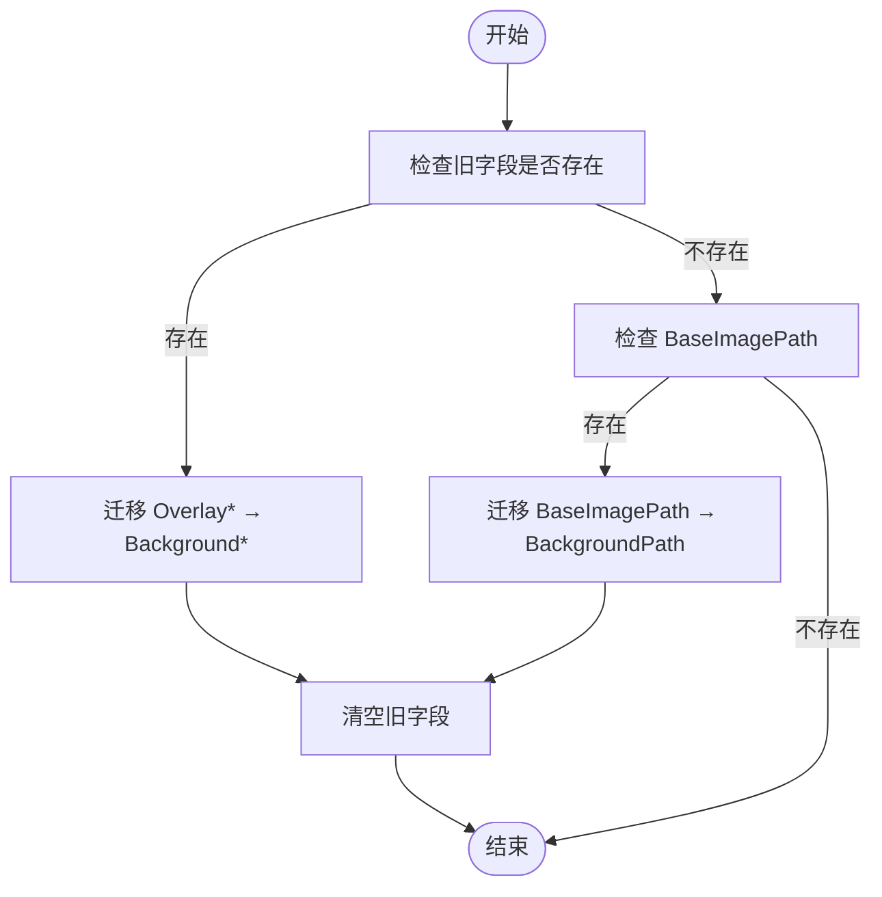
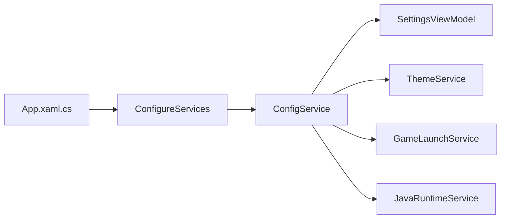

# 配置服务

<cite>
**本文引用的文件**   
- [ConfigService.cs](file://src/FufuLauncher/Services/ConfigService.cs)
- [App.xaml.cs](file://src/FufuLauncher/App.xaml.cs)
- [SettingsViewModel.cs](file://src/FufuLauncher/ViewModels/SettingsViewModel.cs)
- [ThemeService.cs](file://src/FufuLauncher/Services/ThemeService.cs)
- [GameLaunchService.cs](file://src/FufuLauncher/Services/GameLaunchService.cs)
- [JavaRuntimeService.cs](file://src/FufuLauncher/Services/JavaRuntimeService.cs)
- [config.json](file://Start/appmcGAME/config.json)
</cite>

## 目录
1. [简介](#简介)
2. [项目结构](#项目结构)
3. [核心组件](#核心组件)
4. [架构总览](#架构总览)
5. [详细组件分析](#详细组件分析)
6. [依赖关系分析](#依赖关系分析)
7. [性能考量](#性能考量)
8. [故障排查指南](#故障排查指南)
9. [结论](#结论)
10. [附录：配置项参考](#附录配置项参考)

## 简介
本文件为 ConfigService 配置管理系统的完整技术文档，覆盖 JSON 配置文件结构、配置项定义与默认值、加载/保存/迁移/版本兼容策略、数据类型与校验约束、用户偏好与系统级配置、环境变量策略（如有）、序列化/反序列化机制、错误处理与回退策略，以及备份恢复与故障恢复建议。读者可据此理解并安全扩展配置体系。

## 项目结构
- 配置数据模型与持久化逻辑集中在配置服务中，提供统一的读取与写入入口。
- 应用启动时通过依赖注入容器注册配置服务，并在应用初始化阶段调用加载方法。
- UI 设置页与服务层通过配置服务读写配置，实现“所见即所得”的配置编辑体验。
- 运行时服务根据配置动态调整行为（如下载源、JVM 参数、内存分配等）。

**图表来源** 
- [App.xaml.cs:131-178](file://src/FufuLauncher/App.xaml.cs#L131-L178)
- [ConfigService.cs:88-151](file://src/FufuLauncher/Services/ConfigService.cs#L88-L151)

**章节来源**
- [App.xaml.cs:131-178](file://src/FufuLauncher/App.xaml.cs#L131-L178)
- [ConfigService.cs:88-151](file://src/FufuLauncher/Services/ConfigService.cs#L88-L151)

## 核心组件
- AppConfig：配置数据模型，包含所有配置项及默认值，使用 System.Text.Json 进行序列化/反序列化。
- ConfigService：负责配置的加载、保存、旧字段迁移与兼容性处理；对外暴露当前配置实例。

关键职责
- 统一路径：配置文件位于应用数据目录下的 config.json。
- 健壮性：加载失败或解析异常时回退到默认配置，避免崩溃。
- 迁移：自动将旧字段迁移到新字段，并在完成后清空旧字段，确保后续不再重复迁移。
- 序列化选项：缩进输出、忽略空值，提升可读性与体积控制。

**章节来源**
- [ConfigService.cs:13-86](file://src/FufuLauncher/Services/ConfigService.cs#L13-L86)
- [ConfigService.cs:88-151](file://src/FufuLauncher/Services/ConfigService.cs#L88-L151)

## 架构总览
配置服务作为单例被注入到多个服务中，形成“中心配置”的架构模式。UI 层通过视图模型修改配置，服务层在运行期读取配置以决定行为。

**图表来源** 
- [ConfigService.cs:13-86](file://src/FufuLauncher/Services/ConfigService.cs#L13-L86)
- [ConfigService.cs:88-151](file://src/FufuLauncher/Services/ConfigService.cs#L88-L151)
- [ThemeService.cs:16-314](file://src/FufuLauncher/Services/ThemeService.cs#L16-L314)
- [GameLaunchService.cs:35-65](file://src/FufuLauncher/Services/GameLaunchService.cs#L35-L65)
- [JavaRuntimeService.cs:50-84](file://src/FufuLauncher/Services/JavaRuntimeService.cs#L50-L84)
- [SettingsViewModel.cs:20-252](file://src/FufuLauncher/ViewModels/SettingsViewModel.cs#L20-L252)

## 详细组件分析

### 配置加载与保存流程
- 加载流程：检查配置文件是否存在 → 读取文本 → 反序列化为 AppConfig → 执行旧字段迁移 → 清理旧字段。
- 保存流程：将当前 AppConfig 序列化为 JSON 文本 → 写入配置文件。
- 异常处理：加载或保存过程中发生异常时，不抛出异常，保证应用稳定性；加载失败回退到默认配置。

**图表来源** 
- [ConfigService.cs:101-151](file://src/FufuLauncher/Services/ConfigService.cs#L101-L151)
- [App.xaml.cs:104-107](file://src/FufuLauncher/App.xaml.cs#L104-L107)

**章节来源**
- [ConfigService.cs:101-151](file://src/FufuLauncher/Services/ConfigService.cs#L101-L151)
- [App.xaml.cs:104-107](file://src/FufuLauncher/App.xaml.cs#L104-L107)

### 配置迁移与版本兼容
- 旧字段映射：
  - OverlayPath/OverlayType → BackgroundPath/BackgroundType
  - BaseImagePath → BackgroundPath
  - OverlayOpacity → BackgroundOpacity（当大于 0）
- 迁移触发条件：仅在旧字段存在且新字段为空时进行迁移。
- 迁移后清理：清空旧字段，避免重复迁移。
- 兼容性策略：保留旧字段用于读取兼容，写入时忽略空值，减少冗余。

**图表来源** 
- [ConfigService.cs:110-132](file://src/FufuLauncher/Services/ConfigService.cs#L110-L132)

**章节来源**
- [ConfigService.cs:110-132](file://src/FufuLauncher/Services/ConfigService.cs#L110-L132)

### 配置项的数据类型、验证规则与约束
- 字符串类：主题、下载源、Java 路径、额外 JVM 参数、背景路径、账号相关标识等。
- 数值类：Xms/Xmx（MB）、分辨率、视频帧率、音量、速度、内存预留与上下限等。
- 布尔类：全屏、静音、多核 GC 优化、高优先级进程、CPU 亲和性、智能内存模式等。
- 验证与约束：
  - 内存预留至少 1024 MB（由代码注释说明）。
  - 智能内存上限防止溢出（由代码注释说明）。
  - 背景透明度范围 0~1（由代码注释说明）。
  - 下载源与镜像源取值受服务层限制（例如 Java 下载镜像 Official/Huaweicloud）。
- 注意：当前未实现严格的输入校验器，建议在 UI 层或服务层对关键项增加边界检查。

**章节来源**
- [ConfigService.cs:13-86](file://src/FufuLauncher/Services/ConfigService.cs#L13-L86)
- [JavaRuntimeService.cs:108-113](file://src/FufuLauncher/Services/JavaRuntimeService.cs#L108-L113)

### 用户偏好设置与系统级配置
- 用户偏好：主题、背景（图片/视频）、分辨率、全屏、视频播放参数、开发密码、上次实例 ID。
- 系统级配置：下载源、Java 路径与版本、JVM 参数、Java 下载镜像、开机扫描开关、GC 多核优化、进程优先级、CPU 亲和性、智能内存分配策略。
- 影响范围：
  - UI 主题与背景由 ThemeService 直接应用。
  - 游戏启动参数由 GameLaunchService 根据配置拼接。
  - Java 运行时管理与下载由 JavaRuntimeService 根据镜像源切换。

**章节来源**
- [ThemeService.cs:32-62](file://src/FufuLauncher/Services/ThemeService.cs#L32-L62)
- [GameLaunchService.cs:179-193](file://src/FufuLauncher/Services/GameLaunchService.cs#L179-L193)
- [JavaRuntimeService.cs:116-158](file://src/FufuLauncher/Services/JavaRuntimeService.cs#L116-L158)

### 环境变量管理策略
- 当前实现未引入环境变量覆盖配置项的策略。
- 建议：如需支持环境变量覆盖，可在加载配置后按优先级合并环境变量（例如 JAVA_PATH、DOWNLOAD_SOURCE），但需明确优先级与冲突处理规则。

[本节为概念性内容，不直接分析具体文件]

### 序列化/反序列化机制
- 使用 System.Text.Json 进行序列化/反序列化。
- 选项：缩进输出、忽略空值，提高可读性与体积控制。
- 旧字段标记：JsonPropertyName 指定 JSON 键名，JsonIgnore 控制写入时的空值忽略。

**章节来源**
- [ConfigService.cs:90-94](file://src/FufuLauncher/Services/ConfigService.cs#L90-L94)
- [ConfigService.cs:71-86](file://src/FufuLauncher/Services/ConfigService.cs#L71-L86)

### 错误处理与回退策略
- 加载失败：捕获异常并回退到默认配置，避免应用崩溃。
- 保存失败：静默处理，不抛出异常，确保用户体验稳定。
- 日志记录：其他服务在遇到配置相关问题时会记录日志（例如主题服务、启动服务）。

**章节来源**
- [ConfigService.cs:133-150](file://src/FufuLauncher/Services/ConfigService.cs#L133-L150)
- [ThemeService.cs:202-206](file://src/FufuLauncher/Services/ThemeService.cs#L202-L206)
- [GameLaunchService.cs:160-177](file://src/FufuLauncher/Services/GameLaunchService.cs#L160-L177)

### 配置备份、恢复与故障恢复机制
- 当前实现未内置备份/恢复功能。
- 建议方案：
  - 定期备份：在保存前复制 config.json 为带时间戳的备份文件。
  - 恢复策略：提供导入/恢复接口，从备份文件还原配置。
  - 故障恢复：若配置文件损坏，优先尝试恢复最近一次备份，否则回退到默认配置。

[本节为概念性内容，不直接分析具体文件]

## 依赖关系分析
- 应用启动阶段注册 ConfigService 为单例，并在 OnStartup 中调用 Load。
- 多个服务通过构造函数注入 ConfigService，读取或修改配置。
- 视图模型通过 ConfigService 暴露的配置对象进行双向绑定与保存。

**图表来源** 
- [App.xaml.cs:131-178](file://src/FufuLauncher/App.xaml.cs#L131-L178)
- [ConfigService.cs:88-151](file://src/FufuLauncher/Services/ConfigService.cs#L88-L151)

**章节来源**
- [App.xaml.cs:131-178](file://src/FufuLauncher/App.xaml.cs#L131-L178)
- [ConfigService.cs:88-151](file://src/FufuLauncher/Services/ConfigService.cs#L88-L151)

## 性能考量
- 序列化选项启用缩进输出，便于调试但会增加文件大小；生产环境可考虑按需关闭缩进。
- 忽略空值可减少冗余字段，降低 I/O 压力。
- 配置加载与保存为同步操作，应避免在主线程频繁调用；建议在 UI 变更批量提交后再统一保存。
- 迁移逻辑仅在加载时执行一次，避免重复计算。

[本节为通用指导，不直接分析具体文件]

## 故障排查指南
- 配置文件损坏：加载失败会回退到默认配置；检查 config.json 是否为有效 JSON。
- 迁移未生效：确认旧字段是否仍存在于配置文件中；迁移完成后旧字段会被清空。
- 保存失败：检查应用数据目录权限与磁盘空间；查看应用日志是否有写入错误。
- 主题/背景未应用：确认背景路径存在且类型正确；检查透明度与视频参数设置。

**章节来源**
- [ConfigService.cs:133-150](file://src/FufuLauncher/Services/ConfigService.cs#L133-L150)
- [ThemeService.cs:202-206](file://src/FufuLauncher/Services/ThemeService.cs#L202-L206)

## 结论
ConfigService 提供了简洁可靠的配置管理能力，涵盖加载、保存、迁移与兼容性处理。通过单例注入与统一模型，多个服务可安全地读取与修改配置。建议在未来增强输入校验、环境变量覆盖、备份恢复等功能，以提升鲁棒性与可维护性。

[本节为总结性内容，不直接分析具体文件]

## 附录：配置项参考
以下为 AppConfig 中的主要配置项及其作用、默认值与影响范围说明（基于源码注释与使用场景整理）：

- 主题与界面
  - Theme：主题（Light/Dark），默认 Light，影响 UI 资源与颜色。
  - BackgroundType：背景类型（None/Image/Video），默认 None。
  - BackgroundPath：背景文件路径（图片或视频），默认空。
  - BackgroundOpacity：背景透明度 0~1，默认 0.6。
  - VideoMuted：视频静音状态，默认 true。
  - VideoSpeed：视频播放速度，默认 1.0。
  - VideoFps：视频帧率，默认 30。
  - VideoVolume：视频音量，默认 0.0。

- 游戏窗口与显示
  - GameWidth：游戏宽度，默认 1280。
  - GameHeight：游戏高度，默认 720。
  - Fullscreen：全屏模式，默认 false。

- Java 与 JVM
  - JavaPath：Java 可执行文件路径，默认空。
  - JavaVersion：Java 主版本，默认 17。
  - Xms：初始堆大小（MB），默认 1024。
  - Xmx：最大堆大小（MB），默认 4096。
  - ExtraJvmArgs：额外 JVM 参数，默认空。
  - JavaDownloadMirror：Java 下载镜像（Official/Huaweicloud），默认 Huaweicloud。
  - AutoScanJavaOnStartup：开机自动扫描 Java，默认 false。
  - MultiCoreGcOptimize：启用 GC 多核优化预设，默认 false。
  - HighPriorityProcess：设置 Java 进程高优先级，默认 false。
  - CpuAffinityEnabled：启用 CPU 亲和性增强，默认 false。

- 内存智能分配
  - AutoMemoryMode：启用智能自动内存分配，默认 true。
  - MemoryReserveMb：系统预留内存（MB），默认 1024。
  - AutoMemoryMaxMb：智能分配内存上限（MB），默认 16384。
  - AutoMemoryMinMb：智能分配内存下限（MB），默认 1024。

- 账号与认证
  - LastInstanceId：上次启动的实例 ID，默认空。
  - DevPassword：开发密码，默认 1234567。
  - MicrosoftClientId：微软账号 ClientId，默认固定值。
  - AuthMode：认证模式（DeviceCode 等），默认 DeviceCode。
  - AuthCallbackPort：本地回调端口，默认 54321。

- 下载与版本
  - DownloadSource：下载源（Mojang/BMCLAPI），默认 BMCLAPI。

- 旧字段（仅用于兼容读取，写入时忽略空值）
  - _oldBaseImagePath、_oldOverlayType、_oldOverlayPath、_oldOverlayOpacity、_oldBackgroundEnabled。

示例配置文件位置与结构参考：
- 配置文件路径：{AppDataDir}/config.json
- 示例内容参见：[config.json](file://Start/appmcGAME/config.json)

**章节来源**
- [ConfigService.cs:13-86](file://src/FufuLauncher/Services/ConfigService.cs#L13-L86)
- [config.json:1-34](file://Start/appmcGAME/config.json#L1-L34)