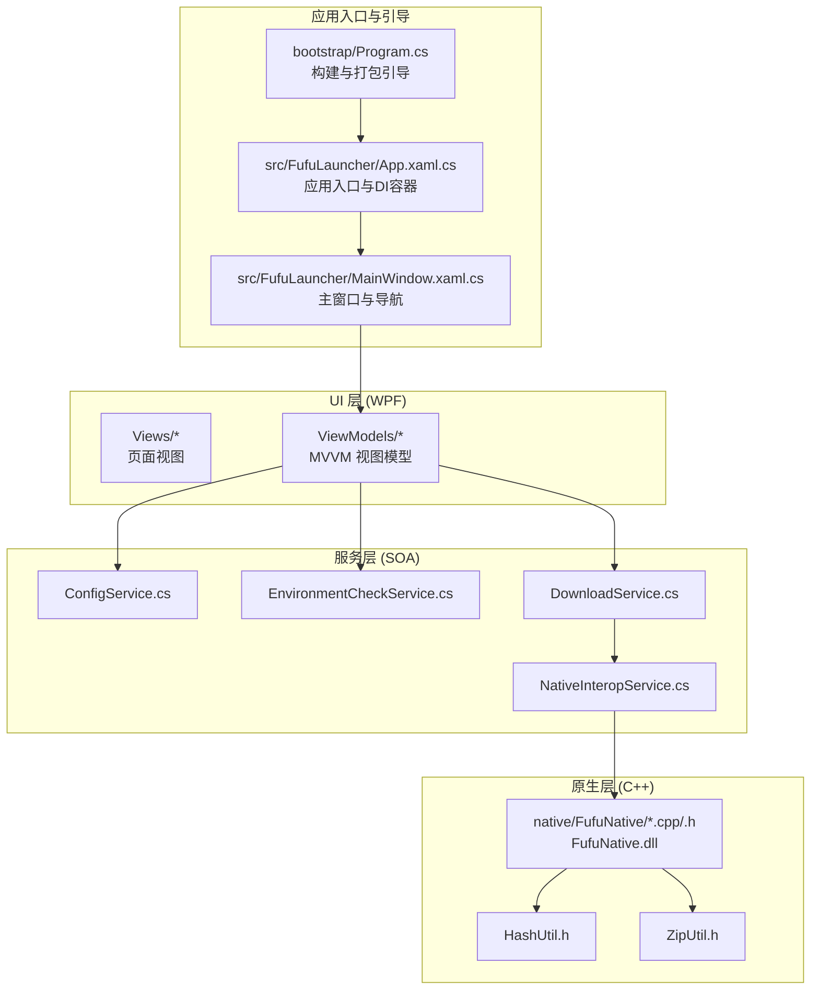
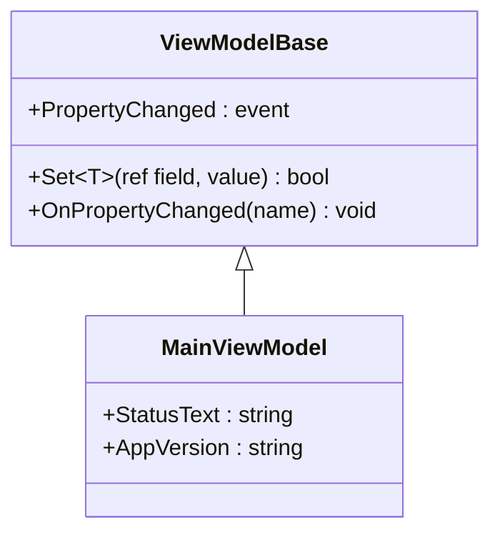
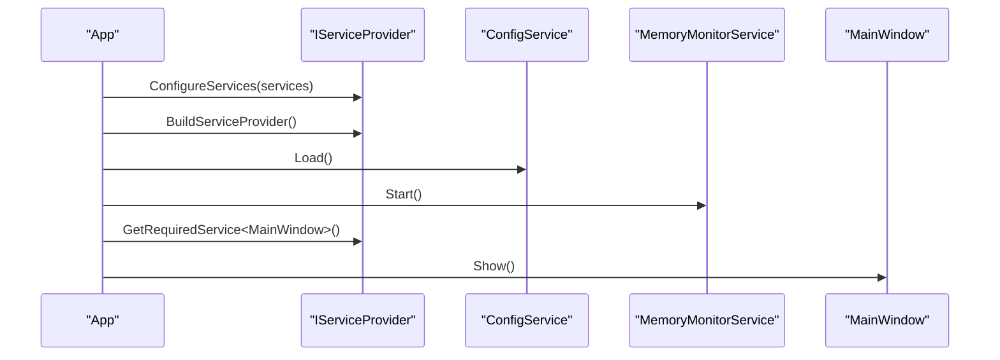
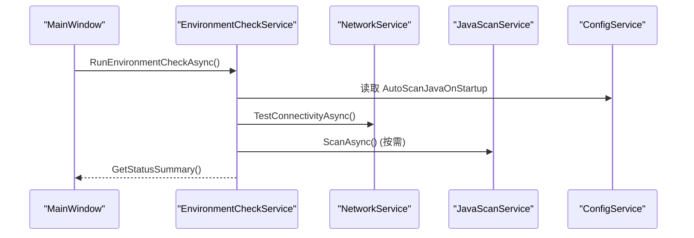
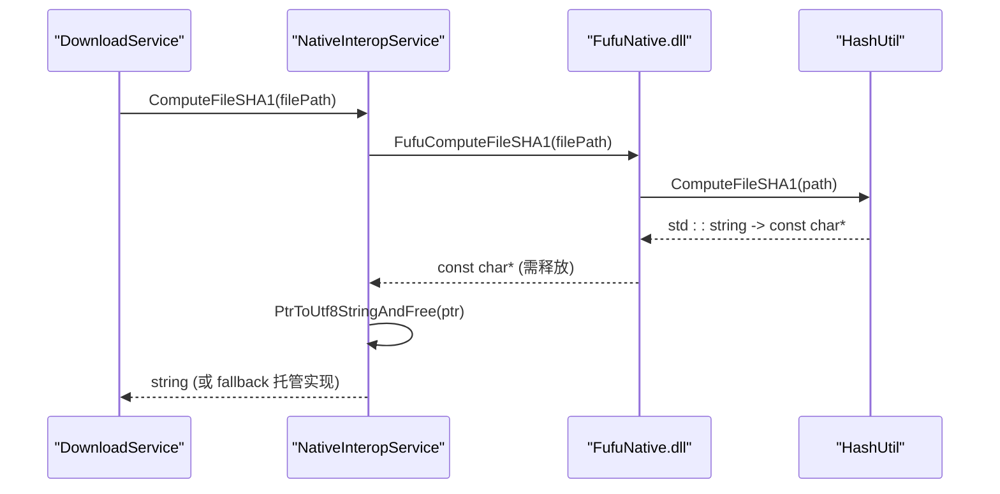
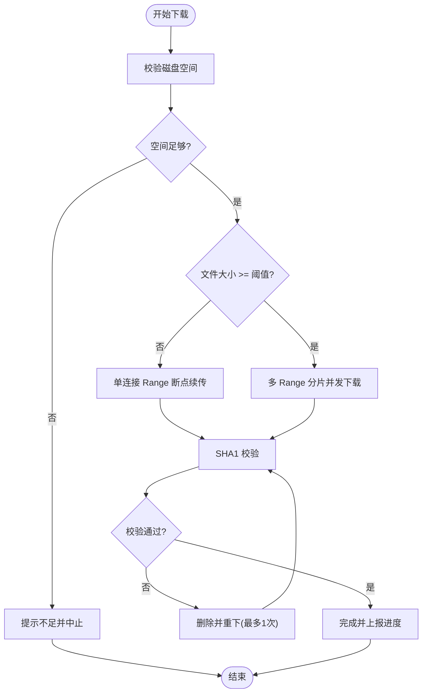
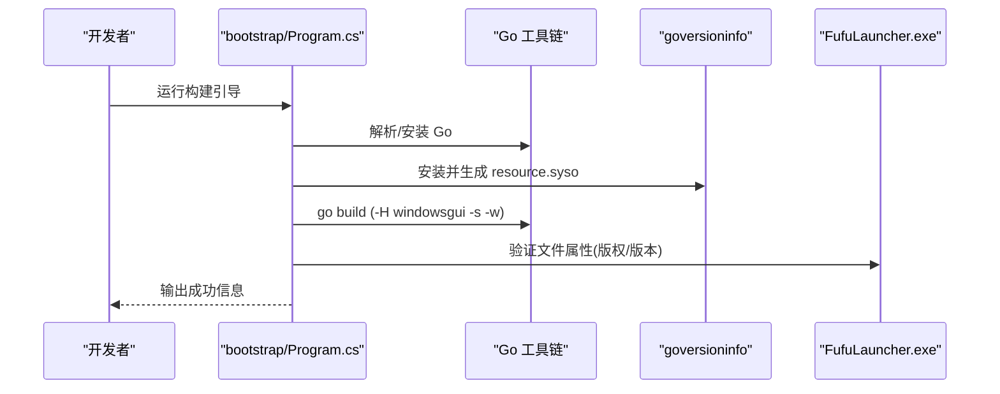
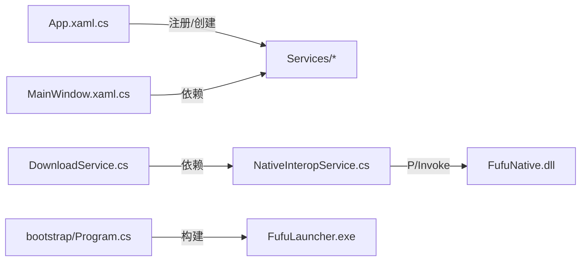

# 架构设计

<cite>
**本文引用的文件**   
- [README.md](file://README.md)
- [App.xaml.cs](file://src/FufuLauncher/App.xaml.cs)
- [MainWindow.xaml.cs](file://src/FufuLauncher/MainWindow.xaml.cs)
- [Program.cs](file://bootstrap/Program.cs)
- [FufuNative.h](file://native/FufuNative/FufuNative.h)
- [FufuNative.cpp](file://native/FufuNative/FufuNative.cpp)
- [HashUtil.h](file://native/FufuNative/HashUtil.h)
- [ZipUtil.h](file://native/FufuNative/ZipUtil.h)
- [NativeInteropService.cs](file://src/FufuLauncher/Services/NativeInteropService.cs)
- [MainViewModel.cs](file://src/FufuLauncher/ViewModels/MainViewModel.cs)
- [ViewModelBase.cs](file://src/FufuLauncher/ViewModels/ViewModelBase.cs)
- [ConfigService.cs](file://src/FufuLauncher/Services/ConfigService.cs)
- [EnvironmentCheckService.cs](file://src/FufuLauncher/Services/EnvironmentCheckService.cs)
- [DownloadService.cs](file://src/FufuLauncher/Services/DownloadService.cs)
</cite>

## 目录
1. [简介](#简介)
2. [项目结构](#项目结构)
3. [核心组件](#核心组件)
4. [架构总览](#架构总览)
5. [详细组件分析](#详细组件分析)
6. [依赖关系分析](#依赖关系分析)
7. [性能考量](#性能考量)
8. [故障排查指南](#故障排查指南)
9. [结论](#结论)
10. [附录](#附录)

## 简介
本文件为“可爱的芙芙”启动器的架构设计文档，面向开发者与高级用户，系统阐述高层设计、架构模式、系统边界与关键实现细节。重点覆盖：
- MVVM 模式的职责分离与数据绑定机制
- 依赖注入容器的使用与生命周期管理
- 服务导向架构（SOA）中各业务服务的职责与交互
- C# 主程序与 C++ 原生组件的集成架构（P/Invoke 接口设计与内存管理策略）
- 横切关注点：安全性、监控与错误处理
- 技术栈、第三方依赖与版本兼容性

## 项目结构
项目采用多语言混合架构：C# WPF (.NET 8) 作为 UI 与编排层，C++ 原生 DLL 提供高性能哈希与 ZIP 能力，Go 构建工具链用于打包生成可执行文件。



图表来源 
- [Program.cs:1-425](file://bootstrap/Program.cs#L1-L425)
- [App.xaml.cs:1-254](file://src/FufuLauncher/App.xaml.cs#L1-L254)
- [MainWindow.xaml.cs:1-245](file://src/FufuLauncher/MainWindow.xaml.cs#L1-L245)
- [ConfigService.cs:1-148](file://src/FufuLauncher/Services/ConfigService.cs#L1-L148)
- [EnvironmentCheckService.cs:1-215](file://src/FufuLauncher/Services/EnvironmentCheckService.cs#L1-L215)
- [DownloadService.cs:1-592](file://src/FufuLauncher/Services/DownloadService.cs#L1-L592)
- [NativeInteropService.cs:1-214](file://src/FufuLauncher/Services/NativeInteropService.cs#L1-L214)
- [FufuNative.h:1-53](file://native/FufuNative/FufuNative.h#L1-L53)
- [FufuNative.cpp:1-78](file://native/FufuNative/FufuNative.cpp#L1-L78)
- [HashUtil.h:1-23](file://native/FufuNative/HashUtil.h#L1-L23)
- [ZipUtil.h:1-29](file://native/FufuNative/ZipUtil.h#L1-L29)

章节来源
- [README.md:1-87](file://README.md#L1-L87)

## 核心组件
- 应用入口与 DI 容器：负责初始化配置、注册服务、创建主窗口、全局异常捕获与日志缓冲写入。
- 主窗口与导航：承载自定义标题栏、背景层、页面切换动画与环境自检结果展示。
- 配置服务：集中管理用户设置与持久化，支持旧配置迁移与双层背景结构。
- 环境自检服务：检查 .NET 运行时、操作系统架构、磁盘空间、网络连通性与 Java 扫描。
- 下载服务：多线程分片断点续传、双进度（单任务+全局）、失败重试与 SHA1 校验。
- 原生互操作服务：封装 P/Invoke 调用 C++ 原生 DLL，具备自动 fallback 到托管实现的健壮性。
- 原生层（C++）：基于 Windows BCrypt 的高性能哈希与 Shell COM 的 ZIP 解压/打包。

章节来源
- [App.xaml.cs:1-254](file://src/FufuLauncher/App.xaml.cs#L1-L254)
- [MainWindow.xaml.cs:1-245](file://src/FufuLauncher/MainWindow.xaml.cs#L1-L245)
- [ConfigService.cs:1-148](file://src/FufuLauncher/Services/ConfigService.cs#L1-L148)
- [EnvironmentCheckService.cs:1-215](file://src/FufuLauncher/Services/EnvironmentCheckService.cs#L1-L215)
- [DownloadService.cs:1-592](file://src/FufuLauncher/Services/DownloadService.cs#L1-L592)
- [NativeInteropService.cs:1-214](file://src/FufuLauncher/Services/NativeInteropService.cs#L1-L214)
- [FufuNative.h:1-53](file://native/FufuNative/FufuNative.h#L1-L53)
- [FufuNative.cpp:1-78](file://native/FufuNative/FufuNative.cpp#L1-L78)
- [HashUtil.h:1-23](file://native/FufuNative/HashUtil.h#L1-L23)
- [ZipUtil.h:1-29](file://native/FufuNative/ZipUtil.h#L1-L29)

## 架构总览
系统采用分层架构与服务导向设计：
- 表现层（WPF）：View + ViewModel，通过 INotifyPropertyChanged 驱动 UI 更新。
- 服务层：按职责拆分为配置、环境、下载、原生互操作等独立服务。
- 原生层：C++ 提供高性能计算与系统级能力，C# 通过 P/Invoke 调用并内置 fallback。
- 构建与发布：bootstrap 工具链自动安装 Go、goversioninfo，生成资源信息并编译最终可执行文件。

```mermaid
classDiagram
class App {
+Services : IServiceProvider
+ConfigDir : string
+GameDataDir : string
+WriteAppLog(message)
+ReadAppLog() string
+OnStartup(e)
+OnExit(e)
-ConfigureServices(services)
}
class MainWindow {
-_themeService : ThemeService
-_envCheckService : EnvironmentCheckService
+NavigateToPage(pageName)
+OnBackgroundChanged()
}
class ConfigService {
+Config : AppConfig
+Load()
+Save()
}
class EnvironmentCheckService {
+LastResult : EnvironmentCheckResult
+RunEnvironmentCheckAsync() Task
+GetStatusSummary() string
}
class DownloadService {
+ProgressChanged : event
+OverallProgressChanged : event
+DownloadAllAsync(tasks) Task~bool~
+VerifySha1(filePath, expectedSha1) bool
}
class NativeInteropService {
+ComputeFileSHA1(path) string
+ComputeFileSHA256(path) string
+ExtractZip(zipPath, destDir) bool
+CreateZip(srcDir, zipPath) bool
+IsNativeAvailable() bool
}
App --> MainWindow : "创建并显示"
MainWindow --> EnvironmentCheckService : "使用"
MainWindow --> ConfigService : "读取配置"
DownloadService --> NativeInteropService : "SHA1校验"
NativeInteropService --> "C++ DLL" : "P/Invoke"
```

图表来源 
- [App.xaml.cs:1-254](file://src/FufuLauncher/App.xaml.cs#L1-L254)
- [MainWindow.xaml.cs:1-245](file://src/FufuLauncher/MainWindow.xaml.cs#L1-L245)
- [ConfigService.cs:1-148](file://src/FufuLauncher/Services/ConfigService.cs#L1-L148)
- [EnvironmentCheckService.cs:1-215](file://src/FufuLauncher/Services/EnvironmentCheckService.cs#L1-L215)
- [DownloadService.cs:1-592](file://src/FufuLauncher/Services/DownloadService.cs#L1-L592)
- [NativeInteropService.cs:1-214](file://src/FufuLauncher/Services/NativeInteropService.cs#L1-L214)

## 详细组件分析

### MVVM 模式与数据绑定
- View：WPF XAML 页面（如 HomePage、SettingsPage 等），仅负责展示与用户交互。
- ViewModel：继承 ViewModelBase，暴露属性并通过 Set<T>() 触发 PropertyChanged，实现双向数据绑定。
- Model：由 Services 提供业务逻辑与数据访问；ViewModel 通过 DI 获取服务实例。



图表来源 
- [ViewModelBase.cs:1-22](file://src/FufuLauncher/ViewModels/ViewModelBase.cs#L1-L22)
- [MainViewModel.cs:1-25](file://src/FufuLauncher/ViewModels/MainViewModel.cs#L1-L25)

章节来源
- [ViewModelBase.cs:1-22](file://src/FufuLauncher/ViewModels/ViewModelBase.cs#L1-L22)
- [MainViewModel.cs:1-25](file://src/FufuLauncher/ViewModels/MainViewModel.cs#L1-L25)

### 依赖注入容器与生命周期
- 容器：Microsoft.Extensions.DependencyInjection。
- 生命周期：
  - 服务：全部以单例方式注册（AddSingleton）。
  - 视图模型：单例。
  - 页面视图：瞬态（AddTransient），每次导航新建，避免事件订阅泄漏。
- 应用启动时构建 ServiceProvider，并在 OnStartup 中加载配置、启动内存监控、创建并显示 MainWindow。



图表来源 
- [App.xaml.cs:146-225](file://src/FufuLauncher/App.xaml.cs#L146-L225)

章节来源
- [App.xaml.cs:146-225](file://src/FufuLauncher/App.xaml.cs#L146-L225)

### 服务导向架构（SOA）与交互
- 配置服务：集中管理用户设置与持久化，支持旧配置迁移。
- 环境自检服务：聚合多项检测（.NET、OS、磁盘、网络、Java），输出统一摘要。
- 下载服务：核心下载引擎，支持分片、断点续传、重试、SHA1 校验与双进度。
- 原生互操作服务：封装 P/Invoke，具备自动 fallback 到托管实现的能力。



图表来源 
- [EnvironmentCheckService.cs:52-90](file://src/FufuLauncher/Services/EnvironmentCheckService.cs#L52-L90)
- [ConfigService.cs:94-133](file://src/FufuLauncher/Services/ConfigService.cs#L94-L133)

章节来源
- [EnvironmentCheckService.cs:1-215](file://src/FufuLauncher/Services/EnvironmentCheckService.cs#L1-L215)
- [ConfigService.cs:1-148](file://src/FufuLauncher/Services/ConfigService.cs#L1-L148)

### C# 与 C++ 原生组件集成（P/Invoke 与内存管理）
- 接口设计：C++ 导出函数返回 UTF-8 C 字符串指针，由 FufuFreeString 释放；ZIP 解压/打包返回整数状态码。
- 调用约定：cdecl；字符串编码：UTF-8（MarshalAs LPUTF8Str）。
- 内存管理：C# 侧在 PtrToUtf8StringAndFree 中复制并释放原生分配的字符串；失败路径回退到托管实现。
- 可用性探测：首次调用探测 DLL 是否可用，缓存结果以避免重复开销。



图表来源 
- [NativeInteropService.cs:27-74](file://src/FufuLauncher/Services/NativeInteropService.cs#L27-L74)
- [FufuNative.h:19-49](file://native/FufuNative/FufuNative.h#L19-L49)
- [FufuNative.cpp:30-50](file://native/FufuNative/FufuNative.cpp#L30-L50)
- [HashUtil.h:9-13](file://native/FufuNative/HashUtil.h#L9-L13)

章节来源
- [NativeInteropService.cs:1-214](file://src/FufuLauncher/Services/NativeInteropService.cs#L1-L214)
- [FufuNative.h:1-53](file://native/FufuNative/FufuNative.h#L1-L53)
- [FufuNative.cpp:1-78](file://native/FufuNative/FufuNative.cpp#L1-L78)
- [HashUtil.h:1-23](file://native/FufuNative/HashUtil.h#L1-L23)

### 下载流程与算法
- 小文件：单连接 Range 断点续传，.partial 临时文件记录进度，完成后重命名。
- 大文件：多 Range 分片并发下载，预分配 .partial 文件并按偏移写入。
- 校验：下载后 SHA1 校验，失败则删除并重下一次。
- 重试：指数退避，最大重试次数可配置。
- 进度：单任务字节级进度与全局总进度（节流 150ms 提升视觉平滑）。



图表来源 
- [DownloadService.cs:222-366](file://src/FufuLauncher/Services/DownloadService.cs#L222-L366)
- [DownloadService.cs:369-547](file://src/FufuLauncher/Services/DownloadService.cs#L369-L547)

章节来源
- [DownloadService.cs:1-592](file://src/FufuLauncher/Services/DownloadService.cs#L1-L592)

### 构建与发布流程
- bootstrap 工具链：
  - 检测/下载 Go 工具链（优先便携版，其次系统已装，最后镜像下载）。
  - 安装 goversioninfo，生成 resource.syso 嵌入版权与版本信息。
  - go build 生成 FufuLauncher.exe，验证文件属性中的版权信息与预期一致。
- 输出位置：项目根目录下的“开始\FufuLauncher.exe”。



图表来源 
- [Program.cs:64-186](file://bootstrap/Program.cs#L64-L186)

章节来源
- [Program.cs:1-425](file://bootstrap/Program.cs#L1-L425)

## 依赖关系分析
- 组件耦合：
  - App 对 ServiceCollection 与所有服务强依赖（单例注册）。
  - MainWindow 依赖 ThemeService、EnvironmentCheckService 与 DI 容器。
  - DownloadService 依赖 ConfigService 与 NativeInteropService。
  - NativeInteropService 依赖 C++ DLL 并提供托管 fallback。
- 外部依赖：
  - .NET 8 Desktop Runtime（x64）。
  - Windows SDK（C++ 构建）。
  - Go 工具链（构建阶段）。



图表来源 
- [App.xaml.cs:178-225](file://src/FufuLauncher/App.xaml.cs#L178-L225)
- [MainWindow.xaml.cs:28-36](file://src/FufuLauncher/MainWindow.xaml.cs#L28-L36)
- [DownloadService.cs:99-114](file://src/FufuLauncher/Services/DownloadService.cs#L99-L114)
- [NativeInteropService.cs:20-36](file://src/FufuLauncher/Services/NativeInteropService.cs#L20-L36)
- [Program.cs:138-186](file://bootstrap/Program.cs#L138-L186)

章节来源
- [App.xaml.cs:178-225](file://src/FufuLauncher/App.xaml.cs#L178-L225)
- [MainWindow.xaml.cs:28-36](file://src/FufuLauncher/MainWindow.xaml.cs#L28-L36)
- [DownloadService.cs:99-114](file://src/FufuLauncher/Services/DownloadService.cs#L99-L114)
- [NativeInteropService.cs:20-36](file://src/FufuLauncher/Services/NativeInteropService.cs#L20-L36)
- [Program.cs:138-186](file://bootstrap/Program.cs#L138-L186)

## 性能考量
- 日志写入：使用 ConcurrentQueue + Timer 批量落盘，降低高频 IO 阻塞。
- 下载吞吐：大文件分片并发、单连接 Range 断点续传、每请求首字节超时保护。
- 进度刷新：全局总进度节流 150ms，避免 UI 卡顿同时保证最终一致性。
- 原生加速：C++ 哈希与 ZIP 解压优先，失败自动回退托管实现。
- 资源释放：页面切换时释放 IDisposable 对象，关闭窗口时停止视频播放，防止句柄泄漏。

[本节为通用指导，不直接分析具体文件]

## 故障排查指南
- 智能应用控制拦截：Windows SmartScreen 可能拦截未签名 exe，需在 PowerShell 中 Unblock-File 或在属性中解除锁定。
- 运行时缺失：目标机器需安装 .NET 8 Desktop Runtime (x64)，否则启动器会提示下载地址。
- 全局异常捕获：UI 线程、域内、Task 未观察异常均被捕获并弹窗提示，同时写入 app.log。
- 下载失败：查看日志与重试计数，确认网络代理与源可用性，必要时切换 BMCLAPI 镜像。
- 原生 DLL 不可用：NativeInteropService 自动降级到托管实现，不影响功能。

章节来源
- [README.md:55-83](file://README.md#L55-L83)
- [App.xaml.cs:227-253](file://src/FufuLauncher/App.xaml.cs#L227-L253)
- [DownloadService.cs:568-592](file://src/FufuLauncher/Services/DownloadService.cs#L568-L592)
- [NativeInteropService.cs:40-74](file://src/FufuLauncher/Services/NativeInteropService.cs#L40-L74)

## 结论
本启动器采用清晰的层次化架构与服务导向设计，结合 MVVM 与 DI 容器实现了高内聚低耦合的系统。C# 与 C++ 原生组件通过稳健的 P/Invoke 接口与自动 fallback 机制确保功能可用性与性能优势。构建与发布流程自动化程度高，便于开发与分发。整体设计兼顾用户体验、稳定性与可维护性。

[本节为总结性内容，不直接分析具体文件]

## 附录
- 技术栈与版本兼容性：
  - IDE：Visual Studio 2022 (17.8+)
  - .NET：.NET 8 Desktop Runtime + SDK
  - C++：v143 工具集与 Windows 10 SDK (19041+)
  - 操作系统：Windows 10/11 64位
- 第三方依赖：
  - Go 工具链（构建阶段）
  - goversioninfo（生成资源信息）
- 运行时依赖：
  - .NET 8 Desktop Runtime (x64)

章节来源
- [README.md:11-33](file://README.md#L11-L33)
- [Program.cs:92-137](file://bootstrap/Program.cs#L92-L137)