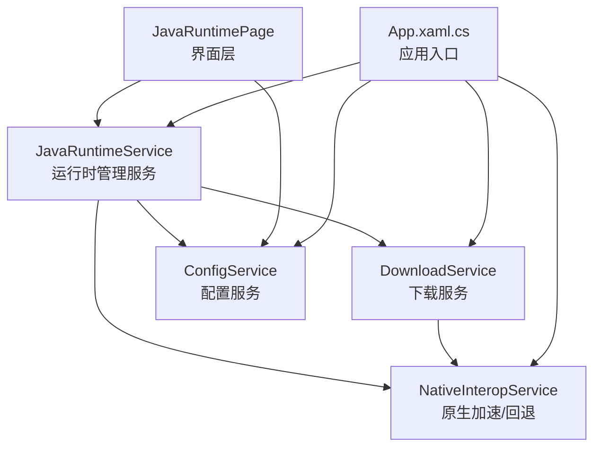
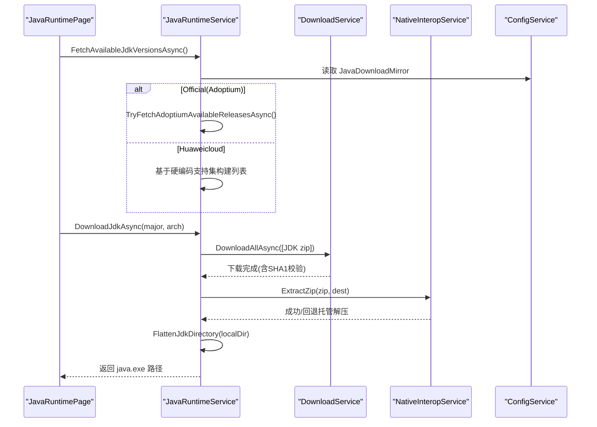
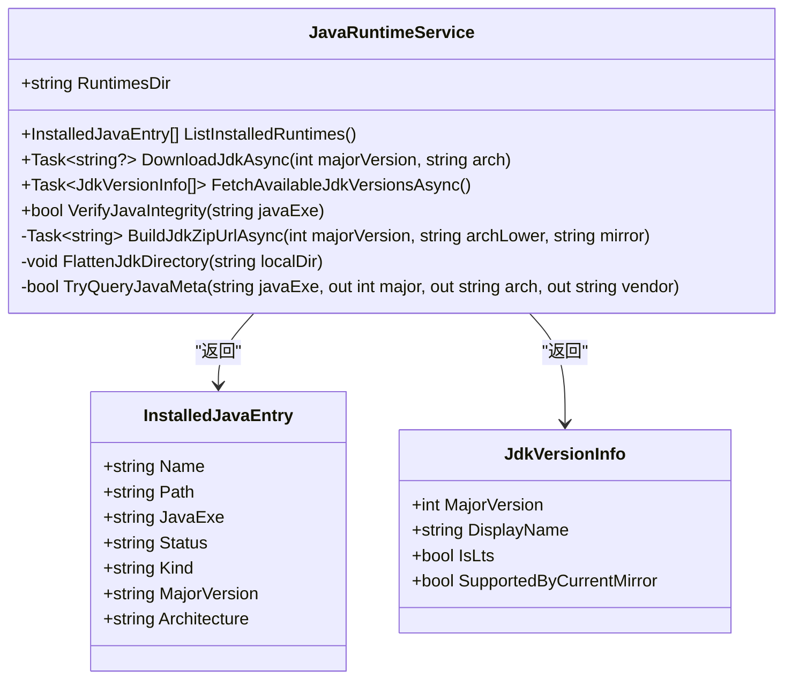
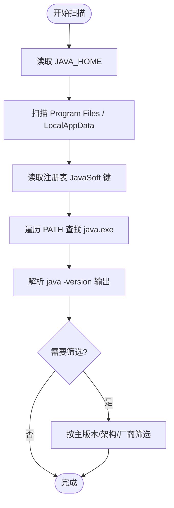
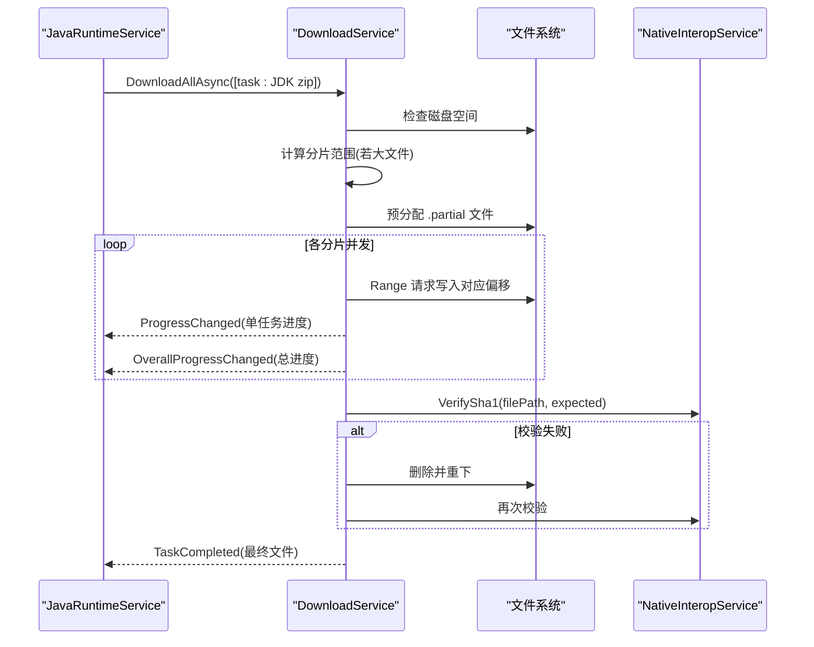
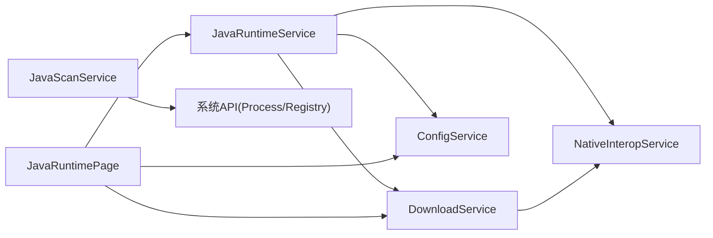

# Java 运行时服务 (JavaRuntimeService)

<cite>
**本文引用的文件**   
- [JavaRuntimeService.cs](file://src/FufuLauncher/Services/JavaRuntimeService.cs)
- [JavaScanService.cs](file://src/FufuLauncher/Services/JavaScanService.cs)
- [ConfigService.cs](file://src/FufuLauncher/Services/ConfigService.cs)
- [DownloadService.cs](file://src/FufuLauncher/Services/DownloadService.cs)
- [NativeInteropService.cs](file://src/FufuLauncher/Services/NativeInteropService.cs)
- [App.xaml.cs](file://src/FufuLauncher/App.xaml.cs)
- [JavaRuntimePage.xaml.cs](file://src/FufuLauncher/Views/JavaRuntimePage.xaml.cs)
- [config.json](file://Start/appmcGAME/config.json)
</cite>

## 目录
1. [简介](#简介)
2. [项目结构](#项目结构)
3. [核心组件](#核心组件)
4. [架构总览](#架构总览)
5. [详细组件分析](#详细组件分析)
6. [依赖关系分析](#依赖关系分析)
7. [性能考量](#性能考量)
8. [故障排除指南](#故障排除指南)
9. [结论](#结论)
10. [附录：使用示例与最佳实践](#附录使用示例与最佳实践)

## 简介
本文件为 Java 运行时服务（JavaRuntimeService）的完整技术文档，聚焦于 JDK 下载与管理、版本兼容性检查、自动下载与完整性校验。系统支持 Java 8、17、21 等主流版本，提供 Mojang 官方运行时与 Adoptium（Temurin）发行版来源，并内置华为云镜像作为国内加速源。文档涵盖 Java 路径解析、版本检测、环境验证机制，RuntimesDir 目录结构与安装状态管理，以及与系统环境的交互、权限要求与故障排除方法。

## 项目结构
Java 运行时相关能力由多个服务协同实现：
- JavaRuntimeService：JDK 下载、解压、本地化、版本探测与完整性校验
- JavaScanService：本机已安装 Java 扫描与筛选
- DownloadService：多线程分片断点续传下载与 SHA1 校验
- NativeInteropService：原生 DLL 加速（SHA1/ZIP），失败回退到托管实现
- ConfigService：配置持久化（含 Java 下载镜像选择）
- App：应用入口，初始化数据目录与 DI 容器
- JavaRuntimePage：UI 页面，负责镜像切换、版本列表加载、下载进度展示

图表来源
- [JavaRuntimePage.xaml.cs:1-269](file://src/FufuLauncher/Views/JavaRuntimePage.xaml.cs#L1-L269)
- [JavaRuntimeService.cs:1-527](file://src/FufuLauncher/Services/JavaRuntimeService.cs#L1-L527)
- [DownloadService.cs:1-592](file://src/FufuLauncher/Services/DownloadService.cs#L1-L592)
- [NativeInteropService.cs:1-214](file://src/FufuLauncher/Services/NativeInteropService.cs#L1-L214)
- [ConfigService.cs:1-148](file://src/FufuLauncher/Services/ConfigService.cs#L1-L148)
- [App.xaml.cs:1-246](file://src/FufuLauncher/App.xaml.cs#L1-L246)

章节来源
- [App.xaml.cs:92-114](file://src/FufuLauncher/App.xaml.cs#L92-L114)
- [ConfigService.cs:45-49](file://src/FufuLauncher/Services/ConfigService.cs#L45-L49)

## 核心组件
- JavaRuntimeService
  - 提供 RuntimesDir 根目录、JDK 目录命名约定、本地 java.exe 路径解析
  - 拉取可用 JDK 版本清单（Adoptium API 或华为云 OpenJDK）
  - 下载指定主版本的 JDK（x64/x86），解压并整理目录结构
  - 列出本地已安装运行时，调用 java -version 探测元数据
  - 校验本地 Java 可执行文件的完整性
- JavaScanService
  - 扫描 JAVA_HOME、Program Files、注册表、PATH 等位置
  - 解析 java -version 输出，识别主版本、架构、厂商
  - 提供按主版本、架构、厂商筛选与最优匹配方法
- DownloadService
  - 多线程分片断点续传下载，支持大文件自动分片
  - 全局与单任务双进度事件，SHA1 校验与失败重试
  - 下载源切换（Mojang/BMCLAPI）与 DNS/连接超时控制
- NativeInteropService
  - 优先调用 C++ 原生 DLL 进行 SHA1/ZIP 操作，失败回退到托管实现
- ConfigService
  - 持久化 Java 下载镜像（Official/Huaweicloud）、是否开机自动扫描等设置
- App
  - 初始化 GameDataDir 与 ConfigDir，创建 runtimes 目录，注册 DI 服务

章节来源
- [JavaRuntimeService.cs:25-48](file://src/FufuLauncher/Services/JavaRuntimeService.cs#L25-L48)
- [JavaRuntimeService.cs:86-105](file://src/FufuLauncher/Services/JavaRuntimeService.cs#L86-L105)
- [JavaRuntimeService.cs:116-158](file://src/FufuLauncher/Services/JavaRuntimeService.cs#L116-L158)
- [JavaRuntimeService.cs:199-277](file://src/FufuLauncher/Services/JavaRuntimeService.cs#L199-L277)
- [JavaRuntimeService.cs:382-429](file://src/FufuLauncher/Services/JavaRuntimeService.cs#L382-L429)
- [JavaRuntimeService.cs:482-510](file://src/FufuLauncher/Services/JavaRuntimeService.cs#L482-L510)
- [JavaScanService.cs:25-34](file://src/FufuLauncher/Services/JavaScanService.cs#L25-L34)
- [JavaScanService.cs:47-75](file://src/FufuLauncher/Services/JavaScanService.cs#L47-L75)
- [DownloadService.cs:28-54](file://src/FufuLauncher/Services/DownloadService.cs#L28-L54)
- [DownloadService.cs:222-261](file://src/FufuLauncher/Services/DownloadService.cs#L222-L261)
- [NativeInteropService.cs:20-55](file://src/FufuLauncher/Services/NativeInteropService.cs#L20-L55)
- [ConfigService.cs:45-49](file://src/FufuLauncher/Services/ConfigService.cs#L45-L49)
- [App.xaml.cs:92-114](file://src/FufuLauncher/App.xaml.cs#L92-L114)

## 架构总览
Java 运行时服务采用分层与服务化设计：
- 界面层（JavaRuntimePage）负责用户交互与进度展示
- 业务层（JavaRuntimeService）封装 JDK 下载、解压、版本探测与校验
- 基础设施层（DownloadService、NativeInteropService、ConfigService）提供下载、加速与配置能力
- 应用入口（App）统一初始化目录与依赖注入

图表来源
- [JavaRuntimePage.xaml.cs:69-89](file://src/FufuLauncher/Views/JavaRuntimePage.xaml.cs#L69-L89)
- [JavaRuntimeService.cs:116-158](file://src/FufuLauncher/Services/JavaRuntimeService.cs#L116-L158)
- [JavaRuntimeService.cs:199-277](file://src/FufuLauncher/Services/JavaRuntimeService.cs#L199-L277)
- [DownloadService.cs:222-261](file://src/FufuLauncher/Services/DownloadService.cs#L222-L261)
- [NativeInteropService.cs:84-101](file://src/FufuLauncher/Services/NativeInteropService.cs#L84-L101)

## 详细组件分析

### JavaRuntimeService：JDK 下载与管理
- 目录与路径
  - RuntimesDir：{GameDataDir}\runtimes
  - 目录命名：jdk-{major}-{arch}（如 jdk-21-x64）
  - 本地 java.exe：{RuntimesDir}/{jdk-dir}/bin/java.exe
- 版本清单
  - Official：通过 Adoptium API 获取 available_releases 与 available_lts_releases
  - Huaweicloud：仅支持 LTS 8/11/17/21，动态解析目录页选取最新版本 zip
- 下载流程
  - 根据镜像源构建 zip URL
  - 使用 DownloadService 分片/断点续传下载
  - 优先原生解压，失败回退托管解压
  - 将内层子目录内容上提至根目录，确保 bin/java.exe 就位
- 版本探测与校验
  - 调用 java -version 解析主版本、架构、厂商
  - VerifyJavaIntegrity：检查文件存在且能执行 -version

图表来源
- [JavaRuntimeService.cs:25-48](file://src/FufuLauncher/Services/JavaRuntimeService.cs#L25-L48)
- [JavaRuntimeService.cs:86-105](file://src/FufuLauncher/Services/JavaRuntimeService.cs#L86-L105)
- [JavaRuntimeService.cs:116-158](file://src/FufuLauncher/Services/JavaRuntimeService.cs#L116-L158)
- [JavaRuntimeService.cs:199-277](file://src/FufuLauncher/Services/JavaRuntimeService.cs#L199-L277)
- [JavaRuntimeService.cs:382-429](file://src/FufuLauncher/Services/JavaRuntimeService.cs#L382-L429)
- [JavaRuntimeService.cs:482-510](file://src/FufuLauncher/Services/JavaRuntimeService.cs#L482-L510)

章节来源
- [JavaRuntimeService.cs:86-105](file://src/FufuLauncher/Services/JavaRuntimeService.cs#L86-L105)
- [JavaRuntimeService.cs:116-158](file://src/FufuLauncher/Services/JavaRuntimeService.cs#L116-L158)
- [JavaRuntimeService.cs:199-277](file://src/FufuLauncher/Services/JavaRuntimeService.cs#L199-L277)
- [JavaRuntimeService.cs:382-429](file://src/FufuLauncher/Services/JavaRuntimeService.cs#L382-L429)
- [JavaRuntimeService.cs:482-510](file://src/FufuLauncher/Services/JavaRuntimeService.cs#L482-L510)

### JavaScanService：本机 Java 扫描与筛选
- 扫描策略
  - JAVA_HOME、Program Files、LocalAppData
  - 注册表 HKLM\SOFTWARE\JavaSoft 及 Adoptium/Microsoft 键
  - PATH 环境变量中的 java.exe
- 版本解析
  - 兼容旧格式（1.8.x）与新格式（17.0.9）
  - 识别架构（x64/x86）与厂商（Oracle/Microsoft/Adoptium/Azul/Amazon/GraalVM）
- 筛选与最优匹配
  - FilterByMajorVersion、FilterByArchitecture、FilterByVendor
  - GetBestJava(requiredMajor, preferArch)

图表来源
- [JavaScanService.cs:47-75](file://src/FufuLauncher/Services/JavaScanService.cs#L47-L75)
- [JavaScanService.cs:170-189](file://src/FufuLauncher/Services/JavaScanService.cs#L170-L189)
- [JavaScanService.cs:191-266](file://src/FufuLauncher/Services/JavaScanService.cs#L191-L266)
- [JavaScanService.cs:268-291](file://src/FufuLauncher/Services/JavaScanService.cs#L268-L291)

章节来源
- [JavaScanService.cs:47-75](file://src/FufuLauncher/Services/JavaScanService.cs#L47-L75)
- [JavaScanService.cs:170-189](file://src/FufuLauncher/Services/JavaScanService.cs#L170-L189)
- [JavaScanService.cs:191-266](file://src/FufuLauncher/Services/JavaScanService.cs#L191-L266)
- [JavaScanService.cs:268-291](file://src/FufuLauncher/Services/JavaScanService.cs#L268-L291)

### DownloadService：下载引擎与完整性校验
- 特性
  - 多线程并发下载，按类别独立信号量互不阻塞
  - 大文件自动分片（>=8MB），Range 断点续传
  - 全局与单任务双进度事件，速度估算与剩余时间
  - SHA1 校验失败自动重下（最多一次），指数退避重试
  - 下载前磁盘空间校验（预留 1GB 缓冲）
- 与 JavaRuntimeService 集成
  - Java 下载任务标记 Category=Java，启用 IsSharded=true
  - OverallProgressChanged 用于 UI 总进度条

图表来源
- [DownloadService.cs:222-261](file://src/FufuLauncher/Services/DownloadService.cs#L222-L261)
- [DownloadService.cs:295-366](file://src/FufuLauncher/Services/DownloadService.cs#L295-L366)
- [DownloadService.cs:453-547](file://src/FufuLauncher/Services/DownloadService.cs#L453-L547)
- [DownloadService.cs:583-590](file://src/FufuLauncher/Services/DownloadService.cs#L583-L590)

章节来源
- [DownloadService.cs:222-261](file://src/FufuLauncher/Services/DownloadService.cs#L222-L261)
- [DownloadService.cs:295-366](file://src/FufuLauncher/Services/DownloadService.cs#L295-L366)
- [DownloadService.cs:453-547](file://src/FufuLauncher/Services/DownloadService.cs#L453-L547)
- [DownloadService.cs:583-590](file://src/FufuLauncher/Services/DownloadService.cs#L583-L590)

### NativeInteropService：原生加速与回退
- 功能
  - 计算文件 SHA1/SHA256
  - 解压 ZIP 与打包 ZIP
- 策略
  - 优先调用 FufuNative.dll，失败自动回退到托管实现
  - 首次探测缓存可用性，避免重复开销

章节来源
- [NativeInteropService.cs:20-55](file://src/FufuLauncher/Services/NativeInteropService.cs#L20-L55)
- [NativeInteropService.cs:84-101](file://src/FufuLauncher/Services/NativeInteropService.cs#L84-L101)
- [NativeInteropService.cs:142-157](file://src/FufuLauncher/Services/NativeInteropService.cs#L142-L157)

### ConfigService：配置与镜像源
- Java 下载镜像
  - Official：Adoptium API（GitHub Release）
  - Huaweicloud：华为云 OpenJDK（仅 LTS 8/11/17/21）
- 其他
  - AutoScanJavaOnStartup：是否开机自动扫描（默认关闭）
  - 多核 GC 优化、高优先级进程、CPU 亲和性等 JVM 预设

章节来源
- [ConfigService.cs:45-49](file://src/FufuLauncher/Services/ConfigService.cs#L45-L49)
- [config.json:24-25](file://Start/appmcGAME/config.json#L24-L25)

### App：应用入口与目录初始化
- 初始化
  - GameDataDir：{exe目录}\appmcGAME
  - ConfigDir：{exe目录}\appmcGAME\Start\AppData\Roaming\FufuLauncher
  - 创建 runtimes、instances、accounts、saves、versions、mods、assets、libraries、cache 等目录
- DI 注册
  - 注册 JavaRuntimeService、DownloadService、NativeInteropService、ConfigService 等服务

章节来源
- [App.xaml.cs:92-114](file://src/FufuLauncher/App.xaml.cs#L92-L114)
- [App.xaml.cs:170-193](file://src/FufuLauncher/App.xaml.cs#L170-L193)

## 依赖关系分析
- JavaRuntimeService 依赖
  - DownloadService：下载 JDK zip
  - NativeInteropService：解压 ZIP（优先原生）
  - ConfigService：读取 JavaDownloadMirror
- JavaScanService 依赖
  - 系统 API：Process、Registry、Environment
- DownloadService 依赖
  - NativeInteropService：SHA1 校验
  - 系统 IO：文件读写、磁盘空间检测
- UI 层（JavaRuntimePage）依赖
  - JavaRuntimeService、DownloadService、ConfigService

图表来源
- [JavaRuntimeService.cs:68-84](file://src/FufuLauncher/Services/JavaRuntimeService.cs#L68-L84)
- [DownloadService.cs:58-114](file://src/FufuLauncher/Services/DownloadService.cs#L58-L114)
- [JavaScanService.cs:15-22](file://src/FufuLauncher/Services/JavaScanService.cs#L15-L22)
- [JavaRuntimePage.xaml.cs:23-43](file://src/FufuLauncher/Views/JavaRuntimePage.xaml.cs#L23-L43)

章节来源
- [JavaRuntimeService.cs:68-84](file://src/FufuLauncher/Services/JavaRuntimeService.cs#L68-L84)
- [DownloadService.cs:58-114](file://src/FufuLauncher/Services/DownloadService.cs#L58-L114)
- [JavaScanService.cs:15-22](file://src/FufuLauncher/Services/JavaScanService.cs#L15-L22)
- [JavaRuntimePage.xaml.cs:23-43](file://src/FufuLauncher/Views/JavaRuntimePage.xaml.cs#L23-L43)

## 性能考量
- 下载性能
  - 大文件自动分片（>=8MB），并发 Range 请求提升吞吐
  - 每类任务独立信号量，避免互相阻塞
  - 节流更新整体进度（150ms），减少 UI 刷新压力
- 解压性能
  - 优先原生 DLL 解压，失败回退托管实现
- 版本探测
  - 调用 java -version 时限制超时（5s），避免阻塞
- 内存与 I/O
  - 下载前磁盘空间校验（预留 1GB 缓冲）
  - 日志批量写入（200ms Timer），降低频繁 IO 影响

[本节为通用性能讨论，无需特定文件引用]

## 故障排除指南
- 下载失败
  - 检查网络与镜像源（Official/Huaweicloud）
  - 查看 DownloadService 日志与错误信息（重试次数、异常堆栈）
  - 确认磁盘空间充足（CheckDiskSpace）
- 解压失败
  - 原生 DLL 缺失或失效会自动回退托管实现
  - 检查目标目录权限与路径长度
- 版本探测失败
  - 确认 java.exe 可执行且输出包含 version
  - 检查系统 PATH 与 JAVA_HOME 配置
- 完整性校验失败
  - DownloadService 会删除损坏文件并重下一次
  - 若仍失败，检查存储介质与网络稳定性
- 权限问题
  - 确保对 runtimes 目录具有写权限
  - 注册表读取可能需要管理员权限（部分键）

章节来源
- [DownloadService.cs:264-293](file://src/FufuLauncher/Services/DownloadService.cs#L264-L293)
- [DownloadService.cs:319-334](file://src/FufuLauncher/Services/DownloadService.cs#L319-L334)
- [JavaRuntimeService.cs:482-510](file://src/FufuLauncher/Services/JavaRuntimeService.cs#L482-L510)
- [NativeInteropService.cs:84-101](file://src/FufuLauncher/Services/NativeInteropService.cs#L84-L101)

## 结论
JavaRuntimeService 提供了完整的 JDK 生命周期管理能力，包括版本清单拉取、镜像源切换、分片下载、解压与目录整理、版本探测与完整性校验。结合 JavaScanService 的本机扫描能力，用户可在启动器中便捷地管理与选择 Java 运行时。系统通过 DownloadService 与 NativeInteropService 保障下载性能与可靠性，并通过 ConfigService 实现灵活的配置管理。整体架构清晰、职责分离，具备良好的可扩展性与容错性。

[本节为总结性内容，无需特定文件引用]

## 附录：使用示例与最佳实践

### 检测已安装的 Java
- 使用 JavaScanService.ScanAsync() 触发扫描
- 通过 FilterByMajorVersion(17) 或 GetBestJava(17, "x64") 获取目标版本
- 参考路径：[JavaScanService.cs:47-75](file://src/FufuLauncher/Services/JavaScanService.cs#L47-L75)、[JavaScanService.cs:268-291](file://src/FufuLauncher/Services/JavaScanService.cs#L268-L291)

### 下载指定版本 JDK
- 调用 JavaRuntimeService.FetchAvailableJdkVersionsAsync() 获取版本清单
- 选择支持的版本后调用 DownloadJdkAsync(major, arch)
- 监听 ProgressChanged 与 DownloadService 的进度事件
- 参考路径：[JavaRuntimeService.cs:116-158](file://src/FufuLauncher/Services/JavaRuntimeService.cs#L116-L158)、[JavaRuntimeService.cs:199-277](file://src/FufuLauncher/Services/JavaRuntimeService.cs#L199-L277)、[JavaRuntimePage.xaml.cs:158-217](file://src/FufuLauncher/Views/JavaRuntimePage.xaml.cs#L158-L217)

### 验证 Java 可执行文件
- 使用 JavaRuntimeService.VerifyJavaIntegrity(javaExe) 检查文件存在与可执行
- 或通过 ListInstalledRuntimes() 获取已安装运行时并检查状态
- 参考路径：[JavaRuntimeService.cs:482-510](file://src/FufuLauncher/Services/JavaRuntimeService.cs#L482-L510)、[JavaRuntimeService.cs:382-429](file://src/FufuLauncher/Services/JavaRuntimeService.cs#L382-L429)

### 目录结构与配置文件
- RuntimesDir：{GameDataDir}\runtimes
- JDK 目录：jdk-{major}-{arch}（如 jdk-21-x64）
- 配置文件：config.json 中的 JavaDownloadMirror 字段
- 参考路径：[App.xaml.cs:92-114](file://src/FufuLauncher/App.xaml.cs#L92-L114)、[config.json:24-25](file://Start/appmcGAME/config.json#L24-L25)

章节来源
- [JavaScanService.cs:47-75](file://src/FufuLauncher/Services/JavaScanService.cs#L47-L75)
- [JavaScanService.cs:268-291](file://src/FufuLauncher/Services/JavaScanService.cs#L268-L291)
- [JavaRuntimeService.cs:116-158](file://src/FufuLauncher/Services/JavaRuntimeService.cs#L116-L158)
- [JavaRuntimeService.cs:199-277](file://src/FufuLauncher/Services/JavaRuntimeService.cs#L199-L277)
- [JavaRuntimeService.cs:482-510](file://src/FufuLauncher/Services/JavaRuntimeService.cs#L482-L510)
- [JavaRuntimeService.cs:382-429](file://src/FufuLauncher/Services/JavaRuntimeService.cs#L382-L429)
- [App.xaml.cs:92-114](file://src/FufuLauncher/App.xaml.cs#L92-L114)
- [config.json:24-25](file://Start/appmcGAME/config.json#L24-L25)