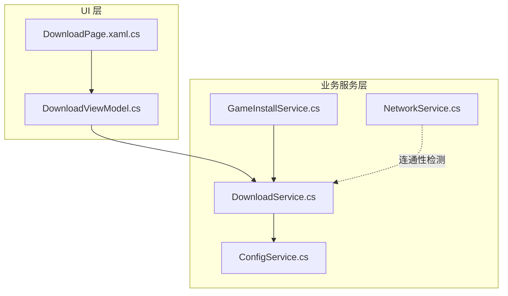
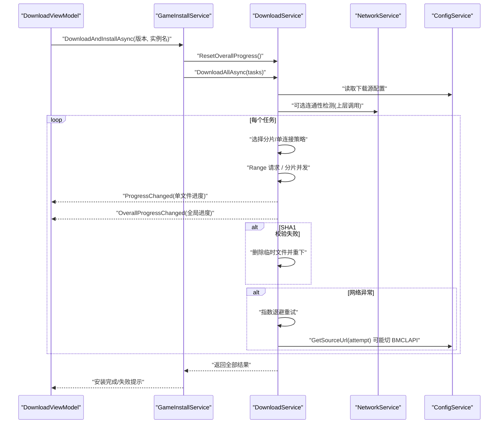
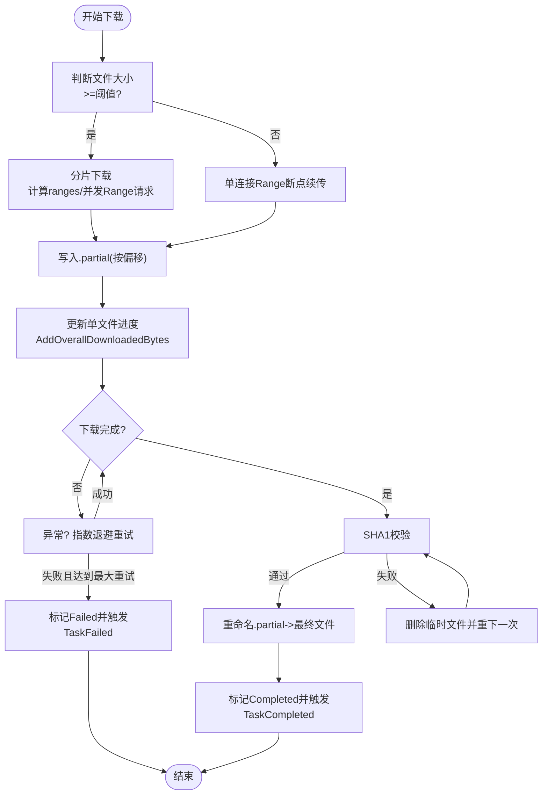
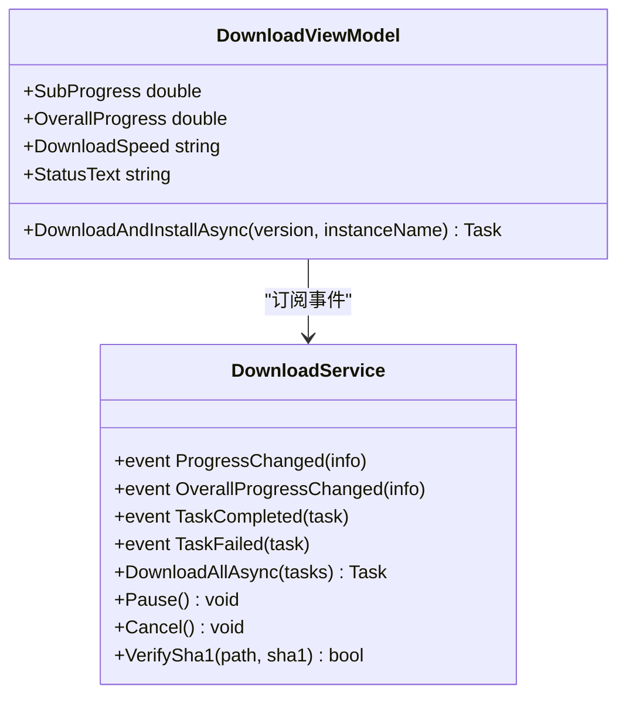
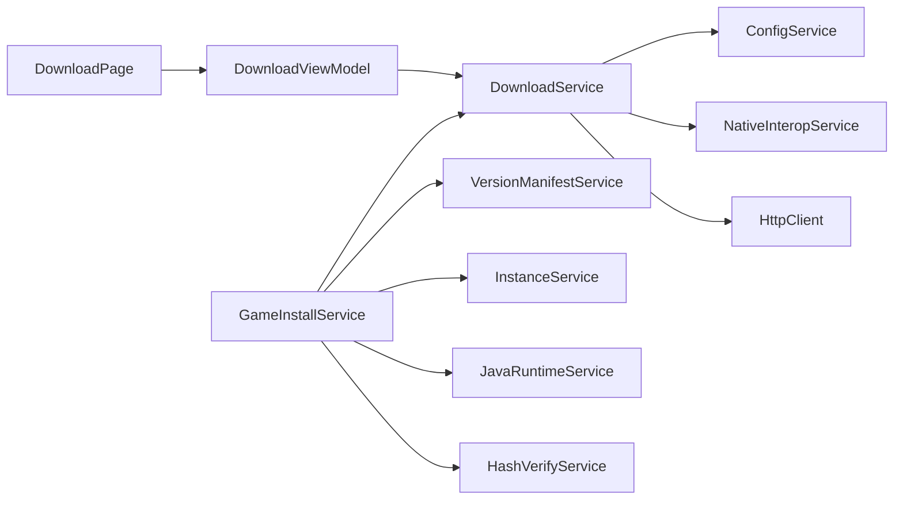

# 下载服务 (DownloadService)

<cite>
**本文引用的文件**   
- [DownloadService.cs](file://src/FufuLauncher/Services/DownloadService.cs)
- [NetworkService.cs](file://src/FufuLauncher/Services/NetworkService.cs)
- [ConfigService.cs](file://src/FufuLauncher/Services/ConfigService.cs)
- [GameInstallService.cs](file://src/FufuLauncher/Services/GameInstallService.cs)
- [DownloadViewModel.cs](file://src/FufuLauncher/ViewModels/DownloadViewModel.cs)
- [DownloadPage.xaml.cs](file://src/FufuLauncher/Views/DownloadPage.xaml.cs)
</cite>

## 目录
1. [简介](#简介)
2. [项目结构](#项目结构)
3. [核心组件](#核心组件)
4. [架构总览](#架构总览)
5. [详细组件分析](#详细组件分析)
6. [依赖关系分析](#依赖关系分析)
7. [性能与并发特性](#性能与并发特性)
8. [故障排查指南](#故障排查指南)
9. [结论](#结论)
10. [附录：使用示例与最佳实践](#附录使用示例与最佳实践)

## 简介
本文件为“可爱的芙芙”启动器中的下载服务（DownloadService）提供系统化、可落地的技术文档。内容覆盖多线程分片断点续传引擎、任务管理、进度跟踪、镜像源切换、重试与错误恢复、队列与优先级、带宽限制、数据模型 DownloadTaskItem、事件驱动与回调机制，以及与 NetworkService 的集成、缓存策略与磁盘空间管理等关键主题。读者无需深入源码即可理解并正确使用该下载服务。

## 项目结构
下载相关代码主要位于 Services 层，UI 通过 ViewModel 订阅事件进行展示，安装流程由 GameInstallService 组织任务并调用 DownloadService。

图表来源
- [DownloadPage.xaml.cs:1-105](file://src/FufuLauncher/Views/DownloadPage.xaml.cs#L1-L105)
- [DownloadViewModel.cs:1-307](file://src/FufuLauncher/ViewModels/DownloadViewModel.cs#L1-L307)
- [GameInstallService.cs:1-200](file://src/FufuLauncher/Services/GameInstallService.cs#L1-L200)
- [DownloadService.cs:1-592](file://src/FufuLauncher/Services/DownloadService.cs#L1-L592)
- [NetworkService.cs:1-95](file://src/FufuLauncher/Services/NetworkService.cs#L1-L95)
- [ConfigService.cs:1-148](file://src/FufuLauncher/Services/ConfigService.cs#L1-L148)

章节来源
- [DownloadService.cs:1-592](file://src/FufuLauncher/Services/DownloadService.cs#L1-L592)
- [GameInstallService.cs:1-200](file://src/FufuLauncher/Services/GameInstallService.cs#L1-L200)
- [DownloadViewModel.cs:1-307](file://src/FufuLauncher/ViewModels/DownloadViewModel.cs#L1-L307)

## 核心组件
- DownloadService：核心下载引擎，负责分片/单连接下载、断点续传、SHA1 校验、重试、镜像源切换、全局/单文件进度、暂停/取消等。
- DownloadTaskItem：下载任务数据模型，包含 URL、本地路径、SHA1、大小、已下载字节、状态、类别、是否分片等。
- DownloadProgressInfo：进度信息载体，包含总字节、已下载字节、速度、剩余时间、百分比。
- NetworkService：网络连通性检测，测试 Mojang 官方源与 BMCLAPI 国内镜像源的可达性与延迟。
- ConfigService：配置中心，包含下载源（Mojang/BMCLAPI）、Java 镜像、JVM 参数等。
- GameInstallService：安装编排服务，构建 DownloadTaskItem 列表并调用 DownloadService 执行批量下载。
- DownloadViewModel：UI 视图模型，订阅 DownloadService 的事件以更新 UI 进度与状态。

章节来源
- [DownloadService.cs:28-54](file://src/FufuLauncher/Services/DownloadService.cs#L28-L54)
- [DownloadService.cs:56-114](file://src/FufuLauncher/Services/DownloadService.cs#L56-L114)
- [NetworkService.cs:18-95](file://src/FufuLauncher/Services/NetworkService.cs#L18-L95)
- [ConfigService.cs:13-79](file://src/FufuLauncher/Services/ConfigService.cs#L13-L79)
- [GameInstallService.cs:50-80](file://src/FufuLauncher/Services/GameInstallService.cs#L50-L80)
- [DownloadViewModel.cs:66-146](file://src/FufuLauncher/ViewModels/DownloadViewModel.cs#L66-L146)

## 架构总览
DownloadService 采用事件驱动与并发控制相结合的设计：
- 任务分类并发隔离：按类别（Game/Asset/Java/Mod/Other）分配独立 SemaphoreSlim，互不阻塞。
- 大文件分片：>=8MB 自动分片，多 Range 并发下载；小文件单连接 Range 断点续传。
- 断点续传：.partial 临时文件 + 已下载字节记录，支持中断后继续。
- 镜像源切换：根据配置与失败次数自动降级到 BMCLAPI 国内镜像。
- 重试与恢复：指数退避重试，SHA1 校验失败自动重下一次。
- 进度上报：单文件进度与全局总进度双通道，节流上报避免 UI 卡顿。
- 磁盘空间检查：下载前预留 1GB 缓冲，不足则提示并中止。

图表来源
- [DownloadViewModel.cs:218-304](file://src/FufuLauncher/ViewModels/DownloadViewModel.cs#L218-L304)
- [GameInstallService.cs:83-200](file://src/FufuLauncher/Services/GameInstallService.cs#L83-L200)
- [DownloadService.cs:222-261](file://src/FufuLauncher/Services/DownloadService.cs#L222-L261)
- [DownloadService.cs:171-210](file://src/FufuLauncher/Services/DownloadService.cs#L171-L210)
- [NetworkService.cs:34-76](file://src/FufuLauncher/Services/NetworkService.cs#L34-L76)

## 详细组件分析

### DownloadService：多线程分片断点续传引擎
- 并发控制
  - 每类别一个 SemaphoreSlim，默认并发：Game=8、Asset=16、Java=4、Mod=4、Other=4。
  - 通过 GetSemaphore(cat) 获取对应信号量，确保同类别内并发上限可控且不同类别互不影响。
- 下载策略
  - 大文件（>=ShardThreshold，默认 8MB）：分片计算 ranges，预分配 .partial 文件，各分片并发 Range 请求写入各自偏移。
  - 小文件：单连接 Range 断点续传，从 .partial 续写，支持服务端不支持 206 时回退从头下载。
- 断点续传
  - 优先检查最终文件是否存在且 SHA1 正确，直接跳过。
  - 若存在 .partial，读取其长度作为起始位置，续传。
  - 下载完成后将 .partial 重命名为最终文件。
- 重试与错误恢复
  - 指数退避重试（1s、2s、4s…），最多 MaxRetry 次（默认 3）。
  - 下载完成后进行 SHA1 校验，失败删除临时文件并重下一次；仍失败则标记 Failed。
- 镜像源切换
  - GetSourceUrl(originalUrl, attempt)：首次使用配置源；attempt>0 且配置为 Mojang 时强制切换到 BMCLAPI 国内镜像。
  - ForceBmclUrl 对常见 Mojang 域名进行替换。
- 进度上报
  - ProgressChanged：单文件字节级进度，含速度、剩余时间估算。
  - OverallProgressChanged：全局累计进度，节流 150ms 上报，保证平滑与最终触发。
- 磁盘空间管理
  - CheckDiskSpace(requiredBytes)：检查目标盘可用空间，预留 1GB 缓冲，不足则弹窗提示并中止。
- 暂停/取消
  - Pause()：设置全局取消令牌并将运行中任务状态置为 Paused。
  - Cancel()：取消所有任务并置状态为 Cancelled。
- 校验
  - VerifySha1(filePath, expectedSha1)：调用 NativeInteropService.ComputeFileSHA1 进行校验。

图表来源
- [DownloadService.cs:295-366](file://src/FufuLauncher/Services/DownloadService.cs#L295-L366)
- [DownloadService.cs:368-451](file://src/FufuLauncher/Services/DownloadService.cs#L368-L451)
- [DownloadService.cs:454-547](file://src/FufuLauncher/Services/DownloadService.cs#L454-L547)
- [DownloadService.cs:584-590](file://src/FufuLauncher/Services/DownloadService.cs#L584-L590)

章节来源
- [DownloadService.cs:68-73](file://src/FufuLauncher/Services/DownloadService.cs#L68-L73)
- [DownloadService.cs:222-261](file://src/FufuLauncher/Services/DownloadService.cs#L222-L261)
- [DownloadService.cs:264-293](file://src/FufuLauncher/Services/DownloadService.cs#L264-L293)
- [DownloadService.cs:171-210](file://src/FufuLauncher/Services/DownloadService.cs#L171-L210)
- [DownloadService.cs:134-169](file://src/FufuLauncher/Services/DownloadService.cs#L134-L169)
- [DownloadService.cs:568-581](file://src/FufuLauncher/Services/DownloadService.cs#L568-L581)

### DownloadTaskItem 数据模型
- 字段说明
  - Url：下载地址
  - LocalPath：本地保存路径
  - Sha1：期望的 SHA1 值
  - Size：文件大小（未知时可后续填充）
  - Downloaded：已下载字节数
  - Status：任务状态（Pending/Downloading/Paused/Verifying/Completed/Failed/Cancelled）
  - Error：错误信息
  - RetryCount：重试次数
  - Category：任务类别（决定并发信号量）
  - IsSharded：是否分片下载（内部标记）
- 用途
  - 被 GameInstallService 构造并传入 DownloadService.DownloadAllAsync 进行批量下载。
  - 在 DownloadService 中被用于进度上报、状态流转、重试计数与日志记录。

章节来源
- [DownloadService.cs:28-42](file://src/FufuLauncher/Services/DownloadService.cs#L28-L42)
- [GameInstallService.cs:123-183](file://src/FufuLauncher/Services/GameInstallService.cs#L123-L183)

### 事件驱动与进度回调
- 事件定义
  - ProgressChanged：单文件进度（字节级），包含 TotalBytes、DownloadedBytes、SpeedBytesPerSec、EstimatedRemaining。
  - OverallProgressChanged：全局总进度（累计所有批次），同样包含速度与剩余时间估算。
  - TaskCompleted：单个任务完成回调。
  - TaskFailed：单个任务失败回调。
- UI 订阅
  - DownloadViewModel 订阅上述事件，在 UI 线程更新进度条、速度显示与状态文本。
  - 当总大小未知时，仅显示已下载字节与速度，避免百分比卡住。

图表来源
- [DownloadService.cs:85-90](file://src/FufuLauncher/Services/DownloadService.cs#L85-L90)
- [DownloadViewModel.cs:90-146](file://src/FufuLauncher/ViewModels/DownloadViewModel.cs#L90-L146)

章节来源
- [DownloadViewModel.cs:90-146](file://src/FufuLauncher/ViewModels/DownloadViewModel.cs#L90-L146)

### 与 NetworkService 的集成
- NetworkService 提供 TestConnectivityAsync，检测 Mojang 官方源与 BMCLAPI 国内镜像源的连通性与延迟。
- DownloadService 在下载过程中依据配置与失败次数自动切换镜像源（Mojang -> BMCLAPI），提升稳定性。
- 建议在启动或进入下载页前调用 NetworkService 进行连通性检测，并在 UI 上提示当前源状态。

章节来源
- [NetworkService.cs:34-76](file://src/FufuLauncher/Services/NetworkService.cs#L34-L76)
- [DownloadService.cs:171-210](file://src/FufuLauncher/Services/DownloadService.cs#L171-L210)

### 下载队列管理与任务优先级
- 队列管理
  - DownloadAllAsync 接收 List<DownloadTaskItem>，内部维护 ConcurrentDictionary<string, DownloadTaskItem> _tasks 用于暂停/取消遍历。
  - 每个任务通过 GetSemaphore(cat) 获取类别信号量，实现类别内并发上限控制。
- 优先级
  - 当前实现未显式实现优先级队列，但可通过 Category 区分并发上限，间接影响资源占用。
  - 如需优先级，可在外部对 tasks 排序后再提交（例如先 Java/核心库，再 Asset/Mod）。

章节来源
- [DownloadService.cs:76](file://src/FufuLauncher/Services/DownloadService.cs#L76)
- [DownloadService.cs:212-219](file://src/FufuLauncher/Services/DownloadService.cs#L212-L219)
- [DownloadService.cs:222-261](file://src/FufuLauncher/Services/DownloadService.cs#L222-L261)

### 带宽限制配置
- 当前实现未提供显式的带宽限制（如限速）。
- 可通过调整各类别的 SemaphoreSlim 初始值来间接控制并发度，从而降低带宽占用。
- 建议未来扩展：增加 TokenBucket 或 RateLimiter 实现精确限速。

章节来源
- [DownloadService.cs:69-73](file://src/FufuLauncher/Services/DownloadService.cs#L69-L73)

### 缓存策略与磁盘空间管理
- 缓存策略
  - 断点续传利用 .partial 临时文件与已下载字节记录，实现幂等与中断恢复。
  - 若最终文件存在且 SHA1 校验通过，直接跳过下载，避免重复网络 IO。
- 磁盘空间管理
  - CheckDiskSpace(requiredBytes) 在下载前检查目标盘可用空间，预留 1GB 缓冲，不足则提示并中止。
  - 下载完成后将 .partial 重命名为最终文件，清理中间态。

章节来源
- [DownloadService.cs:264-293](file://src/FufuLauncher/Services/DownloadService.cs#L264-L293)
- [DownloadService.cs:368-451](file://src/FufuLauncher/Services/DownloadService.cs#L368-L451)
- [DownloadService.cs:454-547](file://src/FufuLauncher/Services/DownloadService.cs#L454-L547)

## 依赖关系分析
- DownloadService 依赖
  - ConfigService：读取下载源配置（Mojang/BMCLAPI）。
  - NativeInteropService：计算文件 SHA1。
  - HttpClient：统一超时与连接限制，User-Agent 设置。
- GameInstallService 依赖
  - VersionManifestService：拉取版本清单与 JSON。
  - InstanceService：实例目录管理。
  - JavaRuntimeService：Java 运行时管理。
  - HashVerifyService：完整性校验（快速检查）。
- UI 依赖
  - DownloadViewModel 订阅 DownloadService 事件，更新 UI。
  - DownloadPage 处理用户交互（刷新、双击下载）。

图表来源
- [DownloadService.cs:58-114](file://src/FufuLauncher/Services/DownloadService.cs#L58-L114)
- [GameInstallService.cs:50-80](file://src/FufuLauncher/Services/GameInstallService.cs#L50-L80)
- [DownloadViewModel.cs:66-146](file://src/FufuLauncher/ViewModels/DownloadViewModel.cs#L66-L146)

章节来源
- [DownloadService.cs:58-114](file://src/FufuLauncher/Services/DownloadService.cs#L58-L114)
- [GameInstallService.cs:50-80](file://src/FufuLauncher/Services/GameInstallService.cs#L50-L80)
- [DownloadViewModel.cs:66-146](file://src/FufuLauncher/ViewModels/DownloadViewModel.cs#L66-L146)

## 性能与并发特性
- 并发控制
  - 类别独立信号量，避免跨类别竞争导致瓶颈。
  - 大文件分片并发下载，充分利用带宽与 I/O。
- 进度上报优化
  - 单文件进度节流 200ms，全局进度节流 150ms，平衡 UI 流畅与准确性。
- 网络优化
  - HttpClient 统一超时（5 分钟）与连接限制（MaxConnectionsPerServer=64）。
  - per-request 首字节超时 30 秒，防止连接卡死。
- 磁盘 I/O
  - 使用异步 FileStream，缓冲区 64KB，减少系统调用开销。
  - 预分配 .partial 文件，避免多次扩容。

[本节为通用性能讨论，不直接分析具体文件]

## 故障排查指南
- 常见问题
  - 下载速度慢：检查网络状况与镜像源；适当降低并发（调整信号量）；确认是否启用分片下载。
  - 进度条不动：确认是否已上报总字节（AddOverallTotalBytes）；检查节流逻辑是否正常触发。
  - 校验失败：查看 SHA1 是否正确；确认文件未被其他进程占用；尝试切换镜像源。
  - 磁盘空间不足：CheckDiskSpace 会提前提示；清理无用文件或扩大分区。
- 调试建议
  - 启用 App.WriteAppLog 输出下载日志，定位失败原因。
  - 使用 NetworkService.TestConnectivityAsync 检测源连通性。
  - 在 DownloadViewModel 中打印事件回调参数，验证进度与状态。

章节来源
- [DownloadService.cs:345-358](file://src/FufuLauncher/Services/DownloadService.cs#L345-L358)
- [DownloadService.cs:584-590](file://src/FufuLauncher/Services/DownloadService.cs#L584-L590)
- [NetworkService.cs:34-76](file://src/FufuLauncher/Services/NetworkService.cs#L34-L76)

## 结论
DownloadService 提供了健壮、高效、可扩展的下载引擎，涵盖多线程分片、断点续传、镜像源切换、重试与校验、进度上报与磁盘空间管理等关键能力。结合 GameInstallService 的任务编排与 DownloadViewModel 的事件驱动 UI，形成完整的下载体验。建议在未来扩展中引入带宽限制与更细粒度的优先级队列，以满足更复杂的场景需求。

[本节为总结性内容，不直接分析具体文件]

## 附录：使用示例与最佳实践

### 创建下载任务与批量下载
- 步骤
  - 准备 List<DownloadTaskItem>，设置 Url、LocalPath、Sha1、Size、Category。
  - 调用 DownloadService.ResetOverallProgress() 重置全局进度。
  - 调用 DownloadService.DownloadAllAsync(tasks) 执行批量下载。
  - 监听 ProgressChanged、OverallProgressChanged、TaskCompleted、TaskFailed 事件。
- 参考路径
  - [GameInstallService.cs:123-183](file://src/FufuLauncher/Services/GameInstallService.cs#L123-L183)
  - [DownloadService.cs:222-261](file://src/FufuLauncher/Services/DownloadService.cs#L222-L261)

### 监听下载进度与状态
- 步骤
  - 在 DownloadViewModel 中订阅 DownloadService 的四个事件。
  - 在 UI 线程更新 SubProgress、OverallProgress、DownloadSpeed、StatusText。
- 参考路径
  - [DownloadViewModel.cs:90-146](file://src/FufuLauncher/ViewModels/DownloadViewModel.cs#L90-L146)

### 处理下载异常与重试
- 行为
  - 指数退避重试，最多 MaxRetry 次。
  - SHA1 校验失败自动重下一次。
  - 失败时触发 TaskFailed，携带 Error 信息。
- 参考路径
  - [DownloadService.cs:345-358](file://src/FufuLauncher/Services/DownloadService.cs#L345-L358)
  - [DownloadService.cs:319-334](file://src/FufuLauncher/Services/DownloadService.cs#L319-L334)

### 镜像源切换与连通性检测
- 行为
  - GetSourceUrl(originalUrl, attempt) 根据配置与失败次数切换至 BMCLAPI。
  - NetworkService.TestConnectivityAsync 检测两源连通性与延迟。
- 参考路径
  - [DownloadService.cs:171-210](file://src/FufuLauncher/Services/DownloadService.cs#L171-L210)
  - [NetworkService.cs:34-76](file://src/FufuLauncher/Services/NetworkService.cs#L34-L76)

### 磁盘空间检查
- 行为
  - CheckDiskSpace(requiredBytes) 检查可用空间，预留 1GB 缓冲。
  - 不足时弹窗提示并中止下载。
- 参考路径
  - [DownloadService.cs:264-293](file://src/FufuLauncher/Services/DownloadService.cs#L264-L293)

章节来源
- [GameInstallService.cs:123-183](file://src/FufuLauncher/Services/GameInstallService.cs#L123-L183)
- [DownloadService.cs:222-261](file://src/FufuLauncher/Services/DownloadService.cs#L222-L261)
- [DownloadViewModel.cs:90-146](file://src/FufuLauncher/ViewModels/DownloadViewModel.cs#L90-L146)
- [DownloadService.cs:345-358](file://src/FufuLauncher/Services/DownloadService.cs#L345-L358)
- [DownloadService.cs:171-210](file://src/FufuLauncher/Services/DownloadService.cs#L171-L210)
- [NetworkService.cs:34-76](file://src/FufuLauncher/Services/NetworkService.cs#L34-L76)
- [DownloadService.cs:264-293](file://src/FufuLauncher/Services/DownloadService.cs#L264-L293)