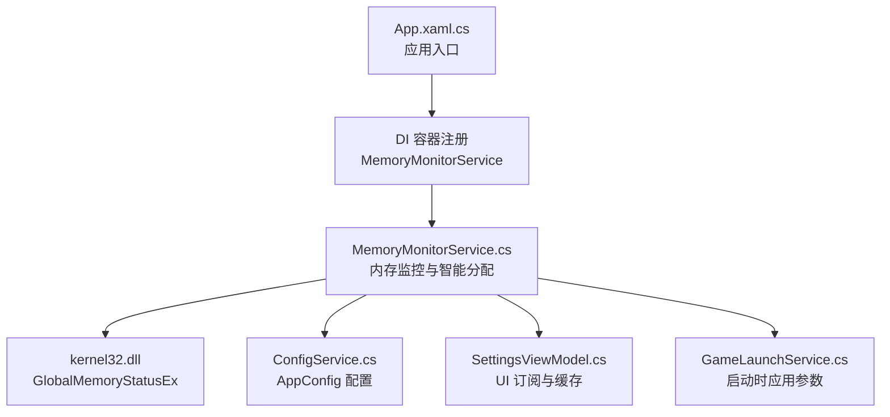
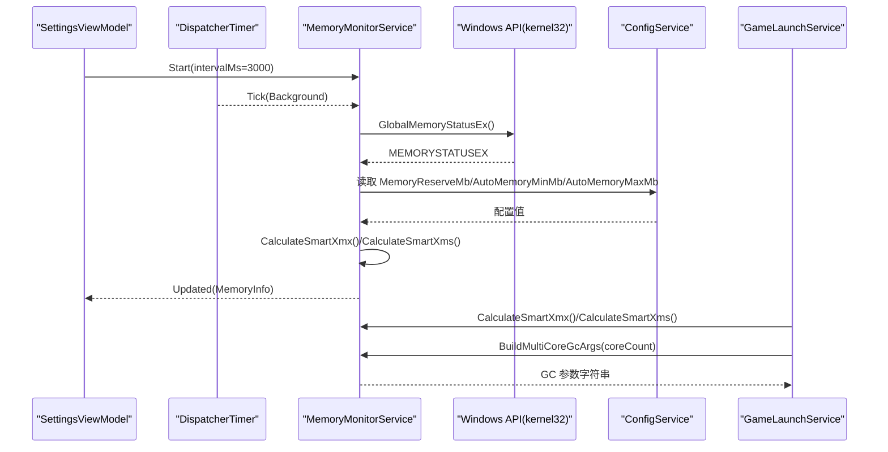
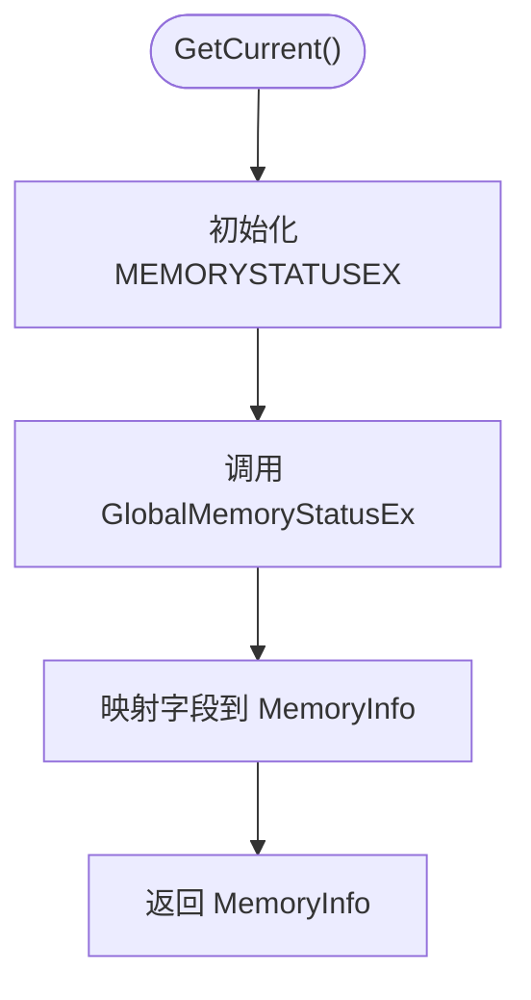
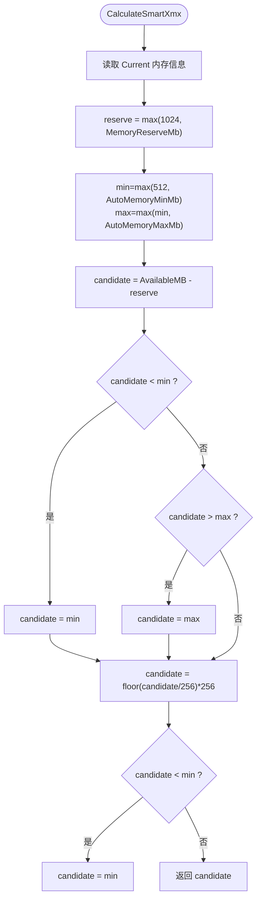
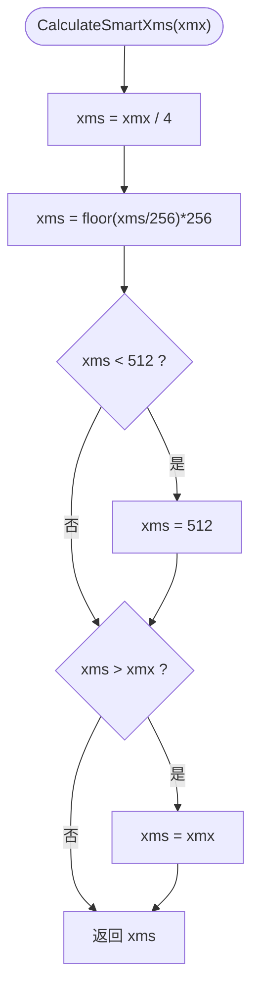
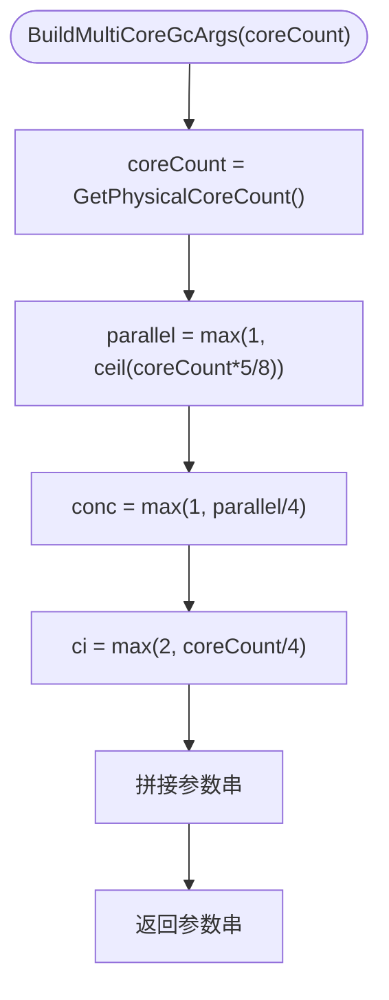
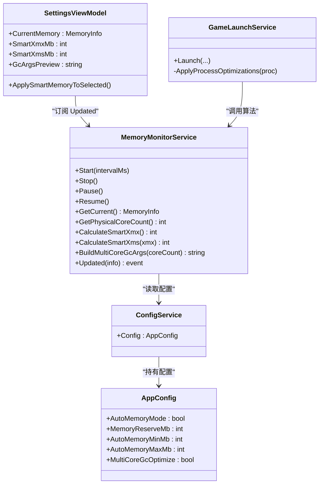
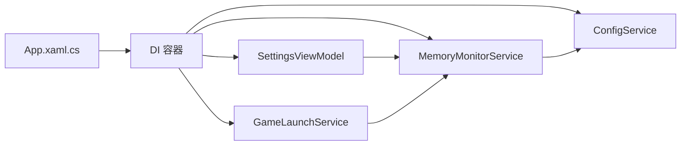

# 内存监控服务 (MemoryMonitorService)

<cite>
**本文引用的文件**   
- [MemoryMonitorService.cs](file://src/FufuLauncher/Services/MemoryMonitorService.cs)
- [ConfigService.cs](file://src/FufuLauncher/Services/ConfigService.cs)
- [GameLaunchService.cs](file://src/FufuLauncher/Services/GameLaunchService.cs)
- [SettingsViewModel.cs](file://src/FufuLauncher/ViewModels/SettingsViewModel.cs)
- [App.xaml.cs](file://src/FufuLauncher/App.xaml.cs)
</cite>

## 目录
1. [简介](#简介)
2. [项目结构](#项目结构)
3. [核心组件](#核心组件)
4. [架构总览](#架构总览)
5. [详细组件分析](#详细组件分析)
6. [依赖关系分析](#依赖关系分析)
7. [性能考量](#性能考量)
8. [故障排查指南](#故障排查指南)
9. [结论](#结论)
10. [附录：使用示例与最佳实践](#附录使用示例与最佳实践)

## 简介
本文件为“内存监控服务”（MemoryMonitorService）的完整技术文档。内容涵盖：
- 系统内存检测与可用内存计算
- 智能 Xmx/Xms 推荐值生成算法（CalculateSmartXmx、CalculateSmartXms）
- 多核 CPU 检测与 GC 参数优化建议（BuildMultiCoreGcArgs）
- 内存使用监控、性能指标收集、资源占用分析
- 与操作系统 API 的交互方式及跨平台注意事项
- 在启动器中的集成点与调用流程

该服务通过 Windows API 获取物理内存信息，结合配置项进行安全阈值控制，输出稳定的 JVM 内存分配建议，并在 UI 中提供实时展示与预览。

## 项目结构
MemoryMonitorService 位于 FufuLauncher 的 Services 层，作为单例服务被 DI 容器注册，并在应用启动时自动开始定时刷新。其关键依赖包括：
- ConfigService：读取用户配置（内存预留、上下限等）
- GameLaunchService：在游戏启动时应用智能内存分配与多核 GC 参数
- SettingsViewModel：订阅内存更新事件，用于设置页可视化展示与一键应用

图表来源
- [App.xaml.cs:131-154](file://src/FufuLauncher/App.xaml.cs#L131-L154)
- [MemoryMonitorService.cs:26-59](file://src/FufuLauncher/Services/MemoryMonitorService.cs#L26-L59)
- [ConfigService.cs:59-67](file://src/FufuLauncher/Services/ConfigService.cs#L59-L67)
- [SettingsViewModel.cs:172-194](file://src/FufuLauncher/ViewModels/SettingsViewModel.cs#L172-L194)
- [GameLaunchService.cs:180-225](file://src/FufuLauncher/Services/GameLaunchService.cs#L180-L225)

章节来源
- [App.xaml.cs:131-154](file://src/FufuLauncher/App.xaml.cs#L131-L154)
- [MemoryMonitorService.cs:26-59](file://src/FufuLauncher/Services/MemoryMonitorService.cs#L26-L59)

## 核心组件
- MemoryMonitorService：负责系统内存读取、定时刷新、智能内存分配与多核 GC 参数生成
- AppConfig（ConfigService）：包含 AutoMemoryMode、MemoryReserveMb、AutoMemoryMinMb、AutoMemoryMaxMb 等关键配置
- SettingsViewModel：订阅 Updated 事件，缓存 SmartXmx/Sms，并提供 GcArgsPreview
- GameLaunchService：在启动游戏时根据配置启用智能内存与多核 GC 参数

章节来源
- [MemoryMonitorService.cs:26-59](file://src/FufuLauncher/Services/MemoryMonitorService.cs#L26-L59)
- [ConfigService.cs:59-67](file://src/FufuLauncher/Services/ConfigService.cs#L59-L67)
- [SettingsViewModel.cs:172-194](file://src/FufuLauncher/ViewModels/SettingsViewModel.cs#L172-L194)
- [GameLaunchService.cs:180-225](file://src/FufuLauncher/Services/GameLaunchService.cs#L180-L225)

## 架构总览
MemoryMonitorService 的核心职责是：
- 定时读取系统内存状态（Windows GlobalMemoryStatusEx）
- 基于当前可用内存与配置阈值，计算安全的 Xmx 与 Xms
- 根据 CPU 物理核心数生成 GC 线程相关参数
- 通过事件驱动向 UI 推送最新内存快照

图表来源
- [MemoryMonitorService.cs:62-88](file://src/FufuLauncher/Services/MemoryMonitorService.cs#L62-L88)
- [MemoryMonitorService.cs:144-155](file://src/FufuLauncher/Services/MemoryMonitorService.cs#L144-L155)
- [MemoryMonitorService.cs:175-213](file://src/FufuLauncher/Services/MemoryMonitorService.cs#L175-L213)
- [GameLaunchService.cs:180-225](file://src/FufuLauncher/Services/GameLaunchService.cs#L180-L225)
- [SettingsViewModel.cs:186-200](file://src/FufuLauncher/ViewModels/SettingsViewModel.cs#L186-L200)

## 详细组件分析

### 系统内存检测与可用内存计算
- 使用 P/Invoke 调用 kernel32.dll 的 GlobalMemoryStatusEx，获取物理内存总量、已用百分比、可用物理内存等
- 将原始字节转换为 MB/GB 并封装到 MemoryInfo，供 UI 展示
- 定时器以 DispatcherPriority.Background 运行，避免抢占 UI 输入；默认间隔 3000ms

图表来源
- [MemoryMonitorService.cs:144-155](file://src/FufuLauncher/Services/MemoryMonitorService.cs#L144-L155)

章节来源
- [MemoryMonitorService.cs:28-44](file://src/FufuLauncher/Services/MemoryMonitorService.cs#L28-L44)
- [MemoryMonitorService.cs:144-155](file://src/FufuLauncher/Services/MemoryMonitorService.cs#L144-L155)

### 智能 Xmx 计算（CalculateSmartXmx）
算法要点：
- 从 GetCurrent() 获取 AvailableBytes，换算为 MB
- 预留至少 1024MB（或配置 MemoryReserveMb），确保系统稳定
- 候选值 = 可用内存 - 预留
- 限制范围：[AutoMemoryMinMb, AutoMemoryMaxMb]
- 向下对齐到 256MB 倍数，减少 GC 碎片
- 最终结果不低于最小值

图表来源
- [MemoryMonitorService.cs:175-191](file://src/FufuLauncher/Services/MemoryMonitorService.cs#L175-L191)

章节来源
- [MemoryMonitorService.cs:175-191](file://src/FufuLauncher/Services/MemoryMonitorService.cs#L175-L191)
- [ConfigService.cs:59-67](file://src/FufuLauncher/Services/ConfigService.cs#L59-L67)

### 智能 Xms 计算（CalculateSmartXms）
算法要点：
- Xms = Xmx / 4
- 向下对齐到 256MB 倍数
- 最小值为 512MB，且不超过 Xmx

图表来源
- [MemoryMonitorService.cs:194-201](file://src/FufuLauncher/Services/MemoryMonitorService.cs#L194-L201)

章节来源
- [MemoryMonitorService.cs:194-201](file://src/FufuLauncher/Services/MemoryMonitorService.cs#L194-L201)

### 多核 CPU 检测与 GC 参数优化（BuildMultiCoreGcArgs）
- 物理核心数通过 Environment.ProcessorCount 获取（Windows 上通常对应逻辑核心；如需严格物理核心需额外实现）
- 并行 GC 线程数 ≈ 物理核心的 5/8，至少 1
- 并发 GC 线程数 ≈ ParallelGCThreads / 4，至少 1
- JIT 编译线程数 CICompilerCount ≈ 核心数 / 4，至少 2

图表来源
- [MemoryMonitorService.cs:204-213](file://src/FufuLauncher/Services/MemoryMonitorService.cs#L204-L213)
- [MemoryMonitorService.cs:158-169](file://src/FufuLauncher/Services/MemoryMonitorService.cs#L158-L169)

章节来源
- [MemoryMonitorService.cs:158-169](file://src/FufuLauncher/Services/MemoryMonitorService.cs#L158-L169)
- [MemoryMonitorService.cs:204-213](file://src/FufuLauncher/Services/MemoryMonitorService.cs#L204-L213)

### 内存使用监控与 UI 集成
- SettingsViewModel 订阅 Updated 事件，直接赋值 CurrentMemory，触发属性变更通知
- 提供 SmartXmxMb、SmartXmsMb、GcArgsPreview 等只读属性，避免频繁 P/Invoke
- 支持一键应用智能内存到当前实例

图表来源
- [MemoryMonitorService.cs:26-59](file://src/FufuLauncher/Services/MemoryMonitorService.cs#L26-L59)
- [SettingsViewModel.cs:172-200](file://src/FufuLauncher/ViewModels/SettingsViewModel.cs#L172-L200)
- [GameLaunchService.cs:180-225](file://src/FufuLauncher/Services/GameLaunchService.cs#L180-L225)
- [ConfigService.cs:59-67](file://src/FufuLauncher/Services/ConfigService.cs#L59-L67)

章节来源
- [SettingsViewModel.cs:172-200](file://src/FufuLauncher/ViewModels/SettingsViewModel.cs#L172-L200)
- [GameLaunchService.cs:180-225](file://src/FufuLauncher/Services/GameLaunchService.cs#L180-L225)

## 依赖关系分析
- MemoryMonitorService 依赖 ConfigService 读取内存分配策略与阈值
- SettingsViewModel 订阅 MemoryMonitorService.Updated 事件，用于 UI 展示与缓存
- GameLaunchService 在启动时调用智能算法与 GC 参数生成，注入到 JVM 启动参数
- App.xaml.cs 在 OnStartup 中注册 DI 并启动 MemoryMonitorService

图表来源
- [App.xaml.cs:131-154](file://src/FufuLauncher/App.xaml.cs#L131-L154)
- [MemoryMonitorService.cs:26-59](file://src/FufuLauncher/Services/MemoryMonitorService.cs#L26-L59)
- [ConfigService.cs:59-67](file://src/FufuLauncher/Services/ConfigService.cs#L59-L67)
- [SettingsViewModel.cs:172-194](file://src/FufuLauncher/ViewModels/SettingsViewModel.cs#L172-L194)
- [GameLaunchService.cs:180-225](file://src/FufuLauncher/Services/GameLaunchService.cs#L180-L225)

章节来源
- [App.xaml.cs:131-154](file://src/FufuLauncher/App.xaml.cs#L131-L154)

## 性能考量
- 定时器优先级设置为 Background，避免抢占 UI 输入；间隔 3000ms 降低无谓刷新
- 使用 DispatcherTimer 在 UI 线程触发，避免 Invoke 队列堆积导致卡顿
- 若 UI Dispatcher 不可用，回退到线程池 Timer，由订阅者自行切换线程
- 计算结果在 SettingsViewModel 中缓存，避免频繁 P/Invoke 风暴
- 日志写入采用批量缓冲，降低 IO 阻塞

章节来源
- [MemoryMonitorService.cs:62-88](file://src/FufuLauncher/Services/MemoryMonitorService.cs#L62-L88)
- [MemoryMonitorService.cs:125-128](file://src/FufuLauncher/Services/MemoryMonitorService.cs#L125-L128)
- [SettingsViewModel.cs:55-72](file://src/FufuLauncher/ViewModels/SettingsViewModel.cs#L55-L72)
- [App.xaml.cs:33-60](file://src/FufuLauncher/App.xaml.cs#L33-L60)

## 故障排查指南
- 读取 CPU 核心失败：回退到 4 核，并记录日志
- 读取内存异常：捕获异常并写入日志，不影响主流程
- 设置进程优先级/CPU 亲和性失败：不阻塞启动，记录错误日志
- 定时器未触发：检查 Dispatcher 是否可用；必要时使用回退 Timer

章节来源
- [MemoryMonitorService.cs:158-169](file://src/FufuLauncher/Services/MemoryMonitorService.cs#L158-L169)
- [MemoryMonitorService.cs:130-141](file://src/FufuLauncher/Services/MemoryMonitorService.cs#L130-L141)
- [GameLaunchService.cs:318-358](file://src/FufuLauncher/Services/GameLaunchService.cs#L318-L358)

## 结论
MemoryMonitorService 提供了可靠的系统内存检测与智能内存分配能力，结合配置项与阈值控制，确保游戏 JVM 的内存分配既高效又安全。在多核环境下，通过合理的 GC 线程参数优化，进一步提升性能。服务设计遵循低耦合、高内聚原则，并通过事件机制与 UI 解耦，便于扩展与维护。

## 附录：使用示例与最佳实践
- 启动内存监控服务：在应用启动后调用 Start()，默认间隔 3000ms
- 获取当前内存快照：调用 GetCurrent()，得到 MemoryInfo
- 计算智能 Xmx/Xms：调用 CalculateSmartXmx() 与 CalculateSmartXms(xmx)
- 生成多核 GC 参数：调用 BuildMultiCoreGcArgs(GetPhysicalCoreCount())
- 在启动游戏时应用参数：参考 GameLaunchService 中的拼接逻辑
- 在设置页展示与一键应用：参考 SettingsViewModel 的属性与事件订阅

章节来源
- [App.xaml.cs:110-112](file://src/FufuLauncher/App.xaml.cs#L110-L112)
- [MemoryMonitorService.cs:62-88](file://src/FufuLauncher/Services/MemoryMonitorService.cs#L62-L88)
- [MemoryMonitorService.cs:144-155](file://src/FufuLauncher/Services/MemoryMonitorService.cs#L144-L155)
- [MemoryMonitorService.cs:175-213](file://src/FufuLauncher/Services/MemoryMonitorService.cs#L175-L213)
- [GameLaunchService.cs:180-225](file://src/FufuLauncher/Services/GameLaunchService.cs#L180-L225)
- [SettingsViewModel.cs:172-200](file://src/FufuLauncher/ViewModels/SettingsViewModel.cs#L172-L200)