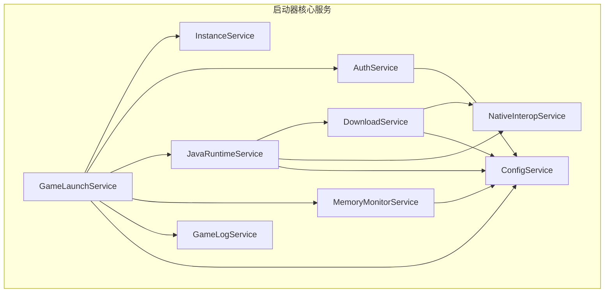
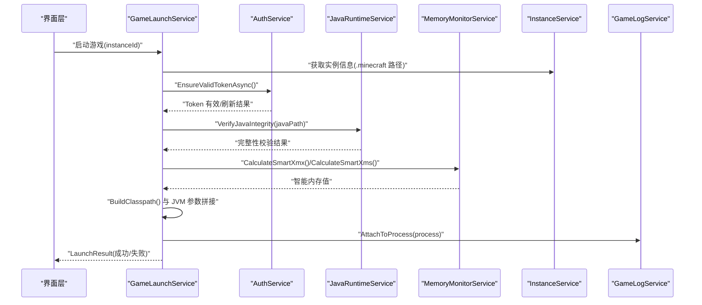
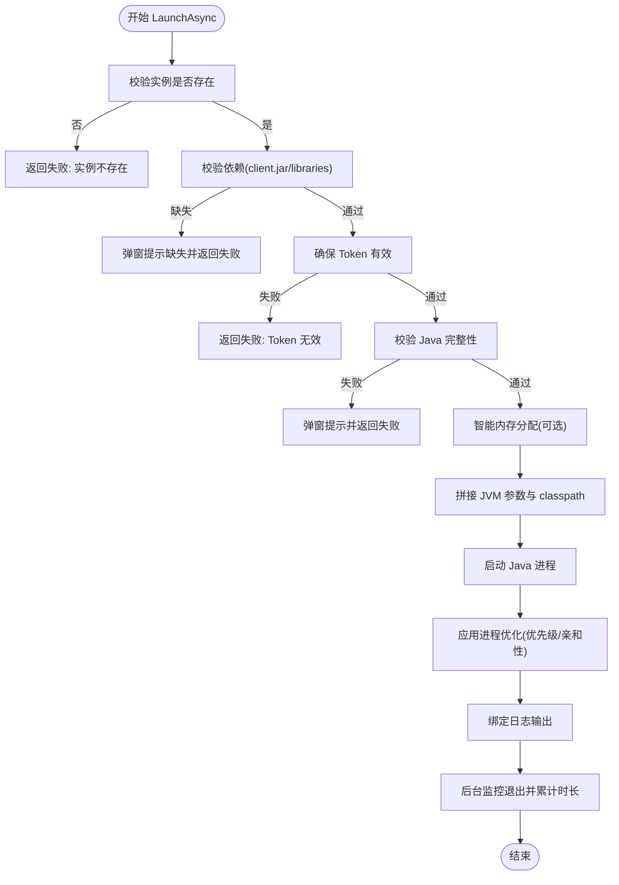
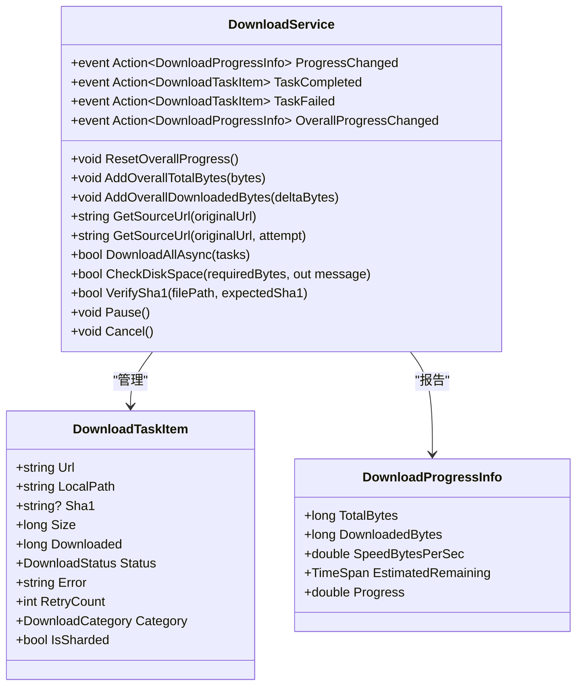
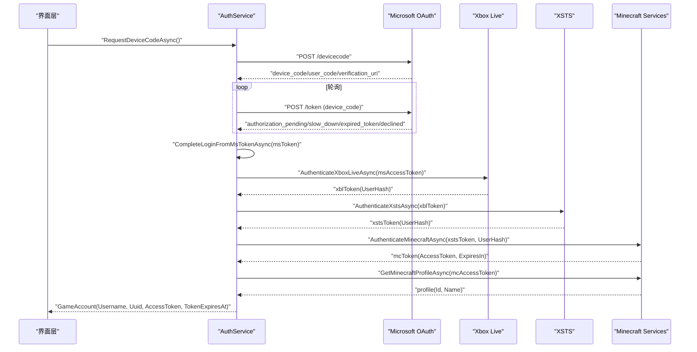
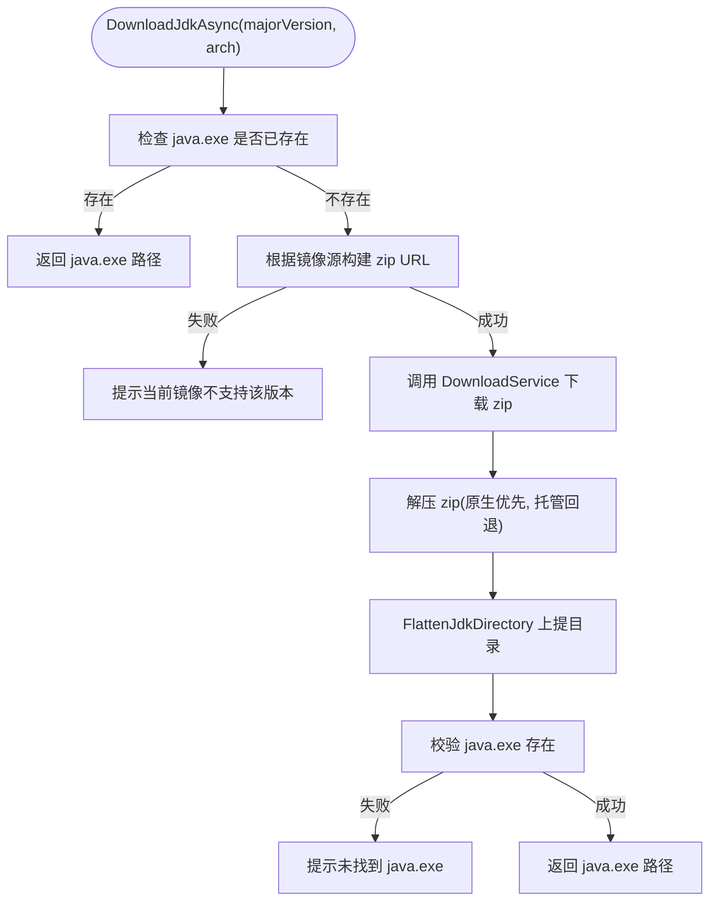
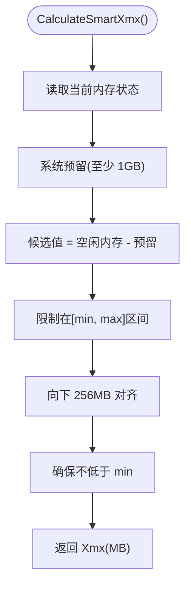
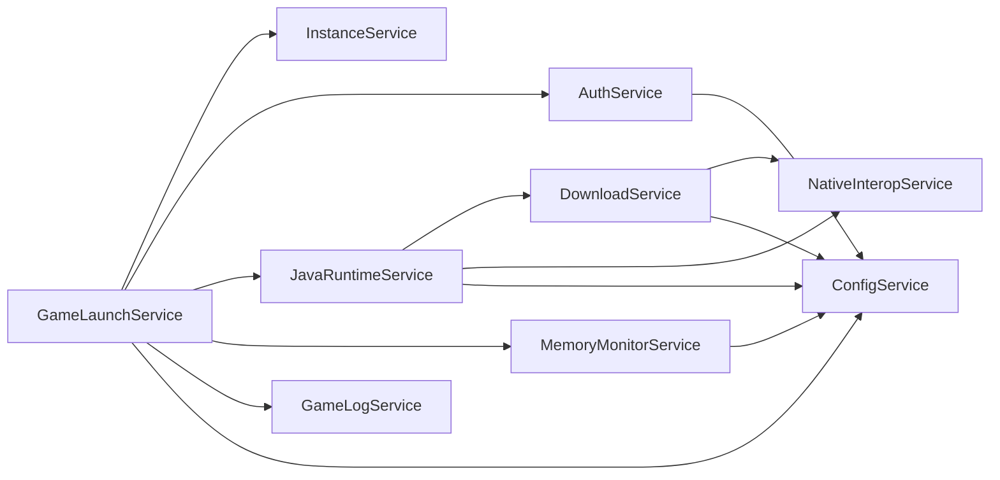

# 核心服务模块

<cite>
**本文引用的文件**   
- [GameLaunchService.cs](file://src/FufuLauncher/Services/GameLaunchService.cs)
- [DownloadService.cs](file://src/FufuLauncher/Services/DownloadService.cs)
- [AuthService.cs](file://src/FufuLauncher/Services/AuthService.cs)
- [JavaRuntimeService.cs](file://src/FufuLauncher/Services/JavaRuntimeService.cs)
- [MemoryMonitorService.cs](file://src/FufuLauncher/Services/MemoryMonitorService.cs)
- [ConfigService.cs](file://src/FufuLauncher/Services/ConfigService.cs)
- [NativeInteropService.cs](file://src/FufuLauncher/Services/NativeInteropService.cs)
- [InstanceService.cs](file://src/FufuLauncher/Services/InstanceService.cs)
- [GameLogService.cs](file://src/FufuLauncher/Services/GameLogService.cs)
</cite>

## 目录
1. [简介](#简介)
2. [项目结构](#项目结构)
3. [核心组件](#核心组件)
4. [架构总览](#架构总览)
5. [详细组件分析](#详细组件分析)
6. [依赖关系分析](#依赖关系分析)
7. [性能考量](#性能考量)
8. [故障排查指南](#故障排查指南)
9. [结论](#结论)

## 简介
本文件面向“可爱的芙芙启动器”的核心服务模块，聚焦以下关键服务的实现细节、调用关系、接口定义与使用模式：
- 游戏启动服务（GameLaunchService）：完整启动流程、JVM 参数拼接、进程管理与优化。
- 下载服务（DownloadService）：多线程分片断点续传引擎、进度管理、镜像源切换与失败重试。
- 认证服务（AuthService）：微软账号登录、令牌链与离线模式支持。
- Java 运行时服务（JavaRuntimeService）：JDK 下载管理、版本兼容性与完整性校验。
- 内存监控服务（MemoryMonitorService）：智能内存分配、系统资源监控与性能优化。

文档同时给出与其他组件的关系说明、常见问题及解决方案，并提供代码级图示帮助理解。

## 项目结构
核心服务位于 src/FufuLauncher/Services 目录下，按职责划分：
- GameLaunchService：实例依赖校验、Token 校验、JVM 参数构建、进程启动与监控。
- DownloadService：并发下载、分片、断点续传、SHA1 校验、镜像源切换。
- AuthService：设备码/本地回调登录、XBL/XSTS/MC 令牌链、离线账号。
- JavaRuntimeService：多镜像源 JDK 下载、解压、元数据探测与完整性校验。
- MemoryMonitorService：物理内存读取、智能 Xmx/Xms 计算、GC 多核参数生成。
- ConfigService：用户配置持久化（主题、下载源、Java 路径、JVM 参数、分辨率、背景等）。
- NativeInteropService：原生 DLL 加速（哈希、ZIP），失败回退托管实现。
- InstanceService：多实例隔离、导入导出、目录结构管理。
- GameLogService：游戏 stdout/stderr 实时捕获与批量落盘。

图表来源
- [GameLaunchService.cs:1-401](file://src/FufuLauncher/Services/GameLaunchService.cs#L1-L401)
- [DownloadService.cs:1-592](file://src/FufuLauncher/Services/DownloadService.cs#L1-L592)
- [AuthService.cs:1-683](file://src/FufuLauncher/Services/AuthService.cs#L1-L683)
- [JavaRuntimeService.cs:1-527](file://src/FufuLauncher/Services/JavaRuntimeService.cs#L1-L527)
- [MemoryMonitorService.cs:1-227](file://src/FufuLauncher/Services/MemoryMonitorService.cs#L1-L227)
- [ConfigService.cs:1-148](file://src/FufuLauncher/Services/ConfigService.cs#L1-L148)
- [NativeInteropService.cs:1-214](file://src/FufuLauncher/Services/NativeInteropService.cs#L1-L214)
- [InstanceService.cs:1-253](file://src/FufuLauncher/Services/InstanceService.cs#L1-L253)
- [GameLogService.cs:1-223](file://src/FufuLauncher/Services/GameLogService.cs#L1-L223)

章节来源
- [GameLaunchService.cs:1-401](file://src/FufuLauncher/Services/GameLaunchService.cs#L1-L401)
- [DownloadService.cs:1-592](file://src/FufuLauncher/Services/DownloadService.cs#L1-L592)
- [AuthService.cs:1-683](file://src/FufuLauncher/Services/AuthService.cs#L1-L683)
- [JavaRuntimeService.cs:1-527](file://src/FufuLauncher/Services/JavaRuntimeService.cs#L1-L527)
- [MemoryMonitorService.cs:1-227](file://src/FufuLauncher/Services/MemoryMonitorService.cs#L1-L227)
- [ConfigService.cs:1-148](file://src/FufuLauncher/Services/ConfigService.cs#L1-L148)
- [NativeInteropService.cs:1-214](file://src/FufuLauncher/Services/NativeInteropService.cs#L1-L214)
- [InstanceService.cs:1-253](file://src/FufuLauncher/Services/InstanceService.cs#L1-L253)
- [GameLogService.cs:1-223](file://src/FufuLauncher/Services/GameLogService.cs#L1-L223)

## 核心组件
- GameLaunchService：负责实例依赖校验、账号 Token 有效性检查、Java 完整性校验、JVM 参数拼接（含 GC 多核优化）、进程优先级与 CPU 亲和性设置、日志绑定与退出监控。
- DownloadService：提供多线程分片断点续传、双进度（单任务与全局）、暂停/继续/取消、指数退避重试、SHA1 校验、官方/BMCLAPI 镜像源自动降级。
- AuthService：支持设备码与本地回调两种登录模式，完成 MS→XBL→XSTS→MC 的令牌链，持久化 refresh_token，支持离线账号。
- JavaRuntimeService：基于 Adoptium API 或华为云镜像拉取任意主版本 JDK，解压并整理目录，列出已安装运行时，校验 java.exe 可执行。
- MemoryMonitorService：读取系统内存状态，智能计算 Xmx/Xms，生成多核 GC 参数，定时刷新事件供 UI 展示。
- ConfigService：集中管理所有配置项（下载源、Java 路径、JVM 参数、分辨率、背景、登录模式、内存策略等），支持旧配置迁移。
- NativeInteropService：优先调用 C++ 原生 DLL 进行 SHA1/SHA256 与 ZIP 操作，失败回退到托管实现。
- InstanceService：多实例隔离目录结构管理，导入/导出、复制、删除等操作。
- GameLogService：实时捕获游戏输出，缓冲队列 + 批量写盘，避免频繁 IO。

章节来源
- [GameLaunchService.cs:1-401](file://src/FufuLauncher/Services/GameLaunchService.cs#L1-L401)
- [DownloadService.cs:1-592](file://src/FufuLauncher/Services/DownloadService.cs#L1-L592)
- [AuthService.cs:1-683](file://src/FufuLauncher/Services/AuthService.cs#L1-L683)
- [JavaRuntimeService.cs:1-527](file://src/FufuLauncher/Services/JavaRuntimeService.cs#L1-L527)
- [MemoryMonitorService.cs:1-227](file://src/FufuLauncher/Services/MemoryMonitorService.cs#L1-L227)
- [ConfigService.cs:1-148](file://src/FufuLauncher/Services/ConfigService.cs#L1-L148)
- [NativeInteropService.cs:1-214](file://src/FufuLauncher/Services/NativeInteropService.cs#L1-L214)
- [InstanceService.cs:1-253](file://src/FufuLauncher/Services/InstanceService.cs#L1-L253)
- [GameLogService.cs:1-223](file://src/FufuLauncher/Services/GameLogService.cs#L1-L223)

## 架构总览
下图展示了核心服务之间的交互关系与数据流：

图表来源
- [GameLaunchService.cs:104-316](file://src/FufuLauncher/Services/GameLaunchService.cs#L104-L316)
- [AuthService.cs:420-468](file://src/FufuLauncher/Services/AuthService.cs#L420-L468)
- [JavaRuntimeService.cs:482-510](file://src/FufuLauncher/Services/JavaRuntimeService.cs#L482-L510)
- [MemoryMonitorService.cs:175-201](file://src/FufuLauncher/Services/MemoryMonitorService.cs#L175-L201)
- [GameLogService.cs:54-65](file://src/FufuLauncher/Services/GameLogService.cs#L54-L65)

## 详细组件分析

### 游戏启动服务（GameLaunchService）
- 启动前校验：
  - 依赖文件校验（client.jar、libraries 目录）。
  - 账号 Token 有效性检查，过期则提示重新登录。
  - Java 完整性校验（文件存在且 java -version 可执行）。
- JVM 参数拼接：
  - 基础参数：Xms/Xmx、java.library.path、classpath。
  - 可选多核 GC 优化参数（ParallelGCThreads/ConcGCThreads/CICompilerCount）。
  - 额外参数（ExtraJvmArgs）透传。
  - 主类 net.minecraft.client.main.Main 与游戏参数（用户名、版本、UUID、accessToken、全屏/窗口尺寸）。
- 进程管理：
  - 启动 Java 进程，设置高优先级（AboveNormal）与 CPU 亲和性（保留 1 个核心给系统）。
  - 绑定日志输出到 GameLogService，后台监控退出并累计游玩时长。
- 返回值与错误处理：
  - LaunchResult 包含 Success、ErrorMessage、Process。
  - 缺失 Java 或 Token 无效时弹窗提示并返回失败。

图表来源
- [GameLaunchService.cs:104-316](file://src/FufuLauncher/Services/GameLaunchService.cs#L104-L316)

章节来源
- [GameLaunchService.cs:69-101](file://src/FufuLauncher/Services/GameLaunchService.cs#L69-L101)
- [GameLaunchService.cs:104-316](file://src/FufuLauncher/Services/GameLaunchService.cs#L104-L316)
- [GameLaunchService.cs:318-358](file://src/FufuLauncher/Services/GameLaunchService.cs#L318-L358)
- [GameLaunchService.cs:360-376](file://src/FufuLauncher/Services/GameLaunchService.cs#L360-L376)
- [GameLaunchService.cs:378-401](file://src/FufuLauncher/Services/GameLaunchService.cs#L378-L401)

### 下载服务（DownloadService）
- 多线程分片断点续传：
  - 小文件：单连接 Range 断点续传（.partial 临时文件）。
  - 大文件（>=8MB）：多 Range 分片并发下载，预分配 .partial 文件并按偏移写入。
- 进度管理：
  - 单任务进度事件 ProgressChanged。
  - 全局总进度事件 OverallProgressChanged（节流 150ms，最终强制触发）。
- 镜像源切换与容错：
  - GetSourceUrl/GetSourceUrl(originalUrl, attempt) 支持 BMCLAPI 国内镜像自动降级。
  - ForceBmclUrl 对 Mojang 域名进行替换。
- 失败重试与校验：
  - 指数退避重试（默认 3 次）。
  - 下载完成后 SHA1 校验，失败自动重下一次。
- 磁盘空间检测：
  - CheckDiskSpace 预留 1GB 缓冲，不足则阻止下载。

图表来源
- [DownloadService.cs:28-54](file://src/FufuLauncher/Services/DownloadService.cs#L28-L54)
- [DownloadService.cs:56-114](file://src/FufuLauncher/Services/DownloadService.cs#L56-L114)
- [DownloadService.cs:116-169](file://src/FufuLauncher/Services/DownloadService.cs#L116-L169)
- [DownloadService.cs:171-210](file://src/FufuLauncher/Services/DownloadService.cs#L171-L210)
- [DownloadService.cs:221-261](file://src/FufuLauncher/Services/DownloadService.cs#L221-L261)
- [DownloadService.cs:263-293](file://src/FufuLauncher/Services/DownloadService.cs#L263-L293)
- [DownloadService.cs:295-366](file://src/FufuLauncher/Services/DownloadService.cs#L295-L366)
- [DownloadService.cs:368-451](file://src/FufuLauncher/Services/DownloadService.cs#L368-L451)
- [DownloadService.cs:453-547](file://src/FufuLauncher/Services/DownloadService.cs#L453-L547)
- [DownloadService.cs:549-591](file://src/FufuLauncher/Services/DownloadService.cs#L549-L591)

章节来源
- [DownloadService.cs:1-592](file://src/FufuLauncher/Services/DownloadService.cs#L1-L592)

### 认证服务（AuthService）
- 登录模式：
  - DeviceCode（默认）：请求设备码，轮询授权结果，支持剪贴板与一键打开网页。
  - LocalCallback（备选）：本地 127.0.0.1:54321 回调端口，浏览器重定向换取授权码。
- 令牌链：
  - MS access_token → Xbox Live(XBL) → XSTS → Minecraft access_token → 玩家资料。
  - 完整重走令牌链用于 refresh_token 自动刷新。
- 离线账号：
  - 仅保存昵称，生成确定性离线 UUID（OfflinePlayer:昵称 MD5 v3）。
- 错误区分：
  - AuthException 携带 AuthError 枚举（网络异常、未购买 MC、用户取消、设备码过期、令牌交换失败）。

图表来源
- [AuthService.cs:159-265](file://src/FufuLauncher/Services/AuthService.cs#L159-L265)
- [AuthService.cs:269-338](file://src/FufuLauncher/Services/AuthService.cs#L269-L338)
- [AuthService.cs:342-398](file://src/FufuLauncher/Services/AuthService.cs#L342-L398)
- [AuthService.cs:402-416](file://src/FufuLauncher/Services/AuthService.cs#L402-L416)
- [AuthService.cs:420-468](file://src/FufuLauncher/Services/AuthService.cs#L420-L468)
- [AuthService.cs:477-486](file://src/FufuLauncher/Services/AuthService.cs#L477-L486)
- [AuthService.cs:488-502](file://src/FufuLauncher/Services/AuthService.cs#L488-L502)
- [AuthService.cs:504-541](file://src/FufuLauncher/Services/AuthService.cs#L504-L541)
- [AuthService.cs:543-575](file://src/FufuLauncher/Services/AuthService.cs#L543-L575)
- [AuthService.cs:577-606](file://src/FufuLauncher/Services/AuthService.cs#L577-L606)
- [AuthService.cs:608-643](file://src/FufuLauncher/Services/AuthService.cs#L608-L643)

章节来源
- [AuthService.cs:1-683](file://src/FufuLauncher/Services/AuthService.cs#L1-L683)

### Java 运行时服务（JavaRuntimeService）
- JDK 下载：
  - 官方源 Adoptium API（支持 8/11/16~24）。
  - 华为云镜像（支持 LTS 8/11/17/21 等，动态解析目录页最新版本号）。
  - 下载 zip 后解压，优先原生解压，失败回退托管实现。
- 目录整理：
  - FlattenJdkDirectory 将内层 jdk-x.x.x 子目录内容上提到根目录。
- 元数据探测：
  - TryQueryJavaMeta 调用 java -version 解析主版本、架构与厂商。
- 完整性校验：
  - VerifyJavaIntegrity 检查 java.exe 存在并可执行（输出含 version）。
- 列表与选择：
  - ListInstalledRuntimes 列出已安装运行时，显示名称、路径、状态、类型、主版本、架构。
  - FetchAvailableJdkVersionsAsync 返回当前镜像源支持的版本列表。

图表来源
- [JavaRuntimeService.cs:199-277](file://src/FufuLauncher/Services/JavaRuntimeService.cs#L199-L277)
- [JavaRuntimeService.cs:279-335](file://src/FufuLauncher/Services/JavaRuntimeService.cs#L279-L335)
- [JavaRuntimeService.cs:350-379](file://src/FufuLauncher/Services/JavaRuntimeService.cs#L350-L379)
- [JavaRuntimeService.cs:381-429](file://src/FufuLauncher/Services/JavaRuntimeService.cs#L381-L429)
- [JavaRuntimeService.cs:431-480](file://src/FufuLauncher/Services/JavaRuntimeService.cs#L431-L480)
- [JavaRuntimeService.cs:482-510](file://src/FufuLauncher/Services/JavaRuntimeService.cs#L482-L510)

章节来源
- [JavaRuntimeService.cs:1-527](file://src/FufuLauncher/Services/JavaRuntimeService.cs#L1-L527)

### 内存监控服务（MemoryMonitorService）
- 系统资源监控：
  - GetCurrent 读取物理内存总量、可用、已用与负载百分比。
  - GetPhysicalCoreCount 获取 CPU 物理核心数。
- 智能内存分配：
  - CalculateSmartXmx：当前空闲内存 - 系统预留（至少 1GB），受上下限约束，向下 256MB 对齐。
  - CalculateSmartXms：Xmx 的 1/4，向下 256 对齐，最小 512MB。
- 多核 GC 优化：
  - BuildMultiCoreGcArgs：ParallelGCThreads/ConcGCThreads/CICompilerCount 基于核心数计算。
- 定时刷新：
  - DispatcherTimer 在 UI 线程触发 Updated 事件，Background 优先级避免抢占输入。

图表来源
- [MemoryMonitorService.cs:175-191](file://src/FufuLauncher/Services/MemoryMonitorService.cs#L175-L191)
- [MemoryMonitorService.cs:193-201](file://src/FufuLauncher/Services/MemoryMonitorService.cs#L193-L201)
- [MemoryMonitorService.cs:203-213](file://src/FufuLauncher/Services/MemoryMonitorService.cs#L203-L213)
- [MemoryMonitorService.cs:144-155](file://src/FufuLauncher/Services/MemoryMonitorService.cs#L144-L155)
- [MemoryMonitorService.cs:157-169](file://src/FufuLauncher/Services/MemoryMonitorService.cs#L157-L169)

章节来源
- [MemoryMonitorService.cs:1-227](file://src/FufuLauncher/Services/MemoryMonitorService.cs#L1-L227)

### 配置服务（ConfigService）
- 配置项涵盖：主题、下载源、Java 路径与版本、JVM 参数、分辨率、背景、登录模式、Java 下载镜像、开机扫描、GC 多核优化、进程优先级、CPU 亲和性、智能内存分配、视频背景帧率与音量等。
- 旧配置迁移：
  - BackgroundPath/BackgroundType → BaseImagePath/OverlayType。
  - 二次迁移：BaseImagePath 有值但 OverlayPath 为空时复制到 OverlayPath。

章节来源
- [ConfigService.cs:1-148](file://src/FufuLauncher/Services/ConfigService.cs#L1-L148)

### 原生互操作服务（NativeInteropService）
- 功能：
  - 文件哈希（SHA1/SHA256）优先调用 C++ 原生 DLL，失败回退托管实现。
  - ZIP 解压与打包优先原生，失败回退托管。
- 可用性探测：
  - IsNativeAvailable 首次调用探测并缓存结果。
- 字符串释放：
  - PtrToUtf8StringAndFree 安全转换并释放原生内存。

章节来源
- [NativeInteropService.cs:1-214](file://src/FufuLauncher/Services/NativeInteropService.cs#L1-L214)

### 实例管理服务（InstanceService）
- 多实例隔离：
  - 每个实例独立 .minecraft、mods、saves、resourcepacks、shaderpacks、options.txt、instance.json。
- 操作：
  - 创建、重命名、删除、复制、导出 zip 备份、导入已有 .minecraft。
- 路径工具：
  - GetInstanceDir、GetMinecraftDir、GetModsDir、GetResourcePacksDir、GetShaderPacksDir、GetSavesDir。

章节来源
- [InstanceService.cs:1-253](file://src/FufuLauncher/Services/InstanceService.cs#L1-L253)

### 游戏日志服务（GameLogService）
- 实时捕获：
  - AttachToProcess 订阅 OutputDataReceived/ErrorDataReceived。
- 缓冲与批量写盘：
  - 内存缓冲限制最大行数（5000），超出裁剪最早行。
  - 待写队列 + 200ms 定时器批量刷盘，减少 IO 开销。
- 事件：
  - LogsAppended（批量）、LogAppended（兼容单行）。
- 重载与清理：
  - ReloadFromFile 从文件恢复显示；Dispose 释放资源并最后一次刷盘。

章节来源
- [GameLogService.cs:1-223](file://src/FufuLauncher/Services/GameLogService.cs#L1-L223)

## 依赖关系分析
- GameLaunchService 依赖：
  - InstanceService（实例路径与元数据）。
  - VersionManifestService（版本清单，用于 libraries 解析，骨架中未完全实现）。
  - HashVerifyService（哈希校验，骨架中未完全实现）。
  - AccountService（账号 Token 校验）。
  - GameLogService（日志绑定）。
  - ConfigService（配置项：Java 路径、GC 优化、优先级、亲和性、智能内存）。
  - JavaRuntimeService（Java 完整性校验）。
  - MemoryMonitorService（智能内存分配与 GC 参数）。
- DownloadService 依赖：
  - ConfigService（下载源配置）。
  - NativeInteropService（SHA1 校验）。
- JavaRuntimeService 依赖：
  - DownloadService（JDK zip 下载）。
  - ConfigService（Java 下载镜像）。
  - NativeInteropService（ZIP 解压）。
- AuthService 依赖：
  - ConfigService（登录模式与回调端口）。
- MemoryMonitorService 依赖：
  - ConfigService（内存预留与上下限）。

图表来源
- [GameLaunchService.cs:35-65](file://src/FufuLauncher/Services/GameLaunchService.cs#L35-L65)
- [DownloadService.cs:56-114](file://src/FufuLauncher/Services/DownloadService.cs#L56-L114)
- [JavaRuntimeService.cs:76-84](file://src/FufuLauncher/Services/JavaRuntimeService.cs#L76-L84)
- [AuthService.cs:118-121](file://src/FufuLauncher/Services/AuthService.cs#L118-L121)
- [MemoryMonitorService.cs:56-59](file://src/FufuLauncher/Services/MemoryMonitorService.cs#L56-L59)

章节来源
- [GameLaunchService.cs:35-65](file://src/FufuLauncher/Services/GameLaunchService.cs#L35-L65)
- [DownloadService.cs:56-114](file://src/FufuLauncher/Services/DownloadService.cs#L56-L114)
- [JavaRuntimeService.cs:76-84](file://src/FufuLauncher/Services/JavaRuntimeService.cs#L76-L84)
- [AuthService.cs:118-121](file://src/FufuLauncher/Services/AuthService.cs#L118-L121)
- [MemoryMonitorService.cs:56-59](file://src/FufuLauncher/Services/MemoryMonitorService.cs#L56-L59)

## 性能考量
- 下载服务：
  - 多线程分片并发提升大文件吞吐；单连接 Range 断点续传保证中断恢复。
  - 全局总进度节流 150ms，避免 UI 卡顿；指数退避重试降低瞬时失败影响。
- 内存监控：
  - DispatcherTimer Background 优先级，避免抢占输入；间隔 3000ms 降低 P/Invoke 频率。
- 日志服务：
  - 批量写盘 200ms 合并，减少文件句柄开关；内存缓冲上限 5000 行防止膨胀。
- 原生互操作：
  - 优先 C++ 原生实现（哈希、ZIP），失败回退托管，兼顾性能与稳定性。

[本节为通用指导，不直接分析具体文件]

## 故障排查指南
- 启动失败：
  - 依赖缺失：检查 client.jar 与 libraries 目录，必要时重新下载。
  - Token 无效：确认账号登录状态，必要时重新登录。
  - Java 完整性失败：验证 java.exe 存在且可执行，必要时重新下载对应版本。
- 下载失败：
  - 磁盘空间不足：CheckDiskSpace 提示剩余空间，清理磁盘后重试。
  - 镜像源不可达：自动降级到 BMCLAPI，检查网络与 DNS。
  - SHA1 校验失败：自动重下一次，若仍失败检查存储介质。
- 登录失败：
  - 设备码过期：重新请求设备码。
  - 本地回调端口占用：更换端口或切换到设备码模式。
  - 未购买 MC：提示前往商店购买。
- 内存分配异常：
  - 智能分配下限/上限不合理：调整 AutoMemoryMinMb/AutoMemoryMaxMb。
  - 系统预留过高：降低 MemoryReserveMb。
- 日志问题：
  - 日志未刷新：调用 FlushNow 强制刷盘；检查文件权限。

章节来源
- [GameLaunchService.cs:104-316](file://src/FufuLauncher/Services/GameLaunchService.cs#L104-L316)
- [DownloadService.cs:221-293](file://src/FufuLauncher/Services/DownloadService.cs#L221-L293)
- [AuthService.cs:159-338](file://src/FufuLauncher/Services/AuthService.cs#L159-L338)
- [MemoryMonitorService.cs:175-201](file://src/FufuLauncher/Services/MemoryMonitorService.cs#L175-L201)
- [GameLogService.cs:168-172](file://src/FufuLauncher/Services/GameLogService.cs#L168-L172)

## 结论
核心服务模块围绕“稳定、高效、易用”的目标设计：
- GameLaunchService 提供健壮的启动流程与进程优化。
- DownloadService 具备高性能、可靠的多线程分片断点续传能力。
- AuthService 支持完整的微软账号令牌链与离线模式。
- JavaRuntimeService 灵活管理多版本 JDK，确保兼容性。
- MemoryMonitorService 智能分配内存，提升游戏性能。
- 各服务通过 ConfigService 统一配置，NativeInteropService 提供性能加速与回退保障，InstanceService 与 GameLogService 完善实例与日志管理。

通过模块化设计与清晰的依赖关系，启动器具备良好的扩展性与可维护性，适合持续迭代与功能增强。