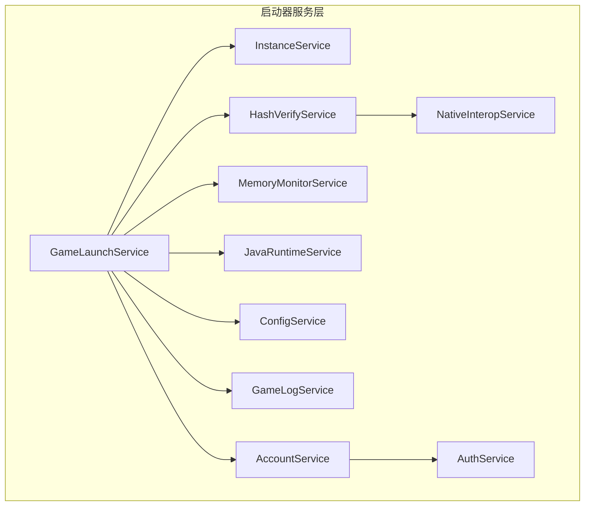
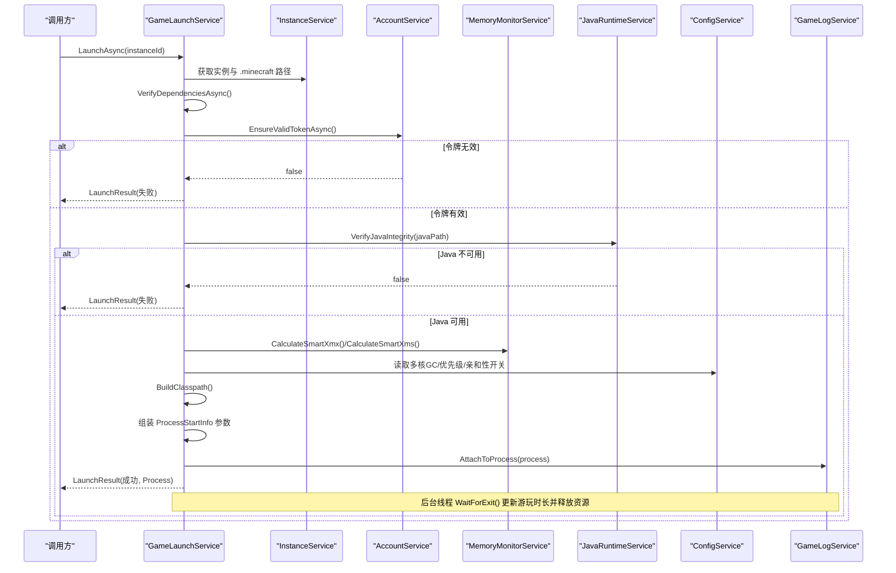
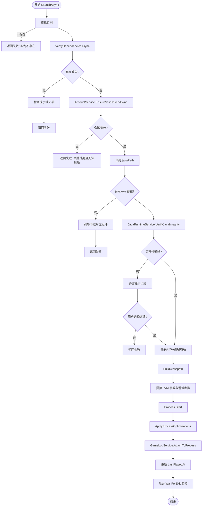
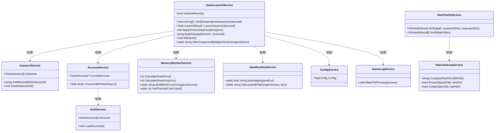

# 游戏启动服务 (GameLaunchService)

<cite>
**本文引用的文件**   
- [GameLaunchService.cs](file://src/FufuLauncher/Services/GameLaunchService.cs)
- [InstanceService.cs](file://src/FufuLauncher/Services/InstanceService.cs)
- [AccountService.cs](file://src/FufuLauncher/Services/AccountService.cs)
- [MemoryMonitorService.cs](file://src/FufuLauncher/Services/MemoryMonitorService.cs)
- [JavaRuntimeService.cs](file://src/FufuLauncher/Services/JavaRuntimeService.cs)
- [ConfigService.cs](file://src/FufuLauncher/Services/ConfigService.cs)
- [GameLogService.cs](file://src/FufuLauncher/Services/GameLogService.cs)
- [HashVerifyService.cs](file://src/FufuLauncher/Services/HashVerifyService.cs)
- [NativeInteropService.cs](file://src/FufuLauncher/Services/NativeInteropService.cs)
- [AuthService.cs](file://src/FufuLauncher/Services/AuthService.cs)
</cite>

## 目录
1. [简介](#简介)
2. [项目结构](#项目结构)
3. [核心组件](#核心组件)
4. [架构总览](#架构总览)
5. [详细组件分析](#详细组件分析)
6. [依赖关系分析](#依赖关系分析)
7. [性能考量](#性能考量)
8. [故障排查指南](#故障排查指南)
9. [结论](#结论)
10. [附录：调用示例与最佳实践](#附录调用示例与最佳实践)

## 简介
本文件为“游戏启动服务”的权威技术文档，聚焦 GameLaunchService 的完整实现与使用方式。内容涵盖：
- 游戏启动流程（依赖校验、账号令牌校验、JVM 参数拼接、进程启动与监控）
- JVM 参数配置（Xms/Xmx、多核 GC 优化、认证参数、额外参数）
- 进程管理（优先级、CPU 亲和性、退出监控、资源清理）
- 依赖文件验证机制（client.jar、libraries、assets）
- Java 运行时完整性校验（java -version）
- 智能内存分配算法（基于系统可用内存动态计算 Xmx/Xms）
- LaunchResult 模型定义与错误处理策略
- 与其他服务的集成关系（InstanceService、AccountService、MemoryMonitorService、JavaRuntimeService、GameLogService、ConfigService、HashVerifyService、NativeInteropService、AuthService）

## 项目结构
GameLaunchService 位于 FufuLauncher 的 Services 层，围绕“实例化 + 环境准备 + 进程启动 + 监控”的职责进行组织。关键目录与职责如下：
- Services：各业务服务（实例、账号、日志、内存、Java 运行时、配置、哈希校验、原生互操作等）
- Views/ViewModels：UI 与视图模型（不在本文范围）
- Start/appmcGAME：游戏数据目录（instances、runtimes、libraries、assets 等）

图表来源
- [GameLaunchService.cs:35-65](file://src/FufuLauncher/Services/GameLaunchService.cs#L35-L65)
- [InstanceService.cs:51-70](file://src/FufuLauncher/Services/InstanceService.cs#L51-L70)
- [AccountService.cs:12-26](file://src/FufuLauncher/Services/AccountService.cs#L12-L26)
- [MemoryMonitorService.cs:26-59](file://src/FufuLauncher/Services/MemoryMonitorService.cs#L26-L59)
- [JavaRuntimeService.cs:50-84](file://src/FufuLauncher/Services/JavaRuntimeService.cs#L50-L84)
- [ConfigService.cs:81-92](file://src/FufuLauncher/Services/ConfigService.cs#L81-L92)
- [GameLogService.cs:22-52](file://src/FufuLauncher/Services/GameLogService.cs#L22-L52)
- [HashVerifyService.cs:24-31](file://src/FufuLauncher/Services/HashVerifyService.cs#L24-L31)
- [NativeInteropService.cs:20-25](file://src/FufuLauncher/Services/NativeInteropService.cs#L20-L25)
- [AuthService.cs:76-121](file://src/FufuLauncher/Services/AuthService.cs#L76-L121)

章节来源
- [GameLaunchService.cs:1-17](file://src/FufuLauncher/Services/GameLaunchService.cs#L1-L17)
- [InstanceService.cs:1-16](file://src/FufuLauncher/Services/InstanceService.cs#L1-L16)

## 核心组件
- LaunchResult：启动结果模型，包含成功标志、错误信息、进程引用。
- GameLaunchService：启动编排主类，负责依赖校验、账号令牌校验、JVM 参数构建、进程启动与监控、资源释放。
- InstanceService：实例元数据与路径管理（.minecraft 根目录、版本 jar、libraries、natives 等）。
- AccountService：当前账号与令牌有效性校验（自动刷新）。
- MemoryMonitorService：系统内存监控与智能内存分配、多核 GC 参数生成。
- JavaRuntimeService：Java 运行时完整性校验（java -version）、本地 JDK 路径解析。
- ConfigService：全局配置（是否启用高优先级、CPU 亲和性、多核 GC、智能内存模式等）。
- GameLogService：游戏 stdout/stderr 实时捕获与批量落盘。
- HashVerifyService：文件哈希校验（SHA1），支持批量校验。
- NativeInteropService：C++ 原生 DLL 加速（哈希、ZIP 解压/打包），失败回退到托管实现。
- AuthService：微软账号登录与令牌链维护（供 AccountService 使用）。

章节来源
- [GameLaunchService.cs:28-34](file://src/FufuLauncher/Services/GameLaunchService.cs#L28-L34)
- [GameLaunchService.cs:35-65](file://src/FufuLauncher/Services/GameLaunchService.cs#L35-L65)
- [InstanceService.cs:27-49](file://src/FufuLauncher/Services/InstanceService.cs#L27-L49)
- [AccountService.cs:12-26](file://src/FufuLauncher/Services/AccountService.cs#L12-L26)
- [MemoryMonitorService.cs:26-59](file://src/FufuLauncher/Services/MemoryMonitorService.cs#L26-L59)
- [JavaRuntimeService.cs:482-510](file://src/FufuLauncher/Services/JavaRuntimeService.cs#L482-L510)
- [ConfigService.cs:13-79](file://src/FufuLauncher/Services/ConfigService.cs#L13-L79)
- [GameLogService.cs:22-52](file://src/FufuLauncher/Services/GameLogService.cs#L22-L52)
- [HashVerifyService.cs:24-31](file://src/FufuLauncher/Services/HashVerifyService.cs#L24-L31)
- [NativeInteropService.cs:20-25](file://src/FufuLauncher/Services/NativeInteropService.cs#L20-L25)
- [AuthService.cs:50-63](file://src/FufuLauncher/Services/AuthService.cs#L50-L63)

## 架构总览
GameLaunchService 作为启动编排中心，串联实例、账号、内存、Java 运行时、配置、日志等服务，完成从“前置校验”到“进程生命周期管理”的全链路。

图表来源
- [GameLaunchService.cs:104-316](file://src/FufuLauncher/Services/GameLaunchService.cs#L104-L316)
- [InstanceService.cs:125-141](file://src/FufuLauncher/Services/InstanceService.cs#L125-L141)
- [AccountService.cs:42-52](file://src/FufuLauncher/Services/AccountService.cs#L42-L52)
- [MemoryMonitorService.cs:175-201](file://src/FufuLauncher/Services/MemoryMonitorService.cs#L175-L201)
- [JavaRuntimeService.cs:482-510](file://src/FufuLauncher/Services/JavaRuntimeService.cs#L482-L510)
- [GameLogService.cs:54-65](file://src/FufuLauncher/Services/GameLogService.cs#L54-L65)

## 详细组件分析

### GameLaunchService 启动流程与关键逻辑
- 依赖校验：检查 client.jar 是否存在；扫描 libraries 目录；生产环境应结合 version.json 做 SHA1 校验（骨架已预留扩展点）。
- 账号令牌校验：通过 AccountService.EnsureValidTokenAsync 自动刷新过期令牌。
- Java 完整性校验：先判断 java.exe 是否存在，再执行 java -version 二次校验，避免损坏或权限问题导致立即崩溃。
- 智能内存分配：根据 ConfigService.AutoMemoryMode 与 MemoryMonitorService.CalculateSmartXmx/Xms 动态覆盖实例 Xmx/Xms。
- JVM 参数拼接：
  - 基础参数：-Xms/-Xmx、-Djava.library.path=natives、-cp classpath
  - 多核 GC 优化：ParallelGCThreads/ConcGCThreads/CICompilerCount（由配置开关控制）
  - 额外参数：按空格拆分追加
  - 主类与游戏参数：net.minecraft.client.main.Main，以及 --username/--version/--gameDir/--assetsDir/--assetIndex/--uuid/--accessToken/--userType 等
- 进程启动与优化：
  - 设置进程优先级（AboveNormal，需管理员权限）
  - CPU 亲和性：绑定前 N 个物理核心（保留 1 个给系统）
- 进程监控与资源清理：
  - 后台线程 WaitForExit，记录退出码，累计游玩时长，保存实例
  - 释放进程句柄，重置 _currentProcess 引用

图表来源
- [GameLaunchService.cs:104-316](file://src/FufuLauncher/Services/GameLaunchService.cs#L104-L316)
- [GameLaunchService.cs:318-358](file://src/FufuLauncher/Services/GameLaunchService.cs#L318-L358)
- [GameLaunchService.cs:360-376](file://src/FufuLauncher/Services/GameLaunchService.cs#L360-L376)
- [MemoryMonitorService.cs:175-213](file://src/FufuLauncher/Services/MemoryMonitorService.cs#L175-L213)
- [JavaRuntimeService.cs:482-510](file://src/FufuLauncher/Services/JavaRuntimeService.cs#L482-L510)

章节来源
- [GameLaunchService.cs:69-101](file://src/FufuLauncher/Services/GameLaunchService.cs#L69-L101)
- [GameLaunchService.cs:104-316](file://src/FufuLauncher/Services/GameLaunchService.cs#L104-L316)
- [GameLaunchService.cs:318-358](file://src/FufuLauncher/Services/GameLaunchService.cs#L318-L358)
- [GameLaunchService.cs:360-376](file://src/FufuLauncher/Services/GameLaunchService.cs#L360-L376)

### LaunchResult 模型与错误处理策略
- LaunchResult 字段：
  - Success：布尔，表示启动是否成功
  - ErrorMessage：字符串，失败原因描述
  - Process：进程对象，用于外部进一步监控或终止
- 错误处理策略：
  - 前置校验失败（实例不存在、依赖缺失、令牌无效、Java 不可用）直接返回失败结果
  - 用户交互场景（如 Java 完整性校验失败）提供弹窗确认，尊重用户选择
  - 异常捕获统一包装为 LaunchResult，避免上层崩溃

章节来源
- [GameLaunchService.cs:28-34](file://src/FufuLauncher/Services/GameLaunchService.cs#L28-L34)
- [GameLaunchService.cs:104-127](file://src/FufuLauncher/Services/GameLaunchService.cs#L104-L127)
- [GameLaunchService.cs:157-177](file://src/FufuLauncher/Services/GameLaunchService.cs#L157-L177)
- [GameLaunchService.cs:312-316](file://src/FufuLauncher/Services/GameLaunchService.cs#L312-L316)

### 依赖文件验证机制（client.jar、libraries、assets）
- client.jar：根据实例 VersionId 定位 versions/{VersionId}/{VersionId}.jar
- libraries：遍历 libraries 目录下的所有 jar（生产建议读取 version.json 的 libraries 列表并逐一校验 SHA1）
- assets：启动时通过 --assetsDir 指向 {instance}/.minecraft/assets，确保资源路径正确
- 校验失败会收集缺失项并弹窗提示，阻止启动

章节来源
- [GameLaunchService.cs:69-101](file://src/FufuLauncher/Services/GameLaunchService.cs#L69-L101)
- [GameLaunchService.cs:195-256](file://src/FufuLauncher/Services/GameLaunchService.cs#L195-L256)

### Java 运行时完整性校验
- 文件存在性检查：优先判断 java.exe 是否在预期路径
- 可执行性检查：运行 java -version，输出包含 “version” 视为通过
- 失败处理：若为内置运行时或为空路径，引导跳转下载页；否则提示指定正确路径

章节来源
- [GameLaunchService.cs:129-155](file://src/FufuLauncher/Services/GameLaunchService.cs#L129-L155)
- [JavaRuntimeService.cs:482-510](file://src/FufuLauncher/Services/JavaRuntimeService.cs#L482-L510)

### 智能内存分配算法
- 触发条件：ConfigService.AutoMemoryMode 开启
- 算法要点：
  - 读取系统可用内存，强制预留至少 1GB（或配置值）给系统
  - 剩余内存按比例分配给 Minecraft，受上下限约束（AutoMemoryMinMb/AutoMemoryMaxMb）
  - 向下取整到 256MB 对齐，减少 GC 碎片
  - Xms 取 Xmx 的 1/4，同样 256MB 对齐，最小 512MB
- 仅当智能值大于实例原值时才采用，避免低配机器降级导致无法启动

章节来源
- [MemoryMonitorService.cs:175-201](file://src/FufuLauncher/Services/MemoryMonitorService.cs#L175-L201)
- [GameLaunchService.cs:179-193](file://src/FufuLauncher/Services/GameLaunchService.cs#L179-L193)

### JVM 参数拼接逻辑
- 基础参数：-Xms/-Xmx、-Djava.library.path=natives、-cp classpath
- 多核 GC 优化：ParallelGCThreads/ConcGCThreads/CICompilerCount（由配置开关控制）
- 额外参数：按空格拆分后逐个添加
- 主类与游戏参数：net.minecraft.client.main.Main，以及用户名、版本、目录、资产索引、UUID、访问令牌、用户类型、全屏/分辨率等

章节来源
- [GameLaunchService.cs:199-256](file://src/FufuLauncher/Services/GameLaunchService.cs#L199-L256)
- [MemoryMonitorService.cs:204-213](file://src/FufuLauncher/Services/MemoryMonitorService.cs#L204-L213)

### 进程优先级与 CPU 亲和性配置
- 进程优先级：AboveNormal（禁止 Realtime，避免抢占系统资源）
- CPU 亲和性：绑定前 N 个物理核心（N = 物理核心数 - 1），掩码低位前 N 位为 1
- 失败不阻塞启动，记录日志

章节来源
- [GameLaunchService.cs:318-358](file://src/FufuLauncher/Services/GameLaunchService.cs#L318-L358)

### 进程监控与资源清理
- 后台线程 WaitForExit，记录退出码，累计游玩时长，保存实例
- 释放进程句柄，重置 _currentProcess 引用，避免再次启动竞态

章节来源
- [GameLaunchService.cs:287-316](file://src/FufuLauncher/Services/GameLaunchService.cs#L287-L316)

### 与其他服务的集成关系
- InstanceService：提供实例元数据与路径（.minecraft、versions、libraries、natives）
- AccountService：保证启动前令牌有效（自动刷新）
- MemoryMonitorService：智能内存分配与多核 GC 参数生成
- JavaRuntimeService：Java 完整性校验与本地 JDK 路径解析
- ConfigService：读取多核 GC、高优先级、CPU 亲和性、智能内存模式等开关
- GameLogService：附加到进程，实时捕获 stdout/stderr，批量落盘
- HashVerifyService：文件哈希校验（SHA1），支持批量校验
- NativeInteropService：原生加速（哈希、ZIP），失败回退托管实现
- AuthService：微软账号令牌链维护（供 AccountService 使用）

章节来源
- [GameLaunchService.cs:35-65](file://src/FufuLauncher/Services/GameLaunchService.cs#L35-L65)
- [InstanceService.cs:51-70](file://src/FufuLauncher/Services/InstanceService.cs#L51-L70)
- [AccountService.cs:12-26](file://src/FufuLauncher/Services/AccountService.cs#L12-L26)
- [MemoryMonitorService.cs:26-59](file://src/FufuLauncher/Services/MemoryMonitorService.cs#L26-L59)
- [JavaRuntimeService.cs:50-84](file://src/FufuLauncher/Services/JavaRuntimeService.cs#L50-L84)
- [ConfigService.cs:81-92](file://src/FufuLauncher/Services/ConfigService.cs#L81-L92)
- [GameLogService.cs:22-52](file://src/FufuLauncher/Services/GameLogService.cs#L22-L52)
- [HashVerifyService.cs:24-31](file://src/FufuLauncher/Services/HashVerifyService.cs#L24-L31)
- [NativeInteropService.cs:20-25](file://src/FufuLauncher/Services/NativeInteropService.cs#L20-L25)
- [AuthService.cs:76-121](file://src/FufuLauncher/Services/AuthService.cs#L76-L121)

## 依赖关系分析

图表来源
- [GameLaunchService.cs:35-65](file://src/FufuLauncher/Services/GameLaunchService.cs#L35-L65)
- [InstanceService.cs:51-70](file://src/FufuLauncher/Services/InstanceService.cs#L51-L70)
- [AccountService.cs:12-26](file://src/FufuLauncher/Services/AccountService.cs#L12-L26)
- [MemoryMonitorService.cs:26-59](file://src/FufuLauncher/Services/MemoryMonitorService.cs#L26-L59)
- [JavaRuntimeService.cs:50-84](file://src/FufuLauncher/Services/JavaRuntimeService.cs#L50-L84)
- [ConfigService.cs:81-92](file://src/FufuLauncher/Services/ConfigService.cs#L81-L92)
- [GameLogService.cs:22-52](file://src/FufuLauncher/Services/GameLogService.cs#L22-L52)
- [HashVerifyService.cs:24-31](file://src/FufuLauncher/Services/HashVerifyService.cs#L24-L31)
- [NativeInteropService.cs:20-25](file://src/FufuLauncher/Services/NativeInteropService.cs#L20-L25)
- [AuthService.cs:76-121](file://src/FufuLauncher/Services/AuthService.cs#L76-L121)

章节来源
- [GameLaunchService.cs:35-65](file://src/FufuLauncher/Services/GameLaunchService.cs#L35-L65)

## 性能考量
- 日志写入：GameLogService 使用内存缓冲队列与定时器批量写盘（200ms），避免逐行 IO 开销；缓冲区上限 5000 行，防止内存膨胀。
- 内存监控：MemoryMonitorService 使用 DispatcherTimer（Background 优先级）定时刷新，降低 UI 线程压力；间隔 3000ms，避免频繁 P/Invoke。
- 原生加速：NativeInteropService 优先调用 C++ DLL（哈希、ZIP），失败自动回退托管实现，保证可用性。
- 进程监控：后台线程 WaitForExit，避免阻塞 UI；及时释放进程句柄，避免资源泄漏。

章节来源
- [GameLogService.cs:48-52](file://src/FufuLauncher/Services/GameLogService.cs#L48-L52)
- [GameLogService.cs:139-166](file://src/FufuLauncher/Services/GameLogService.cs#L139-L166)
- [MemoryMonitorService.cs:62-88](file://src/FufuLauncher/Services/MemoryMonitorService.cs#L62-L88)
- [NativeInteropService.cs:38-55](file://src/FufuLauncher/Services/NativeInteropService.cs#L38-L55)

## 故障排查指南
- 启动前依赖缺失：检查 client.jar 与 libraries 目录；必要时根据 version.json 校验 SHA1。
- 账号令牌过期：AccountService.EnsureValidTokenAsync 会自动刷新；若失败，重新登录。
- Java 运行时缺失或损坏：确认 java.exe 路径与完整性（java -version）；按提示跳转到 Java 运行时页面下载。
- 进程启动失败：检查 ProcessStartInfo 参数是否正确（classpath、JVM 参数、游戏参数）；查看 GameLogService 输出的 stderr。
- 优先级/亲和性设置失败：需要管理员权限；失败不影响启动，查看应用日志。
- 内存分配不合理：关闭 AutoMemoryMode 或调整 AutoMemoryMinMb/AutoMemoryMaxMb/MemoryReserveMb。

章节来源
- [GameLaunchService.cs:69-101](file://src/FufuLauncher/Services/GameLaunchService.cs#L69-L101)
- [AccountService.cs:42-52](file://src/FufuLauncher/Services/AccountService.cs#L42-L52)
- [JavaRuntimeService.cs:482-510](file://src/FufuLauncher/Services/JavaRuntimeService.cs#L482-L510)
- [GameLogService.cs:54-65](file://src/FufuLauncher/Services/GameLogService.cs#L54-L65)
- [GameLaunchService.cs:318-358](file://src/FufuLauncher/Services/GameLaunchService.cs#L318-L358)
- [MemoryMonitorService.cs:175-201](file://src/FufuLauncher/Services/MemoryMonitorService.cs#L175-L201)

## 结论
GameLaunchService 以清晰的职责边界与健壮的错误处理，实现了从依赖校验、账号令牌校验、Java 完整性校验到 JVM 参数拼接、进程启动与监控的完整启动流程。通过智能内存分配、多核 GC 优化、进程优先级与 CPU 亲和性配置，显著提升了游戏启动稳定性与运行性能。与各服务的解耦设计便于扩展与维护。

## 附录：调用示例与最佳实践
- 启动游戏
  - 调用 LaunchAsync(instanceId)，等待 Task 完成
  - 检查 LaunchResult.Success，若失败则读取 ErrorMessage 提示用户
  - 若成功，可通过 LaunchResult.Process 进一步监控或终止
- 监控进程状态
  - 使用 LaunchResult.Process.HasExited 判断是否退出
  - 通过 GameLogService 订阅 LogsAppended 事件，实时显示日志
- 停止游戏
  - 调用 KillGame()，将终止进程树
- 最佳实践
  - 在启动前调用 VerifyDependenciesAsync 提前发现缺失依赖
  - 开启 AutoMemoryMode 以获得更合理的内存分配
  - 在多核环境下启用 MultiCoreGcOptimize 提升 GC 效率
  - 在高负载系统上谨慎启用 HighPriorityProcess 与 CpuAffinityEnabled

章节来源
- [GameLaunchService.cs:104-316](file://src/FufuLauncher/Services/GameLaunchService.cs#L104-L316)
- [GameLaunchService.cs:378-384](file://src/FufuLauncher/Services/GameLaunchService.cs#L378-L384)
- [GameLogService.cs:40-44](file://src/FufuLauncher/Services/GameLogService.cs#L40-L44)