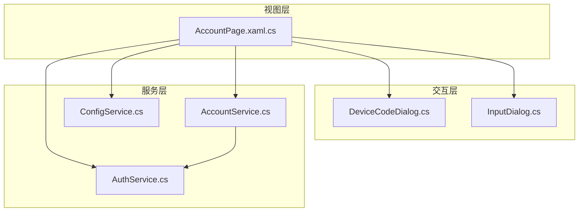
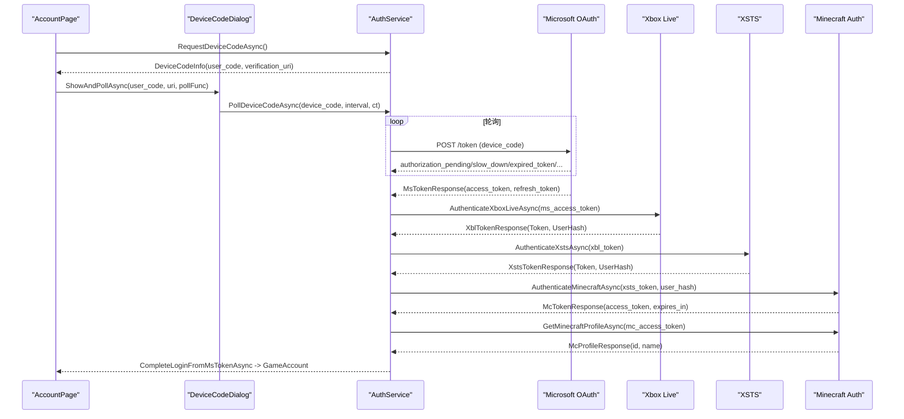
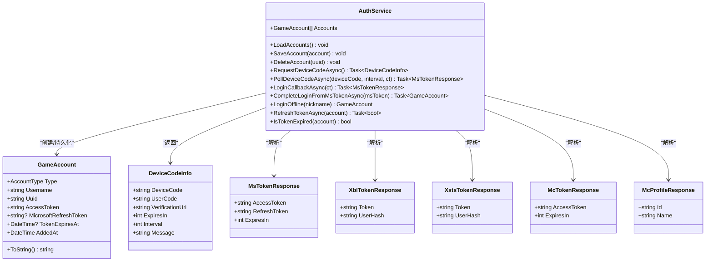
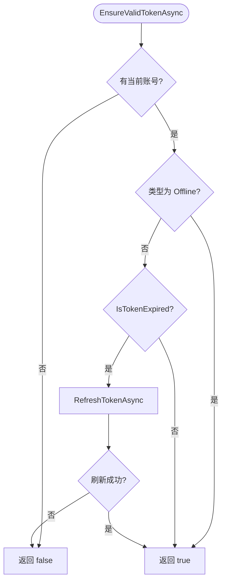
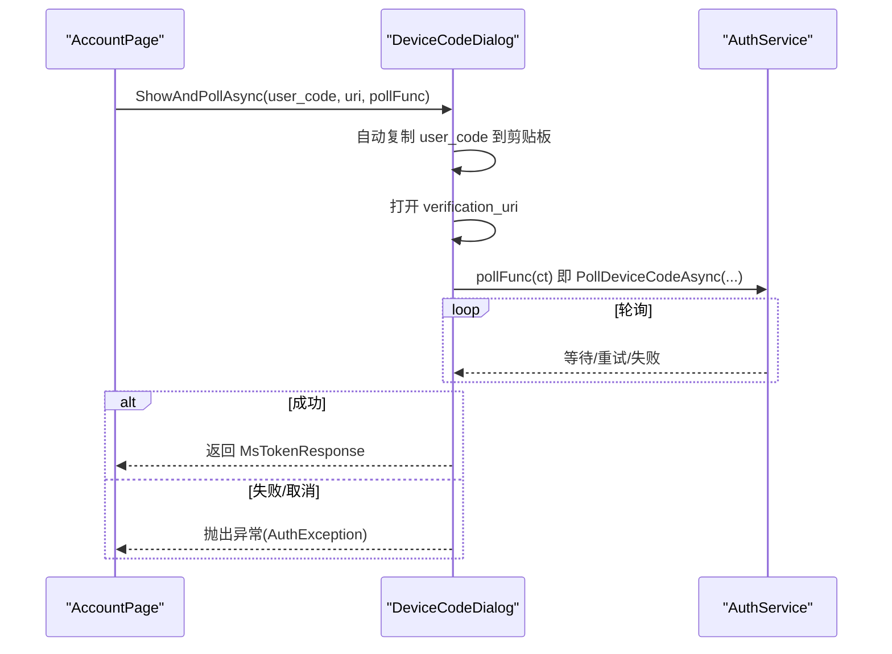
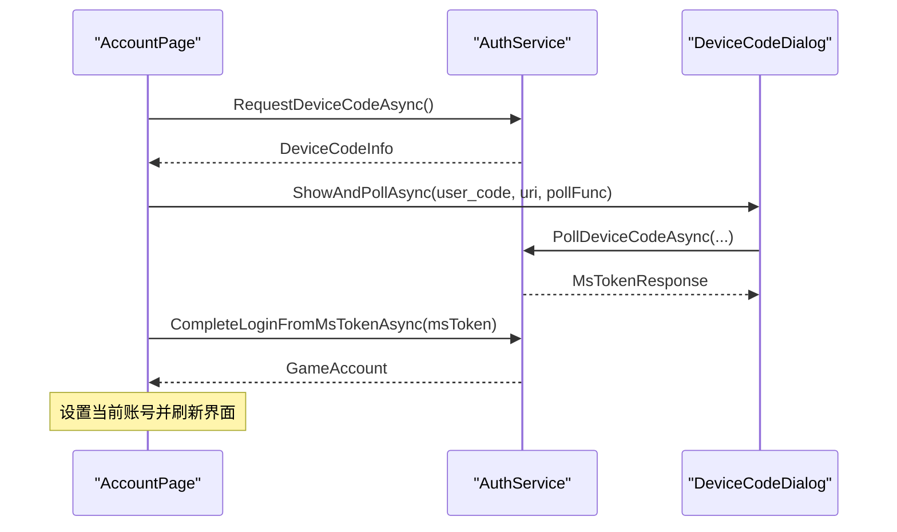
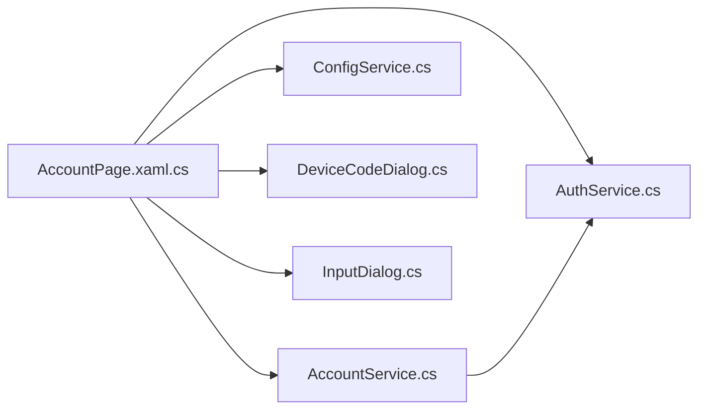

# 认证服务 (AuthService)

<cite>
**本文引用的文件**   
- [AuthService.cs](file://src/FufuLauncher/Services/AuthService.cs)
- [AccountService.cs](file://src/FufuLauncher/Services/AccountService.cs)
- [DeviceCodeDialog.cs](file://src/FufuLauncher/Interaction/DeviceCodeDialog.cs)
- [AccountPage.xaml.cs](file://src/FufuLauncher/Views/AccountPage.xaml.cs)
- [ConfigService.cs](file://src/FufuLauncher/Services/ConfigService.cs)
- [InputDialog.cs](file://src/FufuLauncher/Interaction/InputDialog.cs)
</cite>

## 目录
1. [简介](#简介)
2. [项目结构](#项目结构)
3. [核心组件](#核心组件)
4. [架构总览](#架构总览)
5. [详细组件分析](#详细组件分析)
6. [依赖关系分析](#依赖关系分析)
7. [性能与可靠性](#性能与可靠性)
8. [故障排查指南](#故障排查指南)
9. [结论](#结论)
10. [附录：使用示例与最佳实践](#附录使用示例与最佳实践)

## 简介
本文件面向“可爱的芙芙”启动器中的认证服务，重点说明 AuthService 的微软账号登录实现。内容覆盖 OAuth 2.0 设备码与本地回调两种模式、完整的令牌链（MS → XBL → XSTS → Minecraft）、Token 管理与自动刷新机制、账户信息存储与会话管理、离线模式支持、登录状态检测与重新认证流程、错误处理策略，以及与 DeviceCodeDialog 的交互、网络请求封装与安全考虑。文档同时提供调用序列图与流程图，帮助读者快速理解并正确使用该服务。

## 项目结构
认证相关代码主要分布在 Services、Interaction、Views 三个层次：
- Services：AuthService（认证核心）、AccountService（会话与当前账号管理）、ConfigService（配置项）
- Interaction：DeviceCodeDialog（设备码弹窗交互）、InputDialog（输入框工具）
- Views：AccountPage.xaml.cs（页面逻辑，触发登录流程）

图表来源
- [AccountPage.xaml.cs:1-143](file://src/FufuLauncher/Views/AccountPage.xaml.cs#L1-L143)
- [DeviceCodeDialog.cs:1-204](file://src/FufuLauncher/Interaction/DeviceCodeDialog.cs#L1-L204)
- [AuthService.cs:1-683](file://src/FufuLauncher/Services/AuthService.cs#L1-L683)
- [AccountService.cs:1-54](file://src/FufuLauncher/Services/AccountService.cs#L1-L54)
- [ConfigService.cs:1-148](file://src/FufuLauncher/Services/ConfigService.cs#L1-L148)

章节来源
- [AccountPage.xaml.cs:1-143](file://src/FufuLauncher/Views/AccountPage.xaml.cs#L1-L143)
- [AuthService.cs:1-683](file://src/FufuLauncher/Services/AuthService.cs#L1-L683)
- [AccountService.cs:1-54](file://src/FufuLauncher/Services/AccountService.cs#L1-L54)
- [ConfigService.cs:1-148](file://src/FufuLauncher/Services/ConfigService.cs#L1-L148)

## 核心组件
- AuthService：实现微软 OAuth 2.0 设备码与本地回调登录、完整令牌链（MS→XBL→XSTS→MC）、Token 刷新、账户持久化、离线账号生成。
- AccountService：维护当前账号、账号列表、启动前校验并自动刷新过期令牌。
- DeviceCodeDialog：设备码登录弹窗，自动复制验证码、一键打开授权页、后台轮询授权结果。
- ConfigService：提供 AuthMode（DeviceCode/LocalCallback）、回调端口等配置。
- AccountPage.xaml.cs：页面入口，根据配置选择登录方式，统一错误提示。

章节来源
- [AuthService.cs:1-683](file://src/FufuLauncher/Services/AuthService.cs#L1-L683)
- [AccountService.cs:1-54](file://src/FufuLauncher/Services/AccountService.cs#L1-L54)
- [DeviceCodeDialog.cs:1-204](file://src/FufuLauncher/Interaction/DeviceCodeDialog.cs#L1-L204)
- [ConfigService.cs:1-148](file://src/FufuLauncher/Services/ConfigService.cs#L1-L148)
- [AccountPage.xaml.cs:1-143](file://src/FufuLauncher/Views/AccountPage.xaml.cs#L1-L143)

## 架构总览
AuthService 作为认证中枢，负责：
- 发起 OAuth 2.0 设备码或本地回调授权
- 完成 MS→XBL→XSTS→Minecraft 的令牌链
- 管理 GameAccount 的持久化与生命周期
- 提供 Token 过期检测与自动刷新

图表来源
- [AccountPage.xaml.cs:57-72](file://src/FufuLauncher/Views/AccountPage.xaml.cs#L57-L72)
- [DeviceCodeDialog.cs:26-202](file://src/FufuLauncher/Interaction/DeviceCodeDialog.cs#L26-L202)
- [AuthService.cs:159-265](file://src/FufuLauncher/Services/AuthService.cs#L159-L265)
- [AuthService.cs:343-398](file://src/FufuLauncher/Services/AuthService.cs#L343-L398)
- [AuthService.cs:504-606](file://src/FufuLauncher/Services/AuthService.cs#L504-L606)
- [AuthService.cs:608-643](file://src/FufuLauncher/Services/AuthService.cs#L608-L643)

## 详细组件分析

### AuthService：微软账号登录与令牌链
- 登录模式
  - 设备码（默认）：通过 Microsoft OAuth device_code 流，用户浏览器授权后轮询获取 access_token。
  - 本地回调（备选）：监听 127.0.0.1:54321，重定向获取 code 后换取 access_token。
- 令牌链
  - MS access_token → XBL 认证 → XSTS 授权 → Minecraft access_token → 玩家资料查询
- Token 管理
  - 保存 Microsoft refresh_token 与 Minecraft access_token
  - IsTokenExpired 基于 TokenExpiresAt 判断是否提前 5 分钟过期
  - RefreshTokenAsync 使用 refresh_token 刷新 MS token，并重走完整令牌链更新 MC token
- 账户存储
  - LoadAccounts/SaveAccount/DeleteAccount 基于 App.GameDataDir/accounts/*.json
  - ToString 用于列表显示友好名称
- 离线账号
  - LoginOffline 生成确定性离线 UUID（基于昵称的 MD5 v3），AccessToken 用 UUID 占位
- 错误处理
  - 自定义 AuthException 携带 AuthError 枚举，便于 UI 区分提示

图表来源
- [AuthService.cs:50-74](file://src/FufuLauncher/Services/AuthService.cs#L50-L74)
- [AuthService.cs:646-681](file://src/FufuLauncher/Services/AuthService.cs#L646-L681)

章节来源
- [AuthService.cs:159-265](file://src/FufuLauncher/Services/AuthService.cs#L159-L265)
- [AuthService.cs:269-338](file://src/FufuLauncher/Services/AuthService.cs#L269-L338)
- [AuthService.cs:343-398](file://src/FufuLauncher/Services/AuthService.cs#L343-L398)
- [AuthService.cs:403-416](file://src/FufuLauncher/Services/AuthService.cs#L403-L416)
- [AuthService.cs:421-468](file://src/FufuLauncher/Services/AuthService.cs#L421-L468)
- [AuthService.cs:470-474](file://src/FufuLauncher/Services/AuthService.cs#L470-L474)
- [AuthService.cs:504-606](file://src/FufuLauncher/Services/AuthService.cs#L504-L606)
- [AuthService.cs:608-643](file://src/FufuLauncher/Services/AuthService.cs#L608-L643)

### AccountService：会话管理与自动刷新
- 维护当前账号 CurrentAccount 与账号列表
- EnsureValidTokenAsync 在启动游戏前检查并自动刷新过期令牌（仅 Microsoft 类型）
- DeleteAccount 同步清理当前账号引用并触发事件

图表来源
- [AccountService.cs:42-52](file://src/FufuLauncher/Services/AccountService.cs#L42-L52)
- [AuthService.cs:470-474](file://src/FufuLauncher/Services/AuthService.cs#L470-L474)
- [AuthService.cs:421-468](file://src/FufuLauncher/Services/AuthService.cs#L421-L468)

章节来源
- [AccountService.cs:1-54](file://src/FufuLauncher/Services/AccountService.cs#L1-L54)

### DeviceCodeDialog：设备码弹窗交互
- 展示 user_code 与 verification_uri，自动复制到剪贴板并打开浏览器
- 后台轮询授权结果，成功关闭弹窗并返回 MsTokenResponse
- 用户取消或窗口关闭时抛出 AuthException(Cancelled)

图表来源
- [DeviceCodeDialog.cs:26-202](file://src/FufuLauncher/Interaction/DeviceCodeDialog.cs#L26-L202)
- [AuthService.cs:198-265](file://src/FufuLauncher/Services/AuthService.cs#L198-L265)

章节来源
- [DeviceCodeDialog.cs:1-204](file://src/FufuLauncher/Interaction/DeviceCodeDialog.cs#L1-L204)

### AccountPage.xaml.cs：登录流程入口与错误处理
- 根据配置切换登录模式（设备码/本地回调）
- 设备码流程：RequestDeviceCodeAsync → DeviceCodeDialog.ShowAndPollAsync → CompleteLoginFromMsTokenAsync
- 本地回调流程：LoginCallbackAsync → CompleteLoginFromMsTokenAsync
- 统一错误提示：按 AuthError 分类显示消息框

图表来源
- [AccountPage.xaml.cs:57-72](file://src/FufuLauncher/Views/AccountPage.xaml.cs#L57-L72)
- [AccountPage.xaml.cs:75-103](file://src/FufuLauncher/Views/AccountPage.xaml.cs#L75-L103)

章节来源
- [AccountPage.xaml.cs:1-143](file://src/FufuLauncher/Views/AccountPage.xaml.cs#L1-L143)

### ConfigService：认证相关配置
- AuthMode：DeviceCode（默认）/ LocalCallback
- AuthCallbackPort：本地回调端口（默认 54321）
- MicrosoftClientId：调试期固定值，发布可替换

章节来源
- [ConfigService.cs:37-44](file://src/FufuLauncher/Services/ConfigService.cs#L37-L44)

## 依赖关系分析
- AccountPage 依赖 AuthService、AccountService、ConfigService、DeviceCodeDialog、InputDialog
- AccountService 依赖 AuthService，暴露当前账号与刷新能力
- AuthService 依赖 HttpClient、JsonSerializer、文件系统（accounts/*.json）
- 外部依赖：Microsoft OAuth、Xbox Live、XSTS、Minecraft Auth API

图表来源
- [AccountPage.xaml.cs:1-143](file://src/FufuLauncher/Views/AccountPage.xaml.cs#L1-L143)
- [AccountService.cs:1-54](file://src/FufuLauncher/Services/AccountService.cs#L1-L54)
- [AuthService.cs:1-683](file://src/FufuLauncher/Services/AuthService.cs#L1-L683)

章节来源
- [AccountPage.xaml.cs:1-143](file://src/FufuLauncher/Views/AccountPage.xaml.cs#L1-L143)
- [AccountService.cs:1-54](file://src/FufuLauncher/Services/AccountService.cs#L1-L54)
- [AuthService.cs:1-683](file://src/FufuLauncher/Services/AuthService.cs#L1-L683)

## 性能与可靠性
- 网络超时与重试
  - HttpClient 超时 30s，User-Agent/Accept 头统一注入，避免部分端点 401/403
  - 设备码轮询支持 slow_down 策略，动态增加延迟
- 令牌刷新
  - 提前 5 分钟判定过期，避免临界失效
  - 刷新失败不中断主流程，上层可降级或提示
- 资源释放
  - HttpListener 使用 using 确保释放
  - 文件操作异常捕获，避免崩溃
- 日志
  - 关键步骤写入应用日志，响应体截断避免大 JSON

[本节为通用指导，不直接分析具体文件]

## 故障排查指南
- 未购买 Minecraft
  - 现象：GetMinecraftProfileAsync 返回 404，抛出 NotOwnedMinecraft
  - 处理：引导用户前往微软商店/Minecraft.net 购买
- 网络异常
  - 现象：HttpRequestException，抛 Network
  - 处理：提示网络问题，稍后重试
- 用户取消
  - 现象：CancellationToken 触发或窗口关闭，抛 Cancelled
  - 处理：静默退出或提示用户已取消
- 设备码过期
  - 现象：expired_token，抛 DeviceCodeExpired
  - 处理：重新请求设备码并再次弹窗
- 令牌交换失败
  - 现象：任一环节响应异常或解析失败，抛 TokenExchangeFailed
  - 处理：查看应用日志，确认端点可达与参数正确

章节来源
- [AccountPage.xaml.cs:75-103](file://src/FufuLauncher/Views/AccountPage.xaml.cs#L75-L103)
- [AuthService.cs:608-643](file://src/FufuLauncher/Services/AuthService.cs#L608-L643)
- [AuthService.cs:198-265](file://src/FufuLauncher/Services/AuthService.cs#L198-L265)

## 结论
AuthService 提供了完整的微软账号认证与令牌管理能力，支持设备码与本地回调两种登录模式，并通过 XBL/XSTS 链路获取 Minecraft 访问令牌。配合 AccountService 的会话管理与自动刷新机制，可在启动前保证令牌有效。DeviceCodeDialog 提升了用户体验，简化了授权流程。整体设计清晰、健壮，具备完善的错误处理与日志记录，适合在生产环境中稳定运行。

[本节为总结性内容，不直接分析具体文件]

## 附录：使用示例与最佳实践

### 触发登录流程（设备码）
- 步骤
  - 调用 RequestDeviceCodeAsync 获取 DeviceCodeInfo
  - 使用 DeviceCodeDialog.ShowAndPollAsync 展示弹窗并轮询
  - 成功后调用 CompleteLoginFromMsTokenAsync 完成令牌链并保存账户
- 参考路径
  - [AccountPage.xaml.cs:57-64](file://src/FufuLauncher/Views/AccountPage.xaml.cs#L57-L64)
  - [AuthService.cs:159-192](file://src/FufuLauncher/Services/AuthService.cs#L159-L192)
  - [AuthService.cs:343-398](file://src/FufuLauncher/Services/AuthService.cs#L343-L398)

### 触发登录流程（本地回调）
- 步骤
  - 调用 LoginCallbackAsync 监听本地端口并获取授权码
  - 成功后调用 CompleteLoginFromMsTokenAsync 完成令牌链并保存账户
- 参考路径
  - [AccountPage.xaml.cs:67-72](file://src/FufuLauncher/Views/AccountPage.xaml.cs#L67-L72)
  - [AuthService.cs:269-338](file://src/FufuLauncher/Services/AuthService.cs#L269-L338)
  - [AuthService.cs:343-398](file://src/FufuLauncher/Services/AuthService.cs#L343-L398)

### 处理登录回调与错误
- 统一按 AuthError 分类提示
- 参考路径
  - [AccountPage.xaml.cs:75-103](file://src/FufuLauncher/Views/AccountPage.xaml.cs#L75-L103)

### 管理用户会话与自动刷新
- 启动前调用 EnsureValidTokenAsync 校验并刷新
- 参考路径
  - [AccountService.cs:42-52](file://src/FufuLauncher/Services/AccountService.cs#L42-L52)
  - [AuthService.cs:421-468](file://src/FufuLauncher/Services/AuthService.cs#L421-L468)

### 离线模式支持
- 使用 LoginOffline 生成离线账号与确定性 UUID
- 参考路径
  - [AuthService.cs:403-416](file://src/FufuLauncher/Services/AuthService.cs#L403-L416)
  - [AccountPage.xaml.cs:105-114](file://src/FufuLauncher/Views/AccountPage.xaml.cs#L105-L114)

### 安全考虑
- 使用公共客户端流（无 ClientSecret），scope 包含 offline_access
- 本地回调仅监听 127.0.0.1，避免外部访问
- 敏感字段（refresh_token、access_token）仅保存在本地账户文件中
- 所有网络请求统一设置 User-Agent/Accept，避免被服务端拒绝

[本节为实践指导，不直接分析具体文件]