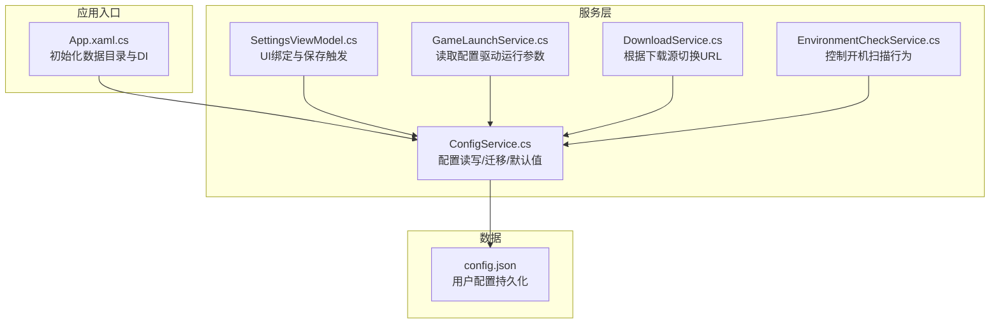
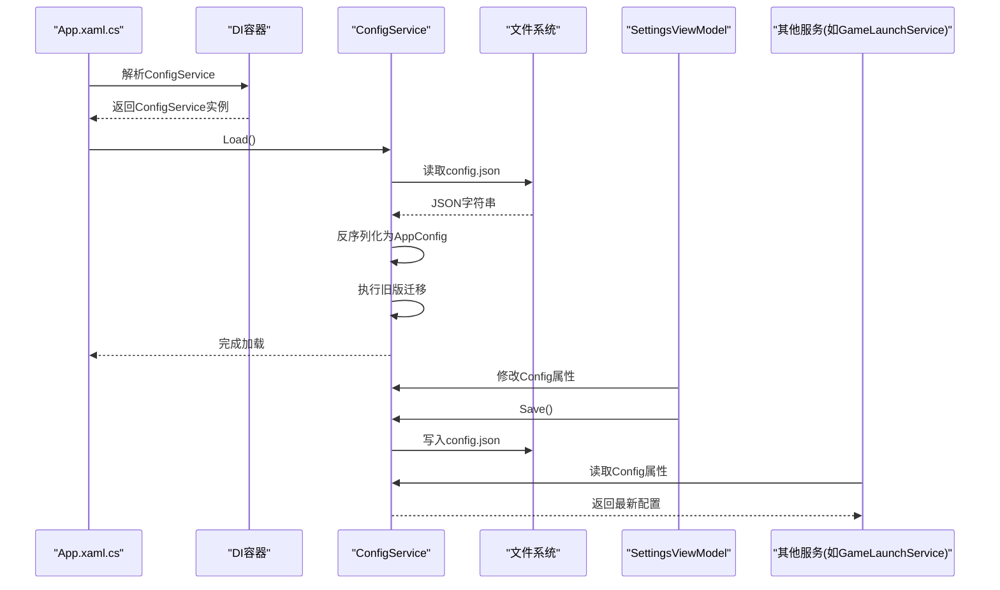
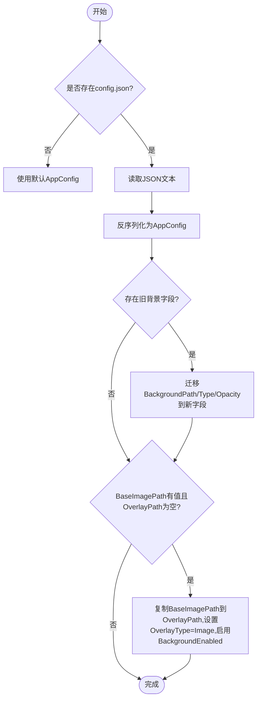
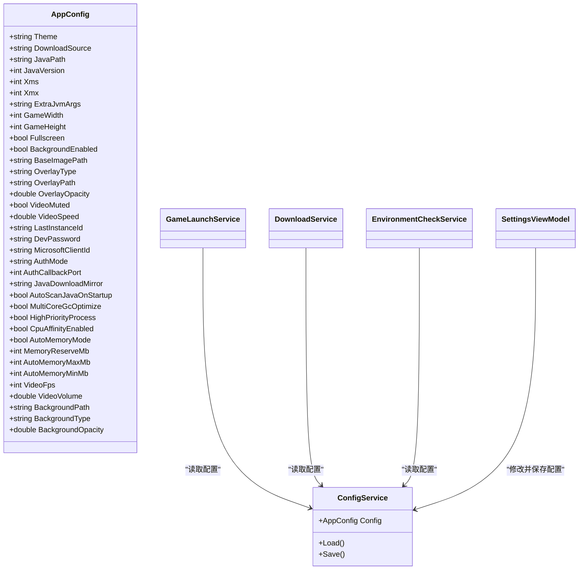

# 配置服务 (ConfigService)

<cite>
**本文引用的文件**   
- [ConfigService.cs](file://src/FufuLauncher/Services/ConfigService.cs)
- [config.json](file://Start/appmcGAME/config.json)
- [App.xaml.cs](file://src/FufuLauncher/App.xaml.cs)
- [SettingsViewModel.cs](file://src/FufuLauncher/ViewModels/SettingsViewModel.cs)
- [GameLaunchService.cs](file://src/FufuLauncher/Services/GameLaunchService.cs)
- [DownloadService.cs](file://src/FufuLauncher/Services/DownloadService.cs)
- [EnvironmentCheckService.cs](file://src/FufuLauncher/Services/EnvironmentCheckService.cs)
</cite>

## 目录
1. [简介](#简介)
2. [项目结构](#项目结构)
3. [核心组件](#核心组件)
4. [架构总览](#架构总览)
5. [详细组件分析](#详细组件分析)
6. [依赖关系分析](#依赖关系分析)
7. [性能考量](#性能考量)
8. [故障排查指南](#故障排查指南)
9. [结论](#结论)
10. [附录：使用示例与最佳实践](#附录使用示例与最佳实践)

## 简介
本文件为“配置服务 (ConfigService)”的完整技术文档，聚焦于集中式配置管理实现。内容涵盖：
- JSON 配置文件读写、默认值管理、配置迁移机制
- 配置项定义、类型转换、验证规则
- 热重载支持（基于 UI 绑定与保存时机）
- 配置文件结构与字段说明
- 环境变量覆盖（当前未实现，提供扩展建议）
- 用户偏好设置与持久化
- Config 数据模型、序列化/反序列化逻辑
- 备份恢复策略、版本兼容性、错误处理策略

## 项目结构
配置相关代码主要位于 Services 层，配置文件位于应用数据目录 appmcGAME 下的 config.json。启动流程在 App.xaml.cs 中完成 DI 注册与配置加载。

图表来源
- [App.xaml.cs:75-117](file://src/FufuLauncher/App.xaml.cs#L75-L117)
- [ConfigService.cs:81-147](file://src/FufuLauncher/Services/ConfigService.cs#L81-L147)
- [SettingsViewModel.cs:221-222](file://src/FufuLauncher/ViewModels/SettingsViewModel.cs#L221-L222)
- [GameLaunchService.cs:129-193](file://src/FufuLauncher/Services/GameLaunchService.cs#L129-L193)
- [DownloadService.cs:172-191](file://src/FufuLauncher/Services/DownloadService.cs#L172-L191)
- [EnvironmentCheckService.cs:180-190](file://src/FufuLauncher/Services/EnvironmentCheckService.cs#L180-L190)

章节来源
- [App.xaml.cs:75-117](file://src/FufuLauncher/App.xaml.cs#L75-L117)
- [ConfigService.cs:81-147](file://src/FufuLauncher/Services/ConfigService.cs#L81-L147)

## 核心组件
- AppConfig：配置数据模型，包含主题、下载源、Java路径与版本、JVM参数、分辨率、背景设置、微软账号登录、Java镜像、多核GC优化、内存智能分配、视频背景增强等。
- ConfigService：负责配置文件的加载、保存、默认值与迁移逻辑；提供统一的 Config 属性供其他服务读取。

章节来源
- [ConfigService.cs:13-79](file://src/FufuLauncher/Services/ConfigService.cs#L13-L79)
- [ConfigService.cs:81-147](file://src/FufuLauncher/Services/ConfigService.cs#L81-L147)

## 架构总览
配置服务采用“单例 + 集中式读写”的模式：
- 应用启动时由 App.xaml.cs 通过 DI 获取 ConfigService 并调用 Load()
- 各服务通过注入的 ConfigService.Config 读取配置项
- UI 层通过 SettingsViewModel 修改配置并调用 Save() 持久化

图表来源
- [App.xaml.cs:104-108](file://src/FufuLauncher/App.xaml.cs#L104-L108)
- [ConfigService.cs:94-133](file://src/FufuLauncher/Services/ConfigService.cs#L94-L133)
- [SettingsViewModel.cs:221-222](file://src/FufuLauncher/ViewModels/SettingsViewModel.cs#L221-L222)
- [GameLaunchService.cs:129-193](file://src/FufuLauncher/Services/GameLaunchService.cs#L129-L193)

## 详细组件分析

### 配置数据模型 AppConfig
- 字段分组与用途
  - 界面与主题：Theme
  - 下载源：DownloadSource（Mojang/BMCLAPI）
  - Java 运行时：JavaPath、JavaVersion、ExtraJvmArgs
  - JVM 内存：Xms、Xmx
  - 游戏窗口：GameWidth、GameHeight、Fullscreen
  - 背景与叠加：BackgroundEnabled、BaseImagePath、OverlayType、OverlayPath、OverlayOpacity、VideoMuted、VideoSpeed
  - 最近实例与开发密码：LastInstanceId、DevPassword
  - 微软账号登录：MicrosoftClientId、AuthMode、AuthCallbackPort
  - Java 镜像与扫描：JavaDownloadMirror、AutoScanJavaOnStartup
  - 多核 GC 优化：MultiCoreGcOptimize、HighPriorityProcess、CpuAffinityEnabled
  - 智能内存分配：AutoMemoryMode、MemoryReserveMb、AutoMemoryMaxMb、AutoMemoryMinMb
  - 视频背景增强：VideoFps、VideoVolume
  - 兼容字段：BackgroundPath、BackgroundType、BackgroundOpacity（用于迁移）

- 默认值
  - 所有字段均提供合理默认值，确保首次运行无配置也能正常工作。

- 类型与约束
  - 数值型字段均为 int/double，单位明确（MB、百分比、帧率等）。
  - 枚举类字段以字符串表示，约定取值范围（如 Theme: Light/Dark；DownloadSource: Mojang/BMCLAPI；OverlayType: None/Image/Video）。

章节来源
- [ConfigService.cs:13-79](file://src/FufuLauncher/Services/ConfigService.cs#L13-L79)

### 配置服务 ConfigService
- 职责
  - 提供统一配置对象 Config（AppConfig）
  - 从 config.json 加载配置，失败时回退到默认值
  - 将配置保存到 config.json
  - 执行旧版配置迁移，保证向后兼容

- 关键实现要点
  - 使用 System.Text.Json 进行序列化/反序列化，格式化输出且忽略 null 值
  - 配置文件路径基于 App.AppDataDir + "config.json"
  - 加载时捕获异常，避免崩溃；保存时静默失败，保障稳定性
  - 迁移逻辑：
    - 将旧的 BackgroundPath/BackgroundType/BackgroundOpacity 迁移至 BaseImagePath/OverlayType/OverlayPath/OverlayOpacity
    - 二次迁移：当 BaseImagePath 有值但 OverlayPath 为空时，复制并设置 OverlayType=Image，启用 BackgroundEnabled

- 热重载支持
  - 当前未实现文件监听自动热重载；通过 UI 修改后调用 Save() 持久化，后续读取即生效
  - 建议在需要时增加 FileSystemWatcher 监听 config.json 变更，触发重新加载并通知 UI

图表来源
- [ConfigService.cs:94-133](file://src/FufuLauncher/Services/ConfigService.cs#L94-L133)

章节来源
- [ConfigService.cs:81-147](file://src/FufuLauncher/Services/ConfigService.cs#L81-L147)

### 配置文件结构 config.json
- 位置：{exe目录}\appmcGAME\config.json
- 字段映射：与 AppConfig 一一对应，包括主题、下载源、Java路径、JVM参数、分辨率、背景设置、微软账号登录、Java镜像、多核GC优化、内存智能分配、视频背景增强等
- 示例：见仓库中的 Start/appmcGAME/config.json

章节来源
- [config.json:1-36](file://Start/appmcGAME/config.json#L1-L36)

### 配置项枚举与取值范围
- Theme: "Light"/"Dark"
- DownloadSource: "Mojang"/"BMCLAPI"
- AuthMode: "DeviceCode"/"LocalCallback"
- JavaDownloadMirror: "Official"/"BMCLAPI"/"Huaweicloud"
- OverlayType: "None"/"Image"/"Video"
- 其他数值字段均有合理默认值与范围约束（如 VideoVolume 0~1，VideoFps 0表示不限）

章节来源
- [ConfigService.cs:13-79](file://src/FufuLauncher/Services/ConfigService.cs#L13-L79)

### 序列化/反序列化逻辑
- 使用 System.Text.Json 的 JsonSerializerOptions：
  - WriteIndented=true：生成可读性好的 JSON
  - DefaultIgnoreCondition=JsonIgnoreCondition.WhenWritingNull：忽略空值字段，减少冗余
- 加载时若反序列化失败，直接回退到默认 AppConfig，避免崩溃

章节来源
- [ConfigService.cs:83-87](file://src/FufuLauncher/Services/ConfigService.cs#L83-L87)
- [ConfigService.cs:94-133](file://src/FufuLauncher/Services/ConfigService.cs#L94-L133)

### 配置项验证规则
- 当前未在 ConfigService 中实现显式验证；依赖默认值与字段类型约束
- 建议在设置页或保存前对关键字段进行校验（如 JavaPath 存在性、数值范围），并在 UI 提示用户

章节来源
- [ConfigService.cs:94-147](file://src/FufuLauncher/Services/ConfigService.cs#L94-L147)

### 热重载支持
- 当前实现：通过 UI 修改后调用 Save() 持久化，后续读取即生效
- 扩展建议：引入 FileSystemWatcher 监听 config.json 变更，触发重新加载并通知 UI 更新

章节来源
- [ConfigService.cs:94-147](file://src/FufuLauncher/Services/ConfigService.cs#L94-L147)

### 环境变量覆盖
- 当前未实现环境变量覆盖配置
- 扩展建议：在 Load() 中按优先级合并环境变量（如 CONFIG_THEME、CONFIG_DOWNLOAD_SOURCE），优先于配置文件值

[本节为概念性扩展建议，不直接分析具体文件]

### 用户偏好设置
- 所有用户可调整的设置均集中在 AppConfig 中，并通过 SettingsViewModel 暴露给 UI
- 修改后通过 SettingsViewModel.Save() 调用 ConfigService.Save() 持久化

章节来源
- [SettingsViewModel.cs:221-222](file://src/FufuLauncher/ViewModels/SettingsViewModel.cs#L221-L222)
- [ConfigService.cs:135-146](file://src/FufuLauncher/Services/ConfigService.cs#L135-L146)

## 依赖关系分析
- 启动阶段：App.xaml.cs 注册 ConfigService 并调用 Load()
- 使用阶段：
  - GameLaunchService 读取 JavaPath、AutoMemoryMode、MultiCoreGcOptimize、HighPriorityProcess、CpuAffinityEnabled 等
  - DownloadService 读取 DownloadSource 决定 URL 替换策略
  - EnvironmentCheckService 读取 AutoScanJavaOnStartup 控制开机扫描行为
  - SettingsViewModel 暴露 Config 属性并提供 Save() 方法

图表来源
- [ConfigService.cs:81-147](file://src/FufuLauncher/Services/ConfigService.cs#L81-L147)
- [GameLaunchService.cs:129-193](file://src/FufuLauncher/Services/GameLaunchService.cs#L129-L193)
- [DownloadService.cs:172-191](file://src/FufuLauncher/Services/DownloadService.cs#L172-L191)
- [EnvironmentCheckService.cs:180-190](file://src/FufuLauncher/Services/EnvironmentCheckService.cs#L180-L190)
- [SettingsViewModel.cs:221-222](file://src/FufuLauncher/ViewModels/SettingsViewModel.cs#L221-L222)

章节来源
- [App.xaml.cs:104-108](file://src/FufuLauncher/App.xaml.cs#L104-L108)
- [ConfigService.cs:81-147](file://src/FufuLauncher/Services/ConfigService.cs#L81-L147)

## 性能考量
- 配置读写为轻量 IO 操作，影响极小
- 序列化选项忽略 null 值，减少文件大小
- 建议在频繁读取场景缓存配置值（当前各服务按需读取，已足够高效）
- 如需热重载，FileSystemWatcher 应避免频繁触发，加入防抖机制

[本节为通用指导，不直接分析具体文件]

## 故障排查指南
- 配置文件损坏或无法读取
  - 现象：应用仍可使用默认配置，不会崩溃
  - 处理：检查 config.json 语法，必要时删除重建
- 保存失败
  - 现象：静默失败，不影响程序运行
  - 处理：检查磁盘权限与空间，确认 AppDataDir 可写
- 迁移失效
  - 现象：旧背景字段未正确迁移
  - 处理：检查 BackgroundPath/BackgroundType/BackgroundOpacity 是否存在，确认迁移逻辑是否被跳过

章节来源
- [ConfigService.cs:94-147](file://src/FufuLauncher/Services/ConfigService.cs#L94-L147)

## 结论
ConfigService 提供了稳定、简洁、可扩展的配置管理能力。通过集中式 AppConfig 模型与 JSON 持久化，结合迁移逻辑与默认值，确保不同版本间的兼容性。各服务通过依赖注入访问配置，实现松耦合。未来可进一步增强验证、热重载与环境变量覆盖能力。

[本节为总结，不直接分析具体文件]

## 附录：使用示例与最佳实践

### 如何读取配置
- 在任意服务中通过注入的 ConfigService.Config 读取配置项
- 示例：GameLaunchService 读取 JavaPath 与 AutoMemoryMode

章节来源
- [GameLaunchService.cs:129-193](file://src/FufuLauncher/Services/GameLaunchService.cs#L129-L193)

### 如何修改设置
- 在 SettingsViewModel 中修改 Config 属性，然后调用 Save()
- 示例：SettingsViewModel.Save() 调用 ConfigService.Save()

章节来源
- [SettingsViewModel.cs:221-222](file://src/FufuLauncher/ViewModels/SettingsViewModel.cs#L221-L222)

### 如何保存更改
- 调用 ConfigService.Save() 将当前 Config 写入 config.json
- 注意：保存失败不会抛出异常，需在上层记录日志或提示用户

章节来源
- [ConfigService.cs:135-146](file://src/FufuLauncher/Services/ConfigService.cs#L135-L146)

### 配置文件的备份与恢复
- 备份：复制 appmcGAME/config.json 到安全位置
- 恢复：将备份文件覆盖回原路径，重启应用或重新加载配置

[本节为通用指导，不直接分析具体文件]

### 版本兼容性与迁移
- 新增字段：提供默认值，旧配置仍可正常加载
- 废弃字段：通过迁移逻辑转换为新字段，保持向后兼容
- 示例：BackgroundPath/BackgroundType/BackgroundOpacity 迁移到 BaseImagePath/OverlayType/OverlayPath/OverlayOpacity

章节来源
- [ConfigService.cs:104-127](file://src/FufuLauncher/Services/ConfigService.cs#L104-L127)

### 错误处理策略
- 加载失败：回退到默认配置，避免崩溃
- 保存失败：静默失败，不影响程序运行
- 建议在 UI 层增加用户反馈（如保存成功提示）

章节来源
- [ConfigService.cs:94-147](file://src/FufuLauncher/Services/ConfigService.cs#L94-L147)