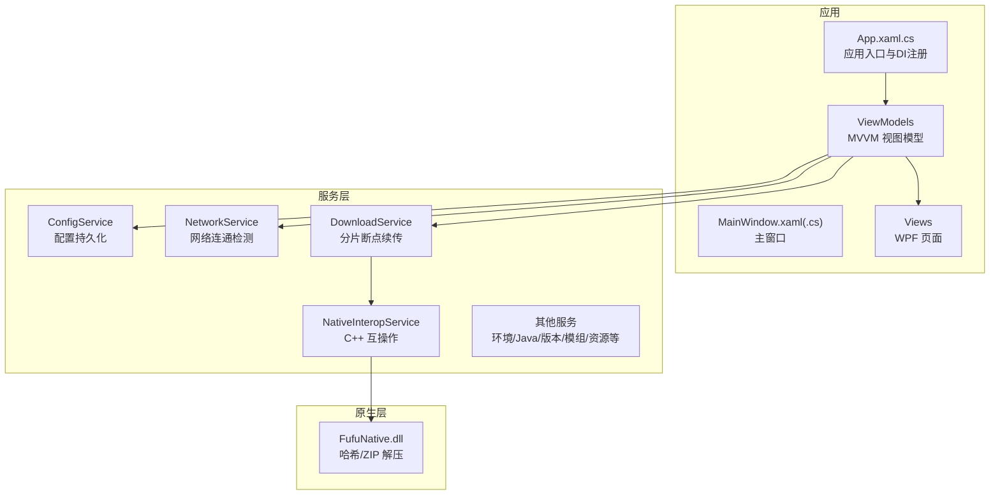
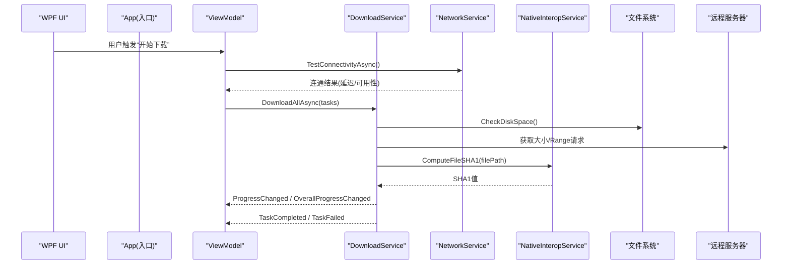
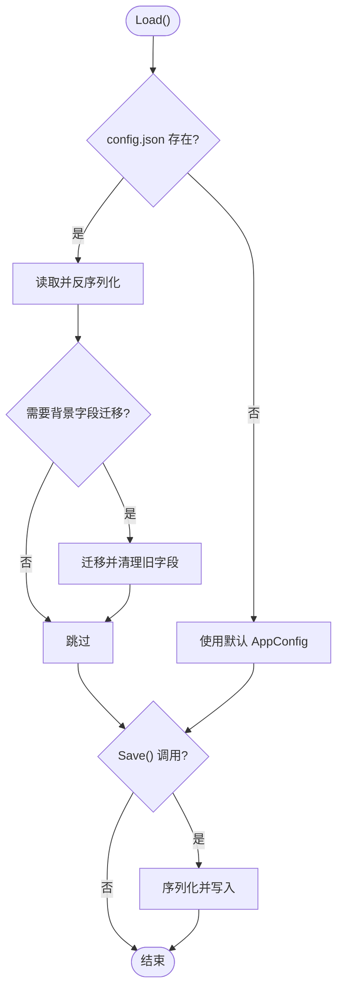
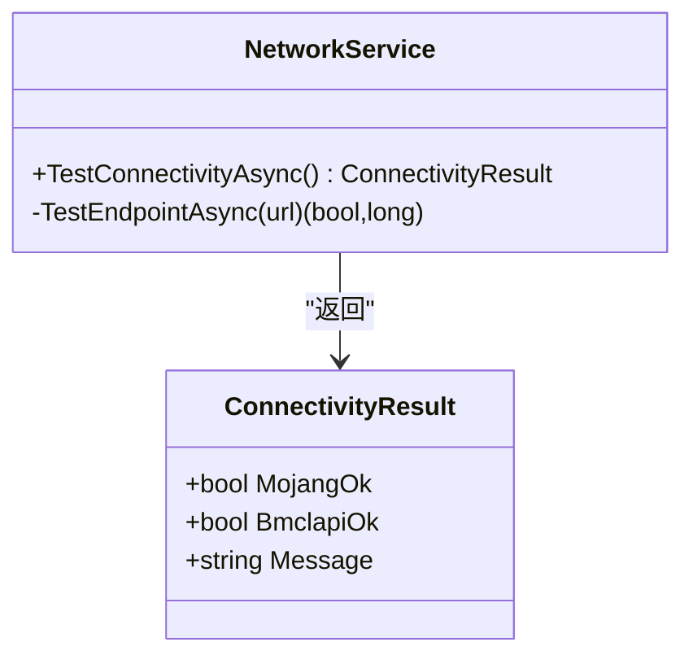
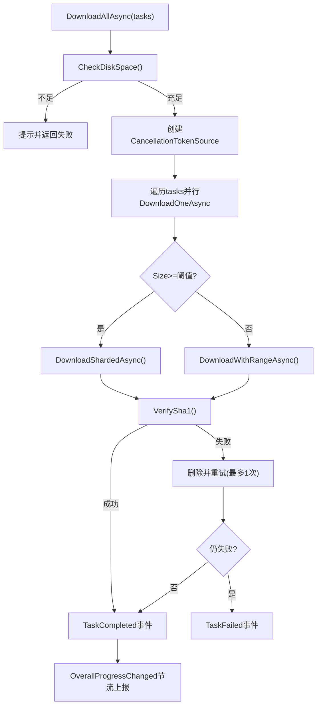
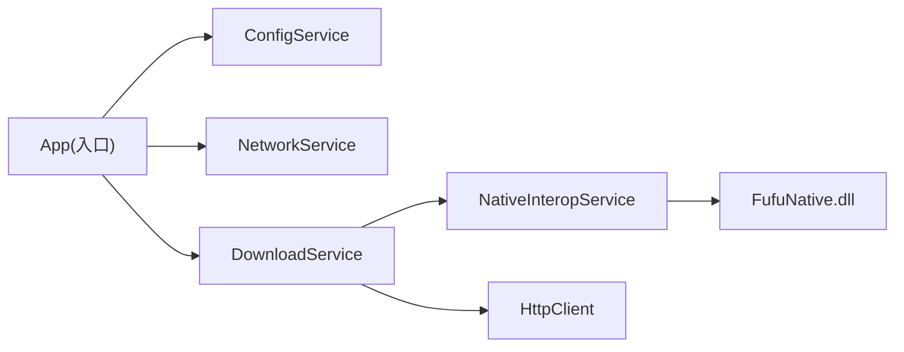

# 测试和质量保证

<cite>
**本文引用的文件**   
- [README.md](file://README.md)
- [FufuLauncher.csproj](file://src/FufuLauncher/FufuLauncher.csproj)
- [bootstrap.csproj](file://bootstrap/bootstrap.csproj)
- [App.xaml.cs](file://src/FufuLauncher/App.xaml.cs)
- [ConfigService.cs](file://src/FufuLauncher/Services/ConfigService.cs)
- [DownloadService.cs](file://src/FufuLauncher/Services/DownloadService.cs)
- [NetworkService.cs](file://src/FufuLauncher/Services/NetworkService.cs)
</cite>

## 目录
1. [简介](#简介)
2. [项目结构](#项目结构)
3. [核心组件](#核心组件)
4. [架构总览](#架构总览)
5. [详细组件分析](#详细组件分析)
6. [依赖关系分析](#依赖关系分析)
7. [性能考量](#性能考量)
8. [故障排查指南](#故障排查指南)
9. [结论](#结论)
10. [附录](#附录)

## 简介
本文件为“可爱的芙芙启动器”的测试与质量保证（QA）专项文档。目标是为单元测试、集成测试、UI 自动化测试、性能基准、代码质量检查与持续集成提供可执行的策略与落地方案，确保下载引擎、网络连通检测、配置持久化等关键路径稳定可靠，并满足 WPF 应用的用户体验要求。

## 项目结构
- 解决方案包含 C# WPF 主程序、C++ 原生 DLL、引导程序与打包工具。
- 主程序使用 .NET 8 + WPF，通过 DI 容器注册服务与视图模型。
- 关键服务包括配置、网络、下载、环境检查、Java 运行时管理、哈希校验、模组与资源管理等。
- 构建产物将 C++ 原生 DLL 复制到输出目录，供托管层调用。

图表来源 
- [App.xaml.cs:1-246](file://src/FufuLauncher/App.xaml.cs#L1-L246)
- [FufuLauncher.csproj:1-49](file://src/FufuLauncher/FufuLauncher.csproj#L1-L49)

章节来源
- [README.md:1-87](file://README.md#L1-L87)
- [FufuLauncher.csproj:1-49](file://src/FufuLauncher/FufuLauncher.csproj#L1-L49)

## 核心组件
- 应用入口与生命周期：负责 DI 容器初始化、全局异常捕获、日志缓冲写入、内存监控与主题释放。
- 配置服务：JSON 序列化/反序列化、旧版配置迁移、保存失败不抛错。
- 网络服务：双源连通性检测（Mojang/BMCLAPI），返回延迟与状态。
- 下载服务：多线程分片断点续传、SHA1 校验、指数退避重试、全局/单任务进度事件、磁盘空间预检。

章节来源
- [App.xaml.cs:82-217](file://src/FufuLauncher/App.xaml.cs#L82-L217)
- [ConfigService.cs:81-148](file://src/FufuLauncher/Services/ConfigService.cs#L81-L148)
- [NetworkService.cs:18-95](file://src/FufuLauncher/Services/NetworkService.cs#L18-L95)
- [DownloadService.cs:56-114](file://src/FufuLauncher/Services/DownloadService.cs#L56-L114)

## 架构总览
下图展示从 UI 到服务层再到原生层的调用链，以及下载流程中的关键分支与事件。

图表来源 
- [App.xaml.cs:138-217](file://src/FufuLauncher/App.xaml.cs#L138-L217)
- [NetworkService.cs:34-76](file://src/FufuLauncher/Services/NetworkService.cs#L34-L76)
- [DownloadService.cs:222-261](file://src/FufuLauncher/Services/DownloadService.cs#L222-L261)

## 详细组件分析

### 配置服务（ConfigService）
- 职责：加载/保存 AppConfig；兼容旧字段迁移；忽略空字段序列化。
- 复杂度：I/O 为主，序列化开销低；迁移逻辑 O(1)。
- 错误处理：读取/写入异常均被吞掉，避免崩溃。
- 测试要点：
  - 正常读写、缺失文件默认值、非法 JSON 回退默认。
  - 旧字段迁移路径覆盖（BackgroundPath/Type -> BaseImagePath/OverlayType）。
  - 并发写保护（多 Writer 场景下最终一致性）。

图表来源 
- [ConfigService.cs:94-146](file://src/FufuLauncher/Services/ConfigService.cs#L94-L146)

章节来源
- [ConfigService.cs:13-79](file://src/FufuLauncher/Services/ConfigService.cs#L13-L79)
- [ConfigService.cs:81-148](file://src/FufuLauncher/Services/ConfigService.cs#L81-L148)

### 网络服务（NetworkService）
- 职责：探测 Mojang 与 BMCLAPI 元数据端点的可达性与延迟。
- 复杂度：两次 HTTP GET，超时短，适合快速自检。
- 错误处理：异常捕获后标记不可用，不影响整体流程。
- 测试要点：
  - 双源均可用、仅其一可用、均不可用三种场景。
  - 超时与 DNS 解析失败的边界情况。

图表来源 
- [NetworkService.cs:18-95](file://src/FufuLauncher/Services/NetworkService.cs#L18-L95)

章节来源
- [NetworkService.cs:18-95](file://src/FufuLauncher/Services/NetworkService.cs#L18-L95)

### 下载服务（DownloadService）
- 职责：多线程分片断点续传、SHA1 校验、指数退避重试、全局/单任务进度事件、磁盘空间预检、URL 源降级。
- 复杂度：I/O 密集；分片并发受 SemaphoreSlim 控制；节流更新 UI 进度。
- 错误处理：网络异常、校验失败、删除临时文件失败均有兜底；失败次数上限控制。
- 测试要点：
  - 小文件 Range 续传与大文件分片下载两条路径。
  - 校验失败重下、最大重试次数、取消/暂停语义。
  - 全局进度节流与最终完成触发。
  - 磁盘空间不足提示与拒绝下载。

图表来源 
- [DownloadService.cs:222-261](file://src/FufuLauncher/Services/DownloadService.cs#L222-L261)
- [DownloadService.cs:295-366](file://src/FufuLauncher/Services/DownloadService.cs#L295-L366)
- [DownloadService.cs:368-451](file://src/FufuLauncher/Services/DownloadService.cs#L368-L451)
- [DownloadService.cs:453-547](file://src/FufuLauncher/Services/DownloadService.cs#L453-L547)
- [DownloadService.cs:583-590](file://src/FufuLauncher/Services/DownloadService.cs#L583-L590)

章节来源
- [DownloadService.cs:28-114](file://src/FufuLauncher/Services/DownloadService.cs#L28-L114)
- [DownloadService.cs:222-261](file://src/FufuLauncher/Services/DownloadService.cs#L222-L261)
- [DownloadService.cs:295-366](file://src/FufuLauncher/Services/DownloadService.cs#L295-L366)
- [DownloadService.cs:368-451](file://src/FufuLauncher/Services/DownloadService.cs#L368-L451)
- [DownloadService.cs:453-547](file://src/FufuLauncher/Services/DownloadService.cs#L453-L547)
- [DownloadService.cs:568-590](file://src/FufuLauncher/Services/DownloadService.cs#L568-L590)

### 应用入口（App.xaml.cs）
- 职责：DI 容器注册、全局异常捕获、日志缓冲写入、内存监控、主题释放。
- 关键点：所有服务以单例注册，页面以瞬态注册；主窗口由 DI 创建。
- 测试要点：
  - 服务注册完整性（无循环依赖）。
  - 异常捕获是否记录日志并弹窗。
  - 退出时资源释放顺序正确。

章节来源
- [App.xaml.cs:138-217](file://src/FufuLauncher/App.xaml.cs#L138-L217)
- [App.xaml.cs:219-245](file://src/FufuLauncher/App.xaml.cs#L219-L245)

## 依赖关系分析
- 服务间耦合：
  - DownloadService 依赖 ConfigService（下载源选择）、NativeInteropService（SHA1 计算）。
  - App 集中注册所有服务，降低模块间直接耦合。
- 外部依赖：
  - HttpClient 访问远端元数据与资源。
  - C++ 原生 DLL 提供高性能哈希与解压能力。
- 潜在风险：
  - 共享静态 HttpClient 需合理设置超时与连接限制。
  - 文件 I/O 与网络 I/O 的并发需通过信号量与令牌协调。

图表来源 
- [App.xaml.cs:138-217](file://src/FufuLauncher/App.xaml.cs#L138-L217)
- [DownloadService.cs:56-114](file://src/FufuLauncher/Services/DownloadService.cs#L56-L114)

章节来源
- [FufuLauncher.csproj:34-42](file://src/FufuLauncher/FufuLauncher.csproj#L34-L42)
- [App.xaml.cs:138-217](file://src/FufuLauncher/App.xaml.cs#L138-L217)

## 性能考量
- 下载性能：
  - 大文件自动分片（≥8MB）提升吞吐；每类任务独立信号量避免相互阻塞。
  - 全局进度节流（150ms）减少 UI 刷新压力。
- 内存与启动：
  - 内存监控服务定时刷新，便于可视化展示。
  - 日志批量写入（队列+定时器）降低高频 IO 对 UI 线程影响。
- 优化建议：
  - 根据网络状况动态调整分片数与并发度。
  - 对热点配置项采用内存缓存，减少频繁磁盘读写。
  - 对长耗时任务引入背压与限流，避免瞬时峰值。

[本节为通用指导，无需特定文件引用]

## 故障排查指南
- 常见错误定位：
  - 下载失败：查看 app.log 中“下载”相关日志，关注重试次数与错误信息。
  - 校验失败：确认 SHA1 期望值与服务端一致，必要时强制重下。
  - 网络不通：使用 NetworkService 测试结果判断官方源或镜像源问题。
- 调试技巧：
  - 在 App 的全局异常处理器中捕获未观察异常，结合日志定位堆栈。
  - 使用 Visual Studio 附加进程调试 WPF 应用，设置断点于下载回调。
- 诊断工具：
  - 磁盘空间检测失败时，优先检查目标盘剩余空间与权限。
  - 使用 Wireshark/Fiddler 抓包验证 HTTP 头与 Range 行为。

章节来源
- [App.xaml.cs:219-245](file://src/FufuLauncher/App.xaml.cs#L219-L245)
- [DownloadService.cs:345-366](file://src/FufuLauncher/Services/DownloadService.cs#L345-L366)
- [NetworkService.cs:34-76](file://src/FufuLauncher/Services/NetworkService.cs#L34-L76)

## 结论
本 QA 文档围绕启动器的核心服务（配置、网络、下载）给出了测试策略、架构理解与性能优化方向。建议在 CI 中固化单元测试与集成测试门禁，配合 UI 自动化与性能基线，持续提升交付质量。

[本节为总结，无需特定文件引用]

## 附录

### 单元测试策略
- 服务层测试：
  - ConfigService：读写、迁移、异常回退。
  - NetworkService：双源连通性、超时与异常。
  - DownloadService：小文件续传、大文件分片、校验失败重下、取消/暂停、进度事件。
- 模拟对象使用：
  - 使用 IHttpClientFactory 或替换 HttpClient 实现进行 Mock。
  - 使用内存文件系统替代真实磁盘 I/O。
  - 对 NativeInteropService 提供 Stub 返回固定 SHA1。
- 覆盖率要求：
  - 核心服务行覆盖率 ≥ 80%，分支覆盖率 ≥ 70%。
  - 下载与校验路径必须全量覆盖。

### 集成测试实施
- 外部依赖模拟：
  - 本地 HTTP 服务器模拟 Mojang/BMCLAPI 响应，支持 Range 与 HEAD。
  - 注入 Mock 的 NativeInteropService 返回预期哈希。
- 端到端测试：
  - 启动 App，执行一次完整下载流程，验证文件完整性与 UI 进度。
- 性能基准测试：
  - 使用 BenchmarkDotNet 对下载吞吐、SHA1 计算、配置序列化进行基准。
  - 定义基线阈值，CI 中对比回归。

### 代码质量检查
- 静态分析：
  - Roslyn Analyzers + CodeAnalysis 规则集，禁止危险 API 使用。
- 风格检查：
  - EditorConfig + dotnet format，统一缩进、命名与换行。
- 依赖漏洞扫描：
  - dotnet audit 定期扫描 NuGet 依赖漏洞，阻断高危。

### UI 测试（WPF）
- 自动化框架：
  - WinAppDriver + Appium 或 FlaUI 驱动 WPF 控件。
- 交互模拟：
  - 模拟点击“开始下载”、切换下载源、暂停/取消等操作。
  - 断言 UI 元素文本、进度条百分比与弹窗出现。
- 稳定性：
  - 增加显式等待与重试机制，避免偶发失败。

### 持续集成与质量门禁
- 流水线阶段：
  - 构建 → 单元测试 → 集成测试 → UI 测试 → 性能基准 → 代码质量检查 → 发布制品。
- 门禁规则：
  - 测试通过率 100%。
  - 覆盖率不低于阈值。
  - 性能回归不超过阈值。
  - 安全扫描无高危漏洞。

章节来源
- [FufuLauncher.csproj:1-49](file://src/FufuLauncher/FufuLauncher.csproj#L1-L49)
- [bootstrap.csproj:1-18](file://bootstrap/bootstrap.csproj#L1-L18)
- [App.xaml.cs:138-217](file://src/FufuLauncher/App.xaml.cs#L138-L217)
- [DownloadService.cs:222-261](file://src/FufuLauncher/Services/DownloadService.cs#L222-L261)
- [NetworkService.cs:34-76](file://src/FufuLauncher/Services/NetworkService.cs#L34-L76)
- [ConfigService.cs:94-146](file://src/FufuLauncher/Services/ConfigService.cs#L94-L146)