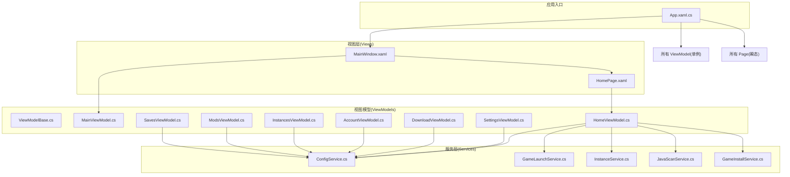
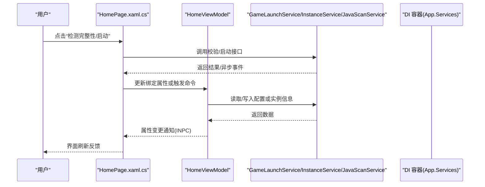
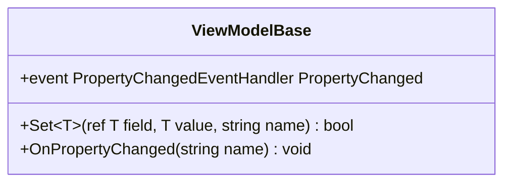
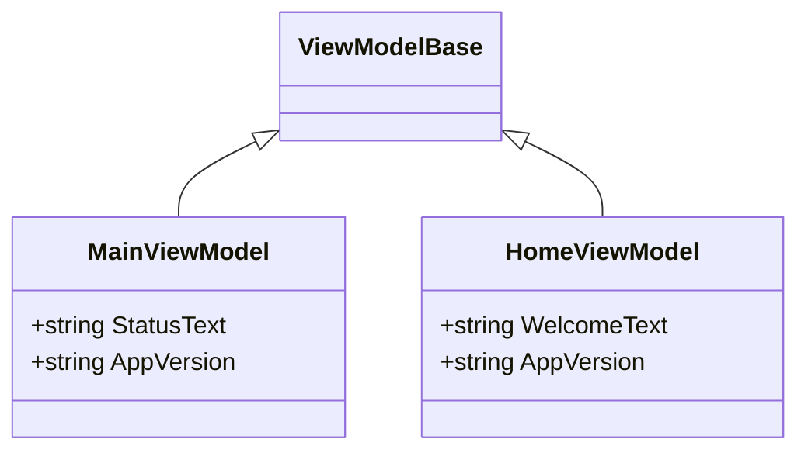
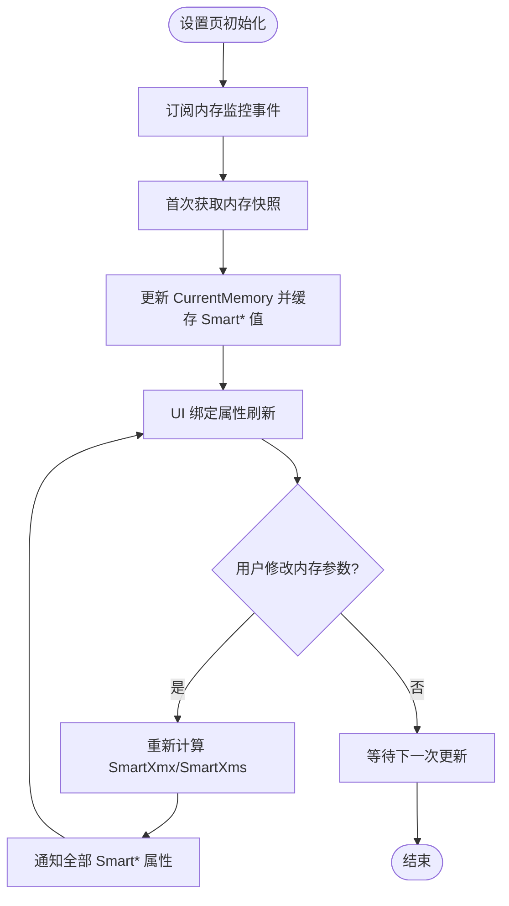
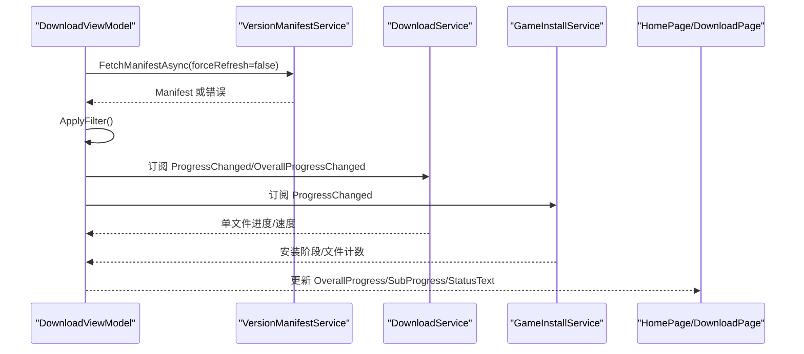
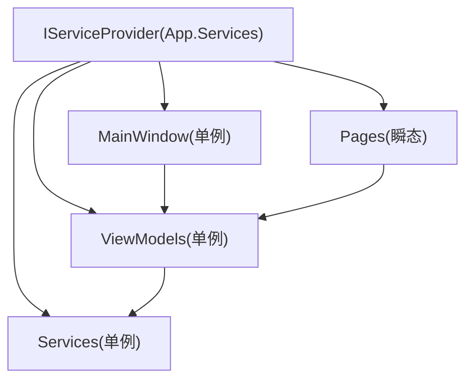
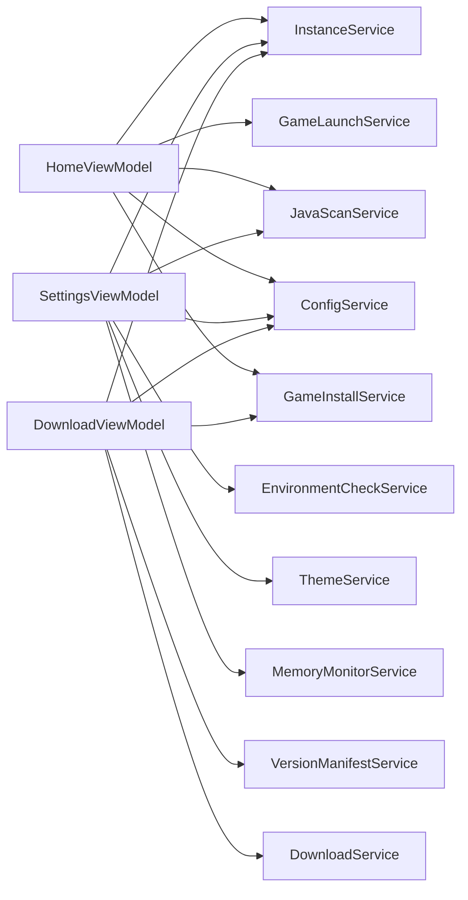

# MVVM 模式实现

<cite>
**本文引用的文件**   
- [App.xaml.cs](file://src/FufuLauncher/App.xaml.cs)
- [MainWindow.xaml.cs](file://src/FufuLauncher/MainWindow.xaml.cs)
- [MainWindow.xaml](file://src/FufuLauncher/MainWindow.xaml)
- [HomePage.xaml.cs](file://src/FufuLauncher/Views/HomePage.xaml.cs)
- [HomePage.xaml](file://src/FufuLauncher/Views/HomePage.xaml)
- [ViewModelBase.cs](file://src/FufuLauncher/ViewModels/ViewModelBase.cs)
- [MainViewModel.cs](file://src/FufuLauncher/ViewModels/MainViewModel.cs)
- [HomeViewModel.cs](file://src/FufuLauncher/ViewModels/HomeViewModel.cs)
- [SettingsViewModel.cs](file://src/FufuLauncher/ViewModels/SettingsViewModel.cs)
- [DownloadViewModel.cs](file://src/FufuLauncher/ViewModels/DownloadViewModel.cs)
- [AccountViewModel.cs](file://src/FufuLauncher/ViewModels/AccountViewModel.cs)
- [InstancesViewModel.cs](file://src/FufuLauncher/ViewModels/InstancesViewModel.cs)
- [ModsViewModel.cs](file://src/FufuLauncher/ViewModels/ModsViewModel.cs)
- [SavesViewModel.cs](file://src/FufuLauncher/ViewModels/SavesViewModel.cs)
- [ConfigService.cs](file://src/FufuLauncher/Services/ConfigService.cs)
</cite>

## 目录
1. [简介](#简介)
2. [项目结构](#项目结构)
3. [核心组件](#核心组件)
4. [架构总览](#架构总览)
5. [详细组件分析](#详细组件分析)
6. [依赖关系分析](#依赖关系分析)
7. [性能考量](#性能考量)
8. [故障排查指南](#故障排查指南)
9. [结论](#结论)
10. [附录：新增 ViewModel 与页面的实践步骤](#附录新增-viewmodel-与页面的实践步骤)

## 简介
本文件为“可爱的芙芙启动器”的 MVVM 模式实现提供系统化文档。重点阐述 View-ViewModel-Model 三层职责分离、ViewModelBase 基类设计（属性变更通知、命令绑定、依赖注入集成）、各 ViewModel 的数据绑定与业务封装、WPF 数据绑定使用方式（双向绑定、命令绑定、事件处理）、依赖注入容器在服务注册与生命周期管理中的作用，以及状态管理模式与数据流方向。同时给出最佳实践与常见问题解决方案，帮助读者快速理解并扩展该项目的 MVVM 架构。

## 项目结构
本项目采用典型的 WPF + MVVM 分层组织：
- Views：XAML 页面与交互逻辑（如 HomePage.xaml.cs）
- ViewModels：UI 状态与交互逻辑（如 HomeViewModel、SettingsViewModel）
- Services：领域服务与基础设施（如 ConfigService、GameLaunchService）
- App 入口：负责 DI 容器配置、应用初始化、异常捕获与资源释放
- MainWindow：承载导航与主题背景，通过 DI 获取页面实例进行切换

图表来源
- [App.xaml.cs:138-217](file://src/FufuLauncher/App.xaml.cs#L138-L217)
- [MainWindow.xaml.cs:128-186](file://src/FufuLauncher/MainWindow.xaml.cs#L128-L186)
- [HomePage.xaml.cs:27-41](file://src/FufuLauncher/Views/HomePage.xaml.cs#L27-L41)

章节来源
- [App.xaml.cs:138-217](file://src/FufuLauncher/App.xaml.cs#L138-L217)
- [MainWindow.xaml.cs:128-186](file://src/FufuLauncher/MainWindow.xaml.cs#L128-L186)

## 核心组件
- ViewModelBase：提供 INotifyPropertyChanged 基础能力与 Set<T>() 便捷方法，统一属性变更通知机制。
- MainViewModel：主窗口状态文本与应用版本信息展示。
- HomeViewModel：主页欢迎语与版本信息，配合 HomePage 完成实例选择与启动流程。
- SettingsViewModel：设置页复杂状态（内存监控、JVM 参数、主题等），实现 IDisposable 以规范退订事件。
- DownloadViewModel：版本清单加载、分类过滤、下载与安装进度聚合。
- AccountViewModel：账号列表与当前账号管理。
- InstancesViewModel：实例列表与选中项管理。
- ModsViewModel：模组列表、搜索过滤、启用/禁用、导入与下载。
- SavesViewModel：存档列表加载。
- ConfigService：配置持久化（JSON），包含大量配置项与迁移逻辑。

章节来源
- [ViewModelBase.cs:7-21](file://src/FufuLauncher/ViewModels/ViewModelBase.cs#L7-L21)
- [MainViewModel.cs:8-24](file://src/FufuLauncher/ViewModels/MainViewModel.cs#L8-L24)
- [HomeViewModel.cs:8-24](file://src/FufuLauncher/ViewModels/HomeViewModel.cs#L8-L24)
- [SettingsViewModel.cs:20-251](file://src/FufuLauncher/ViewModels/SettingsViewModel.cs#L20-L251)
- [DownloadViewModel.cs:10-305](file://src/FufuLauncher/ViewModels/DownloadViewModel.cs#L10-L305)
- [AccountViewModel.cs:7-34](file://src/FufuLauncher/ViewModels/AccountViewModel.cs#L7-L34)
- [InstancesViewModel.cs:7-32](file://src/FufuLauncher/ViewModels/InstancesViewModel.cs#L7-L32)
- [ModsViewModel.cs:11-188](file://src/FufuLauncher/ViewModels/ModsViewModel.cs#L11-L188)
- [SavesViewModel.cs:7-22](file://src/FufuLauncher/ViewModels/SavesViewModel.cs#L7-L22)
- [ConfigService.cs:81-147](file://src/FufuLauncher/Services/ConfigService.cs#L81-L147)

## 架构总览
MVVM 在该项目中的职责划分如下：
- View（XAML + Code-behind）：仅负责 UI 呈现与用户交互事件转发，不持有业务逻辑。
- ViewModel：暴露可绑定的属性与命令，封装 UI 状态与交互流程，调用 Service 完成业务。
- Model/Service：领域服务与基础设施，提供数据访问、网络、文件系统、进程管理等能力。
- DI 容器：集中注册服务与 ViewModel，按生命周期（单例/瞬态）创建与销毁对象。

图表来源
- [HomePage.xaml.cs:277-303](file://src/FufuLauncher/Views/HomePage.xaml.cs#L277-L303)
- [App.xaml.cs:138-217](file://src/FufuLauncher/App.xaml.cs#L138-L217)

章节来源
- [App.xaml.cs:138-217](file://src/FufuLauncher/App.xaml.cs#L138-L217)
- [MainWindow.xaml.cs:128-186](file://src/FufuLauncher/MainWindow.xaml.cs#L128-L186)

## 详细组件分析

### ViewModelBase 基类设计
- 实现 INotifyPropertyChanged，提供 OnPropertyChanged 与 Set<T>() 简化属性赋值与通知。
- 支持 CallerMemberName，减少字符串硬编码，提高可维护性。
- 未直接实现命令绑定（ICommand），但可通过 WPF 的 CommandBinding 或第三方库（如 CommunityToolkit.Mvvm）在 ViewModel 中定义命令；当前项目更多采用事件驱动+属性绑定模式。

图表来源
- [ViewModelBase.cs:7-21](file://src/FufuLauncher/ViewModels/ViewModelBase.cs#L7-L21)

章节来源
- [ViewModelBase.cs:7-21](file://src/FufuLauncher/ViewModels/ViewModelBase.cs#L7-L21)

### MainViewModel 与 HomeViewModel
- MainViewModel：提供 StatusText 与 AppVersion，用于主窗口状态栏与标题显示。
- HomeViewModel：提供 WelcomeText 与 AppVersion，供主页展示欢迎信息与版本号。
- 两者均继承 ViewModelBase，使用 Set<T>() 实现属性变更通知。

图表来源
- [MainViewModel.cs:8-24](file://src/FufuLauncher/ViewModels/MainViewModel.cs#L8-L24)
- [HomeViewModel.cs:8-24](file://src/FufuLauncher/ViewModels/HomeViewModel.cs#L8-L24)

章节来源
- [MainViewModel.cs:8-24](file://src/FufuLauncher/ViewModels/MainViewModel.cs#L8-L24)
- [HomeViewModel.cs:8-24](file://src/FufuLauncher/ViewModels/HomeViewModel.cs#L8-L24)

### SettingsViewModel（复杂状态与内存监控）
- 订阅 MemoryMonitorService.Updated，在 UI 线程更新 CurrentMemory，并缓存 SmartXmx/SmartXms 计算结果，避免频繁 P/Invoke。
- 暴露 AutoMemoryMode、MultiCoreGcOptimize、HighPriorityProcess、CpuAffinityEnabled 等配置映射属性，直接读写 ConfigService.Config。
- 提供 ApplyToInstance、ApplySmartMemoryToSelected 等方法，将 UI 参数应用到实例并持久化。
- 实现 IDisposable，确保事件退订，避免内存泄漏。

图表来源
- [SettingsViewModel.cs:172-251](file://src/FufuLauncher/ViewModels/SettingsViewModel.cs#L172-L251)

章节来源
- [SettingsViewModel.cs:20-251](file://src/FufuLauncher/ViewModels/SettingsViewModel.cs#L20-L251)

### DownloadViewModel（版本清单与下载进度）
- 订阅 GameInstallService.ProgressChanged、DownloadService.ProgressChanged/OverallProgressChanged/TaskCompleted/TaskFailed，聚合多源进度到 UI 属性。
- 提供 LoadVersionsAsync、RefreshVersionsAsync、ApplyFilter、DownloadAndInstallAsync 等方法，完成版本加载、过滤与下载安装流程。
- 使用 Dispatcher.BeginInvoke 确保 UI 更新在 UI 线程执行。

图表来源
- [DownloadViewModel.cs:66-146](file://src/FufuLauncher/ViewModels/DownloadViewModel.cs#L66-L146)
- [DownloadViewModel.cs:157-193](file://src/FufuLauncher/ViewModels/DownloadViewModel.cs#L157-L193)

章节来源
- [DownloadViewModel.cs:10-305](file://src/FufuLauncher/ViewModels/DownloadViewModel.cs#L10-L305)

### AccountViewModel、InstancesViewModel、ModsViewModel、SavesViewModel
- AccountViewModel：维护 Accounts 集合与 CurrentAccount，提供 Refresh 同步数据。
- InstancesViewModel：维护 Instances 集合与 SelectedInstance，提供 LoadInstances。
- ModsViewModel：维护 Mods/FilteredMods，支持搜索过滤、启用/禁用、导入与下载，处理后台线程 UI 更新。
- SavesViewModel：维护 Saves 集合，提供 Load(instanceId)。

章节来源
- [AccountViewModel.cs:7-34](file://src/FufuLauncher/ViewModels/AccountViewModel.cs#L7-L34)
- [InstancesViewModel.cs:7-32](file://src/FufuLauncher/ViewModels/InstancesViewModel.cs#L7-L32)
- [ModsViewModel.cs:11-188](file://src/FufuLauncher/ViewModels/ModsViewModel.cs#L11-L188)
- [SavesViewModel.cs:7-22](file://src/FufuLauncher/ViewModels/SavesViewModel.cs#L7-L22)

### WPF 数据绑定使用方式
- 双向绑定：XAML 中通过 {Binding Property} 与控件属性（如 TextBox.Text、ComboBox.SelectedItem）建立双向绑定，ViewModel 属性变更通过 INPC 通知 UI。
- 命令绑定：当前项目主要采用事件驱动（Click、SelectionChanged）与属性绑定，未广泛使用 ICommand；可在 ViewModel 中定义命令并通过 x:Static 或行为绑定。
- 事件处理：Code-behind 中处理用户交互，调用 Service 或更新 ViewModel 属性，保持 UI 与业务解耦。

章节来源
- [HomePage.xaml:1-119](file://src/FufuLauncher/Views/HomePage.xaml#L1-L119)
- [HomePage.xaml.cs:27-41](file://src/FufuLauncher/Views/HomePage.xaml.cs#L27-L41)

### 依赖注入容器在 MVVM 中的作用
- App.xaml.cs 中 ConfigureServices 注册所有 Service、ViewModel、Page 与 MainWindow。
- Service 与 ViewModel 多为单例（Singleton），Page 为瞬态（Transient），由 DI 自动注入依赖。
- MainWindow 通过构造函数注入 MainViewModel、ThemeService、EnvironmentCheckService。
- NavigateToPage 从 DI 容器获取 Page 实例，确保 ViewModel 与 Service 正确注入。

图表来源
- [App.xaml.cs:138-217](file://src/FufuLauncher/App.xaml.cs#L138-L217)
- [MainWindow.xaml.cs:28-36](file://src/FufuLauncher/MainWindow.xaml.cs#L28-L36)
- [MainWindow.xaml.cs:128-186](file://src/FufuLauncher/MainWindow.xaml.cs#L128-L186)

章节来源
- [App.xaml.cs:138-217](file://src/FufuLauncher/App.xaml.cs#L138-L217)
- [MainWindow.xaml.cs:28-36](file://src/FufuLauncher/MainWindow.xaml.cs#L28-L36)
- [MainWindow.xaml.cs:128-186](file://src/FufuLauncher/MainWindow.xaml.cs#L128-L186)

## 依赖关系分析
- ViewModel 依赖 Service：HomeViewModel 依赖 InstanceService、GameLaunchService、JavaScanService、ConfigService、GameInstallService。
- SettingsViewModel 依赖多个 Service：ConfigService、EnvironmentCheckService、ThemeService、JavaScanService、InstanceService、MemoryMonitorService。
- DownloadViewModel 依赖 VersionManifestService、DownloadService、ConfigService、GameInstallService、InstanceService。
- 其他 ViewModel 依赖对应 Service（AccountService、ModManagerService、SaveManagerService 等）。

图表来源
- [HomePage.xaml.cs:27-41](file://src/FufuLauncher/Views/HomePage.xaml.cs#L27-L41)
- [SettingsViewModel.cs:172-194](file://src/FufuLauncher/ViewModels/SettingsViewModel.cs#L172-L194)
- [DownloadViewModel.cs:66-76](file://src/FufuLauncher/ViewModels/DownloadViewModel.cs#L66-L76)

章节来源
- [HomePage.xaml.cs:27-41](file://src/FufuLauncher/Views/HomePage.xaml.cs#L27-L41)
- [SettingsViewModel.cs:172-194](file://src/FufuLauncher/ViewModels/SettingsViewModel.cs#L172-L194)
- [DownloadViewModel.cs:66-76](file://src/FufuLauncher/ViewModels/DownloadViewModel.cs#L66-L76)

## 性能考量
- 日志批量写入：App.WriteAppLog 使用 ConcurrentQueue + Timer 批量落盘，避免高频 IO 阻塞 UI 线程。
- 内存监控缓存：SettingsViewModel 缓存 SmartXmx/SmartXms，避免每次 INPC 触发重复 P/Invoke。
- 页面切换动画：MainWindow 使用 Storyboard 组合淡入与上滑动画，提升用户体验。
- 事件订阅与释放：SettingsViewModel 实现 IDisposable，确保事件退订；MainWindow 关闭时释放背景资源。

章节来源
- [App.xaml.cs:40-67](file://src/FufuLauncher/App.xaml.cs#L40-L67)
- [SettingsViewModel.cs:44-73](file://src/FufuLauncher/ViewModels/SettingsViewModel.cs#L44-L73)
- [MainWindow.xaml.cs:156-186](file://src/FufuLauncher/MainWindow.xaml.cs#L156-L186)

## 故障排查指南
- 全局异常捕获：App 中注册 DispatcherUnhandledException、AppDomain.UnhandledException、TaskScheduler.UnobservedTaskException，统一记录日志并提示用户。
- 环境自检失败：MainWindow 加载时异步执行环境自检，失败时在状态栏显示错误信息。
- 下载/安装异常：DownloadViewModel 捕获异常并提示用户检查网络或切换下载源。
- 内存监控异常：SettingsViewModel 在首次获取内存快照时忽略异常，避免影响 UI 初始化。

章节来源
- [App.xaml.cs:219-244](file://src/FufuLauncher/App.xaml.cs#L219-L244)
- [MainWindow.xaml.cs:59-73](file://src/FufuLauncher/MainWindow.xaml.cs#L59-L73)
- [DownloadViewModel.cs:291-304](file://src/FufuLauncher/ViewModels/DownloadViewModel.cs#L291-L304)
- [SettingsViewModel.cs:189-194](file://src/FufuLauncher/ViewModels/SettingsViewModel.cs#L189-L194)

## 结论
本项目通过清晰的 MVVM 分层与 DI 容器管理，实现了高内聚、低耦合的架构。ViewModelBase 统一了属性变更通知，各 ViewModel 专注于 UI 状态与交互逻辑，Service 层封装领域能力。WPF 数据绑定与事件处理结合，保证了 UI 响应性与可维护性。通过合理的性能优化与异常处理，提升了用户体验与系统稳定性。

## 附录：新增 ViewModel 与页面的实践步骤
- 新建 ViewModel：继承 ViewModelBase，使用 Set<T>() 管理属性变更，通过构造函数注入所需 Service。
- 新建 Page：在 XAML 中定义 UI，在 Code-behind 中通过 DI 获取 ViewModel 并设置 DataContext。
- 注册 DI：在 App.xaml.cs 的 ConfigureServices 中注册新的 ViewModel（单例）与 Page（瞬态）。
- 导航：在 MainWindow 的 NavigateToPage 中添加新页面路由，确保 DI 能解析依赖。
- 数据绑定：在 XAML 中使用 {Binding Property} 绑定 ViewModel 属性，必要时使用 Converter 转换数据。
- 事件处理：在 Code-behind 中处理用户交互，调用 Service 或更新 ViewModel 属性，避免在 ViewModel 中直接操作 UI。

章节来源
- [App.xaml.cs:138-217](file://src/FufuLauncher/App.xaml.cs#L138-L217)
- [MainWindow.xaml.cs:128-186](file://src/FufuLauncher/MainWindow.xaml.cs#L128-L186)
- [HomePage.xaml.cs:27-41](file://src/FufuLauncher/Views/HomePage.xaml.cs#L27-L41)