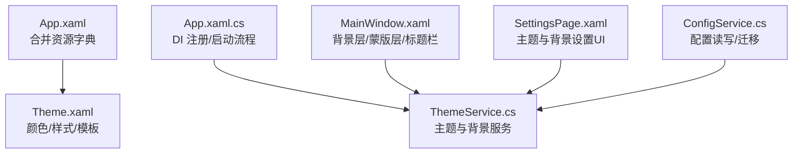
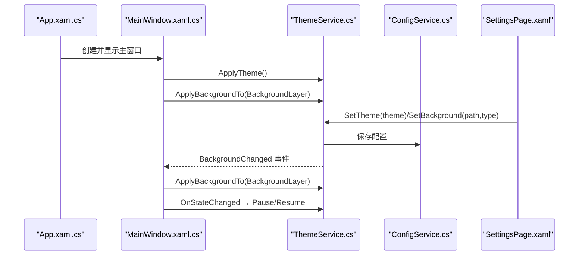
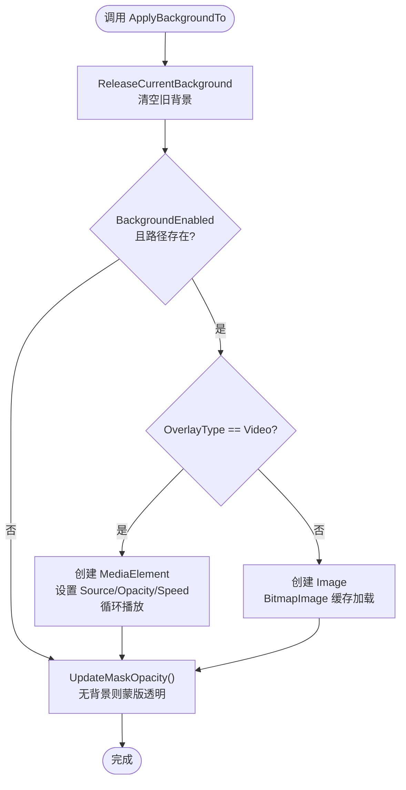
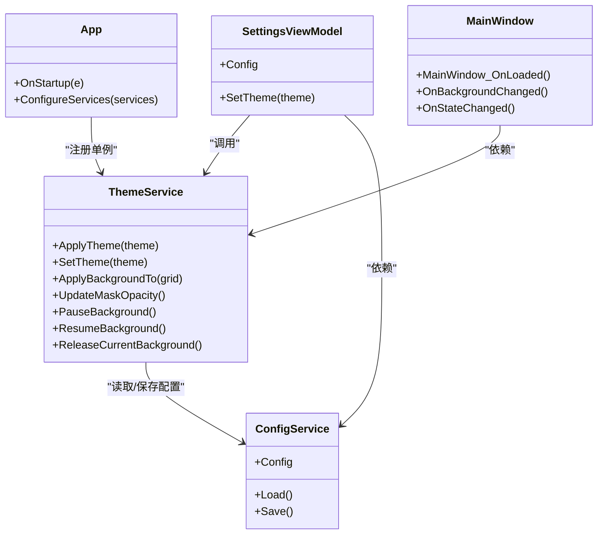

# 主题和样式系统

<cite>
**本文引用的文件**   
- [Theme.xaml](file://src/FufuLauncher/Themes/Theme.xaml)
- [ThemeService.cs](file://src/FufuLauncher/Services/ThemeService.cs)
- [App.xaml](file://src/FufuLauncher/App.xaml)
- [App.xaml.cs](file://src/FufuLauncher/App.xaml.cs)
- [MainWindow.xaml](file://src/FufuLauncher/MainWindow.xaml)
- [MainWindow.xaml.cs](file://src/FufuLauncher/MainWindow.xaml.cs)
- [ConfigService.cs](file://src/FufuLauncher/Services/ConfigService.cs)
- [SettingsPage.xaml](file://src/FufuLauncher/Views/SettingsPage.xaml)
- [SettingsViewModel.cs](file://src/FufuLauncher/ViewModels/SettingsViewModel.cs)
</cite>

## 目录
1. [简介](#简介)
2. [项目结构](#项目结构)
3. [核心组件](#核心组件)
4. [架构总览](#架构总览)
5. [详细组件分析](#详细组件分析)
6. [依赖关系分析](#依赖关系分析)
7. [性能考虑](#性能考虑)
8. [故障排查指南](#故障排查指南)
9. [结论](#结论)
10. [附录：主题定制与最佳实践](#附录主题定制与最佳实践)

## 简介
本文件为“可爱的芙芙”启动器的主题与样式系统提供完整技术文档。内容覆盖 Theme.xaml 资源字典的设计与结构、ThemeService 的主题切换机制与背景图片/视频管理、应用级样式继承与覆盖机制、自定义主题与样式资源的创建方法、主题配置文件格式与选项、响应式设计与多分辨率适配的实现方式，以及添加新主题、修改现有样式的操作指南与性能优化建议。同时说明主题系统与用户偏好设置的集成方式。

## 项目结构
主题与样式系统由以下关键文件组成：
- 资源字典：定义颜色、控件样式与模板
- 服务层：负责主题切换、背景加载与配置持久化
- 应用入口：合并资源字典并初始化 DI 容器
- 主窗口：承载背景层、蒙版层与标题栏按钮样式
- 设置页与视图模型：提供用户交互与参数绑定

图表来源
- [App.xaml:1-13](file://src/FufuLauncher/App.xaml#L1-L13)
- [Theme.xaml:1-602](file://src/FufuLauncher/Themes/Theme.xaml#L1-L602)
- [App.xaml.cs:138-156](file://src/FufuLauncher/App.xaml.cs#L138-L156)
- [ThemeService.cs:15-259](file://src/FufuLauncher/Services/ThemeService.cs#L15-L259)
- [MainWindow.xaml:1-139](file://src/FufuLauncher/MainWindow.xaml#L1-L139)
- [SettingsPage.xaml:1-350](file://src/FufuLauncher/Views/SettingsPage.xaml#L1-L350)
- [ConfigService.cs:13-148](file://src/FufuLauncher/Services/ConfigService.cs#L13-L148)

章节来源
- [App.xaml:1-13](file://src/FufuLauncher/App.xaml#L1-L13)
- [App.xaml.cs:138-156](file://src/FufuLauncher/App.xaml.cs#L138-L156)

## 核心组件
- Theme.xaml：集中定义深浅双主题色板、控件样式与模板，所有颜色通过 DynamicResource 引用，确保主题切换即时生效。
- ThemeService：封装主题切换、背景（图片/视频）加载与透明度控制、蒙版同步、事件通知与资源释放。
- App.xaml/App.xaml.cs：合并资源字典、注册服务、启动主窗口。
- MainWindow.xaml/.cs：承载背景层与蒙版层，处理窗口状态变化以暂停/恢复视频背景。
- ConfigService：持久化主题与背景相关配置，支持旧配置迁移。
- SettingsPage.xaml/SettingsViewModel.cs：提供主题与背景设置的用户界面与数据绑定。

章节来源
- [Theme.xaml:1-602](file://src/FufuLauncher/Themes/Theme.xaml#L1-L602)
- [ThemeService.cs:15-259](file://src/FufuLauncher/Services/ThemeService.cs#L15-L259)
- [App.xaml:1-13](file://src/FufuLauncher/App.xaml#L1-L13)
- [App.xaml.cs:138-156](file://src/FufuLauncher/App.xaml.cs#L138-L156)
- [MainWindow.xaml:1-139](file://src/FufuLauncher/MainWindow.xaml#L1-L139)
- [MainWindow.xaml.cs:38-97](file://src/FufuLauncher/MainWindow.xaml.cs#L38-L97)
- [ConfigService.cs:13-148](file://src/FufuLauncher/Services/ConfigService.cs#L13-L148)
- [SettingsPage.xaml:1-350](file://src/FufuLauncher/Views/SettingsPage.xaml#L1-L350)
- [SettingsViewModel.cs:172-194](file://src/FufuLauncher/ViewModels/SettingsViewModel.cs#L172-L194)

## 架构总览
主题与样式系统的运行时调用链如下：
- 应用启动时，App.xaml 合并 Theme.xaml 资源字典；App.xaml.cs 构建 DI 容器并注册 ThemeService。
- MainWindow 加载后，调用 ThemeService.ApplyTheme() 应用当前主题，ApplyBackgroundTo(BackgroundLayer) 加载背景。
- 用户在设置页更改主题或背景时，SettingsViewModel 调用 ThemeService.SetTheme()/SetBackground()，触发 BackgroundChanged 事件，MainWindow 重新应用背景。
- 窗口最小化/恢复时，MainWindow 调用 PauseBackground()/ResumeBackground() 降低资源占用。

图表来源
- [App.xaml.cs:138-156](file://src/FufuLauncher/App.xaml.cs#L138-L156)
- [MainWindow.xaml.cs:38-97](file://src/FufuLauncher/MainWindow.xaml.cs#L38-L97)
- [ThemeService.cs:30-117](file://src/FufuLauncher/Services/ThemeService.cs#L30-L117)
- [ConfigService.cs:94-148](file://src/FufuLauncher/Services/ConfigService.cs#L94-L148)
- [SettingsPage.xaml:26-70](file://src/FufuLauncher/Views/SettingsPage.xaml#L26-L70)

## 详细组件分析

### Theme.xaml：颜色资源、样式定义与模板配置
- 颜色资源：
  - 主色调：PrimaryColor/AccentColor/DangerColor/SuccessColor/WarningColor 及其 Brush 映射。
  - 浅色/深色两套色板：Light*/Dark* 系列 SolidColorBrush，用于覆盖当前主题 Key。
  - 当前主题资源 Key：AppBackground/AppForeground/CardBackground/CardBorder/InputBorder/OverlayTint/StatusTextBrush，默认使用深色值，ThemeService 在切换时动态覆盖。
- 文本样式：TitleText/SubTitleText/HintText/MonoText，统一使用 DynamicResource 获取前景色。
- 卡片样式：Card，半透明背景、圆角、阴影效果。
- 按钮样式：PrimaryButton/SecondaryButton/DangerButton，包含 Hover 动画与禁用态。
- 标题栏按钮：TitleBarButton/TitleBarCloseButton，关闭按钮 hover 红色。
- 导航 RadioButton：NavRadioButton，选中态指示条与高亮背景。
- 输入控件：FufuTextBox/FufuComboBox/FufuCheckBox/FufuRadioButton，统一边框、焦点态与禁用态。
- 滑块与进度条：FufuSlider/FufuProgressBar，主题色填充与圆角。
- 列表项与滚动条：VersionListItem/FufuScrollBar/FufuScrollViewer，悬浮与选中态高亮。
- 标签页：FufuTabItem，选中态下划线与背景。
- 弹窗容器：DialogRoot，半透明背景与阴影。

章节来源
- [Theme.xaml:12-52](file://src/FufuLauncher/Themes/Theme.xaml#L12-L52)
- [Theme.xaml:54-76](file://src/FufuLauncher/Themes/Theme.xaml#L54-L76)
- [Theme.xaml:79-91](file://src/FufuLauncher/Themes/Theme.xaml#L79-L91)
- [Theme.xaml:94-148](file://src/FufuLauncher/Themes/Theme.xaml#L94-L148)
- [Theme.xaml:151-177](file://src/FufuLauncher/Themes/Theme.xaml#L151-L177)
- [Theme.xaml:180-182](file://src/FufuLauncher/Themes/Theme.xaml#L180-L182)
- [Theme.xaml:185-228](file://src/FufuLauncher/Themes/Theme.xaml#L185-L228)
- [Theme.xaml:231-272](file://src/FufuLauncher/Themes/Theme.xaml#L231-L272)
- [Theme.xaml:275-311](file://src/FufuLauncher/Themes/Theme.xaml#L275-L311)
- [Theme.xaml:314-323](file://src/FufuLauncher/Themes/Theme.xaml#L314-L323)
- [Theme.xaml:326-363](file://src/FufuLauncher/Themes/Theme.xaml#L326-L363)
- [Theme.xaml:366-397](file://src/FufuLauncher/Themes/Theme.xaml#L366-L397)
- [Theme.xaml:400-444](file://src/FufuLauncher/Themes/Theme.xaml#L400-L444)
- [Theme.xaml:447-462](file://src/FufuLauncher/Themes/Theme.xaml#L447-L462)
- [Theme.xaml:465-489](file://src/FufuLauncher/Themes/Theme.xaml#L465-L489)
- [Theme.xaml:492-555](file://src/FufuLauncher/Themes/Theme.xaml#L492-L555)
- [Theme.xaml:558-586](file://src/FufuLauncher/Themes/Theme.xaml#L558-L586)
- [Theme.xaml:589-599](file://src/FufuLauncher/Themes/Theme.xaml#L589-L599)

### ThemeService：主题切换机制、动态样式加载与背景图片管理
- 主题切换：
  - ApplyTheme(string theme)：根据 Light/Dark 选择对应色板，覆盖当前主题 Key（AppBackground/AppForeground/CardBackground/CardBorder/InputBorder/OverlayTint/StatusTextBrush）。
  - SetTheme(theme)：校验主题值、写入配置、调用 ApplyTheme 并触发 BackgroundChanged 事件。
- 背景管理：
  - SetBackground/ClearBackground：更新 OverlayType/OverlayPath/BackgroundEnabled 并保存配置，触发事件。
  - ApplyBackgroundTo(Grid backgroundLayer)：清理旧背景，按配置加载图片或 MediaElement 视频，循环播放、设置透明度与速度，最后 UpdateMaskOpacity。
  - UpdateMaskOpacity：计算 OverlayMaskBorder 的 Opacity，保证前景可读性。
  - PauseBackground/ResumeBackground：窗口最小化/恢复时暂停/恢复视频播放。
  - ReleaseCurrentBackground：停止视频、释放 Image 与 Grid 子元素，避免句柄泄漏。
- 兼容性与迁移：
  - 自动将旧 BaseImagePath 迁移到 OverlayPath，并将类型设置为 Image（非视频）。
  - 兼容旧调用名 SetOverlay/ClearOverlay。

图表来源
- [ThemeService.cs:119-185](file://src/FufuLauncher/Services/ThemeService.cs#L119-L185)
- [ThemeService.cs:190-214](file://src/FufuLauncher/Services/ThemeService.cs#L190-L214)
- [ThemeService.cs:229-239](file://src/FufuLauncher/Services/ThemeService.cs#L229-L239)

章节来源
- [ThemeService.cs:30-62](file://src/FufuLauncher/Services/ThemeService.cs#L30-L62)
- [ThemeService.cs:64-117](file://src/FufuLauncher/Services/ThemeService.cs#L64-L117)
- [ThemeService.cs:119-185](file://src/FufuLauncher/Services/ThemeService.cs#L119-L185)
- [ThemeService.cs:190-214](file://src/FufuLauncher/Services/ThemeService.cs#L190-L214)
- [ThemeService.cs:229-259](file://src/FufuLauncher/Services/ThemeService.cs#L229-L259)

### 应用级样式继承与覆盖机制
- 资源合并：App.xaml 中通过 MergedDictionaries 引入 Theme.xaml，使全局可用。
- 动态覆盖：ThemeService.ApplyTheme 直接替换 Application.Current.Resources 中的 Key，实现即时切换。
- 隐式样式：Theme.xaml 对 TextBox/ComboBox/CheckBox/RadioButton/Slider/ProgressBar/ListViewItem/ScrollBar/ScrollViewer/TabItem 定义了 TargetType 隐式样式，未显式指定 Style 的控件自动继承。
- 基于基类扩展：SecondaryButton/DangerButton 基于 PrimaryButton；其他控件样式也采用 BasedOn 模式，便于统一维护。

章节来源
- [App.xaml:5-12](file://src/FufuLauncher/App.xaml#L5-L12)
- [Theme.xaml:311-323](file://src/FufuLauncher/Themes/Theme.xaml#L311-L323)
- [Theme.xaml:363-397](file://src/FufuLauncher/Themes/Theme.xaml#L363-L397)
- [Theme.xaml:444-462](file://src/FufuLauncher/Themes/Theme.xaml#L444-L462)
- [Theme.xaml:489-489](file://src/FufuLauncher/Themes/Theme.xaml#L489-L489)
- [Theme.xaml:534-555](file://src/FufuLauncher/Themes/Theme.xaml#L534-L555)
- [Theme.xaml:586-586](file://src/FufuLauncher/Themes/Theme.xaml#L586-L586)

### 主窗口与背景层、蒙版层
- MainWindow.xaml 定义三层结构：
  - BackgroundLayer：承载图片或视频，使用 OpacityMask 裁剪圆角。
  - OverlayMaskBorder：半透明蒙版，增强前景可读性，透明度由 ThemeService.UpdateMaskOpacity 动态控制。
  - 主内容层：标题栏、导航栏、Frame 内容区、状态栏。
- MainWindow.xaml.cs 在 Loaded 时应用主题与背景，订阅 BackgroundChanged 事件，并在 OnStateChanged 中暂停/恢复视频播放。

章节来源
- [MainWindow.xaml:22-43](file://src/FufuLauncher/MainWindow.xaml#L22-L43)
- [MainWindow.xaml.cs:38-97](file://src/FufuLauncher/MainWindow.xaml.cs#L38-L97)

### 设置页与用户偏好集成
- SettingsPage.xaml 提供主题与背景设置 UI：
  - 下载源选择（BMCLAPI/Mojang）
  - 背景类型（None/Image/Video）、文件选择、透明度滑块
  - 视频选项（静音、播放速度）
  - JVM 内存与多核优化参数、游戏分辨率等
- SettingsViewModel.cs 持有 ConfigService 与 ThemeService，提供 SetTheme 方法与内存监控相关属性。

章节来源
- [SettingsPage.xaml:26-70](file://src/FufuLauncher/Views/SettingsPage.xaml#L26-L70)
- [SettingsViewModel.cs:172-194](file://src/FufuLauncher/ViewModels/SettingsViewModel.cs#L172-L194)

## 依赖关系分析
- App.xaml.cs 通过 ServiceCollection 注册 ThemeService 单例，供 MainWindow 与 ViewModel 注入。
- MainWindow 依赖 ThemeService 进行主题与背景管理。
- SettingsViewModel 依赖 ConfigService 与 ThemeService 实现设置持久化与主题切换。
- ThemeService 依赖 ConfigService 读取/保存配置。

图表来源
- [App.xaml.cs:170-217](file://src/FufuLauncher/App.xaml.cs#L170-L217)
- [MainWindow.xaml.cs:28-36](file://src/FufuLauncher/MainWindow.xaml.cs#L28-L36)
- [ThemeService.cs:15-28](file://src/FufuLauncher/Services/ThemeService.cs#L15-L28)
- [ConfigService.cs:81-92](file://src/FufuLauncher/Services/ConfigService.cs#L81-L92)
- [SettingsViewModel.cs:172-194](file://src/FufuLauncher/ViewModels/SettingsViewModel.cs#L172-L194)

章节来源
- [App.xaml.cs:170-217](file://src/FufuLauncher/App.xaml.cs#L170-L217)
- [MainWindow.xaml.cs:28-36](file://src/FufuLauncher/MainWindow.xaml.cs#L28-L36)
- [ThemeService.cs:15-28](file://src/FufuLauncher/Services/ThemeService.cs#L15-L28)
- [ConfigService.cs:81-92](file://src/FufuLauncher/Services/ConfigService.cs#L81-L92)
- [SettingsViewModel.cs:172-194](file://src/FufuLauncher/ViewModels/SettingsViewModel.cs#L172-L194)

## 性能考虑
- 资源加载：
  - BitmapImage 使用 OnLoad 缓存策略，减少 I/O 阻塞。
  - MediaElement 循环播放，避免重复创建实例。
- 事件与线程：
  - BackgroundChanged 事件可能从后台线程触发，MainWindow 使用 Dispatcher.BeginInvoke 切回 UI 线程更新。
- 资源释放：
  - 窗口关闭时释放视频与图像资源，避免句柄泄漏。
  - 窗口最小化时暂停视频播放，降低 CPU/GPU 占用。
- 配置持久化：
  - 使用 JSON 序列化，忽略空字段，减少文件大小。
  - 异常捕获避免保存失败导致崩溃。

章节来源
- [ThemeService.cs:219-227](file://src/FufuLauncher/Services/ThemeService.cs#L219-L227)
- [ThemeService.cs:229-239](file://src/FufuLauncher/Services/ThemeService.cs#L229-L239)
- [MainWindow.xaml.cs:75-89](file://src/FufuLauncher/MainWindow.xaml.cs#L75-L89)
- [ConfigService.cs:83-87](file://src/FufuLauncher/Services/ConfigService.cs#L83-L87)

## 故障排查指南
- 主题切换无效：
  - 检查 ThemeService.ApplyTheme 是否被调用，确认 Application.Current.Resources 中 Key 是否存在。
  - 查看设置页是否正确调用 SetTheme 并保存配置。
- 背景不显示：
  - 确认 BackgroundEnabled 与 OverlayPath 有效，文件路径存在。
  - 检查 UpdateMaskOpacity 计算的蒙版透明度是否过高导致遮挡。
- 视频卡顿或占用高：
  - 窗口最小化时是否调用 PauseBackground。
  - 检查视频速度与静音设置。
- 配置迁移问题：
  - 查看 ConfigService.Load 中的迁移逻辑，确保旧配置正确转换到新结构。

章节来源
- [ThemeService.cs:30-62](file://src/FufuLauncher/Services/ThemeService.cs#L30-L62)
- [ThemeService.cs:190-214](file://src/FufuLauncher/Services/ThemeService.cs#L190-L214)
- [MainWindow.xaml.cs:75-89](file://src/FufuLauncher/MainWindow.xaml.cs#L75-L89)
- [ConfigService.cs:104-127](file://src/FufuLauncher/Services/ConfigService.cs#L104-L127)

## 结论
主题与样式系统通过 Theme.xaml 的资源字典与 ThemeService 的服务层实现了灵活、可配置、高性能的主题切换与背景管理。结合 App.xaml 的资源合并与 MainWindow 的三层结构，系统在保持视觉一致性的同时，提供了良好的用户体验与性能表现。通过设置页与配置服务的集成，用户可以方便地定制主题与背景，满足个性化需求。

## 附录：主题定制与最佳实践

### 如何创建自定义主题
- 复制 Theme.xaml 作为新主题文件，修改颜色与样式 Key。
- 在 ThemeService.ApplyTheme 中添加对新主题的识别与覆盖逻辑。
- 在设置页增加主题选择项，调用 SetTheme 切换。

章节来源
- [Theme.xaml:12-52](file://src/FufuLauncher/Themes/Theme.xaml#L12-L52)
- [ThemeService.cs:30-62](file://src/FufuLauncher/Services/ThemeService.cs#L30-L62)
- [SettingsPage.xaml:26-70](file://src/FufuLauncher/Views/SettingsPage.xaml#L26-L70)

### 修改现有样式
- 在 Theme.xaml 中调整控件样式或模板，确保使用 DynamicResource 引用颜色。
- 测试不同主题下的显示效果，避免硬编码颜色。

章节来源
- [Theme.xaml:94-148](file://src/FufuLauncher/Themes/Theme.xaml#L94-L148)
- [Theme.xaml:275-311](file://src/FufuLauncher/Themes/Theme.xaml#L275-L311)

### 主题配置文件格式与选项
- AppConfig 包含主题、背景、视频、JVM 参数等配置项。
- 支持旧配置迁移，确保兼容性。

章节来源
- [ConfigService.cs:13-79](file://src/FufuLauncher/Services/ConfigService.cs#L13-L79)
- [ConfigService.cs:104-127](file://src/FufuLauncher/Services/ConfigService.cs#L104-L127)

### 响应式设计与多分辨率适配
- MainWindow 设置最小宽高限制，适应不同屏幕尺寸。
- 背景层使用 UniformToFill 拉伸，确保全屏适配。
- 控件样式使用相对单位与弹性布局，提升自适应能力。

章节来源
- [MainWindow.xaml:1-12](file://src/FufuLauncher/MainWindow.xaml#L1-L12)
- [ThemeService.cs:154-181](file://src/FufuLauncher/Services/ThemeService.cs#L154-L181)

### 添加新主题与修改现有样式的完整指南
- 新增主题：
  - 在 Theme.xaml 中添加新的颜色与样式 Key。
  - 在 ThemeService.ApplyTheme 中增加主题判断与覆盖逻辑。
  - 在设置页增加主题选择项。
- 修改样式：
  - 在 Theme.xaml 中调整控件样式，确保使用 DynamicResource。
  - 测试不同主题下的显示效果。

章节来源
- [Theme.xaml:12-52](file://src/FufuLauncher/Themes/Theme.xaml#L12-L52)
- [ThemeService.cs:30-62](file://src/FufuLauncher/Services/ThemeService.cs#L30-L62)
- [SettingsPage.xaml:26-70](file://src/FufuLauncher/Views/SettingsPage.xaml#L26-L70)

### 与用户偏好设置的集成方式
- SettingsViewModel 提供 SetTheme 方法，调用 ThemeService.SetTheme。
- ConfigService 持久化主题与背景配置，确保重启后恢复。

章节来源
- [SettingsViewModel.cs:222](file://src/FufuLauncher/ViewModels/SettingsViewModel.cs#L222-L222)
- [ConfigService.cs:135-148](file://src/FufuLauncher/Services/ConfigService.cs#L135-L148)