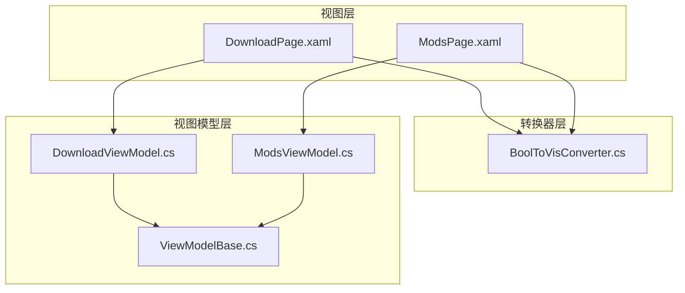
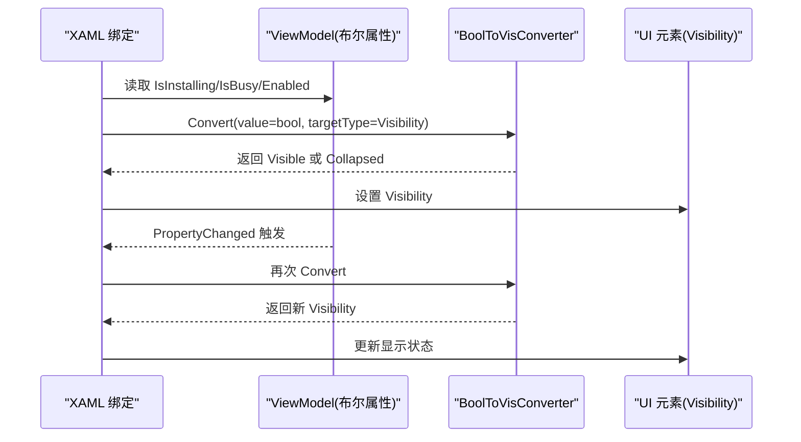
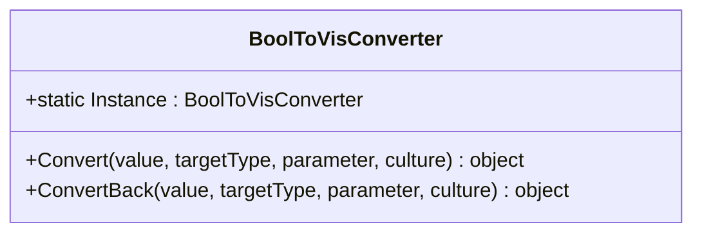
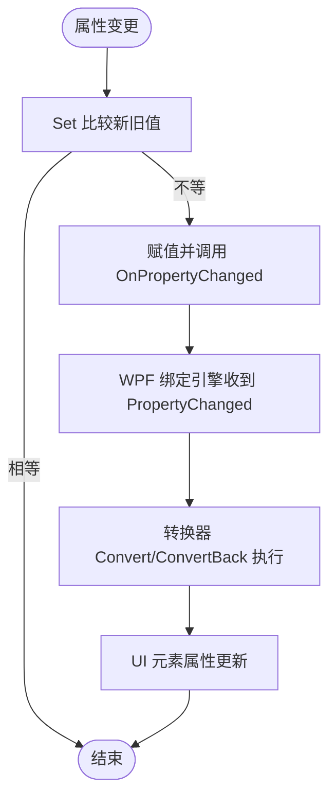
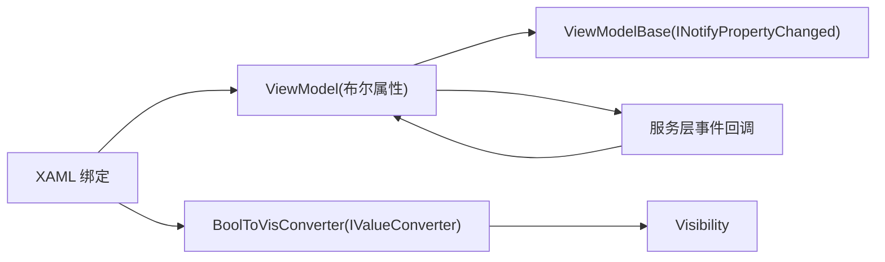

# 数据转换器

<cite>
**本文引用的文件**
- [BoolToVisConverter.cs](file://src/FufuLauncher/Converters/BoolToVisConverter.cs)
- [DownloadPage.xaml](file://src/FufuLauncher/Views/DownloadPage.xaml)
- [ModsPage.xaml](file://src/FufuLauncher/Views/ModsPage.xaml)
- [DownloadViewModel.cs](file://src/FufuLauncher/ViewModels/DownloadViewModel.cs)
- [ModsViewModel.cs](file://src/FufuLauncher/ViewModels/ModsViewModel.cs)
- [ViewModelBase.cs](file://src/FufuLauncher/ViewModels/ViewModelBase.cs)
</cite>

## 目录
1. [简介](#简介)
2. [项目结构](#项目结构)
3. [核心组件](#核心组件)
4. [架构总览](#架构总览)
5. [详细组件分析](#详细组件分析)
6. [依赖关系分析](#依赖关系分析)
7. [性能考量](#性能考量)
8. [故障排查指南](#故障排查指南)
9. [结论](#结论)
10. [附录](#附录)

## 简介
本文件为“可爱的芙芙启动器”的 WPF 数据转换器系统提供系统化文档，重点围绕 BoolToVisConverter 的实现原理、使用场景与最佳实践展开。内容涵盖：
- IValueConverter 接口实现模式与返回值处理
- XAML 绑定中转换器的使用方法（含参数与双向绑定）
- 自定义转换器的创建方法与复杂数据转换示例
- 错误处理与异常管理机制
- 与 MVVM 模式的集成方式及性能优化建议
- 常见数据转换场景与对应实现思路
- 调试与测试转换器的方法

## 项目结构
本项目采用分层组织：
- Converters：存放 WPF 数据转换器实现
- Views：XAML 界面文件，通过 Binding 使用转换器
- ViewModels：MVVM 视图模型，暴露布尔属性驱动 UI 可见性
- ViewModelBase：INotifyPropertyChanged 基类，支持属性变更通知

图表来源
- [BoolToVisConverter.cs](file://src/FufuLauncher/Converters/BoolToVisConverter.cs)
- [DownloadPage.xaml](file://src/FufuLauncher/Views/DownloadPage.xaml)
- [ModsPage.xaml](file://src/FufuLauncher/Views/ModsPage.xaml)
- [DownloadViewModel.cs](file://src/FufuLauncher/ViewModels/DownloadViewModel.cs)
- [ModsViewModel.cs](file://src/FufuLauncher/ViewModels/ModsViewModel.cs)
- [ViewModelBase.cs](file://src/FufuLauncher/ViewModels/ViewModelBase.cs)

章节来源
- [BoolToVisConverter.cs](file://src/FufuLauncher/Converters/BoolToVisConverter.cs)
- [DownloadPage.xaml](file://src/FufuLauncher/Views/DownloadPage.xaml)
- [ModsPage.xaml](file://src/FufuLauncher/Views/ModsPage.xaml)
- [DownloadViewModel.cs](file://src/FufuLauncher/ViewModels/DownloadViewModel.cs)
- [ModsViewModel.cs](file://src/FufuLauncher/ViewModels/ModsViewModel.cs)
- [ViewModelBase.cs](file://src/FufuLauncher/ViewModels/ViewModelBase.cs)

## 核心组件
- BoolToVisConverter：将布尔值转换为 Visibility，用于控制 UI 元素的显示与隐藏
- DownloadViewModel 与 ModsViewModel：暴露 IsInstalling、IsBusy、Enabled 等布尔属性，驱动 UI 可见性
- ViewModelBase：提供 Set 与 OnPropertyChanged，确保属性变更时 UI 自动更新

章节来源
- [BoolToVisConverter.cs](file://src/FufuLauncher/Converters/BoolToVisConverter.cs)
- [DownloadViewModel.cs](file://src/FufuLauncher/ViewModels/DownloadViewModel.cs)
- [ModsViewModel.cs](file://src/FufuLauncher/ViewModels/ModsViewModel.cs)
- [ViewModelBase.cs](file://src/FufuLauncher/ViewModels/ViewModelBase.cs)

## 架构总览
WPF 数据绑定流程：
- XAML 中的元素属性通过 Binding 指向 ViewModel 的布尔属性
- 转换器在 Convert 中将 bool 转为 Visibility（Visible/Collapsed）
- 当 ViewModel 属性变化时，UI 自动刷新

图表来源
- [DownloadPage.xaml](file://src/FufuLauncher/Views/DownloadPage.xaml)
- [ModsPage.xaml](file://src/FufuLauncher/Views/ModsPage.xaml)
- [BoolToVisConverter.cs](file://src/FufuLauncher/Converters/BoolToVisConverter.cs)
- [DownloadViewModel.cs](file://src/FufuLauncher/ViewModels/DownloadViewModel.cs)
- [ModsViewModel.cs](file://src/FufuLauncher/ViewModels/ModsViewModel.cs)

## 详细组件分析

### BoolToVisConverter 实现原理与使用场景
- 设计目标：将布尔值映射到 Visibility，简化 UI 显示逻辑
- 转换规则：
  - true → Visibility.Visible
  - false → Visibility.Collapsed
- 双向转换：
  - ConvertBack：仅当值为 Visible 时返回 true，否则返回 false
- 单例模式：
  - 提供静态 Instance，便于在 XAML 中以 {x:Static ...} 引用，避免重复实例化

图表来源
- [BoolToVisConverter.cs](file://src/FufuLauncher/Converters/BoolToVisConverter.cs)

章节来源
- [BoolToVisConverter.cs](file://src/FufuLauncher/Converters/BoolToVisConverter.cs)

### XAML 绑定中使用转换器
- 用法示例：
  - 下载页：将 IsInstalling 绑定到 Border 的 Visibility
  - 模组页：将 Enabled 和 IsBusy 分别绑定到不同元素的 Visibility
- 关键点：
  - 使用 {x:Static local:BoolToVisConverter.Instance} 引用单例
  - 单向绑定即可满足显示需求；如需双向，可在 ConvertBack 中处理

章节来源
- [DownloadPage.xaml](file://src/FufuLauncher/Views/DownloadPage.xaml)
- [ModsPage.xaml](file://src/FufuLauncher/Views/ModsPage.xaml)

### 与 MVVM 的集成与属性通知
- ViewModelBase 提供 Set<T> 与 OnPropertyChanged，确保属性变更时 UI 自动刷新
- DownloadViewModel 与 ModsViewModel 通过 Set 更新 IsInstalling、IsBusy、Enabled 等属性
- 事件回调（如下载进度）在 UI 线程中更新属性，保证绑定安全

图表来源
- [ViewModelBase.cs](file://src/FufuLauncher/ViewModels/ViewModelBase.cs)
- [DownloadViewModel.cs](file://src/FufuLauncher/ViewModels/DownloadViewModel.cs)
- [ModsViewModel.cs](file://src/FufuLauncher/ViewModels/ModsViewModel.cs)

章节来源
- [ViewModelBase.cs](file://src/FufuLauncher/ViewModels/ViewModelBase.cs)
- [DownloadViewModel.cs](file://src/FufuLauncher/ViewModels/DownloadViewModel.cs)
- [ModsViewModel.cs](file://src/FufuLauncher/ViewModels/ModsViewModel.cs)

### 自定义数据转换器创建指南
- 步骤：
  1. 新建类实现 IValueConverter
  2. 实现 Convert：输入值校验、类型判断、业务逻辑、返回目标类型
  3. 实现 ConvertBack：根据目标值反推源值（可选）
  4. 提供单例或注册为资源（推荐单例以减少 GC 压力）
- 最佳实践：
  - 对 null 或非预期类型进行防御性检查，返回默认值而非抛出异常
  - 避免在转换器中进行耗时操作（网络、IO），保持 UI 流畅
  - 使用 CultureInfo 参数支持本地化（如日期、数字格式）
- 示例场景：
  - 数值范围映射到颜色或样式
  - 枚举值映射到字符串描述
  - 多条件组合生成复合显示文本

[本节为通用指导，不直接分析具体文件]

### 错误处理与异常管理
- 转换器内部：
  - 对 value 的类型进行检查，非 bool 时按 false 处理（Collapsed）
  - ConvertBack 中对 Visibility 进行严格匹配，非 Visible 返回 false
- ViewModel 层：
  - 异步任务异常捕获并更新 StatusText，避免 UI 崩溃
  - 使用 Dispatcher 切换回 UI 线程更新属性
- 日志记录：
  - 关键异常写入应用日志，便于问题定位

章节来源
- [BoolToVisConverter.cs](file://src/FufuLauncher/Converters/BoolToVisConverter.cs)
- [DownloadViewModel.cs](file://src/FufuLauncher/ViewModels/DownloadViewModel.cs)
- [ModsViewModel.cs](file://src/FufuLauncher/ViewModels/ModsViewModel.cs)

### 常见数据转换场景与实现示例
- 布尔到可见性：BoolToVisConverter（已实现）
- 数值到百分比：将 0~1 的值乘以 100 并格式化
- 枚举到标签：将枚举成员映射为本地化字符串
- 空值到占位符：null 返回“暂无数据”，非空返回实际值
- 多值合并：将多个属性拼接为一条提示文本

[本节为通用指导，不直接分析具体文件]

### 调试与测试转换器的方法
- 运行时调试：
  - 在 Convert/ConvertBack 中设置断点，观察输入输出
  - 使用 WPF Visual Studio 工具查看绑定表达式与转换器执行情况
- 单元测试：
  - 针对 Convert/ConvertBack 编写用例，覆盖正常、边界与异常输入
  - 验证返回值是否符合预期（Visibility 或反向布尔值）
- 性能分析：
  - 使用性能分析工具检测频繁转换导致的 UI 卡顿
  - 避免在转换器中执行阻塞操作

[本节为通用指导，不直接分析具体文件]

## 依赖关系分析
- XAML 绑定依赖 ViewModel 的布尔属性
- 转换器依赖 System.Windows.Visibility 与 System.Globalization.CultureInfo
- ViewModel 依赖 ViewModelBase 的属性通知机制
- 服务层事件回调需切回 UI 线程更新属性

图表来源
- [DownloadPage.xaml](file://src/FufuLauncher/Views/DownloadPage.xaml)
- [ModsPage.xaml](file://src/FufuLauncher/Views/ModsPage.xaml)
- [BoolToVisConverter.cs](file://src/FufuLauncher/Converters/BoolToVisConverter.cs)
- [DownloadViewModel.cs](file://src/FufuLauncher/ViewModels/DownloadViewModel.cs)
- [ModsViewModel.cs](file://src/FufuLauncher/ViewModels/ModsViewModel.cs)
- [ViewModelBase.cs](file://src/FufuLauncher/ViewModels/ViewModelBase.cs)

章节来源
- [DownloadPage.xaml](file://src/FufuLauncher/Views/DownloadPage.xaml)
- [ModsPage.xaml](file://src/FufuLauncher/Views/ModsPage.xaml)
- [BoolToVisConverter.cs](file://src/FufuLauncher/Converters/BoolToVisConverter.cs)
- [DownloadViewModel.cs](file://src/FufuLauncher/ViewModels/DownloadViewModel.cs)
- [ModsViewModel.cs](file://src/FufuLauncher/ViewModels/ModsViewModel.cs)
- [ViewModelBase.cs](file://src/FufuLauncher/ViewModels/ViewModelBase.cs)

## 性能考量
- 转换器应轻量高效，避免 IO、网络、复杂计算
- 使用单例减少对象创建开销
- 仅在必要时启用双向绑定，降低 ConvertBack 调用频率
- 大量数据项渲染时，结合虚拟化面板提升性能
- 属性变更通知应精确，避免不必要的 UI 刷新

[本节为通用指导，不直接分析具体文件]

## 故障排查指南
- 常见问题：
  - 绑定未生效：检查属性名拼写、命名空间引用、是否实现 INotifyPropertyChanged
  - 转换器未调用：确认 Binding 的 Converter 是否正确引用单例
  - UI 无响应：检查转换器中是否存在阻塞操作
  - 异常导致崩溃：在转换器中添加类型检查与默认返回值
- 排查步骤：
  - 在转换器断点验证输入输出
  - 查看 ViewModel 属性变更是否触发
  - 检查服务回调是否在 UI 线程更新属性
  - 查看应用日志中的异常信息

章节来源
- [BoolToVisConverter.cs](file://src/FufuLauncher/Converters/BoolToVisConverter.cs)
- [DownloadViewModel.cs](file://src/FufuLauncher/ViewModels/DownloadViewModel.cs)
- [ModsViewModel.cs](file://src/FufuLauncher/ViewModels/ModsViewModel.cs)

## 结论
BoolToVisConverter 以简洁高效的实现满足了常见的布尔到可见性转换需求。通过遵循 IValueConverter 的最佳实践、与 MVVM 模式深度集成、以及完善的错误处理与性能优化策略，该转换器系统在“可爱的芙芙启动器”中稳定可靠地支撑了 UI 动态显示逻辑。开发者可基于此模式扩展更多自定义转换器，以满足复杂的数据展示需求。

[本节为总结性内容，不直接分析具体文件]

## 附录
- 相关术语：
  - IValueConverter：WPF 数据转换器接口
  - Visibility：UI 元素可见性枚举（Visible、Hidden、Collapsed）
  - INotifyPropertyChanged：属性变更通知接口
- 参考路径：
  - 转换器实现：[BoolToVisConverter.cs](file://src/FufuLauncher/Converters/BoolToVisConverter.cs)
  - XAML 使用示例：[DownloadPage.xaml](file://src/FufuLauncher/Views/DownloadPage.xaml)、[ModsPage.xaml](file://src/FufuLauncher/Views/ModsPage.xaml)
  - 视图模型与通知：[DownloadViewModel.cs](file://src/FufuLauncher/ViewModels/DownloadViewModel.cs)、[ModsViewModel.cs](file://src/FufuLauncher/ViewModels/ModsViewModel.cs)、[ViewModelBase.cs](file://src/FufuLauncher/ViewModels/ViewModelBase.cs)

[本节为补充信息，不直接分析具体文件]