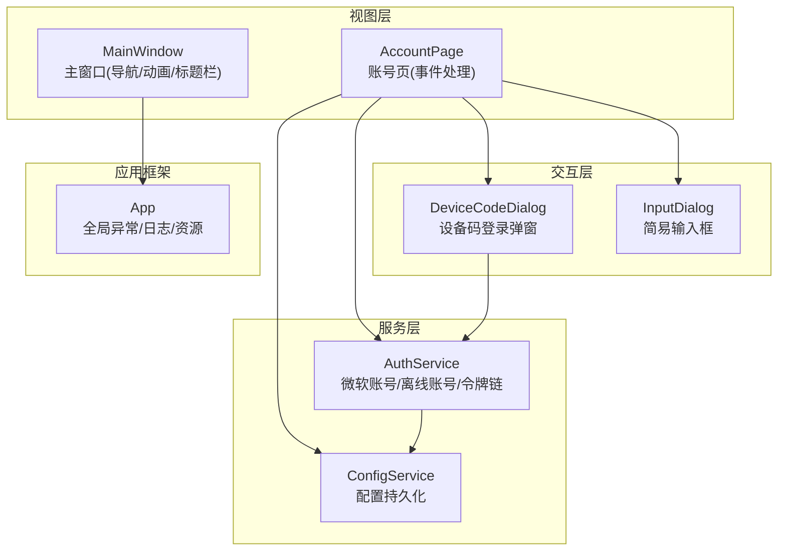
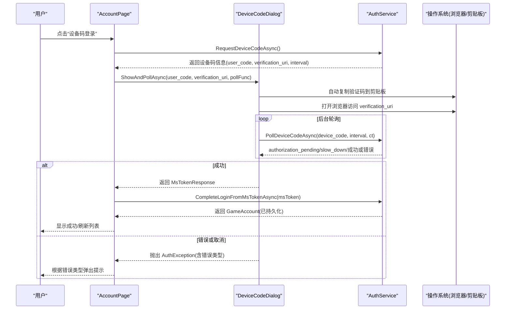
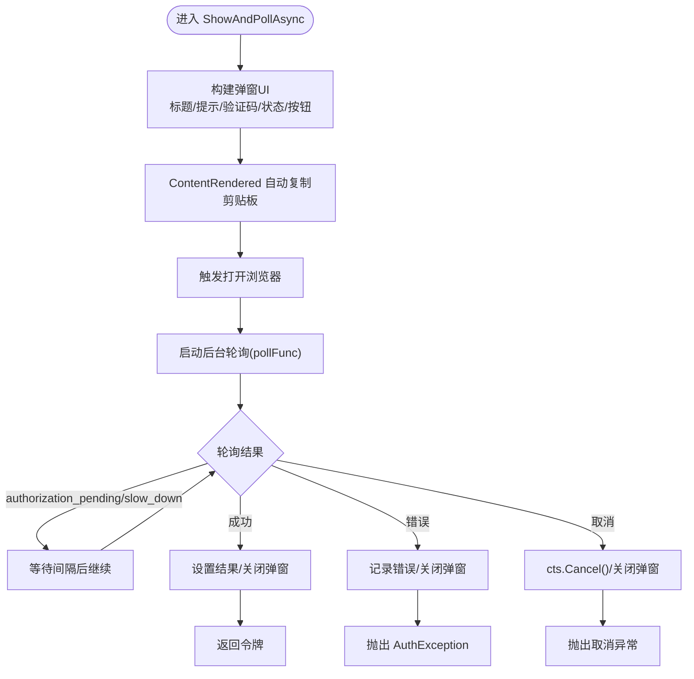
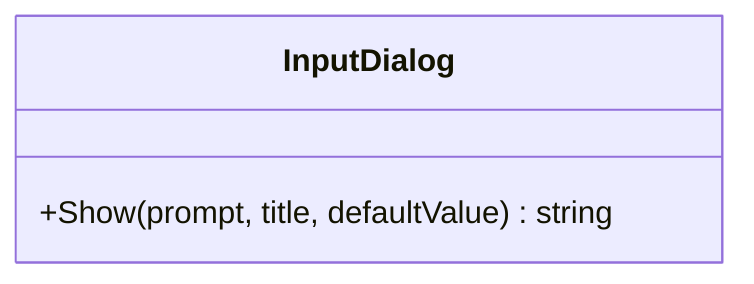
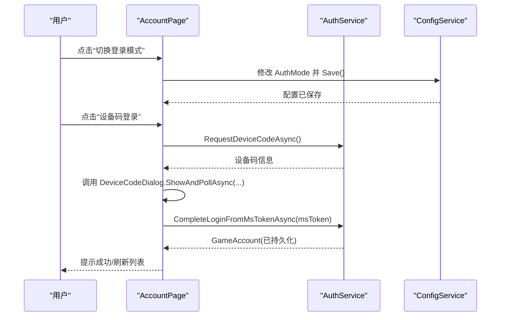
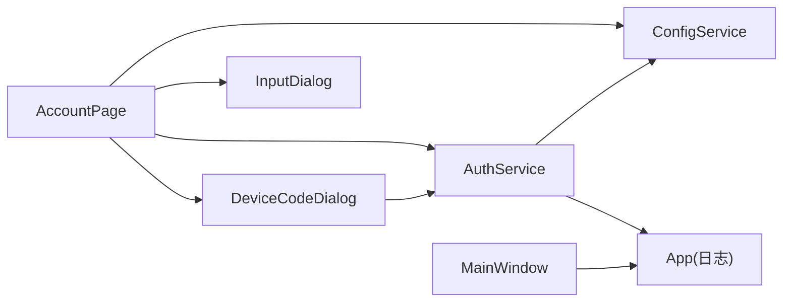

# 用户交互模式

<cite>
**本文引用的文件**   
- [DeviceCodeDialog.cs](file://src/FufuLauncher/Interaction/DeviceCodeDialog.cs)
- [InputDialog.cs](file://src/FufuLauncher/Interaction/InputDialog.cs)
- [AuthService.cs](file://src/FufuLauncher/Services/AuthService.cs)
- [ConfigService.cs](file://src/FufuLauncher/Services/ConfigService.cs)
- [App.xaml.cs](file://src/FufuLauncher/App.xaml.cs)
- [MainWindow.xaml.cs](file://src/FufuLauncher/MainWindow.xaml.cs)
- [AccountPage.xaml.cs](file://src/FufuLauncher/Views/AccountPage.xaml.cs)
- [AccountPage.xaml](file://src/FufuLauncher/Views/AccountPage.xaml)
- [MainViewModel.cs](file://src/FufuLauncher/ViewModels/MainViewModel.cs)
</cite>

## 目录
1. [简介](#简介)
2. [项目结构](#项目结构)
3. [核心组件](#核心组件)
4. [架构总览](#架构总览)
5. [详细组件分析](#详细组件分析)
6. [依赖关系分析](#依赖关系分析)
7. [性能考量](#性能考量)
8. [故障排查指南](#故障排查指南)
9. [结论](#结论)
10. [附录](#附录)

## 简介
本文件面向“可爱的芙芙”启动器的用户交互模式，重点说明对话框系统（设备码登录弹窗与输入框）、用户输入验证与反馈、鼠标与键盘事件处理、异步操作与取消机制、用户偏好保存与恢复、模态与非模态对话框使用场景与最佳实践，以及可访问性实现指导与自定义交互组件开发指南。文档以代码仓库中的实际实现为依据，提供循序渐进的说明与可视化图示，帮助开发者快速理解并扩展交互能力。

## 项目结构
与用户交互相关的核心代码集中在以下位置：
- Interaction：对话框与轻量交互组件
- Services：认证、配置等后台服务
- Views：页面视图与事件处理
- ViewModels：数据绑定与状态管理
- App/MainWindow：应用生命周期与主窗口交互

图表来源
- [DeviceCodeDialog.cs:1-204](file://src/FufuLauncher/Interaction/DeviceCodeDialog.cs#L1-L204)
- [InputDialog.cs:1-46](file://src/FufuLauncher/Interaction/InputDialog.cs#L1-L46)
- [AuthService.cs:1-683](file://src/FufuLauncher/Services/AuthService.cs#L1-L683)
- [ConfigService.cs:1-148](file://src/FufuLauncher/Services/ConfigService.cs#L1-L148)
- [AccountPage.xaml.cs:1-143](file://src/FufuLauncher/Views/AccountPage.xaml.cs#L1-L143)
- [MainWindow.xaml.cs:1-245](file://src/FufuLauncher/MainWindow.xaml.cs#L1-L245)
- [App.xaml.cs:1-207](file://src/FufuLauncher/App.xaml.cs#L1-L207)

章节来源
- [App.xaml.cs:1-207](file://src/FufuLauncher/App.xaml.cs#L1-L207)
- [MainWindow.xaml.cs:1-245](file://src/FufuLauncher/MainWindow.xaml.cs#L1-L245)

## 核心组件
- DeviceCodeDialog：设备码登录弹窗，负责展示验证码、自动复制剪贴板、一键打开授权网页、后台轮询授权结果、支持取消与错误处理。
- InputDialog：简易输入框，用于快速收集用户文本输入（如离线昵称）。
- AuthService：账号认证服务，包含设备码请求与轮询、本地回调登录、完整令牌链（MS→XBL→XSTS→MC）、离线账号生成与持久化、令牌刷新。
- ConfigService：配置服务，负责用户偏好的加载、迁移与保存。
- AccountPage：账号页面，串联 UI 事件与服务调用，驱动登录流程与错误提示。
- MainWindow：主窗口，承载导航、背景主题、标题栏交互、窗口状态变化处理。
- App：应用入口，统一异常捕获、日志缓冲写入、DI 容器初始化与资源释放。

章节来源
- [DeviceCodeDialog.cs:1-204](file://src/FufuLauncher/Interaction/DeviceCodeDialog.cs#L1-L204)
- [InputDialog.cs:1-46](file://src/FufuLauncher/Interaction/InputDialog.cs#L1-L46)
- [AuthService.cs:1-683](file://src/FufuLauncher/Services/AuthService.cs#L1-L683)
- [ConfigService.cs:1-148](file://src/FufuLauncher/Services/ConfigService.cs#L1-L148)
- [AccountPage.xaml.cs:1-143](file://src/FufuLauncher/Views/AccountPage.xaml.cs#L1-L143)
- [MainWindow.xaml.cs:1-245](file://src/FufuLauncher/MainWindow.xaml.cs#L1-L245)
- [App.xaml.cs:1-207](file://src/FufuLauncher/App.xaml.cs#L1-L207)

## 架构总览
下图展示了从用户点击到完成登录的关键交互流程，包括设备码弹窗、轮询、令牌链与账户持久化。

图表来源
- [AccountPage.xaml.cs:57-72](file://src/FufuLauncher/Views/AccountPage.xaml.cs#L57-L72)
- [DeviceCodeDialog.cs:26-202](file://src/FufuLauncher/Interaction/DeviceCodeDialog.cs#L26-L202)
- [AuthService.cs:159-265](file://src/FufuLauncher/Services/AuthService.cs#L159-L265)
- [AuthService.cs:343-398](file://src/FufuLauncher/Services/AuthService.cs#L343-L398)

## 详细组件分析

### 设备码登录弹窗(DeviceCodeDialog)
- 职责
  - 展示 user_code 与 verification_uri，大字号突出验证码。
  - 打开时自动将验证码复制到剪贴板，并提供“复制并打开网页”按钮。
  - 后台轮询授权结果，成功则关闭弹窗并返回令牌；失败或取消则关闭弹窗并抛出异常。
- 关键行为
  - ContentRendered 事件中尝试复制剪贴板并触发打开浏览器。
  - 按钮 Click 事件处理复制与浏览器打开，失败更新状态文本。
  - Closing 事件在用户关闭窗口时视为取消。
  - ContinueWith 在轮询完成后切换回 UI 线程设置 DialogResult 并关闭窗口。
- 错误与取消
  - 用户取消：抛出携带 Cancelled 的 AuthException。
  - 网络异常：由轮询函数内部处理并重试或抛错。
  - 设备码过期：抛出 DeviceCodeExpired 错误。
- 无障碍与可用性
  - 使用标准 Window/TextBlock/Button，便于屏幕阅读器识别。
  - 建议为按钮添加 AccessibleName/HelpText，提升读屏体验。

图表来源
- [DeviceCodeDialog.cs:26-202](file://src/FufuLauncher/Interaction/DeviceCodeDialog.cs#L26-L202)
- [AuthService.cs:198-265](file://src/FufuLauncher/Services/AuthService.cs#L198-L265)

章节来源
- [DeviceCodeDialog.cs:1-204](file://src/FufuLauncher/Interaction/DeviceCodeDialog.cs#L1-L204)

### 输入框(InputDialog)
- 用途
  - 快速收集用户文本输入，例如离线账号昵称。
- 行为
  - 显示提示文本与默认值，确定返回输入内容，取消返回空字符串。
  - 使用 ShowDialog 模态阻塞，确保输入完成后再继续流程。
- 可扩展点
  - 增加输入验证（正则、长度限制）与即时反馈。
  - 支持快捷键（Enter 确认、Esc 取消）。
  - 增强可访问性（Label 关联 TextBox、AccessibleName）。

图表来源
- [InputDialog.cs:1-46](file://src/FufuLauncher/Interaction/InputDialog.cs#L1-L46)

章节来源
- [InputDialog.cs:1-46](file://src/FufuLauncher/Interaction/InputDialog.cs#L1-L46)

### 账号页面(AccountPage)与登录流程
- 功能
  - 切换登录模式（设备码/本地回调），保存配置。
  - 设备码登录：请求设备码 → 弹窗轮询 → 完成令牌链 → 持久化账户。
  - 本地回调登录：监听端口 → 获取授权码 → 换取令牌 → 完成令牌链。
  - 离线账号登录：通过 InputDialog 收集昵称 → 生成离线账户。
- 错误处理
  - 根据 AuthError 枚举区分提示标题与图标，提升用户体验。
- 数据流
  - ViewModel 负责刷新列表与当前账号状态。
  - Service 负责账户持久化与令牌链。

图表来源
- [AccountPage.xaml.cs:39-72](file://src/FufuLauncher/Views/AccountPage.xaml.cs#L39-L72)
- [AuthService.cs:159-265](file://src/FufuLauncher/Services/AuthService.cs#L159-L265)
- [AuthService.cs:343-398](file://src/FufuLauncher/Services/AuthService.cs#L343-L398)
- [ConfigService.cs:94-148](file://src/FufuLauncher/Services/ConfigService.cs#L94-L148)

章节来源
- [AccountPage.xaml.cs:1-143](file://src/FufuLauncher/Views/AccountPage.xaml.cs#L1-L143)
- [AccountPage.xaml:1-47](file://src/FufuLauncher/Views/AccountPage.xaml#L1-L47)

### 主窗口(MainWindow)与用户交互
- 导航与动画
  - 左侧导航切换页面，带淡入+上滑过渡动画。
  - 页面切换前释放旧 Page（若实现 IDisposable），避免内存泄漏。
- 标题栏交互
  - 双击最大化、拖拽移动、最小化/最大化/关闭按钮。
- 背景与主题
  - 应用主题与背景，窗口最小化时暂停视频背景以降低占用。
- 环境自检
  - 启动时异步执行环境检查，状态显示于底部状态栏。

章节来源
- [MainWindow.xaml.cs:1-245](file://src/FufuLauncher/MainWindow.xaml.cs#L1-L245)

### 应用(App)与全局异常/日志
- 全局异常捕获
  - 捕获 DispatcherUnhandledException、Domain UnhandledException、Task UnobservedTaskException。
  - 统一提示用户并记录日志，防止进程意外终止。
- 日志缓冲
  - 使用 ConcurrentQueue + Timer 批量写入 app.log，降低 IO 开销。
- DI 与资源
  - 启动时注册服务与页面，退出时释放资源（内存监控、主题背景）。

章节来源
- [App.xaml.cs:1-207](file://src/FufuLauncher/App.xaml.cs#L1-L207)

## 依赖关系分析
- 组件耦合
  - AccountPage 依赖 AuthService、ConfigService 与交互组件（DeviceCodeDialog、InputDialog）。
  - DeviceCodeDialog 依赖 AuthService 的轮询方法，并通过 Application.Current.Dispatcher 切换 UI 线程。
  - AuthService 依赖 ConfigService 进行账户持久化，依赖 App 写入日志。
- 外部集成
  - 浏览器打开（Process.Start）、剪贴板操作（Clipboard.SetText）。
  - HTTP 客户端（HttpClient）与 HttpListener（本地回调）。
- 潜在循环依赖
  - 无直接循环依赖；交互层仅调用服务层，不反向依赖。

图表来源
- [AccountPage.xaml.cs:1-143](file://src/FufuLauncher/Views/AccountPage.xaml.cs#L1-L143)
- [DeviceCodeDialog.cs:1-204](file://src/FufuLauncher/Interaction/DeviceCodeDialog.cs#L1-L204)
- [AuthService.cs:1-683](file://src/FufuLauncher/Services/AuthService.cs#L1-L683)
- [ConfigService.cs:1-148](file://src/FufuLauncher/Services/ConfigService.cs#L1-L148)
- [App.xaml.cs:1-207](file://src/FufuLauncher/App.xaml.cs#L1-L207)
- [MainWindow.xaml.cs:1-245](file://src/FufuLauncher/MainWindow.xaml.cs#L1-L245)

章节来源
- [AccountPage.xaml.cs:1-143](file://src/FufuLauncher/Views/AccountPage.xaml.cs#L1-L143)
- [AuthService.cs:1-683](file://src/FufuLauncher/Services/AuthService.cs#L1-L683)
- [ConfigService.cs:1-148](file://src/FufuLauncher/Services/ConfigService.cs#L1-L148)
- [App.xaml.cs:1-207](file://src/FufuLauncher/App.xaml.cs#L1-L207)
- [MainWindow.xaml.cs:1-245](file://src/FufuLauncher/MainWindow.xaml.cs#L1-L245)

## 性能考量
- 日志写入
  - 使用队列与定时器批量写入，避免高频同步 IO 阻塞 UI 线程。
- 轮询策略
  - 设备码轮询支持 slow_down 自适应延迟，避免频繁请求导致限流。
- 背景媒体
  - 窗口最小化时暂停视频播放，减少 CPU/GPU 占用。
- 页面切换
  - 释放旧页面的 IDisposable 资源，防止事件订阅导致的内存泄漏。
- HttpClient
  - 复用静态 HttpClient 实例，设置超时与必要头，提高网络效率。

[本节为通用性能建议，无需特定文件引用]

## 故障排查指南
- 常见登录错误
  - 未购买 Minecraft：提示用户前往商店购买。
  - 网络异常：检查网络与代理设置，查看应用日志。
  - 设备码过期：重新发起设备码请求。
  - 令牌交换失败：检查各端点响应与日志详情。
- 取消与异常
  - 用户取消：弹窗关闭后抛出取消异常，界面提示“登录取消”。
  - 未观察 Task 异常：App 层捕获并提示，避免进程崩溃。
- 日志定位
  - 查看 app.log 获取详细错误堆栈与响应片段。

章节来源
- [AccountPage.xaml.cs:75-103](file://src/FufuLauncher/Views/AccountPage.xaml.cs#L75-L103)
- [App.xaml.cs:180-206](file://src/FufuLauncher/App.xaml.cs#L180-L206)
- [AuthService.cs:159-265](file://src/FufuLauncher/Services/AuthService.cs#L159-L265)

## 结论
“可爱的芙芙”启动器的用户交互模式围绕简洁可靠的对话框系统与健壮的服务层展开。设备码登录弹窗提供了友好的授权体验，输入框简化了文本输入，AuthService 实现了完整的令牌链与离线账号支持，ConfigService 保证了用户偏好的持久化。通过全局异常捕获与日志缓冲，系统在稳定性与可维护性方面表现良好。未来可在输入验证、快捷键与无障碍方面进一步增强，以提升整体用户体验。

[本节为总结性内容，无需特定文件引用]

## 附录

### 用户输入验证与处理机制
- 表单验证
  - 建议在 InputDialog 中增加输入校验（非空、长度、格式），并在 UI 上即时反馈。
- 错误提示
  - 使用 MessageBox 按错误类型分类提示，结合 App 日志定位问题。
- 用户反馈
  - 弹窗内状态文本实时更新，轮询过程中显示“正在等待授权...”。

章节来源
- [InputDialog.cs:1-46](file://src/FufuLauncher/Interaction/InputDialog.cs#L1-L46)
- [AccountPage.xaml.cs:75-103](file://src/FufuLauncher/Views/AccountPage.xaml.cs#L75-L103)

### 鼠标与键盘事件处理模式
- 鼠标事件
  - 主窗口标题栏支持拖拽、双击最大化、按钮悬停高亮。
- 键盘事件
  - 当前未显式处理快捷键，建议在输入框中支持 Enter 确认、Esc 取消。
- 无障碍访问
  - 使用标准 WPF 控件，建议为按钮与输入框添加 AccessibleName/HelpText，提升读屏体验。

章节来源
- [MainWindow.xaml.cs:188-243](file://src/FufuLauncher/MainWindow.xaml.cs#L188-L243)
- [InputDialog.cs:1-46](file://src/FufuLauncher/Interaction/InputDialog.cs#L1-L46)

### 异步用户操作的处理方式
- 进度指示
  - 弹窗状态文本显示“正在等待你在浏览器中完成授权...”，轮询期间保持用户感知。
- 取消机制
  - CancellationTokenSource 贯穿轮询流程，用户点击取消或关闭窗口即中断。
- 错误处理
  - 轮询函数内部捕获网络异常并重试，最终抛出明确的 AuthException。

章节来源
- [DeviceCodeDialog.cs:127-170](file://src/FufuLauncher/Interaction/DeviceCodeDialog.cs#L127-L170)
- [AuthService.cs:198-265](file://src/FufuLauncher/Services/AuthService.cs#L198-L265)

### 用户偏好的保存与恢复机制
- 配置项
  - 主题、下载源、Java 路径、JVM 参数、分辨率、背景设置、登录模式、回调端口等。
- 持久化
  - ConfigService.Load/Save 使用 JSON 序列化，支持旧配置迁移。
- 使用场景
  - 切换登录模式后立即保存；应用启动时加载配置并应用主题与背景。

章节来源
- [ConfigService.cs:13-79](file://src/FufuLauncher/Services/ConfigService.cs#L13-L79)
- [ConfigService.cs:94-148](file://src/FufuLauncher/Services/ConfigService.cs#L94-L148)
- [AccountPage.xaml.cs:39-45](file://src/FufuLauncher/Views/AccountPage.xaml.cs#L39-L45)

### 模态与非模态对话框的使用场景与最佳实践
- 模态对话框
  - InputDialog 使用 ShowDialog，确保输入完成后再继续流程。
  - DeviceCodeDialog 使用 ShowDialog，轮询期间阻塞主流程，避免状态不一致。
- 非模态对话框
  - 适用于后台任务通知或辅助工具，需明确生命周期与事件解绑。
- 最佳实践
  - 明确对话框职责，避免嵌套过多；及时释放资源；提供清晰的取消与错误处理。

章节来源
- [InputDialog.cs:42-44](file://src/FufuLauncher/Interaction/InputDialog.cs#L42-L44)
- [DeviceCodeDialog.cs:195-202](file://src/FufuLauncher/Interaction/DeviceCodeDialog.cs#L195-L202)

### 用户界面可访问性(Accessibility)实现指导
- 控件命名
  - 为按钮与输入框设置 AccessibleName，便于屏幕阅读器朗读。
- 标签关联
  - 使用 Label 与 TextBox 的 Target 属性建立关联，提升键盘导航体验。
- 焦点管理
  - 确保 Tab 顺序合理，关键操作可通过快捷键触发。
- 颜色对比度
  - 遵循主题资源，保证文本与背景对比度符合无障碍标准。

[本节为通用指导，无需特定文件引用]

### 自定义交互组件的开发指南与示例代码
- 设计原则
  - 单一职责：每个组件聚焦一个交互场景（如输入、确认、展示）。
  - 可组合：通过参数注入行为（如验证器、回调函数）。
  - 可测试：分离 UI 逻辑与业务逻辑，便于单元测试。
- 开发步骤
  - 定义组件接口与参数（如 prompt、title、defaultValue）。
  - 构建 UI（WPF 控件组合），绑定事件处理。
  - 实现返回值与异常处理（如取消、错误）。
  - 在页面中调用并处理结果。
- 示例参考
  - 参考 InputDialog 的实现，扩展为多字段输入或带验证的输入框。
  - 参考 DeviceCodeDialog 的轮询与取消机制，封装通用异步任务弹窗。

章节来源
- [InputDialog.cs:1-46](file://src/FufuLauncher/Interaction/InputDialog.cs#L1-L46)
- [DeviceCodeDialog.cs:1-204](file://src/FufuLauncher/Interaction/DeviceCodeDialog.cs#L1-L204)