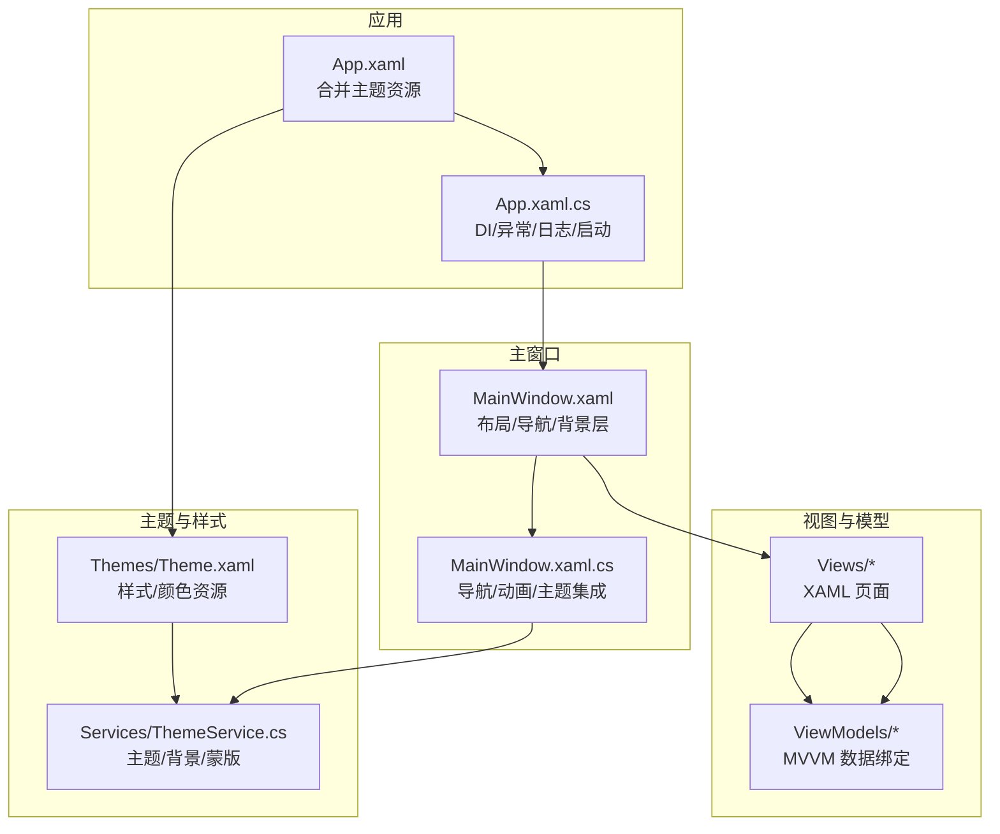
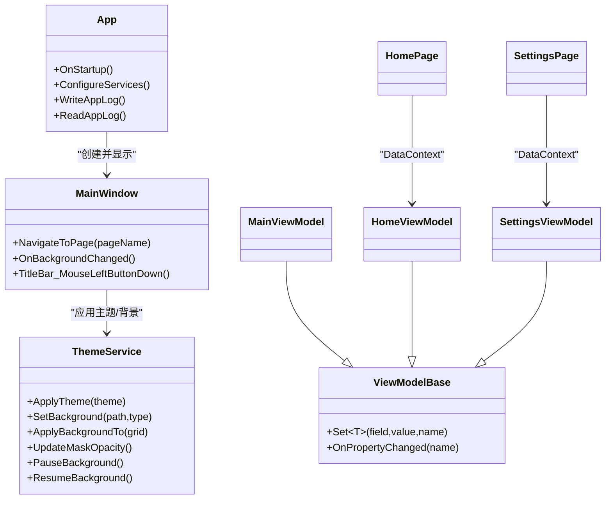
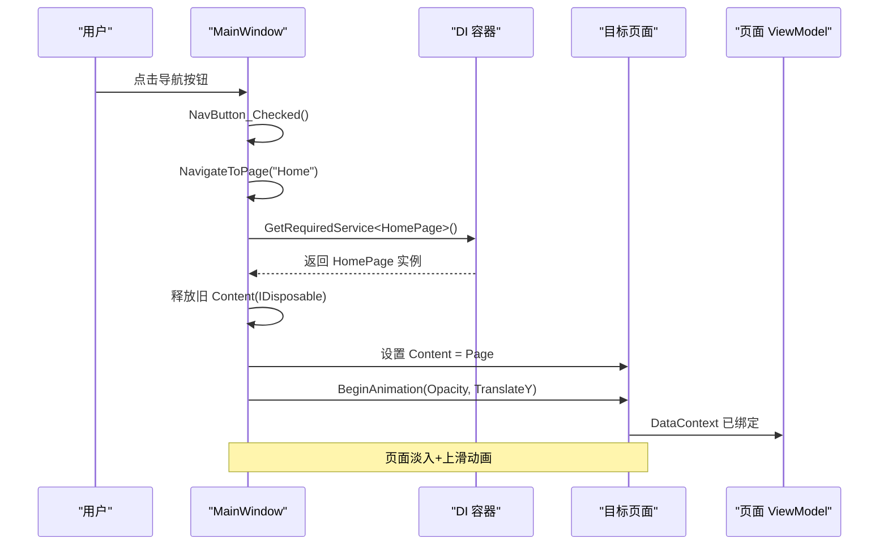
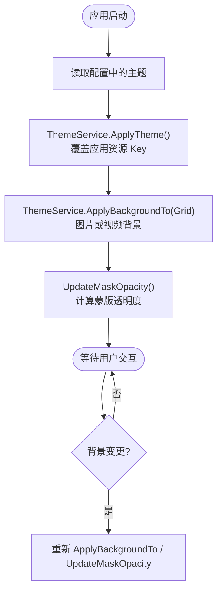
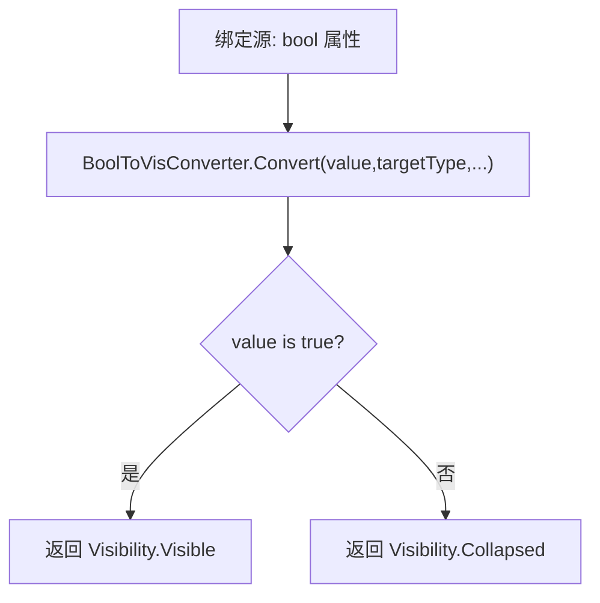
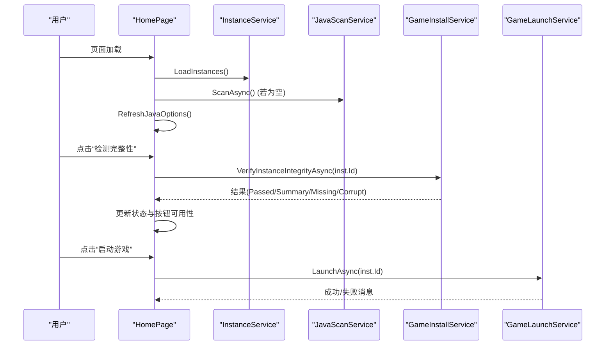
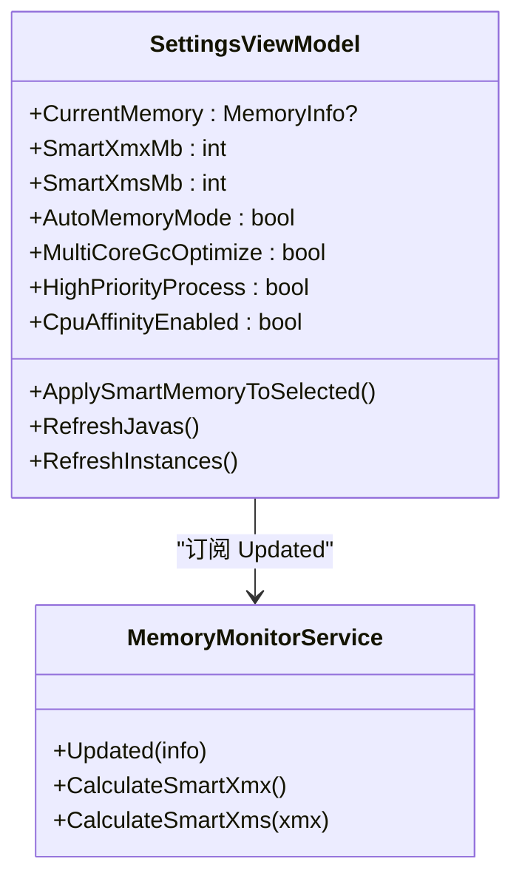
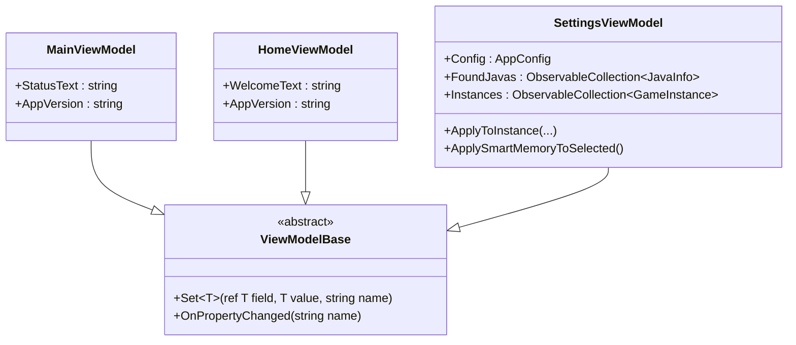
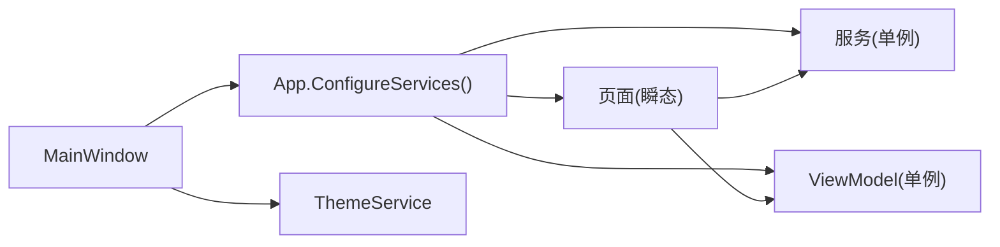

# 用户界面架构

<cite>
**本文引用的文件**   
- [App.xaml.cs](file://src/FufuLauncher/App.xaml.cs)
- [App.xaml](file://src/FufuLauncher/App.xaml)
- [MainWindow.xaml.cs](file://src/FufuLauncher/MainWindow.xaml.cs)
- [MainWindow.xaml](file://src/FufuLauncher/MainWindow.xaml)
- [Theme.xaml](file://src/FufuLauncher/Themes/Theme.xaml)
- [BoolToVisConverter.cs](file://src/FufuLauncher/Converters/BoolToVisConverter.cs)
- [MainViewModel.cs](file://src/FufuLauncher/ViewModels/MainViewModel.cs)
- [HomeViewModel.cs](file://src/FufuLauncher/ViewModels/HomeViewModel.cs)
- [SettingsViewModel.cs](file://src/FufuLauncher/ViewModels/SettingsViewModel.cs)
- [HomePage.xaml](file://src/FufuLauncher/Views/HomePage.xaml)
- [HomePage.xaml.cs](file://src/FufuLauncher/Views/HomePage.xaml.cs)
- [SettingsPage.xaml](file://src/FufuLauncher/Views/SettingsPage.xaml)
- [ThemeService.cs](file://src/FufuLauncher/Services/ThemeService.cs)
</cite>

## 目录
1. [简介](#简介)
2. [项目结构](#项目结构)
3. [核心组件](#核心组件)
4. [架构总览](#架构总览)
5. [详细组件分析](#详细组件分析)
6. [依赖关系分析](#依赖关系分析)
7. [性能考量](#性能考量)
8. [故障排查指南](#故障排查指南)
9. [结论](#结论)
10. [附录](#附录)

## 简介
本文件面向“可爱的芙芙”启动器的用户界面架构，聚焦于基于 WPF 的 MVVM 实现：View 层 XAML 页面设计、ViewModel 层数据绑定与业务逻辑封装；页面导航系统（路由管理、生命周期、动画）；主题与样式系统（主题切换、背景管理与样式定制）；数据转换器（如 BoolToVisConverter）的使用；用户交互模式、事件处理与状态管理；以及响应式设计与可访问性合规指导原则。文档同时提供组件组合模式与与其他 UI 元素的集成示例，帮助读者快速理解并扩展界面。

## 项目结构
- 应用入口与资源装配
  - App.xaml 负责合并主题资源字典，统一应用级样式与颜色。
  - App.xaml.cs 完成 DI 容器初始化、服务注册、配置加载、异常捕获、日志缓冲与窗口创建。
- 主窗口与导航
  - MainWindow.xaml 定义无边框窗口、标题栏、左侧导航与右侧 Frame 内容区。
  - MainWindow.xaml.cs 实现页面导航、淡入/上滑过渡动画、背景层与主题服务集成、环境自检。
- 视图与视图模型
  - Views 下为各功能页（主页、下载、Java 运行时、实例、账号、模组、存档、设置）。
  - ViewModels 提供数据绑定属性、命令与业务编排，继承 ViewModelBase 实现 INotifyPropertyChanged。
- 主题与样式
  - Themes/Theme.xaml 集中定义控件样式、颜色资源、文本样式、卡片与滚动条等。
  - Services/ThemeService.cs 负责主题切换、背景图片/视频渲染、透明度与蒙版同步。
- 转换器
  - Converters/BoolToVisConverter.cs 将布尔值转换为 Visibility 用于条件显示。

**图表来源** 
- [App.xaml:1-13](file://src/FufuLauncher/App.xaml#L1-L13)
- [App.xaml.cs:82-156](file://src/FufuLauncher/App.xaml.cs#L82-L156)
- [MainWindow.xaml:1-139](file://src/FufuLauncher/MainWindow.xaml#L1-L139)
- [MainWindow.xaml.cs:38-73](file://src/FufuLauncher/MainWindow.xaml.cs#L38-L73)
- [Theme.xaml:1-602](file://src/FufuLauncher/Themes/Theme.xaml#L1-L602)
- [ThemeService.cs:30-62](file://src/FufuLauncher/Services/ThemeService.cs#L30-L62)

**章节来源**
- [App.xaml:1-13](file://src/FufuLauncher/App.xaml#L1-L13)
- [App.xaml.cs:82-156](file://src/FufuLauncher/App.xaml.cs#L82-L156)
- [MainWindow.xaml:1-139](file://src/FufuLauncher/MainWindow.xaml#L1-L139)
- [MainWindow.xaml.cs:38-73](file://src/FufuLauncher/MainWindow.xaml.cs#L38-L73)
- [Theme.xaml:1-602](file://src/FufuLauncher/Themes/Theme.xaml#L1-L602)
- [ThemeService.cs:30-62](file://src/FufuLauncher/Services/ThemeService.cs#L30-L62)

## 核心组件
- 应用生命周期与 DI
  - 通过 ServiceCollection 注册所有服务、ViewModel 与页面（页面为 Transient），由 DI 自动注入依赖。
  - 全局异常捕获（UI 线程、域、Task）统一记录日志并弹窗提示。
- 主窗口与导航
  - 使用 Frame + 隐藏导航 UI，通过 RadioButton Checked 事件触发 NavigateToPage。
  - 页面切换包含淡入与轻微上滑动画，提升视觉连贯性。
- 主题与背景
  - ThemeService 动态覆盖应用资源 Key 实现深浅主题切换；支持图片/视频背景、透明度与蒙版联动。
- 视图模型基类
  - ViewModelBase 提供 Set<T> 与 OnPropertyChanged，简化 INPC 实现。
- 转换器
  - BoolToVisConverter 将 bool 转为 Visibility.Visible/Collapsed，常用于条件显示。

**章节来源**
- [App.xaml.cs:138-217](file://src/FufuLauncher/App.xaml.cs#L138-L217)
- [MainWindow.xaml.cs:99-186](file://src/FufuLauncher/MainWindow.xaml.cs#L99-L186)
- [ThemeService.cs:30-110](file://src/FufuLauncher/Services/ThemeService.cs#L30-L110)
- [ViewModelBase.cs:1-22](file://src/FufuLauncher/ViewModels/ViewModelBase.cs#L1-L22)
- [BoolToVisConverter.cs:1-19](file://src/FufuLauncher/Converters/BoolToVisConverter.cs#L1-L19)

## 架构总览
WPF 采用 MVVM 分层：
- View（XAML）：声明式布局与样式，绑定到 ViewModel 属性。
- ViewModel：暴露可绑定属性与命令，封装业务逻辑，不直接操作 UI。
- Services：横切关注点（配置、网络、下载、环境检查、主题、内存监控等）。
- DI：贯穿应用，解耦对象创建与依赖注入。

**图表来源** 
- [App.xaml.cs:138-217](file://src/FufuLauncher/App.xaml.cs#L138-L217)
- [MainWindow.xaml.cs:28-73](file://src/FufuLauncher/MainWindow.xaml.cs#L28-L73)
- [ThemeService.cs:30-110](file://src/FufuLauncher/Services/ThemeService.cs#L30-L110)
- [ViewModelBase.cs:1-22](file://src/FufuLauncher/ViewModels/ViewModelBase.cs#L1-L22)
- [MainViewModel.cs:1-25](file://src/FufuLauncher/ViewModels/MainViewModel.cs#L1-L25)
- [HomeViewModel.cs:1-25](file://src/FufuLauncher/ViewModels/HomeViewModel.cs#L1-L25)
- [SettingsViewModel.cs:1-252](file://src/FufuLauncher/ViewModels/SettingsViewModel.cs#L1-L252)
- [HomePage.xaml:1-119](file://src/FufuLauncher/Views/HomePage.xaml#L1-L119)
- [SettingsPage.xaml:1-350](file://src/FufuLauncher/Views/SettingsPage.xaml#L1-L350)

## 详细组件分析

### 页面导航系统（路由、生命周期、动画）
- 路由管理
  - 使用 Frame.Content 切换页面，页面类型由字符串名称映射到 DI 容器解析。
  - 导航前释放旧页面的 IDisposable 资源，避免事件订阅泄漏。
- 生命周期
  - 首次加载时默认导航到主页，随后根据左侧 RadioButton 选择切换。
  - 页面 Loaded 事件中执行数据加载与初始化（如主页加载实例列表、扫描 Java）。
- 动画效果
  - 页面切换使用 Storyboard 组合 Opacity 淡入与 TranslateTransform.Y 上滑，时长约 220ms，缓动函数为 CubicEase。
  - 主窗口打开时整体淡入 300ms。

**图表来源** 
- [MainWindow.xaml.cs:99-186](file://src/FufuLauncher/MainWindow.xaml.cs#L99-L186)

**章节来源**
- [MainWindow.xaml.cs:99-186](file://src/FufuLauncher/MainWindow.xaml.cs#L99-L186)
- [MainWindow.xaml.cs:38-73](file://src/FufuLauncher/MainWindow.xaml.cs#L38-L73)

### 主题与样式系统（主题切换、背景管理、样式定制）
- 主题切换
  - ThemeService.ApplyTheme 根据配置覆盖应用资源 Key（AppBackground/AppForeground/CardBackground 等），实现即时深浅主题切换。
  - 设置页调用 SetTheme 持久化配置并触发 BackgroundChanged 事件。
- 背景管理
  - ApplyBackgroundTo 支持图片与视频两种类型，设置透明度、静音、播放速度，并在窗口最小化/恢复时暂停/恢复播放。
  - UpdateMaskOpacity 根据背景透明度计算半透明蒙版强度，保证前景可读性。
- 样式定制
  - Theme.xaml 集中定义 Button、TextBox、ComboBox、CheckBox、RadioButton、Slider、ProgressBar、ListViewItem、ScrollViewer、TabItem 等样式，全部使用 DynamicResource 引用当前主题色板。

**图表来源** 
- [ThemeService.cs:30-110](file://src/FufuLauncher/Services/ThemeService.cs#L30-L110)
- [ThemeService.cs:112-206](file://src/FufuLauncher/Services/ThemeService.cs#L112-L206)
- [Theme.xaml:1-602](file://src/FufuLauncher/Themes/Theme.xaml#L1-L602)

**章节来源**
- [ThemeService.cs:30-110](file://src/FufuLauncher/Services/ThemeService.cs#L30-L110)
- [ThemeService.cs:112-206](file://src/FufuLauncher/Services/ThemeService.cs#L112-L206)
- [Theme.xaml:1-602](file://src/FufuLauncher/Themes/Theme.xaml#L1-L602)

### 数据转换器（BoolToVisConverter）
- 作用：将布尔值转换为 Visibility.Visible 或 Collapsed，常用于条件显示 UI 元素。
- 使用方式：在 XAML 中通过 StaticResource 引用 Instance，绑定到需要条件显示的控件 Visibility 属性。
- 适用场景：开关项控制面板可见性、错误提示显示、高级选项展开等。

**图表来源** 
- [BoolToVisConverter.cs:1-19](file://src/FufuLauncher/Converters/BoolToVisConverter.cs#L1-L19)

**章节来源**
- [BoolToVisConverter.cs:1-19](file://src/FufuLauncher/Converters/BoolToVisConverter.cs#L1-L19)

### 主页组件（HomePage）与交互流程
- 数据加载
  - 页面 Loaded 时加载实例列表、扫描本机 Java、刷新 Java 下拉选项。
- 完整性校验
  - 点击“检测游戏版本完整性”后调用 GameInstallService 进行快速校验，通过后启用“启动游戏”按钮。
- 启动门控
  - 启动前检查是否已通过完整性校验、是否有运行中的游戏进程，再调用 GameLaunchService 启动。
- 日志查看
  - 打开双标签日志查看器，先 FlushNow 确保内存缓冲落地，再读取应用日志与游戏日志。

**图表来源** 
- [HomePage.xaml.cs:43-65](file://src/FufuLauncher/Views/HomePage.xaml.cs#L43-L65)
- [HomePage.xaml.cs:228-303](file://src/FufuLauncher/Views/HomePage.xaml.cs#L228-L303)

**章节来源**
- [HomePage.xaml:1-119](file://src/FufuLauncher/Views/HomePage.xaml#L1-L119)
- [HomePage.xaml.cs:43-65](file://src/FufuLauncher/Views/HomePage.xaml.cs#L43-L65)
- [HomePage.xaml.cs:228-303](file://src/FufuLauncher/Views/HomePage.xaml.cs#L228-L303)

### 设置页组件（SettingsPage）与内存监控
- 内存监控
  - SettingsViewModel 订阅 MemoryMonitorService.Updated，定时推送 CurrentMemory，并缓存 SmartXmx/SmartXms 避免 P/Invoke 风暴。
- 智能分配
  - 支持一键应用智能推荐内存到选中实例，参数包括预留内存、上下限等。
- JVM 优化
  - 多核 GC 优化参数预览、高优先级进程、CPU 亲和性等开关，实时生成参数预览。
- 背景与主题
  - 支持选择图片/视频背景、调节透明度、静音与播放速度，保存至配置并即时生效。

**图表来源** 
- [SettingsViewModel.cs:1-252](file://src/FufuLauncher/ViewModels/SettingsViewModel.cs#L1-L252)

**章节来源**
- [SettingsPage.xaml:1-350](file://src/FufuLauncher/Views/SettingsPage.xaml#L1-L350)
- [SettingsViewModel.cs:1-252](file://src/FufuLauncher/ViewModels/SettingsViewModel.cs#L1-L252)

### 视图模型与数据绑定
- ViewModelBase
  - 提供 Set<T> 与 OnPropertyChanged，简化 INPC 实现。
- MainViewModel 与 HomeViewModel
  - 暴露 AppVersion 与 WelcomeText 等属性，供 XAML 绑定显示。
- SettingsViewModel
  - 聚合多个服务，提供可观测属性与命令方法，驱动设置页交互。

**图表来源** 
- [ViewModelBase.cs:1-22](file://src/FufuLauncher/ViewModels/ViewModelBase.cs#L1-L22)
- [MainViewModel.cs:1-25](file://src/FufuLauncher/ViewModels/MainViewModel.cs#L1-L25)
- [HomeViewModel.cs:1-25](file://src/FufuLauncher/ViewModels/HomeViewModel.cs#L1-L25)
- [SettingsViewModel.cs:1-252](file://src/FufuLauncher/ViewModels/SettingsViewModel.cs#L1-L252)

**章节来源**
- [ViewModelBase.cs:1-22](file://src/FufuLauncher/ViewModels/ViewModelBase.cs#L1-L22)
- [MainViewModel.cs:1-25](file://src/FufuLauncher/ViewModels/MainViewModel.cs#L1-L25)
- [HomeViewModel.cs:1-25](file://src/FufuLauncher/ViewModels/HomeViewModel.cs#L1-L25)
- [SettingsViewModel.cs:1-252](file://src/FufuLauncher/ViewModels/SettingsViewModel.cs#L1-L252)

## 依赖关系分析
- DI 容器注册
  - 服务（单例）、ViewModel（单例）、页面（瞬态）统一注册，便于按需解析与生命周期管理。
- 页面与 ViewModel 绑定
  - 页面构造函数注入 ViewModel 与服务，设置 DataContext 实现数据绑定。
- 主题与背景
  - MainWindow 在 Loaded 时应用主题与背景，并订阅 BackgroundChanged 事件以实时更新。

**图表来源** 
- [App.xaml.cs:138-217](file://src/FufuLauncher/App.xaml.cs#L138-L217)
- [MainWindow.xaml.cs:28-73](file://src/FufuLauncher/MainWindow.xaml.cs#L28-L73)

**章节来源**
- [App.xaml.cs:138-217](file://src/FufuLauncher/App.xaml.cs#L138-L217)
- [MainWindow.xaml.cs:28-73](file://src/FufuLauncher/MainWindow.xaml.cs#L28-L73)

## 性能考量
- 日志写入
  - 使用 ConcurrentQueue + Timer 批量写入 app.log，降低高频 IO 对 UI 线程阻塞。
- 内存监控
  - SettingsViewModel 缓存 SmartXmx/SmartXms，避免每次 INPC 触发重复 P/Invoke。
- 媒体背景
  - 窗口最小化时暂停视频播放，减少 CPU/GPU 占用；关闭时释放 MediaElement 句柄防止内存泄漏。
- 页面切换动画
  - 使用轻量级 DoubleAnimation 与 TranslateTransform，时长短、缓动平滑，避免复杂 Storyboard。

[本节为通用性能建议，无需特定文件引用]

## 故障排查指南
- 未处理异常
  - 应用层捕获 DispatcherUnhandledException、Domain UnhandledException、UnobservedTaskException，统一记录日志并弹窗提示。
- 背景异常
  - ThemeService.UpdateMaskOpacity 内部 try/catch 记录异常，避免影响 UI。
- 完整性校验失败
  - 主页提示缺失/损坏文件清单，引导用户前往下载页修复。
- 日志查看
  - 打开日志查看器前先 FlushNow 确保最新日志落地，再读取应用日志与游戏日志。

**章节来源**
- [App.xaml.cs:219-245](file://src/FufuLauncher/App.xaml.cs#L219-L245)
- [ThemeService.cs:182-206](file://src/FufuLauncher/Services/ThemeService.cs#L182-L206)
- [HomePage.xaml.cs:228-303](file://src/FufuLauncher/Views/HomePage.xaml.cs#L228-L303)

## 结论
本架构以 WPF + MVVM 为核心，结合 DI 与主题服务，实现了清晰的职责分离与可扩展的界面体系。页面导航流畅、主题与背景灵活可控、数据绑定简洁可靠。通过转换器与样式系统，界面一致性与可维护性得到保障。建议在后续迭代中继续强化单元测试、可访问性标注与国际化资源管理。

[本节为总结性内容，无需特定文件引用]

## 附录
- 响应式设计指导
  - 使用 Grid 与 DockPanel 组合，合理设置 MinWidth/MinHeight，确保小屏可用。
  - 大量文本使用 TextWrapping，避免溢出。
- 可访问性合规
  - 为关键控件添加 ToolTip 与 AutomationProperties.Name，便于屏幕阅读器识别。
  - 保持对比度符合 WCAG 标准，主题切换时确保前景/背景对比度足够。
- 组件组合模式
  - 将常用 UI 片段封装为 UserControl，复用样式与行为。
  - 通过 DataTemplate 与 ItemsControl 展示列表项，提高渲染性能。

[本节为通用指导，无需特定文件引用]