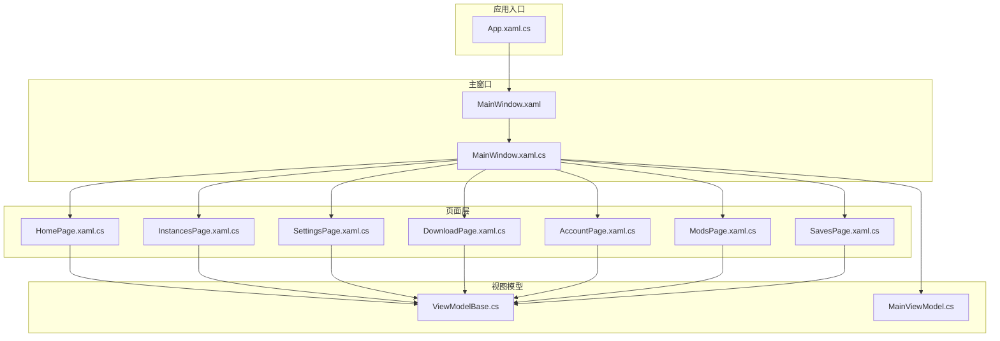
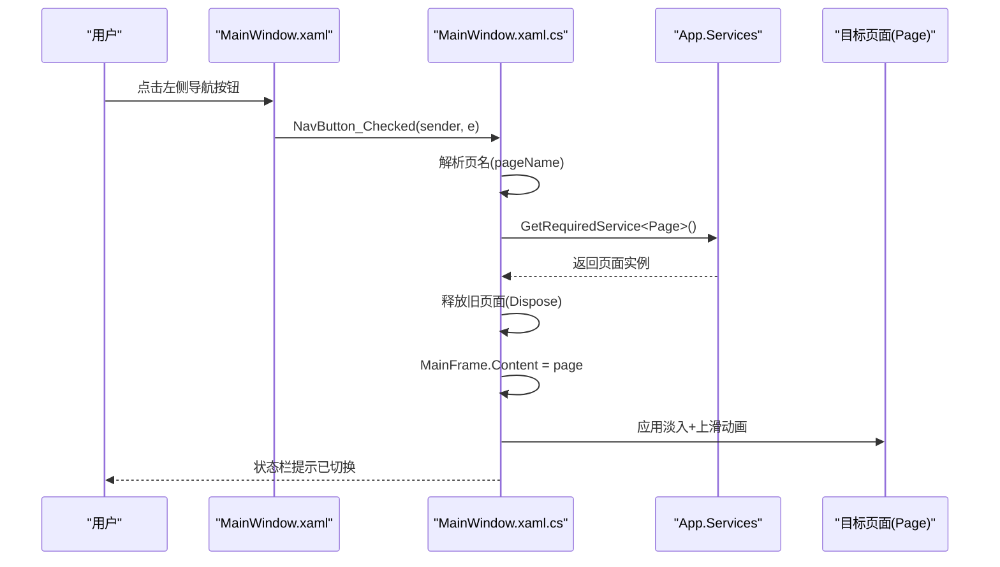
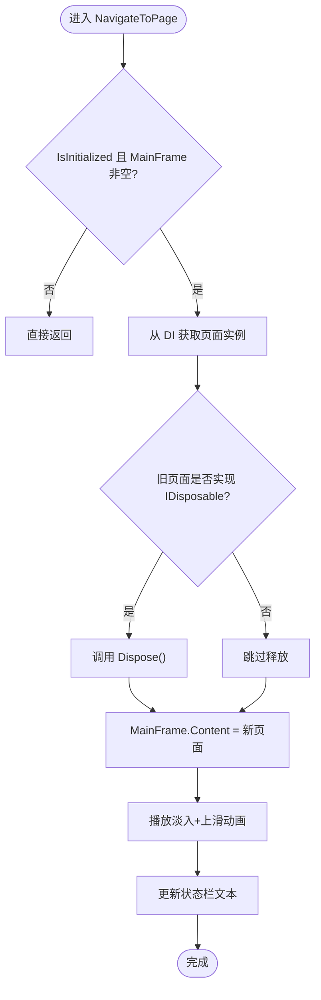
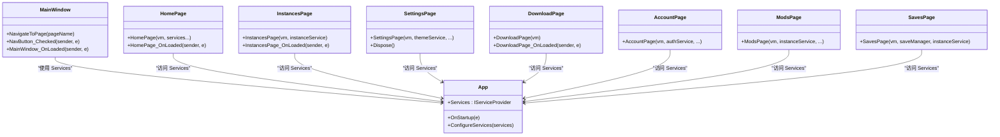

# 页面导航系统

<cite>
**本文引用的文件**   
- [MainWindow.xaml.cs](file://src/FufuLauncher/MainWindow.xaml.cs)
- [MainWindow.xaml](file://src/FufuLauncher/MainWindow.xaml)
- [App.xaml.cs](file://src/FufuLauncher/App.xaml.cs)
- [HomePage.xaml.cs](file://src/FufuLauncher/Views/HomePage.xaml.cs)
- [InstancesPage.xaml.cs](file://src/FufuLauncher/Views/InstancesPage.xaml.cs)
- [SettingsPage.xaml.cs](file://src/FufuLauncher/Views/SettingsPage.xaml.cs)
- [DownloadPage.xaml.cs](file://src/FufuLauncher/Views/DownloadPage.xaml.cs)
- [AccountPage.xaml.cs](file://src/FufuLauncher/Views/AccountPage.xaml.cs)
- [ModsPage.xaml.cs](file://src/FufuLauncher/Views/ModsPage.xaml.cs)
- [SavesPage.xaml.cs](file://src/FufuLauncher/Views/SavesPage.xaml.cs)
- [MainViewModel.cs](file://src/FufuLauncher/ViewModels/MainViewModel.cs)
- [ViewModelBase.cs](file://src/FufuLauncher/ViewModels/ViewModelBase.cs)
</cite>

## 目录
1. [简介](#简介)
2. [项目结构](#项目结构)
3. [核心组件](#核心组件)
4. [架构总览](#架构总览)
5. [详细组件分析](#详细组件分析)
6. [依赖关系分析](#依赖关系分析)
7. [性能考虑](#性能考虑)
8. [故障排查指南](#故障排查指南)
9. [结论](#结论)
10. [附录：扩展新页面的完整指南](#附录扩展新页面的完整指南)

## 简介
本文件为“可爱的芙芙”启动器的页面导航系统提供系统化文档。该导航基于 WPF Frame 控件，采用 MVVM 模式与依赖注入（DI）容器管理页面生命周期、路由与切换动画。文档涵盖 MainWindow 的导航逻辑、页面实例化与参数传递、事件处理、页面间通信模式（事件总线、回调函数、共享状态）、缓存策略与资源清理、过渡动画实现，以及最佳实践与扩展指南。

## 项目结构
- 主窗口承载左侧导航栏与右侧 Frame 内容区域，通过 RadioButton 触发导航。
- App 负责 DI 容器配置，注册服务、视图模型与页面（页面为瞬态 Transient）。
- 各页面类继承自 Page，使用 ViewModel 驱动 UI，并通过 Service 访问业务逻辑。
- 导航由 MainWindow 统一调度，根据页名从 DI 获取页面并设置 MainFrame.Content。

**图表来源** 
- [App.xaml.cs:170-217](file://src/FufuLauncher/App.xaml.cs#L170-L217)
- [MainWindow.xaml:76-116](file://src/FufuLauncher/MainWindow.xaml#L76-L116)
- [MainWindow.xaml.cs:128-186](file://src/FufuLauncher/MainWindow.xaml.cs#L128-L186)

**章节来源**
- [MainWindow.xaml:76-116](file://src/FufuLauncher/MainWindow.xaml#L76-L116)
- [App.xaml.cs:170-217](file://src/FufuLauncher/App.xaml.cs#L170-L217)

## 核心组件
- 主窗口（MainWindow）：承载导航与 Frame，处理按钮 Checked 事件，调用 NavigateToPage；执行淡入与上滑过渡动画；释放旧页面资源。
- 应用入口（App）：构建 DI 容器，注册服务、ViewModel、页面（页面为 Transient），创建并显示 MainWindow。
- 页面（Page）：如 HomePage、InstancesPage、SettingsPage 等，各自初始化 DataContext、订阅服务、处理用户交互。
- 视图模型（ViewModel）：继承 ViewModelBase，提供属性变更通知与命令绑定。

**章节来源**
- [MainWindow.xaml.cs:23-36](file://src/FufuLauncher/MainWindow.xaml.cs#L23-L36)
- [App.xaml.cs:170-217](file://src/FufuLauncher/App.xaml.cs#L170-L217)
- [ViewModelBase.cs:7-21](file://src/FufuLauncher/ViewModels/ViewModelBase.cs#L7-L21)

## 架构总览
导航流程以 MainWindow 为中心：RadioButton 触发 NavButton_Checked，映射到页名后调用 NavigateToPage；NavigateToPage 从 DI 获取页面实例，释放旧页面（若实现 IDisposable），设置 MainFrame.Content，并播放过渡动画。

**图表来源** 
- [MainWindow.xaml.cs:99-186](file://src/FufuLauncher/MainWindow.xaml.cs#L99-L186)
- [App.xaml.cs:205-213](file://src/FufuLauncher/App.xaml.cs#L205-L213)

## 详细组件分析

### 主窗口导航逻辑（MainWindow）
- 加载时默认导航到主页，并启动环境自检与主题背景应用。
- 导航按钮 Checked 事件将 RadioButton 名称映射为页名，调用 NavigateToPage。
- NavigateToPage：
  - 防御性检查 IsInitialized 与 MainFrame 非空。
  - 通过 App.Services 获取页面实例（Transient）。
  - 释放旧页面（IDisposable），避免事件订阅泄漏。
  - 设置 MainFrame.Content 为目标页面。
  - 播放淡入与轻微上滑动画（220ms，CubicEase）。
  - 更新状态栏文本。

**图表来源** 
- [MainWindow.xaml.cs:128-186](file://src/FufuLauncher/MainWindow.xaml.cs#L128-L186)

**章节来源**
- [MainWindow.xaml.cs:38-73](file://src/FufuLauncher/MainWindow.xaml.cs#L38-L73)
- [MainWindow.xaml.cs:99-186](file://src/FufuLauncher/MainWindow.xaml.cs#L99-L186)

### 应用入口与 DI 配置（App）
- OnStartup：
  - 注册全局异常捕获。
  - 初始化双数据目录（GameDataDir 与 ConfigDir）。
  - 创建必要子目录与迁移旧配置/日志。
  - 构建 DI 容器，注册服务、ViewModel、页面（页面为 Transient）。
  - 加载配置，启动内存监控，手动创建并显示 MainWindow。
- OnExit：停止定时器、释放背景资源、刷新日志缓冲。

**章节来源**
- [App.xaml.cs:82-156](file://src/FufuLauncher/App.xaml.cs#L82-L156)
- [App.xaml.cs:170-217](file://src/FufuLauncher/App.xaml.cs#L170-L217)
- [App.xaml.cs:158-168](file://src/FufuLauncher/App.xaml.cs#L158-L168)

### 页面类实现概览
- HomePage：
  - 初始化时加载实例列表、扫描 Java、刷新 Java 选项、重置完整性校验状态。
  - 支持选择实例与 Java、完整性校验、启动游戏、打开日志查看器。
- InstancesPage：
  - 加载实例列表，支持新建、导入、重命名、复制、导出、安装 ModLoader（Forge/Fabric/Quilt）、删除。
- SettingsPage：
  - 加载设置项（下载源、背景、JVM 参数、分辨率、全屏等），支持智能内存参数防抖保存、开发者选项、日志查看器。
  - 实现 IDisposable，离开页面时停止防抖定时器与内存监控。
- DownloadPage：
  - 加载版本清单，支持刷新、搜索、双击安装。
- AccountPage：
  - 支持离线登录、设备码登录、本地回调登录、设置当前账号、删除账号。
- ModsPage：
  - 选择实例后加载模组与资源包，支持拖拽导入、URL 下载、启用/禁用、删除、打开文件夹。
- SavesPage：
  - 选择实例后加载存档，支持重命名、导出、删除。

**章节来源**
- [HomePage.xaml.cs:27-41](file://src/FufuLauncher/Views/HomePage.xaml.cs#L27-L41)
- [InstancesPage.xaml.cs:17-23](file://src/FufuLauncher/Views/InstancesPage.xaml.cs#L17-L23)
- [SettingsPage.xaml.cs:23-44](file://src/FufuLauncher/Views/SettingsPage.xaml.cs#L23-L44)
- [DownloadPage.xaml.cs:13-24](file://src/FufuLauncher/Views/DownloadPage.xaml.cs#L13-L24)
- [AccountPage.xaml.cs:17-27](file://src/FufuLauncher/Views/AccountPage.xaml.cs#L17-L27)
- [ModsPage.xaml.cs:17-26](file://src/FufuLauncher/Views/ModsPage.xaml.cs#L17-L26)
- [SavesPage.xaml.cs:16-24](file://src/FufuLauncher/Views/SavesPage.xaml.cs#L16-L24)

### 页面间通信模式
- 事件总线：未显式实现集中式事件总线，页面间通信主要通过 Service 与 ViewModel 的属性变更通知（INotifyPropertyChanged）。
- 回调函数：部分操作通过异步方法与回调（如设备码登录轮询）。
- 共享状态管理：
  - 配置与实例数据通过 Service（如 InstanceService、ConfigService）在页面间共享。
  - 视图模型作为页面与服务的桥梁，提供属性变更通知。

**章节来源**
- [ViewModelBase.cs:7-21](file://src/FufuLauncher/ViewModels/ViewModelBase.cs#L7-L21)
- [HomePage.xaml.cs:43-65](file://src/FufuLauncher/Views/HomePage.xaml.cs#L43-L65)
- [SettingsPage.xaml.cs:54-100](file://src/FufuLauncher/Views/SettingsPage.xaml.cs#L54-L100)

### 页面缓存策略与资源清理
- 页面缓存：页面为 Transient（每次导航新建），无持久缓存。
- 资源清理：
  - 旧页面若实现 IDisposable，则在切换前调用 Dispose，防止事件订阅泄漏。
  - SettingsPage 在 Dispose 中停止防抖定时器与内存监控。
  - MainWindow 在关闭时释放背景资源与取消事件订阅。

**章节来源**
- [App.xaml.cs:205-213](file://src/FufuLauncher/App.xaml.cs#L205-L213)
- [MainWindow.xaml.cs:148-154](file://src/FufuLauncher/MainWindow.xaml.cs#L148-L154)
- [SettingsPage.xaml.cs:47-52](file://src/FufuLauncher/Views/SettingsPage.xaml.cs#L47-L52)
- [MainWindow.xaml.cs:91-97](file://src/FufuLauncher/MainWindow.xaml.cs#L91-L97)

### 页面动画效果与过渡动画
- 窗口淡入：MainWindow 加载时执行 Opacity 从 0 到 1 的 DoubleAnimation（300ms，QuadraticEase）。
- 页面切换动画：淡入 + 轻微上滑（TranslateTransform.Y 从 8 到 0，220ms，CubicEase），组合 Storyboard 避免干扰。

**章节来源**
- [MainWindow.xaml.cs:38-48](file://src/FufuLauncher/MainWindow.xaml.cs#L38-L48)
- [MainWindow.xaml.cs:156-183](file://src/FufuLauncher/MainWindow.xaml.cs#L156-L183)

## 依赖关系分析
- MainWindow 依赖 App.Services 获取页面实例。
- 页面依赖各自的 ViewModel 与 Service。
- App 负责所有服务、ViewModel、页面的注册与生命周期管理。

**图表来源** 
- [MainWindow.xaml.cs:128-186](file://src/FufuLauncher/MainWindow.xaml.cs#L128-L186)
- [App.xaml.cs:170-217](file://src/FufuLauncher/App.xaml.cs#L170-L217)
- [HomePage.xaml.cs:27-41](file://src/FufuLauncher/Views/HomePage.xaml.cs#L27-L41)
- [InstancesPage.xaml.cs:17-23](file://src/FufuLauncher/Views/InstancesPage.xaml.cs#L17-L23)
- [SettingsPage.xaml.cs:23-44](file://src/FufuLauncher/Views/SettingsPage.xaml.cs#L23-L44)
- [DownloadPage.xaml.cs:13-24](file://src/FufuLauncher/Views/DownloadPage.xaml.cs#L13-L24)
- [AccountPage.xaml.cs:17-27](file://src/FufuLauncher/Views/AccountPage.xaml.cs#L17-L27)
- [ModsPage.xaml.cs:17-26](file://src/FufuLauncher/Views/ModsPage.xaml.cs#L17-L26)
- [SavesPage.xaml.cs:16-24](file://src/FufuLauncher/Views/SavesPage.xaml.cs#L16-L24)

**章节来源**
- [MainWindow.xaml.cs:128-186](file://src/FufuLauncher/MainWindow.xaml.cs#L128-L186)
- [App.xaml.cs:170-217](file://src/FufuLauncher/App.xaml.cs#L170-L217)

## 性能考虑
- 页面瞬态创建：每次导航新建页面，避免状态污染，但需注意频繁创建的性能开销。建议对重型初始化进行延迟加载或缓存。
- 动画性能：使用轻量级 DoubleAnimation 与 TranslateTransform，时长控制在 200-300ms，确保流畅。
- 资源清理：及时释放 IDisposable 对象，避免事件订阅泄漏与内存占用。
- 后台任务：网络请求与文件操作使用异步方法，避免阻塞 UI 线程。
- 日志写入：使用队列与 Timer 批量写入，减少 IO 频率。

[本节为通用指导，不直接分析具体文件]

## 故障排查指南
- 导航失败：检查 IsInitialized 与 MainFrame 是否为空；确认 DI 容器中已注册对应页面。
- 页面未释放：确认页面实现 IDisposable 并在 NavigateToPage 中调用；检查事件订阅是否正确解除。
- 动画异常：检查动画属性与 EasingFunction 配置；确保 BeginAnimation 未被重复调用。
- 资源泄漏：在 App.OnExit 与 MainWindow.OnClosed 中释放背景资源与定时器。

**章节来源**
- [MainWindow.xaml.cs:128-186](file://src/FufuLauncher/MainWindow.xaml.cs#L128-L186)
- [App.xaml.cs:158-168](file://src/FufuLauncher/App.xaml.cs#L158-L168)

## 结论
本导航系统基于 WPF Frame 与 MVVM 模式，结合 DI 容器实现了清晰的页面路由与生命周期管理。通过统一的导航逻辑、动画效果与资源清理机制，确保了用户体验与系统稳定性。扩展新页面只需遵循现有模式，即可无缝集成。

[本节为总结，不直接分析具体文件]

## 附录：扩展新页面的完整指南
1. 创建页面类：
   - 新建继承自 Page 的类（如 NewPage.xaml.cs）。
   - 在构造函数中初始化 InitializeComponent 与 DataContext。
   - 在 Loaded 事件中执行必要的初始化逻辑。

2. 注册页面：
   - 在 App.ConfigureServices 中注册页面为 Transient（services.AddTransient<NewPage>()）。

3. 添加导航项：
   - 在 MainWindow.xaml 中添加 RadioButton，设置 GroupName="Nav" 与 Checked="NavButton_Checked"。
   - 在 MainWindow.xaml.cs 的 NavButton_Checked 中映射 RadioButton 名称到页名。
   - 在 NavigateToPage 的 switch 语句中添加页名到页面类型的映射。

4. 实现页面逻辑：
   - 使用 ViewModel 驱动 UI，通过 Service 访问业务逻辑。
   - 如需资源清理，实现 IDisposable 并在 Dispose 中释放资源。

5. 测试与验证：
   - 运行应用，点击新导航项，确认页面正确显示与动画效果。
   - 检查资源释放与事件订阅是否正常。

**章节来源**
- [App.xaml.cs:205-213](file://src/FufuLauncher/App.xaml.cs#L205-L213)
- [MainWindow.xaml.cs:99-186](file://src/FufuLauncher/MainWindow.xaml.cs#L99-L186)