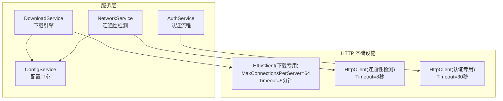
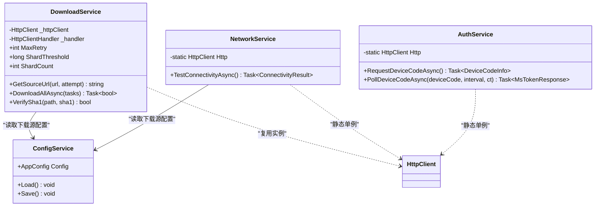
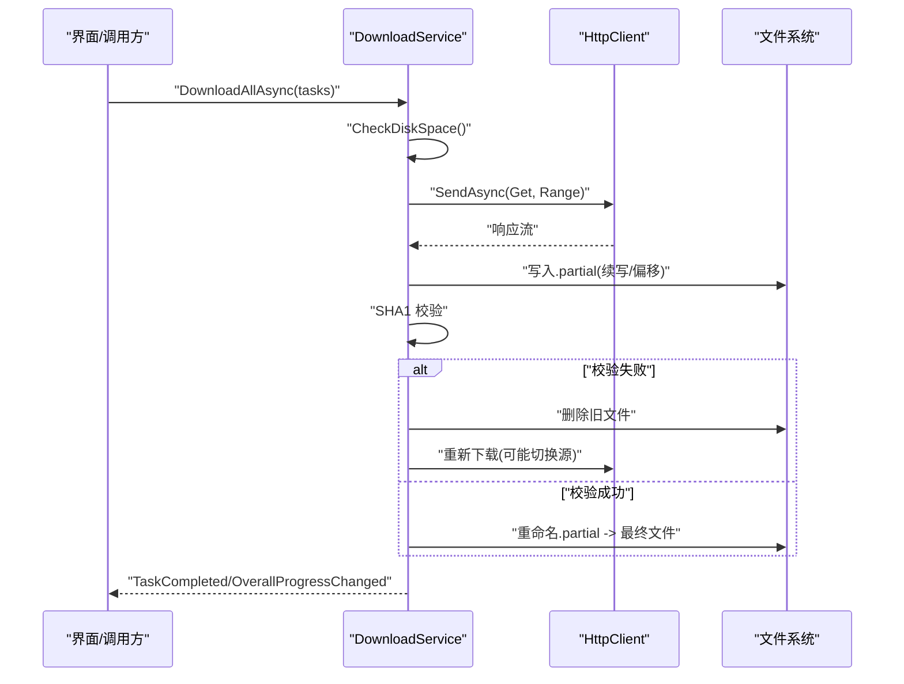
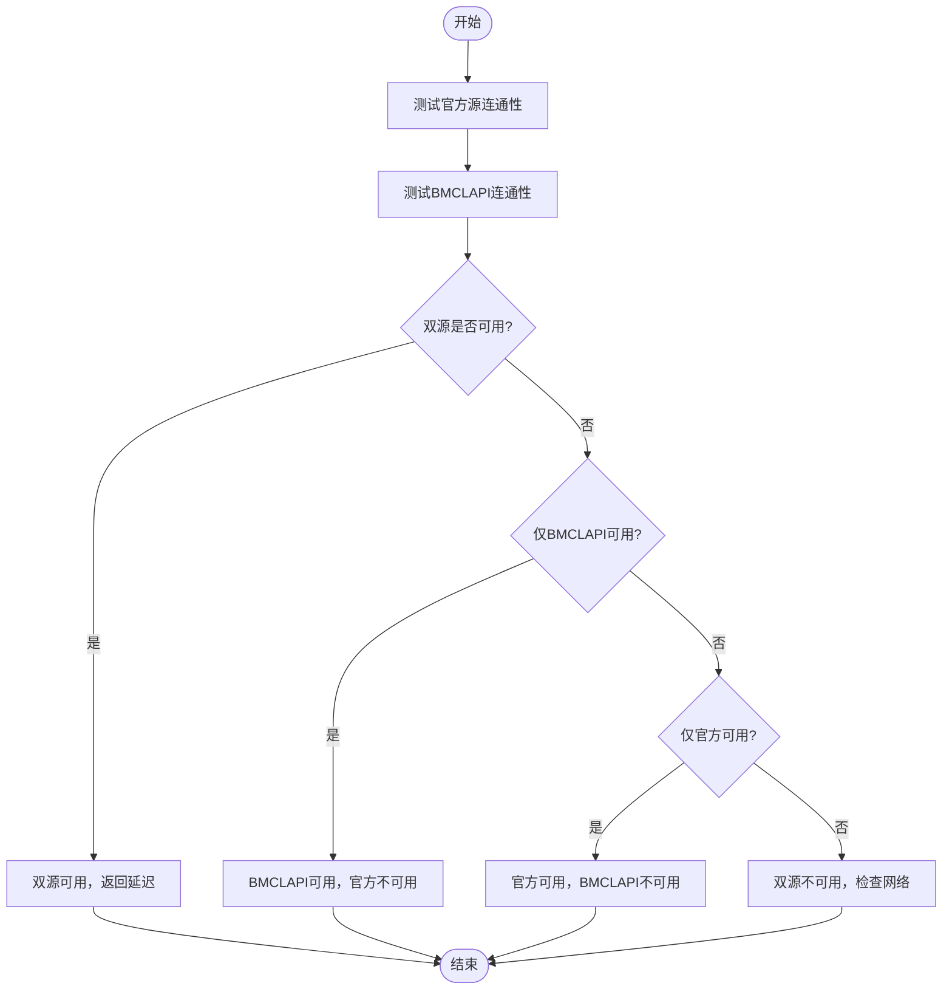
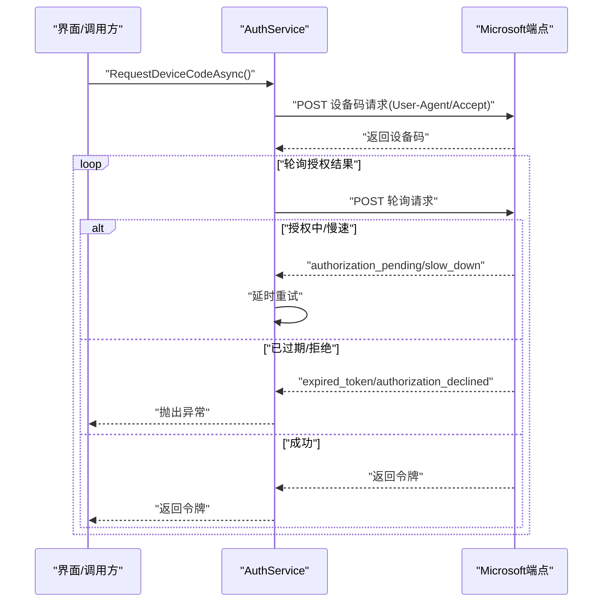
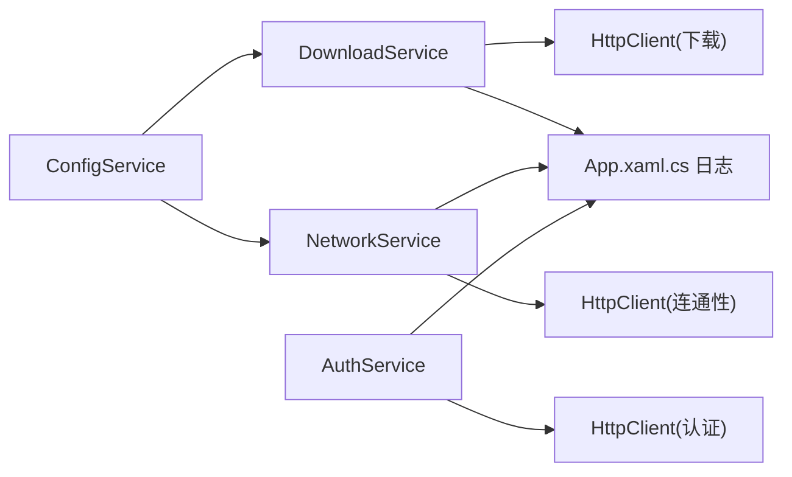

# HTTP 客户端管理

<cite>
**本文引用的文件**   
- [NetworkService.cs](file://src/FufuLauncher/Services/NetworkService.cs)
- [DownloadService.cs](file://src/FufuLauncher/Services/DownloadService.cs)
- [AuthService.cs](file://src/FufuLauncher/Services/AuthService.cs)
- [ConfigService.cs](file://src/FufuLauncher/Services/ConfigService.cs)
- [App.xaml.cs](file://src/FufuLauncher/App.xaml.cs)
</cite>

## 目录
1. [简介](#简介)
2. [项目结构](#项目结构)
3. [核心组件](#核心组件)
4. [架构总览](#架构总览)
5. [详细组件分析](#详细组件分析)
6. [依赖关系分析](#依赖关系分析)
7. [性能考量与调优](#性能考量与调优)
8. [故障排查指南](#故障排查指南)
9. [结论](#结论)
10. [附录](#附录)

## 简介
本文件面向“可爱的芙芙启动器”的 HTTP 客户端管理系统，聚焦 HttpClient 的配置、生命周期、连接池与超时策略、User-Agent 配置与多源兼容性、连接复用与性能优化、错误处理与重试机制（含指数退避与自动故障转移），以及调试与监控方法。文档基于源码实现进行说明，帮助读者快速理解并正确调优下载与网络请求行为。

## 项目结构
与 HTTP 客户端管理相关的核心代码集中在 Services 层：
- NetworkService：轻量连通性检测，使用独立 HttpClient 实例，设置较短超时与 User-Agent。
- DownloadService：核心下载引擎，集中管理 HttpClient 生命周期、连接池、分片断点续传、重试与校验。
- AuthService：认证流程中的 HTTP 调用，统一注入 User-Agent 与 Accept 头，避免服务端限流或拒绝。
- ConfigService：提供下载源等配置项，驱动下载源切换与镜像映射。
- App.xaml.cs：应用级日志与异常捕获，为 HTTP 问题定位提供支撑。

图表来源
- [DownloadService.cs:103-114](file://src/FufuLauncher/Services/DownloadService.cs#L103-L114)
- [NetworkService.cs:20-29](file://src/FufuLauncher/Services/NetworkService.cs#L20-L29)
- [AuthService.cs:94-100](file://src/FufuLauncher/Services/AuthService.cs#L94-L100)
- [ConfigService.cs:13-79](file://src/FufuLauncher/Services/ConfigService.cs#L13-L79)

章节来源
- [NetworkService.cs:1-95](file://src/FufuLauncher/Services/NetworkService.cs#L1-L95)
- [DownloadService.cs:1-592](file://src/FufuLauncher/Services/DownloadService.cs#L1-L592)
- [AuthService.cs:85-120](file://src/FufuLauncher/Services/AuthService.cs#L85-L120)
- [ConfigService.cs:1-148](file://src/FufuLauncher/Services/ConfigService.cs#L1-L148)
- [App.xaml.cs:40-80](file://src/FufuLauncher/App.xaml.cs#L40-L80)

## 核心组件
- HttpClient 生命周期管理
  - 下载专用 HttpClient：在 DownloadService 构造时创建，绑定 HttpClientHandler 以控制连接池与压缩策略，设置全局超时；所有下载任务复用该实例，避免频繁创建销毁带来的端口耗尽与 DNS 抖动。
  - 连通性检测 HttpClient：NetworkService 内静态单例，短超时用于快速探测官方源与 BMCLAPI 可用性。
  - 认证专用 HttpClient：AuthService 内静态单例，设置较短超时与必要请求头，确保微软端点鉴权链路稳定。

- 连接池与并发控制
  - MaxConnectionsPerServer：下载专用 HttpClientHandler 设置为较高值，提升大文件与多分片并发能力。
  - 类别隔离信号量：按任务类别（游戏、资源、Java、模组）分别限制并发，避免相互阻塞。

- 超时控制策略
  - 全局超时：下载专用 HttpClient 设置较长超时，适配大文件下载。
  - 请求级首字节超时：每个请求通过 CancellationTokenSource 设置首字节超时，防止连接卡死。
  - 连通性检测短超时：快速失败，减少 UI 等待时间。

- User-Agent 与兼容处理
  - 统一注入 User-Agent 字符串，避免 Mojang/BMCLAPI/Microsoft 端点因缺少 UA 而限流或拒绝。
  - 下载源自动降级：当配置为 Mojang 且首次失败时，强制切换到 BMCLAPI 国内镜像，提升稳定性。

章节来源
- [DownloadService.cs:103-114](file://src/FufuLauncher/Services/DownloadService.cs#L103-L114)
- [DownloadService.cs:69-73](file://src/FufuLauncher/Services/DownloadService.cs#L69-L73)
- [DownloadService.cs:404-407](file://src/FufuLauncher/Services/DownloadService.cs#L404-L407)
- [NetworkService.cs:20-29](file://src/FufuLauncher/Services/NetworkService.cs#L20-L29)
- [AuthService.cs:94-100](file://src/FufuLauncher/Services/AuthService.cs#L94-L100)
- [DownloadService.cs:171-210](file://src/FufuLauncher/Services/DownloadService.cs#L171-L210)

## 架构总览
下图展示各服务与 HttpClient 的关系及关键配置点：

图表来源
- [DownloadService.cs:56-114](file://src/FufuLauncher/Services/DownloadService.cs#L56-L114)
- [NetworkService.cs:18-29](file://src/FufuLauncher/Services/NetworkService.cs#L18-L29)
- [AuthService.cs:85-100](file://src/FufuLauncher/Services/AuthService.cs#L85-L100)
- [ConfigService.cs:81-148](file://src/FufuLauncher/Services/ConfigService.cs#L81-L148)

## 详细组件分析

### 下载服务（DownloadService）
- 连接池与超时
  - 通过 HttpClientHandler 设置 MaxConnectionsPerServer，提高高并发下载能力。
  - 全局 Timeout 设置为较长时长，适配大文件下载场景。
  - 每个请求附加首字节超时，避免连接卡死导致整体阻塞。

- 分片与断点续传
  - 大于阈值的大文件采用 Range 分片并发下载，小文件使用单连接断点续传。
  - 使用 .partial 临时文件记录进度，支持中断后继续。

- 重试与校验
  - 默认最大重试次数可配置，失败后进行指数退避延迟。
  - 下载完成后进行 SHA1 校验，失败则删除并重下一次。

- 下载源切换与容错
  - 根据配置选择官方源或 BMCLAPI；若官方源失败，自动降级到 BMCLAPI。
  - 对常见 Mojang 域名进行镜像替换，保证国内访问稳定性。

图表来源
- [DownloadService.cs:222-261](file://src/FufuLauncher/Services/DownloadService.cs#L222-L261)
- [DownloadService.cs:369-451](file://src/FufuLauncher/Services/DownloadService.cs#L369-L451)
- [DownloadService.cs:454-547](file://src/FufuLauncher/Services/DownloadService.cs#L454-L547)
- [DownloadService.cs:584-591](file://src/FufuLauncher/Services/DownloadService.cs#L584-L591)

章节来源
- [DownloadService.cs:103-114](file://src/FufuLauncher/Services/DownloadService.cs#L103-L114)
- [DownloadService.cs:171-210](file://src/FufuLauncher/Services/DownloadService.cs#L171-L210)
- [DownloadService.cs:295-366](file://src/FufuLauncher/Services/DownloadService.cs#L295-L366)
- [DownloadService.cs:369-451](file://src/FufuLauncher/Services/DownloadService.cs#L369-L451)
- [DownloadService.cs:454-547](file://src/FufuLauncher/Services/DownloadService.cs#L454-L547)
- [DownloadService.cs:584-591](file://src/FufuLauncher/Services/DownloadService.cs#L584-L591)

### 连通性检测（NetworkService）
- 使用静态 HttpClient 实例，设置短超时，快速探测官方源与 BMCLAPI 可用性。
- 返回连通状态与延迟信息，供 UI 显示与后续决策。

图表来源
- [NetworkService.cs:34-76](file://src/FufuLauncher/Services/NetworkService.cs#L34-L76)

章节来源
- [NetworkService.cs:20-29](file://src/FufuLauncher/Services/NetworkService.cs#L20-L29)
- [NetworkService.cs:34-76](file://src/FufuLauncher/Services/NetworkService.cs#L34-L76)

### 认证服务（AuthService）
- 统一注入 User-Agent 与 Accept 头，避免 Microsoft 端点鉴权失败。
- 设备码登录与轮询过程中，捕获网络异常并进行延时重试，保障令牌交换链路稳定。

图表来源
- [AuthService.cs:160-192](file://src/FufuLauncher/Services/AuthService.cs#L160-L192)
- [AuthService.cs:198-265](file://src/FufuLauncher/Services/AuthService.cs#L198-L265)

章节来源
- [AuthService.cs:94-100](file://src/FufuLauncher/Services/AuthService.cs#L94-L100)
- [AuthService.cs:160-192](file://src/FufuLauncher/Services/AuthService.cs#L160-L192)
- [AuthService.cs:198-265](file://src/FufuLauncher/Services/AuthService.cs#L198-L265)

### 配置服务（ConfigService）
- 提供下载源（Mojang/BMCLAPI）、Java 镜像、JVM 参数等配置项。
- 下载源影响 URL 映射与自动降级逻辑。

章节来源
- [ConfigService.cs:13-79](file://src/FufuLauncher/Services/ConfigService.cs#L13-L79)

## 依赖关系分析
- DownloadService 依赖 ConfigService 获取下载源配置，决定 URL 映射与降级策略。
- NetworkService 与 AuthService 各自持有独立 HttpClient 实例，避免互相干扰。
- 所有服务通过 App.xaml.cs 的日志与异常捕获机制输出诊断信息。

图表来源
- [DownloadService.cs:56-114](file://src/FufuLauncher/Services/DownloadService.cs#L56-L114)
- [NetworkService.cs:18-29](file://src/FufuLauncher/Services/NetworkService.cs#L18-L29)
- [AuthService.cs:85-100](file://src/FufuLauncher/Services/AuthService.cs#L85-L100)
- [ConfigService.cs:81-148](file://src/FufuLauncher/Services/ConfigService.cs#L81-L148)
- [App.xaml.cs:40-80](file://src/FufuLauncher/App.xaml.cs#L40-L80)

章节来源
- [DownloadService.cs:171-210](file://src/FufuLauncher/Services/DownloadService.cs#L171-L210)
- [App.xaml.cs:40-80](file://src/FufuLauncher/App.xaml.cs#L40-L80)

## 性能考量与调优
- 连接池与并发
  - 合理设置 MaxConnectionsPerServer，避免系统端口耗尽与服务端限流。
  - 按任务类别使用独立信号量，隔离不同下载类型的并发，避免相互阻塞。

- 超时策略
  - 全局超时用于长耗时下载，请求级首字节超时用于快速失败保护。
  - 连通性检测使用短超时，降低 UI 卡顿。

- 分片与缓存
  - 大文件分片并发下载提升吞吐；小文件单连接断点续传减少开销。
  - 使用 .partial 文件避免重复下载，结合 SHA1 校验保证完整性。

- User-Agent 与头部
  - 统一注入 User-Agent 与 Accept 头，避免服务端限流或鉴权失败。

- 重试与退避
  - 指数退避降低瞬时失败对系统的影响，提升整体成功率。

[本节为通用指导，不直接分析具体文件]

## 故障排查指南
- 日志查看
  - 应用级日志通过 App.xaml.cs 的 WriteAppLog 批量写入 app.log，便于定位网络异常与下载失败原因。
  - 下载失败会记录重试次数与错误信息，便于追踪问题根因。

- 常见问题
  - 连接卡死：检查请求级首字节超时是否生效，确认服务端是否支持 Range。
  - 鉴权失败：确认 User-Agent 与 Accept 头是否正确注入。
  - 下载失败：查看 SHA1 校验与重试日志，必要时切换下载源。

章节来源
- [App.xaml.cs:40-80](file://src/FufuLauncher/App.xaml.cs#L40-L80)
- [DownloadService.cs:295-366](file://src/FufuLauncher/Services/DownloadService.cs#L295-L366)
- [AuthService.cs:198-265](file://src/FufuLauncher/Services/AuthService.cs#L198-L265)

## 结论
本项目的 HTTP 客户端管理通过统一的 HttpClient 生命周期、合理的连接池与超时策略、稳定的 User-Agent 配置与多源兼容性处理，实现了高效可靠的下载与认证流程。配合分片断点续传、指数退避重试与自动故障转移，显著提升了用户体验与系统鲁棒性。建议在生产环境中持续监控日志与性能指标，按需调整连接池大小与超时参数，以获得最佳效果。

[本节为总结，不直接分析具体文件]

## 附录
- 最佳实践清单
  - 始终为 HttpClient 设置合适的 MaxConnectionsPerServer 与 Timeout。
  - 为所有 HTTP 请求注入 User-Agent 与必要的 Accept 头。
  - 使用请求级首字节超时保护连接卡死。
  - 对大文件启用分片下载，对小文件使用断点续传。
  - 实施指数退避重试与自动故障转移。
  - 利用日志与异常捕获机制进行问题定位。

[本节为通用指导，不直接分析具体文件]