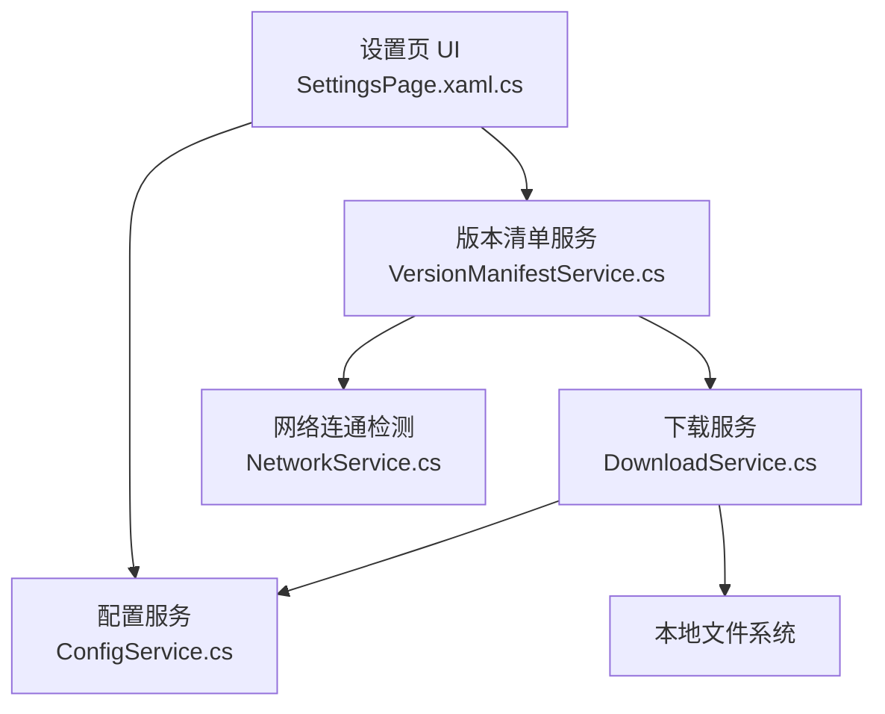
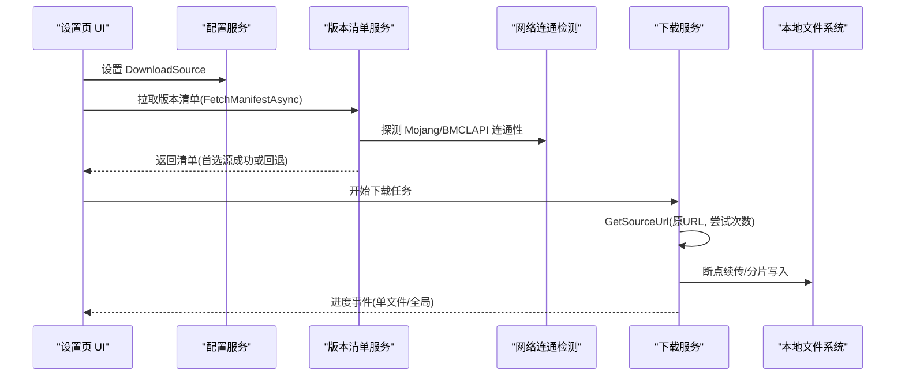
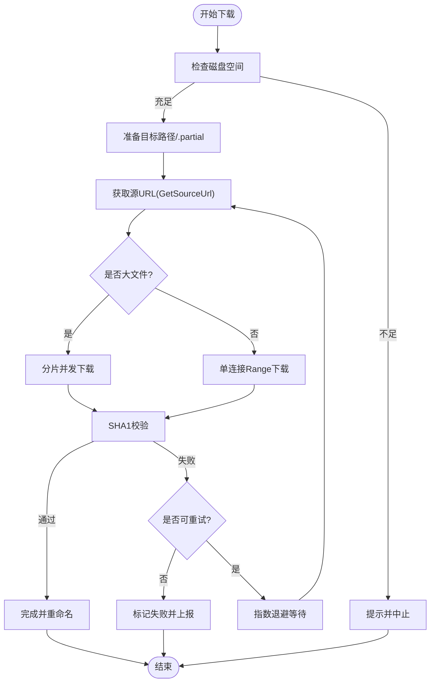
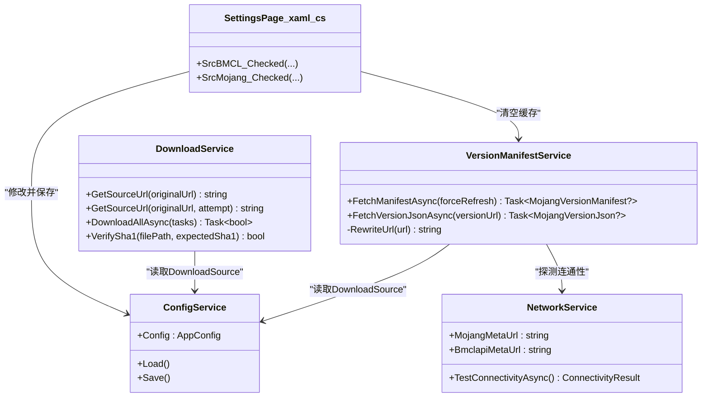

# 下载源管理

<cite>
**本文引用的文件**
- [DownloadService.cs](file://src/FufuLauncher/Services/DownloadService.cs)
- [NetworkService.cs](file://src/FufuLauncher/Services/NetworkService.cs)
- [ConfigService.cs](file://src/FufuLauncher/Services/ConfigService.cs)
- [VersionManifestService.cs](file://src/FufuLauncher/Services/VersionManifestService.cs)
- [SettingsPage.xaml.cs](file://src/FufuLauncher/Views/SettingsPage.xaml.cs)
- [config.json](file://Start/appmcGAME/config.json)
</cite>

## 目录
1. [简介](#简介)
2. [项目结构](#项目结构)
3. [核心组件](#核心组件)
4. [架构总览](#架构总览)
5. [详细组件分析](#详细组件分析)
6. [依赖关系分析](#依赖关系分析)
7. [性能考量](#性能考量)
8. [故障排查指南](#故障排查指南)
9. [结论](#结论)
10. [附录：URL 映射与配置扩展](#附录url-映射与配置扩展)

## 简介
本文件为“可爱的芙芙启动器”的下载源管理系统提供完整技术文档。重点覆盖：
- 官方源（Mojang）与镜像源（BMCLAPI）的配置与切换机制
- URL 转换规则（Mojang 域名到 BMCLAPI 域名的映射）
- 故障转移策略（官方源失败自动降级、DNS 容错、连接超时控制）
- 下载源选择逻辑与重试机制
- 下载源配置的自定义方法与扩展接口

## 项目结构
下载源相关能力由以下服务协同实现：
- ConfigService：持久化用户配置，包含 DownloadSource（Mojang/BMCLAPI）等
- NetworkService：网络连通性检测（Mojang/BMCLAPI），返回延迟与可用性
- VersionManifestService：版本清单拉取，具备首选/回退源策略与 URL 重写
- DownloadService：下载引擎，负责断点续传、分片并发、SHA1 校验、源切换与重试
- SettingsPage.xaml.cs：设置页 UI，支持用户在界面中切换下载源并保存

图表来源
- [SettingsPage.xaml.cs:120-134](file://src/FufuLauncher/Views/SettingsPage.xaml.cs#L120-L134)
- [ConfigService.cs:13-79](file://src/FufuLauncher/Services/ConfigService.cs#L13-L79)
- [VersionManifestService.cs:172-292](file://src/FufuLauncher/Services/VersionManifestService.cs#L172-L292)
- [NetworkService.cs:18-94](file://src/FufuLauncher/Services/NetworkService.cs#L18-L94)
- [DownloadService.cs:56-210](file://src/FufuLauncher/Services/DownloadService.cs#L56-L210)

章节来源
- [ConfigService.cs:13-79](file://src/FufuLauncher/Services/ConfigService.cs#L13-L79)
- [SettingsPage.xaml.cs:120-134](file://src/FufuLauncher/Views/SettingsPage.xaml.cs#L120-L134)

## 核心组件
- 配置服务（ConfigService）
  - 维护 DownloadSource 字段（"Mojang"/"BMCLAPI"），默认值为 "BMCLAPI"
  - 提供 Load/Save 方法将配置写入 config.json
- 网络连通检测（NetworkService）
  - 定义 Mojang 与 BMCLAPI 的元数据端点常量
  - TestConnectivityAsync 并行探测两端可达性与延迟
- 版本清单服务（VersionManifestService）
  - FetchManifestAsync 根据当前 DownloadSource 决定首选源，失败时回退另一源
  - RewriteUrl 与 DownloadService 保持一致的 URL 重写规则
- 下载服务（DownloadService）
  - GetSourceUrl/GetSourceUrl(originalUrl, attempt) 提供源选择与失败降级
  - ForceBmclUrl 实现 Mojang → BMCLAPI 的域名替换
  - 下载流程包含断点续传、分片并发、指数退避重试、SHA1 校验

章节来源
- [ConfigService.cs:13-79](file://src/FufuLauncher/Services/ConfigService.cs#L13-L79)
- [NetworkService.cs:18-94](file://src/FufuLauncher/Services/NetworkService.cs#L18-L94)
- [VersionManifestService.cs:172-292](file://src/FufuLauncher/Services/VersionManifestService.cs#L172-L292)
- [DownloadService.cs:56-210](file://src/FufuLauncher/Services/DownloadService.cs#L56-L210)

## 架构总览
下载源管理的整体流程如下：
- 用户在设置页切换 DownloadSource（Mojang/BMCLAPI）
- 版本清单服务按配置优先访问对应元数据端点，失败则回退
- 下载服务在发起请求前通过 GetSourceUrl 进行 URL 重写；若首次尝试失败且配置为 Mojang，则强制切换到 BMCLAPI 重试
- 所有 HTTP 请求均携带 User-Agent，避免被限流或拒绝
- 下载过程支持断点续传、分片并发、SHA1 校验与指数退避重试

图表来源
- [SettingsPage.xaml.cs:120-134](file://src/FufuLauncher/Views/SettingsPage.xaml.cs#L120-L134)
- [VersionManifestService.cs:205-255](file://src/FufuLauncher/Services/VersionManifestService.cs#L205-L255)
- [NetworkService.cs:34-76](file://src/FufuLauncher/Services/NetworkService.cs#L34-L76)
- [DownloadService.cs:171-210](file://src/FufuLauncher/Services/DownloadService.cs#L171-L210)

## 详细组件分析

### 配置服务（ConfigService）
- 关键属性
  - DownloadSource：取值 "Mojang" 或 "BMCLAPI"，默认 "BMCLAPI"
  - JavaDownloadMirror：Java 运行库下载镜像（不影响游戏本体下载源）
- 行为
  - Load：从 config.json 反序列化，兼容旧背景配置迁移
  - Save：序列化为 JSON，异常不抛出以保证稳定性

章节来源
- [ConfigService.cs:13-79](file://src/FufuLauncher/Services/ConfigService.cs#L13-L79)
- [ConfigService.cs:94-146](file://src/FufuLauncher/Services/ConfigService.cs#L94-L146)
- [config.json:1-36](file://Start/appmcGAME/config.json#L1-L36)

### 网络连通检测（NetworkService）
- 端点常量
  - MojangMetaUrl：piston-meta.mojang.com 的版本清单端点
  - BmclapiMetaUrl：bmclapi2.bangbang93.com 的等价端点
- 行为
  - TestConnectivityAsync：分别探测两个端点的状态码与耗时，汇总消息
  - 使用 HttpClient 超时 8s，User-Agent 固定为启动器标识

章节来源
- [NetworkService.cs:18-94](file://src/FufuLauncher/Services/NetworkService.cs#L18-L94)

### 版本清单服务（VersionManifestService）
- 首选/回退策略
  - 根据 Config.DownloadSource 决定 firstUrl/fallbackUrl
  - 首选源失败后自动回退另一源，最终仍失败则返回缓存（如有）
- URL 重写
  - RewriteUrl 与 DownloadService 保持一致的域名替换规则，确保各模块一致

章节来源
- [VersionManifestService.cs:172-292](file://src/FufuLauncher/Services/VersionManifestService.cs#L172-L292)

### 下载服务（DownloadService）
- 源选择与降级
  - GetSourceUrl(originalUrl)：按配置返回原 URL 或 BMCLAPI 镜像 URL
  - GetSourceUrl(originalUrl, attempt)：attempt>0 且配置为 Mojang 时强制切 BMCLAPI
- 域名映射（ForceBmclUrl）
  - piston-meta.mojang.com → bmclapi2.bangbang93.com
  - launchermeta.mojang.com → bmclapi2.bangbang93.com
  - piston-data.mojang.com → bmclapi2.bangbang93.com
  - libraries.minecraft.net → bmclapi2.bangbang93.com/maven
  - resources.download.minecraft.net → bmclapi2.bangbang93.com
- 下载特性
  - 断点续传：.partial 临时文件 + Range 请求
  - 大文件分片：>=8MB 自动分片并发下载
  - SHA1 校验：失败删除重下（最多一次）
  - 指数退避重试：默认 MaxRetry=3
  - 全局/单文件双进度：节流更新，保证视觉平滑
  - 每请求首字节超时 30s，HttpClient 总超时 5min
  - 磁盘空间预检：预留 1GB 缓冲

图表来源
- [DownloadService.cs:222-366](file://src/FufuLauncher/Services/DownloadService.cs#L222-L366)
- [DownloadService.cs:368-451](file://src/FufuLauncher/Services/DownloadService.cs#L368-L451)
- [DownloadService.cs:453-547](file://src/FufuLauncher/Services/DownloadService.cs#L453-L547)
- [DownloadService.cs:583-590](file://src/FufuLauncher/Services/DownloadService.cs#L583-L590)

章节来源
- [DownloadService.cs:56-210](file://src/FufuLauncher/Services/DownloadService.cs#L56-L210)
- [DownloadService.cs:222-366](file://src/FufuLauncher/Services/DownloadService.cs#L222-L366)
- [DownloadService.cs:368-451](file://src/FufuLauncher/Services/DownloadService.cs#L368-L451)
- [DownloadService.cs:453-547](file://src/FufuLauncher/Services/DownloadService.cs#L453-L547)
- [DownloadService.cs:583-590](file://src/FufuLauncher/Services/DownloadService.cs#L583-L590)

### 设置页（SettingsPage.xaml.cs）
- 用户交互
  - SrcBMCL_Checked / SrcMojang_Checked：切换 DownloadSource 并保存，同时清空版本清单缓存
- 其他
  - 页面加载时恢复 DownloadSource 选中状态
  - 保存按钮用于保存其他设置项

章节来源
- [SettingsPage.xaml.cs:120-134](file://src/FufuLauncher/Views/SettingsPage.xaml.cs#L120-L134)
- [SettingsPage.xaml.cs:54-100](file://src/FufuLauncher/Views/SettingsPage.xaml.cs#L54-L100)

## 依赖关系分析
- DownloadService 依赖 ConfigService 读取 DownloadSource
- VersionManifestService 依赖 ConfigService 与 NetworkService
- SettingsPage.xaml.cs 依赖 ConfigService 与 VersionManifestService
- NetworkService 独立，仅依赖 System.Net.Http

图表来源
- [ConfigService.cs:81-146](file://src/FufuLauncher/Services/ConfigService.cs#L81-L146)
- [NetworkService.cs:18-94](file://src/FufuLauncher/Services/NetworkService.cs#L18-L94)
- [VersionManifestService.cs:172-292](file://src/FufuLauncher/Services/VersionManifestService.cs#L172-L292)
- [DownloadService.cs:56-210](file://src/FufuLauncher/Services/DownloadService.cs#L56-L210)
- [SettingsPage.xaml.cs:120-134](file://src/FufuLauncher/Views/SettingsPage.xaml.cs#L120-L134)

章节来源
- [ConfigService.cs:81-146](file://src/FufuLauncher/Services/ConfigService.cs#L81-L146)
- [NetworkService.cs:18-94](file://src/FufuLauncher/Services/NetworkService.cs#L18-L94)
- [VersionManifestService.cs:172-292](file://src/FufuLauncher/Services/VersionManifestService.cs#L172-L292)
- [DownloadService.cs:56-210](file://src/FufuLauncher/Services/DownloadService.cs#L56-L210)
- [SettingsPage.xaml.cs:120-134](file://src/FufuLauncher/Views/SettingsPage.xaml.cs#L120-L134)

## 性能考量
- 分片并发：大文件（≥8MB）自动分片，提高吞吐
- 断点续传：.partial 文件与 Range 请求减少重复下载
- 进度节流：全局进度 150ms 节流，提升 UI 流畅度
- 超时控制：每请求 30s 首字节超时，HttpClient 总超时 5min
- 指数退避：失败重试采用 1s、2s、4s... 退避，降低服务端压力
- 磁盘预检：下载前预留 1GB 缓冲，避免中途失败

[本节为通用指导，无需引用具体文件]

## 故障排查指南
- 无法访问任何源
  - 使用 NetworkService.TestConnectivityAsync 检查 Mojang/BMCLAPI 连通性与延迟
  - 确认 DNS 解析正常，必要时更换 DNS
- 官方源频繁超时
  - 将 DownloadSource 设置为 "BMCLAPI"，或在首次失败后自动降级
  - 检查防火墙/代理设置
- 下载中断或进度卡住
  - 检查 .partial 文件是否存在，确认断点续传逻辑生效
  - 查看日志中的 SHA1 校验失败记录，确认文件完整性
- 版本清单拉取失败
  - 确认 VersionManifestService 的首选/回退策略是否生效
  - 切换 DownloadSource 后调用 ClearCache 刷新缓存

章节来源
- [NetworkService.cs:34-76](file://src/FufuLauncher/Services/NetworkService.cs#L34-L76)
- [VersionManifestService.cs:205-255](file://src/FufuLauncher/Services/VersionManifestService.cs#L205-L255)
- [DownloadService.cs:319-334](file://src/FufuLauncher/Services/DownloadService.cs#L319-L334)

## 结论
下载源管理系统以 ConfigService 为中心，结合 NetworkService 的连通性检测、VersionManifestService 的首选/回退策略以及 DownloadService 的健壮下载能力，实现了稳定可靠的 Mojang/BMCLAPI 双源支持与自动降级。系统具备完善的 URL 映射、重试与校验机制，满足国内网络环境下的稳定下载需求。

[本节为总结，无需引用具体文件]

## 附录：URL 映射与配置扩展

### URL 映射规则（Mojang → BMCLAPI）
- piston-meta.mojang.com → bmclapi2.bangbang93.com
- launchermeta.mojang.com → bmclapi2.bangbang93.com
- piston-data.mojang.com → bmclapi2.bangbang93.com
- libraries.minecraft.net → bmclapi2.bangbang93.com/maven
- resources.download.minecraft.net → bmclapi2.bangbang93.com

章节来源
- [DownloadService.cs:193-210](file://src/FufuLauncher/Services/DownloadService.cs#L193-L210)
- [VersionManifestService.cs:274-292](file://src/FufuLauncher/Services/VersionManifestService.cs#L274-L292)

### 配置项说明
- DownloadSource：取值 "Mojang" 或 "BMCLAPI"，默认 "BMCLAPI"
- JavaDownloadMirror：Java 运行库下载镜像（Official/BMCLAPI/Huaweicloud）
- 其他 JVM/内存/窗口参数等与下载源无关

章节来源
- [ConfigService.cs:13-79](file://src/FufuLauncher/Services/ConfigService.cs#L13-L79)
- [config.json:1-36](file://Start/appmcGAME/config.json#L1-L36)

### 扩展接口建议
- 新增镜像源
  - 在 DownloadService.ForceBmclUrl 中增加域名替换规则
  - 在 VersionManifestService.RewriteUrl 中同步新增规则
  - 在 NetworkService 中添加新端点常量与探测逻辑
- 自定义重试策略
  - 调整 DownloadService.MaxRetry 与指数退避间隔
- 自定义分片阈值
  - 调整 DownloadService.ShardThreshold 与 ShardCount

[本节为扩展指导，无需引用具体文件]